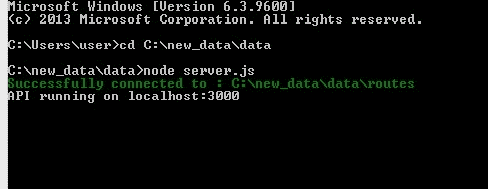
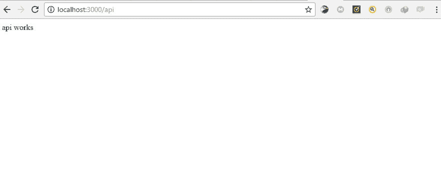
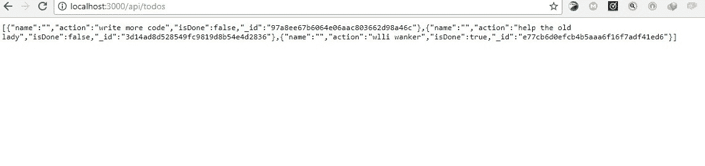
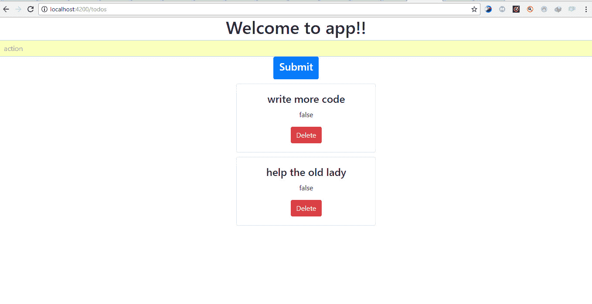

# 与真实托管数据一起工作

现代网络应用通常是数据驱动的。大多数情况下，我们需要从各种资源中 CRUD（创建、读取、更新和删除）数据，或者消费 API。Angular 使我们能够轻松地处理外部数据源，用于我们的组件。

Angular 提供了一个简单的 HTTP API，它为我们提供了 HTTP 功能。它是基于现代浏览器暴露的本地 XMLHttpRequest 接口构建的，并且使用它，我们可以执行以下任何 HTTP 操作：

+   获取：从资源请求数据

+   发布：向资源提交数据

+   更新：在资源中修改数据

+   删除：删除指定的资源

在本章中，我们将学习如何使用 Angular 消费 API 并使我们的应用数据驱动。

# 可观察对象

**可观察对象**，类似于承诺，有助于处理应用程序中的异步事件。可观察对象与承诺之间的关键区别是：

+   可观察对象可以在一段时间内处理多个值，而承诺只被调用一次并返回一个值

+   可观察对象是可取消的，而承诺不是

要使用可观察对象，Angular 利用**JavaScript 的响应式扩展**（**RxJs**）的可观察对象库。Angular 在处理 HTTP 请求和响应时广泛使用可观察对象；我们将在本章中了解更多关于它们的内容。

# HTTP 模块

要在组件中使用 HTTP，你需要安装`HttpModule`，它在你的应用程序模块中提供它。首先，导入模块：

```js
import { HttpModule } from '@angular/http';
```

接下来，你将模块包含在你的应用程序中注册的导入数组中，紧随`BrowserModule`之后：

```js
// app.module.ts
@NgModule({
imports: [
BrowserModule,
HttpModule,
],
})
```

# 构建简单的 todo 演示应用

让我们构建一个简单的`todo`应用，以便更好地理解如何在 Angular 应用中处理数据。

将使用 Angular-CLI 快速搭建应用程序。应用程序的 API 将使用 Express.js 构建，我们的 Angular 应用将连接到这个 API 以 CRUD todo 数据。

# 项目设置

使用 CLI 创建新项目：

```js
ng new [project name]
```

`ng new`命令创建一个新的 Angular 应用

# 构建 API

从命令行，使用 npm 安装 express、body-parser 和 cors 作为依赖项：

```js
npm install express body-parser cors
```

如果你使用 npm 5，你不需要指定`-S`或`--save`标志来在`package.json`文件中将它保存为依赖项。

接下来，我们将在 Angular 项目的根目录中创建一个`server.js`文件，它将包含我们所有的 API 逻辑：

```js
// server.js
const express = require('express');
const path = require('path');
const http = require('http');
const bodyParser = require('body-parser');
const cors = require('cors');
const app = express();
// Get API routes
const route = require('./routes/index');
// Parser for POST data
app.use(bodyParser.json());
app.use(bodyParser.urlencoded({ extended: false }));
// Use CORS
app.use(cors());
// Declare API routes
app.use('/api', route);
/**
* Get port from environment. Default is 3000
*/
const port = process.env.PORT || '3000';
/**
* Create HTTP server.
*/
const server = http.createServer(app);
/**
* Listen on port
*/
app.listen(port, function () {
console.log(`API running on port ${port}`)
} );
```

此文件使用 ES6 的新版本，所以你应该注意你的代码编辑器不立即识别的情况。

`/api`路由指向`./routes/index.js`文件，但我们还没有它。在这个下一步中，我们将创建它。仍然在`root`目录中，创建一个名为`routes`的文件夹，并在其中创建一个名为`index.js`的文件：

```js
// routes/index.js
const express = require('express');
// create a new router object
const router = express.Router();
/* GET api listing. */
router.get('/', (req, res) => {
res.send('api works');
});
module.exports = router;
```

要启动服务器，输入以下命令：

```js
node server.js
```

当服务器开始运行时的输出如下：



这里我们可以看到服务器正在运行，并且监听端口 3000。

打开浏览器并访问`localhost:3000/api/`：



如果你能在前面的图像中看到响应，那么 API 就正常工作了。现在我们可以引入更复杂的逻辑，以便我们有实际的数据可以操作。

# 安装 diskdb

**Diskdb** 是一个轻量级的基于磁盘的 JSON 数据库，具有类似 MongoDB 的 API，适用于 Node。我们可以使用以下命令安装 diskdb：

```js
npm install diskdb
```

在目录根目录下创建一个 `todos.json` 文件。这个文件将作为我们的数据库集合，其中包含我们的待办事项。你可以在 [`www.npmjs.com/package/diskdb`](https://www.npmjs.com/package/diskdb) 上了解更多关于 diskdb 的信息。

# 更新 API 端点

让我们更新 `routes/index.js` 文件，以包含处理我们的待办事项的新逻辑：

```js
// routes/index.js
const express = require('express');
const router = express.Router();
// require diskdb
const db = require('diskdb');
db.connect(__dirname, ['todos']);
// store Todo
router.post('/todo', function(req, res, next) {
var todo = req.body;
if (!todo.action || !(todo.isDone + '')) {
res.status(400);
res.json({
error: 'bad data'
});
} else {
db.todos.save(todo);
res.json(todo);
}
});
// get Todos
router.get('/todos', function(req, res, next) {
const todos = db.todos.find();
res.json(todos);
});
// update Todo
router.put('/todo/:id', function(req, res, next) {
const todo = req.body;
db.todos.update({_id: req.params.id}, todo);
res.json({ msg: `${req.params.id} updated`});
});
// delete Todo
router.delete('/todo/:id', function(req, res, next) {
db.todos.remove({
_id: req.params.id
});
res.json({ msg: `${req.params.id} deleted` });
});
module.exports = router;
```

在前面的代码中，我们能够使用 `get`、`post`、`put` 和 `delete` 端点更新我们的 API。

接下来，我们将使用一些数据初始化我们的数据库。更新 `todos.json` 文件：

```js
[{
"action":"write more code",
"isDone":false,"
_id":"97a8ee67b6064e06aac803662d98a46c"
},{
"action":"help the old lady",
"isDone":false,"
_id":"3d14ad8d528549fc9819d8b54e4d2836"
},{
"action":"study",
"isDone":true,"
_id":"e77cb6d0efcb4b5aaa6f16f7adf41ed6"
}]
```

现在，我们可以重新启动我们的服务器并访问 `localhost:3000/api/todos` 来查看我们的 API 在行动：



数据库中的待办事项列表。

# 创建 Angular 组件

接下来，我们将创建一个 `todo` 组件。我们可以使用 Angular-CLI 轻松地做到这一点，使用以下命令：

```js
ng generate component todos
```

这将生成以下文件：`todos.component.ts`、`todos.component.html` 和 `todos.component.ts`。待办事项组件也自动导入到 `app.module.ts`：

```js
// app.module.ts
import { BrowserModule } from '@angular/platform-browser';
import { NgModule } from '@angular/core';
import { AppComponent } from './app.component';
import { TodosComponent } from './todos/todos.component';
@NgModule({
declarations: [
AppComponent,
TodosComponent
],
imports: [
BrowserModule
],
providers: [],
bootstrap: [AppComponent]
})
export class AppModule { }
```

我们应该确保在 `src/index.html` 的 head 标签内添加 `<base href="/">`。这是为了告诉路由器如何组合导航 URL。当使用 Angular-CLI 生成 angular 项目时，自动创建了 `index.html` 文件：

```js
<!-- index.html -->
<!doctype html>
<html lang="en">
<head>
<meta charset="utf-8">
<title>Data</title>
<base href="/">
<meta name="viewport" content="width=device-width, initial-scale=1">
<link rel="icon" type="image/x-icon" href="favicon.ico">
</head>
<body>
<app-root></app-root>
</body>
</html>
```

# 创建应用程序路由

接下来，我们将创建一个 `/todos` 路由，并让我们的应用默认重定向到它。

首先，从 `@angular/router` 导入 `RouterModule` 并将其添加到 `AppModule` 的 imports 数组中：

```js
import { RouterModule } from '@angular/router';
...
imports: [
...
RouterModule.forRoot(ROUTES)
],
```

在 `ngModule` 声明上方创建一个 `ROUTES` 数组，并向其中添加以下路由定义：

```js
const ROUTES = [
{
path: '',
redirectTo: 'todos',
pathMatch: 'full'
},
{
path: 'todos',
component: TodosComponent
}
]
```

在 `app.component.html` 文件中，让我们添加一个路由出口，以便渲染路由：

```js
<div style="text-align:center">
<h1>
Welcome to {{ title }}!
</h1>
<router-outlet></router-outlet>
```

# 创建待办事项服务

接下来，我们将创建一个服务来处理调用并将我们的组件连接到 express API。要使用 Angular-CLI 生成服务：

```js
ng generate service todos
```

服务已创建但尚未注册——为了在我们的应用中注册它，我们需要将其添加到主应用程序模块的 providers 部分。

Angular-CLI 不会自动注册服务。

将 TodosService 添加到 providers 数组：

```js
import {TodosService} from './todos.service';
...
providers: [TodosService],
...
})
export class AppModule { }
```

现在，在我们的服务中，我们将向 express 服务器发出 HTTP 调用来执行我们的 CRUD 操作。首先，我们将导入 `HTTP`、`Headers` 和 `rxjs/add/operator/map`：

```js
import { Injectable } from '@angular/core';
import { Http, Headers} from '@angular/http';
import 'rxjs/add/operator/map';
@Injectable()
export class TodosService {
// constructor and methods to execute the crud operations will go in here
}
```

定义一个构造函数并注入 HTTP 服务：

```js
import { Injectable } from '@angular/core';
import { Http, Headers } from '@angular/http';
import 'rxjs/add/operator/map';
@Injectable()
export class TodosService {
constructor(private http: Http) {}
}
Next, we will define a method that will fetch all todos from the API. Updating todos.service.ts:
// todo.service.ts
...
export class TodosService {
isDone: false;
constructor(private http: Http) {}
// Get all todos
getTodos() {
return this.http
.get('http://localhost:3000/api/todos')
.map(res => res.json());
}
}
```

在前面的代码中，我们使用了 `HttpModule` 来向我们的 API 发送一个简单的 `get` 请求以检索待办事项列表。请求的响应随后以 JSON 格式返回。

接下来，我们将编写一个名为 `addTodos()` 的方法来存储待办事项。这个方法将用于执行存储待办事项的 POST 请求。

```js
// todo.service.ts
...
addTodos(todo) {
let headers = new Headers();
headers.append('Content-Type', 'application/json');
return this.http
.post('http://localhost:3000/api/todo', JSON.stringify(todo), { headers })
.map(res => res.json());
}
}
```

在前面的代码中，我们设置了新的头部并设置了`Content-Type`以告诉服务器它将接收什么类型的内容（`'application/json'`）。

我们使用了`http.post()`方法来发送 POST 请求。参数`JSON.stringify(todo)`表示我们希望将新的待办事项作为 JSON 编码的字符串发送。最后，我们可以以 JSON 格式返回 API 的响应。

接下来，我们将定义一个名为`deleteTodo()`的删除方法。此方法将用于执行删除请求。这使得我们能够从待办事项列表中删除待办事项。再次更新`todos.service.ts`：

```js
import { Injectable } from '@angular/core';
import { Http, Headers } from '@angular/http';
import 'rxjs/add/operator/map';
@Injectable()
export class TodosService {
constructor(private http: Http) {}
getTodos() {
return this.http
.get('http://localhost:3000/api/todos')
.map(res => res.json());
}
addTodos(todo) {
let headers = new Headers();
headers.append('Content-Type', 'application/json');
return this.http
.post('http://localhost:3000/api/todo', JSON.stringify(todo), { headers })
.map(res => res.json());
}
deleteTodo(id) {
return this.http
.delete(`http://localhost:3000/api/todo/${id}`)
.map(res => res.json());
}
}
```

在前面的代码中，我们定义了`deleteTodo()`方法，它将待删除帖子的`id`作为其唯一参数。此方法向 API 发送删除请求以从数据库中删除指定的待办事项。API 的响应也以 JSON 格式返回。

最后，我们将定义一个名为`updateStatus()`的方法。此方法将用于执行`put`请求以更改待办事项项的状态。

```js
import { Injectable } from '@angular/core';
import { Http, Headers } from '@angular/http';
import 'rxjs/add/operator/map';
@Injectable()
export class TodosService {
isDone: false;
constructor(private http: Http) {}
getTodos() {
return this.http
.get('http://localhost:3000/api/todos')
.map(res => res.json());
}
addTodos(todo) {
let headers = new Headers();
headers.append('Content-Type', 'application/json');
return this.http
.post('http://localhost:3000/api/todo', JSON.stringify(todo), { headers })
.map(res => res.json());
}
deleteTodo(id) {
return this.http
.delete(`http://localhost:3000/api/todo/${id}`)
.map(res => res.json());
}
updateStatus(todo) {
let headers = new Headers();
headers.append('Content-Type', 'application/json');
return this.http
.put('http://localhost:3000/api/todo/' + todo._id, JSON.stringify(todo), {
headers: headers
})
.map(res => res.json());
}
}
```

在前面的代码中，我们创建了一个`updateStatus()`方法，该方法与`addTodos()`方法类似。这里的区别在于，`updateStatus()`方法执行一个`put`请求。我们还把`todo._id`连接到被调用的 API 端点。这使得我们能够从待办事项列表中修改单个项目的状态。

记住，我们在服务中使用了 HTTP API，因此，我们应该在`app.module.ts`中导入`HttpModule`并将其包含在导入数组中：

```js
import {HttpModule} from '@angular/http';
...
imports: [
HttpModule,
BrowserModule,
RouterModule.forRoot(ROUTES)
],
...
```

# 将服务与我们的待办事项组件连接起来

首先，我们必须在待办事项组件中导入待办事项服务：

```js
import {TodosService} from '../todos.service';
```

然后在组件的构造函数中添加`TodosService`类：

```js
constructor(private todoService: TodosService) { }
```

现在，我们将使用待办事项服务来`get`、`create`、`delete`和`update`待办事项。

这是我们待办事项组件应该看起来像的：

```js
import { Component, OnInit } from '@angular/core';
import { TodosService } from '../todos.service';
@Component({
selector: 'app-todos',
templateUrl: './todos.component.html',
styleUrls: ['./todos.component.css']
})
export class TodosComponent implements OnInit {
//define data types
todos: any = [];
todo: any;
action: any;
name: any;
isDone: boolean;
constructor(private todoService: TodosService) {}
ngOnInit() {
this.todoService.getTodos().subscribe(todos => {
this.todos = todos;
});
}
addTodos(event) {
event.preventDefault();
let newTodo = {
name: this.name,
action: this.action,
isDone: false
};
this.todoService.addTodos(newTodo).subscribe(todo => {
this.todos.push(todo);
this.name = '';
this.action = '';
});
}
deleteTodo(id) {
let todos = this.todos;
this.todoService.deleteTodo(id).subscribe(data => {
const index = this.todos.findIndex(todo => todo._id == id);
todos.splice(index, 1)
});
}
updateStatus(todo) {
var _todo = {
_id: todo._id,
action: todo.action,
isDone: !todo.isDone
};
this.todoService.updateStatus(_todo).subscribe(data => {
const index = this.todos.findIndex(todo => todo._id == _todo._id)
this.todos[index] = _todo;
});
}
choice(todo) {
console.log(todo);
return todo.isDone;
}
}
```

我们刚刚使服务和组件之间建立了通信。现在`component.ts`文件可以使用服务和其中的方法。

现在我们已经连接了服务和组件，我们必须在浏览器中显示待办事项操作，这将在`todos.component.html`中完成。

# 实现视图

要显示待办事项，我们将使用：

+   Angular 的`*ngFor`指令，它遍历待办事项数组并为数组中的每个待办事项渲染此模板的一个实例

+   Angular 的插值绑定语法，`{{}}`

更新`todos.component.html`：

```js
<div class="container">
<form (submit) = "addTodos($event)">
<input type="text"
class="form-control" placeholder="action"
[(ngModel)] ="action" name="action">
<button type="submit"><h4>Submit</h4></button>
</form>
<div *ngFor="let todo of todos">
<div class="container">
<p (click)="updateStatus(todo)" [ngStyle]="{ 'text-decoration': todo.isDone ? 'line-through' : ''}" >Action: {{todo.action}}</p>
{{todo.isDone}}
<button (click) ="deleteTodo(todo._id)" >Delete</button>
</div>
</div>
</div>
```

为了使我们的应用看起来更好，我们将使用 Bootstrap。**Bootstrap**是一个强大的前端框架，用于创建网页和用户界面组件，如表单、模态框、手风琴、轮播图和标签页：

```js
<!-- Index.html --&gt;
<!doctype html>
<html lang="en">
<head>
<link rel="stylesheet" href="https://maxcdn.bootstrapcdn.com/bootstrap/4.0.0-beta/css/bootstrap.min.css" integrity="sha384-/Y6pD6FV/Vv2HJnA6t+vslU6fwYXjCFtcEpHbNJ0lyAFsXTsjBbfaDjzALeQsN6M" crossorigin="anonymous">
<meta charset="utf-8">
<title>Data</title>
<base href="/">
<meta name="viewport" content="width=device-width, initial-scale=1">
<link rel="icon" type="image/x-icon" href="favicon.ico">
</head>
<body>
<app-root></app-root>
</body>
</html>
```

更新`todos.component.html`：

```js
<form (submit) = "addTodos($event)">
<input type="text" class="form-control" placeholder="action" [(ngModel)] ="action" name="action">
<button class="btn btn-primary" type="submit"><h4>Submit</h4></button>
</form>
<div class="card pos" style="width: 20rem;" *ngFor="let todo of todos">
<div class="card-body">
<h4 class="card-title" (click)="updateStatus(todo)" [ngStyle]="{ 'text-decoration': todo.isDone ? 'line-through' : ''}">{{todo.action}}</h4>
<p class="card-text">{{todo.isDone}}</p>
<button (click) ="deleteTodo(todo._id)" class="btn btn-danger">Delete</button>
</div>
</div>
We'll also update app.component.css file to add some optional extra styling.
// app.component.css
.isDone{
text-decoration: line-through;
}
.pos{
margin-left: 40%;
margin-top: 10px;
}
```

打开命令行/终端并导航到项目文件夹。运行 node `server.js`以启动服务器。在`project`文件夹中打开另一个终端窗口并运行`ng serve`以提供 Angular 应用。

打开浏览器并访问`localhost:4200`。以下截图显示了结果应该看起来像：



我们通过通过服务向节点服务器发送 HTTP 请求并然后通过组件将结果渲染到 DOM 中，成功地创建了一个待办事项应用程序。您可以添加待办事项、删除待办事项、获取所有待办事项，当您点击待办事项时，布尔值会改变，并且在该特定待办事项上会出现删除线。当您重新加载浏览器时，您可以看到对待办事项列表所做的更改已保留。

让我们对我们所做的一切进行简要回顾：

+   首先，我们使用 Angular-CLI 创建了一个 Angular 应用程序

+   然后，我们创建了一个服务器文件，其中我们引入了我们的依赖项，创建了一个 express 应用程序，设置了我们的 API 路由，声明了服务器监听的端口，添加了用于解析 post 数据的解析器等等

+   然后，我们定义了我们的数据源，它是一个与 **diskdb** 通信的 `.json` 文件待办事项

+   创建了一个 Angular 组件

+   使用 `get`、`post`、`put` 和 `delete` 方法创建了一个与 REST API 通信的服务

让我们看看另一个例子。我们将创建一个简单的应用程序来显示用户列表以及他们的电子邮件和电话号码。用户还将有一个真或假的标志，表示他们是否可用或不可用。

# 使用 Angular 构建用户目录

我们即将构建的应用程序将有一个 REST API，它将在本例的执行过程中创建。在这个简单的例子中，我们将创建一个 `users` 应用程序，它将非常简单。该应用程序基本上是一个包含用户列表及其电子邮件地址和电话号码的表格。表格中的每个用户都将有一个 *活动* 状态，其值为布尔值。我们将能够将特定用户的 *活动* 状态从假更改为真，反之亦然。该应用程序将使我们能够添加新用户并从表中删除用户。就像上一个例子一样，diskDB 将被用作本例的数据库。我们将有一个 Angular 服务，其中包含负责与 REST 端点通信的方法。这些方法将负责向 REST API 发送 `get`、`post`、`put` 和 `delete` 请求。服务中的第一个方法将负责向 API 发送 `get` 请求。这将使我们能够从后端检索所有用户。接下来，我们将有一个另一个方法，它向 API 发送 `post` 请求。这将使我们能够将新用户添加到现有用户的数组中。

下一个方法将负责向 API 发送 `delete` 请求，以便启用用户的删除。最后，我们将有一个发送 `put` 请求到 API 的方法。这将是我们编辑/修改用户状态的方法。为了与 RESTful API 进行这些请求，我们必须使用 HttpModule。本节的目标是巩固你对 HTTP 的理解。作为一个 JavaScript 和，实际上是一个 Angular 开发者，你几乎肯定会与 API 和 Web 服务器进行交互。今天开发者使用的许多数据都是以 API 的形式，为了与这些 API 进行交互，我们需要不断地使用 HTTP 请求。事实上，HTTP 是网络数据通信的基础。

# 创建一个新的 Angular 应用

如前所述，要启动一个新的 Angular 应用，请运行以下命令：

```js
ng new user
```

这创建了 Angular 2 用户应用。

安装以下依赖项：

+   Express

+   Body-parser

+   Cors

```js
npm install express body-parser cors --save
```

# 创建一个 Node 服务器

在项目目录的根目录下创建一个名为 `server.js` 的文件。这将是我们 Node 服务器。

在 `server.js` 中填充以下代码块：

```js
// Require dependencies
const express = require('express');
const path = require('path');
const http = require('http');
const cors = require('cors');
const bodyParser = require('body-parser');
// Get our API routes
const route = require('./route');
const app = express();
app.use(bodyParser.json());
app.use(bodyParser.urlencoded({ extended: false }));
// Use CORS
app.use(cors());
// Set our api routes
app.use('/api', route);
/**
* Get port from environment.
*/
const port = process.env.PORT || '3000';
/**
* Create HTTP server.
*/
const server = http.createServer(app);
//Listen on provided port
app.listen(port);
console.log('server is listening');
```

这里发生的事情相当简单：

+   我们引入并使用了依赖项

+   我们定义并设置了 API 路由

+   我们为我们的服务器设置了一个监听端口

API 路由正在从 `./route` 中导入，但这个路径尚不存在。让我们快速创建它。

在项目目录的根目录下，创建一个名为 `route.js` 的文件。这里将创建 API 路由。我们需要有一个数据库的形式，从中我们可以获取、发布、删除和修改数据。

就像在之前的例子中一样，我们将使用 diskdb。路由将基本上与第一个例子中的模式相同。

# 安装 diskDB

在项目文件夹中运行以下命令以安装 diskdb：

```js
npm install diskdb
```

在项目目录的根目录下创建一个 `users.json` 文件，作为我们的数据库集合，其中包含我们的用户详细信息。

在 `users.json` 中填充以下内容：

```js
[{"name": "Marcel", "email": "test1@gmail.com", "phone_number":"08012345", "isOnline":false}]
```

现在，更新 `route.js`。

```js
route.js
const express = require('express');
const router = express.Router();
const db = require('diskdb');
db.connect(__dirname, ['users']);
//save
router.post('/users', function(req, res, next) {
var user = req.body;
if (!user.name && !(user.email + '') && !(user.phone_number + '') && !(user.isActive + '')) {
res.status(400);
res.json({
error: 'error'
});
} else {
console.log('ds');
db.users.save(todo);
res.json(todo);
}
});
//get
router.get('/users', function(req, res, next) {
var foundUsers = db.users.find();
console.log(foundUsers);
res.json(foundUsers);
foundUsers = db.users.find();
console.log(foundUsers);
});
//updateUsers
router.put('/user/:id', function(req, res, next) {
var updUser = req.body;
console.log(updUser, req.params.id)
db.users.update({_id: req.params.id}, updUser);
res.json({ msg: req.params.id + ' updated' });
});
//delete
router.delete('/user/:id', function(req, res, next) {
console.log(req.params);
db.users.remove({
_id: req.params.id
});
res.json({ msg: req.params.id + ' deleted' });
});
module.exports = router;
```

我们使用 API 路由创建了一个 RESTful API，使用 diskDB 作为数据库。

使用以下命令启动服务器：

```js
node server.js
```

服务器正在运行，并且正在监听指定的端口。现在，打开浏览器并访问 `http://localhost:3000/api/users`。

这里，我们可以看到我们输入到 `users.json` 文件中的数据。这表明我们的路由正在工作，并且我们从数据库中获取了数据。

# 创建一个新的组件

运行以下命令以创建一个新的组件：

```js
ng g component user
```

这创建了`user.component.ts`、`user.component.html`、`user.component.css`和`user.component.spec.ts`文件。`User.component.spec.ts`用于测试，因此我们将在本章中不使用它。新创建的组件会自动导入到`app.module.ts`中。我们必须告诉根组件关于用户组件的信息。我们将通过将`user.component.ts`中的选择器导入到根模板组件（`app.component.html`）中来实现这一点：

```js
<div style="text-align:center">
<app-user></app-user>
</div>
```

# 创建一个服务

下一步是创建一个与之前创建的 API 交互的服务：

```js
ng generate service user
```

这创建了一个名为`user.service.ts`的用户服务。接下来，将`UserService`类导入到`app.module.ts`中，并将其包含在提供者数组中：

```js
Import rxjs/add/operator/map in the imports section.
import { Injectable } from '@angular/core';
import { Http, Headers } from '@angular/http';
import 'rxjs/add/operator/map';
Within the UserService class, define a constructor and pass in the angular 2 HTTP service.
import { Injectable } from '@angular/core';
import { Http, Headers } from '@angular/http';
import 'rxjs/add/operator/map';
@Injectable()
export class UserService {
constructor(private http: Http) {}
}
```

在服务类中，编写一个方法，通过 API 获取所有用户及其详细信息，发送一个`get`请求：

```js
getUser() {
return this.http
.get('http://localhost:3000/api/users')
.map(res => res.json());
}
```

编写一个发送`post`请求并创建新待办事项的方法：

```js
addUser(newUser) {
var headers = new Headers();
headers.append('Content-Type', 'application/json');
return this.http
.post('http://localhost:3000/api/user', JSON.stringify(newUser), {
headers: headers
})
.map(res => res.json());
}
```

编写另一个方法来发送一个`delete`请求。这将使我们能够从用户集合中删除一个用户：

```js
deleteUser(id) {
return this.http
.delete('http://localhost:3000/api/user/' + id)
.map(res => res.json());
}
```

最后，编写一个发送`put`请求的方法。此方法将使我们能够修改用户的状态：

```js
updateUser(user) {
var headers = new Headers();
headers.append('Content-Type', 'application/json');
return this.http
.put('http://localhost:3000/api/user/' + user._id, JSON.stringify(user), {
headers: headers
})
.map(res => res.json());
}
```

更新`app.module.ts`以导入`HttpModule`和`FormsModule`，并将它们包含在导入数组中：

```js
import { HttpModule } from '@angular/http';
import { FormsModule } from '@angular/forms';
.....
imports: [
.....
HttpModule,
FormsModule
]
```

下一步是教会用户组件使用该服务：

```js
Import UserService in user.component.ts.
import {UserService} from '../user.service';
Next, include the service class in the user component constructor.
constructor(private userService: UserService) { }.
Just below the exported UserComponent class, add the following properties and define their data types:
users: any = [];
user: any;
name: any;
email: any;
phone_number: any;
isOnline: boolean;
```

现在，我们可以在用户组件中使用用户服务的方法。

# 更新`user.component.ts`

在`ngOnInit`方法中，使用用户服务从 API 获取所有用户：

```js
ngOnInit() {
this.userService.getUser().subscribe(users => {
console.log(users);
this.users = users;
});
}
```

在`ngOnInit`方法下方，编写一个方法，使用用户服务中的`post`方法添加新用户：

```js
addUser(event) {
event.preventDefault();
var newUser = {
name: this.name,
email: this.email,
phone_number: this.phone_number,
isOnline: false
};
this.userService.addUser(newUser).subscribe(user => {
this.users.push(user);
this.name = '';
this.email = '';
this.phone_number = '';
});
}
```

让我们使用用户服务中的`delete`方法来使我们能够删除用户：

```js
deleteUser(id) {
var users = this.users;
this.userService.deleteUser(id).subscribe(data => {
console.log(id);
const index = this.users.findIndex(user => user._id == id);
users.splice(index, 1)
});
}
```

最后，我们将使用用户服务来对 API 进行`put`请求：

```js
updateUser(user) {
var _user = {
_id: user._id,
name: user.name,
email: user.email,
phone_number: user.phone_number,
isActive: !user.isActive
};
this.userService.updateUser(_user).subscribe(data => {
const index = this.users.findIndex(user => user._id == _user._id)
this.users[index] = _user;
});
}
```

我们已经与 API、服务和组件进行了所有通信。我们必须更新`user.component.html`以在浏览器中展示我们所做的一切。

我们将使用 Bootstrap 进行样式设计。因此，我们必须在`index.html`中导入 Bootstrap CDN：

```js
<!doctype html>
<html lang="en">
<head>
//bootstrap CDN
<link rel="stylesheet" href="https://maxcdn.bootstrapcdn.com/bootstrap/4.0.0-beta/css/bootstrap.min.css" integrity="sha384-/Y6pD6FV/Vv2HJnA6t+vslU6fwYXjCFtcEpHbNJ0lyAFsXTsjBbfaDjzALeQsN6M" crossorigin="anonymous">
<meta charset="utf-8">
<title>User</title>
<base href="/">
<meta name="viewport" content="width=device-width, initial-scale=1">
<link rel="icon" type="image/x-icon" href="favicon.ico">
</head>
<body>
<app-root></app-root>
</body>
</html>
```

# 更新`user.component.html`

这是用户组件的组件模板：

```js
<form class="form-inline" (submit) = "addUser($event)">
<div class="form-row">
<div class="col">
<input type="text" class="form-control" [(ngModel)] ="name" name="name">
</div>
<div class="col">
<input type="text" class="form-control" [(ngModel)] ="email" name="email">
</div>
<div class="col">
<input type="text" class="form-control" [(ngModel)] ="phone_number" name="phone_number">
</div>
</div> <br>
<button class="btn btn-primary" type="submit" (click) = "addUser($event)"><h4>Add User</h4></button>
</form>
<table class="table table-striped" >
<thead>
<tr>
<th>Name</th>
<th>Email</th>
<th>Phone_Number</th>
<th>Active</th>
</tr>
</thead>
<tbody *ngFor="let user of users">
<tr>
<td>{{user.name}}</td>
<td>{{user.email}}</td>
<td>{{user.phone_number}}</td>
<td>{{user.isActive}}</td>
<td><input type="submit" class="btn btn-warning" value="Update Status" (click)="updateUser(user)" [ngStyle]="{ 'text-decoration-color:': user.isActive ? 'blue' : ''}"></td>
<td><button (click) ="deleteUser(user._id)" class="btn btn-danger">Delete</button></td>
</tr>
</tbody>
</table>
```

代码块中有很多内容，让我们深入代码块：

+   我们有一个表单，它接受三个输入和一个提交按钮，当点击时会触发`addUser()`方法

+   有一个删除按钮，当点击时会触发`delete`方法

+   还有一个更新状态输入元素，当点击时会触发`updateUser()`方法

+   我们创建了一个表格，使用 Angular 的`*ngFor`指令和 Angular 的插值绑定语法`{{}}`来显示我们的用户详细信息

将添加一些额外的样式到项目中。转到`user.component.css`并添加以下内容：

```js
form{
margin-top: 20px;
margin-left: 20%;
size: 50px;
}
table{
margin-top:20px;
height: 50%;
width: 50%;
margin-left: 20%;
}
button{
margin-left: 20px;
}
```

# 运行应用

打开两个命令行界面/终端。在它们两个中，导航到项目目录。在一个中运行`node server.js`以启动服务器。在另一个中运行`ng serve`以提供 Angular 2 应用程序。

打开浏览器并访问`localhost:4200`。

在这个简单的用户应用程序中，我们可以执行所有 CRUD 操作。我们可以创建新用户，获取用户，删除用户，以及更新用户的州。

默认情况下，新添加的用户活跃状态为 false。可以通过点击更改状态按钮来修改。

# 摘要

在开发任何应用程序时，使用数据库或 API 的实际数据非常重要。HTTP 以及可观察对象和 Rxjs 使得从 API 中处理所需的数据集成为可能，并且可以执行所有 CRUD 操作。

在下一章中，我们将探讨编写单元测试和调试。
