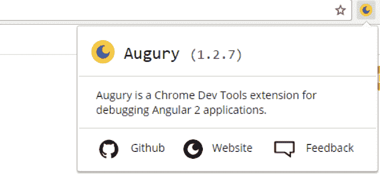
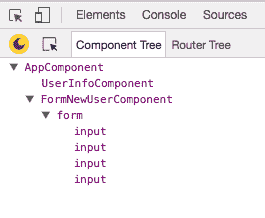
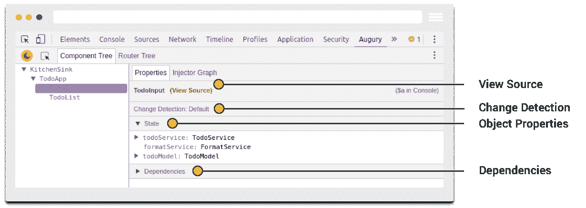
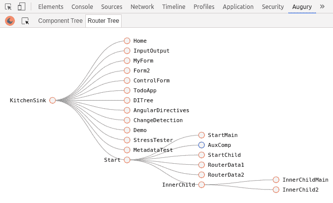
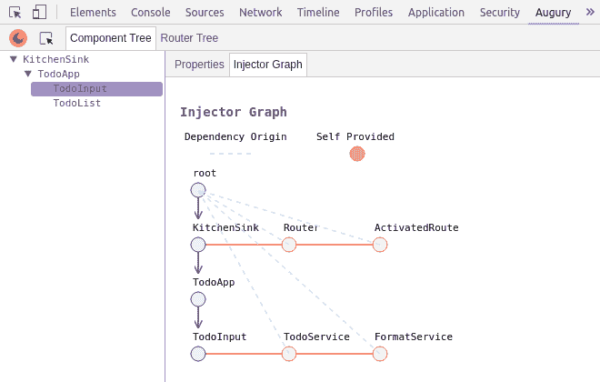

# 第十二章：测试和调试

测试对于构建生产就绪的应用程序至关重要。在单元测试中，我们测试组件，使其独立于外部源，以确保其按预期工作。Angular 2 默认包含测试功能。在本章中，我们将探讨对以下元素进行单元测试：

+   组件

+   服务

+   管道

+   指令

# Angular 2 测试工具

帮助 Angular 2 进行测试的一些工具如下：

+   Jasmine

+   Karma

+   Protractor

+   Angular 测试平台

让我们更深入地了解每一个。

# Jasmine

Jasmine 是一个开源的测试框架。它使用行为驱动符号，从而提高了测试。

# Jasmine 的主要概念

在深入探讨如此实用的测试案例之前，以下是您应该了解的一些 Jasmine 概念：

+   **套件**：这些是在 `describe` 块中编写并由其描述的。它们以函数的形式出现。

+   **规格定义**：`it (string, function)` 函数。此函数体包含实际的断言。

+   **期望**：这些是评估为布尔值的断言。这用于检查输入是否等于预期值。

+   **匹配器**：这些是用于常见断言的帮助器，例如，`toB0`（预期），`toEqual`（预期）。

# Karma

Karma 是由 Angular 团队创建的 JavaScript 测试运行器。Karma 可以成为项目的持续集成过程的一部分，也可以成为其开发的一部分。

# Protractor

Protractor 是用于 Angular 应用程序的端到端测试框架。使用 Protractor，您可以设置期望并针对我们的假设进行测试。正如其名所示，端到端测试不仅确保系统本身可以工作，而且还验证其与外部系统的功能。它们以最终用户体验的方式探索应用程序。

# Angular 测试平台

Angular 测试平台用于测试类与 Angular 和 DOM 的交互。Angular 测试平台赋予我们自由，可以在没有任何对 Angular 或注入值的依赖的情况下检查类的实例。

在本章中，我们将专注于 Jasmine 和 Karma 进行测试。

当使用 Angular-CLI 创建新项目时，包含使用 Protractor 进行端到端测试的 `e2e` 文件夹也会创建，同时还会创建 `karma.conf.js` 和 `protractor.conf.js` 文件，这些是 Karma 和 Protractor 测试的配置文件。

# 使用 Karma（与 Jasmine）

使用 Karma，您可以在运行应用程序的同时测试您的代码，因为 Karma 为测试创建了一个浏览器环境。除了您的浏览器之外，您还可以在其他设备上测试您的代码，例如手机和平板电脑。

Jasmine 是一个用于测试 JavaScript 代码的行为驱动开发框架。作为一个无依赖性的框架，Jasmine 不需要 DOM，通常与 Karma 一起使用。我们现在将创建一个新项目并测试其元素。

# 创建新项目

我们将使用以下命令创建一个名为 `Angular-test` 的新项目：

```js
ng new Angular-test
```

# 安装 Karma CLI

要安装 Karma CLI，请输入以下命令：

```js
npm install -g karma-cli
```

我们的测试将在 `.spec.ts` 文件中执行。在 `./app/` 文件夹中创建一个新的测试文件（`sampletest.spec.ts`），并复制以下内容：

```js
// ./app/sampletest.spec.ts
describe('Sample Test', () => {
 it('true is true', () => expect(true).toBe(true));
 });

 import {AppComponent} from './app.component';

 describe('AppComponent', () => {
 beforeEach(function() {
 this.app = new AppComponent();
 });

 it('should have hello property', function() {
 expect(this.app.hello).toBe('Hello, World!');
 });
 });
```

在前面的代码中，我们首先编写一个示例测试来展示 Jamine 中的主要概念。我们创建一个测试套件，定义我们的测试套件，并编写期望。在示例测试中，我们进行一个简单的检查，以查看 `true` 是否与 `true` 相同。

我们还为 `AppComponent` 编写了一个简单的测试。我们期望组件有一个 `hello` 属性，其值等于 `Hello, World`。让我们通过更新 `app.component.ts` 来确保测试通过：

```js
private hello: string = 'Hello, World!';
```

我们通过创建具有 `.spec.ts` 扩展名的文件来满足 Karma 的配置要求。

你也可以测试多个组件。例如，当你通过 Angular CLI 创建新组件时，它会自动为组件创建测试文件（`.spec.ts`），这些文件除了测试组件是否与其他组件正确协同工作外，不做任何事情。对于 Angular 来说，惯例是为每个 `.ts` 文件创建一个 `.spec.ts` 文件。当你使用 `ng test` 命令时，这些文件将通过 Karma 任务运行器使用 Jasmine JavaScript 测试框架运行。

# Karma 配置

为了配置我们的 Karma，我们需要更新 `karma.conf.js` 文件。默认文件具有以下内容：

```js
// ./karma.conf.js.
module.exports = function (config) {
 config.set({
 basePath: '',
 frameworks: ['jasmine', 'angular-cli'],
 plugins: [
 require('karma-jasmine'),
 require('karma-chrome-launcher'),
 require('karma-remap-istanbul'),
 require('angular-cli/plugins/karma')
 ],
 files: [
 { pattern: './src/test.ts', watched: false }
 ],
 preprocessors: {
 './src/test.ts': ['angular-cli']
 },
 remapIstanbulReporter: {
 reports: {
 html: 'coverage',
 lcovonly: './coverage/coverage.lcov'
 }
 },
 angularCli: {
 config: './angular-cli.json',
 environment: 'dev'
 },
 reporters: ['progress', 'karma-remap-istanbul'],
 port: 9876,
 colors: true,
 logLevel: config.LOG_INFO,
 autoWatch: true,
 browsers: ['PhantomJS'],
 singleRun: false
 });
 };
```

这里，我们展示将使用 PhantomJS 浏览器；Jasmine 测试框架和 Webpack 将用于文件打包。

# 组件测试

组件是 Angular 的核心。它们是围绕其构建其余框架的核。我们将探讨组件是什么，为什么它很重要，以及如何对其进行测试。

我们的测试策略围绕验证组成组件的类的属性和方法是否正确。

当为组件编写单元测试时，我们手动初始化组件并注入任何依赖项，而不是引导应用程序。

`TestBed` 函数将用于测试组件，这是 Angular 所有测试接口的主要入口。它将使我们能够创建用于运行单元测试的组件。

`TestBed` 是编写 Angular 应用程序和库单元测试的主要 API。

创建一个名为 `sample` 的新组件：

```js
ng generate component sample
```

这将自动生成 `.ts` 和 `.spec.ts` 文件。我们还将向生成的 `.spec.ts` 文件添加一些测试，以了解测试是如何工作的：

```js
//sample.component.ts
import { Component, OnInit } from '@angular/core';

 @Component({
 selector: 'app-sample',
 templateUrl: './sample.component.html',
 styleUrls: ['./sample.component.css']
 })
 export class SampleComponent implements OnInit {
 title = 'Test Sample Component';
 constructor() { }
 ngOnInit() {
 }
 }
```

这里是更新的测试规范：

```js
//sample.component.spec.ts
import { ComponentFixture, TestBed } from '@angular/core/testing';
import { By } from '@angular/platform-browser';
import { DebugElement } from '@angular/core';
import { SampleComponent } from './sample.component';
describe('SampleComponent (inline template)', () => {
let component: SampleComponent;
let fixture: ComponentFixture<SampleComponent>;
// For Debugging HTML Elements
let debug: DebugElement;
let htmlElem: HTMLElement;
beforeEach(() => {
TestBed.configureTestingModule({
declarations: [ SampleComponent ], // Our Test sample component
});
// Get the ComponentFixture
fixture = TestBed.createComponent(SampleComponent);
component = fixture.componentInstance; // SampleComponent test instance
// CSS Element selector
debug = fixture.debugElement.query(By.css('h1'));
htmlElem = debug.nativeElement;
});
it('don't show any title on DOM until we call `detectChanges`', () => {
expect(htmlElem.textContent).toEqual('');
});
it('should display original title', () => {
fixture.detectChanges();
expect(htmlElem.textContent).toContain(component.title);
});
it('should display a different test title', () => {
component.title = Different Test Title';
fixture.detectChanges();
expect(htmlElem.textContent).toContain('Different Test Title');
});
});
```

`TestBed` 中的 `createComponent` 方法创建组件的一个实例。这些测试告诉 Angular 何时通过 `fixture.detectChanges()`（我们从 `createComponent` 中获得）执行变更检测。默认情况下，`TestBed.createComponent` 不会触发变更检测。这就是为什么我们的测试中的特定部分不会在 DOM 上显示变化。

通过使用 `@angular/core/testing` 中的 `ComponentFixtureAutoDetect`，你可以全局应用自动检测：

```js
TestBed.configureTestingModule({
 declarations: [ SampleComponent ],
 providers: [
 { provide: ComponentFixtureAutoDetect, useValue: true }
 ]
 })
```

# 测试服务

让我们创建一个示例服务。我们的服务只有一个方法，该方法返回应用程序中可用的用户数组：

```js
//a simple service
export class UsersService {
get() {
return ['Ken', 'Mark', 'Chris'];
}
}
```

我们使用 `beforeEach` 方法实例化服务。即使我们只有一个规范，这也是一种良好的实践。我们正在检查每个单独的用户和总计数：

```js
describe('Service: UsersService', () => {
let service;
beforeEach(() => TestBed.configureTestingModule({
providers: [ UsersService ]
}));
beforeEach(inject([UsersService], s => {
service = s;
}));
it('should return available users', () => {
let users = service.get();
expect(users).toContain('en');
expect(users).toContain('es');
expect(users).toContain('fr');
expect(users.length).toEqual(3);
});
});
```

# 使用 HTTP 进行测试

让我们先创建一个 `users.serviceHttp.ts` 文件：

```js
// users.serviceHttp.ts
export class UsersServiceHttp {
constructor(private http:Http) { }
get(){
return this.http.get('api/users.json')
.map(response => response.json());
}
}
```

在这种情况下，它使用 `http.get()` 从 JSON 文件中获取数据。然后我们使用 `Observable.map()` 通过 `json()` 将响应转换为最终结果。

与上一个测试相比，这个测试的不同之处在于使用了异步测试：

```js
//users.serviceHttp.spec.ts
describe('Service: UsersServiceHttp', () => {
let service;
//setup
beforeEach(() => TestBed.configureTestingModule({
imports: [ HttpModule ],
providers: [ UsersServiceHttp ]
}));
beforeEach(inject([UsersServiceHttp], s => {
service = s;
}));
//specs
it('should return available users', async(() => {
service.get().subscribe(x => {
expect(x).toContain('en');
expect(x).toContain('es');
expect(x).toContain('fr');
expect(x.length).toEqual(3);
});
}));
})
```

# 使用 MockBackend 进行测试

一种更合理的方法是用 MockBackend 替换 HTTP 调用。为此，我们可以使用 `beforeEach()` 方法。这将允许我们模拟响应并避免击中真实后端，从而提高测试效率：

```js
//users.serviceHttp.spec.ts
describe('MockBackend: UsersServiceHttp', () => {
let mockbackend, service;
//setup
beforeEach(() => {
TestBed.configureTestingModule({
imports: [ HttpModule ],
providers: [
UsersServiceHttp,
{ provide: XHRBackend, useClass: MockBackend }
]
})
});
beforeEach(inject([UsersServiceHttp, XHRBackend], (_service, _mockbackend) => {
service = _service;
mockbackend = _mockbackend;
}));
//specs
it('should return mocked response (sync)', () => {     
  let response = ["ru", "es"];     
  mockbackend.connections.subscribe(connection => {         
    connection.mockRespond(new Response(new ResponseOptions({             
     body: JSON.stringify(response)         
    })));         
   service.get().subscribe(users => {             
     expect(users).toContain('ru');             
     expect(users).toContain('es');             
     expect(users.length).toBe(2);         
   });     
 }); 
}); 
```

我们已经创建了模拟响应。因此，当我们最终调用我们的服务时，它会得到预期的结果。

# 测试指令

Angular 中的指令装饰器用于装饰一个类，该类负责根据定义的方法和逻辑在 DOM 中扩展组件。

以这个改变背景的指令为例：

```js
import { Directive, HostBinding, HostListener } from '@angular/core';

@Directive({
  selector: '[appBackgroundChanger]'
})
export class BackgroundChangerDirective {

  @HostBinding('style.background-color') backgroundColor: string;

  @HostListener('mouseover') onHover() {
    this.backgroundColor = 'red';
  }

  @HostListener('mouseout') onLeave() {
    this.backgroundColor = 'inherit';
  }

}
```

我们将使用一个属性指令 `logClicks`，它记录宿主元素上的点击次数。

让我们创建一个 `container` 组件。这将作为我们的宿主，重现指令发出的事件：

```js
@Component({
 selector: 'container',
 template: `<div log-clicks (changes)="changed($event)"></div>`,
 directives: [logClicks]
 })
 export class Container {
 @Output() changes = new EventEmitter();
 changed(value){
 this.changes.emit(value);
 }
 }
```

这里是测试规范：

```js
describe('Directive: logClicks', () => {
let fixture;
let container;
let element;
//setup
beforeEach(() => {
TestBed.configureTestingModule({
declarations: [ Container, logClicks ]
});
fixture = TestBed.createComponent(Container);
container = fixture.componentInstance; // to access properties and methods
element = fixture.nativeElement; // to access DOM element
});
//specs
it('should increment counter', fakeAsync(() => {
let div = element.querySelector('div');
//set up subscriber
container.changes.subscribe(x => {
expect(x).toBe(1);
});
//trigger click on container
div.click();
//execute all pending asynchronous calls
tick();
}));
})
```

使用 `beforeEach` 方法将创建组件的逻辑与测试逻辑分开。推荐使用 DOM API 并用于在容器上触发点击。

# 测试管道

Angular 中的管道是函数，可以将输入数据转换为用户可读的格式。以下是我们 `src` 文件夹中名为 `capitalise` 的自定义管道的示例，使用标准的 `String.toUpperCase()`。这只是一个示例；Angular 已经有自己的大写转换管道：

```js
//capitalise.pipe.ts
import {Pipe, PipeTransform} from '@angular/core';
@Pipe({
name: 'capitalise'
})
export class CapitalisePipe implements PipeTransform {
transform(value: string): string {
if (typeof value !== 'string') {
throw new Error('Requires a String as input');
}
return value.toUpperCase();
}
}
```

`capitalise.pipe.spec.ts` 文件将如下所示：

```js
describe('Pipe: CapitalisePipe', () => {
let pipe;
//setup
beforeEach(() => TestBed.configureTestingModule({
providers: [ CapitalisePipe ]
}));
beforeEach(inject([CapitalisePipe], p => {
pipe = p;
}));
//specs
it('should work with empty string', () => {
expect(pipe.transform('')).toEqual('');
});
it('should capitalise', () => {
expect(pipe.transform('wow')).toEqual('WOW');
});
it('should throw with invalid values', () => {
//must use arrow function for expect to capture exception
expect(()=>pipe.transform(undefined)).toThrow();
expect(()=>pipe.transform()).toThrow();
expect(()=>pipe.transform()).toThrowError('Requires a String as input');
});
})
```

# 调试

Augury 是一个用于调试 Angular 应用的 Chrome 扩展，就像 Batarang 之前用于调试 Angular 1 应用一样。一旦安装，扩展就被视为一个开发工具插件，具有测试 Angular 应用行为的功能。

# Augury

Augury 通过不同的组件属性检查和可视化组件树。从 Augury Chrome 扩展页面安装 Augury 工具（[`chrome.google.com/webstore/detail/augury/elgalmkoelokbchhkhacckoklkejnhcd`](https://chrome.google.com/webstore/detail/augury/elgalmkoelokbchhkhacckoklkejnhcd)），然后点击“添加到 Chrome”按钮。安装完成后，需要按照以下步骤操作才能使用 Augury：

+   使用 *Ctrl* + *Shift* + *I* 打开 Chrome 开发者工具窗口。

+   点击 Augury 打开工具。它显示菜单选项，如组件树、路由树和 NgModules。

安装后，Augury 图标将出现在浏览器右上角。

打开它，您将看到当前加载到应用程序中的组件列表，按其层次结构排序。您还可以看到它们在 DOM 中的位置。对组件所做的任何更改也将显示出来。

这样一来，开发者更容易了解他们的应用性能如何，以及问题或错误可能起源于何处：



# Augury 功能

让我们详细了解一下 Augury 的一些功能。

# 组件树

这是第一个可见的视图，显示了属于应用程序的已加载组件：

****

组件树显示了组件的分层关系。通过选择每个组件，还可以显示有关组件的更多信息：

****

# 路由树

路由树显示了应用程序树中每个组件的路由信息。它以分层顺序执行此操作：



# 源映射

值得注意的是，TypeScript 代码将显示是否存在源映射文件。在生产环境中，如果没有找到源映射，则只会显示编译后的 JavaScript 代码，这些代码可能已经被压缩，难以阅读。

点击注入图将显示组件和服务的依赖关系：

****

应当注意，为了使 Augury 调试功能正常工作，应用程序必须设置为开发模式。

# 摘要

进行单元测试非常重要，因为它们运行得更快，我们能够更快地获得反馈。测试的一个优点是它有助于防止回归（破坏现有代码的更改）。

调试帮助我们识别和从代码中移除错误。通过 Augury，开发者可以通过组件树和可视化调试工具来查看应用程序。这使得调试变得更加容易。
