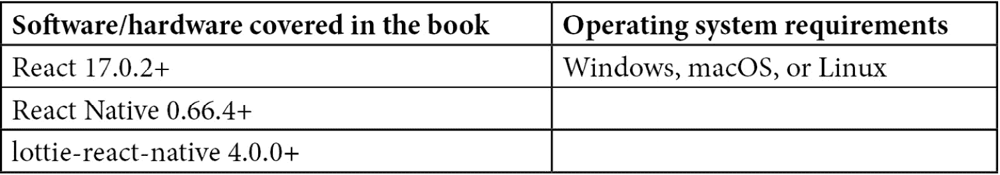

# 前言

Lottie 是一个小型且可扩展的基于 JSON 的动画文件。LottieFiles 是一个平台，可以上传、测试和共享 Lottie 动画。通过结合 LottieFiles 插件和 LottieFiles 平台，你将能够创建令人惊叹的动画，这些动画易于与任何设备集成。你还将了解如何使用 Bodymovin 插件在 Adobe **After Effects** (**AE**)中导出你的动画到 JSON 文件。

本书首先为您概述 Lottie 和 LottieFiles。随着你继续阅读，你将了解整个 Lottie 生态系统，并亲自动手学习经典的 2D 动画原则。你还将获得一个逐步的导游，从构思、为叙事草图，设计一个能满足用户需求和期望的图标，基于 UX，最后在 AE 中动画化它。这将帮助你熟悉 AE 环境，使用矢量形状层，通过图层属性创建和修改关键帧，探索路径、父子链接功能，并轻松调整时间以创建看起来专业的动画。

在这本动画书的结尾，你将能够使用 AE 创建和导出你自己的 Lottie 动画，并在使用 React Native 的移动应用程序中实现它们。你还将了解 2D 动画的最佳实践和原则，你可以将这些应用到自己的项目中。

# 这本书面向谁

这本书是为已经熟悉 React Native 的开发人员和工程师，以及想要通过 React Native 创建自己的动画并将其集成到他们平台上的 UX 和 UI 设计师而写的。假设你具备 JavaScript 编程的基本知识。虽然不是必需的，但还偏好具备入门级插画技能。

# 这本书涵盖的内容

*第一章*，*开始使用 Lottie*，探索 Lottie 和 LottieFiles 的世界以及为什么它们对设计师和开发者来说如此有价值。了解 Lottie 是什么，是谁创造了它，以及 LottieFiles 是如何工作的。你还将发现制作 Lottie 动画所需的工具。

*第二章*，*创造错觉：从 2D 经典动画的基本原则开始滚动*，在简要概述动画历史之后，重点关注将帮助我们创建更逼真动画的 12 个经典 2D 动画原则。随着你对叙事、缓动和节奏越来越熟悉，你将对自己的动画生态系统更有信心。

*第三章*，*学习工具：熟悉 After Effects*，教你使用 After Effects 进行动画的基础知识。术语如合成、时间轴和关键帧将开始听起来熟悉，并为你开始学习打下基础。

*第四章*, *移动起来！使用 After Effects 制作我们的第一个 Lottie 动画*，是一个易于遵循的、一步一步的指南，用于创建您第一个动画。通过使用真实世界的例子，您将学习如何设置合成，导入文件，动画制作，调整以及学习基本技巧和特效动画技术。

*第五章*，*与世界分享：使用 LottieFiles*，是关于如何导出动画到 JSON Lottie 文件供开发者使用的指南。它还描述了如何完全使用 LottieFiles 平台，并享受创建用于 Telegram 的动画贴纸和图标集的乐趣。

*第六章*，*继续前进！探索持续前进的插件和资源*，是找到所有持续前进资源的章节。包括 Adobe After Effects 最佳实践和导出动画时避免问题的注意事项的详细表格。本章还将提供安装创建动画所需的所有插件和工具的逐步说明。

*第七章**，lottie-react-native 简介*，简要解释了 lottie-react-native 是什么，支持哪些平台，以及如何浏览项目的不同部分，如代码仓库、npm 仓库及其文档。

*第八章**，安装 lottie-react-native*，是我们将动画在我们的移动应用中运行的第一步。我们将通过必要的步骤，确保 lottie-react-native 在 iOS 和 Android 应用中正确安装。它涵盖了常见陷阱、平台和替代方案，以及为我们的应用准备好首次 Lottie 动画渲染所需的一切。

*第九章**，让我们做一些魔法：集成您的第一个 Lottie 动画*，解释了如何在我们的应用中集成 Lottie 文件并通过 lottie-react-native 渲染它们。到本章结束时，我们将在 iOS 和 Android 应用中运行一个功能性的动画。

*第十章**，如何做到完美：控制您的动画*，教您如何播放 Lottie 动画向前、向后、暂停、加速或减速。在本章中，我们将学习如何执行所有这些动作以及许多其他动作，这将使我们能够完全控制动画在我们 React Native 应用中的使用方式。

*第十一章**，有任何问题？lottie-react-native 常见问题解答*，是使用 lottie-react-native 库时最常问问题的汇编。这份列表提供了库维护者对使用库时最常见问题和挑战的实质性回答。列表按流行度排序，不仅应作为新开发者的快速参考指南，还应作为陷入使用此库的复杂问题的经验丰富的工程师的参考指南。

# 为了充分利用本书



**如果您正在使用本书的数字版，我们建议您亲自输入代码或从本书的 GitHub 仓库（下一节中提供链接）获取代码。这样做将帮助您避免与代码复制和粘贴相关的任何潜在错误。**

# 下载示例代码文件

您可以从 GitHub（[`github.com/PacktPublishing/UI-Animations-with-Lottie-and-After-Effects`](https://github.com/PacktPublishing/UI-Animations-with-Lottie-and-After-Effects)）下载本书的示例代码文件。如果代码有更新，它将在 GitHub 仓库中更新。

我们还提供了其他代码包，这些代码包来自我们丰富的图书和视频目录，可在[`github.com/PacktPublishing/`](https://github.com/PacktPublishing/)找到。查看它们吧！

# 下载彩色图像

我们还提供了一份包含本书中使用的截图和图表彩色图像的 PDF 文件。您可以从这里下载：[`static.packt-cdn.com/downloads/9781803243801_ColorImages.pdf`](https://static.packt-cdn.com/downloads/9781803243801_ColorImages.pdf)。

# 使用的约定

本书中使用了多种文本约定。

`文本中的代码`：表示文本中的代码单词、数据库表名、文件夹名、文件名、文件扩展名、路径名、虚拟 URL、用户输入和 Twitter 昵称。以下是一个示例：“我们将通过进入 React Native 项目中的`ios`文件夹来实现这一点。”

代码块设置如下：

```js
"peerDependencies": { 
```

```js
    "lottie-ios": "³.2.3", 
```

```js
    "react": "*", 
```

```js
    "react-native": "|=0.46" 
```

```js
  }, 
```

```js
  "dependencies": { 
```

```js
    "invariant": "².2.2", 
```

```js
    "prop-types": "¹⁵.5.10", 
```

```js
    "react-native-safe-modules": "¹.0.3" 
```

```js
  }
```

当我们希望您注意代码块中的特定部分时，相关的行或项目将以粗体显示：

```js
include ':lottie-react-native' 
```

```js
project(':lottie-react-native').projectDir = new File(rootProject.projectDir, '../node_modules/lottie-react-native/src/android')
```

任何命令行输入或输出都如下所示：

```js
npm i --save lottie-react-native
```

**粗体**：表示新术语、重要单词或屏幕上看到的单词。例如，菜单或对话框中的单词以粗体显示。以下是一个示例：“让我们打开 AE 并点击**创建新项目**按钮。”

小贴士或重要注意事项

看起来是这样的。

# 联系我们

我们始终欢迎读者的反馈。

`customercare@packtpub.com` 并在邮件主题中提及书籍标题。

**勘误表**：尽管我们已经尽一切努力确保内容的准确性，但错误仍然可能发生。如果您在本书中发现错误，我们将不胜感激，如果您能向我们报告，我们将不胜感激。请访问[www.packtpub.com/support/errata](http://www.packtpub.com/support/errata)并填写表格。

`copyright@packt.com`，附有材料链接。

**如果您有兴趣成为作者**：如果您在某个领域有专业知识，并且您有兴趣撰写或为书籍做出贡献，请访问[authors.packtpub.com](http://authors.packtpub.com)。

# 分享您的想法

一旦您阅读了《使用 Lottie 和 After Effects 进行 UI 动画》，我们很乐意听听您的想法！请选择[`www.amazon.ae/review/create-review/error?asin=1803243805`](https://www.amazon.ae/review/create-review/error?asin=1803243805)为这本书留下您的反馈。

您的评论对我们和科技社区都非常重要，它将帮助我们确保我们提供高质量的内容。
