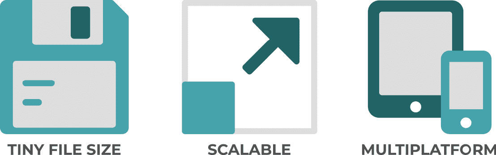
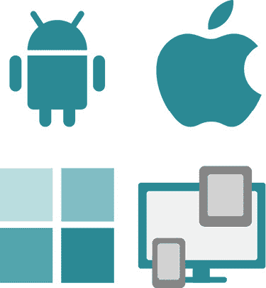
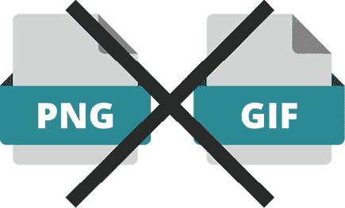
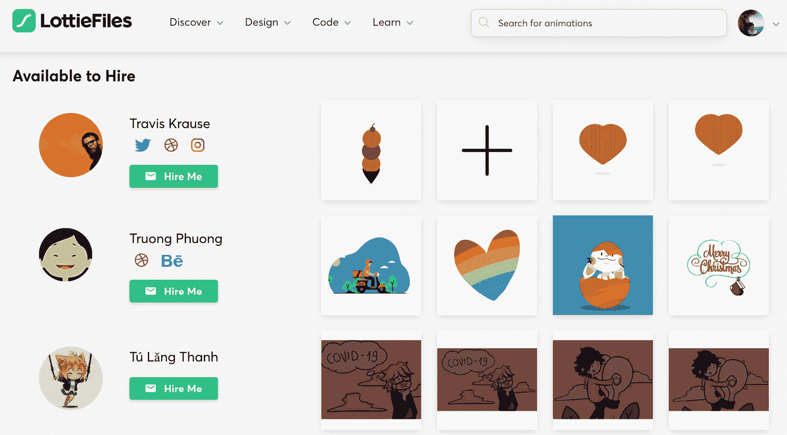
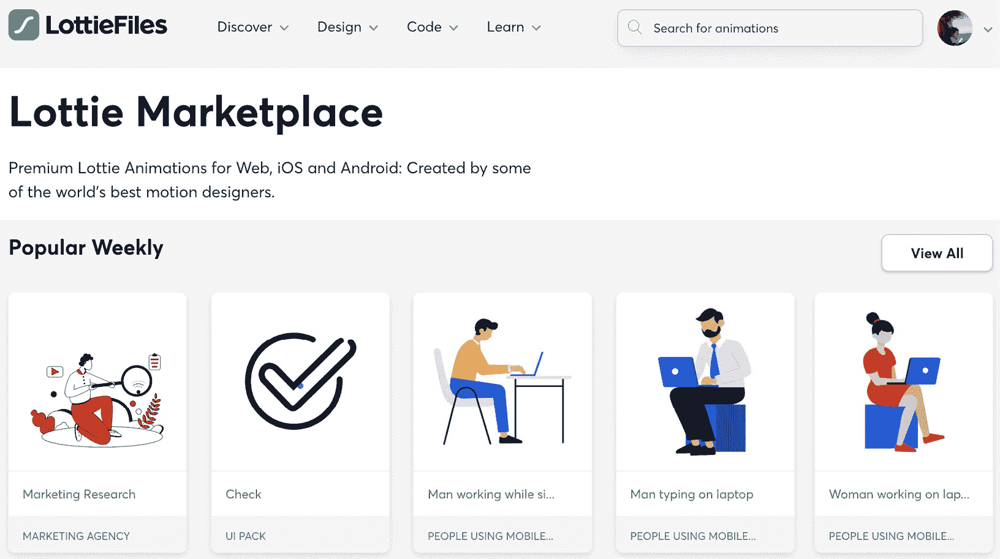
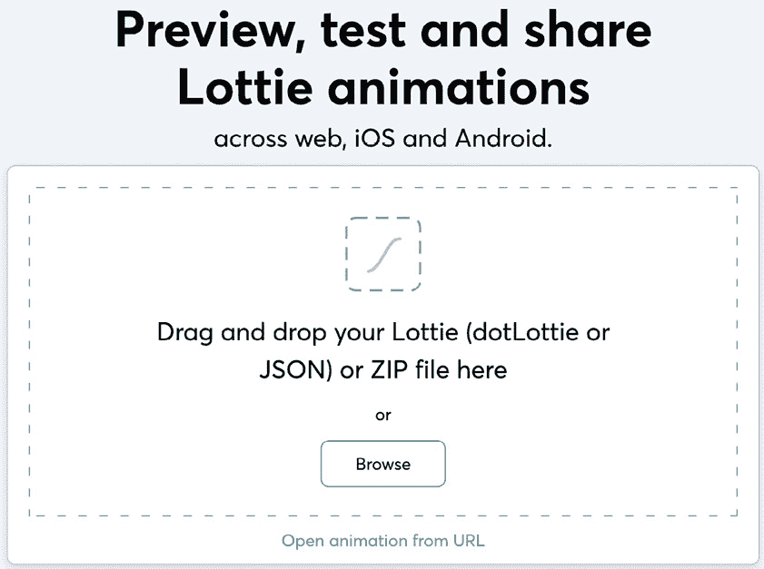
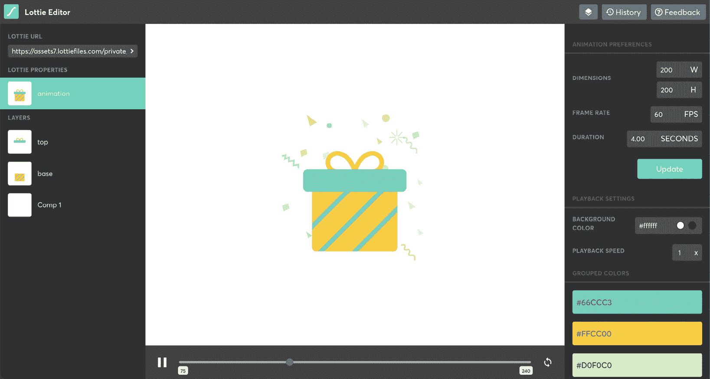
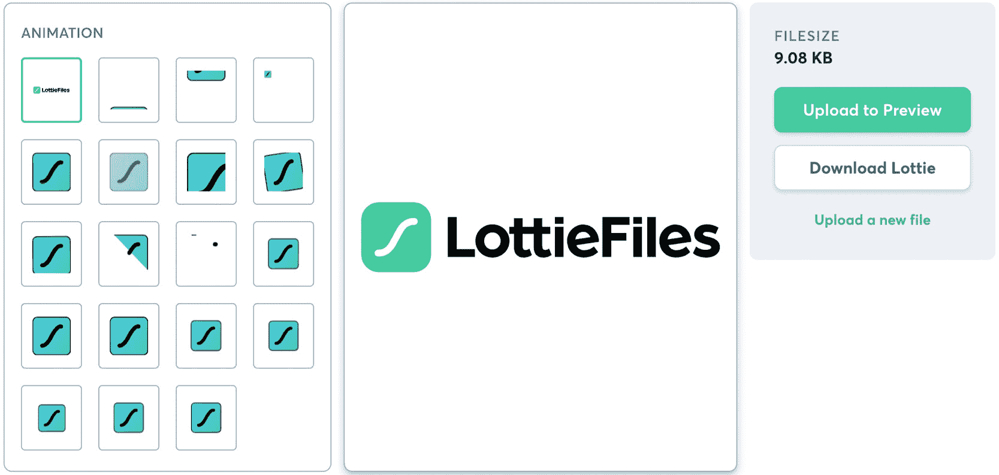

# 第一章：*第一章*：开始使用 Lottie

现在，矢量动画几乎被应用于每一个移动应用和网站。它丰富了良好的用户体验设计，帮助设计师引导用户进行交互，并使任何屏幕都充满活力。

然而，将动画添加到我们的网页、iOS、Android 或 React Native 应用程序并不总是像您想象的那么简单。当时，实现动画通常非常耗时，并且会大大增加文件的大小。但有一天，Lottie 终于发布了，光明和色彩进入了动画的世界，尤其是对于移动应用和网站。

在本章中，我们将向您展示如何使用这本书，以便您能最大限度地发挥其作用。此外，您还将了解 Lottie 是什么，为什么它被创建，以及它为设计师和开发者提供的巨大价值。

您将了解 LottieFiles 平台，它的用途，以及 Lottie 动画与 LottieFiles 之间的区别。

此外，您还将了解您将需要用于创建 Lottie 动画的工具以及从哪里获取它们。

到本章结束时，您将完全了解 Lottie 动画是什么以及它如何让设计师和开发者生活更轻松。此外，您将了解 LottieFiles 平台的作用以及如何获取所有必备工具，以便您准备好开始思考您的第一个动画。

在本章中，我们将涵盖以下主要内容：

+   如何使用这本书

+   Lottie 简介

+   LottieFiles 是什么？

+   理解创建 Lottie 动画的工具

# 技术要求

如前所述，在本章中，我们将讨论在创建 Lottie 动画的过程中我们将需要的必备工具。其中大部分工具对您免费使用。请注意，Adobe After Effects 不是免费提供的；然而，您可以下载一个 7 天的免费试用版。

此外，您还需要选择一个浏览器，例如 Chrome 或 Safari。

# 如何使用这本书

在本节中，我们将引导您了解本书的主要方面以及为什么我们认为这是您学习如何使用 Lottie 创建动画的最佳方式。我们不希望这本书只是另一本 After Effects 手册，教您如何动画化图标（当然，我们也会涉及这一点），但我们认为掌握基础知识并能够在打开任何软件之前勾勒出自己的想法并将其实现同样重要。您可以直接跳转到与您兴趣最匹配的章节，但我们强烈建议从头到尾阅读整本书。

我们希望你意识到，创建动画不仅仅是使用一些计算机工具给一个绘图添加一些运动。整个流程创造了魔法，从构思、最初的草图，到通过不同的动画技术如顺畅、节奏和关键帧时间线来创造运动的错觉。在某个时刻，你可能想过为什么这本书会谈论所有这些老式的玩意儿，比如经典 2D 动画？

嗯，我们本可以只涵盖下载动画、将其导入 After Effects 并转换为 Lottie 的过程，这样你就可以在极短的时间内使用 React Native 在你的应用中实现它...是的，那将是最简单和最短的部分（我们也会这样做，不用担心）。

然而，我们想要给你一些关于动画的更多背景知识、技巧和技术，这样当你读完这本书后，你将能够有远见，从头开始创建你自己的独特动画。无论你想动画化什么，我们都会教你基础知识，并提供足够的资源和工具，让你可以在自己的时间和节奏下继续学习。

正因如此，我们决定将这本书分为三个主要部分：

+   *第一部分*，*使用 After Effects 和 LottieFiles 构建基础*

+   *第二部分*，*破解 Lottie 动画*

+   *第三部分*，*将你的 Lottie 动画添加到移动应用中*

在这本书的第一部分，你将学习基础知识。作为一个初步的接触，我们将介绍 Lottie；你将熟悉**Lottie**和**LottieFiles**这两个关键词。在你继续阅读的同时，我们将深入了解整个 Lottie 生态系统，并快速浏览一下经典动画的历史。

我们将亲身体验经典 2D 动画的原则，以理解顺畅和关键帧的重要性，这两种流行的技术将帮助我们创造运动的错觉。我们将浏览 Adobe After Effects 环境，了解最相关的功能，以便在*第一部分*，*使用 After Effects 和 LottieFiles 构建基础*结束时，我们将为开始我们的第一个动画做好准备。

一旦我们理解了 Lottie、2D 动画和 Adobe After Effects 环境的基础知识，我们就会开始创建我们的动画图标。在这本书的第二部分，我们将引导你逐步游览一个真实项目，以创建我们的第一个独特动画。我们将把在前三章中学到的所有知识付诸实践。如何做到呢？嗯，我们将从一个简单的项目开始，在这个项目中，我们将动画化我们的第一个图标。

通过绘制和草图，我们将创建一个故事板，这将帮助我们理解我们想要我们的图标做什么。一旦完成，我们将把这个图标导入 Adobe After Effects，并应用书中早期学到的二维动画技巧来让它栩栩如生。到*第二部分*结束，即*破解 Lottie 动画*，我们将知道如何最好地导出我们的动画，并准备好将其交给开发者。

所以，想想看；无论你是设计师还是开发者，一旦你完成了这本书的前两部分，你将能够构思、草图、插图、动画和导出你自己的独特想法。

让我们继续前进。所以，我们已经完成了我们的第一个动画并导出了它。一切准备就绪。我们迫不及待地想看到它在我们的应用或网站上实现。那么，接下来是什么？

现在是这本书的第三部分发挥作用的时候了，这就是为什么它如此重要的原因。让我们想象一下，你已经花了几天时间设计和创建你的动画（是的，做得好；动画不是一件容易的事情，至少不是第一次）。你试图将它上传到你的应用或应用的网站上，但出了点问题？也许它看起来不像它应该的样子，或者应用中的动画看起来和网站上的不一样。也许它太重了。它是模糊的吗？它是响应式的吗？

有很多事情可能会毁掉你的精彩动画，但别慌张。这就是*第三部分*，*将你的 Lottie 动画添加到移动应用中*，派上用场的地方。那里，你将学习所有你需要知道的内容，了解如何简单、轻松地将你精彩、令人惊叹且精心制作的 Lottie 动画应用到任何平台上。多亏了 Lottie 和 React Native，你的动画不会看起来像素化，也不会太重，或者做任何其他奇怪的事情。

一旦你掌握了使用 React Native 创建自己的动画并将它们上传到你的平台的过程，这些问题就不会再发生了，你那精彩而独特的动画将像它本应的那样在屏幕上闪耀。

现在，既然你已经了解了为什么这本书被分为三个不同的部分，以及为什么它们都如此重要，让我们继续探索 Lottie 是什么。

# Lottie 简介

现在我们彼此了解得更好了，让我们看看所有这些关于 Lottie 的喧嚣是怎么回事。让我们从开始讲起，谈谈一些历史。

## 为什么叫 Lottie？

**Lottie**这个名字是为了纪念 20 世纪的德国电影导演*夏洛特·“洛特”·莱因格尔*，她成为了剪影动画的最杰出先驱。这是一种基于逐帧移动和用摄像机拍摄的剪影人物的技术。

## 舞台背后的男人

在苹果公司决定 Macromedia Flash 不能接近任何 iPod 或 iPhone 之后，将动画添加到我们的应用程序和网站上变成了一个噩梦。动画必须以低质量格式导出；否则，开发者必须自己重新编写代码。你可以想象有多少这样的动画最终变成了什么样子：文件大小太大，可视化效果真的很差，过程痛苦，结果令人沮丧。

但然后，在 2015 年，一直担任 Action Script 开发者的 *Hernan Torrisi* 有了一个想法。他开始构建一个用于 After Effects 的播放器和导出器，这就是 Bodymovin 插件诞生的地方。为了清楚起见，Bodymovin 插件将动画转换成 JSON 文件，但我们将稍后讨论这一点。

Torrisi 还开发了一个基于浏览器的渲染器，它可以将 Bodymovin 插件的 JSON 文件播放回动画。

然后，当 Airbnb 工程师 *Brandon Withrow*（iOS）、*Gabriel Peal*（Android）和 *Leland Richardson*（React Native）意识到这些基于 JSON 的动画的强大功能后，他们决定与动画师和经验丰富的设计师 *Salih Abdul-Karim* 合作，帮助开发 Bodymovin 插件的 JSON 的 Android、iOS 和 React Native 渲染器。

同时，LottieFiles 平台也发布了，一个由动画师、设计师和开发者组成的庞大社区应运而生。在这里，他们可以预览、测试和分享自己的动画。

2020 年，**dotLottie** 被创建出来，作为一种标准化格式的手段。

2021 年初，同一个团队提出了 `.JSON` 格式；然而，LottieFiles 插件增加了额外的功能，我们将在稍后更深入地介绍。

## 什么是 Lottie？

图 1.1 – Lottie 图标

我花了一些时间才弄清楚 Lottie 究竟是什么。关于 *Lottie*、*LottieFiles*、*Lottie 文件*、*Lottie 动画*、*dotLottie* 和 *LottieFiles 插件* 的讨论有很多，有时可能会有些令人困惑。

实际上，Lottie 是一个用于 iOS、Android 和 React Native 的库，它将我们在 Adobe After Effects 中创建的动画转换成代码行。它做得很简单，而且不需要编写任何代码；我们只需在 After Effects 中安装一个开源插件，按下一个按钮来渲染我们的动画，然后将其导出为 JSON。这不就像魔法一样吗？

如果你是一名设计师（或者愿意发挥创造力的开发者），这意味着你将能够使用 After Effects 创建自己的精彩动画，并在几秒钟内导出它们，而无需开发者编写代码。

如果你是一名开发者，这意味着你将不再需要编写动画代码，这将为你节省大量时间，你将能够轻松地将动画实现到任何网站或应用程序中。

而最好的是？动画将看起来应该是的样子，文件大小将保持较小，图像将是可伸缩的。所以，这对每个人来说都是双赢。

现在，为了澄清和总结，最初，Lottie 被用来命名一个用于 iOS、Android、网页和 Windows 的库。但今天，它通常被用来指代从 After Effects 导出的 `.JSON` 文件，也称为动画文件。

下面的图表描述了 LottieFiles 的优势：

图 1.2 – 使用 Lottie 文件的一些关键优势

## 你还需要更多理由开始使用 Lottie 吗？

是的，我们爱上了 Lottie，并且不会停止谈论它如何让所有团队的日常生活变得更轻松。以下是原因。

### 它非常容易使用

使用 Lottie 动画就像遵循几个简单的步骤一样简单：

1.  在 **After Effects** 中创建你的动画。

1.  使用 **LottieFiles** 或 **Bodymovin** 插件渲染和导出动画（我们将在稍后更深入地讨论这一点）。

1.  在 **LottieFiles 编辑器** 中测试动画，以确保一切都在正确的位置。

1.  将 `.json` 文件添加到我们的网页或应用平台，我们就完成了：

图 1.3 – After Effects、Bodymovin 工具的图标和 .JSON 格式文件

### 它可以在任何地方使用

Lottie 是多平台和开源的。它可以在任何网页或移动平台上使用。我们甚至可以在像 **Telegram** 这样的消息平台上创建和运行 Lottie 作为贴纸，或者在桌面应用或手表应用中使用它们：

图 1.4 – 多平台

### 文件大小将不再是问题

由于 Lottie 是基于矢量的动画，你可以想象文件大小将会非常小。所以，忘记那些老旧且沉重的 PNG 或 GIF 文件吧，它们会让我们的产品看起来质量低下：

图 1.5 – PNG 和 GIF 图像文件格式

### 交互性和动态性

Lottie 不仅由无数的酷炫动画循环组成。它还可以以多种方式使用，为用户提供一些交互。例如，我们可以将动画与页面滚动同步，并观察它在滚动时来回移动。

此外，我们还可以从特定帧创建循环，在悬停时播放片段，或将光标位置与动画同步。想象一下一些可爱的大熊猫眼睛跟随用户的鼠标指针；这有多酷？

图 1.6 – 交互功能

### 可伸缩

向量动画文件的另一个优点是它可以无限放大而不会变成像素化图像。此外，它是响应式的，可以放大或缩小，并按需适应我们的设计。所以，不用担心在您的网页或移动应用中的像素化图像。从现在开始，它们将看起来令人惊叹，并将您的用户体验提升到新的水平：

![图 1.7 – 向量图像与栅格化图像可视化]

![图片 B17930_01_07.jpg]

![图 1.7 – 向量图像与栅格化图像可视化]

因此，现在我们已经澄清了 Lottie 是什么，让我们继续了解 LottieFiles 及其功能。

# 什么是 LottieFiles？

**LottieFiles**成立于 2018 年，由位于旧金山和吉隆坡的*Nattu Adnan*和*Shafiu Hussain*创立。

它最初是一个设计师和开发者的社区，但发展非常迅速，已经演变成一个提供与动画相关的工具和资源的平台，设计师、开发人员和工程师可以在其中编辑、测试和展示动画：

![图 1.8 – LottieFiles 平台]

![图片 B17930_01_08.jpg]

![图 1.8 – LottieFiles 平台]

LottieFiles.com 平台使得测试动画变得非常简单，无需先将它们实现到应用和网站上。它已经变得如此受欢迎，以至于已经被世界各地的许多公司使用，例如亚马逊、迪士尼、谷歌、微软、优步、耐克和 Spotify 等，仅举几例。然而，这仅仅只是使用它的一个原因。让我们看看我们还能用 LottieFiles.com 做什么。

## 我可以用 LottieFiles 做什么？

如前所述，LottieFiles 在设计师和开发者中变得非常流行，我们可以说这个平台改变了动画的制作方式。多亏了 LottieFiles，我们现在可以在实现之前测试动画，直接在平台上编辑它们，以及更多。

让我们更深入地看看我们可以在 LottieFiles 平台上做什么。

### 动画库

我们可以从 LottieFiles 社区制作的数千个免费动画中进行搜索。这些动画可以用于我们的个人或商业工作，并且可以根据我们的项目或客户需求进行编辑和调整。

这些动画可以下载为 Lottie、GIF、MP4 或 JSON 文件，并用于我们的网站、应用、社交媒体项目、消息平台等。

这可以为我们节省大量时间。让我们想象一下，我们需要一个基本的加载动画来添加到屏幕之间。我们只需要一个旋转的圆形，颜色为我们的企业绿色。我们有两种选择：我们要么创建一个新的 After Effects 动画，导出它，并测试它，要么直接从免费的 LottieFiles 库中下载一个，更改其颜色，然后通过点击按钮生成新的代码。这听起来既快又简单，但是，让我们不要担心这一点。我们将在未来的章节中更深入地探讨这个问题：

![图 1.9 – LottieFiles 动画库的网页视图]

![图片 B17930_01_09.jpg]

![图 1.9 – LottieFiles 动画库的网页视图]

### 招聘动画师

LottieFiles 拥有使用 Lottie 的最大的设计师社区。如果您需要定制的动画，而您（目前）没有时间或技能（来做），[`lottiefiles.com/`](https://lottiefiles.com/) 是您可以搜索众多创意人士的地方，他们可以帮助您使您的项目栩栩如生：

图 1.10 – LottieFiles 动画社区网页视图

### 市场

在 COVID-19 封锁期间推出的**LottieFiles 市场**提供了许多由世界上最优秀的动态设计师制作的优质动画，包括个人和套装：

图 1.11 – LottieFiles 市场网页视图

### LottieFiles 预览

在 LottieFiles 平台上，您可以通过拖放简单地将自己的 Lottie 动画预览、测试和分享，然后再上传到您的项目中。您也可以通过相同的网站以及在 iOS、Android 或桌面应用程序中完成此操作：

图 1.12 – 在网页浏览器上的 LottieFiles 预览功能

### LottieFiles 编辑器

在我看来，编辑器是 LottieFiles 提供最强大的工具之一。这里您可以上传任何 Lottie 动画（您自己的或刚刚在库中找到的），并且可以非常容易地进行调整。您可以调整尺寸、帧率、持续时间、速度和颜色。此外，您可以将其导出为 Lottie `.json` 文件或将其分享回 LottieFiles 库：

图 1.13 – 在网页浏览器上的 LottieFiles 编辑器功能

### 从 Lottie 到 Telegram 贴纸

多亏了 LottieFiles，创建 Telegram 贴纸就像创建动画一样简单，使用 After Effects 的 Bodymovin 或 LottieFiles 插件导出，然后与 Telegram 的贴纸机器人进行对话。然而，我们暂时不必担心这个。我们将在未来的章节中深入探讨：

图 1.14 – Telegram 图标

### 将 SVG 转换为 Lottie

如果您想跳过 Adobe After Effects 来创建动画，现在可以了。LottieFiles 平台为您提供了创建优秀动画而无需动画（我知道，这听起来有点令人困惑）的选项。但只需上传一个 SVG 文件，以及将 SVG 转换为 Lottie 的工具，您就可以在几秒钟内创建出精彩的动画：

图 1.15 – 在网页浏览器上的 LottieFiles“将 SVG 转换为 Lottie”功能

### 将 Lottie 转换为 GIF

使用 LottieFiles，您也可以非常快速地将您的 Lottie 动画转换为 GIF 文件，只需将 JSON 文件上传到平台并管理一些设置即可。现在您的动画 GIF 就可以使用了：

![Figure 1.16 – The LottieFiles "Converting Lottie into GIF" feature on a web browser]

![img/B17930_01_16.jpg]

图 1.16 – 在网页浏览器上的 LottieFiles “将 Lottie 转换为 GIF” 功能

### Lottie JSON 编辑器

如果您是开发者，不想经历所有 After Effects 部分，而是直接跳入代码，使用 JSON 编辑器，您可以从内部更新您的动画。更改一些参数，并实时查看结果：

![Figure 1.17 – The LottieFiles .JSON file editor feature on a web browser]

![img/B17930_01_17.jpg]

图 1.17 – 在网页浏览器上的 LottieFiles .JSON 文件编辑器功能

### Lottie 学习

LottieFiles 网站还为您提供了许多资源，帮助您开始使用 Lottie。我建议您浏览其视频课程、博客、常见问题解答页面和论坛，以了解更多关于 Lottie 是什么以及您可以做什么的信息：

![Figure 1.18 – Web view of the Lottie Learn resources for designers and developers]

![img/B17930_01_18.jpg]

图 1.18 – Web view of the Lottie Learn resources for designers and developers

Lottie 和 LottieFiles 之间的区别是什么？

为了明确起见，Lottie 用于调用动画 JSON 文件，而 LottieFiles 是一个平台，用于上传、测试和分享您的 Lottie 动画。

因此，现在我们已经了解了 Lottie 文件是什么以及 LottieFiles 平台用于什么，让我们看看我们将需要哪些工具来开始创建我们的动画。

# 创建 Lottie 动画和集成的工具

在本节中，我们将学习在开始创建我们自己的 Lottie 动画之前需要安装的工具和插件。如果您之前没有听说过它们，请不要担心。在本节中，我们将涵盖所有主要工具，例如 Adobe After Effects、Adobe Animate 和 LottieFiles 平台。

如果您需要有关如何安装这些工具、插件和扩展的更多信息，请继续阅读 *第六章*，*不要停止！探索将帮助您继续前进的插件和资源*，以获取 *安装指南*。

## Adobe After Effects

**Adobe After Effects** 被称为行业标准的多媒体图形和视觉效果软件。它用于创建电影标题、开场白、过渡、电影和视频的视觉效果以及动画。

因此，如果我们想创建自己的动画，我们需要安装 Adobe After Effects。没有其他方法，至少直到最近还没有（继续阅读）。无论如何，请记住，这不是一个免费工具。然而，在购买之前，Adobe 提供了安装 7 天免费试用版的选项。您可以在 [`www.adobe.com/products/aftereffects.html`](https://www.adobe.com/products/aftereffects.html) 找到它。

### After Effects 的 Bodymovin 扩展

`.json` 格式，稍后可以随时调整。你可以在 [`exchange.adobe.com/creativecloud.details.12557.bodymovin.html`](https://exchange.adobe.com/creativecloud.details.12557.bodymovin.html) 下载你的 Bodymovin 插件：

图 1.19 – Bodymovin 图标

### Adobe After Effects 的 LottieFiles 扩展

我们已经讨论了很多关于 Bodymovin 扩展的内容。但最近，Lottie 也发布了适用于 After Effects 的 LottieFiles 插件，该插件可以将你的动画导出为 `.Lottie` 文件。Bodymovin 和 LottieFiles 之间的区别在于 LottieFiles 插件中新增加的功能。一旦我们讨论了如何在 Bodymovin 和 LottieFiles 插件中导出你的动画，我们将会更深入地探讨这一点。

在 [`lottiefiles.com/plugins/after-effects`](https://lottiefiles.com/plugins/after-effects) 下载 LottieFiles for After Effects 扩展：

图 1.20 – Adobe After Effects 图标

## Adobe Animate 的 Lottie 扩展

如果你不太熟悉 After Effects 并且想尝试其他工具来创建你的动画，现在你可以了！看起来 Lottie 的人刚刚发布了 Adobe Animate 的 Lottie 插件的早期 Beta 版本。

我们可以说 Adobe Animate 是曾经被称为 Macromedia Flash 的技术的演变，它被用来使矢量图形生动起来。

如果你想尝试一下，你可以从 [`lottiefiles.com/plugins/animate`](https://lottiefiles.com/plugins/animate) 下载 Adobe Animate 插件。然而，在这本书中，我们将专注于 Adobe After Effects：

图 1.21 – Adobe Animate 图标

## LottieFiles 平台

我们可以在我们的手机和电脑上下载并安装 LottieFiles 来预览、测试和分享我们的 Lottie 动画文件。以下是针对 Mac 和 Windows 的相关资源：

+   **LottieFiles for Desktop**: [`lottiefiles.com/desktop`](https://lottiefiles.com/desktop)

+   **LottieFiles for Android**: [`play.google.com/store/apps/details?id=com.lottiefiles.app&hl=en&gl=US`](https://play.google.com/store/apps/details?id=com.lottiefiles.app&hl=en&gl=US)

+   **LottieFiles for iOS**: [`apps.apple.com/us/app/lottiefiles/id1231821260`](https://apps.apple.com/us/app/lottiefiles/id1231821260)

图 1.22 – LottieFiles 图标

这就是我们创建自己动画所需的所有内容。然而，Lottie 给我们提供了与其他工具和软件（如 Figma 或 Sketch）的更多集成。你可以在 [`lottiefiles.com/integrations`](https://lottiefiles.com/integrations) 查看它们。

# 摘要

那么，让我们来回顾一下。在本章中，我们了解到动画对于任何用户体验项目的重要性。我们还理解了 Lottie 背后的意义及其起源。我们发现了*赫尔南·托里斯伊*是谁，以及 Lottie 是如何让设计师和程序员的日常生活变得更轻松的。另一方面，我们现在知道了 Lottie 和 LottieFiles 之间的区别。此外，我们还了解了 LottieFiles 平台的主要功能，如编辑器、查看器、市场和企业库。它们都已经安装了主要工具，所以你准备好开始创建自己的动画了。

现在，我们可以继续前进，开始讨论动画。让我们进入下一章，学习 2D 动画的基础知识。
