# *第三章*：学习工具：熟悉 After Effects

嗨，又见面了！现在我们已经扩展了我们对 2D 动画的知识，了解了经典动画的历史，学习了其原则，并且我们的草图和分镜脚本已经准备好了，让我们继续前进。让我们来谈谈 Adobe After Effects（AE）。

那么，为什么是 Adobe `.json`文件，以及这个插件是为 AE 制作的。如今，Lottie 和动画工具之间的集成越来越多，这是一个好兆头，因为它显示了 Lottie 在动画师、设计师和开发者中的流行程度。Lottie for Adobe Animate 是一个例子；然而，大多数还处于早期阶段，并且并非所有功能都可用，所以我们将继续专注于 AE。

AE 可以简单到您想要的样子，也可以复杂到您想要的样子；从创建一个小动画图标到制作一个庞大的后期电影项目，它被认为是行业标准的动态图形和视觉效果软件。想想电影标题、爆炸效果、标志动画、动画片段等等——许多这些都可以用 AE 制作。

然而，我们并不是假装要开设一个全面的 Adobe AE 课程；关于这一点，市面上有非常好的书籍。我们简要地介绍了 AE，重点关注动画方面，并为您提供创建自己动画的基本功能和概念，让您有足够的资源，以便可以按照自己的节奏继续学习。

话虽如此，我们将从熟悉 AE 界面开始本章。通过探索其一些面板和菜单，我们将深入了解帮助我们创建动画的工具和功能。

我们将讨论合成，如何创建它们，以及它们的基本方面。此外，我们还将学习如何通过菜单和快捷键在时间轴上移动，创建帧和关键帧（我们已经在*第二章*，《创造幻觉：运用 2D 经典动画的基本原则》中讨论过），我们将处理图层及其主要属性，如大小、颜色、位置和透明度。

我们将探讨如**父子关系**和**链接**这样的动画技术，这些技术将帮助我们瞬间将我们的动画提升到下一个层次，当然，我们还将深入研究缓动，学习如何在缓入和缓出中使用缓动，并玩转**缓动**面板，最终了解渲染设置以导出我们的动画。

因此，到本章结束时，您将能够舒适地在您个人定制的 AE 界面中移动，并准备好开始您的第一个动手项目——我们的超级酷、即将动画化的图标！

在本章中，我们将讨论以下主题：

+   理解 Adobe AE 环境

+   创建我们自己的个性化工作区

+   什么是合成以及其主要规格

+   使用时间轴

+   图层和图层属性

+   使用两种不同的技术——父子关系和链接

+   简化 – 深入了解

+   渲染窗口及其设置方法

# 技术要求

在本章中，我们将学习 Adobe AE 工作区的基础知识，所以在我们开始之前，您需要安装以下工具：

+   Adobe AE（如果您需要帮助进行此操作，可以前进到*第六章*，*不要停止！探索将帮助您继续前进的插件和资源*，在那里您可以找到有关安装过程的更多信息）

+   Adobe Illustrator

# 了解 AE 工作区

在我们开始之前，我们假设您已经安装了 Adobe AE 软件、Bodymovin 和 LottieFile 插件，所以我们已经准备好开始。您可以在*第六章**，*不要停止！探索将帮助您继续前进的插件和资源*中找到逐步安装指南。所以，如果您还没有安装您的插件，现在是时候去做这件事了。

好的，那么你们都准备好了吗？让我们开始吧：

1.  让我们打开 AE 并点击**创建新项目**按钮。所以，在这里我们可以看到什么，如图 3.1 所示，是 AE 的标准工作区，它由各种面板和窗口组织。

1.  对于我们的动画项目，我们将专注于**项目**、**合成**、**图层**和**时间轴**面板，所以让我们设置我们的工作区。

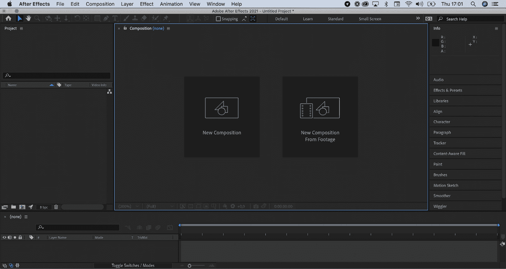

图 3.1 – Adobe AE 工作区

## 自定义我们的工作区

AE 提供了一个灵活的空间，其中包含工具和窗口，我们可以根据需要管理和组织它们。我们可以通过标签拖动面板并将它们放置在屏幕上的其他位置或组内，或者打开新窗口或关闭它们。

我建议您现在通过保持三个面板打开来组织您的工位，即**项目**、**合成**和**图层和时间轴**：

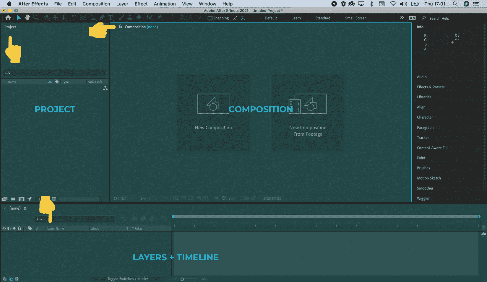

图 3.2 – 项目、合成和图层及时间轴面板

您可以通过在顶部菜单中选择**窗口** | **工作区** | **另存为新工作区…**选项来始终保存您的新面板设置：

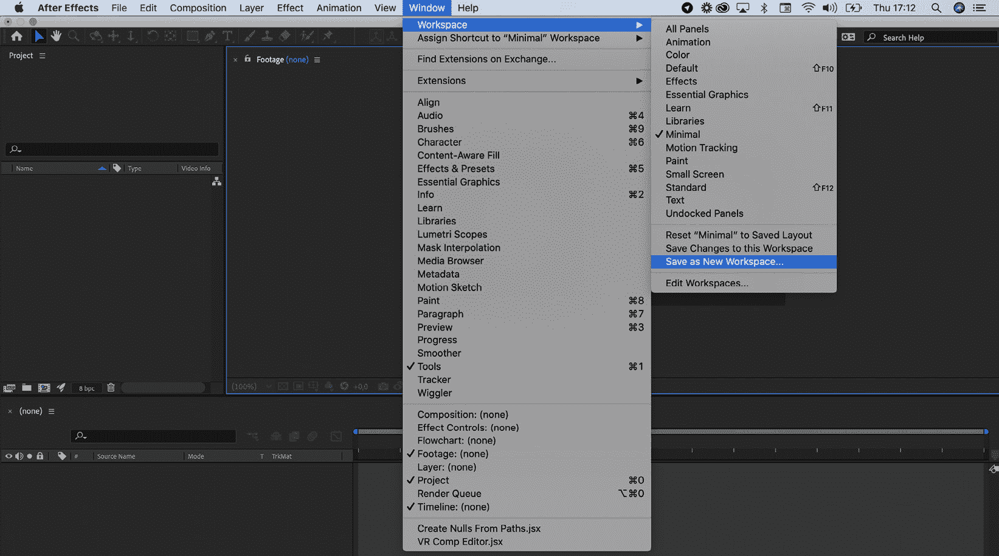

图 3.3 –另存为新工作区…

## 项目面板

现在我们已经设置好了工作区，让我们更深入地了解**项目**面板。这将会简短，但重要的是要提到的是，**项目**面板就像是一个图书馆，我们将在这里导入和组织我们的文件，并且我们的合成将保存在这里。

如您在*图 3.4*中看到的那样，**项目**面板显示了三个文件：

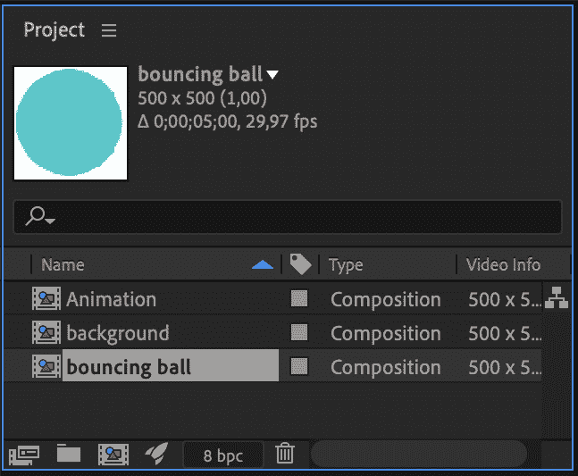

图 3.4 – 项目面板

在**项目**面板中，我们还可以看到一些关于文件的一些细节，例如大小、持续时间、帧速率以及文件类型——在这种情况下，**组合**。如果你不理解这意味着什么，不要担心；我们将在下一节讨论它。

## 理解组合

关于 AE 的第一件事要学习的是**组合**。想象它们作为空间和时间的容器，这意味着我们添加到组合中的任何东西，如图形、动画、声音和效果，都将作为不同的图层保存在**时间轴**面板中，正如你可以在下面的屏幕截图中所见：

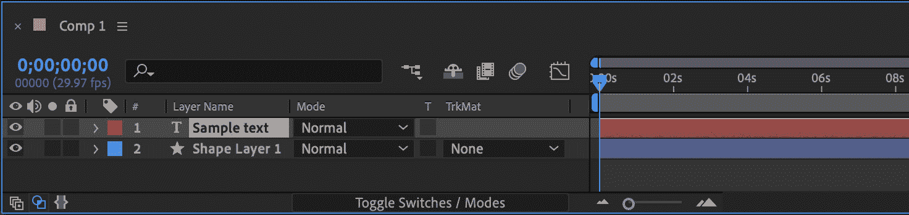

图 3.5 – 时间轴面板中名为 Comp 1 的组合的图层

一个项目可以有我们需要的任意多个组合，它们也可以嵌套。这听起来有点令人困惑吗？不要担心——我会给你一个例子。

记得在我们**项目**面板中显示的文件吗？想象一下，我们得在背景上动画一个弹跳的球。球将在屏幕中间上下移动，背景将从右向左移动，以产生球在前进的印象（见下面的故事板，如图 3.6 所示）。

我们需要球的一个垂直运动和一个背景的水平运动；此外，球的弹跳时间不会和循环背景移动所需的时间一样长。所以，这两个动画的空间和时间将会不同。这就是我们将创建两个（好吧，三个——我稍后会解释原因）不同的组合。

我们为弹跳的球创建一个组合，为背景创建一个组合，当我们结合这两个组合时，我们将得到第三个组合——将包含所有动画的容器：

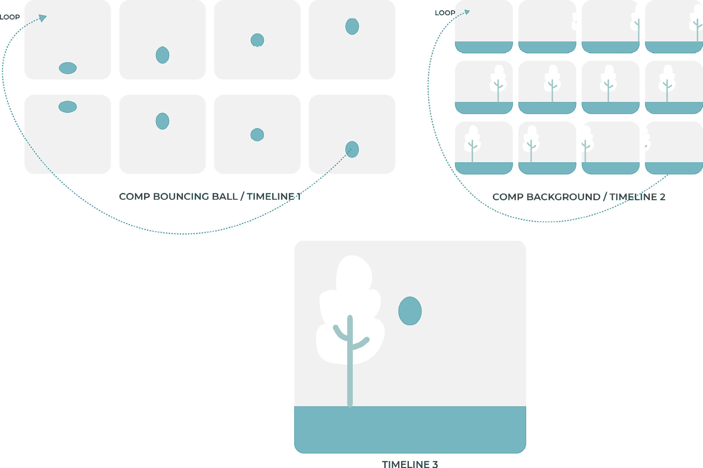

图 3.6 – 一个组合与两个组合的比较

分离组合的一些优点如下：

+   **重用组合**：同一个组合可以被重复使用任意多次。比如说，我有一群鸟在背景中飞翔；我只需要创建一个飞翔鸟的组合，并复制这个组合：

图 3.7 – 一个组合鸟的故事板和一组组合鸟

+   **嵌套组合**：你可以在一个组合内部再嵌套一个组合，这通常被称为**父组合**。为什么这如此有用呢？让我们回到我们的鸟儿。我们有一个鸟儿在移动翅膀但不在空间中前进，我们想让鸟儿穿过屏幕。我们可以在我们的移动翅膀鸟儿内部创建一个新的组合。新组合中的动画会将鸟儿从点 A 移动到点 B，因为鸟儿已经自己在移动，所以看起来就像它在飞翔：

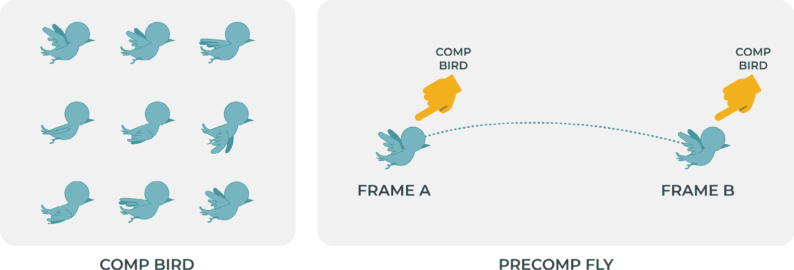

图 3.8 – 一个合成鸟动画和合成鸟飞行动画的预合成

如您所见，重用合成和嵌套合成将为我们节省大量的时间和精力。所以，现在我们了解了什么是合成，让我们创建一个。

### 合成设置

到目前为止，我们已经清楚地了解了什么是合成，那么让我们看看我们能用它做什么。让我们通过点击顶部菜单栏上的**合成** | **新建合成…**来创建一个：

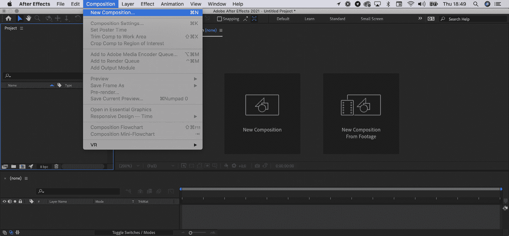

图 3.9 – 创建新的合成

**合成**面板将展开，如图 3.10 所示：

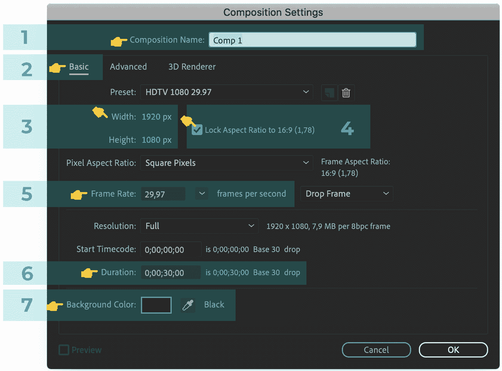

图 3.10 – 合成设置窗口

如您所见，这里有一些设置要定义，所以让我们逐一过一遍：

1.  `my_first_composition`。

1.  **基本**选项卡：如您所见，顶部有三个主要选项卡 – **基本**、**高级**和**3D 渲染器**。我们只需要了解一些**基本**选项，所以别管其他两个。

1.  **合成大小**：在这里，我们将为我们的合成指定一个特定的大小。我们可以在过程中进一步更改大小，但最好从一开始就设置好。如果这将是项目的主要合成，我喜欢给它设计的大小，这符合 Lottie 文件将要放置的位置的大小。当然，Lottie 是可伸缩和响应式的，但我们不希望在一个 400 x 800 像素的容器中有一个 60 x 60 像素的微图标。所以，让我们保持整洁。

1.  **锁定宽高比**：如果选中此选项，我们的动画默认比例将是 16:9。但由于我们不做视频，我们不需要这个比例，因此我们可以取消选中，只输入我们想要的尺寸。

1.  **帧率**：我们在*第二章*中谈到了这个，*创造幻觉：用二维经典动画的基本原理开始滚动*。这里我们将决定我们的动画每秒将有多少帧。对于网站和应用，我通常使用每秒 60 帧。

1.  **持续时间**：在这里，我们确定合成的持续时间。如果我们正在设计一个动画图标，这不会超过 3 到 5 秒。而且记住，我们项目中的每个合成都将有它自己的独立持续时间。

1.  **背景颜色**：这是我们合成将作为背景的颜色。然而，这个颜色在渲染电影时不会显示；它只是帮助我们区分设计和背景的一个有用的辅助工具。如果我们想让我们的合成有背景颜色，我们必须添加一个彩色图层作为背景。

到目前为止，一切顺利！我们刚刚学习了什么是合成，为什么它如此有用，以及如何创建和设置一个，那么让我们继续学习时间线和图层。

## 时间线

**时间线**是我们控制动画的面板。向前或向后移动，移动到项目的特定部分、秒或关键帧。时间线也是我们可以找到**图层**面板的地方，我们将在这里添加我们的帧和关键帧。

此外，每个合成都有自己的时间线，这意味着我们可以在时间线内嵌套时间线。

让我们看看**时间线**面板在*图 3.11*中的样子：

![图 3.11 – 时间线面板]

![图片 B17930_03_11.jpg]

图 3.11 – 时间线面板

通过查看前面的截图，我们可以看到我们的**时间线**面板中有几个关键区域；让我们更详细地看看这些部分：

1.  表示时间线中的当前时间。

1.  这个区域被称为**图层**面板，正如你所见，它位于**时间线**面板内。我们将在下一节中讨论这个问题。

1.  这被称为**时间线的缩放**。将其从左向右拖动，以查看时间线框架区域如何缩放和缩小。

1.  这条灰色线条表示我们正在工作的区域。我们的合成可以长达 5 秒，但假设我们只想动画持续 1 秒。我们不需要更改合成设置。我们可以移动蓝色起始点和结束点来调整到所需的时间。

1.  这是时间线中图层的可视化。如果没有颜色，这意味着图层在时间线上的结束或开始时间较晚，因此在这个特定时间不会显示。

1.  这是表示关键帧和缓动的区域。

注意时间线面板中的蓝色垂直线。这是**时间滑块**，它表示动画中任何点的当前时间。尝试将其从左向右拖动，以在我们的合成中移动时间。

我必须说，不谈论图层就谈论时间线面板是很难的，所以从现在起我将混合这两个概念。让我们来介绍图层。

# 理解图层

没有图层的合成将只是一个空白的帧。正如我们在本章前面所说，合成是由一个或多个图层组成的，你添加到其中的任何内容，如形状、文本、图像和音频，也将成为图层。 

让我们看看实际操作：

1.  打开我们与这本书一起提供的`chapter03/AEbasics.ae`文件。

1.  在**项目**面板中，你会看到许多不同的合成和文件。

1.  双击名为**动画**的合成：

![图 3.12 – 项目面板]

![图片 B17930_03_12.jpg]

图 3.12 – 项目面板

现在，让我们检查一下**图层**面板中有什么。正如你所看到的，在时间线中出现了几种不同类型的图层，并且每个图层都有自己的属性，例如大小、位置、旋转和透明度。这些属性非常重要，因为我们很快就会看到，通过调整它们，我们将能够开始动画制作，但让我们不要急于求成。

图层的在时间线中的位置也很重要。顶部的图层将显示在底部的图层前面。因此，我们通常将背景放在底部，而将我们想要显示在顶部的对象放在**图层**面板的顶部。我们只需在**图层**面板中拖动图层即可做到这一点：

![图 3.13 – 图层面板

![图片 B17930_03_13.jpg]

图 3.13 – 图层面板

在我们开始调整属性之前，让我们先了解不同类型的图层。

## 图层类型

随着我们深入到合成细节，我们面前会打开越来越多的选项。现在，我们知道一个合成可以包含我们想要的任意数量的图层，包括合成本身。在 AE 中，我们可以找到不同类型的图层，如视频、音频、光、摄像机和 GIF。然而，我们将专注于我们将用于矢量动画的图层，包括**形状**、**预合成**、**Illustrator**和**文本**，如图*图 3.13*所示。

让我们更详细地看看它们。

### 形状图层

即使这不是绘制资产的最佳方式（我们将在本节进一步探讨其他方法），我们也可以使用 AE 提供的工具来创建一些插图。当我们这样做时，我们正在创建一个形状图层。尝试通过使用屏幕顶部左侧的工具栏中的工具进行实验：

![图 3.14 – 工具栏

![图片 B17930_03_14.jpg]

图 3.14 – 工具栏

1.  缩放工具

1.  旋转工具

1.  矩形工具

1.  贝塞尔工具

1.  钢笔工具

1.  画笔工具

1.  填充颜色

1.  描边颜色和宽度

以矩形工具为例。转到合成屏幕并绘制一个正方形。你会注意到在**图层**面板中会出现一个新的图层，这是一个形状图层：

![图 3.15 – 形状图层

![图片 B17930_03_15.jpg]

图 3.15 – 形状图层

### 预合成图层

记得我们在*理解合成*部分讨论**预合成**图层时吗？预合成图层是由另一个合成内部形成的图层，也称为嵌套合成。但我们如何创建一个呢？就像将文件拖入图层的**合成**面板一样简单。让我们看看一个例子：

1.  转到**项目**面板。

1.  双击**动画**合成。

1.  将**树合成**文件从**项目**面板拖动到**图层**面板。

1.  就这样！你会看到在**动画**图层的面板中出现了名为**[树**]的新图层：

![图 3.16 – 树是动画合成的预合成

![图片 B17930_03_16.jpg]

图 3.16 – 树是动画合成的预合成

### Illustrator 图层

正如我们之前提到的，AE 不是创建图形的最佳方式，因为还有一些其他工具可以使你的工作更简单 – 例如，Adobe Illustrator。以下是原因。从 Illustrator 导入 AE 的文件将是链接的，因此我们对我们原始文件所做的任何更改都会在 AE 中立即反映，无需在 AE 中更改它们。

这就像魔法！你想看看吗？很好，但请记住，要这样做，我们需要在我们的计算机上安装 Adobe Illustrator。记住，我们已经为你提供了一些文件来玩耍，所以让我们打开它们：

1.  打开 Adobe Illustrator。

1.  从顶部主 Illustrator 菜单中选择**文件** | **打开**。

1.  从提供的文件中搜索`chapter03`文件夹并打开它。

1.  搜索`tree.ai`文件并打开它。

1.  在插图中进行任何更改 – 例如，我已经将树从白色改为粉色，但你可以做任何你喜欢的事情。尝试改变形状，添加一些纹理... whatever you like。

1.  现在，这非常重要 – 保存它！否则，你的更改不会反映出来。

1.  返回 AE 并亲自看看。正如你所看到的，你在 Illustrator 中做的任何更改都会自动反映在 AE 中：

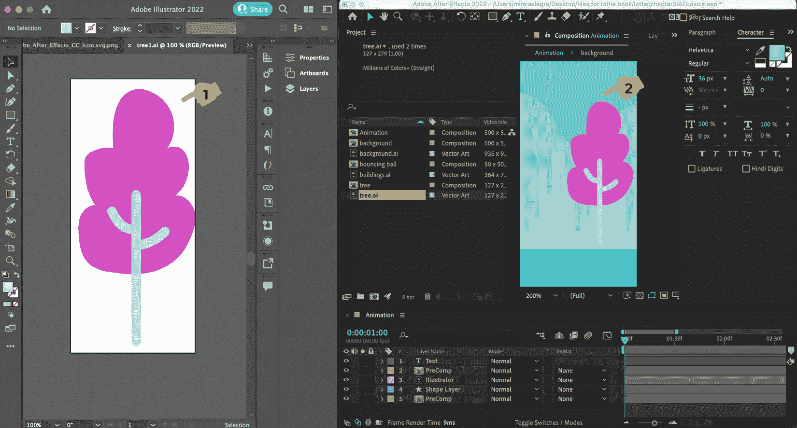

图 3.17 – 在 Adobe Illustrator 和 Adobe AE 窗口中查看 tree.ai 文件

### 文本图层

如果我们想在动画中包含一些文本，我们可以在 AE 中直接这样做。尝试以下操作：

1.  点击如图 3.14 所示中的**文本**工具。

1.  点击**合成**面板并输入一些内容。

1.  你会在屏幕右侧出现一个新的面板。在这个面板中，你有很多选项可以个性化你的文本：

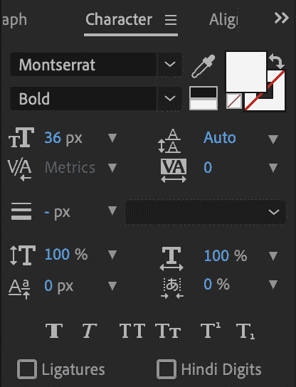

图 3.18 – 字符样式面板

很酷，所以我们已经涵盖了最适合用于我们矢量动画的不同类型的图层。现在，让我们更深入地看看我们可以用它们做什么。

## 图层属性

如你所知，每个图层都有属性。这些属性可以修改和动画化，这就是我们将如何使我们的插图生动起来的方式。

因此，每个图层都有的这个基本属性集被称为**变换**组。这可以通过点击每个图层左侧的小箭头来找到。所以，让我们展开它们：

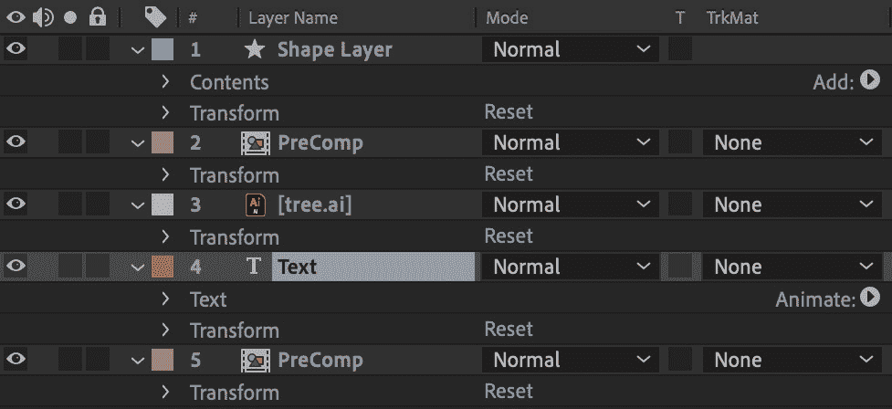

图 3.19 – 点击每个图层的箭头后图层面板的视图

正如我们之前提到的，每个图层都有自己的**变换**组。我们还可以看到某些类型的图层具有特定的属性，但到目前为止，我们将只关注**变换**组。

那么，让我们点击，例如，**形状图层**的变换组，看看会发生什么…*哇!* **变换**属性展开：

![图 3.20 – 形状图层变换组属性的详细视图

![img/B17930_03_20.jpg]

图 3.20 – 形状图层变换组属性的详细视图

太棒了！我们现在可以看到所有的**变换**属性了，这就是我们将要施展大部分魔法的地方。这些属性非常强大，将使我们能够通过变换、旋转、改变不透明度和在屏幕上移动图形来创建动画。我们将创造动画的错觉。所以，让我们更详细地看看我们可以用每个属性做什么。

### 锚点

标准化或旋转等变换是围绕一个**锚点**进行的。默认情况下，锚点位于图层的中心，如图*图 3.21*所示。有时，我们需要将锚点放置在其他位置，比如一个角落，或者图层的其他地方。

如果是这样，我强烈建议我们在开始动画图层之前就做这件事，因为当我们更改锚点位置时，缩放和旋转的行为将会不同。请参见*图 3.21*中的以下示例：

![图 3.21 – 中心锚点与用于缩放和旋转属性的底部/左下角锚点]

![img/B17930_03_21.jpg]

图 3.21 – 中心锚点与用于缩放和旋转属性的底部/左下角锚点

我们可以通过从工具面板中选择**平移**工具，并在合成屏幕上拖放来选择锚点位置。我们也可以在**图层**面板中更改其值：

![图 3.22 – 默认情况下，锚点值设置为 x = 0,0 和 y = 0,0]

![img/B17930_03_22.jpg]

图 3.22 – 默认情况下，锚点值设置为 x = 0,0 和 y = 0,0

### 位置

**位置**是我们图层将在合成中占据的位置。我们可以在合成中移动图层，并将其放置在我们想要的任何地方，甚至是在合成可见框架之外。只需尝试在合成屏幕上移动图层或更改**图层**面板中的值：

![图 3.23 – 基于图层在合成屏幕上的位置的位置值]

![img/B17930_03_23.jpg]

图 3.23 – 基于图层在合成屏幕上的位置的位置值

### 缩放

现在轮到**缩放**了。图层也可以放大或缩小。记得我们讨论锚点时说过，我们的对象将根据锚点的位置而表现不同吗？我们可以在合成屏幕上通过拉动图层的控制手柄上下移动或更改它们来改变图层的尺寸：

![图 3.24 – 由小方块表示的控制手柄]

![img/B17930_03_24.jpg]

图 3.24 – 由小方块表示的控制手柄

我们也可以从**图层**面板更改缩放比例。注意值左侧的小图标。默认情况下它是激活的，这意味着我们的图层将根据比例放大或缩小，保持其比例。如果您只想在垂直或水平轴上缩放图层，请取消选中它：

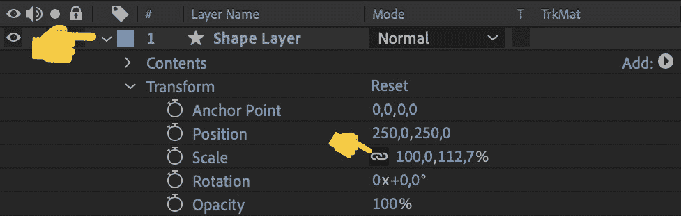

图 3.25 – 缩放默认设置为 x = 100%和 y = 112.7%

### 旋转

我们可以旋转我们的图层。为此，我们可以在工具面板中选择**旋转**工具，在合成屏幕中旋转我们的图层，或者我们可以在**图层**面板中更改值。**图层**面板中显示的第一个值，默认为**0x**，表示我们希望图层旋转的转数：

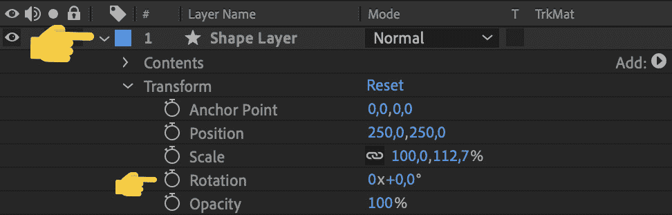

图 3.26 – 旋转由 0x = 转数和度数定义，默认设置为 0,0 度

### 不透明度

另一个有趣的属性是**不透明度**。我们可以将其从**0%**更改为**100%**，前者是完全透明的，后者是完全不透明的。我们可以通过直接在**图层**面板中更改值来更改不透明度：

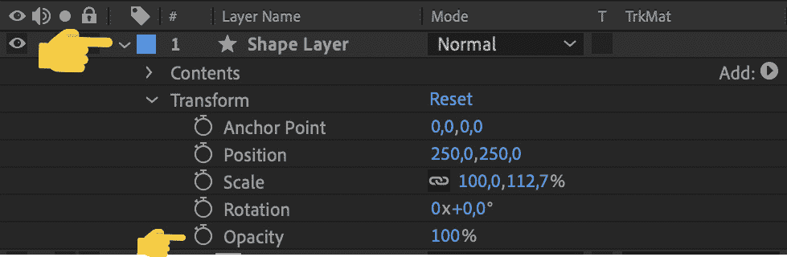

图 3.27 – 默认设置为 100%的不透明度

现在我们已经了解了所有关于图层、图层类型及其主要属性的知识，让我们继续了解父级和链接功能。

# 使用父级与链接选项进行动画

在上一节中，我们学习了如何将属性应用于图层。现在，如果我们想让不同的图层以相同的方式表现，我们是否需要在所有这些图层中更改属性？实际上并不一定！

在 AE 中，我们可以通过**设置父级**将一个图层链接到另一个图层。主图层被称为**父级**，链接的图层将被称为**子级**。简单来说，我们可以这样说，设置父级是一种分组图层的方法。

这里有一些需要注意的方面：

+   一个图层只能有一个父级，但每个父级图层可以有我们想要的任意数量的子元素。

+   我们可以单独对子图层进行动画处理。

+   当创建父级时，我们可以选择子元素是否要继承父级的属性。

但父级选项在哪里？它位于**图层**面板中；然而，有时它可能会被隐藏。如果是这样，只需在您的**图层**面板的顶部栏的任何位置右键单击，以显示一个新菜单。选择**列** | **父级与链接**：

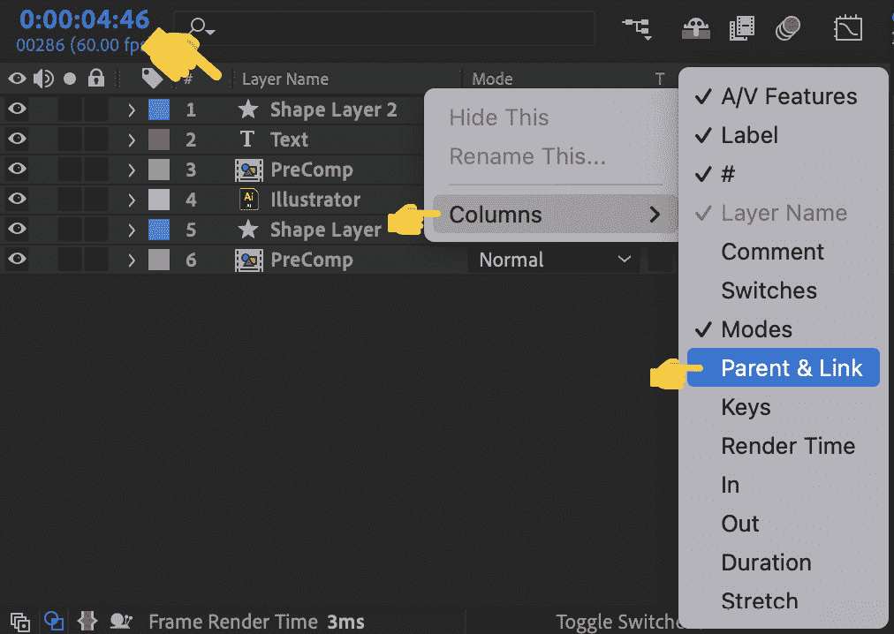

图 3.28 – 图层面板视图选项

现在我们确信我们可以在**图层**面板中看到**父级**选项，让我们看看如何**设置**一个图层的父级。

将图层设置为父级非常简单。只需将拾取鞭图标拖动到您想要链接的图层，如图 3.29 所示。完成！

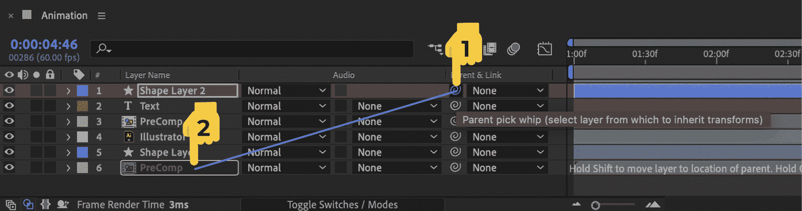

图 3.29 – 在父级与链接视图中使用拾取鞭

我建议您花些时间在父级与链接上摸索，以便熟悉它。

因此，现在我们已经了解了父级与链接是什么以及如何将它们应用于图层，让我们继续了解关键帧和动画。

## 关键帧和动画

没有关键帧，动画是不可能的。正如我们在 *第二章* 中提到的，*创造幻觉：用二维经典动画的基本原理滚动起来*，动画由关键帧和中间帧组成。

AE 为我们生成中间帧，因此我们不需要逐帧创建动画，这将节省我们大量时间。

话虽如此，让我们看看它是如何工作的。在下面的屏幕截图中，我们有一个两帧序列的示例以及它在 **图层** 和 **时间轴** 面板中应该看起来是什么样子：

![图 3.30 – 图层和时间轴面板中帧的表示

![图片 B17930_03_30.jpg]

![图 3.30 – 图层和时间轴面板中帧的表示

如前一个屏幕截图所示，创建关键帧只是几个指导步骤的问题。让我们看看它是如何完成的：

1.  点击**计时器**以激活并创建您的第一个关键帧。如果您再次点击，所有关键帧将被清除。

1.  点击小菱形以**添加/删除关键帧**。点击菱形旁边的箭头以移动到时间轴中的现有关键帧。

1.  时间轴上的关键帧位置 A。

1.  时间轴上的关键帧位置 B。

当我们看到它旁边的小计时器图标时，我们知道我们可以对该属性进行动画处理。当点击它（见 *图 3.30* 中的 **1**），会出现小箭头和菱形（见 *图 3.30* 中的 **2**）。

当点击计时器时，我们的第一个帧将被创建。继续，试试看！让我们做以下操作：

1.  让我们转到 **项目** 面板，并双击 **弹跳球** 合成。

1.  让我们把时间滑块放在**0**秒（我们在 *时间轴* 部分讨论过的）：

![图 3.31 – 时间滑块在帧 0 的弹跳球合成

![图片 B17930_03_31.jpg]

![图 3.31 – 时间滑块在帧 0 的弹跳球合成

1.  选择**位置**属性，并点击其旁边的计时器。请注意，我们的新关键帧将创建在我们时间滑块所在的位置。我们将称之为**关键帧 A**：

![图 3.32 – 点击位置计时器后图层和时间轴面板的视图

![图片 B17930_03_32.jpg]

![图 3.32 – 点击位置计时器后图层和时间轴面板的视图

1.  现在，让我们将时间滑块从**0**移动到半秒（**30f**）。

1.  点击菱形图标。记住，如果我们再次点击计时器，我们将删除该属性中的所有关键帧。我们将称之为**关键帧 B**：

![图 3.33 – 在左侧点击菱形图标后创建第二个关键帧

![图片 B17930_03_33.jpg]

图 3.33 – 在左侧点击菱形图标后创建第二个关键帧

1.  现在，让我们将时间滑块移动到**1**秒。

1.  再次点击菱形以创建我们的关键帧：

![图 3.34 – 时间滑块在帧 60 和关键帧 C

![图片 B17930_03_34.jpg]

图 3.34 – 时间滑块在帧 60 和关键帧 C

好的，我们已经创建了关键帧，那么接下来呢？如果我们从**A**移动到**C**的时间滑块，什么都没有发生，对吧？嗯，那是因为我们的关键帧完全相同，具有相同的属性、颜色等等，所以我们看不到任何变化。

1.  现在，将时间滑块移动到**关键帧 B**（**30f**）。

1.  让我们将其垂直位置更改为**80**。记得你可以通过更改图层合成的属性值来做到这一点：

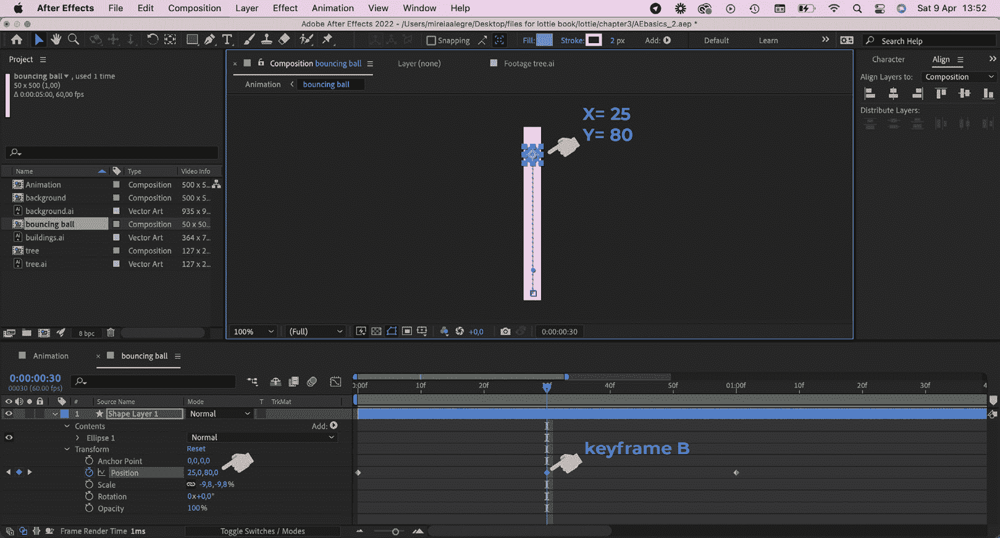

图 3.35 – 设置位置为 x = 25 和 y = 80

1.  将时间滑块从**A**拖动到**C**。现在发生了什么？球在弹跳！是的！我们刚刚创建了我们第一个动画！

你也可以按下空格键，使动画循环播放。所以，让我们检查这里的一些事情。当按下空格键时，动画播放一次，短暂停止，然后再次开始。为什么会这样？

这是因为我们的动画时长为 1 秒，但我们决定我们的合成长度将是 5 秒，记得吗？没问题 – 我们可以在任何时候调整它。让我们打开合成设置。

前往**项目**面板，右键单击**弹跳球**合成，选择**合成设置…**，并将持续时间更改为 1 秒，就像我们在本章前面看到的（*图 3.10*中的**6**）：

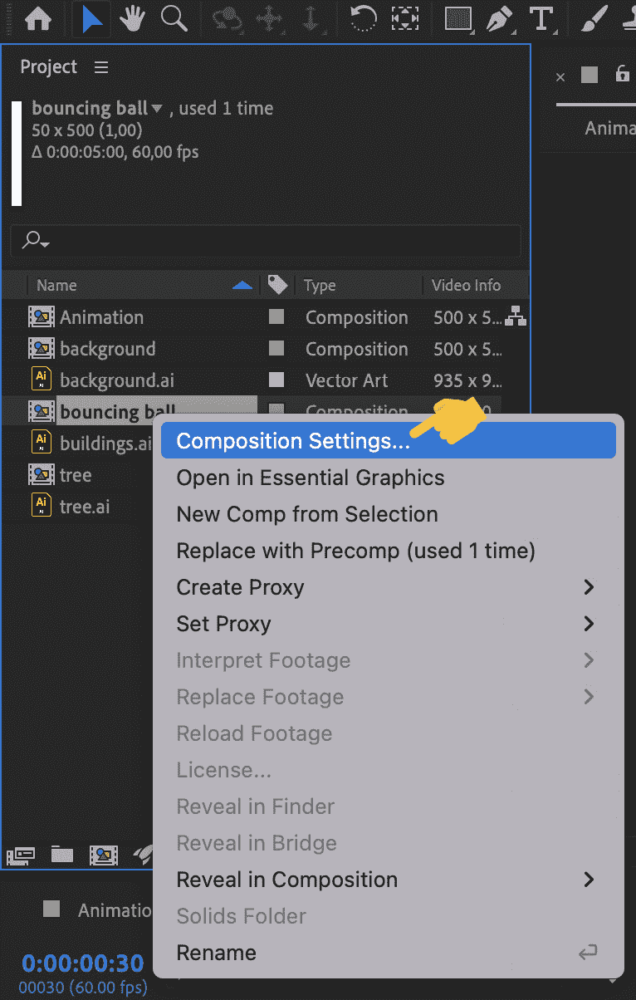

图 3.36 – 项目面板

现在让我们按下空格键。酷！我们的球正在无限循环地上下移动。它还不是完全的弹跳球，但很快就会达到那个效果！

我们还能看到什么？如果我们检查合成屏幕上的球，我们可以看到一个线和几个点：

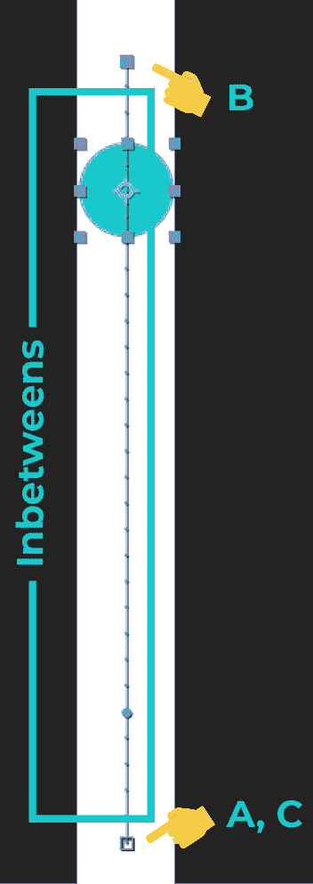

图 3.37 – 在合成窗口中的我们的弹跳球视图

让我们看看这一切意味着什么：

+   顶部的正方形点是我们的**B**关键帧。

+   这些小点代表 AE 为我们创建的中间帧。

+   底部的正方形点是我们的**A**和**C**关键帧。

因此，我们有了弹跳球，但它看起来还是有点奇怪，对吧？时间似乎不太对。我想我们现在可以谈谈缓动了。

# 探索缓动

正如名称所示，**缓动**意味着小心或逐渐移动。在 AE 中，缓动是一种效果，它允许我们在同一动画中给我们的对象以不同速度移动的印象。它会加速或减速，具体取决于我们想要达到的效果。

我们如何给我们的动画添加缓动？很简单 – 我们将通过在时间轴中选择菱形关键帧来添加缓动。让我们试试吧！

记得在上一个部分我们给球动画化的时候吗？让我们运行几次以记住它的样子（按空格键）。发生了什么？

我们可以看到球以恒定的速度上下移动，这看起来不自然。记得我们之前在*第二章*，*创造幻觉：利用 2D 经典动画的基本原则开始滚动*中提到的 12 个动画原则吗？缓动是其中之一；现实生活中的物体不会以均匀的速度移动。

为了让运动看起来更自然，我们想让弹跳球在达到顶部时减速，在击中地板时也减速。这涉及到使用缓动效果，它使用加速和减速。让我们先从简易缓动开始尝试。

## 简易缓出

**简易缓动**是 AE 提供的一种快速轻松添加缓动的选项。所以，让我们转到时间轴并执行以下操作：

1.  选择**0**关键帧（记住我们可以使用时间轴的缩放来调整我们的视图）。

1.  右键点击鼠标并选择**关键帧助手** | **简易缓动**：

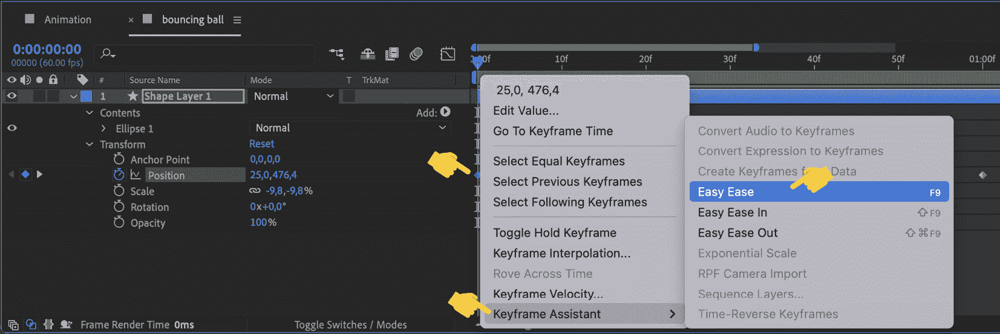

图 3.38 – 右键点击关键帧菜单

1.  让我们看看我们的时间轴；你会注意到钻石形状已经变成了不同的形状。这意味着这个帧上有缓动效果。

1.  现在，让我们选择第二个关键帧（**30f**）。记住，你也可以通过点击钻石旁边的箭头来在关键帧之间导航。当处理长时间的时间轴时，这可能很有用。

1.  右键点击并选择**关键帧助手** | **简易缓动**。我们为什么选择这个？因为我们想让帧在进入和退出关键帧时从两边减速。

1.  现在，让我们再次查看我们的时间轴；你会注意到这个关键帧看起来与第一个不同，这表明它在进入和退出帧时都激活了缓动效果，从两边：

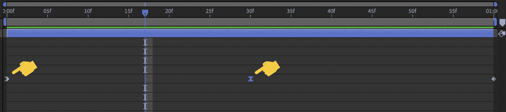

图 3.39 – 简易缓入和简易缓动关键帧表示

1.  最后，让我们点击第三个帧。

1.  右键点击**关键帧助手** | **简易缓出**，因为我们想让球在击中地板前减速。

1.  检查关键帧；它看起来与其他所有关键帧都不同。出现的形状表示缓出：

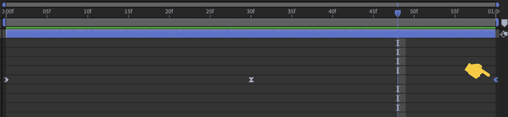

图 3.40 – 简易缓出

现在，让我们开始吧！你怎么看？动画看起来好多了；球的加速和减速现在更有意义，看起来更真实。接下来呢？我们可以添加一个**挤压和拉伸**效果。

为了让你回忆起，回到*第二章*，*创造幻觉：利用 2D 经典动画的基本原则开始滚动*，当我们谈论帮助我们的动画看起来更逼真的 12 个动画原则时，我们给出了一个弹跳球的例子，它在滚动过程中拉伸和膨胀，以产生更逼真的效果。

现在，我鼓励你亲自尝试挤压和拉伸，并将其应用于弹跳球动画。如果你想看到最终结果，你可以打开本书提供的示例，`chapter03/` `AEbasics_bouncingball_squash_stretch`，以检查动画是如何完成的，并玩转关键帧、宽度、高度以及缓动。

但让我们更深入地了解缓动。让我们谈谈图形编辑器。

## 图形编辑器

**图形编辑器**是我们可以看到缓动图形表示的窗口，也是我们可以手动创建和编辑缓动并调整动画速度的地方。

让我们看看；在**时间轴**面板中点击以下小图标：

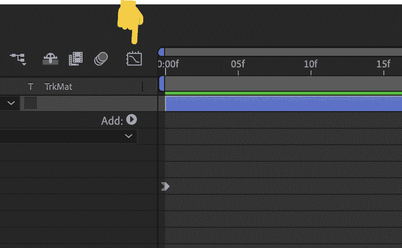

图 3.41 – 图形编辑器图标

当点击它时，你会注意到时间轴变成了某种图表。这就是图形编辑器。你可以再次点击返回到你的时间轴。在**图形编辑器**面板中，注意以下几点：

+   黄色方块代表我们的关键帧；正如你所见，它们放置在时间轴上的相同时间点（**0**、**30**和**1**）。

+   绿色曲线代表*y*轴上的中间值，换句话说，是球垂直运动的速度。通过查看图表，我们可以看出球的速度逐渐减小，直到它触及顶部然后加速直到它触及地面。

+   红色直线代表*x*轴上的中间值。但为什么它是平的？因为水平轴上没有运动。球只在上和下移动：

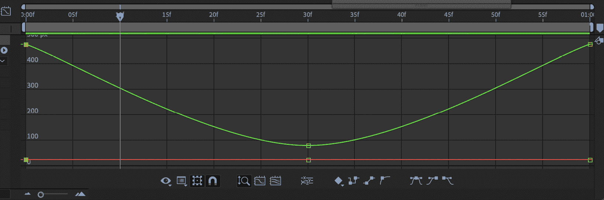

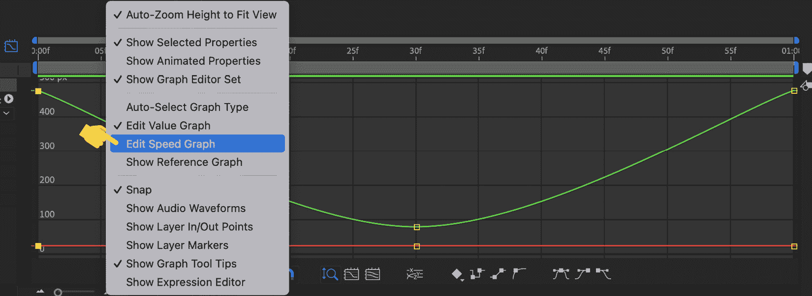

图 3.43 – 图形编辑器隐藏菜单

当选择**编辑速度图**时，我们可以看到我们的面板切换到不同的视图。现在，我们不再看到*x*和*y*轴，而只看到一条灰色线，它代表动画中速度的变化。

再次，玩转手柄和关键帧，选择你更熟悉的可视化方式：

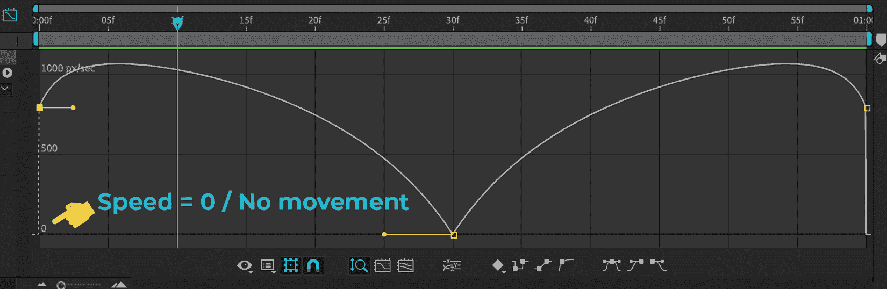

图 3.44 – 图形编辑器速度视图

我们刚刚向您展示的简单易用的**缓动**，是开始理解缓动是什么以及它是如何工作的理想方式。然而，一旦您开始熟悉它，您会发现直接在**图形编辑器**面板上创建缓动会更好。但在这个阶段，我们只是将关注于此，这对我们来说已经足够让我们的动画看起来更好，并为我们提供足够的知识，让我们能够以自己的节奏继续学习和进步。

# 摘要

我们完成了！是的，仅仅一章。不要感到惊讶；正如我们之前所说的，我们必须在这里实际操作。没有必要学习 AE 中所有可用的工具、面板、动作或表达式，因为对于我们来说，有很多东西我们不需要知道来制作 Lottie 动画。因此，我们希望让它对您来说更简单。

在本章中，我们发现了 AE 工作区区域，讨论了主要面板，并通过使用实际文件与合成、时间轴和图层一起工作获得了经验。我们了解了图层属性，学习了什么是父级与链接功能以及如何将其应用于我们的图层，并且在解释如何使用关键帧最终完善动画的同时，学习了如何创建我们的第一个动画，这一切都得益于**图形编辑器**面板的便捷性。

回顾本书的第一部分，我们已经走得很远了。我们学习了 Lottie 是什么，动画原理以及 Adobe AE 的基础知识；我们现在已经准备好进入书的第二部分，并施展一些魔法。让我们开始制作我们的动画图标！我邀请您跟随我进入下一章。
