# 第四章: 移动！使用 After Effects 动画我们的第一个 Lottie

然后...我们就在这里！准备好开始我们自己的第一个 Adobe After Effects 动画项目了！是的！这已经是一次激动人心的旅程，我们学到了很多新单词、概念和工具。回顾过去，感觉我们谈论 Lottie 已经是很久以前的事情了，不是吗？不是因为时间的流逝，而是因为我们学到了很多新东西！在本书的第一部分，我们学习了 Lottie 和 LottieFiles 是什么，我们了解了 2D 经典动画的历史和原理，并熟悉了 Adobe After Effects 的工作区域和主要动画功能。现在，我们一切准备就绪，准备动画化我们的图标。

在本章中，我们将一步一步地通过创建我们的动画图标。准备好，因为我们将要把迄今为止所学的一切都摆在桌面上，关于 Lottie、经典动画和 Adobe After Effects 的知识。我们将学习如何从不同的矢量工具中导入我们的资产，我们将创建和调整我们的合成，创建关键帧，并更改图层属性以产生动画的错觉。我们还将学习如何根据经典动画概念来动画化路径、调整时间并应用缓动，以使我们的图标有更可信的运动。因此，在本章结束时，我们将准备好第一个可以导出到 LottieFiles 的动画图标。

在本章中，我们将涵盖以下主题：

+   从 Sketch、Figma 和 Adobe XD 等不同的设计工具中将矢量文件导入到我们的 Adobe **After Effects** (**AE**)项目中

+   为我们的动画图标设置合成

+   创建关键帧

+   通过更改图层属性来动画化我们的图标

+   通过学习如何使用 Trim Paths 和径向爆发效果来提高时间效率

+   添加缓动并调整时间来润色我们的动画

# 技术要求

记住，这一章是一个实践项目，为了能够成功完成它，重要的是您有以下工具运行正常：

+   Adobe AE.

+   选择您喜欢的矢量插图软件。我们将重点关注 Sketch、Figma 和 Adobe XD：

    +   **如果您使用 Sketch**：您需要安装 Sketch 的 AEUX 插件。

    +   **如果您使用 Figma**：您需要安装 Figma 的 AEUX 插件。

    +   **如果您使用 Adobe XD**：无需安装任何额外插件。

# 在 Adobe AE 中创建您的第一个项目——一个动画复选图标

很酷，让我在这里简要回顾一下。有时你可能想知道，如果我们可以用文本或插图代替动画，为什么还要费这么大力气去创建动画呢？嗯，正如我们之前提到的，动画在用户体验方面非常有帮助。它们帮助我们与用户沟通；我们已经了解到动画可以传达许多事情，比如动作或情感。

如果我们回到我们的概述，记得我们决定创建一个复选图标，以向用户显示购买已成功完成，金钱安全且花得其所。

所以，从 UX 的角度来看，我们希望我们的用户感受到什么样的情绪？我想可能是以下这样的：

+   **安全**：购买已经正确完成。

+   **放松**：交易过程中钱并没有丢失。

+   **兴奋**：想象一下你穿上新 T 恤时的感觉。兴奋，对吧？

在动画制作时，我们不仅仅是在谈论一些酷炫的动态图形，这些图形将出现在我们的应用中以使其看起来更好；相反，我们是在谈论让用户的生活变得更轻松、更快乐。我们是在谈论让人们感觉更好！你能看到我们手中拥有的力量吗？所以，让我们不要浪费时间。让我们让我们的用户感觉棒棒哒！

# 将我们的图标导入到 After Effects 中

让我们先导入我们的资产到 AE。为此，我们假设你已经在这三个矢量工具之一（Sketch、Figma 或 Adobe XD）中准备好了你的图标设计。

重要

如果你还没有选择任何基于矢量的工具，我建议使用 Adobe XD，这将节省你的时间和精力。XD 的导出选项已经包含在 XD 中，无需添加任何额外的扩展或插件。然而，如果你已经使用 Sketch 或 Figma，不用担心，我们也会涵盖这一点。此外，你可以在本书的*第六章*，*不要停止！探索持续前进的插件和资源*中找到更多关于如何安装插件的信息。

## 从 Sketch 导入文件到 AE

为了避免一些动画问题，我总是建议将插图保持得尽可能整洁和简单。例如，一些布尔运算、文本层或符号在导出到 AE 时可能会产生问题。

话虽如此，让我们在 Sketch 中打开我们的图标。转到顶部菜单栏并选择**文件** | **打开本地文档**：

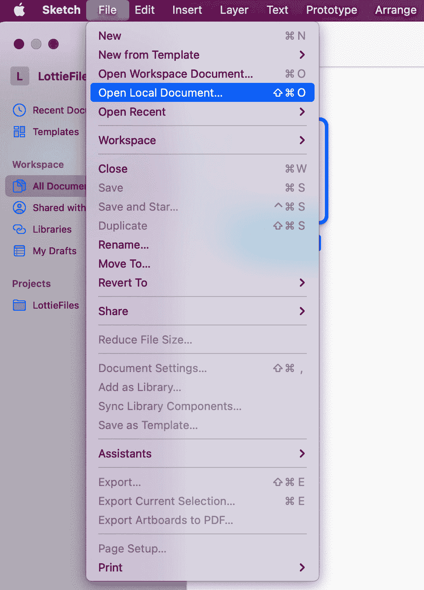

图 4.1 – Sketch 文件菜单

前往本书提供的`Files`文件夹，并打开`lottie/chapter04/sketch/lottie_sketch`。

现在是安装 Sketch 和 AE 的 AEUX 插件的时候了。你可以在*第六章*，*不要停止！探索持续前进的插件和资源*中找到有关如何安装 Sketch 和 AE 的 AEUX 的更多信息。

重要

如果你没有按照我们的指示安装插件，请检查*第六章*，*不要停止！探索持续前进的插件和资源*中的*如何在 AE 中设置 AEUX*部分，因为一些选项必须被选中。

一旦我们在 Sketch 中安装了 AEUX 插件，让我们打开它并检查面板。为此，转到顶部菜单栏并选择**插件** | **AEUX** | **打开面板**：

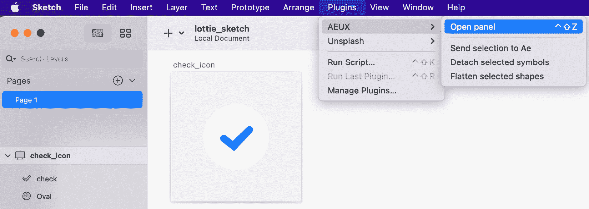

图 4.2 – AEUX 插件面板窗口

正如我们在*图 4.3*中可以看到的，这是一个非常简单的面板，只有三个不同的选项：

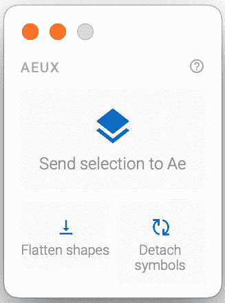

图 4.3 – AEUX for Sketch 插件窗口

+   **将选择发送到 Ae**：这个操作非常直接；通过选择图层并点击此选项，我们将导出我们的插图到 AE。

+   **展平形状**：正如我们之前提到的，当导出用于 AE 时，保持我们的插图和图层整洁总是一个好主意。使用**展平形状**选项，我们可以将组合或布尔图层展平为单个平面矢量形状，从而避免 AE 图层问题。

+   **分离符号**：符号可能会让 AE 表示起来有些困惑。使用**分离符号**选项，我们将从其主符号中移除符号依赖，使其在 AE 中工作得更好。

因此，正如我们在这里所看到的，我们的图标仅由两个单独的图层组成：**检查**用于蓝色勾选标记，**椭圆形**用于白色圆圈。这些图层是基本的简单形状，在导出时不会给我们带来任何麻烦。完美！

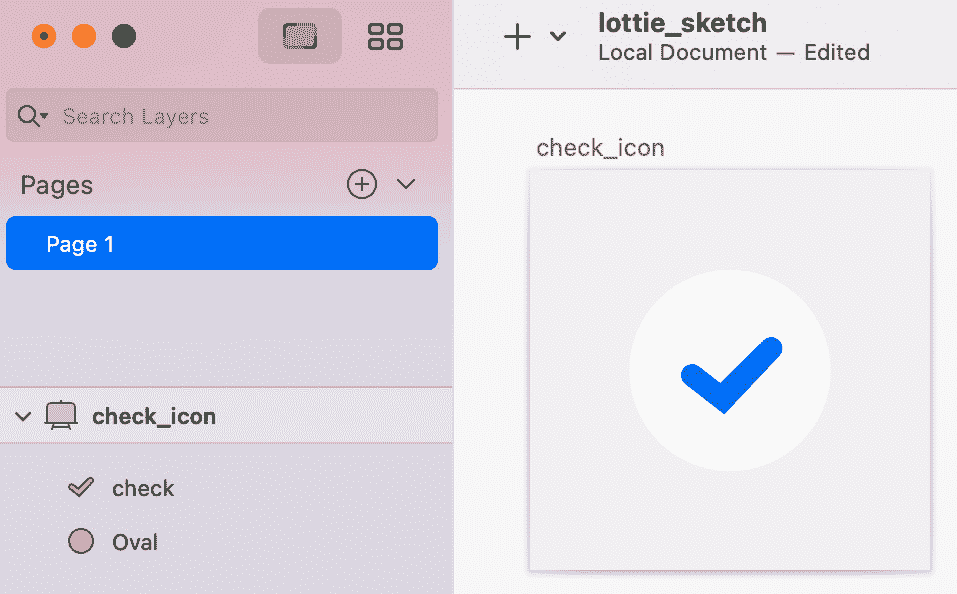

图 4.4 – 图层面板

现在我们已经准备好并整理好图标，让我们将其导出到 AE：

1.  如果尚未这样做，请打开 Adobe AE。

1.  返回 Sketch 并同时选择两个图层：**检查**和**椭圆形**。

1.  在 AEUX 面板中点击**将选择发送到 Ae**。

1.  前往 Adobe AE 并检查文件是否已导入：

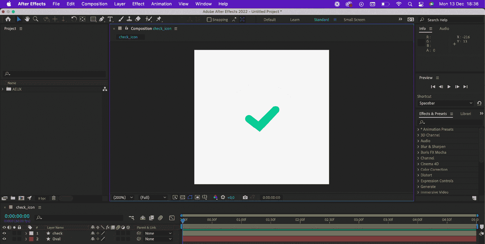

图 4.5 – 从 Sketch 导入到 AE 的图层

太好了！我们已经将图标完美导入 AE 并准备好进行动画制作。只需保存即可！现在，让我们看看如何使用 Figma 工具进行相同的操作。

## 从 Figma 导入文件到 AE

要将您的插图从 Figma 导出至 AE，过程相当类似。您可以前往*第六章*，*不要停止！探索持续前进的插件和资源*，在那里您将找到有关如何安装 Figma 和 AE 插件的指南。记住，如果您已自行安装插件，请检查*如何在 AE 中设置 AEUX*部分，以确保所选选项与您的一致。

现在您的插件已经启动并运行，让我们在 Figma 中打开图标。如何操作？请按照以下说明进行：

1.  打开 Figma。

1.  从主页选择**导入文件**选项：

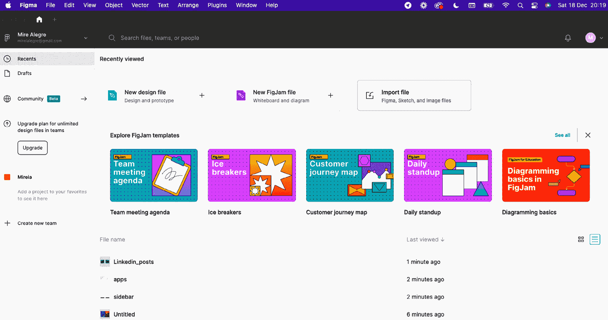

图 4.6 – Figma 主页

1.  在提供的文件中搜索 `lottie/chapter04/Figma` 文件夹。

1.  打开 `lottie_Figma.fig` 文件。

1.  点击**完成**按钮。文件将出现在 Figma 的主页上，如图 4.7 所示：

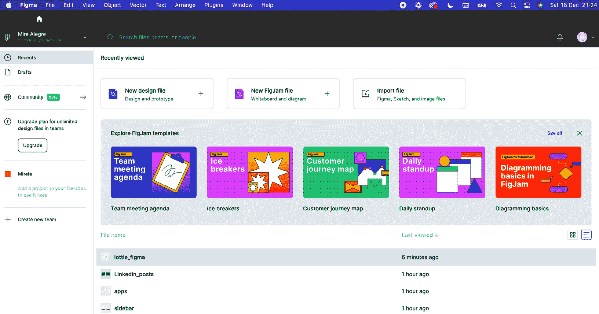

图 4.7 – Figma 主页和提供的 Figma 导入文件

1.  双击 `lottie_Figma` 以最终打开文件，如图 4.8 所示：

图 4.8 – 图标文件

太棒了！现在，我们已经成功将 `lottie_Figma.fig` 文件导入。

1.  让我们打开 AEUX 面板，查看可用于将我们的图标导出到 AE 的选项。前往**插件** | **开发** | **AEUX**。

![图 4.9 – AEUX 插件面板窗口]

![图片 B17930_04_09.jpg]

图 4.9 – AEUX 插件面板窗口

如*图 4.10*所示，这是一个非常简单的面板，只有三个不同的选项：

![图 4.10 – AEUX for Figma 插件面板窗口]

![图片 B17930_04_10.jpg]

图 4.10 – AEUX for Figma 插件面板窗口

+   **发送选择到 Ae**：这与 Sketch 中的操作方式相同。非常直接；通过选择图层并点击此选项，我们将我们的插图导出到 AE。

+   **导出参考图像**：Figma 中的图层存在一些已知的对齐问题，例如文本图层和旋转的图像。启用此复选框以生成 Figma 框架的图像叠加，以便进行手动对齐。

+   **导出时栅格化图层**：可以将 Figma 中的任何内容自动发送到 AE 作为 PNG 文件。这对于不需要动画且可以通过合并为单个图像进行优化的任何内容非常有用。

如我们之前提到的，保持我们的插图尽可能简单非常重要，因为某些效果可能会产生问题。您会注意到我们的插图非常简单；它只由两个名为**检查**和**椭圆**的图层组成，这就是我们需要的所有内容。

现在我们已经完成了整洁的图标，让我们将其导出到 AE：

1.  如果还没有，打开 Adobe AE。

1.  在 Figma 中选择两个图层：**检查**和**椭圆**。

1.  点击 AEUX 面板上的**发送选择到 Ae**选项。

1.  前往 Adobe AE 并检查文件是否已导入：

![图 4.11 – 从 Figma 导入到 AE 的文件]

![图片 B17930_04_11.jpg]

图 4.11 – 从 Figma 导入到 AE 的文件

太棒了！我们的图标已经在 AE 中准备好了；现在，记得保存它！让我们看看如何用 XD 做同样的事情。

## 从 XD 到 AE 导出资产

从 XD 导出您的图标可能是目前存在的一种最简单的方法。不需要安装任何插件，因为 Adobe XD 已经包含了用于 AE 的导出选项。让我们看看这本书提供的 XD 文件。

让我们在 Adobe XD 中打开我们的图标。为此，只需按照以下步骤操作：

1.  打开 XD。

1.  前往**文件** | **从您的计算机打开...**。

![图 4.12 – XD 主页]

![图片 B17930_04_12.jpg]

图 4.12 – XD 主页

1.  在提供的文件中搜索`lottie/chapter04/xd`文件夹。

1.  打开`lottie_xd.xd`文件：

![图 4.13 – XD lottie_xd 图标文件]

![图片 B17930_04_13.jpg]

图 4.13 – XD lottie_xd 图标文件

现在，您会看到将我们的图标导出到 AE 是多么简单：

1.  通过点击其名称选择整个布局区域。

1.  前往顶部菜单栏并选择**文件** | **导出** | **After Effects…**：

![图 4.14 – 从 XD 导出选项]

![图片 B17930_04_14.jpg]

图 4.14 – 从 XD 导出的选项

然后，哇！AE 会自动打开，我们的图标将准备好进行动画制作。简单，对吧？

图 4.15 – XD 图标导入到 AE

保存项目并开始动画制作！

# 用户体验动画工作流程

在我们开始使用 AE 搅拌之前，我想与你分享我通常在动画制作中使用的流程。

你会看到我们已经完成了整个过程的一半；现在，我们只需要让它变得生动起来。请记住，将这个工作流程视为建议，并随意更改以满足您自己的需求。以下是我的工作流程：

1.  进行用户体验研究以找到用户的痛点。

1.  根据用户评论发现问题/找到解决方案。

1.  线框设计。

1.  故事板。

1.  低保真度设计以再次测试。

1.  设计。

1.  将资产导出到 AE。

我们已经涵盖了所有这些：

1.  设置组合。

1.  创建关键帧。

1.  修改图层。

1.  调整时间。

1.  添加缓动。

我们将在 *第五章* 中介绍以下内容：*与世界分享：与 LottieFiles 合作*：

1.  导出为 `.json` 格式用于 LottieFiles

1.  在 LottieFiles 预览

1.  交给开发者

我知道，这个过程可能看起来有点长，但这只是一个涵盖复杂项目整个过程的示例。有时，可能不需要进行用户访谈，或者在某些时候，你可能不需要绘制故事板或线框，因为它们已经在你的脑海中。

让我们回到之前的位置，看看我们的故事板放在了哪里。让我们回顾一下；我们的图标当时在做什么？

1.  我们的图标将从 0% 增加到大约 110%。

1.  气泡从类似椭圆形的火花中冒出。

1.  椭圆恢复到实际大小（100%），气泡开始消失。

1.  当气泡消失时，*检查* 符号开始绘制。

1.  最后，在 100% 时显示 *检查* 符号：

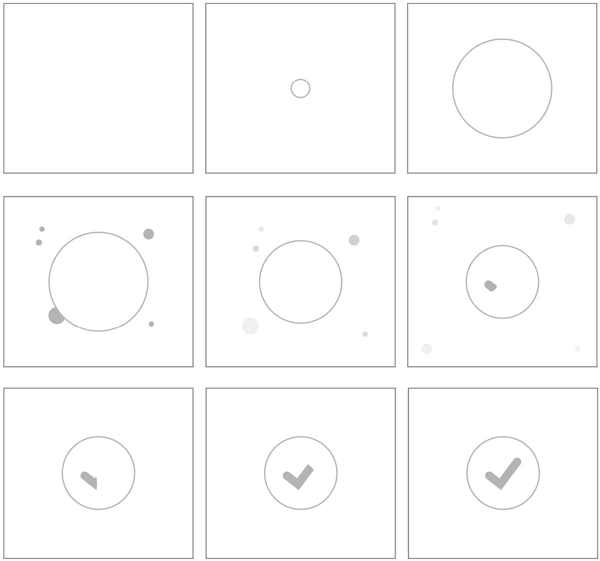

图 4.16 – 我们的故事板

到目前为止，我们已经提供了所有必要的元素、资源和工具，以便开始动画制作。我们已经讨论了一些主要的用户体验概念，学习了如何将文件导入 AE，检查了多种动画工作流程之一，并且再次回顾了故事板以刷新我们的记忆。

因此，现在我们已经在我们的大脑和纸上对动画的外观、需要做的事情以及要遵循的步骤有了相当清晰的想法，让我们开始动画制作！让我们创建我们的组合。

# 调整我们的图标组合设置

记得在 *第三章* 中，*学习工具：熟悉 After Effects*，我们讨论了组合，它们是什么，以及我们为什么要使用它们？酷。现在是我们开始将我们所学的一切应用到实际中的时候了。

当我们将图标导入 AE 时，它通常会被导入为一个 **组合**。记住，组合在 **项目** 面板中显示，要打开一个组合，我们只需双击它。

现在，这个合成是如何导入到 AE 的？这个合成的规格是我们想要的吗？让我们检查一下。让我们检查我们的**合成设置**图标：

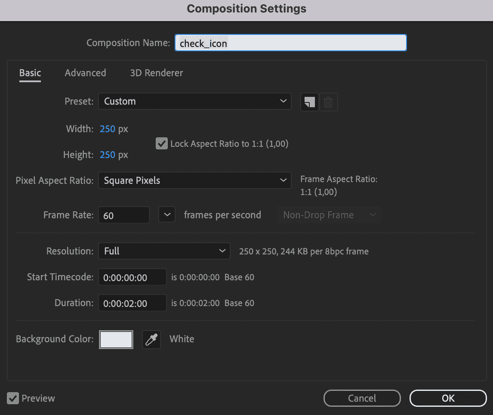

图 4.17 – 合成设置窗口视图

让我们调整一些这些设置。还记得如何做吗？以下是说明：

1.  从**项目**面板中选择您的合成。

1.  从顶部菜单中选择**合成** | **合成设置**。

1.  调整合成大小为**250** x **250** 像素。

1.  将帧率设置为**60**帧每秒。

1.  将持续时间设置为**2**秒。

1.  将背景颜色更改为`#989898`。请注意，背景颜色不会被导出，但我改变它是为了我们可以更好地看到白色圆圈。

这很简单，对吧？现在我们已经准备好了合成，让我们转到**层**面板。

# 理解我们的检查图标层

我们已经整理并调整了图标合成以满足我们的需求；现在是我们了解我们的图标在层方面的构建方式的时候了，所以，让我们检查我们的层面板中有什么。

如您在*图 4.18*中看到的，当我们检查层面板时，我们发现与我们在刚刚导入的插图文件中有的相同的两个层，**检查**和**椭圆形**。

为了清楚起见，**检查**是一个*描边*，**椭圆形**是一个*形状*。这很重要，将帮助我们给**检查**层带来我们想要的效果。但，现在不用担心；我们将在本节稍后看到这一点。

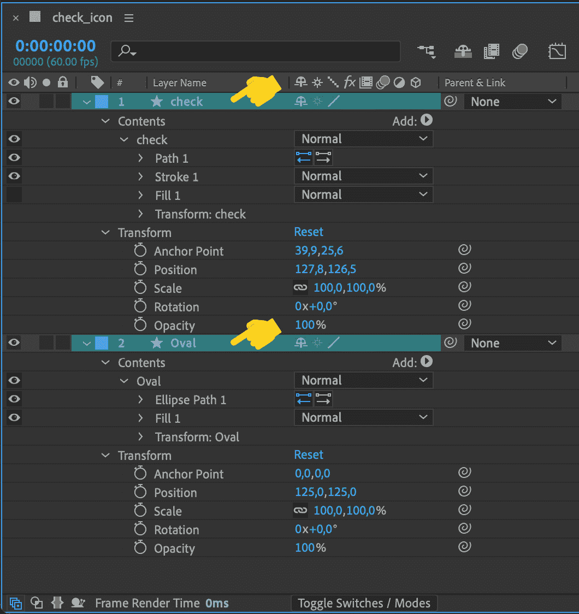

图 4.18 – 带有检查和椭圆形层属性的层面板

此外，正如您在前面的屏幕截图中可以看到的，我们的每一层都有很多子层。我们将在下一步中看到这一点。

但首先，让我们回顾一下。记住，我们的动画将从椭圆形变大开始。

建议

由于我们现在将专注于**椭圆形**，我建议暂时锁定并隐藏**检查**层，因为它在这个阶段不相关。当然，我们只有两层，可能没有必要开始隐藏或锁定其他层，但当我们开始处理一些更复杂的项目时，养成这个习惯是好的。

点击层面板中的小眼睛和锁定图标来隐藏和锁定您想要的任何层，如下面的截图所示：

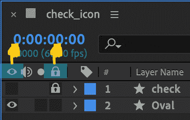

图 4.19 – 眼睛和锁定图标

# 添加关键帧

太好了！现在我们对我们层的了解更深入了，**椭圆形**独立存在，没有危险我们会不小心移动**检查**图标，让我们开始创建一些动作。

记得在*第三章*，“学习工具：熟悉 After Effects”，当我们讨论关键帧时吗？正是这样！关键帧用于创建运动，而要做到这一点，我们需要至少两个：一个作为起点的一个作为终点。

话虽如此，我们希望我们的**椭圆形**从 0 增长到 100%，对吗？有什么想法吗？当然，我们将创建两个关键帧并改变**椭圆形**的缩放，一个关键帧为 0%，另一个为 100%。现在让我们这样做。

## 改变缩放

我们将首先开始动画缩放。我们如何做到这一点？通过调整特定关键帧的缩放**椭圆形**属性。以下是这样做的方法：

1.  进入**图层**面板。

1.  打开**椭圆形**层的**变换**属性。你可以通过选择图层并按 *S* 来做到这一点，但我们将更详细地讨论快捷键在接下来的章节中。

![图 4.20 – 椭圆形层的缩放值

![图片 B17930_04_20.jpg]

图 4.20 – 椭圆形层的缩放值

1.  将时间滑块放在**0**帧。

1.  点击**缩放**的计时器来创建我们的第一个关键帧：

![图 4.21 – 缩放属性的新的关键帧

![图片 B17930_04_21.jpg]

图 4.21 – 缩放属性的新的关键帧

1.  将时间滑块移动到帧**30**。

1.  点击**缩放**属性左侧的小钻石来创建我们的第二个关键帧：

![图 4.22 – 第二个关键帧

![图片 B17930_04_22.jpg]

图 4.22 – 第二个关键帧

现在，让我们左右移动时间滑块；你能注意到任何不同之处吗？当然不能。我们刚刚创建了关键帧，但还没有改变**缩放**属性。让我们按照以下步骤进行：

1.  将时间滑块移动到帧**0**。

1.  点击我们刚刚创建的关键帧。

1.  将**缩放**属性的百分比设置为**0%**：

![图 4.23 – 缩放值为 0%

![图片 B17930_04_23.jpg]

图 4.23 – 缩放值为 0%

1.  按下空格键或将时间滑块从左向右移动；现在有什么变化吗？是的！我们的图标终于开始动起来了！

1.  将时间滑块放回**0**帧并按下空格键。这样做几次来检查动画；你认为怎么样？时间是否正确？可能太慢了？不用担心，我们将在讨论缓动时进行调整。

现在，回到我们的故事板，我们已经将**椭圆形**定义为放大到 110-120%，然后回到 100%。但是，为什么我们要这样做呢？还记得我们讨论过二维动画原则吗？对于这个小图标动画，我们将把**夸张**和**拉伸与挤压**原则应用到我们的**椭圆形**上，以展示其灵活性、质量、重量和速度。所以，简单地夸大其大小就会产生这种印象。

如何做到这一点？很简单。按照以下步骤：

1.  将时间滑块移动到帧**25**。

1.  点击钻石来创建一个新的关键帧。

1.  将缩放设置为 120%。

按下空格键再次播放我们的动画。你觉得怎么样？仅仅通过这个小调整，我们的动画现在看起来更真实了；当然，时间仍然不好，缺少一些 **缓动**，但我们正在朝着这个方向前进。

让我们继续使用 **椭圆形**。让我们调整时间。为此，我们只需要拖动我们的关键帧。我鼓励你尝试在时间轴上移动它们，看看 **椭圆形** 的行为。我将我的 **椭圆形** 关键帧设置为帧 **0**、帧 **18** 和帧 **21**：

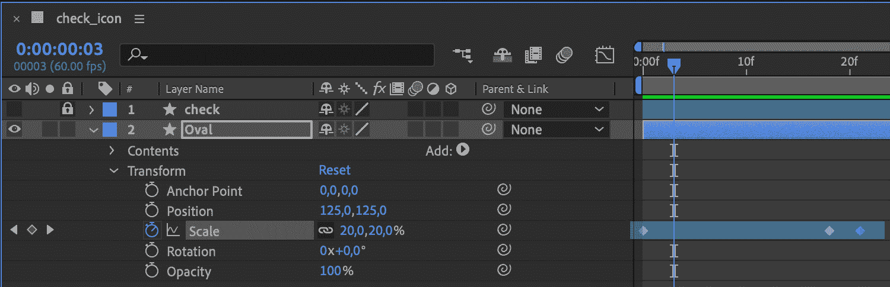

图 4.24 – 缩放关键帧

让我们把时间滑块移动到 **0**，然后再次播放几次。你觉得怎么样？现在看起来更好了，对吧？关于放大和缩小，也许我们可以稍微调整一下大小？让我们调整第二个关键帧，使其更微妙，将缩放值从 120% 调整到 110%。再次播放，现在看起来更平滑了。对！让我们继续前进！让我们调整 **不透明度** 属性，使我们的插图更加平滑。

## 调整不透明度

现在我们已经得到了我们想要的 **缩放** 属性，让我们调整不透明度。为此，我们将遵循与上一节相同的步骤。当然，我们可以在同一时间做这两件事，但我更喜欢一步一步地展示给你；我们会有足够的时间更快地完成事情，但我们想确保基础清楚，对吧？

重要

从现在开始，我将开始介绍一些可以节省你大量时间并帮助你提高生产力的快捷键。这里我使用的快捷键适用于 macOS。大多数都适用于 macOS 和 Windows；然而，如果你使用的是 Windows 系统，并且不确定要使用哪个快捷键，请查看 *第六章*，*不要停止！探索持续前进的插件和资源*，以获取 macOS 和 Windows 最常见和有用的快捷键列表。

话虽如此，让我们改变不透明度：

1.  选择 **椭圆形** 图层。

1.  按下 *T* 来显示 **不透明度** 属性（*T* 代表 **不透明度**，*A* 代表 **锚点**，*S* 代表 **缩放**，*P* 代表 **位置**，*R* 代表 **旋转**）。

1.  按下 *Shift* + *S* 以显示 **缩放** 关键帧。我们希望这个图层也可见，所以通过按下 *Shift* + *A*、*S*、*P* 或 *R*，我们可以打开和关闭它们而不会关闭其他图层。

1.  将时间滑块放置在关键帧 **0**。我们可以通过按下 *K* 来移动到下一个关键帧，按下 *J* 来移动到上一个关键帧。

1.  按下 **不透明度** 图层计时器来创建我们的关键帧。我们也可以通过按下 *Option* + *T* 来做到这一点。

1.  改变 `40`%，例如：

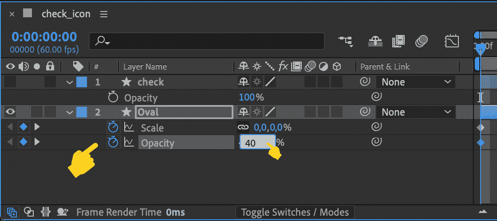

图 4.25 – 不透明度值

太好了！这是第一个创建的具有 40% 不透明度的关键帧。让我们创建第二个关键帧：

1.  通过按下 *K* 将时间滑块移动到下一个关键帧。

1.  按下  + *T* 创建一个新的关键帧或点击我们之前所做的那个小钻石图标。

1.  设置为`100`%。

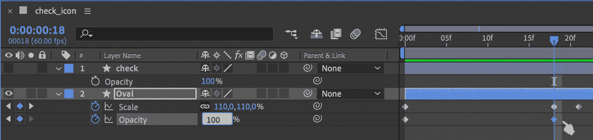

图 4.26 – 第二个关键帧的不透明度属性值设置为 100%

1.  将时间滑块移动到**0**并按空格键再次检查我们的动画。

至少对我来说看起来不错。一旦我们给动画添加一些缓动效果，它看起来就会更加逼真和灵活。但是，让我们先来动画化**检查**。

因此，**检查**的行为不同；它不会放大或缩小，也不会淡入，也不会旋转或移动。我们决定**检查**将做什么是绘制自己。我们如何做到这一点？嗯，我将向你展示如何使用**修剪路径**。

# 修剪路径

要显示和隐藏路径或显示其一部分，我们可能需要使用蒙版；然而，Lottie 与蒙版配合得不是很好，至少目前还不是。使用蒙版可能会给我们带来麻烦，所以我们将尝试避免使用它们并尝试其他方法。

另一个选项可能是逐帧绘制我们的**检查**动画帧，这样接下来的关键帧总是比第一个显示更多一点的绘制，但这将会非常耗时！

这就是修剪路径出现的地方。使用这个选项可以非常有助于节省时间和精力。让我们看看这个选项能为我们做什么：

1.  阻塞**椭圆**层。在这种情况下，我们不会隐藏这个层，因为它在**检查**层后面。

1.  通过按小眼睛和锁图标显示并解锁**检查**层。

1.  打开**检查**层。

1.  打开**内容**属性并关闭其他所有内容：

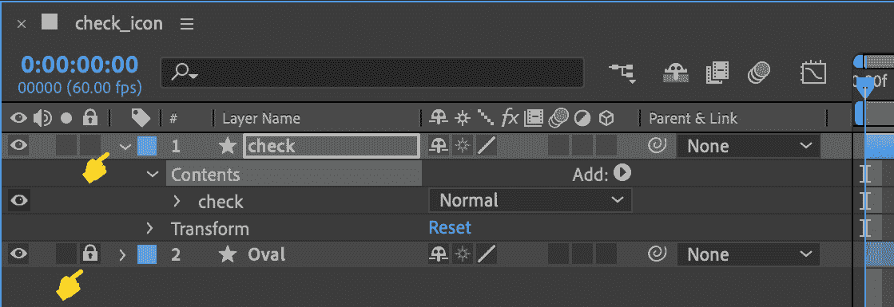

图 4.27 – 内容属性

1.  点击**添加箭头**按钮并选择**修剪路径**选项：

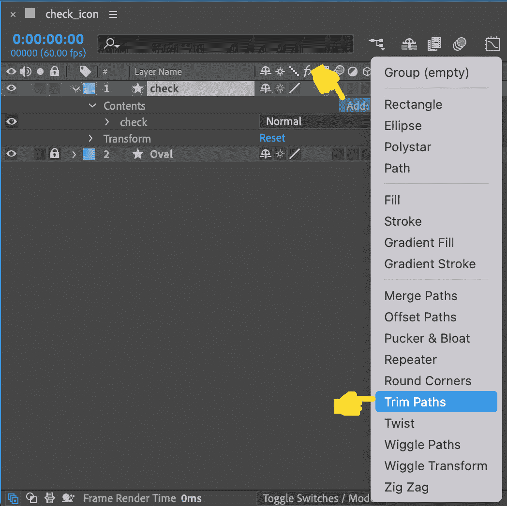

图 4.28 – 选择修剪路径

现在，让我们检查我们的图层面板；那里发生了什么？正如你所见，出现了一个名为**修剪路径 1**的图层。让我们通过点击小箭头打开它。出现了一些不同的选项；这些是什么？

这些新选项将允许我们决定**检查**路径是从路径的开始处还是结束处开始绘制自己的。这更像是一种擦除效果，而不是绘制效果。

图 4.29 – 修剪路径选项

让我们稍微玩一下这些选项：

1.  将时间滑块放置在关键帧**0**。

1.  在**开始**层创建一个新的关键帧。

1.  将**开始**值设置为**0**。

1.  将时间滑块放置在关键帧**30**。

1.  创建一个新的关键帧。

1.  设置为`100`%。

1.  将时间滑块移回**0**。

1.  按空格键检查动画。

这里发生了什么？看起来**检查**正在做我们想要的事情，但方向相反。它不是自己绘制，而是在擦除自己。对，这个功能有时可能会有些令人困惑，但不要沮丧！我花了一些时间才理解其背后的逻辑，而且即使现在，有时我也要尝试几次才能做对。所以，我鼓励你尝试调整**开始**和**结束**值，以熟悉效果及其行为。

现在我们交换一下值，尝试让它正确：

1.  让我们设置`100`%。

1.  转到下一帧并将**开始**值设置为**0**。

1.  按下空格键并查看。

太好了！现在，**检查**图标做得正确。它从无到有地绘制自己，就像有人在写一样，对吧？我们做到了！然而，动画放置的位置不正确。

注意到**检查**动画在**椭圆形**达到 100%显示在屏幕之前就开始了。如果我们看一下我们的时间轴（见*图 4.30*），我们可以看到两个图层的关键帧都在同一时间。它们都是从帧**0**开始的，这就是为什么检查图标和**椭圆形**同时播放的原因。

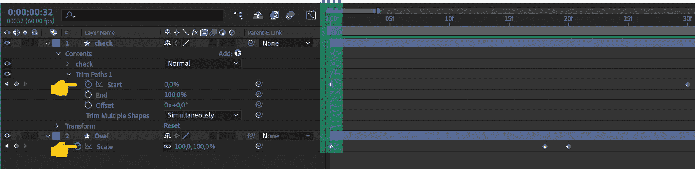

图 4.30 – 时间轴上的关键帧位置

记住，当我们定义我们的故事板时，我们决定**检查**将在**椭圆形**显示在屏幕上之后绘制。所以，为了做到这一点，我们需要调整一些事情：

1.  解锁**椭圆形**图层。

1.  选择**椭圆形**图层并按*S*键显示**缩放**属性。

让我们在图层面板上检查我们的关键帧。我们可以看到两个动画都是从帧**0**开始的。然而，根据我们的故事板，**检查**动画应该在**椭圆形**完全 100%显示在屏幕上时开始。这意味着，我们需要将**检查**关键帧移动到**椭圆形**动画的末尾。我们可以通过选择两个**检查**关键帧并将它们拖到右边来实现这一点。当两个关键帧都被选中时，它们都会变成蓝色：

1.  选择两个关键帧并将它们拖到右边。

1.  按下空格键并检查动画：

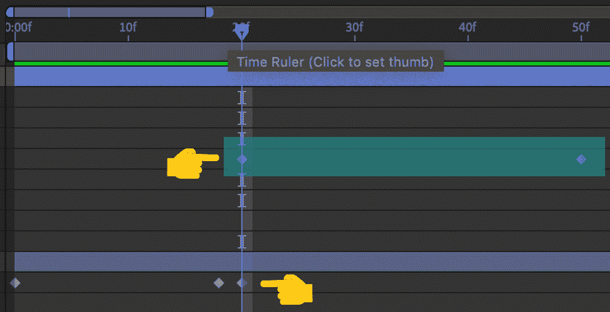

图 4.31 – 检查关键帧

太棒了！看起来现在很完美！然而，它看起来有点慢，不是吗？

1.  选择第二个**检查**关键帧。

1.  将它拖动到大约**35**帧。

1.  按下空格键播放动画。

完美，我们做到了！我们正在取得进展。现在，我们将添加火花。

# 处理径向爆发

为了给我们的动画增添一些趣味，我们将在**椭圆形**中添加一些火花。为了做到这一点，我们可以为每个单独的火花进行动画处理，绘制小圆圈，并改变每个的**位置**、**缩放**和**不透明度**值。然而，我们将尝试一种不同的方法。我将教你如何创建**径向爆发**，这是一个非常酷的效果，将为我们节省很多时间。

那么，让我们开始吧！让我们通过按** + *N* 创建一个新的合成，并将其命名为`Sparks`。我们不需要更改任何更多设置。

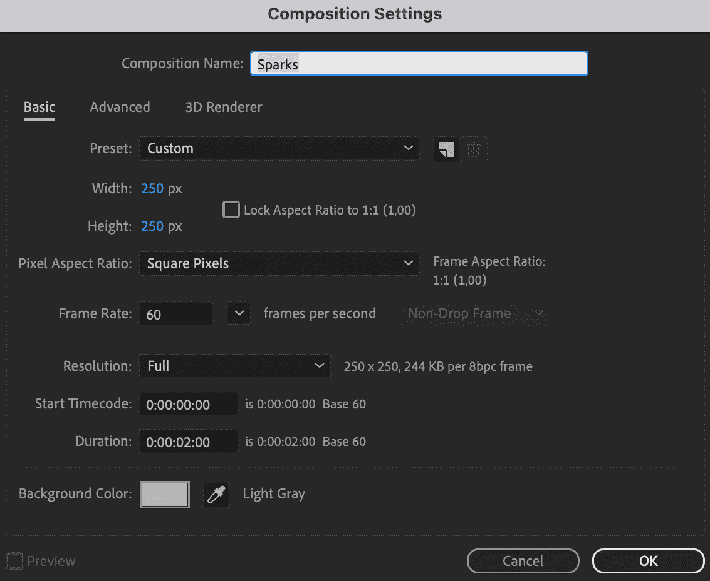

图 4.32 – 合成设置

按照以下步骤操作：

1.  现在，让我们在`Sparks`合成内绘制一个形状层。让我们画一个圆。

1.  从顶部菜单中选择**椭圆工具**。

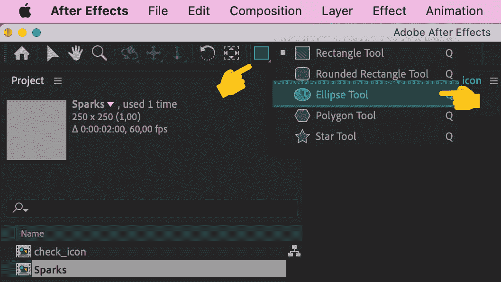

图 4.33 – 包含名为 Sparks 的新合成的项目面板视图

1.  在**舞台**面板中画一个圆。

1.  让我们画一个小圆圈。通过右键单击形状层的名称，`形状层 1`，来命名`circle`。

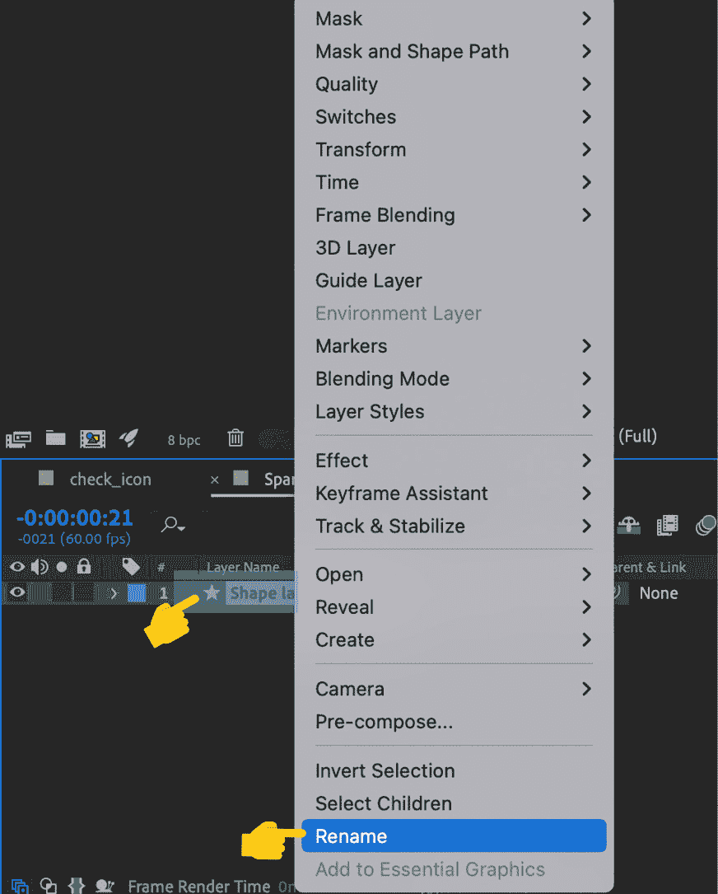

图 4.34 – 重命名图层

1.  让我们打开**circle**层，看看我们有什么。正如你可能注意到的，我们可以看到两个不同的**变换**选项：

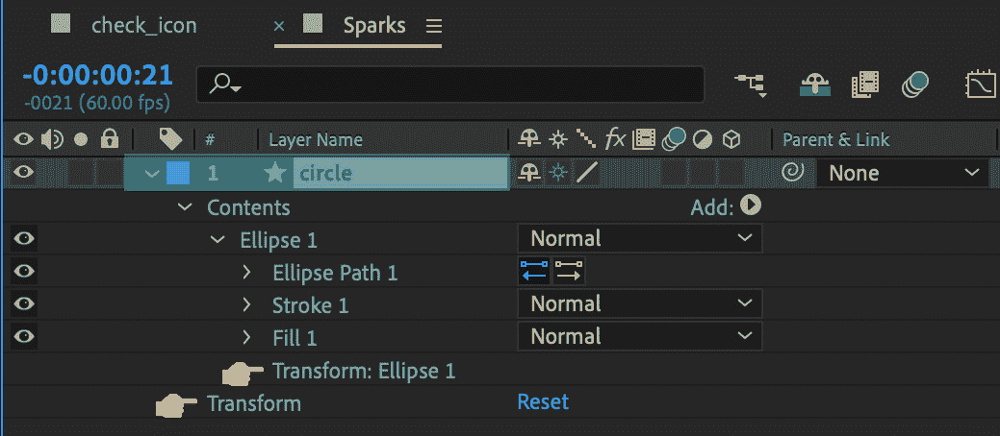

图 4.35 – 圆形层变换选项

对于这个效果，我们不会使用我们迄今为止一直在使用的**变换**选项；相反，如果我们想要径向爆发效果起作用，我们将与**内容**选项中可以找到的**变换**选项一起工作：

1.  因此，让我们打开它。打开**变换：椭圆 1**。

1.  点击**内容**。

1.  点击**变换：椭圆 1**。

如同你在*图 4.36*中看到的，我们找到了与我们在**变换**工具中找到的几乎相同的选项：

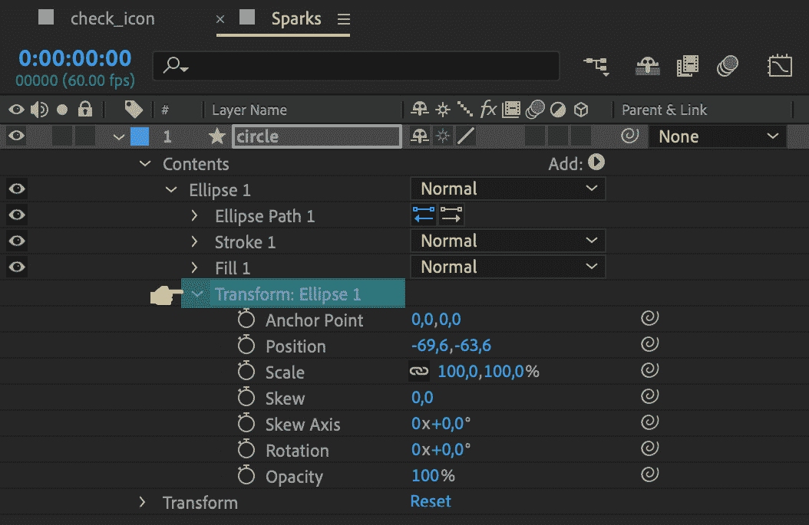

图 4.36 – 变换椭圆 1 选项

让我们动画化它的位置：

1.  选择**位置**属性。

1.  在帧**0**上创建一个关键帧。

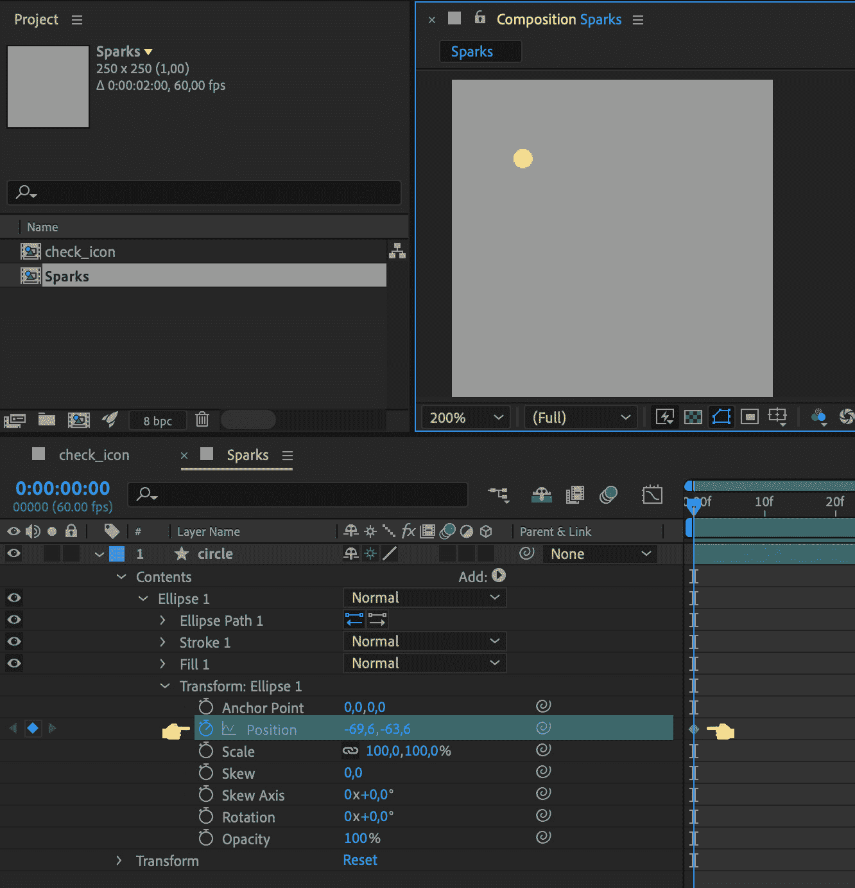

图 4.37 – 位置属性新关键帧的层和时间线视图

1.  现在，按住*Shift* + 并按右箭头三次；这将把我们的时间滑块移动到帧**30**。或者，只需拖放时间滑块。

1.  创建一个**位置**关键帧。

1.  将**circle**向上移动几个像素，向右移动几个像素。

图 4.38 – 位置属性第二个新关键帧的层和时间线视图

现在，让我们改变**缩放**属性，使其在最后扩展：

1.  将时间滑块移动到**0**。

1.  创建一个**缩放**关键帧。

1.  将时间滑块移动到帧**30**。

1.  创建第二个**缩放**关键帧。

1.  将圆缩小到**0**。

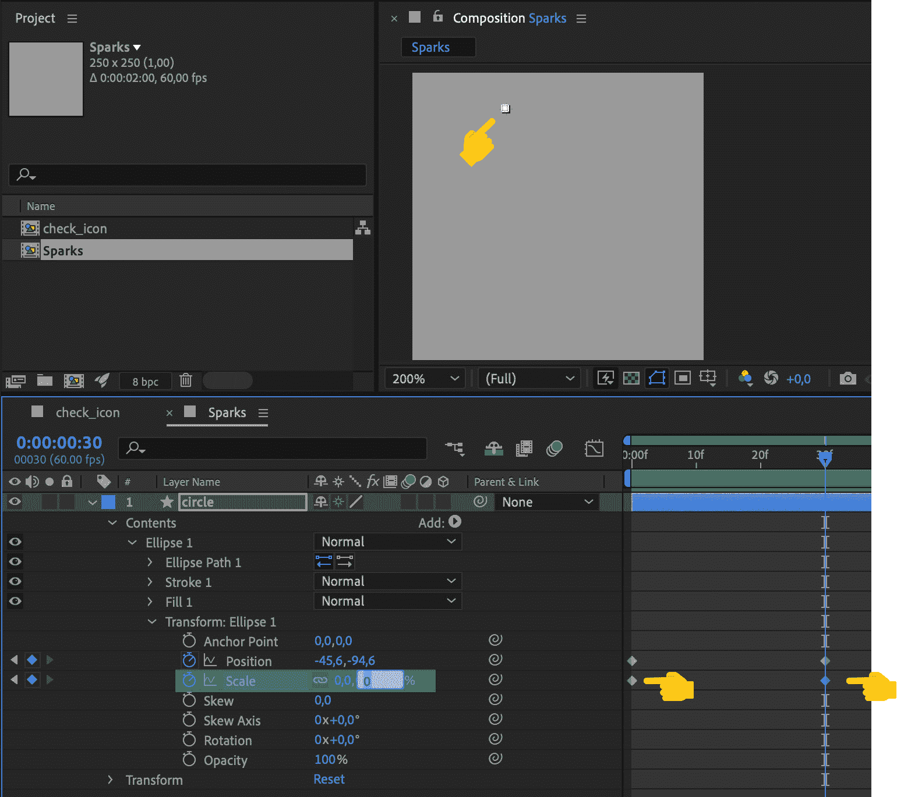

图 4.39 – 缩放关键帧的时间线视图

当我们处理这个时，让我们让我们的圆圈淡出，所以让我们改变**不透明度**：

1.  将时间滑块移动到**0**。

1.  创建一个**不透明度**关键帧。

1.  将时间滑块移动到**30**。

1.  创建第二个**不透明度**关键帧。

1.  将**不透明度**属性设置为**0**。

好的！你能感觉到吗？我们毫不费力地进行了动画制作！现在，你的时间线应该看起来像下面屏幕截图所示的那样：

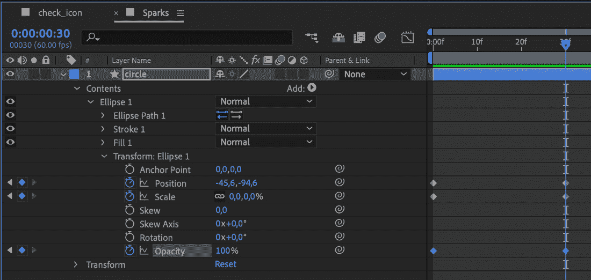

图 4.40 – 不透明度关键帧的时间线视图

让我们施放魔法：

1.  让我们选择**圆圈**。

1.  点击**添加**按钮。

1.  选择**重复器**选项：

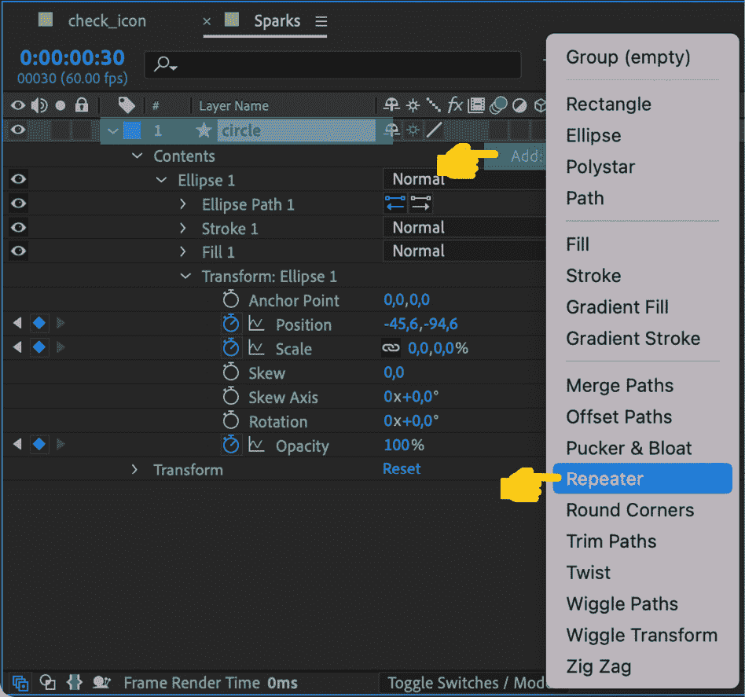

图 4.41 – 添加菜单视图

1.  **重复器 1**层将出现在我们的**图层**菜单中，正如您在下面的屏幕截图中所见：

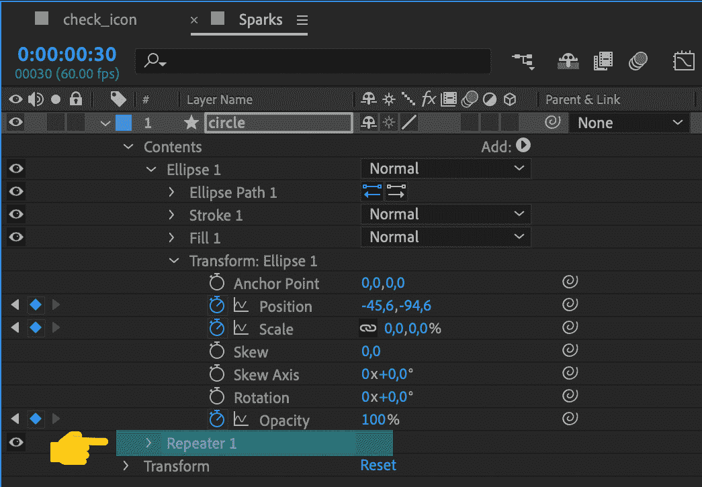

图 4.42 – 在图层面板中的重复器 1 层视图

让我们打开它看看里面有什么。正如您在下面的屏幕截图中所见，我们找到了新的属性和值。一如既往，我鼓励您在这里尝试不同的值：

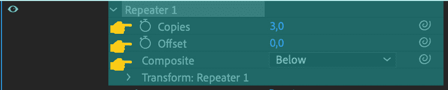

图 4.43 – 重复器属性视图

让我们继续。对于我们的动画，我建议你做以下事情：

1.  将**副本**值更改为**15**。

1.  打开**变换：重复器 1**。

1.  将**位置**设置为**0**。

1.  将**旋转**设置为**24**。

然后，按播放键！

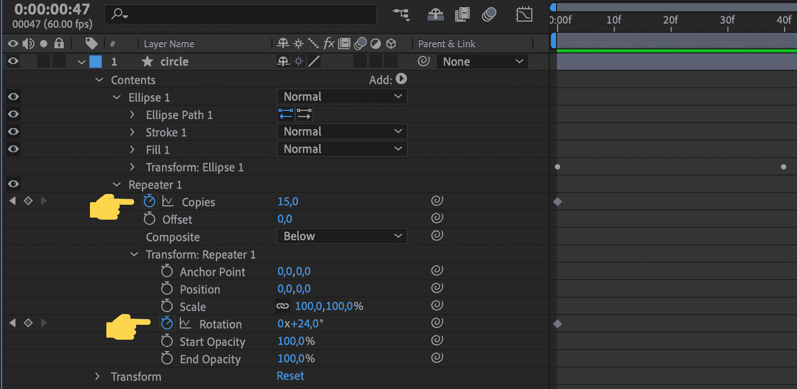

图 4.44 – 重复器属性和变换视图

这不是很酷吗？在很短的时间内，我们仅仅通过动画一个圆圈就创建了我们版本的火花。想象一下，如果我们开始添加更多元素，我们能做什么！

现在，让我们回到我们的主组成：

1.  转到**项目**面板。

1.  双击**勾选**图标。

让我们完成我们的动画：

1.  将`Spark`组成从**项目**面板拖到**图层**面板。

1.  转到时间线。

1.  将`Spark`组成拖到右边，使得动画从第**21**帧开始。我们的时间线将看起来像下面的屏幕截图：

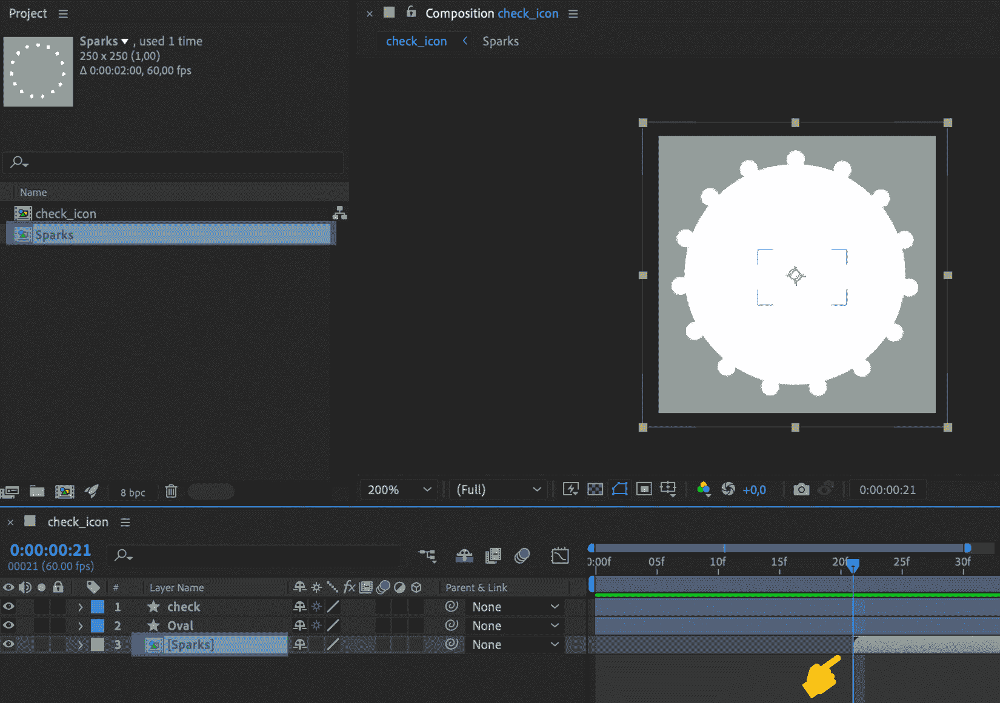

图 4.45 – 从第 21 帧开始的 Spark 组成时间线视图

现在，让我们播放动画！你怎么看？我将稍微调整`火花`；我将值更改为`110`%。让我们这样做，再播放一次。太棒了！我们几乎完成了！

图 4.46 – 径向爆发效果

干得好！我们已经走了很长的路！在本节的最后，我们学习了并实践了许多新事物。我们亲手制作了第一个动画图标。我们现在知道如何创建关键帧并更改属性值以创建运动和动画的错觉。我们知道通过更改图层的缩放、旋转、位置和透明度，我们可以达到很好的效果。

我们还学习了两个很酷的技术，这些技术在我们制作动画时可以节省我们大量的精力：修剪路径和径向爆发。我们还应用了本书第一部分学到的某些原则。

但是，在我们开始导出和交付我们的动画之前，我想向你展示我在前两章中提到的缓动效果。所以，让我们继续前进；让我们发现缓动！

# 添加缓动

现在我们已经让动画运行起来，让我们通过添加一些**缓动**来使其更加完美。还记得我们在*创造错觉：用二维经典动画的基本原则滚动起来*中提到的**预期**原则吗？这正是我们可以通过缓动实现的：只需点击一下，就能感知到加速和减速。而且，这个小调整将使我们的动画看起来更加美观、平滑和专业。下面是如何操作的：

1.  打开**椭圆**图层以显示其关键帧。

1.  前往时间轴，右键单击**缩放**关键帧**0**，并选择**关键帧助手**|**缓动出**。

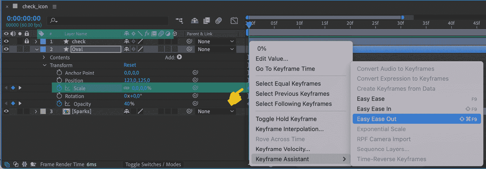

图 4.47 – 右键单击关键帧菜单视图

现在，让我们对最后一个关键帧，即放置在帧**:1**上的关键帧，做同样的操作。

1.  前往时间轴，右键单击**缩放**关键帧**21**，并选择**关键帧助手**|**缓动出**。

1.  对于第二个关键帧，即放置在帧**18**上的关键帧，让我们右键单击它并应用**缓动入**，这样你的时间轴应该看起来像*图 4.48*：

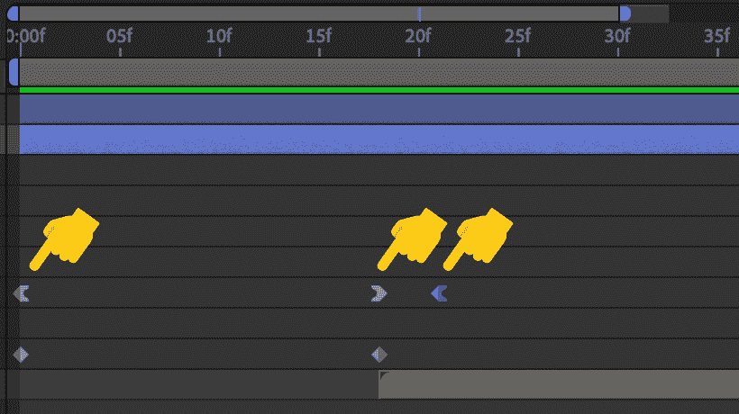

图 4.48 – 应用了缓入和缓出的关键帧表示

让我们来检查一下**缓动**面板。点击时间轴上的小图标。从图表中，我们可以预测动画的速度；它将在开始时指数级加速，并在结束时减速。

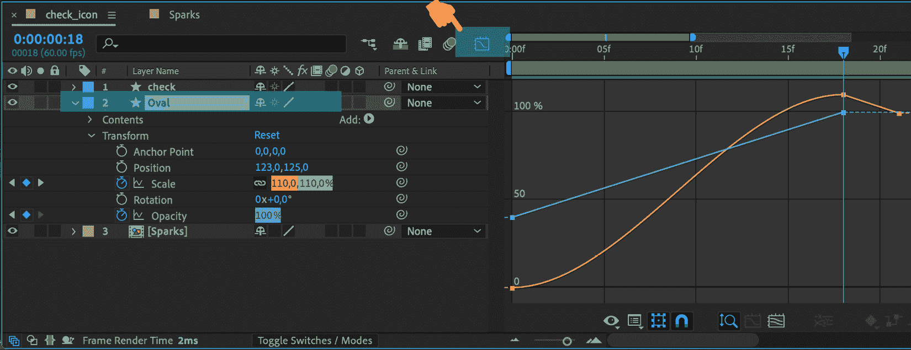

图 4.49 – 缓动面板视图

现在，让我们播放我们的动画。你认为怎么样？你能分辨出区别吗？我敢打赌你能！现在，动画看起来更平滑了。但在我们开始对**检查**图层做同样的操作之前，我建议你尝试不同的值和选项。你知道的，通过实践来学习！

太棒了！我们的**椭圆**看起来相当酷，所以现在让我们对**检查**也做同样的操作：

1.  打开**检查**图层。

1.  打开**内容**图层。

1.  打开**修剪路径**图层。

1.  右键单击放置在帧**21**上的关键帧，即我们的**检查**动画的第一帧。

1.  选择**关键帧助手**|**缓动**。

1.  对放置在帧**35**上的关键帧做同样的操作。

1.  播放动画。

它越来越接近了！现在，为了最终完成它，我将在`spark`合成中也这样做：

1.  前往**项目**面板。

1.  双击`spark`合成。

1.  选择所有关键帧。

1.  应用**缓动**。

1.  前往**项目**面板。

1.  双击**检查**图标合成。

1.  播放它。

我们的动画完成了！

正如你刚刚体验到的，Ease 是一个非常强大的工具，它将让你的动画在短时间内看起来令人惊叹。当然，关于它还有很多东西要学习；我们只是介绍了一些它的方面，以便你能够掌握进一步自学的基本技能。

正如我们在本书开头提到的，我们并不旨在成为 AE 教程书；相反，我们希望给你足够的知识、背景和资源，让你能够从概念到交付开始自己制作动画。因此，我鼓励你探索并阅读更多关于 Ease 的内容。

如果你不知道从哪里开始，你知道我们已经为你安排好了，所以请继续阅读，在*第六章* *不要停止！探索持续前进的插件和资源*中，你将找到更多关于 Ease 的资源以及更多内容！

# 摘要

这并不是很难，对吧？我们很快就完成了我们的第一个看起来专业的动画！我们的客户在购买后不会感到困惑，我们的应用看起来会更好。双赢双赢！

在本章中，我们完成了一个真实的项目，并学习了 UX 动画 AE 工作流程。我们现在已经涵盖了整个过程，从构思到最终动画。我们知道如何阅读和理解分镜脚本，我们学习了如何将我们的资产导入 AE，设置合成，创建关键帧，并修改层属性，如**缩放**、**位置**、**旋转**和**不透明度**来创建我们的动画。我们还学习了如何使用 Trim Paths 和径向爆发来创建特殊效果，如何调整时间，以及如何应用 Ease 来最终完成我们的项目。

让我们继续到下一章，我们将学习如何将我们的动画导出为`.json`文件，并在 LottieFiles 平台上预览。在那里见！
