# *第五章*：与世界分享：使用 LottieFiles 进行工作

我们准备好了，即将将我们出色的第一个 Lottie 动画导出为`.json`文件，然后添加到我们的应用或网站中，使用**React Native**。我们的应用即将变得令人惊叹，并带来质量上的改变。跟我来！

在本章中，我们将学习如何使用 Adobe **After Effects**（**AE**）的 Bodymovin 和 LottieFiles 插件导出我们的 Lottie 动画。我们将指导你创建 LottieFiles 平台账户，以便我们可以预览我们的动画并将它们交给开发者。我们还将查看 LottieFiles 的 iOS 移动应用，以便我们可以在移动设备上轻松测试我们的动画。我们还将教你如何在不使用 AE 的情况下创建简单的动画，最后，我们将通过将动画转换为 Telegram 的贴纸来享受一些乐趣。

在本章中，我们将介绍以下主题：

+   将我们的动画从 AE 导出为`.json`文件

+   在 LottieFiles 中创建账户

+   探索 LottieFiles 仪表板

+   在桌面和移动 Lottie 平台中进行测试的重要性

+   不使用 AE 创建和编辑 Lottie 动画

+   将**可缩放矢量图形**（**SVG**）文件转换为动画 Lottie 文件

+   将 Lottie 文件转换为 GIF

+   创建 Telegram 贴纸和贴纸组

# 技术要求

对于本章，我们需要一些特定的插件，这些插件将帮助我们导出动画为`.json`文件，并在桌面和移动设备上预览。我们需要的工具如下：

+   Adobe AE

+   Bodymovin AE 插件

+   LottieFiles AE 插件

+   LottieFiles 移动版

+   Chrome、Safari 或你选择的浏览器

# 导出我们的动画以供交接

要将我们的动画从 AE 导出为`.json`文件，我们可以使用 AE 的**Bodymovin**和**LottieFiles**插件。但是，我们必须学习两者吗？你可以自由选择使用任何一个；它们都可以下载，免费使用，并且得到完全维护和支持。

下载和安装插件

对于下载和安装指南，你可以跳转到*第六章*，*不要停止！探索持续前进的插件和资源*，我们将引导你完成这个过程。

因此，只需选择你感觉更舒适的一个或最适合你工作流程的一个。也许你只需要使用 Bodymovin，但是 LottieFiles 将为你提供额外的测试和预览工具。

对于我来说，我真的很习惯使用 Bodymovin，特别是因为你现在已经知道，这是第一个可以将你的动画转换为`.json`文件的插件；它简单且能完成工作。但是，时代在变化，新的工具和新的功能也随之出现。

在 LottieFiles 的幕后有一支庞大的专业团队。我必须说，这些天来，LottieFiles 插件与我的工作流程更加匹配。它让我能够轻松地在桌面和移动设备上预览我的动画，并且可以瞬间与利益相关者分享。

话虽如此，我建议您先使用这两个插件，然后再决定哪个最适合您。让我们先探索 Bodymovin。

## 使用 Bodymovin 导出我们的动画

正如我们在前面的章节中看到的，Bodymovin 是第一个允许我们将动画导出为 `.json` 文件的 AE 插件，并且它工作得非常完美。它简单且提供了一些有趣的导出选项，我们将在下一分钟看到。

但是，在我们开始之前，我们假设您已经为 AE 安装了 Bodymovin，否则，您可以跳到 *第六章*，*不要停止！探索将帮助您继续前进的插件和资源*，并按照步骤安装它。

好的，假设我们已经准备好了一切（安装了 Adobe AE 和 Bodymovin 插件），那么让我们在 AE 中打开 Bodymovin 插件：

1.  打开 Adobe After Effects。

1.  打开我们的 `check_icon.ae` 项目。

1.  前往顶部导航菜单并点击 **窗口** | **扩展** | **Bodymovin**：

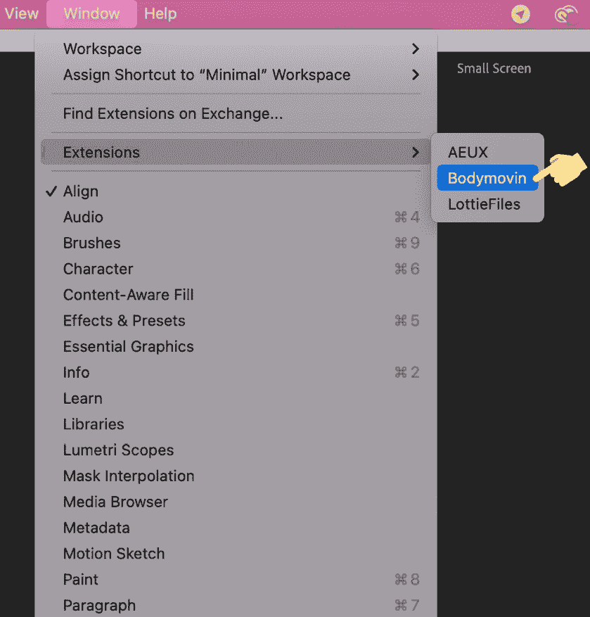

图 5.1 – 在 AE 中打开 Bodymovin 面板

让我们检查一下 **Bodymovin** 面板。

首先，面板在 **渲染** 视图中展开。这是我们将会关注的视图，因为其他选项在此刻对我们来说并不相关。正如我们在 *图 5.2* 中所看到的，我们项目中的两个组合在这里被列为 **check_icon** 和 **Sparks**：

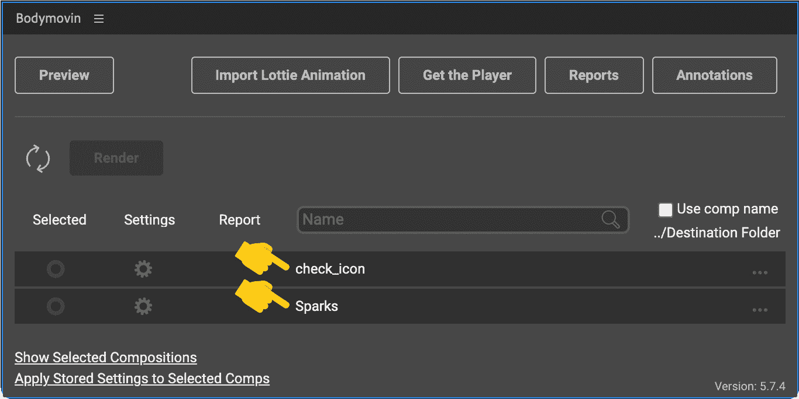

图 5.2 – Bodymovin 组合视图

我们可以导出面板中列出的任何组合，但我们的目标是导出整个动画。那么，我们应该导出面板中列出的哪个组合呢？没错，包含整个动画的主要组合，即 **check_icon** 组合。

在导出之前，对于每个组合，我们都可以调整一些设置。这在使用图像、表达式和实时文本时非常有用，但正如您所知，我强烈建议我们的动画尽可能简单。如果您想了解更多信息，可以查看我们在 *第六章*，*不要停止！探索将帮助您继续前进的插件和资源* 中对支持的 Lottie 功能的讨论。

现在，让我们导出我们的动画：

1.  点击 **Selected** 列表下方的 **check_icon** 组合左侧的小圆圈。

1.  点击右侧的三个绿色点图标以保存您的 `.json` 文件并选择您的文件夹目的地。注意，`.json` 文件默认命名为 `data.json`，但您可以给它任何您想要的名称。我将我的命名为 `check_icon.json`：

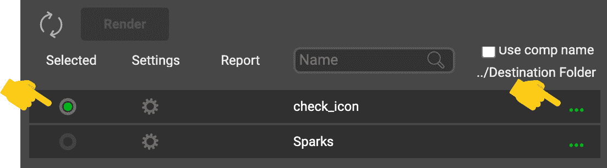

图 5.3 – check_icon 选中

1.  你现在可以看到 **渲染** 按钮被突出显示，并且目标文件夹位于 **check_icon** 名称旁边可见。让我们点击 **渲染** 按钮：

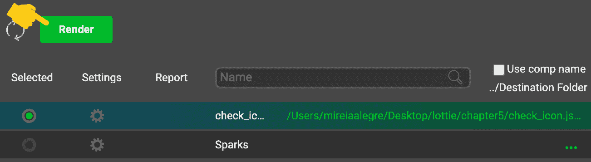

图 5.4 – 渲染按钮突出显示

1.  点击 **完成** 按钮：

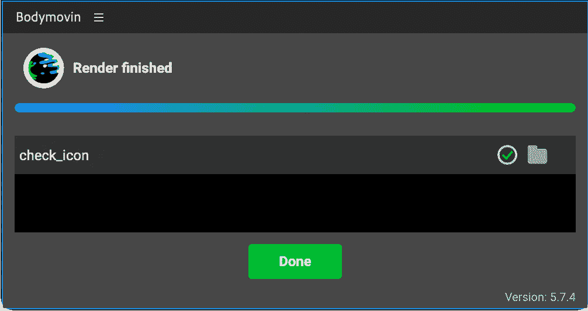

图 5.5 – 渲染成功完成

太好了！我们的动画已导出为 `.json` 文件，并准备好预览。但在我们这样做之前，我们将向你展示如何使用 LottieFiles 插件完成同样的操作。

## 使用 LottieFiles 导出我们的动画

在过去几年里，LottieFiles 社区的成员一直非常忙碌，并推出了一款名为 **LottieFiles** 的新 AE 插件。

LottieFiles 插件基于实际的 Bodymovin 开源项目，但有一些 Bodymovin 没有的额外功能。这就是为什么我们将看到如何使用 LottieFiles 导出你的动画。

因此，我们假设你已经准备好了所有东西，否则，请继续前往 *第六章* 的 *安装 LottieFiles 插件* 部分，*不要停止！探索将帮助你继续前进的插件和资源*，我们将展示如何下载和安装 LottieFiles 插件的详细信息。

无论何时你准备好了，让我们在 AE 中打开 LottieFiles 插件：

1.  打开 Adobe After Effects，如果你还没有这样做的话。

1.  打开我们的 `check_icon.ae` 项目。

1.  点击顶部导航菜单并选择 **窗口** | **扩展** | **LottieFiles**：

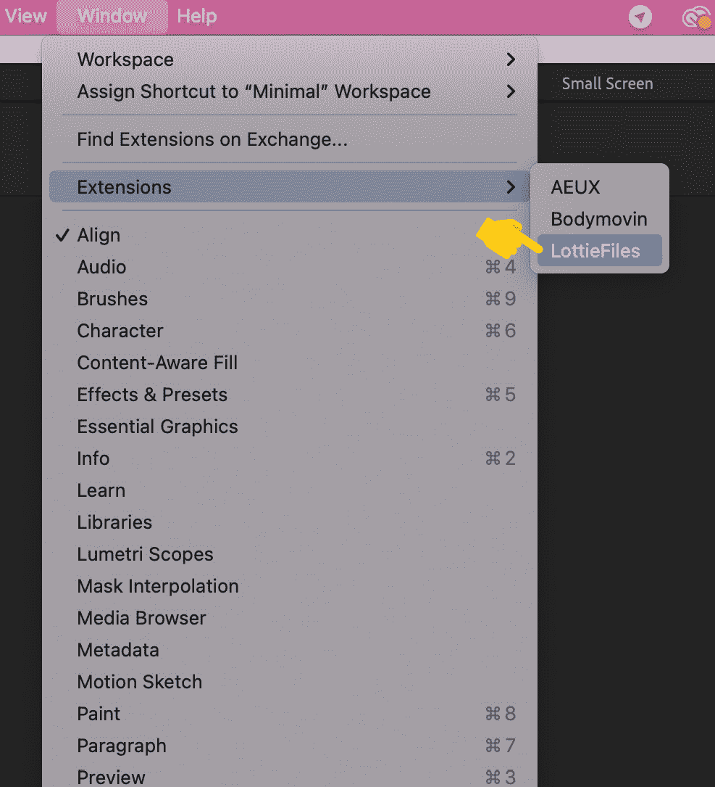

图 5.6 – 在 AE 中打开 LottieFiles 面板

请记住

要能够访问 LottieFiles 插件面板，你需要创建一个 LottieFiles 平台账户。我们将在下一节中介绍这一点，所以如果你想现在创建你的账户，请跳到下一节，然后再回来。我们在这里等你。

太好了！现在，既然一切都已经安排妥当，让我们检查 AE 的 LottieFiles 插件面板。

初看之下，LottieFiles 面板与 Bodymovin 非常相似。两者都在组成面板上打开。我们还可以看到我们组成列表，每个组成旁边的 **设置** 工具图标，以及用于导出我们的动画的 **导出** 箭头图标，如 *图 5.7* 所示供参考：

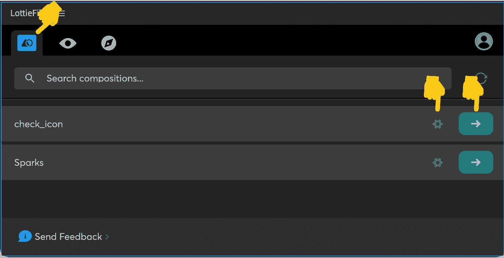

图 5.7 – LottieFiles 面板组成视图

在 **组成** 面板旁边，我们可以找到一些其他图标，如 *眼睛* 和 *指南针*：

图 5.8 – LottieFiles 面板顶部图标

*眼睛* 代表 **预览** 面板。在这个面板中，我们可以找到我们迄今为止所渲染的每一个动画，如下图所示：

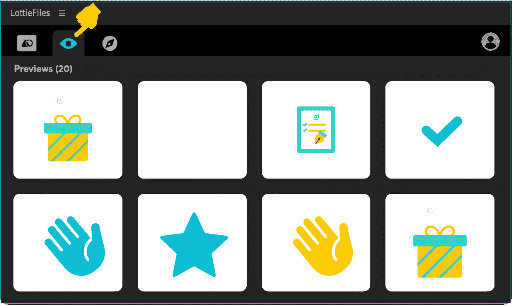

图 5.9 – LottieFiles 面板预览视图

通过选择任何显示的动画，我们将看到其详细信息，如文件大小、帧率、尺寸和导出时间。我们还可以更改背景颜色，以查看它在不同场景中的外观，或者直接将其导出到我们的 LottieFiles 移动应用。我们可以通过点击小 *地球* 图标来保存文件或与社区分享：

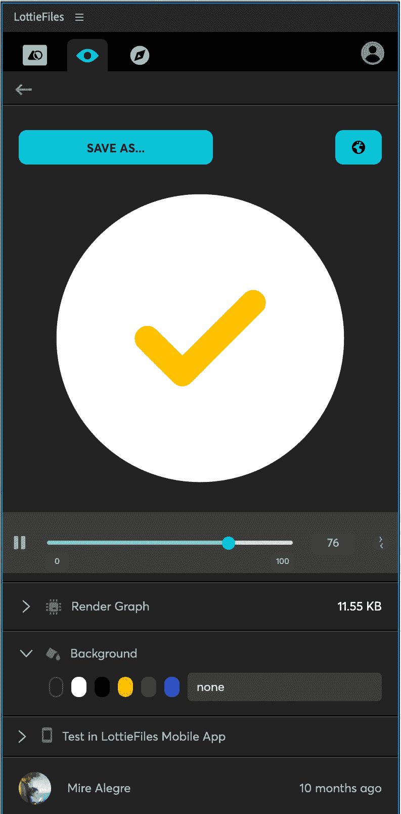

图 5.10 – LottieFiles 面板预览详情

*指南针* 代表 **搜索** 面板。在这个面板中，我们可以查找 LottieFiles 库中的免费动画来使用或获取灵感。当我们不需要完全个性化的动画时，这变得非常有用。想象一下，如果我们需要一个加载条；我们可以搜索一个，将其加载到 AE 中，并更改我们需要的任何内容，比如颜色、时间等等。

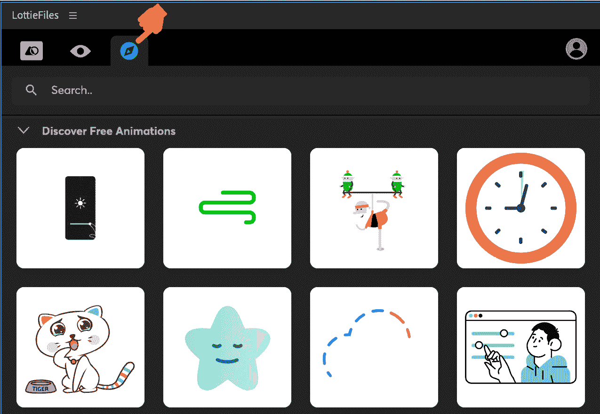

图 5.11 – LottieFiles 面板 – 发现免费动画视图

我有时会寻找一个动画作为我心中想法的起点，检查它是如何制作的，或者只是为了风格或时间灵感。

LottieFiles 库中的一些动画包含 `.json` 文件以及 AE 文件，免费下载和使用。要知道动画是否可以下载为 AE 文件，您需要寻找包含 **下载 AEP 文件** 按钮的动画：

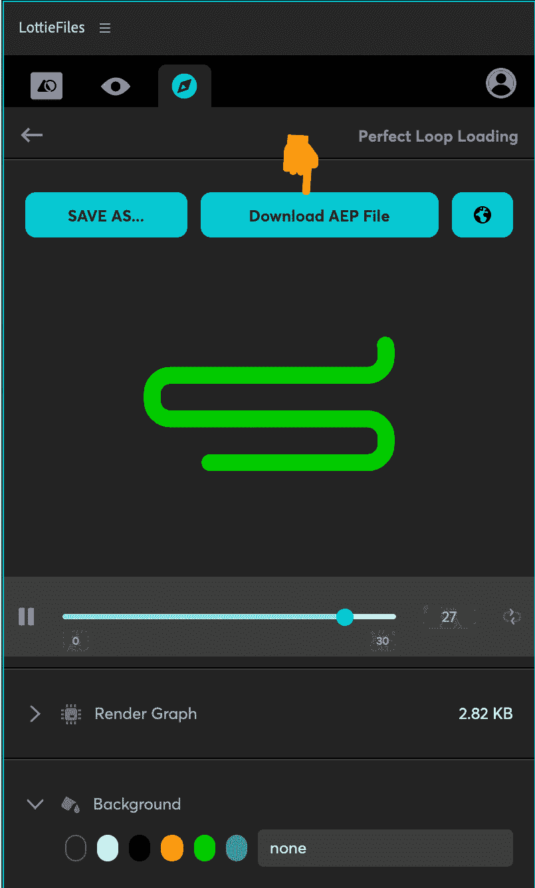

图 5.12 – LottieFiles 面板 – 发现免费动画详情

现在我们已经了解了不同的 LottieFiles 面板选项，例如 **组合**、**预览** 和 **搜索** 面板，让我们专注于导出我们的动画。

要做到这一点，请执行以下步骤：

1.  让我们点击回 **组合** 面板视图。

1.  点击 **check_icon** 旁边的箭头：

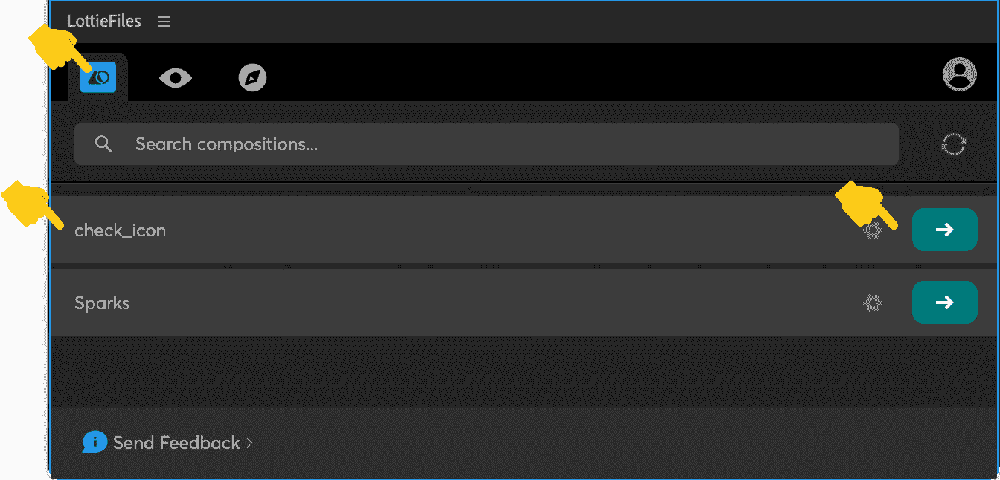

图 5.13 – LottieFiles 面板组合视图

我们的 **check_icon** 动画出现在面板中。

1.  现在，我们可以将我们的文件保存为 `.json` 或 `.lottie` 文件，正如我们之前提到的，它们是相同的，或者将其上传到我们的预览中：

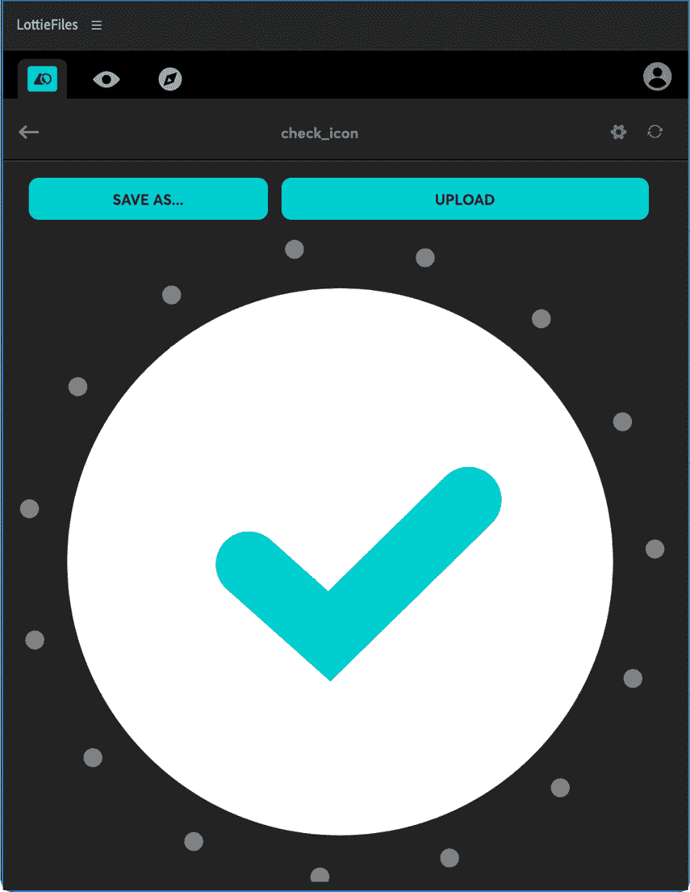

图 5.14 – LottieFiles 面板 – 成功导出 Lottie

1.  如果我们点击 **上传** 按钮，动画将出现在 **预览** 视图中。耶！

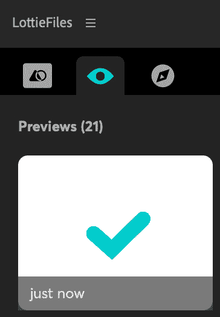

图 5.15 – LottieFiles 面板 – 我们的新图标上传到预览视图

太棒了！我们刚刚将动画导出为 `.json` 文件，这意味着我们创建了第一个 Lottie！

现在我们知道了如何通过使用 Bodymovin 或 LottieFiles 插件将 AE 动画文件导出为 `.json` 文件，让我们进入 LottieFiles 平台，为此，我们将创建一个用户。让我们开始吧！

# 在 LottieFiles 中创建用户账户

我们已经将动画导出为 `.json` 文件，并且有了这个文件，我们可以将其交给技术团队，或者继续学习本书的第三部分，“将您的 Lottie 动画添加到移动应用中”，了解如何在我们的应用中实现动画。

但是，我们不要急于行动；LottieFiles 平台允许我们在将动画交给开发团队之前快速上传和测试我们的动画，这样我们就能确保一切就绪，并且我们没有使用任何不受支持的特性。

为了做到这一点，正如我们之前提到的，我们需要在 LottieFiles 平台上注册，以便能够使用 AE 的 LottieFiles 插件导出我们的动画：

1.  在您的浏览器中转到 [`lottiefiles.com/`](https://lottiefiles.com/)：

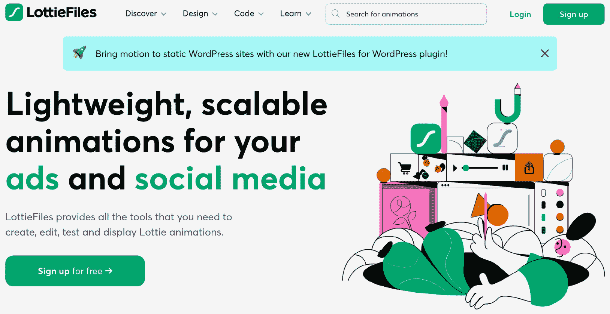

图 5.16 – lottiefiles.com 桌面浏览器视图

1.  点击**免费注册**按钮。

1.  选择最适合您的选项来创建您的账户，例如 Facebook、Google 或电子邮件：

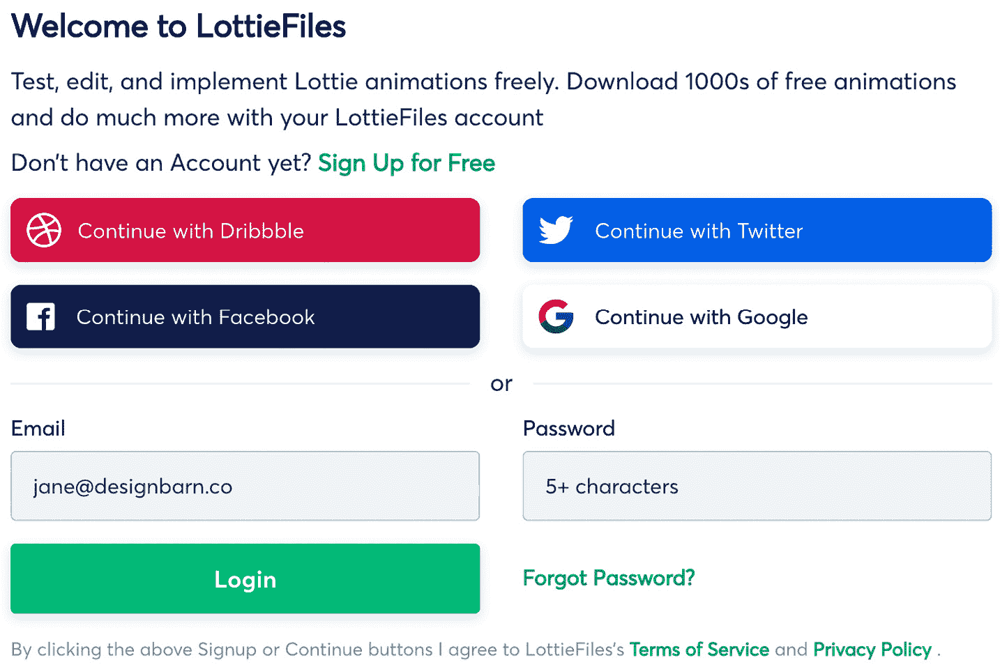

图 5.17 – LottieFiles 登录/注册窗口

然后，您就完成了！

正如我们在*第一章*，“开始使用 Lottie”中提到的，在 LottieFiles 桌面平台上，您可以做很多事情，包括搜索动画、雇佣动画师、买卖动画，以及搜索插件和工具。但是，目前我们将专注于我们的用户仪表板，如图 5.18 所示：

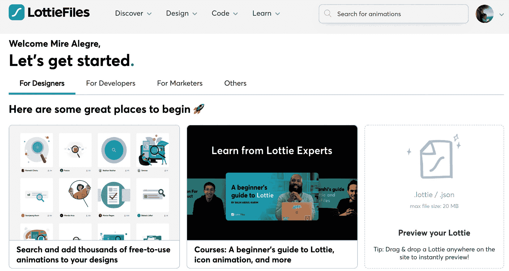

图 5.18 – LottieFiles 平台登录视图

在我们进入下一节开始探索 LottieFiles 平台之前，让我在这里简要回顾一下。在本章中，您刚刚创建了您的第一个 LottieFiles 账户，并使用 AE 的 Bodymovin 和 LottieFiles 插件将动画导出为 `.json` 文件。现在只剩下一个步骤，那就是上传和预览我们的动画图标，并与全世界分享！

# 探索 LottieFiles 控制台

LottieFiles 平台允许我们上传、保存和分享我们的动画给开发者、客户，甚至如果我们愿意的话，给全世界。而且，不仅如此，它还提供了我们公共动画的统计数据以及关于点赞、购买等信息。如何？让我们来看看。要做到这一点，只需将鼠标悬停在您的头像上，并选择任何选项，例如，例如，选择**我的公共动画**选项：

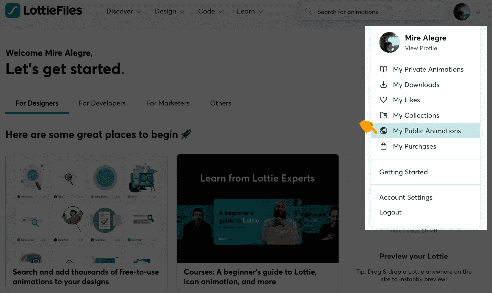

图 5.19 – 我的仪表板菜单视图

一旦我们打开我们的仪表板，我们可以在屏幕左侧看到一些不同的选项。还有一个空的中部区域，其中显示一条鼓励我们上传第一个动画的消息：

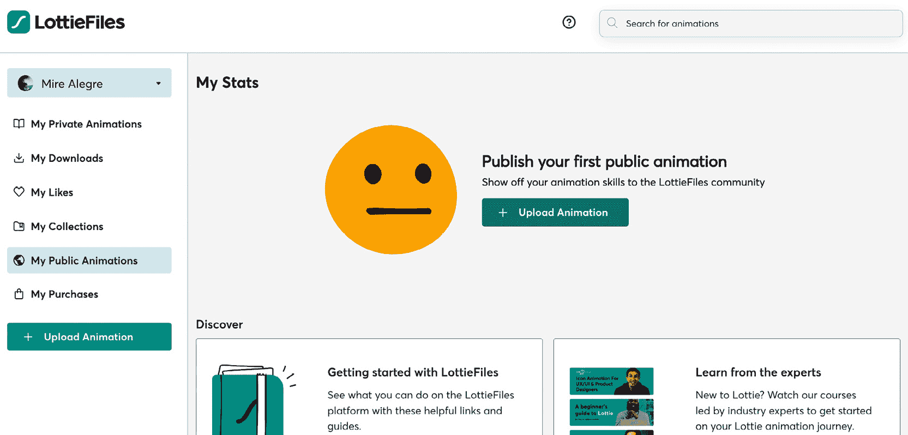

图 5.20 – 我的仪表板菜单视图

正如你所见，LottieFiles 是一个非常直观且易于使用的工具。但是，让我们快速浏览一下左侧的菜单。在这里，我们可以看到几个部分，我们将在下一节中查看。

## 我的下载

我的下载部分是我们找到从 LottieFiles 平台下载的任何动画的按日期列表的地方。任何 `.json`、`.ae`、`.gif` 或其他你下载的文件格式都会出现在这里：

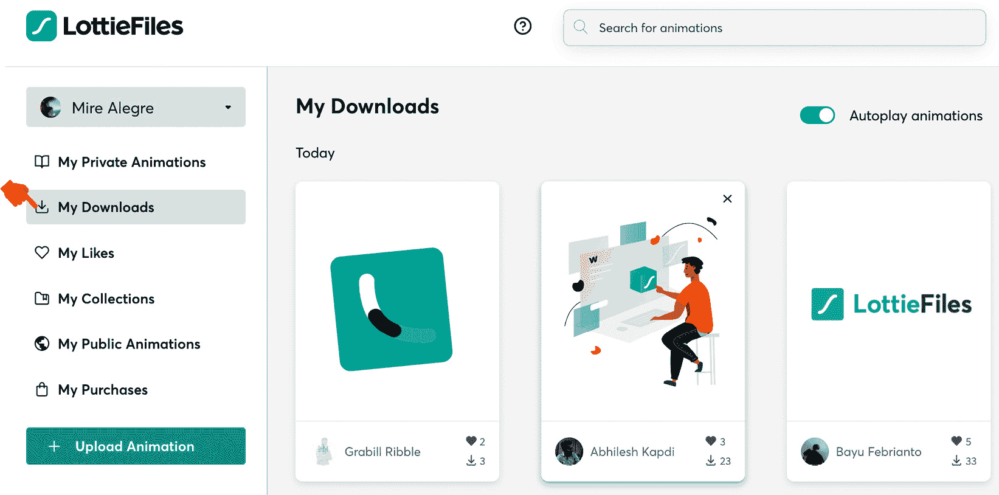

图 5.21 – 我的下载视图

## 我的点赞

在这个部分，我们找到了我们点赞的所有动画的列表。我把它用作“稍后查看”的功能，所以每次我在 LottieFiles 中搜索时，看到一些动画可以作为未来参考，我都会点赞，这样它就会被保存在这个部分：

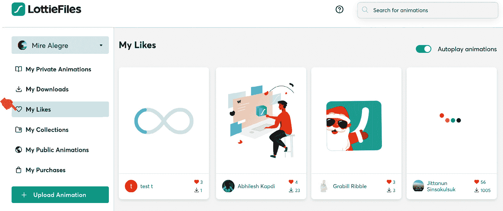

图 5.22 – 我的点赞视图

## 我的公共动画

如果你愿意将你的动画分享给公众，这个部分相当酷。在这里，你可以找到一些关于其他用户给你点赞的统计数据，你动画被下载的次数，以及个人资料查看次数。你还可以预览你发布到公众的所有动画以及正在审查以供分享的动画：

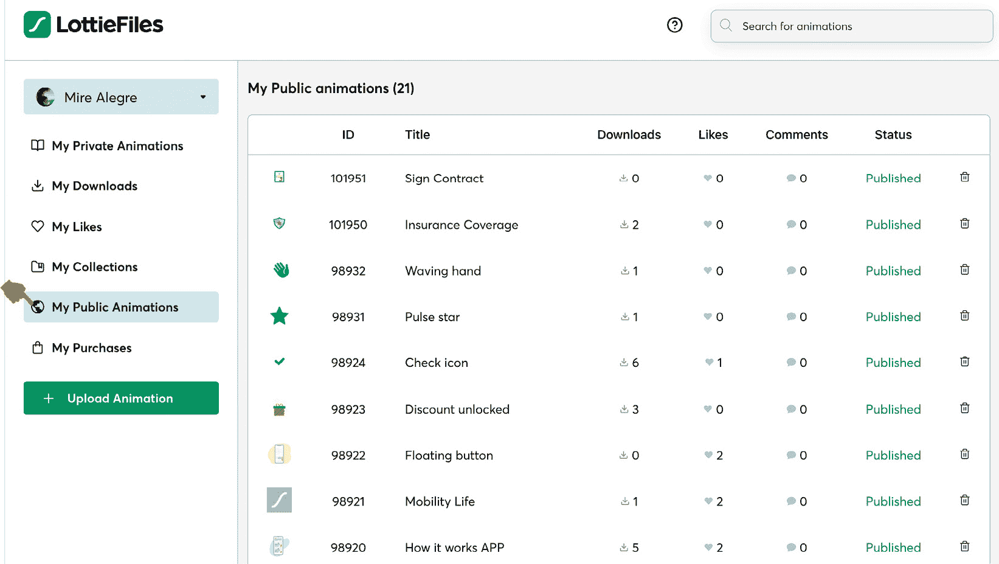

图 5.23 – 我的公共动画视图

## 我的购买

任何时候你购买一个动画，它都会出现在这里。在我的情况下，这个区域是空的，因为我通常自己创建动画，但我鼓励你快速浏览一下市场。它可以为提供灵感，因为那里有那么多优秀的动画师：

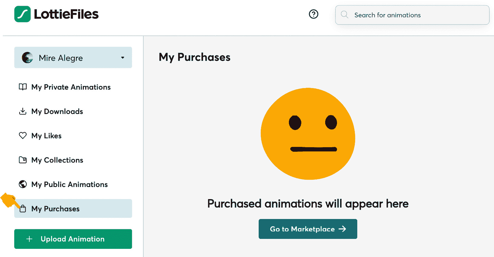

图 5.24 – 我的购买视图

## 我的私有动画

最后，对我来说，我最常用的部分是**我的私有动画**。在这里，你可以找到你在 LottieFiles AE 插件中预览的所有动画，或者你通过 LottieFiles 桌面和移动平台上传的动画：

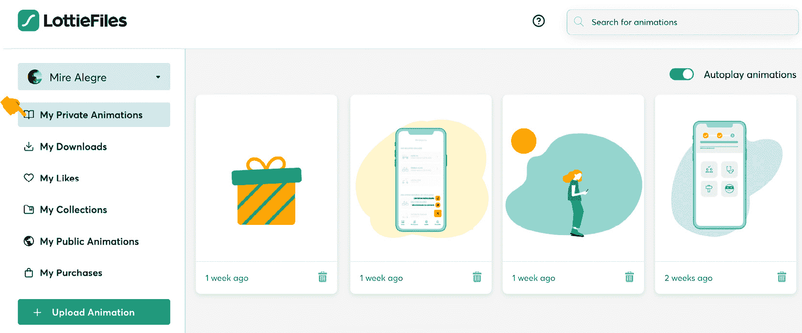

图 5.25 – 我的私有动画视图

现在我们已经熟悉了 LottieFiles 控制台，让我们开始上传我们的动画；请跟随我到下一节，我们将了解所有相关信息。

# 在桌面和移动 LottieFiles 平台上测试的重要性

现在，我们即将上传我们的动画到 LottieFiles 并准备好交付。这对我是一个非常激动人心的时刻。当我为 Lottie 动画时，我看到三个重要的里程碑。首先，当我们使用 Bodymovin 或 LottieFiles 插件在 AE 中渲染动画并检查一切是否正常；第二个重要时刻就是现在，当我们即将将动画上传到平台以检查一切是否正常；第三个里程碑是当我们的动画上线时！但是，我们不要急于求成；让我们上传我们的图标并检查一切是否运行良好。

预览我们的 `.json` 动画有三种方式：

+   在 LottieFiles 插件为 AE 的预览窗口中。

+   在 LottieFiles 浏览器平台上上传、预览和交付。

+   在 LottieFiles 的 Android 和 iOS 应用中预览。

## 使用 LottieFiles 插件为 AE 预览 .json 文件

正如我们在本章前面所见，一旦我们在 AE 的 LottieFiles 插件中渲染了动画，我们就可以在同一个插件面板的 **视图** 部分自动看到它的预览。这里我们不仅能做这件事。我们还可以做以下事情：

+   查看有关文件大小的更多信息。

+   更改预览的背景颜色。

+   保存为 `.json` 或 `.lottie` 文件。

+   将文件上传到 LottieFiles 仪表板中的 **我的私有动画**。

+   生成一个二维码，从我们的移动设备扫描以在那里预览。

因此，正如您所看到的，LottieFiles 插件允许我们从同一个地方渲染、预览、上传和交付我们的动画。

话虽如此，我强烈建议无论 `.json` 文件将在哪里显示（网页、iOS 和/或 Android），都要上传和预览它们，即使我的动画在 LottieFiles 插件中看起来完美。您很快就会体验到为什么我会这么说。

## 在 LottieFiles 平台上上传和预览 .json 文件

让我们看看如何进入下一步；让我们看看如何上传和预览我们的 `.json` 动画。我们已经使用 Bodymovin 或 LottieFiles 插件渲染并保存了我们的 `.json` 动画，现在我想测试我的动画并确保一切按预期工作。怎么做？在 **我的仪表板** 上。

让我们上传我们的动画。就像点击我们可以在 LottieFiles 浏览器仪表板中找到的 **上传动画** 按钮一样简单，如图 *图 5.26* 所示：

![Figure 5.26 – My Dashboards 视图中的上传动画按钮

![img/B17930_05_26.jpg]

Figure 5.26 – My Dashboards 视图中的上传动画按钮

一旦我们点击上传文件的按钮，就会弹出一个新窗口。正如您在下面的屏幕截图中所见，上传我们的 `.json` 文件就像将其拖到窗口中一样简单：

![Figure 5.27 – 上传动画拖放/浏览屏幕

![img/B17930_05_27.jpg]

图 5.27 – 上传动画拖放/浏览屏幕

那么，让我们这样做，让我们将我们的 `icon_check.json` 文件拖到这里。

一旦我们这样做，我们会找到一个包含我们的动画和一些可调整选项的**预览**窗口，例如背景颜色和速度，例如：

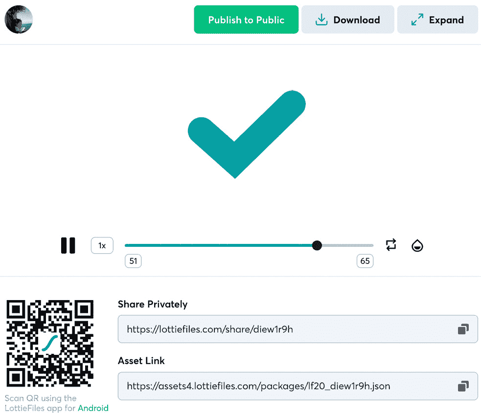

图 5.28 – 预览窗口

如你所见，在 LottieFiles 控板中预览和测试 `.json` 文件非常简单直接。让我们进入下一节，学习如何在移动设备上做同样的事情。

## 在移动 LottieFiles 应用中预览我们的 Lottie 动画

在 LottieFiles 控板中预览我们的动画是一件明智的事情，并且可以避免我们传递不正常工作的 LottieFiles。记住我们之前提到的，在*第四章**，移动它！使用 After Effects 制作我们的第一个 Lottie 动画*，有一些功能在特定设备上不受支持。例如，**径向爆发**在 iOS 上不受支持。

支持的功能

你可以在*第六章**，*不要停止！探索将帮助你继续前进的插件和资源*，在*支持 iOS、Android 和网页的 Lottie 功能*部分了解更多关于 LottieFiles 支持的功能。

让我们看看在我们 iOS 移动应用中预览动画会发生什么：

1.  返回到 AE。

1.  打开**LottieFiles**面板，向下滚动到最底部，你会看到你的可用设备列表：

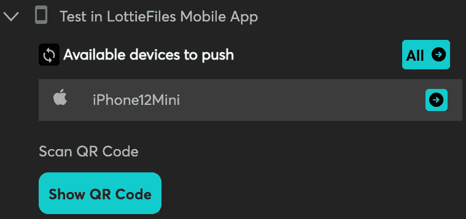

图 5.29 – LottieFiles 插件 AE 预览面板上的显示 QR 码按钮

1.  选择你想要测试的设备。在我的情况下，我将选择**iPhone12Mini**。

1.  点击**显示 QR 码**按钮：

图 5.30 – LottieFiles 插件 AE 预览面板上生成的 QR 码

现在，让我们拿起手机来完成这个过程：

1.  打开 LottieFiles 应用。

1.  点击**扫描**按钮扫描二维码，voilà，动画就会在这里显示出来！

如果你是在 iOS 设备上做这件事，你会注意到有些奇怪的事情发生，对吧？**径向爆发**没有正确显示！为什么？我们使用 Bodymovin 和 LottieFiles 插件在 AE 中渲染了动画，看起来预览效果很好。此外，当我们将其上传到 LottieFiles 控板时，动画显示正确，但现在不是，至少在 iOS 设备上不是（如果你是从 Android 设备检查的，你不会知道我在说什么，因为它在 Android、Windows 和网页上运行得非常好）。

但是，为什么是这样？我们是不是做错了什么？嗯，不是的，只是因为这个功能在 iOS 上不受支持。在那里，我已经说过了。径向爆炸在任何 iOS 设备上都不会工作。那么，我们最初为什么要做这个呢？当然，有一个支持的功能列表，但是，我想让你亲自体验一下，在交付之前测试事情是多么重要。无论我们多么确信某件事会工作，有时，事情就是不会。

LottieFiles 插件和平台正在不断迭代；有一天事情会工作，第二天就不会，反之亦然。所以，我的建议是始终要*测试*。

那么，现在怎么办？嗯，我们可以使用带有径向爆炸效果的动画在网页、Windows 和 Android 上使用。但是，如果我们想在 iOS 上使用它，我们必须回到 AE 并重新做吗？不是的，LottieFiles 允许我们在不回到 AE 的情况下调整动画中的几个方面。所以，请跟我一起，我们将在一瞬间纠正这个问题。

# 不使用 AE 创建和编辑 Lottie

最后那个部分有点像低踢；我们都对我们的酷炫动画感到非常满意，现在怎么办？在 iOS 上，这个效果不会显示。嗯，这些事情有时会发生。我们现在有三个选择：

+   抱怨一下。

+   返回 AE 并在我们的动画周围添加一些小圆圈，一个接一个。

+   保持简洁，只需移除**径向爆炸**效果。

我会选择第三个选项，你们会看到它有多快。我们甚至不需要回到 AE。让我们打开**Lottie 编辑器**。为此，请按照以下步骤操作：

1.  前往 LottieFiles 网络仪表板。

1.  前往左侧菜单并选择**我的私有动画**。

1.  点击**check_icon**动画。

1.  点击**编辑动画**按钮，如图 5.31 所示：

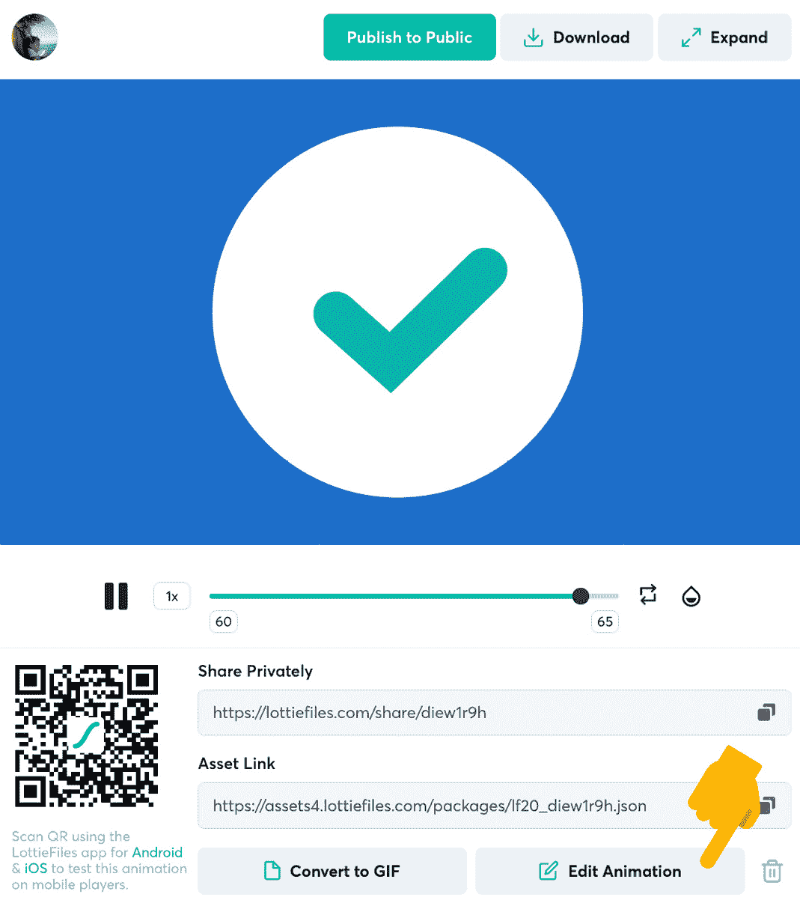

图 5.31 – LottieFiles 桌面仪表板预览窗口中的编辑动画按钮

**Lottie 编辑器**出现了，这里我们也可以施展一些魔法。正如我们所说，我将保留我的超级酷炫的闪烁图标用于网页和 Android，我将调整它以适应 iOS。

让我们检查编辑工作区视图：

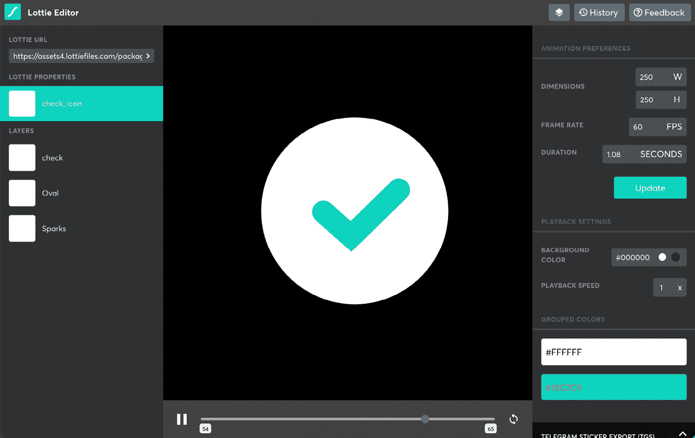

图 5.32 – 编辑工作区视图

在左侧面板中，我们看到**LOTTIE URL**、**LOTTIE 属性**和**图层**：

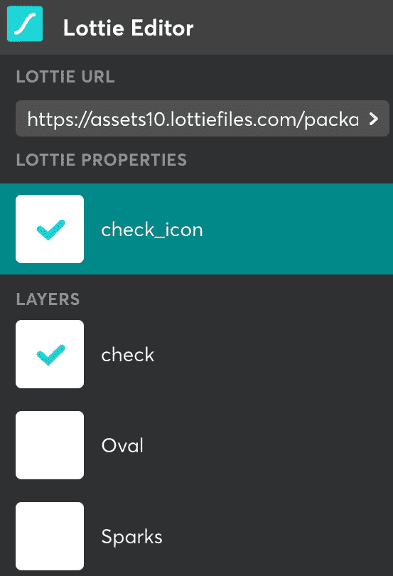

图 5.33 – 左侧编辑面板

## Lottie URL

Lottie URL 实际上是`.json`代码本身。它包含所有动画信息，可以用来与技术团队分享你的动画。然而，也有一些其他更直观的方式来分享你的动画，我们很快就会看到。

## Lottie 属性

当选择**LOTTIE 属性**时，屏幕右侧会打开一个新的面板，如图 5.34 所示。在这个面板中，我们可以更改一些动画属性：

+   **动画首选项**：这是我们可以调整动画 **尺寸**、**帧率** 和 **持续时间** 的地方。

+   **播放设置**：Lottie 还允许我们更改 **背景颜色**，但仅用于预览。因此，由于我们的动画背景是白色覆盖白色，让我们选择一个不同的颜色。此外，我们还可以调整 **播放速度** 为 **1.5x**、**2x** 或 **2.5x**。

+   **分组颜色**：在这里，魔法发生了。我们看到的颜色列表是动画中包含的颜色。我们可以通过点击其中一个并选择一个新的颜色来更改它们。这将改变动画中的所有颜色，但如果您稍等片刻，我会向您展示如何逐步更改。

+   **TELEGRAM STICKER EXPORT**：在这里，您可以轻松地将动画转换为 Telegram，但我们将在下一分钟看到。现在，让我们先专注于编辑器。

+   **导出为 LOTTIE JSON**：一旦您对动画满意，只需点击蓝色按钮即可导出。简单易懂，对吧？

+   `.json` 文件，但您也可以将其作为新的动画上传到您的仪表板 **预览** 部分：

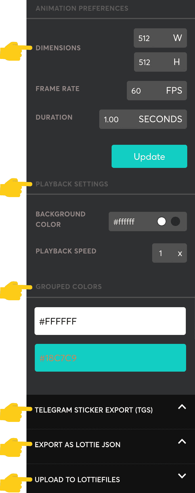

图 5.34 – 右侧编辑器面板

现在我们知道了如何直接在 **Lottie 编辑器** 中更改 Lottie 动画的主要属性，让我们看看还能做什么。

## 层

我们刚刚看到了如何调整动画的一些主要属性，但 **Lottie 编辑器** 通过层允许我们更深入地探索它。

正如我们在屏幕左侧可以看到的 (*图 5.35*)，我们的动画中包含三个不同的层，这与我们在 AE 动画中拥有的相同：**检查**、**椭圆形** 和 **火花**。

现在，让我们选择 **层** | **检查**，看看我们能做什么：

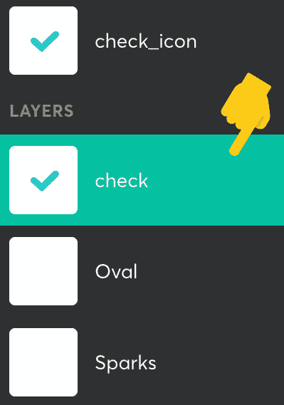

图 5.35 – 左侧面板，选定的层

当选择 **检查层** 时，我们会注意到屏幕右侧的选项发生变化，并出现新的属性，如下所示：

+   `.json` 文件。

+   **颜色**：在这里，我们将找到每个层中使用的颜色。在我们的例子中，我们只看到蓝色，但如果这个层有更多颜色，我们在这里会看到它们，并且可以通过点击颜色并选择一个新的颜色来更改它们。

+   `.json` 文件，但不包括其他任何内容：

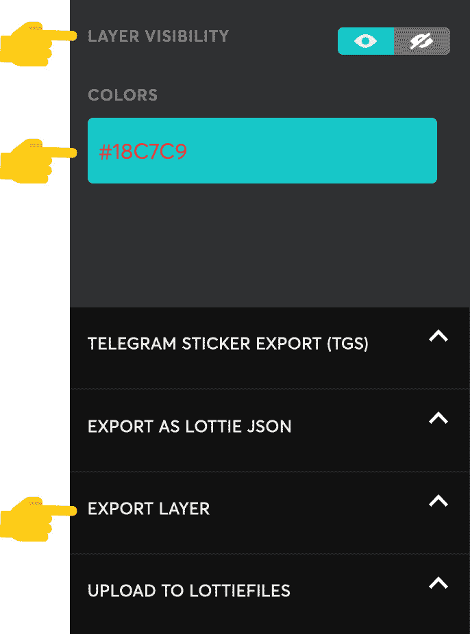

图 5.36 – 层属性视图

+   **文本层属性**：在我们的图标示例中，我们会看到一个额外的选项，那就是**文本层属性**。尽管如此，如果我们动画中有文本，我们会在屏幕左侧看到文本层，当选择它时，我们会在工作区域右侧看到不同的面板，如图 5.37 所示。我们可以更改的属性是内容本身，但除此之外，我们对此没有太多可以做的，至少目前还没有。此外，我不太依赖它，因为有时更新的内容可能无法正确显示，甚至根本不显示。

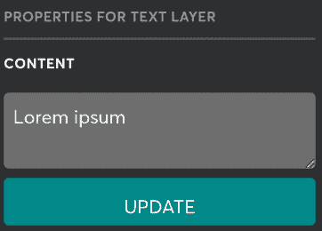

图 5.37 – 文本属性视图

所以，考虑到所有这些，根据你正在工作的项目，尽量在 AE 项目中保持层尽可能简单可能很有用。为每个图形创建一个层可能不是一个坏主意，因为以后你只需来到 **Lottie 编辑器**，调整颜色，显示或隐藏它们，甚至更改内容。当然，这取决于项目和动画的复杂性，但提前思考总是好的。

话虽如此，让我们回到我们的图标。你认为我们需要做什么才能让图标在 iOS 上正常工作？很简单！只需将 `.json` 文件隐藏成另一个名称。让我们这么做：

1.  在屏幕左侧选择**精灵**层。

1.  点击工作区域右侧出现的眼睛图标：

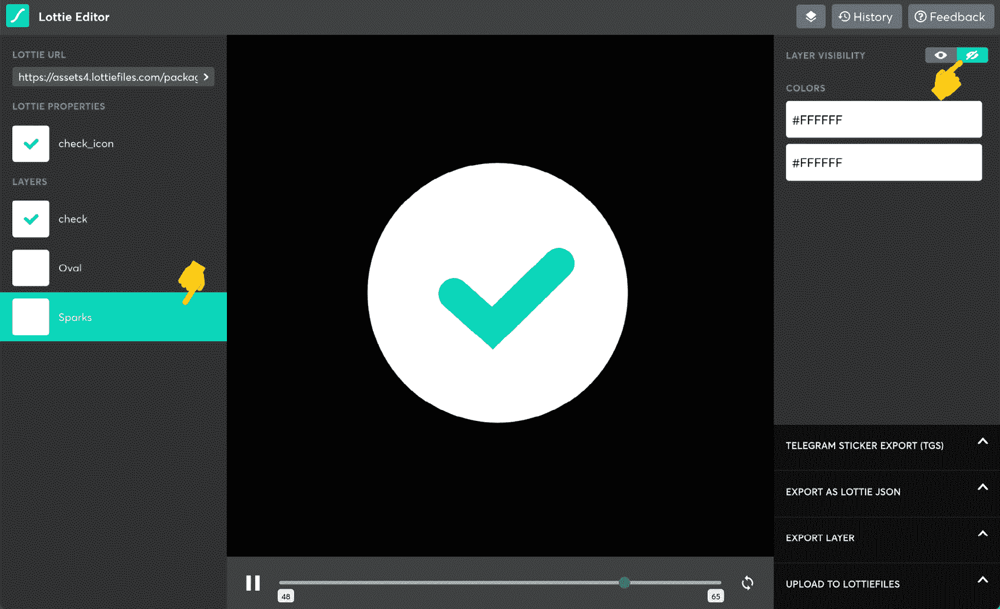

图 5.38 – Lottie 编辑器视图 – 精灵层和隐藏图标突出显示

1.  移动到**LOTTIE 属性**并选择**check_icon**。

1.  再次将其导出为 `.json` 文件。

1.  以新名称保存，例如，`check_icon_ios.json`：

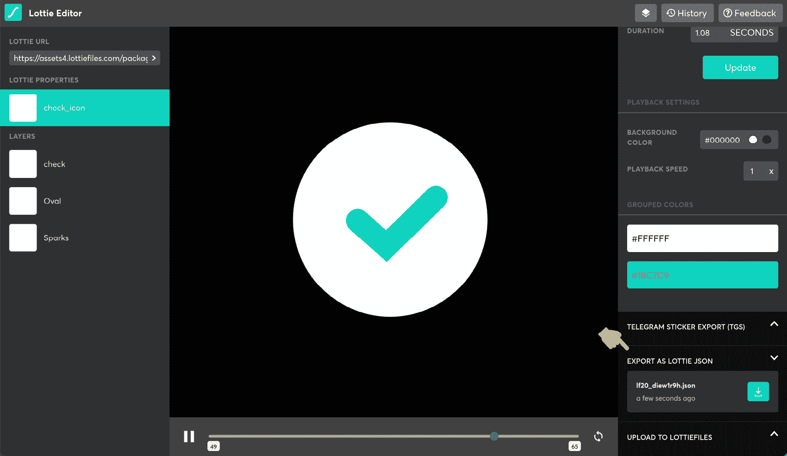

图 5.39 – Lottie 编辑器视图，动画和导出为 Lottie JSON 按钮突出显示

就这样！我们已经有了准备实施的具体图标。一个用于 Android 和网页，另一个用于 iOS。我们已经准备好将其交给开发团队，并且可以确信我们的动画将与我们设计和动画化的一样，没有任何惊喜。

太好了！现在你知道如何调整 Lottie 动画或其层的颜色、速度和尺寸，并且可以继续前进。但是，别急着走。还有一些 LottieFiles 可以做的，我想展示给你。让我们进入下一节，学习如何从简单的 SVG 构建动画，甚至不需要使用 AE。

# 几秒钟内将 SVG 转换为动画 Lottie

现在我们已经了解了 Lottie 编辑器可以实现的功能，比如更改颜色、隐藏或显示图层、导出单个图层以及更改动画的内容、尺寸或速度，让我们继续学习 LottieFiles 平台允许我们在单步中进行的其他功能。让我们忘记我们的**check_icon**，它已经准备好交给开发团队。让我们看看动画 SVG 文件是多么简单和简单。

我们在*第一章*中讨论了这一功能，*开始使用 Lottie*，但现在我们将向您展示如何将您的 SVG 文件转换为 Lottie：

1.  前往[`lottiefiles.com/svg-to-lottie`](https://lottiefiles.com/svg-to-lottie)：

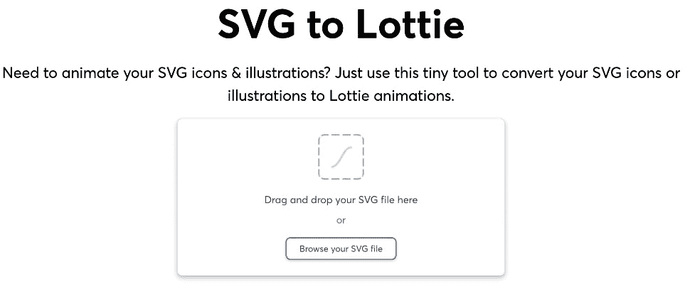

图 5.40 – SVG 到 Lottie 功能视图

1.  点击**浏览你的 SVG 文件**按钮。

1.  浏览此书提供的`lottie/chapter05/SVGtoLottie.svg`文件。

1.  打开`SVGtoLottie.svg`文件。

干得好！你注意到屏幕已经改变，对吧？让我们看看这一切都是关于什么的。

在屏幕中央，我们可以看到我们的静态 SVG，即星星。这是我们刚刚上传的 SVG 文件。在星星的左侧有一个名为**动画**的窗口，其中包含一些已经制作好的动画，而在右侧，我们可以找到导出选项。

所以，就是这样。让我们做一个例子：

1.  从动画窗口中选择您喜欢的动画。

1.  在中央视图上检查结果。

1.  你喜欢吗？不喜欢？试试别的。喜欢？让我们将其导出为`.json`格式。

1.  点击**下载 Lottie**按钮，就这样！

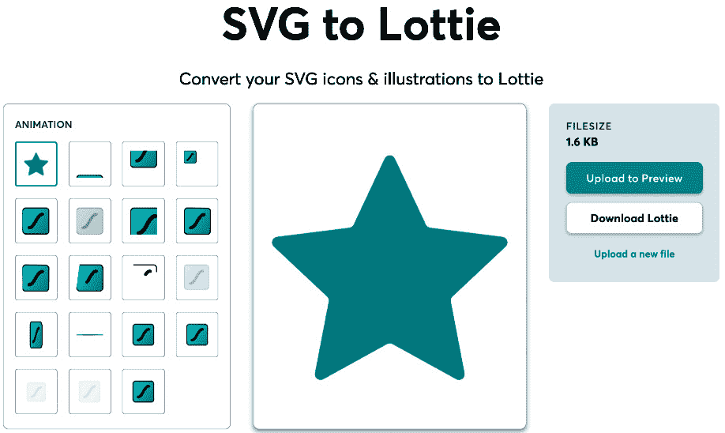

图 5.41 – SVG 到 Lottie 主工作区

如此简单，你刚刚学会了另一种创建自己动画的方法。显然，这是一个非常简单的动画，但有时它可以完成这项工作。

所以，现在你已经知道了如何动画化 SVG，让我们继续学习如何将 Lottie 转换为 GIF。

# 一键将 Lottie 转换为 GIF

如果我们学习如何使用 Lottie，那是因为我们想要尽可能避免在我们的应用程序和网站上添加动画 GIF 文件。正如我们在这本书中之前所说的，GIF 文件在文件大小上可能非常庞大，图像质量低，并且不会响应。然而，有时我们可能需要这种格式，例如，用于某些社交媒体帖子。

LottieFiles 让我们能够在瞬间将`.json`文件转换为 GIF，以下是操作步骤：

1.  前往[`lottiefiles.com/lottie-to-gif`](https://lottiefiles.com/lottie-to-gif)。

1.  浏览此书提供的`lottie/chapter05/LottietoGIF.json`文件（这是我们在*几秒钟内将 SVG 转换为动画 Lottie*部分创建的 Lottie）。

1.  打开`LottietoGIF.json`文件：

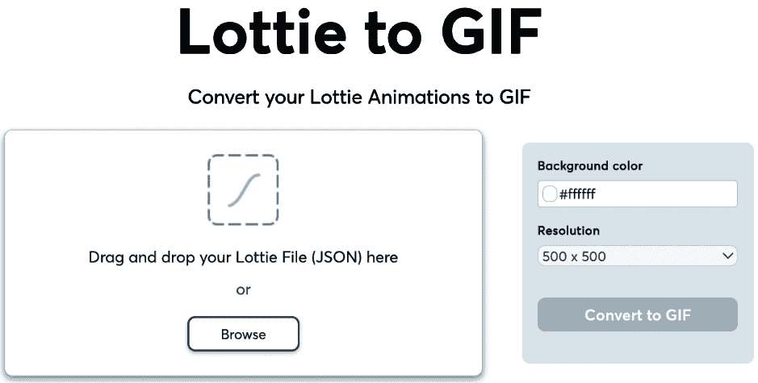

图 5.42 – Lottie 到 GIF 功能视图

太好了！正如你所见，这相当直接。我们在屏幕中央看到我们的动画星星，右侧有几个选项，如**背景颜色**和**分辨率**。所以，就是这样。

1.  为你的星星选择一个背景颜色；我就选择白色。

1.  选择一个分辨率；我认为**500 x 500**对我来说是合适的。

1.  点击**转换为 GIF**按钮：

![图 5.43 – Lottie 到 GIF 主要工作区域

![图片 B17930_05_43.jpg]

图 5.43 – Lottie 到 GIF 主要工作区域

你会注意到动画可能需要一些时间才能转换完成，尤其是如果我们处理的是复杂的动画。只需耐心等待。同时，请注意，一旦转换完成，**转换为 GIF** 按钮将被**下载 GIF** 按钮替换：

![图 5.44 – 在 GIF 到 Lottie 工作区域上的转换和下载 GIF 按钮视图

![图片 B17930_05_44.jpg]

图 5.44 – 在 GIF 到 Lottie 工作区域上的转换和下载 GIF 按钮视图

1.  点击**下载 GIF**按钮以下载你的动画 GIF。

你已经将 `.json` 动画转换成了 GIF 文件，可以用于任何地方。

所以，现在你已经学会了如何使用 LottieFiles 功能将你的 Lottie 动画转换为 GIF 文件，让我们进入下一节，看看如何使用 LottieFiles 编辑器创建 Telegram 贴纸。

# 为 Telegram 创建你自己的个性化贴纸

所以，回到 Lottie 编辑器，记得我们之前提到过，我们可以将 Lottie 导出以用作 Telegram 贴纸。让我们看看我们如何做到这一点。不要害怕，这个过程可能看起来很长，但实际上非常直接：

1.  前往 [`lottiefiles.com/editor`](https://lottiefiles.com/editor)。

1.  浏览此书提供的 `lottie/chapter05/telegram_sticker.json` 文件，这是我之前做的一个简单的挥手动画，现在我想与你分享。

1.  打开 `telegram_sticker.json` 文件。

![图 5.45 – 拖放或浏览 Lottie 编辑器屏幕

![图片 B17930_05_45.jpg]

图 5.45 – 拖放或浏览 Lottie 编辑器屏幕

很酷！一旦文件上传，你会注意到视图已经改变，我们回到了之前在本章中使用的 Lottie 编辑器。注意，挥手的动画已经加载到屏幕中央，如下面的截图所示：

![图 5.46 – 在 Lottie 编辑器中运行的挥手动画

![图片 B17930_05_46.jpg]

图 5.46 – 在 Lottie 编辑器中运行的挥手动画

现在，让我们继续创建 Telegram 贴纸。

在我们将动画导出为 Telegram 贴纸之前，有两个规格我们必须审查。这些是**尺寸**和**持续时间**。**尺寸**必须是**512** x **512**，且**持续时间**不能超过**3.00**秒。然而，记住我们总是可以直接在**Lottie 编辑器**中调整这些。

由于我在这里重用了旧动画，而且在我制作它的时候，我没有想到要将其用于 Telegram，所以我们必须将尺寸调整为**512**。那么，让我们在**Lottie 编辑器**中更改它。

1.  设置 `512`。

1.  点击 **更新** 按钮。

持续时间合适，因为它只有 3 秒。以下截图显示了 **动画偏好** 面板：

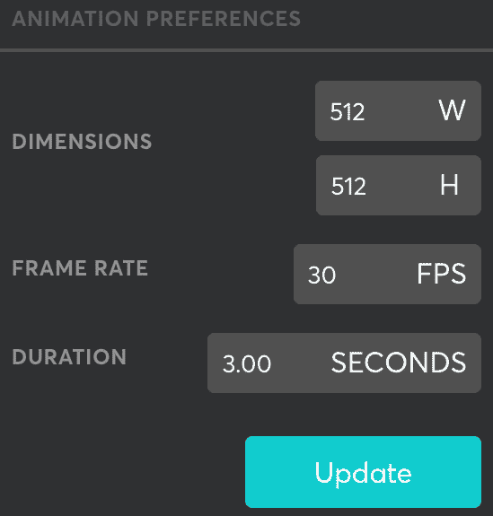

图 5.47 – 挥手偏好设置

完美，现在我们已经安排好了一切，让我们在同一面板上稍微向下移动。我们正在寻找 **TELEGRAM STICKER EXPORT** 工具。你应该在右侧面板向下滚动时看到它。

1.  点击小蓝色按钮以将挥手作为 Telegram 贴纸下载。

1.  将下载一个 `sticker.tgs` 文件。

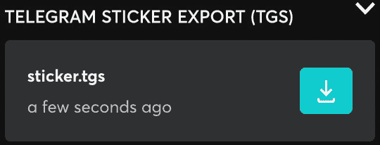

图 5.48 – Telegram 贴纸导出面板视图

1.  打开 **Telegram 桌面版**。

1.  在搜索框中输入 `Stickers`。

1.  点击 **贴纸** 验证联系人：

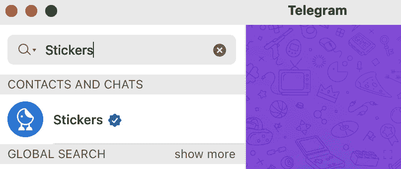

图 5.49 – Telegram 桌面搜索贴纸机器人聊天

1.  点击 **开始** 以与 **贴纸** 机器人开始对话：

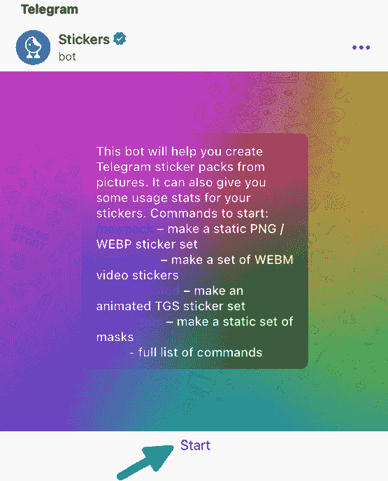

图 5.50 – 贴纸机器人的“开始对话”按钮

1.  现在，在会话窗口中输入 `/newanimated`。

1.  将消息发送到机器人：

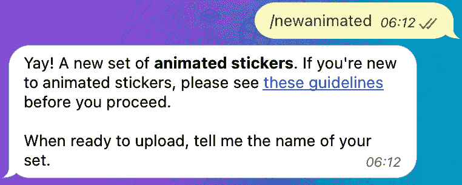

图 5.51 – 贴纸机器人对话视图

让我们遵循 **贴纸** 机器人给出的指示：

1.  让我们给我们的贴纸集起一个名字（即使我们只有一个贴纸，我们也必须这样做）。我将我的命名为 `My First Lottie Stickers`。

1.  将我们从 Lottie 编辑器下载的 `sticker.tgs` 文件拖放到聊天中：

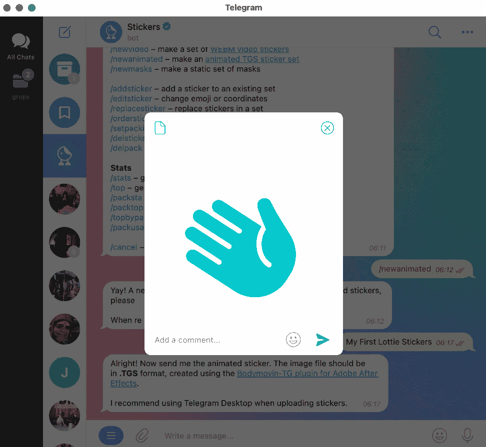

图 5.52 – 发送你的 sticker.tgs 文件

1.  向机器人发送一个表情符号。这将与挥手相关的表情符号。我们可以发送尽可能多的表情符号，但我建议坚持一个或两个。我将它与现有的挥手表情符号相关联，👋。

1.  输入 `/publish`。

1.  选择 **我的第一个 Lottie 贴纸** 贴纸集：

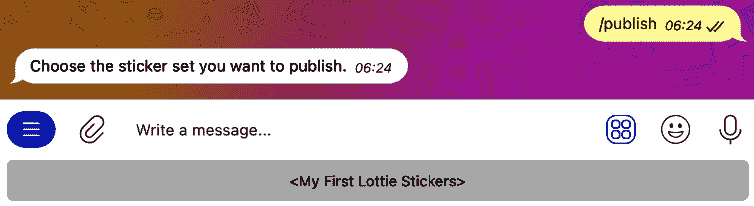

图 5.53 – 贴纸机器人上的发布按钮

1.  输入 `/skip`。

1.  输入一个简短的名字以创建一个分享的 URL。我选择了 `hellolottie`。

1.  URL 已创建为 [`t.me/addstickers/hellolottie`](https://t.me/addstickers/hellolottie)，您可以与朋友分享！

这不是很酷吗？现在您知道如何创建动画，将其导入 Lottie 编辑器，将其作为 Telegram 贴纸下载，并在 Telegram 中创建您自己的贴纸集以供分享。恭喜！我们已经走了很长的路！

# 摘要

哇！我们在这里做了这么多事情；做得太棒了！而且你知道最好的部分是什么吗？你现在准备好享受乐趣并从头开始创建你自己的动画了！到目前为止，我们学习了如何使用 Bodymovin 和 LottieFiles 插件将我们的动画从 AE 导出为`.json`文件。我们经历了在 AE、桌面和移动设备上测试导出的`.json`文件的过程，并意识到在交给开发团队之前在每台设备上测试它的重要性。

我们还在 LottieFiles 平台上创建了一个账户，并了解了 LottieFiles 仪表板，在那里你可以把所有的动画集中在一起。我们发现了 Lottie 编辑器，以及如何通过改变颜色、尺寸、速度和内容来快速调整任何`.json`动画。

我们还学习了如何通过使用静态 SVG 文件来创建非常简单但直接的动画，以及如何将 Lotties 转换为 GIF 用于我们的社交媒体或其他相关内容。

最后，最有趣的部分，我们导出了一个 Lottie 动画作为 Telegram 贴纸，并学习了如何使用 Stickers 机器人创建一个 Telegram 贴纸组。

那么，你准备好展翅高飞了吗？我敢打赌你已经准备好了，并且已经开始思考你可以实现的所有大事以及从现在开始你的应用将看起来多么酷、一致和用户友好。

但是，在我让你们自己去探索之前，我想分享一些可能对你们这个过程有所帮助的参考资料、技巧和窍门。所以，跟我进入下一章，我将告诉你们所有这些内容。
