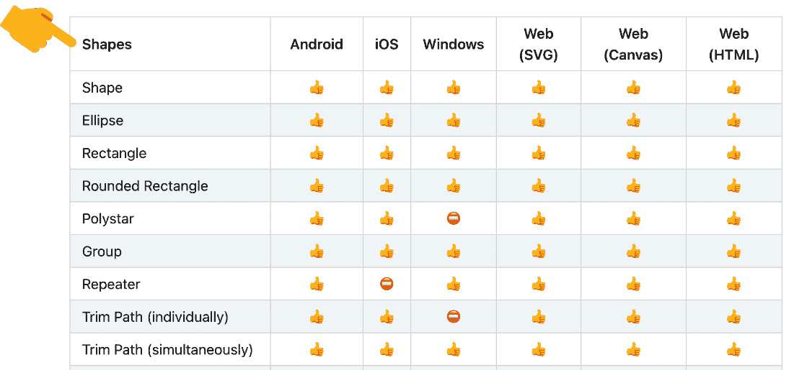

# 第六章：*第六章*：不要停止！探索持续前进的插件和资源

回顾过去，我意识到我们经历了多少新事物。在本书的开头，Lottie 可能是一个您可能听说过但不确定是什么或如何工作的东西，而现在，仅仅五章节之后，我相信您在谈论 Lottie 的环境、动画和**After Effects**（**AE**）时已经足够自信。您已经了解并体验了使用 AE 和 LottieFiles 创建动画的好处，您现在熟悉了 Adobe AE，能够构思、草图、创建和导出您独特的动画，并且有机会亲自学习和体验真正的**用户体验**（**UX**）动画工作流程。

话虽如此，本章是动画时可以随时查阅的实用指南，一个您需要寻找新动画资源时可以随时返回的地方。在接下来的章节中，您将找到下载和安装我们创建动画所需的所有必要工具和插件的链接和说明，这样您就不会迷失方向。

我们将列出每个平台和设备支持或不支持的功能，并提供一些技巧和窍门来避免它们。记得在*第五章**中发生的事情，“与世界分享：使用 LottieFiles 工作”？火花没有工作，对吧？所以，请随时查阅这张表格，因为它在我们创建 AE 动画时将非常有用。

我们将列出一些快捷键，这将帮助您提高工作效率并节省大量时间。最后，我们将为您提供足够的资源，以便您可以继续自学。

让我们继续前进到下一节，安装我们需要的所有工具和插件。

我想分享一些可以帮助您提高工作效率并节省时间的技巧和窍门。此外，我还想分享我在构思、绘图或动画制作时通常使用的资源，我相信这些资源在您准备制作动画时一定会帮到您。

在本章中，我们将涵盖以下主题：

+   下载和安装您创建动画所需的必要工具和插件

+   iOS、Android 和 Web 支持的 Lottie 功能

+   主要的 AE 快捷键（Windows 和 Mac）

+   帮助动画制作过程的资源

+   提升动画技能的教程

# 技术要求

对于本章，我们不需要除了您首选的浏览器以外的任何东西。

# 下载和安装必要的插件和工具

在我们开始创建动画之前，我们需要一些特定的工具和插件，这些工具和插件需要首先安装在我们的电脑和移动设备上。这些工具将帮助我们导入、创建、编辑并将文件导出以创建 Lottie 动画。

如您所记得，我们已经在*第一章*“开始使用 Lottie”中讨论了这些工具和插件。在本节中，我们将指导您下载和安装它们，以便您准备好开始动画制作。那么，让我们开始吧。

## 下载并安装 Adobe AE

如本书前面所述，Adobe AE 不是一个免费工具。它是一种基于订阅的软件，您必须作为 Adobe Creative Cloud 订阅的一部分购买。然而，请记住，Adobe 提供 7 天的免费试用期，这样您可以在购买前先试用。

关于安装软件和系统要求的完整说明，请访问 [`helpx.adobe.com/after-effects/using/setup-installation.html`](https://helpx.adobe.com/after-effects/using/setup-installation.html) 并按照以下截图中的说明操作：

![图 6.1 – Adobe AE 用户指南

![img/B17930_06_01.jpg]

图 6.1 – Adobe AE 用户指南

## 下载并安装 AE 的 Bodymovin 插件

Bodymovin 插件安装非常简单。只需按照以下简单步骤操作。

如果您有 Creative Cloud 订阅，请按照以下步骤操作：

1.  前往 [`exchange.adobe.com/creativecloud.details.12557.bodymovin.html`](https://exchange.adobe.com/creativecloud.details.12557.bodymovin.html)。

1.  点击**立即安装**按钮并按照步骤操作：

![图 6.2 – Adobe Exchange 平台 – Bodymovin 扩展

![img/B17930_06_02.jpg]

图 6.2 – Adobe Exchange 平台 – Bodymovin 扩展

如果您没有 Creative Cloud 订阅，请执行以下操作：

1.  从 [`aescripts.com/bodymovin/`](https://aescripts.com/bodymovin/) 下载 Bodymovin 扩展。请注意，您需要创建一个账户才能完成此操作。

![图 6.3 – 下载 Bodymovin

![img/B17930_06_03.jpg]

图 6.3 – 下载 Bodymovin

1.  下载**ZXP 安装器** ([`aescripts.com/learn/zxp-installer/`](https://aescripts.com/learn/zxp-installer/))，通过扩展管理器安装插件：

![图 6.4 – 下载 ZXP 安装器

![img/B17930_06_04.jpg]

图 6.4 – 下载 ZXP 安装器

1.  安装并打开**ZXP 安装器 aescripts + aeplugins zxp 安装器（设置）**，适用于 macOS 或 Windows。

1.  将`bodymovin.zxp`拖放到 ZXP 安装器窗口中。

1.  安装成功完成后，点击**确定**。

1.  打开**Adobe After Effects**。

1.  前往顶部导航菜单，点击**窗口** | **扩展**。

最近安装的 Bodymovin 扩展应显示在菜单中：

![图 6.5 – Adobe AE 扩展窗口

![img/B17930_06_05.jpg]

图 6.5 – Adobe AE 扩展窗口

## 下载并安装 AE 的 LottieFiles 插件

LottieFiles 安装非常简单。如果您有 Creative Cloud 订阅，请按照以下步骤操作：

1.  前往 [`lottiefiles.com/plugins/after-effects`](https://lottiefiles.com/plugins/after-effects)。

1.  点击**通过 Adobe Exchange 安装**按钮：

图 6.6 – 通过 Adobe Exchange 安装 LottieFiles 插件

1.  点击 **立即安装** 按钮，并按照说明操作：

图 6.7 – Adobe Exchange 平台 – LottieFiles 扩展

如果你没有 Creative Cloud 订阅，我们将使用扩展管理器安装插件。为此，请执行以下步骤：

1.  前往 [`aescripts.com/learn/zxp-installer/`](https://aescripts.com/learn/zxp-installer/)。

1.  下载 **ZXP 安装程序**：

图 6.8 – ZXP 安装程序

1.  前往 [`lottiefiles.com/plugins/after-effects`](https://lottiefiles.com/plugins/after-effects)。

1.  点击 **下载插件 (ZXP)** 按钮使用扩展管理器安装插件：

图 6.9 – 使用 ZXP 安装程序安装 LottieFiles 插件

1.  安装并打开 macOS 或 Windows 的 **ZXP 安装程序 aescripts + aeplugins zxp 安装程序 (设置)**。

1.  将 `ae-plugin-0.1.20.zxp` 拖放到 ZXP 安装程序窗口中。

1.  安装完成后，点击 **确定** 按钮。

1.  打开 **Adobe After Effects**。

1.  在顶部导航菜单中点击 **窗口** | **扩展**。

最近安装的 LottieFiles 插件应出现在菜单中：

图 6.10 – Adobe AE LottieFiles 扩展菜单

## 下载并安装 Sketch 和 Figma 的 AEUX 插件

如果我们使用 Sketch 或 Figma 进行插图和设计，一旦我们需要将文件从 Sketch 或 Figma 导出为 AE，这个插件就会变得非常有用。所以，如果情况是这样的话，让我们安装我们的插件：

## 安装 ZXP 扩展管理器

要安装任何 AEUX 插件（用于 Figma、Sketch 或 AE），我们首先需要安装 **ZXP 扩展管理器**。所以，如果你在前面部分还没有做，以下是操作方法：

1.  前往 [`aescripts.com/learn/zxp-installer/`](https://aescripts.com/learn/zxp-installer/)。

1.  下载 **ZXP 安装程序**：

图 6.11 – macOS 和 Windows 的 ZXP 安装程序

1.  安装并打开 macOS 或 Windows 的 **ZXP 安装程序 aescripts + aeplugins zxp 安装程序 (设置)**。

### 安装 AEUX for Figma

现在我们已经启动并运行了 ZXP 扩展管理器，让我们来安装 AEUX for Figma。安装 AEUX for Figma 可能会有些棘手，所以我建议你遵循他们支持网站上描述的说明。为此，请按照以下步骤操作：

1.  从 [`aeux.io/guide/download.html#sketch-57-figma`](https://aeux.io/guide/download.html#sketch-57-figma) 下载 AEUX for Figma 插件。

图 6.12 – AEUX 下载插件用于 Figma 和 Sketch

1.  前往 [`aeux.io/guide/install.html#figma`](https://aeux.io/guide/install.html#figma) 并按照说明安装插件：

![图 6.13 – 如何安装 AEUX for Figma 插件]

![图片 B17930_06_13.jpg]

图 6.13 – 如何安装 AEUX for Figma 插件

### 安装 AEUX for Sketch

在我们安装了 ZXP 扩展管理器之后，我们将下载并安装 AEUX for Sketch。安装 AEUX for Sketch 非常简单，以下是操作步骤：

1.  从 [`aeux.io/guide/download.html#sketch-57-figma`](https://aeux.io/guide/download.html#sketch-57-figma) 下载 AEUX for Sketch 插件：

![图 6.14 – 如何安装 AEUX for Sketch 插件]

![图片 B17930_06_14.jpg]

图 6.14 – 如何安装 AEUX for Sketch 插件

1.  解压 `AEUX_0.8.1-a.zip`。

1.  打开解压后的文件夹，`AEUX_0.8.1-a/Sketch`。

1.  双击打开 `AEUX.sketchplugin`:

![图 6.15 – AEUX Sketch 插件文件夹]

![图片 B17930_06_15.jpg]

图 6.15 – AEUX Sketch 插件文件夹

插件安装完成后，Sketch 将打开并通知你：

![图 6.16 – AEUX for Sketch 插件成功安装]

![图片 B17930_06_16.jpg]

图 6.16 – AEUX for Sketch 插件成功安装

### AEUX for AE 插件

如果我们想从 Figma 或 Sketch 导入我们的设计到 AE，我们还需要安装 AEUX for Adobe AE 插件。我们将使用此插件来定义我们的层如何导入。

我们假设您已经在本节中较早安装了 ZXP 扩展管理器，否则请跳转到 *安装 ZXP 扩展管理器* 部分，并按照那里描述的说明操作。

现在，让我们安装 AEUX for Adobe AE，为此，请按照以下步骤操作：

1.  在安装 AEUX for Figma 或 Sketch 时，查找我们下载的 `AEUX_0.8.1-a` 文件夹。

1.  打开 **ZXP 扩展管理器**。

1.  打开 `AEUX_0.8.1-a/Ae`:

![图 6.17 – AEUX for AE 插件文件夹]

![图片 B17930_06_17.jpg]

图 6.17 – AEUX for AE 插件文件夹

1.  将 `AEUX.zxp` 拖放到 **ZXP Installer** 窗口中。

1.  关闭并重新打开 AE。

1.  在 AE 中，导航到顶部 **窗口** 菜单并选择 **扩展** | **AEUX**。

1.  点击打开面板：

![图 6.18 – AEUX for AE 面板视图]

![图片 B17930_06_18.jpg]

图 6.18 – AEUX for AE 面板视图

如果这不起作用，您仍然可以尝试手动安装。为此，请按照 [`aeux.io/guide/install.html#after-effects`](https://aeux.io/guide/install.html#after-effects) 中描述的说明操作。

注意 – AEUX for AE 插件

AEUX 插件的主要作用是控制层如何构建。我们需要设置首选项，一旦完成，就无需保持面板打开。因此，我们的 AE 工作区域不会太乱。

在我们从 Figma 或 Sketch 导入文件之前，我们可以在**AEUX**面板中定义一些值。正如我在这本书中之前提到的，我通常以 60**帧每秒**（**fps**）的速度工作，并将**检测参数形状**和**预合成组**选项打开。然而，这取决于你，以及你更舒适的工作方式。如果你想了解更多信息，请点击此链接：[`aeux.io/guide/ae-options.html`](https://aeux.io/guide/ae-options.html)。

## LottieFiles 平台

如你所知，LottieFiles 允许我们预览、测试和分享我们的动画，以及其他许多事情，例如编辑动画、为 Telegram 创建贴纸、将我们的动画导出为 GIF，或者从静态 SVG 创建动画，仅举几例。

如果我们想在 iOS、Android 和网页上测试、编辑和分享我们的动画，我们需要安装一些工具。只需点击以下链接下载每个平台的特定版本：

+   **LottieFiles for Desktop**: [`lottiefiles.com/desktop`](https://lottiefiles.com/desktop)

+   **LottieFiles for Android**: [`play.google.com/store/apps/details?id=com.lottiefiles.app&hl=en&gl=US`](https://play.google.com/store/apps/details?id=com.lottiefiles.app&hl=en&gl=US)

+   **LottieFiles for iOS**: [`apps.apple.com/us/app/lottiefiles/id1231821260`](https://apps.apple.com/us/app/lottiefiles/id1231821260)

# 支持 iOS、Android 和网页上的 Lottie 功能

正如我们在几章前所经历的，Lottie 不支持 Adobe AE 的所有功能。因此，在我们开始在 AE 中创建动画之前，如果我们想避免挫败感和额外的工作，查看以下表格是个好主意。正如我们之前提到的，在这本书中，我们将重点关注 iOS、Android 和网页支持的功能。然而，你也可以查看以下表格，了解 Windows 设备上支持的功能。

简单越好。保持我们的文件整洁，并使用单一路径和填充创建简单的插图是良好的实践。我建议尽量避免在 AE 中直接使用布尔选项（我们稍后会了解更多），以及使用图像、蒙版和效果，因为这些功能在所有设备上并不都得到很好的支持。我还建议创建可以在所有平台和设备上运行的动画，这样我们就不需要为每个设备创建不同的`.json`文件。

## 形状

**形状**在所有平台上都得到了很好的支持。我们可以从基于矢量的工具导入我们的形状，或者直接在 AE 中创建它们。我们在使用**椭圆**、**矩形**、**圆角矩形**、**星形**、**多边形**和**裁剪路径**时不应有任何问题。然而，记得在*第四章*，“*移动它！使用 After Effects 制作我们的第一个 Lottie 动画*”，我们使用**重复器**功能时遇到了一些麻烦。

当我们在 iOS 设备上预览动画时，这不会显示正确，所以我建议你将这个功能视为不存在，并寻找另一种方法来实现类似的效果：

图 6.19 – 支持的形状功能

## 填充

所有**填充**功能在所有平台和设备上都得到了很好的支持，所以没有必要担心使用填充。我们可以使用纯色，在不透明度上做文章，甚至在我们的设计中使用径向或线性渐变，因为这些功能的运用不会影响我们的动画：

图 6.20 – 支持的填充功能

## 描边

当我们使用**描边**时，也不必担心。我们可以使用和应用任何描边样式或功能，而不会遇到麻烦。所以，请随意尝试**颜色**、**不透明度**、**宽度**、**虚线**、**渐变**等等：

图 6.21 – 支持的描边功能

## 转换

当我们处理**转换**时，有一些选项我们想要避免，比如**自动定位**和**倾斜**：

图 6.22 – 支持的转换功能

**自动定位**用于我们在路径上动画化时。如果我们想为我们的 Lottie 动画添加此效果，我们必须手动调整每个关键帧的旋转：

图 6.23 – 自动定位功能

第二个不受支持的转换选项是**倾斜**。这在 Android 设备上显示不正确，或者至少我们关于它的信息不足，因为它有时能工作，有时则不行。所以，我们还是避开它，以免出现任何不愉快的惊喜：

图 6.24 – 倾斜功能

## 插值

**插值**是另一个我们可以随意操作而不会影响预览的属性。而且，既然我们提到了插值，我强烈建议你阅读更多关于**穿越时间**属性的内容，因为这个酷炫的功能将帮助你平滑动画。你可以在[`helpx.adobe.com/after-effects/using/speed.html`](https://helpx.adobe.com/after-effects/using/speed.html)上找到关于**穿越时间**功能的更多信息，并滚动到**使用穿越关键帧创建平滑运动**部分。

图 6.25 – 支持的插值功能

## 遮罩

在早期，使用**遮罩**在导出我们的动画到 Lottie 时会导致问题，但时代在变化，如今，有几个**遮罩**属性得到了很好的支持。**遮罩路径**、**遮罩不透明度**、**添加**、**减去**和**相交**可以使用而不会遇到问题。其余的可以当作不存在，因为我们根本不会使用这些。

掌握遮罩并不难，这将给你的动画提供更多资源。正如你所知，这本书并不假装是 AE 指南（市面上有很多书做得很好），尽管我建议你阅读更多关于遮罩的内容。你可以在这里查看 Adobe 帮助页面以获取更多信息：[`helpx.adobe.com/after-effects/using/create-masks.html`](https://helpx.adobe.com/after-effects/using/create-masks.html)。

![图 6.26 – 遮罩支持的功能]

![图片 B17930_06_26.jpg]

![图 6.26 – 遮罩支持的功能]

## 遮罩

我们可以使用**Alpha Matte**进行 Lottie。遮罩的工作方式与遮罩非常相似；它们显示或隐藏另一个图层的一部分。你可以在[`helpx.adobe.com/after-effects/using/alpha-channels-masks-mattes.html`](https://helpx.adobe.com/after-effects/using/alpha-channels-masks-mattes.html)找到更多关于它们的信息。

![图 6.27 – Mattes 支持的功能]

![图片 B17930_06_27.jpg]

![图 6.27 – Mattes 支持的功能]

## 合并路径

休斯顿，我们遇到麻烦了！在 iOS 设备或网页上**合并路径**根本不起作用。如果你只想直接在 AE 中使用布尔运算，我强烈建议你忘记它们，假装这些不存在**仅此而已**。否则，请继续阅读。

![图 6.28 – 合并路径支持的功能]

![图片 B17930_06_28.jpg]

![图 6.28 – 合并路径支持的功能]

如我之前所说，最好尽可能保持我们的插图简单，这意味着尽量避免在布尔运算中使用多个路径。那么，这意味着我们必须坚持基本形状吗？其实不是。在 XD、Figma 和 Sketch 中，我们可以将这些在布尔运算中使用的多个路径（如**添加**、**减去**、**相交**或**排除**）转换为单个路径。让我们看看如何做到这一点。

对于**Adobe XD**，请按照以下步骤操作：

1.  使用基本形状进行设计。

1.  添加布尔运算（**添加**、**减去**、**相交**或**排除重叠**）。

1.  转到顶部菜单并选择**对象** | **路径** | **转换为路径**：

![图 6.29 – 在 XD 中将多个路径转换为单个路径]

![图片 B17930_06_29.jpg]

![图 6.29 – 在 XD 中将多个路径转换为单个路径]

如果你使用**Figma**，请按照以下步骤操作：

1.  进行绘图并添加布尔运算（**添加**、**减去**、**相交**或**排除重叠**）。

1.  从顶部菜单选择**展开选择**：

![图 6.30 – 在 Figma 中将多个路径转换为单个路径]

![图片 B17930_06_30.jpg]

![图 6.30 – 在 Figma 中将多个路径转换为单个路径]

如果你使用**Sketch**，请按照以下步骤操作：

1.  将布尔运算添加到您的形状中（**添加**、**减去**、**相交**或**排除重叠**）。

1.  在将您的作品导出到 AE 之前，请转到顶部菜单并选择**图层** | **组合** | **合并**：

![图 6.31 – 在 Sketch 中将多个路径转换为单个路径

![图片 B17930_06_31.jpg]

图 6.31 – 在 Sketch 中将多个路径转换为单个路径

## 层效果

好吧，这里我们真的没有太多可以讨论的内容。Android 和 iOS 都不支持在 AE 中创建的任何**层效果**，至少现在或不久的将来都不支持。然而，如果你只想在网页上使用你的动画，你可以在动画中使用层效果。

![图 6.32 – 支持的层效果功能

![图片 B17930_06_32.jpg]

图 6.32 – 支持的层效果功能

## 文本

当我们谈到 Lottie 的字体时，我们看到这里可以做的基本事情。因此，在 AE 中使用**文本**、转换它或更改其填充和描边都没有问题。

话虽如此，如果您考虑在动画中包含文本，以便以后可以直接在 LottieFiles 平台上进行编辑，那么，我不建议这样做。我实际上已经尝试过：导出了一个包含文本的 `.json` 文件，并在 LottieFiles 平台上进行了编辑，但文本没有正确显示。有时文本不会显示，有时看起来会很奇怪。所以，我现在就把它忘了，尽管，我相信这将在未来的版本中得到审查。

![图 6.33 – 支持的文本功能

![图片 B17930_06_33.jpg]

图 6.33 – 支持的文本功能

## 其他

您可能听说过 AE 的**表达式**，但在这本书中并没有介绍，因为它们在 Android 或 iOS 上不受支持。但如果您是为网页动画制作，我强烈建议您了解更多相关信息，因为它可以节省大量的时间和精力。

为了向您介绍表达式，我们可以将它们定义为一段小的 JavaScript 代码，您可以将它插入到图层属性中，为您的动画添加特定的行为。更多信息，请访问以下链接：[`helpx.adobe.com/after-effects/using/expression-basics.html`](https://helpx.adobe.com/after-effects/using/expression-basics.html)。

现在，让我们来谈谈**图像**。Android 和 iOS 支持图像。但请记住，如果您在动画中使用图像，它们会增加文件大小，并且不会是响应式的。所以，是否使用图像完全取决于您。在我的情况下，我总是尽量避免使用它们。

![图 6.34 – 其他支持的功能

![图片 B17930_06_34.jpg]

图 6.34 – 其他支持的功能

既然我们已经了解了在为 Lottie、Android 和 iOS 动画时可以做什么和不能做什么，让我们进入下一部分，我相信这将有助于你加快你的工作流程。

# 将使您生活更轻松的键盘快捷键

您已经看到，一开始，Adobe AE 可能相当令人不知所措。有这么多选项、面板和需要学习的新关键词。然而，一旦您习惯了快捷键，它看起来并不那么困难，不是吗？尤其是在为 Lottie 动画时，因为我们只需关注一些功能，而忽略大多数面板和工具。

为了让它更加方便，我们可以使用一些快捷键来加速我们的工作，更快地完成动画。

这里有一份我节省时间的快捷键列表，尽管您可以自由地四处寻找更多；互联网上有许多包含 AE 快捷键示例的网站。只需找到您感觉更舒适的，然后开始动画！

## 通用快捷键

## 变换属性快捷键

## 帧和关键帧快捷键

## 图层快捷键

# 免费图形资源和 UX/UI 灵感

最后但同样重要的是，我想与您分享我通常在制作动画时使用的资源，这将有助于您的创作过程。

## 图形资源

我是一位具有图形设计背景的数字设计师，但不是插画家。实际上，我的插画技能相当有限，但不是插画资源。我的意思是，当我需要创建动画或插画时，我通常会在网上搜索参考资料来激发灵感。一旦我心中有了清晰的概念，我会寻找特定的风格、颜色，或者可能是一个可以重复使用并调整到我需要的视觉和感觉的角色插画。所以，我不会经历整个插画过程；我会从各个地方取一些片段来创建自己的。

因此，这里有一份免费个人使用的网站列表，您可以从这些网站搜索和下载您的图形资源。

### 插画

我最喜欢的是**Freepik**([`www.freepik.com/`](https://www.freepik.com/))。您可以从涵盖所有风格和概念的数千个不同插画中进行搜索。您可以将大多数文件作为矢量图下载，或者支付每月订阅计划以访问高级文件。

在**DrawKit**([`drawkit.com/`](https://drawkit.com/))，您可以免费搜索和下载精美的手工插画包和图标集合。

### 颜色

使用**Coolors**([`coolors.co/`](https://coolors.co/))，您可以像按空格键一样轻松地创建自己的独特调色板。您可以用它来激发灵感，创建自己的，或者搜索颜色趋势。

### 图标

`.ae`和`.json`文件。

下载**Font Awesome**([`fontawesome.com/`](https://fontawesome.com/))图标包，并开始像使用常规字体一样使用图标进行您的设计。

### 免费股票图片

现在有一些免费股票图片网站提供高质量图片。我最喜欢的有**Unsplash**([`unsplash.com/`](https://unsplash.com/))和**Pexels**([`www.pexels.com/`](https://www.pexels.com/))。

### 字体

在使用字体时，我总是尽量坚持使用 **Google fonts** ([`fonts.google.com/`](https://fonts.google.com/))，因为它们是跨平台的，可以在你的网站上使用。

如果我在做一些离线项目或者需要更有创造力的时候，我会在 **Free Fonts** ([`www.freefonts.io/`](https://www.freefonts.io/)) 寻找一些特定的字体。

### 动画

对于我来说，寻找灵感来创建自己的 Lottie 动画的最佳地方只能是 **LottieFiles** ([`lottiefiles.com/`](https://lottiefiles.com/))。

## UX/UI 灵感

你知道，灵感不是你可以坐下来就能想出来的东西，但有时，你需要在不同时间获得灵感，以便完成你的工作。以下是一份网站列表，可以帮助你做到这一点：

+   **Behance** ([`www.behance.net/`](https://www.behance.net/)) 是 Adobe 在线社区平台，用于展示和发现创意作品。

+   **Dribbble** ([`dribbble.com/`](https://dribbble.com/)) 是一个获取灵感的绝佳地方。

+   **UX Movement** ([`uxmovement.com/`](https://uxmovement.com/)) 通过提示、技术和最佳实践教你如何改善你的应用和网站的 UX。

+   **Collect UI** ([`collectui.com/`](https://collectui.com/)) 是一个基于精选 Dribbble 的日常灵感平台。

+   访问 **UI Garage** ([`uigarage.net/`](https://uigarage.net/)) 以找到针对 Web、移动和平板电脑的特定设计灵感。

+   **用户界面设计模式** ([`ui-patterns.com/`](https://ui-patterns.com/)) "*是解决常见设计问题的重复解决方案。设计模式是经验丰富的用户界面设计师的标准参考点。"* 

+   **Mobbin** ([`mobbin.design/`](https://mobbin.design/)) 通过其数千个移动应用截图，为您节省了数小时的 UI 和 UX 研究时间。

# 摘要

现在回顾起来，在这本书的第二部分，我们讨论了许多新的概念、关键词、工具和插件。我们学习了如何从头开始创建动画，最终导出并交付给开发团队，涵盖了整个 UX 动画工作流程。我们还看到了如何下载和安装我们完成动画所需的全部必要工具、扩展和插件。

我们检查了在为 Lottie 创建动画时在 AE 中可以或不可以做什么的列表，以确保我们的作品能够正确预览。我们通过一系列快捷键来加速我们的工作，最终，你得到了我列出的资源列表，我希望这能激发你的灵感，并为你提供足够的资源来创建你的动画。

现在，让我们跳到这本书的第三部分，*将您的 Lottie 动画添加到移动应用中*，我们将学习如何将我们的动画实现到移动应用和 Web 中，使用 React Native。
