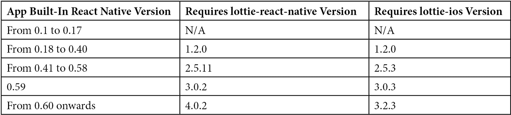

# *第七章*：lottie-react-native 简介

在本章中，我们将介绍 `lottie-react-native`，这是一个允许我们在 React Native 应用中渲染 Lottie 动画的库。我们将了解其历史、当前状态和文档，以确保我们充分利用这个库。这是一个开源库，以 `npm` 包的形式分发，可以在以下链接中找到：

+   **GitHub**: [`GitHub.com/lottie-react-native/lottie-react-native`](https://GitHub.com/lottie-react-native/lottie-react-native)

+   **NPM**: [`www.npmjs.com/package/lottie-react-native`](https://www.npmjs.com/package/lottie-react-native)

在本章中，我们将涵盖以下主题：

+   `lottie-react-native` 是如何产生的？

+   什么是 `lottie-react-native`？

+   为什么我们不使用 Animated 或 Reanimated？

+   `lottie-react-native` 的基础知识

# `lottie-react-native` 是如何产生的？

React Native 之所以在 2015 年发布，是因为 Facebook 需要加快他们的移动开发团队的速度，目标是发布数十个新应用，并在更短、更有效的发展周期内改进现有应用。有些人可能会说 React Native 的最大优势是其多平台开发能力（*一次学习，到处编写*），但还有其他好处，例如重用长期存在于网络开发世界中的经过验证的库和工具——比 iOS 和 Android 存在的时间还要长。

吸引了这样的承诺，Airbnb 成立了一个团队来调查他们是否可以根据 Facebook 的多平台重用策略使用 React Native 来复制 Facebook。他们的结论不仅认为 Airbnb 的移动团队可以从这种策略中受益，而且他们可以重用他们在网络方面的广泛知识，并创建跨学科团队，通过重用大量代码，立即在 Web、Android 和 iOS 上构建新功能。

他们调查的结果包括一些大的架构决策，例如如何将 React Native 集成到现有应用中，如何保持他们已有的性能标准，以及如何将他们的工具集成到他们将要部署到原生应用中的新框架中。其中一个这样的工具就是他们钟爱的动画库：Lottie。

Airbnb 已经拥有了 Lottie（lottie）的 Web、Android 和 iOS 开源库：

+   **Web**: [`GitHub.com/airbnb/lottie-web`](https://GitHub.com/airbnb/lottie-web)

+   **Android**: [`GitHub.com/airbnb/lottie-android`](https://GitHub.com/airbnb/lottie-android)

+   **iOS**: [`GitHub.com/airbnb/lottie-ios`](https://GitHub.com/airbnb/lottie-ios)

所有这些库都得到了良好的维护，满足了 Airbnb 的需求，但将 React Native 加入其中意味着他们需要一个特定的库，这个库不仅可以供他们使用，还可以供成千上万的正在构建 Lottie 社区的开发者使用。

需求很明确：他们需要一个工具，能够在 React Native 代码中以与 iOS 或 Android 应用程序中相同的方式渲染 Lottie 动画。这一努力包括性能和功能要求。结果是，一个功能齐全的开源库，可以轻松集成到所有基于 React Native 构建的各类应用程序中。

为了这项任务，一个由 iOS、Android 和网络开发者组成的小团队在 2017 年初成功地将 `lottie-react-native` 发布到他们的公共 GitHub 仓库：[`GitHub.com/lottie-react-native/lottie-react-native`](https://GitHub.com/lottie-react-native/lottie-react-native)。

在 2018 年，Airbnb 重新评估了其在 React Native 上的投资，并决定他们将停止参与 Facebook 的项目，并将所有 React Native 代码从其应用程序中撤出。这一决定在一系列围绕与维护三个大型代码库（iOS、Android 和 React Native）的复杂性相关的问题的博客文章中得到了解释，这些代码库需要团队进行严格的协调，而该团队并不擅长 React Native。

自从那天起，React Native 已经取得了长足的进步，但这意味着 Airbnb，一个重要的推动者，停止了对这项技术的贡献，包括他们对 `lottie-react-native` 的参与。尽管如此，这个库并没有被遗弃。`lottie-react-native` 的一些所有者开始在社区中寻找维护者，并最终将项目转移给了当时 GitHub 上最活跃的贡献者（`emilioicai` 和 `lelandrichardson`）。

# 什么是 `lottie-react-native`？

`lottie-react-native` 是一个由两个主要部分组成的项目：

+   这个开源项目托管在 GitHub 上。所有开发、改进请求、问题报告和代码托管都发生在这里。它是开发社区的中心，有助于更新和改进整个库。

+   `npm` 包，其中托管了库的所有新可下载版本。通常，开发者会使用这个 npm 仓库将 `lottie-react-native` 包含到他们的 React Native 项目中。

`lottie-react-native` 对 `lottie-ios` 和 `lottie-android` 有硬依赖，并作为这两个库的包装器，其中大部分负载发生。实际上，在大多数 React Native 的原生包中，`lottie-react-native` 通过从 JavaScript 端接收数据，然后转换并发送这些数据到原生库（`lottie-ios` 和 `lottie-android`）来工作。

到 2021 年，`lottie-react-native` 成为 React Native 生态系统中最受欢迎的库之一。它在 GitHub 上有超过 14,500 个星标，即使没有 Airbnb 的参与，每年仍然会发布几个版本。

`lottie-react-native`已经成为在 React Native 中渲染复杂动画的首选库，它通过紧跟`lottie-ios`和`lottie-android`的新版本发布，同时密切关注 React Native 的变化，以便它可以轻松地与`lottie-ios`和`lottie-android`的新版本集成。

现在我们已经了解了`lottie-react-native`是什么以及它的依赖项，让我们学习为什么我们应该在我们的 React Native 应用中使用它。

# 为什么我们不使用 Animated 或 Reanimated？

对于 React Native 初学者来说，一个常见的问题是他们应该在应用中用哪个库来显示动画。经过快速搜索，出现了三种不同的方法：Animated API、Reanimated 或`lottie-react-native`。

Animated 和 Reanimated 不是与`lottie-react-native`竞争的技术，因为它们服务于不同的目的。Animated 和 Reanimated 在 iOS 和 Android 上动画化 React 和原生组件方面都非常出色，但它们基于转换移动 UI 组件（例如，文本、容器、视图或列表）。这意味着它们不是用来创建复杂动画或视觉图标，设计师可以用 Adobe After Effects 来完成这些工作。

让我们看看 Animated/Reanimated 能做什么，以及 Lottie 能做什么：

**Lottie 容易做到的事情**：

图 7.1 – 典型的 lottie-react-native 动画

**动画和 Reanimated 做得好的地方**：

![图 7.2 – 典型的 Animated/Reanimated 动画

![图 7.2 – 典型的 Animated/Reanimated 动画

图 7.2 – 典型的 Animated/Reanimated 动画

理解它们之间的区别可能很复杂，但作为一个大致的概念，开发者应该注意，Lottie 对于显示涉及不同形状的复杂动画非常有用。这类动画通常由设计师和帧、时序和 UI 层组成，这些是它们的重要组成部分。

应该像前面图表所示的那样，使用 Animated 和 Reanimated 来动画化视图、容器或平台特定的组件。

到目前为止，我们已经学习了在应用中使用`lottie-react-native`的时间和原因。现在，让我们深入了解`lottie-react-native`项目本身。

# lottie-react-native 的基本知识

在本节中，我们将学习`lottie-react-native`作为项目是如何构建的。这将让我们全面了解，并能够充分利用为开发者提供的资源，以便我们将 Lottie 动画集成到我们的 React Native 项目中。

## 开源项目

了解`lottie-react-native`最简单的方法是访问其 GitHub 仓库([`github.com/lottie-react-native/lottie-react-native`](https://github.com/lottie-react-native/lottie-react-native))。在那里，开发者可以阅读其 API 文档，为特定问题请求修复，通过**Pull Requests**（**PRs**）发送代码片段以合并到代码库中，或者只是浏览代码来了解库的工作原理。

自 2018 年以来，该项目由一个维护者独立维护，但定期发布新版本以包含错误修复、React Native 的变化以及`lottie-ios`或`lottie-android`的变化。

在`README.md`文件中，开发者可以找到如何集成和使用库的基本说明。除了这个说明之外，还提供了一些代码示例([`github.com/lottie-react-native/lottie-react-native/tree/master/example`](https://github.com/lottie-react-native/lottie-react-native/tree/master/example))，以帮助开发者轻松理解如何使用`lottie-react-native`。

除了这些示例之外，还有一个小的 API 参考，展示了在 React Native 应用上显示 Lottie 动画最常用的属性和方法。最后，`README.md`文件还展示了几个 Lottie 动画的示例，这些示例可以从 LottieFiles 下载，以及一些关于如何获取更多信息的内容。

使用`lottie-react-native`时需要记住的一个重要点是版本控制，因为不同的 React Native 版本只能与特定的`lottie-react-native`版本一起使用（不同的版本将很快展示）。主要原因在于构建系统的工作方式。

除了`README.md`文件之外，仓库中还可以找到其他文档：

+   API 文档

+   TypeScript 免责声明

+   每个支持的平台支持的 After Effects 功能列表

+   `examples`文件夹

除了这份文档之外，还有`lottie-ios`或`lottie-android`。

`lottie-react-native`社区在提交 PR 方面非常活跃，新功能或错误修复通常可以在它们通过`lottie-react-native`的新版本正式发布到 npm 仓库之前在那里找到。在这里，还可以找到围绕特定功能或问题的有趣对话，这些对话在`lottie-react-native`项目的文档中可能不太合适。

新用户可以从自己的分支创建新的 PR。以下要求是所有用户在希望他们的 PR 被合并到主分支时可以期待的：

+   必须提供文档

+   必须在`examples`文件夹中添加一个示例

+   PR 模板必须正确填写

+   所有问题和评论都必须在 PR 线程中解决

一旦 PR 合并到主分支，维护者将准备一个发布版本，具体取决于仓库的紧迫性和时间安排。用户可以期待他们的更改作为补丁发布——要么是次要版本，要么是主要版本。

仓库变更日志（[`github.com/lottie-react-native/lottie-react-native/blob/master/CHANGELOG.md`](https://github.com/lottie-react-native/lottie-react-native/blob/master/CHANGELOG.md)）是了解每个版本发布哪些功能的最佳位置。还有一个发布页面（[`github.com/lottie-react-native/lottie-react-native/releases`](https://github.com/lottie-react-native/lottie-react-native/releases)），用户可以查看以了解库是如何演变的。

平均而言，`lottie-react-native` 的新版本每两个半月发布一次。

## 平台

React Native 被设计成多平台，不仅限于 iOS 和 Android，如 `react-native-web` 和 `react-native-windows` 这样的项目所证明。`lottie-react-native` 遵循相同的原理，并设计为可以在 React Native 运行的任何平台上运行。然而，截至 2021 年，只有两个平台得到完全支持：iOS 和 Android。Windows 支持正在缓慢添加，这得益于微软和 Flirc TV 团队的努力，他们正在向项目提交补丁以确保库能够跟上。

在 iOS 和 macOS 的情况下，`lottie-react-native` 需要 `lottie-ios` 来运行。这个依赖关系是明确的，由于 Airbnb 团队（主要由原生 iOS 开发者组成）决定使用这种依赖关系而不是隐式执行，因此 `lottie-ios` 需要单独安装。无论如何，这不会以任何方式影响 `lottie-react-native`，除了开发者需要单独安装 `lottie-ios` 并确保安装了正确的库版本。

由于这是一个运行原生代码的库，`lottie-ios` 作为 pod 安装，并要求开发者在首次安装 `lottie-react-native` 和 `lottie-ios` 时运行 `pod install`。

另一方面，`lottie-android` 由 Gradle 自动管理，Gradle 会检测到它是 `lottie-react-native` 的依赖项。然后，总是自动安装正确的版本。

两个平台使用相同的 API，但平台之间存在一些细微差异：

+   `lottie-ios` 使用 Swift 编写，可能需要一个桥接头才能在 iOS 上正常工作（[`github.com/lottie-react-native/lottie-react-native/issues/739#issuecomment-883591123`](https://github.com/lottie-react-native/lottie-react-native/issues/739#issuecomment-883591123)）。

+   如果你的动画需要外部资源，Android 要求将它们放入一个文件夹中。你的 Lottie 组件应包含 `imageAssetsFolder` 属性，这允许你指定可以找到该文件夹的 URL。

+   开发者可以通过使用`renderMode`属性来指定他们是否希望在 Android 上使用硬件加速。

+   可以通过`cacheComposition`属性在 Android 上激活缓存。

`lottie-react-native`的 Windows 支持是在 4.0.0 版本中添加的，但它仍在实验中，应谨慎使用。

## 版本

`lottie-react-native`在很大程度上已经发展，以适应 React Native、`lottie-ios`和`lottie-android`的新版本。所有这些版本都可以通过 npm 仓库获取。

开发者应该考虑，新版本包括性能改进和错误修复，因此始终建议使用 npm 仓库中可用的最新版本。然而，针对特定版本的 React Native 进行工作可能要求开发者安装特定版本的`lottie-react-native`。以下表格显示了兼容性列表：

## npm 包

这个库可以在 npm 仓库中以`lottie-react-native`的名称找到（[`www.npmjs.com/package/lottie-react-native`](https://www.npmjs.com/package/lottie-react-native)），并且所有版本和文档都可以从[`www.npmjs.com/`](https://www.npmjs.com/)下载。在这里，用户还可以找到该包的依赖项（`lottie-react-native`作为依赖项（**依赖项**选项卡）。

Yarn 和 npm 都可以用来安装这个包，正如我们将在下一章中学习的那样。

# 摘要

在本章中，我们了解到`lottie-react-native`是我们在 React Native 应用中显示复杂动画的一个很好的替代方案。作为`lottie-ios`和`lottie-android`的包装器，`lottie-react-native`可以很容易地作为一个 npm 包找到，同样也可以在 GitHub 上的开源仓库中找到。它的文档可以通过常规的 GitHub PR 机制进行编辑和访问。

现在我们对围绕这个库的理论有了更好的理解，是时候转向更实际的方法了。在下一章中，我们将安装并使用`lottie-react-native`库，在我们的基于 React Native 的 Android 或 iOS 应用程序中开始渲染 Lottie 动画。
