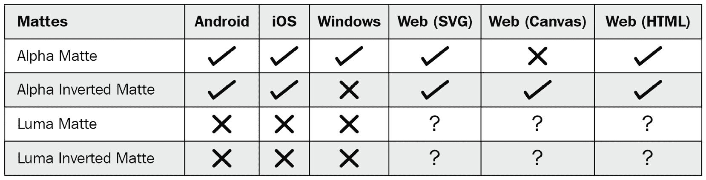

# *第八章*：安装 lottie-react-native

在使用`lottie-react-native`之前，我们需要将其作为 node 模块安装到我们的 React Native 项目中，这样我们就可以在应用程序的代码库中导入它。为了执行此安装，我们有两种不同的选择：

+   npm

+   Yarn

这两种工具都将产生相同的输出（`lottie-react-native`），并且其依赖项将被安装在我们 React Native 项目文件夹内的`node_modules`文件夹中。使用哪种工具将由每个开发者自行决定，并且不应以任何方式影响最终产品。

本章我们将讨论以下主题：

+   基本安装（使用 npm 或 Yarn）

+   `lottie-react-native`的依赖项

+   安装`lottie-react-native`时的 iOS 要求

+   安装 Android 所需的版本

+   安装`lottie-react-native`的早期版本

# 基本安装

安装`lottie-react-native`的过程与任何其他 npm 库类似，考虑到它依赖于用 Swift 和 Java 编写的本地库。考虑到这一点，开发者可以阅读 GitHub 仓库中的安装过程：[`github.com/lottie-react-native/lottie-react-native`](https://github.com/lottie-react-native/lottie-react-native)。

当安装`lottie-react-native`时，开发者应该知道，由于它的构建方式，iOS 的 Lottie 本地库也应该被安装，以便`lottie-react-native`能够在 iOS 应用程序中渲染 Lottie 动画。

让我们看看我们需要遵循哪些步骤才能完成一个成功的安装。

## 使用 npm

按照以下步骤使用 npm 安装`lottie-react-native`库：

1.  导航到 React Native 项目根目录的终端。一旦我们到了那里，我们应该运行以下命令：

    ```js
    npm i --save lottie-react-native
    ```

此命令将遵循四个不同的步骤：

1.  从 npm 仓库下载库的源文件。

1.  在`node_modules`文件夹内创建容器文件夹。

1.  在创建的容器文件夹中安装源文件。

1.  更新`package.json`和`package.json.lock`文件，将库标记为 React Native 项目的依赖项。

npm 从 npm 公共仓库检测并安装库的最新版本，但我们可以通过在版本号后跟一个`@`符号来强制安装特定版本的库。

1.  一旦 npm 安装完库，如果我们需要在 iOS 设备上渲染 Lottie 动画，我们需要安装其 iOS 依赖项：

    ```js
    npm i --save lottie-ios@3.2.3
    ```

运行此命令将触发在非常具体的版本 3.2.3 上安装`lottie-ios`，这是`lottie-react-native`在 iOS 设备上正常工作的兼容版本。

1.  一旦 npm 安装完`lottie-ios`，我们需要安装其 pods 依赖项。我们将通过进入 React Native 项目内的`ios`文件夹并运行以下命令来完成此操作：

    ```js
    pod install
    ```

此操作将触发 CocoaPods，这是一个用于 iOS 和 macOS 项目的依赖项管理工具，它将下载并安装`lottie-ios`运行所需的所有依赖项。

一旦所有这些依赖项都安装完毕，我们就可以开始在 React Native 应用中使用`lottie-react-native`库。

## 使用 Yarn

使用 Yarn 安装`lottie-react-native`与使用 npm 类似。

让我们看看如何做到这一点：

1.  从我们的终端导航到 React Native 项目根文件夹。进入该文件夹后，我们将运行以下命令：

    ```js
    yarn add lottie-react-native
    ```

此命令将遵循四个不同的步骤：

+   从 npm 公共仓库下载库的源文件。

+   在`node_modules`文件夹内创建容器文件夹。

+   在创建的容器文件夹中安装源文件。

+   更新`package.json`和`yarn.lock`文件，将库标记为 React Native 项目的依赖项。

Yarn 总是在 npm 公共仓库中寻找库的最新版本，但我们可以通过在版本号前加上一个`@`符号来强制安装特定版本的库。

1.  一旦 Yarn 完成库的安装，如果我们需要在 iOS 设备上渲染 Lottie 动画，我们需要安装其 iOS 依赖项。我们可以在项目根目录中运行以下命令来安装它：

    ```js
    yarn add lottie-ios@3.2.3
    ```

运行此命令将在其版本号 3.2.3 上安装`lottie-ios`，这是`lottie-react-native`在 iOS 设备上正常工作的兼容版本。

1.  一旦 Yarn 完成`lottie-ios`的安装，我们需要安装其 pod 依赖项。我们将通过进入 React Native 项目中的`ios`文件夹并运行以下命令来完成此操作：

    ```js
    pod install
    ```

此操作将触发 CocoaPods，这是一个用于 iOS 和 macOS 项目的依赖项管理工具，它将下载并安装`lottie-ios`运行所需的所有依赖项。

一旦所有这些依赖项都安装完毕，我们就可以开始在 React Native 应用中使用`lottie-react-native`库。这个库依赖于其他包来部署其所有功能。现在让我们看看这些包。

# lottie-react-native 的其他依赖项

与许多其他库一样，`lottie-react-native`依赖于一些库，当运行 npm 或 Yarn 安装时，这些库会自动安装，正如我们在本章前面的部分所做的那样。依赖项的完整列表如下：

```js
"peerDependencies": {
```

```js
    "lottie-ios": "³.2.3",
```

```js
    "react": "*",
```

```js
    "react-native": "|=0.46"
```

```js
  },
```

```js
  "dependencies": {
```

```js
    "invariant": "².2.2",
```

```js
    "prop-types": "¹⁵.5.10",
```

```js
    "react-native-safe-modules": "¹.0.3"
```

```js
  }
```

如我们所见，`lottie-react-native`需要在包含至少三个依赖库的项目上运行：`lottie-ios`（应使用 npm 或 Yarn 安装，正如我们在本章前面的部分所看到的）、`react`和`react-native`（版本 0.46 或更高）。

除了这些同级依赖项之外，`lottie-react-native` 还需要三个常规依赖项：`invariant`、`prop-types` 和 `react-native-safe-modules`。所有这些都将由 npm 或 Yarn 自动安装，因此开发者无需采取任何手动操作来安装它们。

现在让我们看看 `lottie-react-native` 对平台特定的要求。

# 安装要求

两个平台都对 `lottie-react-native` 的正确安装有特定的要求。现在让我们看看这些差异是什么，以及我们如何在 iOS 和 Android 上完成安装。

## iOS 设备

对于其 iOS 版本，`lottie-react-native` 依赖于 `lottie-ios`，这是一个由 Airbnb 用 Swift 编写的库。这意味着我们需要让我们的 React Native 应用能够读取和执行 Swift 代码。为了做到这一点，我们需要创建一个桥接头（如果我们还没有这样做的话），这样我们的应用 Objective-C 部分就可以与 Swift 部分通信，从而向 `lottie-ios` 发送和接收消息。

如果我们的项目中没有桥接头，我们可以通过以下步骤创建一个：

1.  在 Xcode 中打开您的 `<项目名称|/ios/<项目名称|.xcworkspace` 文件，然后转到 **文件** | **新建** | **文件…**：


图 8.1 – 在您的 Xcode 项目中创建新文件

1.  选择 **Swift 文件** 作为文件类型：


图 8.2 – 选择 Swift 作为文件类型

1.  确认创建桥接头：


图 8.3 – 确认创建桥接头

完成这些步骤后，我们的应用应该准备好在任意的 iOS 和 macOS 设备上使用 `lottie-react-native`。现在让我们准备我们的应用，以便在 Android 设备上运行 `lottie-react-native`。

## Android 设备

在一些罕见的情况下，当在 Android 设备上安装 `lottie-react-native` 时，自动链接可能无法正常工作。这将导致在尝试构建应用时应用崩溃。在这种情况下，您需要按照以下步骤来修复问题：

1.  在 `android/app/src/main/java/<项目名称|/MainApplication.java` 文件中进行以下更改：

    1.  在 `import` 部分添加 `import com.airbnb.android.react.lottie.LottiePackage;`。

    1.  在 `List<ReactPackage| getPackages();` 中添加 `packages.add(new LottiePackage());`。

1.  在 `android/app/build.gradle` 文件中进行以下更改：

    1.  在依赖项块中添加 `implementation project(':lottie-react-native')`。

1.  在 `android/settings.gradle` 文件中添加以下行：

    ```js
    include ':lottie-react-native'
    project(':lottie-react-native').projectDir = new File(rootProject.projectDir, '../node_modules/lottie-react-native/src/android')
    ```

当所有这些更改完成后，为 Android 设备重新构建应用并检查崩溃是否已修复。既然我们的安装已完成，现在让我们继续看看使用最著名的 Lottie 功能的限制和可能性。

# lottie-react-native 库的有限功能

并非所有 Adobe `lottie-react-native` 都支持。实际上，Airbnb 在他们的网站上维护了一个不支持的功能列表：[`github.com/airbnb/lottie/blob/master/supported-features.md`](https://github.com/airbnb/lottie/blob/master/supported-features.md).

写作时最常见的功能支持列表如下：

+   Lottie 在 AE 中对基本几何形状的支持：


图 8.4 – 形状功能支持

+   Lottie 在 AE 中对基本文本效果和格式的支持：


图 8.5 – 文本功能支持

+   Lottie 在 AE 中对遮罩效果的支持：


图 8.6 – 遮罩功能支持

+   Lottie 在 AE 中对层效果的支持：


图 8.7 – 层效果功能支持

+   Lottie 在 AE 中对形状和图形驱动透明度的支持：



图 8.8 – 遮色片功能支持

+   Lottie 在 AE 中对形状组合技术的支持：


图 8.9 – 合并路径功能支持

+   Lottie 在 AE 中对其他效果的支持：


图 8.10 – 其他功能支持

现在我们来学习如何在我们的 React Native 版本需要非最新版本的情况下处理 `lottie-react-native` 的早期版本。

# 安装早期版本

根据我们使用哪个版本的 React Native 来构建项目，我们需要安装特定版本或版本范围。要安装的版本列表可以在前一章中找到，因此现在我们将学习如何安装这些特定版本之一：

1.  识别我们的项目使用哪个 React Native 版本。为此，我们可以检查我们的 React Native 应用项目根目录下的 `package.json` 文件。在此文件中，查找 `react-native` 依赖项并记下版本号：


图 8.11 – 查找您的项目 React Native 版本

1.  查看前一章中的 `lottie-react-native`/`react-native` 兼容性列表，并为您的项目选择正确的 `lottie-react-native`。

1.  使用 npm 或 Yarn 安装所选版本的 `lottie-react-native`，通过在 `@` 符号后指定版本号，例如，`npm install –save lottie-react-native@4.1.3` 或 `yarn add lottie-react-native@4.1.3`。

1.  如前所述，我们需要将 `lottie-ios` 作为依赖项安装；`lottie-react-native`/`lottie-ios` 兼容性列表也可以在前一章中找到。

1.  使用 npm 或 Yarn 安装选定的 `lottie-ios` 版本，通过在 `@` 符号后指定版本号，例如，`npm install –save lottie-ios@3.2.3` 或 `yarn add lottie-ios@3.2.3`。

# 摘要

现在，我们已经正确安装了 `lottie-react-native` 及其依赖项，并准备好在我们的 React Native 应用中使用它来渲染 Lottie 动画。

我们的项目现在可以在 iOS 和 Android 设备上成功构建，因此让我们开始魔法之旅，并集成我们的第一个 Lottie 动画。我们将在下一章中介绍如何做到这一点。
