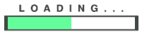

# *第十章*：如何做到完美：控制你的动画

到目前为止，我们在 React Native 应用中已经有一个完全功能的动画，它在挂载时开始循环播放，在卸载时停止。但如果我们想控制动画的播放呢？让我们举一个例子：当我们按顺序将五个不同的文件下载到我们的应用中时，我们需要显示加载条的动画。加载条将通过每次下载一个文件时填充自身（每次下载增加 20%）来显示下载文件的进度，一旦这五个文件都下载完成，加载条将完全填充。

![图 10.1 – 动画加载条示例]



图 10.1 – 用作示例的动画加载条

在这种情况下，我们需要控制动画，每次一个文件完全下载时更新它，在下一个下载进行时停止它。

为了解释 `lottie-react-native` 中这一过程是如何工作的，我们将回顾两种不同的替代方案：声明式和命令式 API。到本章结束时，我们不仅将知道如何在我们的 React Native 应用中渲染 Lottie 动画，而且我们还将能够控制它们的播放和布局。

为了解释 `lottie-react-native` 中这一过程是如何工作的，我们将回顾不同的替代方案：

+   声明式 API

+   命令式 API

# 技术要求

为了完成本章，我们必须有一个在模拟器或设备上运行的正常工作的 React Native 应用。我们将修改这个应用，包括我们在前几章中学到的 `LottieView` 组件，这样我们就可以通过方法和属性来修改和控制动画。

# 声明式 API

命令式编程与声明式编程之间的区别最常见的解释是，命令式代码指导计算机如何执行任务，而声明式代码则专注于你希望计算机做什么。

在命令式编程中，你的代码由语句组成，这些语句通过指示计算机做什么来影响程序的状态。换句话说，你的代码是围绕定义变量和改变它们的值来构建的。

在声明式编程中，你的代码由表达式组成，这些表达式根据它们的输入评估输出，通过告诉机器你想要什么。

React 是按照声明式范式设计的，尽管在需要时它允许你以命令式方式控制一些组件。同样，`lottie-react-native` 也是如此，因为它为在应用中渲染的动画提供了不同的命令式或声明式控制 API。

在本节中，我们将关注如何使用 `lottie-react-native` 库的声明式 API 来控制示例动画加载条。

下面是一个使用声明式 API 控制 Lottie 动画的示例：

```js
const numFilesToDownload = 5;
```

```js
const duration = 2000;
```

```js
const App = ({downloadedFiles}) => {
```

```js
  const progress = useMemo(() => new Animated.Value(0), []); 
```

```js
  useEffect(() => {
```

```js
    Animated.timing(progress, {
```

```js
      toVal4deue: downloadedFiles.length / numFilesToDownload,
```

```js
      duration: duration,
```

```js
      useNativeDriver: true,
```

```js
      easing: Easing.linear,
```

```js
    }).start();
```

```js
  }, [downloadedFiles, progress]);
```

```js
  return (
```

```js
    <SafeAreaView>
```

```js
      <View style={styles.container}>
```

```js
        <LottieView
```

```js
          source={require('./assets/animations/loadingBar.          json')}
```

```js
          progress={progress}
```

```js
        />
```

```js
      </View>
```

```js
    </SafeAreaView>
```

```js
  );
```

```js
};
```

```js
export default App;
```

在这个示例中，我们的 `App` 组件接收一个名为 `downloadedFiles` 的属性，包括应用程序下载的文件信息。这个信息可以由 Redux、MobX、包装应用程序的组件或任何其他方式提供。对于这个示例来说，重要的是要知道 `downloadedFiles` 是一个数组，其大小将从 `0` 增加到要下载的最大文件数（在示例中由 `const numFilesToDownload = 5;` 定义）。

我们正在使用 React Native 的 Animated API 来保持动画的进度：`const progress = useMemo(() => new Animated.Value(0), []);` 。这是一个从 `0` 开始并逐渐达到 `1` 的 `Animated.Value`，定义了我们希望动画完成的程度。我们在这里使用 `useMemo`。由于 `progress` 是一个变量，我们希望使用 React Native 的 Animated API 来更新它：

```js
  useEffect(() => {
```

```js
    Animated.timing(progress, {
```

```js
      toValue: downloadedFiles.length / numFilesToDownload,
```

```js
      duration: duration,
```

```js
      useNativeDriver: true,
```

```js
      easing: Easing.linear,
```

```js
    }).start();
```

```js
  }, [downloadedFiles, progress]);
```

在这部分，我们正在创建一个效果，它将根据已下载的文件数量（`downloadedFiles.length`）和要下载的文件数量（`numFilesToDownload`）来更新 `progress`。有了这个，每次下载一个新文件时，我们将推动进度条向总进度前进 20%。例如，如果我们已经下载了 5 个文件中的 2 个，`progress` 将设置为 0.4，这意味着动画需要平滑地播放直到总播放时间的 40%。

我们还在下一行代码中定义了每次推动加载条的持续时间：

```js
const duration = 2000;
```

在这个示例中最重要的部分是 `LottieView` 组件：

```js
        <LottieView
```

```js
          source={require('./assets/animations/loadingBar.          json')}
```

```js
          progress={progress}
```

```js
        />
```

我们在这里使用 `progress` 属性，这样我们就可以根据某个时刻正在下载的文件数量来声明动画的进度，这个进度依赖于 `progress`（一个 Animated 值）。 

我们可以在 `lottie-react-native` 库的 README 文件中找到所有声明性属性、它们的描述和默认值（[`github.com/lottie-react-native/lottie-react-native/blob/master/docs/api.md`](https://github.com/lottie-react-native/lottie-react-native/blob/master/docs/api.md))。

所有这些都可以在 `LottieView` 组件上声明性使用，以控制我们的 Lottie 动画的渲染和行为。在下一节中，我们将学习如何使用命令式 API 控制我们的动画，对于那些需要明确说明对动画做什么而不是对状态变化做出反应的情况。

我们已经学习了如何在我们的 `LottieView` 对象中使用一些这些属性。现在我们将使用其他重要的属性来展示示例。

## speed

`speed` 属性是一个数字，它根据默认速度应该播放多少次来设置动画的速度：

```js
<LottieView 
```

```js
    source={require('./assets/animations/myLottieFile.json')} 
```

```js
    speed={2} 
```

```js
/>
```

上面的示例将使我们的动画以原始动画速度的两倍播放。

```js
<LottieView 
```

```js
    source={require('./assets/animations/myLottieFile.json')} 
```

```js
    speed={-1} 
```

```js
/>
```

上面的示例将以原始动画速度反向播放我们的动画。考虑到这一点，我们可以创建一个循环，每 2 秒渲染动画来回一次，而不是重复播放：

```js
const App = ({}) => {
```

```js
  const [speed, setSpeed] = useState(1);
```

```js
  const reverseSpeed = useCallback(() => {
```

```js
    if (speed === 1) {
```

```js
      setSpeed(-1);
```

```js
    } else {
```

```js
      setSpeed(1);
```

```js
    }
```

```js
  }, [speed]);
```

```js
  useEffect(() => {
```

```js
    setTimeout(() => {
```

```js
      reverseSpeed();
```

```js
    }, 2000);
```

```js
  }, [reverseSpeed]);
```

```js
  return (
```

```js
    <SafeAreaView>
```

```js
      <View style={styles.container}>
```

```js
        <LottieView
```

```js
          source={require('./assets/animations/loadingBar.          json')}
```

```js
          autoPlay
```

```js
          speed={speed}
```

```js
        />
```

```js
      </View>
```

```js
    </SafeAreaView>
```

```js
  );
```

```js
};
```

## onAnimationFinish

`onAnimationFinish`属性是一个回调，当动画完成播放时将被触发。我们可以使用它来在显示的动画播放完成后导航到新屏幕：

```js
const App = ({navigation}) => {
```

```js
  const onAnimationFinish = useCallback(() => {
```

```js
    navigation.navigate('NextScreen');
```

```js
  }, []);
```

```js
  return (
```

```js
    <SafeAreaView>
```

```js
      <View style={styles.container}>
```

```js
        <LottieView
```

```js
          source={require('./assets/animations/loadingBar.          json')}
```

```js
          autoPlay
```

```js
          onAnimationFinish={onAnimationFinish}
```

```js
          loop={false}
```

```js
        />
```

```js
      </View>
```

```js
    </SafeAreaView>
```

```js
  );
```

```js
};
```

注意`loop={false}`对于`onAnimationFinish`正常工作来说是必要的，因为循环动画永远不会结束。

## colorFilters

`colorFilters`属性是一个包含字符串编码的十六进制颜色的对象数组，它允许开发者以编程方式更改特定图层的颜色。为了使此属性正常工作，需要提供正确的 keypath（在 After Effects 中创建应用时设置的属性，并存储在 Lottie JSON 文件中），以及相应的代码：

```js
<LottieView
```

```js
    autoPlay
```

```js
    source={require('./assets/animations/loadingBar.json')}
```

```js
    colorFilters={[
```

```js
      {
```

```js
        keypath: 'button',
```

```js
        color: '#FF0000',
```

```js
      },
```

```js
      {
```

```js
        keypath: 'circle',
```

```js
        color: '#00FF00',
```

```js
      },
```

```js
      {
```

```js
        keypath: 'square',
```

```js
        color: '#0000FF',
```

```js
      },
```

```js
    ]}
```

```js
/>
```

这段代码修改了三个 After Effect 图层（`button`、`circle`和`square`），将它们的颜色分别改为红色（`'#FF0000'`）、绿色（`'#00FF00'`）和蓝色（`'#0000FF'`）。

## textFiltersAndroid 和 textFiltersIOS

`textFiltersAndroid`和`textFiltersIOS`包含一个包含要替换的文本的对象数组，我们可以通过编程方式修改动画中的特定文本。当我们在应用中处理翻译时，此属性非常有用：

```js
<LottieView
```

```js
  autoPlay
```

```js
  source={require('./assets/animations/loadingBar.json')}
```

```js
  textFiltersAndroid={[
```

```js
    {find: 'Hello!', replace: 'Hola!'},
```

```js
    {find: 'Bye!', replace: 'Adios!'},
```

```js
  ]}
```

```js
     textFiltersIOS={[
```

```js
    {find: 'Hello!', replace: 'Hola!'},
```

```js
    {find: 'Bye!', replace: 'Adios!'},
```

```js
  ]}
```

```js
/>
```

在这个例子中，我们正在替换动画中的文本`'Hello!'`为`'Hola!'`，并将`'Bye!'`替换为`'Adios!'`，适用于 iOS 和 Android 设备。

现在我们已经学会了如何使用声明式 API，让我们继续学习另一种与 Lottie 动画交互的方式：命令式 API。

# 强制性 API

有时候，在我们的应用中使用命令式编程会更简单，例如，有时我们需要根据应用内的用户交互来播放/停止动画。在这种情况下，我们可以使用`lottie-react-native`库的命令式 API，它允许开发者以非常直接的方式控制动画播放。

React 自动为所有其组件提供`ref`属性，以及`useRef`钩子，以便我们可以在需要以命令式方式控制组件时使用。

我们在上一节中编写的代码实际上是命令式编程在需要直接在组件上触发动作时更有意义的例子，这提高了可读性，并使我们的代码更容易推理：

```js
import React, {useEffect, useRef} from 'react';
```

```js
import LottieView from 'lottie-react-native';
```

```js
import {SafeAreaView, View, StyleSheet} from 'react-native';
```

```js
const numFramesPerFile = 9;
```

```js
const App = ({downloadedFiles}) => {
```

```js
  const animation = useRef(null);
```

```js
  useEffect(() => {
```

```js
    if (downloadedFiles.length === 0) {
```

```js
      animation.current.reset();
```

```js
    } else {
```

```js
      const startFrame = numFramesPerFile * (downloadedFiles.      length - 1);
```

```js
      animation.current.play(startFrame, startFrame +       numFramesPerFile);
```

```js
    }
```

```js
  }, [downloadedFiles]);
```

```js
  return (
```

```js
    <SafeAreaView>
```

```js
      <View style={styles.container}>
```

```js
        <LottieView
```

```js
          ref={animation}
```

```js
          source={require('./assets/animations/loadingBar.          json')}
```

```js
          loop={false}
```

```js
        />
```

```js
      </View>
```

```js
    </SafeAreaView>
```

```js
  );
```

```js
};
```

```js
const styles = StyleSheet.create({
```

```js
  container: {
```

```js
    width: '100%',
```

```js
    height: '100%',
```

```js
    justifyContent: 'center',
```

```js
    alignItems: 'center',
```

```js
  },
```

```js
});
```

```js
export default App;
```

对于这种方法，我们首先需要确定动画包含多少帧，以及下载每个要下载的文件后需要渲染多少帧。在这个例子中，我们可以这样计算：

1.  动画中包含的帧数：`45`

1.  需要下载的文件数：`5`

1.  每次文件下载要播放的帧数：`45` / `5` = `9`

然后，我们在代码中定义了在每次文件下载时播放的计算帧数作为一个常量：

`const numFramesPerFile = 9;`

接下来，我们需要创建一个对`LottieView`组件的引用，这将使我们能够调用其上的命令式方法。我们使用 React 提供的`useRef`钩子来完成此操作：

`const animation = useRef(null);`

这个引用需要作为 `ref` 属性传递给我们的 `LottieView` 组件：

```js
        <LottieView
```

```js
          ref={animation}
```

```js
          source={require('./assets/animations/loadingBar.          json')}
```

```js
          loop={false}
```

```js
        />
```

我们还看到如何显式传递 `loop={false}`，这样当我们在动画上调用任何命令式回放方法时，动画就不会重复。

在所有这些设置准备就绪后，我们可以创建一个在每次文件下载时都会触发效果的动画。这个效果将在引用的组件上使用命令式播放方法。这个播放方法接受我们想要在动画中播放的初始帧和最终帧。

我们将使用这些参数在每次文件下载时仅重现动画的一部分：

```js
  useEffect(() => {
```

```js
    if (downloadedFiles.length === 0) {
```

```js
      animation.current.reset();
```

```js
    } else {
```

```js
      const startFrame = numFramesPerFile * (downloadedFiles.      length - 1);
```

```js
      animation.current.play(startFrame, startFrame +       numFramesPerFile);
```

```js
    }
```

```js
  }, [downloadedFiles]);
```

当我们知道应用下载了多少个文件（`downloadedFiles.length`）时，我们可以轻松计算出下一个动画部分应该开始的初始帧：

```js
const startFrame = numFramesPerFile * (downloadedFiles.length - 1);
```

然后，我们到达这段代码最重要的部分：使用命令式 API 从初始帧 (`startFrame`) 播放动画直到最终帧 (`startFrame + numFramesPerFile`) 的部分：

```js
animation.current.play(startFrame, startFrame + numFramesPerFile);
```

注意，如果下载的文件数量为零，我们将重置动画，以确保我们始终从初始帧开始：

```js
    if (downloadedFiles.length === 0) {
```

```js
      animation.current.reset();
```

```js
    }
```

除了 `play` 和 `reset`，我们还可以在 `lottie-react-native` 库的 README 文件中找到其他命令式方法，该文件位于 [`github.com/lottie-react-native/lottie-react-native/blob/master/docs/api.md`](https://github.com/lottie-react-native/lottie-react-native/blob/master/docs/api.md)。

# 摘要

在本章中，我们回顾了 `lottie-react-native` 的声明式和命令式 API 之间的区别，这些 API 可以用来控制动画的外观和播放。除此之外，我们还学习了如何使用 React Native 的 Animated API 来平滑地控制 Lottie 动画的进度。

在下一章中，我们将讨论在使用 `lottie-react-native` 在我们的 React Native 应用中可能遇到的一些最常见问题、陷阱和问题。
