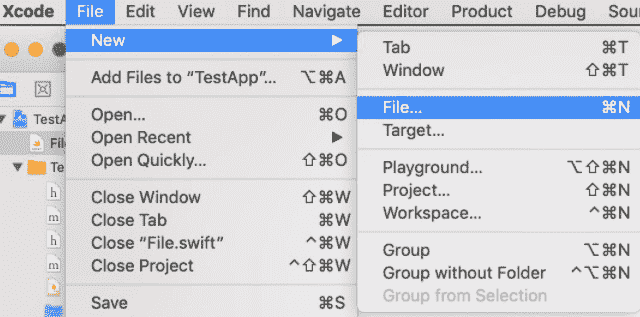
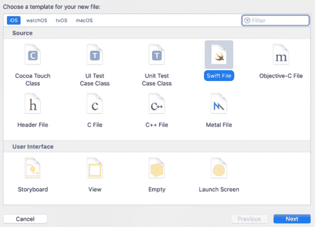
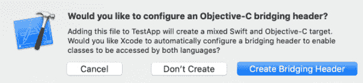

# *第十一章*：有什么问题？lottie-react-native 常见问题解答

即使这本书包含了所有信息，在使用基于 Lottie 的动画时，也可能会出现一些问题。在本章中，我们将讨论开发者在使用`lottie-react-native`时最常问的一些问题。为了方便，以下是在接下来的页面中你将找到的问题和问题的列表：

1.  我在我的动画中添加了一个效果，但在应用中未渲染。

1.  在我的应用中，动画根本未渲染。

1.  动画看起来被拉伸了。

1.  我该如何暂停动画？

1.  我该如何反转动画？

1.  我的动画在 iOS 设备上渲染，但在 Android 设备上没有渲染。

1.  我的动画在 Android 设备上渲染，但在 iOS 设备上没有渲染。

1.  安装`lottie-react-native`后，我的应用无法构建。

1.  一些帧在我的动画中没有显示。

1.  我的动画显示的颜色不正确，或者完全没有颜色。

1.  我该如何将我的 Lottie 动画用作启动画面？

1.  我的动画中缺少图像。

1.  我该如何在应用中居中动画？

1.  我该如何播放我的动画指定次数？

1.  我的动画播放性能较低。

1.  我该如何通过编程方式更改动画的颜色？

1.  我如何在应用中使用远程的 Lottie 动画文件？

1.  我的 Android 应用崩溃了。

1.  在我的应用中显示了一个错误 – **目标之间的循环依赖**。

1.  在我的应用中显示了一个错误 – **Gradle 7：无法解析类 MavenDeployment**。

# 1. 我在我的动画中添加了一个效果，但在应用中未渲染

在 Adobe After Effects 中，有一些效果在特定平台上不受支持。当出现此类错误时，最好查看 Lottie 文档中支持的特性列表，网址为[`github.com/airbnb/lottie/blob/master/supported-features.md`](https://github.com/airbnb/lottie/blob/master/supported-features.md)。

请注意，这个列表可能会随着时间的推移而变化，因为 Lottie 正在不断改进。正如列表所示，同一个效果可能在特定平台上显示，但在另一个平台上可能缺失。

对于这些情况，最常见的方法是重新制作动画，移除选定的效果，或者为失败的平台创建不同的动画，因为没有程序性的解决方案来解决这个问题。

# 2. 在我的应用中，动画根本未渲染

请检查包含动画的 JSON 文件是否放置在 React Native 应用项目结构中，并且可以通过动画应渲染的组件中的`import/require`语句访问。为了测试这一点，你可以`console.log` JSON 文件的内容；如果它们显示为`undefined`，则表示文件无法被组件访问：

```js
const animation = require('./assets/animations/loadingBar.json')
```

```js
console.log(animation)
```

在这种情况下，你可能需要将 JSON 文件移动到不同的文件夹，或者尝试使用不同的 JSON 文件，因为文件可能已损坏或不一致。使用 JSON 检查器可以帮助识别和修复此类问题。

# 3. 动画看起来被拉伸

`LottieView` 继承了标准 React Native `View` 组件的大小行为，因此，可以通过其包含父元素上的样式属性来更改它。如果图像大小看起来不正确，请首先尝试显式更改父元素的大小：

```js
  <View style={{width: 300, height: 150}}>
```

```js
        <LottieView
```

```js
          ref={animation}
```

```js
          source={require('./assets/animations/loadingBar.          json')}
```

```js
          loop={false}
```

```js
        />
```

```js
  </View>
```

如果这不起作用，请尝试在 `LottieView` 组件中显式更改 `width` 或 `height`：

```js
     <LottieView
```

```js
          ref={animation}
```

```js
          source={require('./assets/animations/loadingBar.          json')}
```

```js
          loop={false}
```

```js
          style={{width: 300, height: 150}}
```

```js
     />
```

在两种方法中也可以使用父元素相对大小（百分比）。始终注意父元素的大小，因为许多问题可以通过确保父元素大小正确来解决。此外，如果需要，请考虑使用 `flex` 属性。

# 4. 我该如何暂停动画？

有几种方法可以解决这个问题：

+   如果你正在使用代码中的声明式方法，你可以在 `LottieView` 上使用 `speed` 属性，将其设置为 `0` 将停止动画。

+   如果你正在使用命令式 API，你可以在动画引用上使用 `pause()` 方法，这将立即停止你的动画播放。相反，`play()` 方法将在你需要时重新启动播放。

# 5. 我该如何反转动画？

实现反向播放的最简单方法是在 `LottieView` 组件上使用 `speed` 属性，因为负值会使动画反向播放。如果你想以原始速度反向播放动画，需要将 `speed` 属性设置为 `-1`，但你也可以将其设置为 `-2` 以实现双倍速度播放，或者将其更改为 `-0.5` 以实现半速播放：

```js
<LottieView
```

```js
  source={require('./assets/animations/loadingBar.json')}
```

```js
  speed={-1}
```

```js
/>
```

如果你正在使用动画 API 来控制动画的进度，你可以使用如 `Animated.timing` 等方法，并确保你传递的是递减的值：

```js
  // start animation at frame 300 and go decrementally to frame      0
```

```js
  const progress = useMemo(() => new Animated.Value(300), []);
```

```js
  useEffect(() => {
```

```js
    Animated.timing(progress, {
```

```js
      toValue: 0,
```

```js
      duration: 500,
```

```js
      useNativeDriver: true,
```

```js
      easing: Easing.linear,
```

```js
    }).start();
```

```js
  }, [downloadedFiles, progress]);
```

```js
  return (
```

```js
    <SafeAreaView>
```

```js
      <View style={styles.container}>
```

```js
        <LottieView
```

```js
          source={require('./assets/animations/loadingBar.          json')}
```

```js
          progress={progress}
```

```js
        />
```

```js
      </View>
```

```js
    </SafeAreaView>
```

```js
  );
```

# 6. 我的动画在 iOS 设备上渲染，但在 Android 设备上不渲染

`lottie-react-native` 的新版本只能在 AndroidX 项目中使用。这意味着如果你的应用尚未迁移到 AndroidX ([`developer.android.com/jetpack/androidx`](https://developer.android.com/jetpack/androidx))，它将无法显示任何 Lottie 动画。

在这种情况下，你可以尝试 `lottie-react-native` 的旧版本。例如，尝试运行以下命令：

```js
yarn add lottie-react-native@3.0.2
yarn add lottie-ios@3.0.3
```

考虑到这些情况，API 可能不同，或者可能需要一些额外的安装步骤。始终在使用 `lottie-react-native` 的旧版本时检查版本特定的文档。

# 7. 我的动画在 Android 设备上渲染，但在 iOS 设备上不渲染

`lottie-react-native` 需要一些额外的安装步骤才能正常工作：

+   记得通过运行 `yarn add lottie-ios` 来安装 `lottie-ios` 依赖项。

+   记得从你的 React Native 项目的 `ios` 文件夹中运行 `pod install`。

# 8. 安装 lottie-react-native 后，我的应用在 iOS 上无法构建

在 iOS 中，`lottie-react-native`最常见的构建问题与对 Swift 库的 React Native 项目的支持不足有关。在这种情况下，您需要创建一个 Swift 桥接头，以便使您的应用为 Swift 库做好准备：

1.  通过 Xcode 菜单添加新文件：**文件** | **新建** | **文件**：



图 11.1 – 在您的 Xcode 项目中创建一个新文件

1.  选择**Swift 文件**：



图 11.2 – 选择 Swift 作为文件类型

1.  点击**创建桥接头**：



图 11.3 – 确认创建桥接头

您可能需要重新构建项目以使更改生效。一旦完成，`lottie-react-native`应该准备好在 iOS 上显示您的动画。

# 9. 我的动画中有些帧没有显示

Lottie 的旧版本存在渲染问题，并且无法与新版本的 Android 和 iOS 正确工作。要修复此类问题，请确保您有适用于您正在运行的平台的最新`lottie-react-native`版本。

您可以在`projects`存储库（[`github.com/lottie-react-native/lottie-react-native`](https://github.com/lottie-react-native/lottie-react-native)）或 npm 网站上找到`lottie-react-native`的可用版本列表（[`www.npmjs.com/package/lottie-react-native`](https://www.npmjs.com/package/lottie-react-native)）。

# 10. 我的动画显示的颜色错误或完全没有颜色

这通常不是`lottie-react-native`的问题，而是`Bodymovin`导出颜色的方式。您可能仍然可以通过手动浏览您的 JSON 文件并手动修改它们来解决这个问题。

JSON 文件中的层颜色通常由名为`"sc"`的键定义，因此您可以搜索该键并更改您想要更改的颜色十六进制值。例如，如果您期望红色但得到的是白色，您可以搜索`"sc":"#ffffff"`并将其替换为`"sc":"#ff0000"`。

请注意，可能存在多个层定义了该颜色，因此您可能需要尝试错误直到找到您需要更改的确切层。

# 11. 我如何将我的 Lottie 动画用作启动画面？

在应用启动时显示 Lottie 动画是一种很好的用户体验，随着移动应用的日益复杂化，这种做法变得越来越受欢迎。一种常见的方法是将动画作为主屏幕加载，有一个状态变量在动画完成后改变，并在大多数初始数据加载完毕后立即切换到真实的主屏幕：

```js
import React, { useState } from 'react';
```

```js
const App = () => {
```

```js
  const [animationFinished, setAnimationFinished] = useState(false);
```

```js
  useEffect(() => {
```

```js
    loadAppData(); // load initial data
```

```js
  }, []);
```

```js
  if (animationFinished === false) {
```

```js
    return(
```

```js
      <View style={styles.splash}>
```

```js
        <LottieView source={require('./assets/animations/        splashAnimation.json')}
```

```js
          autoPlay
```

```js
          loop={false}
```

```js
          onAnimationFinish={() => {
```

```js
            setAnimationFinished(true);
```

```js
          }}
```

```js
        />
```

```js
      </View>
```

```js
    )      
```

```js
  } else {
```

```js
    return(
```

```js
      <MainScreen />
```

```js
    )
```

```js
  }
```

```js
};
```

如果我们想将 Lottie 动画作为启动屏幕显示，我们需要将此组件作为初始组件，这样应用首先加载的就是这个动画。注意我们如何在组件挂载时调用`loadAppData()`来开始加载数据，在组件向用户显示数据之前。

# 12. 我的动画中缺少图像

如果您使用外部资源（图像）创建了动画，您需要将这些图像添加到您的应用中，并让`lottie-react-native`知道这些图像的位置。这需要在本地级别完成，并需要一些配置，如在第九章*“让我们做一些魔法：集成您的第一个 Lottie 动画”*中所述，在名为*“使用带有资源的 Lottie 文件”*的部分中解释。

确保您执行以下操作：

+   将这些图像添加到项目的文件夹结构中。

+   以一种使这些文件可以通过代码访问的方式配置您的项目。

+   将`imageAssetsFolder`属性传递给`LottieView`组件，并使用正确的相对路径指向包含这些资源的文件夹。

# 13. 我如何在应用中居中动画？

`LottieView`组件从 React Native 的标准`View`组件继承其布局行为，因此居中应该以我们在 React Native 中居中`View`的方式来进行。这可以通过在`LottieView`组件的`style`属性上使用`alignSelf: 'center'`键，或者确保父组件具有正确的大小并在其`style`属性中使用`alignItems: 'center'`来实现。

如果这种方法不起作用，我们应该确保父组件具有正确的大小，因为大多数对齐问题都源于此问题。

# 14. 我如何播放动画指定次数？

最简单的方法是使用命令式 API，调整`play()`方法和`onAnimationFinish`属性重复播放动画，当播放结束时播放动画：

```js
import React, {useState, useRef} from 'react';
```

```js
const App = ({}) => {
```

```js
  const animation = useRef(null);
```

```js
  const [numPlaybacks, setNumPlaybacks] = useState(0);
```

```js
  return (
```

```js
    <SafeAreaView>
```

```js
      <View style={styles.container}>
```

```js
        <LottieView
```

```js
          ref={animation}
```

```js
          source={require('./assets/animations/loadingBar.          json')}
```

```js
          loop={false}
```

```js
          autoPlay
```

```js
          onAnimationFinish={() => {
```

```js
            if (numPlaybacks + 1 < maxNumPlaybacks) {
```

```js
              animation.current.play();
```

```js
              setNumPlaybacks(numPlaybacks + 1);
```

```js
            }
```

```js
          }}
```

```js
        />
```

```js
      </View>
```

```js
    </SafeAreaView>
```

```js
  );
```

```js
};
```

这段代码的关键在于如何使用`onAnimationFinish`来重复动画，通过状态变量（`numPlaybacks`）和常数最大重复次数（`maxNumPlaybacks`）来控制重复次数。

# 15. 我的动画播放性能较低

随着移动操作系统的不断发展，它们采用了不同的图形渲染技术。Lottie 通过定期发布新版本来适应这些变化，这些新版本可以提升渲染动画的性能。始终使用`lottie-react-native`的最新版本非常重要，因为它可能包含基于 Android 和 iOS 设备最新渲染引擎的性能改进。

React Native 通过接受`useNativeDriver`参数，为动画 API 提供了一种开箱即用的性能改进，该参数利用了一些 UI 组件的本地能力。使用此参数可能有助于在使用`Animated`和`lottie-react-native`结合时。

如果您想确保您正在使用`lottie-react-native`的最新版本，请确保您检查`lottie-react-native`存储库中的 README 文档，并遵循其安装指南。

# 16. 我如何以编程方式更改动画的颜色？

`lottie-react-native`允许开发者在任何`LottieView`组件中使用`colorFilters`属性，目的是更改动画中特定层的颜色。这些层的名称在 After Effects 中定义，并存储在导出的 JSON Lottie 文件中，如下面的代码块所示：

```js
import React from 'react';
```

```js
import LottieView from 'lottie-react-native';
```

```js
import {SafeAreaView, View} from 'react-native';
```

```js
const App = ({}) => {
```

```js
  return (
```

```js
    <SafeAreaView>
```

```js
      <View style={{width: '100%', height: '100%'}}>
```

```js
        <LottieView
```

```js
          source={require('./assets/animations/loadingBar.          json')}
```

```js
          autoPlay
```

```js
          colorFilters={[
```

```js
            {
```

```js
              keypath: 'border',
```

```js
              color: '#FF0000',
```

```js
            },
```

```js
            {
```

```js
              keypath: 'bar',
```

```js
              color: '#FF0000',
```

```js
            },
```

```js
          ]}
```

```js
        />
```

```js
      </View>
```

```js
    </SafeAreaView>
```

```js
  );
```

```js
};
```

```js
export default App;
```

在这个例子中，我们将名为`border`和`bar`的两个层的颜色更改为全红色。

# 17. 我如何在应用中使用远程 Lottie 动画文件？

最简单的方法是使用`fetch()`下载 JSON 文件，解析它，并将其设置在状态变量中，以便它可以作为`LottieView`容器中的`source`属性使用：

```js
import React, {useState, useEffect} from 'react';
```

```js
import LottieView from 'lottie-react-native';
```

```js
import {SafeAreaView, View} from 'react-native';
```

```js
const App = ({}) => {
```

```js
  const [animation, setAnimation] = useState();
```

```js
  useEffect(() => {
```

```js
    fetch('https://myserver.com/animation.json', {
```

```js
      method: 'GET',
```

```js
    })
```

```js
      .then(response => response.json())
```

```js
      .then(responseJSON => {
```

```js
        setAnimation(responseJSON);
```

```js
      })
```

```js
      .catch(e => console.error(e));
```

```js
  }, []);
```

```js
  return (
```

```js
    <SafeAreaView>
```

```js
      <View style={{width: '100%', height: '100%'}}>
```

```js
        {animation && <LottieView source={animation} autoPlay         loop />}
```

```js
      </View>
```

```js
    </SafeAreaView>
```

```js
  );
```

```js
};
```

```js
export default App;
```

如果遵循此方法，重要的是在动画完全下载之前控制`LottieView`组件（`animation && <LottieView`）。

# 18. 我的 Android 应用崩溃了

有几位用户报告说，由于错误，在 Android 上应用崩溃。React Native 的最新版本已经改进了这一过程，更新这些版本应该可以解决问题，但如果这不是一个可行的方案，您可以按照以下步骤手动链接所需的库：

1.  在您的`android/app/src/main/java/<YourAppName>/MainApplication.java`中，在顶部添加`import com.airbnb.android.react.lottie.LottiePackage;`。

1.  在同一文件中，在`List<ReactPackage> getPackages()`下添加`packages.add(new LottiePackage());`。

1.  在您的`android/app/build.gradle`中，在依赖关系部分添加`implementation project(':lottie-react-native')`。

1.  在您的`android/settings.gradle`中添加`include ':lottie-react-native'`。

1.  在您刚刚添加的行之后，添加`project(':lottie-react-native').projectDir = new File(rootProject.projectDir, '../node_modules/lottie-react-native/src/android')`。

现在，您应该重新构建您的应用，并发现它不再崩溃。

# 19. 我的 app 上显示了一个错误 – 目标之间的循环依赖

这是在 iOS 中处理原生代码时 React Native 开发者常见的错误。问题是与依赖关系树的变化有关，最终导致重新排列了哪个库依赖于另一个库。因此，最简单的解决方案是在我们的 iOS 项目中重置依赖关系树，确保我们最终得到一个干净的依赖链。

要实现这一点，我们可以在 Xcode 中按*Command* + *Shift* + *K*清理`builds`文件夹，然后在`project`文件夹中按命令行中的`yarn ios`重新构建应用。

# 20. 我的 app 上显示了一个错误 – 执行任务`:lottie-react-native:compileDebugJavaWithJavac'失败

这种错误可能在更新到 React Native 的新版本并在 Android 设备上首次运行应用后出现。有时，只需清理 `builds` 文件夹就能解决这个问题，但如果清理不起作用，还有两种其他方法可能修复它：

+   通过将 `android.useAndroidX=true` 和 `android.enableJetifier=true` 添加到您的 `gradle.properties` 文件，并立即运行 `npx jetifier` 来将您的应用迁移到 AndroidX。这将使您的应用准备好包含基于 AndroidX 的库。

+   确保您正在使用 JDK v8 而不是较新版本（Android Studio 可能会安装较新版本）。您可以在 React Native 网站上的环境设置说明（[`reactnative.dev/docs/environment-setup`](https://reactnative.dev/docs/environment-setup)）中找到，并在您的 shell 配置文件中将该版本的 Java 配置为默认版本。

# 摘要

感谢您阅读完这一章，其中我们介绍了在处理 `lottie-react-native` 时报告的最常见问题和疑问。还有许多其他不常被问到的问题可以在 `lottie-react-native` 仓库的问题（[`github.com/lottie-react-native/lottie-react-native/issues`](https://github.com/lottie-react-native/lottie-react-native/issues)）和 Stack Overflow 上找到，所以如果您需要更具体的答案，请确保您转向那些资源。

20. 我的 app 上显示了一个错误 – 执行任务 ':lottie-react-native:compileDebugJavaWithJavac' 失败
