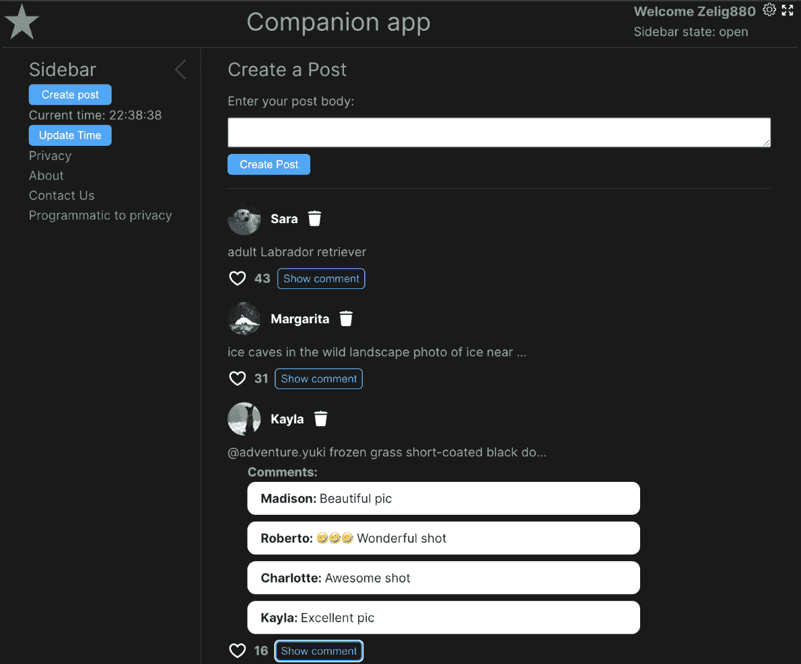
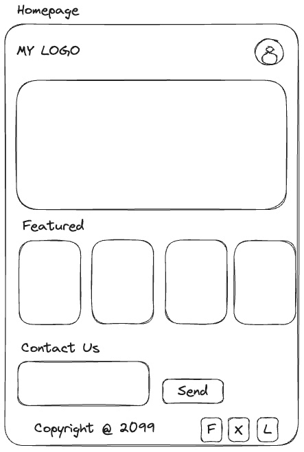
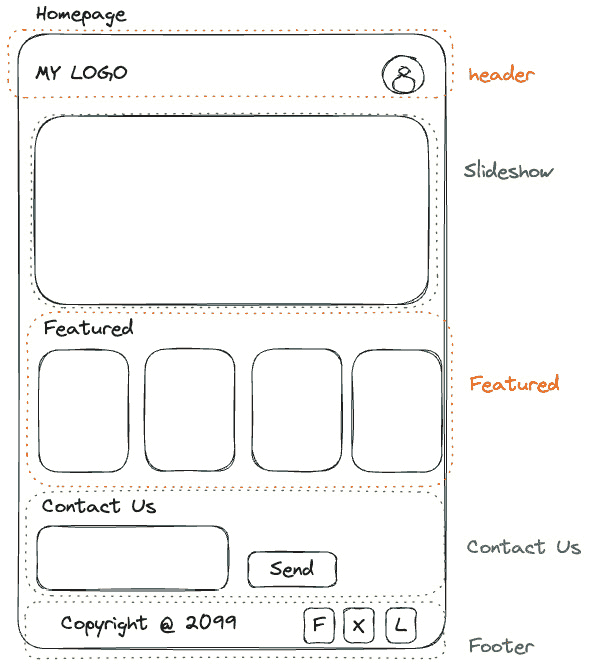
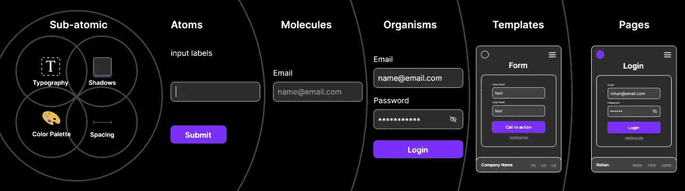
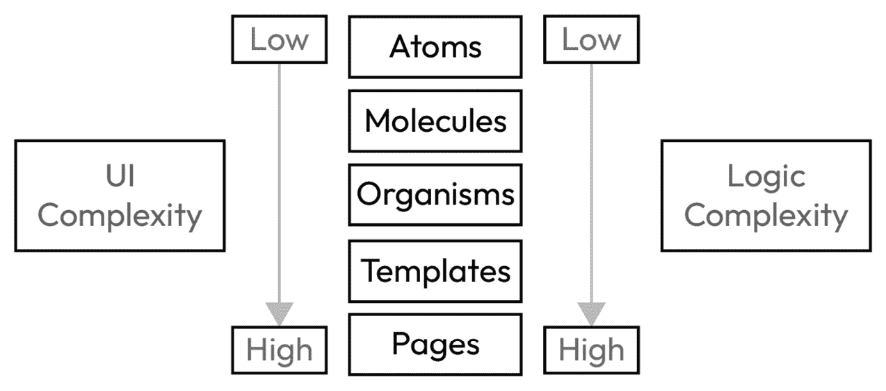

# 1

# 探索书籍布局和配套应用程序

Vue.js 是 JavaScript（JS）生态系统中的一个极其流行的框架。近年来，由于其简洁性、出色的文档以及最终其出色的社区，它获得了大量的关注。如果你现在开始网页开发，或者是从其他框架或语言过渡过来，Vue.js 是一个很好的选择。

在我们深入本书的主要内容之前，了解书籍的结构以及将用于解释这个出色框架不同主题的方法非常重要。

为了简化 Vue.js 的学习，并使书籍更加有趣和互动，本书围绕配套应用程序的创建和增强而构建。

《*Vue.js 3 入门*》将主要关注框架及其核心库，并且不会涵盖 HTML、CSS、JS 和 Git 等基本开发知识。为了理解本书的内容，需要具备这些四个主题的基本知识。

本书的第一部分将涵盖我们学习旅程的一个重要方面，并为你提供利用本书内容所需的重要理论知识；然后，我们将通过介绍框架及其核心概念在*第二章*中跳入 Vue 的具体细节。最后，从*第三章*开始，我们将逐个组件地开始构建我们的应用程序。

在本章中，我们将涵盖以下主题：

+   配套应用程序

+   网络应用程序的核心区域

+   组件化架构

到本章结束时，你将了解在本书的学习过程中我们将要构建的内容，并涵盖一些理论方面，这些方面是我们充分利用 Vue.js 框架所必需的，例如组件化架构和配套应用程序背后的架构决策。

# 技术要求

伴随本书的应用程序是使用免费软件和 API 构建的，不会要求你购买任何东西。然而，有一些特定的技术要求需要你遵循：

+   Visual Studio Code 或另一个等效的 IDE（集成开发环境）

+   Volar Visual Studio 代码扩展

+   更新到最新版本的浏览器（我建议使用 Chrome 或 Firefox）

+   Node 16+

+   在您的机器上安装了 GIT 或 Git **GUI**（**图形用户界面**）例如 GitKraken

# 配套应用程序

学习一门新的语言或框架并非易事。互联网上有许多免费资源，例如文档、博客和 YouTube 视频，但我相信学习新技术需要实践，而最好的方式就是一起构建一个生产就绪、性能良好、可扩展的社会媒体应用程序。

应用程序将非常类似于社交媒体平台 X（以前称为 Twitter）。我们将从一个干净的画布开始，逐渐添加更多功能和功能，直到应用程序完全工作并准备好添加到你的作品集并在你下一次求职面试中展示。

每章都将有一组部分，帮助你导航本书。这不仅确保你始终能够跟随并清楚地理解章节的范围，而且在你阅读完本书后，还可以作为参考使用，如果你需要的话，可以跳转到特定的章节。

每章都包括以下部分：

+   章节开始的分支

+   伴侣应用程序的当前状态

+   定义当前章节将添加和实现的内容

+   多个解释和编码部分

+   本章我们学习到的 Vue.js 主题总结以及术语表

## 伴侣应用程序的功能

如前所述，我们即将构建的应用程序将非常类似于现有的社交媒体应用程序。为了确保我们涵盖 Vue.js 的大多数特性和其生态系统，我们有时可能会过度设计特定的组件或功能，但在此情况下，将会指出，以便你全面了解是否是未来遵循的良好实践以及正确的实现方式。

通过跟随本书，你将学习以下内容：

+   如何使用基于组件的架构来构建网页应用程序

+   如何使用 Vue.js 创建简单和复杂的 HTML

+   如何做出正确的决策，使你的应用程序具有性能和可扩展性

+   如何在组件之间进行通信

+   如何使用外部 API 加载动态数据

+   如何使用 Pinia 进行状态管理

+   如何使用 vue-router 实现多页面（路由）

+   如何使用 Vitest 和 Cypress 测试你的应用程序

+   如何使用 Vue.js 有效地创建表单

+   如何使用 Vue 调试器调试你的应用程序

上述列表只是本书我们将实现内容的概述，我们将通过构建伴侣应用程序来使学习变得有趣和互动。

## 应用程序代码

应用程序的代码可以在本仓库中找到：[`github.com/PacktPublishing/Vue.js-3-for-Beginners`](https://github.com/PacktPublishing/Vue.js-3-for-Beginners)。如果你不知道什么是仓库或如何使用它，我建议你学习基础知识，即使每个章节都会提供使用代码所需的所有信息和命令。

仓库为每个章节有多个分支。这将是每个章节的起点，并在每个章节的开始处指定，如前所述。

仓库的主要分支是最新提交，其中包含完整的应用程序。如果你有时间，我建议你运行完整的应用程序来尝试浏览，看看我们在本书的进程中会实现什么。

要运行应用，你可以简单地遵循项目根目录中可用的`README.md`文件中的说明。

由于这是我们第一次运行应用，我还会提供这里所需的信息，以便让应用启动并运行：

1.  首先，我们需要在我们的机器上获取远程仓库的副本。为此，请在终端中运行以下命令：

    ```js
    git clone https://github.com/PacktPublishing/Vue.js-3-for-Beginners
    ```

1.  然后，我们需要导航到我们新创建的项目文件夹：

    ```js
    cd vue-for-beginners
    ```

1.  在我们能够运行项目之前，我们需要使用包管理器安装所有依赖项。包管理器是一种用于安装和管理包的软件，在我们的案例中，是 Node.js 和 JS，项目依赖于它们。存储库中共享的应用支持所有主要的包管理器，如 npm、yarn 和 pnpm。在以下示例中，我们将使用 npm：

    ```js
    npm install
    ```

1.  最后，是时候运行项目了。以下命令将运行项目的开发版本：

    ```js
    npm run serve
    ```

几秒钟后，应用的本地实例将启动，你应该可以通过在浏览器中打开`HTTP://localhost:5173`来访问它。应用应该看起来像这样。



图 1.1：伴随应用仪表板的截图

在应用中花些时间进行导航，既在浏览器中，也在代码库中，看看我们在本书的过程中将构建什么。

在本节中，我们学习了伴随应用，它是如何支持我们的学习的，其核心功能，以及最后，在本地运行应用所需的命令。在下一节中，我们将花几分钟时间讨论网络应用的核心领域，并解释我们将使用哪些技术/库在我们的应用中。

# 网络应用的核心领域

JS 生态系统并不羞于使用框架和库，但即使有如此广泛的选择，它们大多共享相同的核心理念和领域。这些是网络应用的核心部分，无论你使用哪个框架来编写你的应用，你都必须了解这一点，并对其含义有一个基本的理解。

网络应用的基础如下：

+   **用户界面（UI）**：这指的是用户可以与之交互的屏幕上的元素。简单来说，你可以在互联网上看到或与之交互的任何东西都是 UI 的一部分。网络开发的核心领域通常使用基本的 HTML/CSS、纯 JS（这是另一种说纯 JS 的方式），或者像 React、Vue 或 Angular 这样的框架来实现。在我们的案例中，这将使用 Vue.js 3 来实现。

+   `fetch`方法。

+   **状态管理**：除非你的网站是一个静态博客文章，否则你需要处理一些数据。这可能是表单的当前状态或登录用户的详细信息。小型应用程序可以轻松地直接使用框架提供的现有工具来实现这一点，但有时这需要扩展到使用完整的“状态管理”。在 Vue.js 中，有两个主要的库可以帮助你处理你的数据。Vuex 是 Vue 2 的首选状态管理库，而 Pinia 是 Vue 3 建议使用的库（Pinia 是 Vuex 的一个更新版本，但由于它经历了一次全面的重写并带来了许多破坏性变化，因此被重新命名）。由于我们将使用 Vue 3 编写我们的 Companion App，我们将使用 Pinia。

+   **路由**：尽管按照定义，今天的大多数网站都被称为**单页应用（SPAs**），但实际上它们使用了不止一个页面。对“单页”的定义只是因为应用程序在导航期间不会完全重新加载，但这并不意味着应用程序不会有超过一个的路由。因此，大多数 Web 应用程序将需要一个处理多个页面之间路由的方法。在本书的范围内，我们将使用 vue-router，这是官方的路由库。

+   **表单和验证**：表单可能是 JS 框架和单页应用（SPAs）之所以如此成功的主要原因之一。无需刷新页面即可处理复杂表单和客户端交互的可能性，极大地提升了用户体验（UX）。即使 Vue.js 完全能够处理表单及其验证，我们仍将使用一个名为 VeeValidate 的外部库来进行客户端验证。

+   **调试**：构建并不总是直截了当的，调试应用程序是一项必备技能。尽管这并不是应用程序的真正部分（因为它更多的是一项技能，而不是应用程序本身的实际部分），但我仍希望将其包括在 Web 应用程序的核心领域之一，因为调试有助于我们使应用程序更加安全和高效。在我们的案例中，我们将使用纯 JS 技术和一个名为 Vue.js devtools 的浏览器扩展来帮助我们分析、研究和改进我们的应用程序。

在本节中，我们解释了构成 Web 应用程序的不同区域。我们还解释了将在我们的 Companion App 中使用的技术栈背后的架构决策。现在是时候了解一个名为**组件化架构**的基本方法论了。这是大多数前端框架的基础。

# 组件化架构

我们已经到达了介绍性讨论的最后一部分，我们几乎准备好开始编码了。本节将介绍组件化架构的概念。即使你已经熟悉这个主题，我也建议你继续阅读本章，因为它将支持我们在本书后续部分将做出的某些决策。

在本节中，我们将介绍在引入这个概念之前网络开发是如何工作的，然后我们将讨论组件化架构是如何塑造我们今天所了解的网络开发行业的。

## 一次一个页面

如果你像我一样做了这么多年的开发者，你可能已经使用过那些在页面定义和开发方面不够灵活的语言和框架。几年前使用.NET 和 PHP 意味着每个网页都是使用单个文件创建的（免责声明：一些语言有“部分”的定义）。

这个方法一直有效，直到 JavaScript 在前端开始使用并动摇了生态系统。JavaScript 将网站从静态页面变成了非常动态的实体，并在这样做的同时推动了需要更动态的工具，而这些工具与之前的发展工具不兼容。

让我们考虑一个标准的网站主页，例如以下这个：



图 1.2：标准主页的线框图

这个网站遵循一个标准的布局，包括头部和底部，横幅，一些特色内容，以及一个**联系我们**表单。想象一下，所有这些都在一个单独的 HTML 文件中。在那些日子里，这可能是所有内容都放在一个单独的 HTML 文件中，例如一个共享的样式表文件，比如 CSS（层叠样式表）文件。如前所述，行业中的事情开始发生变化，JavaScript 的使用越来越多。

在先前的场景中，JavaScript 可能只是用来添加一些基本的交互性，比如横幅中的幻灯片动画，产品列表中的花哨滚动，或者在**联系我们**表单中处理表单提交。

简而言之，这个变化逐渐将行业引导向前端库和框架。这些库和框架旨在帮助管理和简化在 JavaScript 中产生的数百行代码，它们通过引入组件化架构来实现这一点。

将事物分解成小的单元在行业中并不是什么新鲜事，因为后端框架已经通过使用**面向对象编程**有了这个概念，但在行业的前端方面是一个创新。

## 从一个页面到多个组件

**组件化开发**（CBD）是一种模式，其中给定应用程序的 UI 被分解成多个“组件”。将大页面分解成小的独立单元可以减少应用程序的复杂性，并帮助开发者专注于每个部分的个别范围和责任。

所有当今的前端框架都是基于这个模式构建的，而今天的前端开发是由基于 CBD（组件化开发）的架构驱动的。

让我们看看之前的主页示例，看看我们如何将其拆分成小的独立组件。

主页将被分解成以下组件：

+   **头部**：一个将包括标志和用于显示账户信息（如头像）的逻辑的组件

+   **幻灯片**：一个可重用的组件，用于显示幻灯片图像

+   **特色**：用于显示特色文章的组件

+   **联系我们**：一个包含所有验证和提交我们表单所需逻辑的组件

+   **页脚**：一个静态组件，将包含一些文本和社交媒体链接



图 1.3：分为不同部分（如标题、幻灯片、特色、联系我们和页脚）的仪表板线框图

如我们将在几分钟内看到的，*图 1.3* 中显示的组件只是一个示例，因为一个完全定义的 CBD 实际上会将事物分解得更细，直至单个 HTML 元素。这意味着不仅页面由组件组成，组件本身也由更小的组件组成。

将事物分解成更小的单元有许多好处。让我们分析一些这些特性：

+   **可重用性**：CBD 为您提供了创建可在应用程序内部重用组件的可能性。（在我们的例子中，我们可以重用标题、页脚、幻灯片，甚至特色组件。）

+   **封装**：封装被定义为每个组件能够“自包含”。所有样式、HTML 和 JS 逻辑都被“封装”在给定组件的作用域内。

+   **独立性**：由于封装，每个组件都是独立的，并且不与其他组件共享（或不应共享）责任。这允许组件在不同的上下文中使用（例如，在网站的不同页面上使用功能组件的能力）。

+   **可扩展性**：由于组件是“自包含”和独立的，我们能够以有限的风险对其进行扩展。

+   **可替换性**：组件可以轻松地与其他组件或移除，而不会带来风险。

从前面的列表中可以看出，使用 CBD 为前端开发者带来了许多好处。正如我们将在本书的学习过程中体验到的，将应用程序分解成小单元的能力对于新开发者来说极为有益，因为它允许将各个主题分解开来，并真正关注最重要的方面。

Vue.js 使用 `.vue` 扩展实现基于组件的架构，并将样式、HTML 和逻辑（JS 或 TypeScript）封装在同一文件中。SFC 将在本书稍后详细介绍。

## 原子设计

在本节的最后，我们将了解在整个书籍过程中我们将如何构建我们的组件。

组件的文件夹结构在行业内尚未标准化，这可能会因开发者而异。

在我们的案例中，我们将遵循业界所知的“原子设计”。这被描述为：

*布拉德·弗罗斯特（Brad Frost，https://bradfrost.com/）创建的原子设计方法是一种设计方法，用于构建具有明确顺序和层次结构的设计系统* [blog.kamathrohan.com](http://blog.kamathrohan.com)*.*

原子设计模式遵循在化学和物质组成中描述的相同概念。如果您想深入了解这个主题，我建议您阅读以下文章：[`blog.kamathrohan.com/atomic-design-methodology-for-building-design-systems-f912cf714f53`](https://blog.kamathrohan.com/atomic-design-methodology-for-building-design-systems-f912cf714f53)。

在这本书中，我们将遵循该方法中提出的方法论层次结构，将我们的应用程序分解为“亚原子”、“原子”、“分子”、“有机体”、“模板”和“页面”。



图 1.4：原子设计提供的不同级别的视觉解释（来源：[`blog.kamathrohan.com/atomic-design-methodology-for-building-design-systems-f912cf714f53`](https://blog.kamathrohan.com/atomic-design-methodology-for-building-design-systems-f912cf714f53)）

原子设计层如下：

+   **亚原子层**: 亚原子层包括将在应用程序中使用的所有变量和设置。这些不是“组件”，而是将在我们的应用程序中全局共享的 CSS 变量。在亚原子层中，我们可以找到颜色、字体和间距。

+   **原子**: 这些是定义单个 HTML 元素的组件，例如，按钮、图标和输入文本都属于原子。

+   **分子**: 分子由两个或更多原子或纯 HTML 元素组成。例如，带有标签和错误的输入字段就是一个分子。

+   **有机体**: 有一些 UI 组件组成一个可以用于网站的独立部分。例如，登录表单是一个有机体，幻灯片也是一个有机体，页脚也是如此。

+   **模板**: 在前端生态系统中，这些通常被称为布局，用于定义多个页面使用的可重用结构。一个例子可能是一个包含英雄图片、侧边栏、主要内容区域和页脚的模板。这个模板将在应用程序的许多页面中使用，将其抽象成自己的模板可以减少重复。

+   **页面**: 最后，我们有页面。这些用于定义我们的 Web 应用程序页面或子页面。页面将是我们的数据加载的地方，它将包括 HTML 元素、有机体、分子和原子。

即使从前面的描述中理解这种分离可能看起来很复杂，我们将在本书中多次涉及这个话题，这将有助于您理解可用的层之间的主要区别。

花些时间查看应用程序的文件夹结构，并阅读组件的名称，以尝试理解我们将如何拆分我们的应用程序。

## 关注点分离

到目前为止，我们已经了解到现代框架提供了将应用程序拆分成称为组件的小块的能力，并且组件本身也存在层次结构。

在本节中，我们将简要介绍为什么最初引入这种层次结构，并了解这将如何帮助我们进行开发。

原子设计不仅帮助我们根据视觉复杂度拆分组件，还帮助我们拆分应用程序逻辑，以创建高性能和可扩展的应用程序。

随着组件定义的复杂度增加，与之关联的预期逻辑也变得更加复杂。



图 1.5：每个层级的 UI 和逻辑复杂度示意图

我们所说的逻辑复杂度是什么意思？逻辑复杂度可以描述为组件正常工作所需的 JS 数量。

例如，逻辑复杂度低的组件，如按钮，将拥有非常有限的 JS，而更复杂的组件，如输入字段，则需要处理字段验证和错误放置；此外，页面还需要负责从 API 加载数据，格式化数据以确保其处于正确的格式，并处理其子组件的可见性。

在本节中，我们介绍了如何使用组件化架构来构建应用程序。我们介绍了构成组件库的不同层级，并最终定义了当与 Vue.js 等前端框架结合使用时，这种方法的优势。现在，让我们在*总结*部分回顾本章内容。

# 总结

现在是本章的结尾，在这个阶段，你应该已经了解了我们在这本书中将要实现的内容以及我们将使用的方法。

我们已经了解了我们的伴侣应用程序以及它将包含的内容。我们简要介绍了章节的结构以及它们将如何支持你的学习之旅，并最终介绍了重要主题，如组件化架构、原子设计和构成任何前端项目基础的前端开发的核心领域。

在下一章中，我们将开始学习 Vue.js 的基础和其核心原理，并开始为我们的伴侣应用程序赋予生命。
