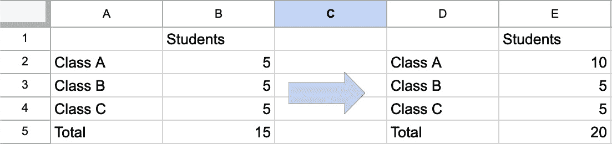
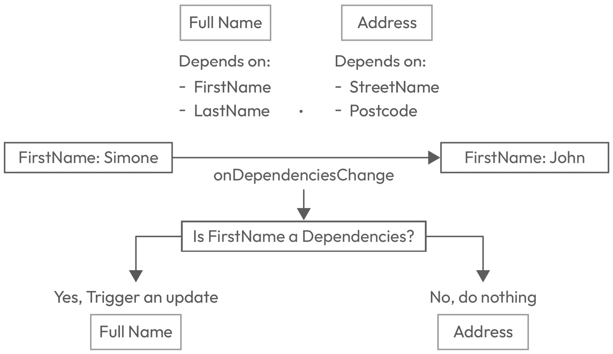
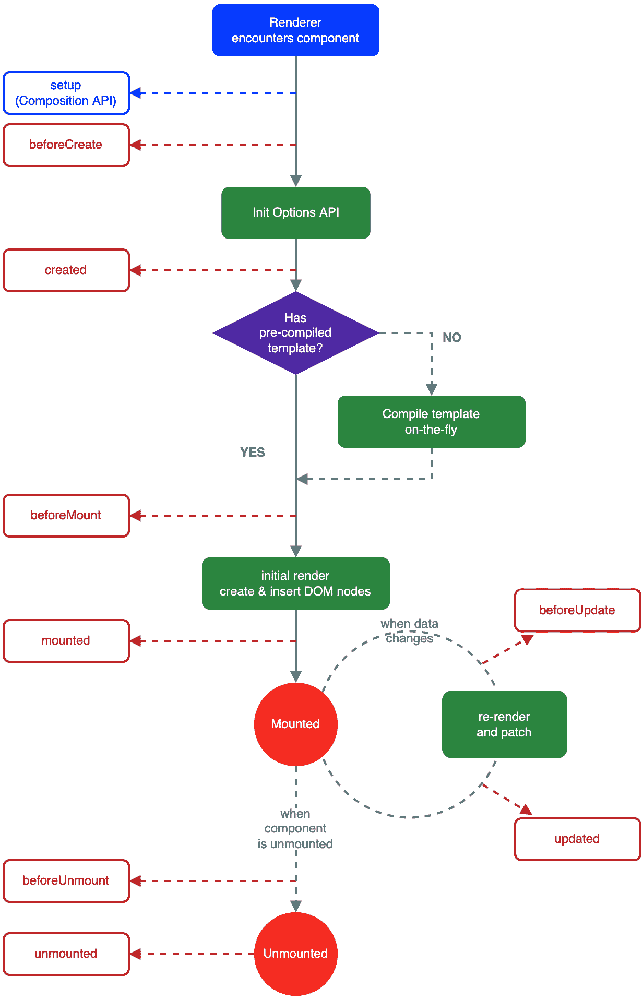
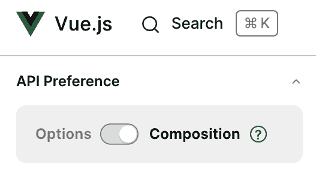
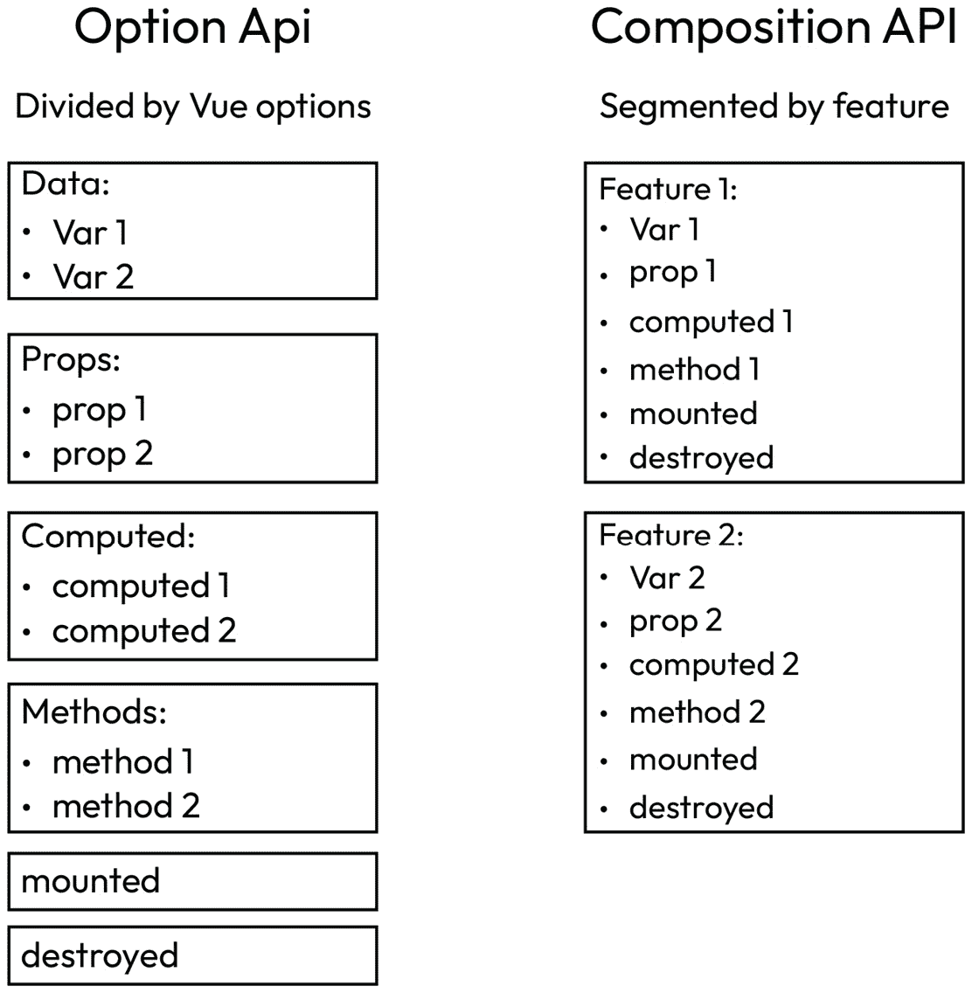

# 2

# Vue.js 的基础

如果你正在阅读这本书，那么你很可能已经决定将 Vue.js 作为你的首选框架，而且几乎没有理由试图说服你不要使用它。我们将利用这一章来开始分享 Vue.js 独特之处及其成功的原因。

我们首先将学习是什么让 Vue.js 与其他框架不同；然后我们将继续研究 Vue.js 的响应性和其生命周期。最后，我们将了解 Vue.js 的组件结构。

在本章中，我们将学习以下内容：

+   Vue.js 的响应式基础

+   理解 Vue.js 的生命周期和钩子

+   Vue.js 的组件结构

本章的目标是提供有关 Vue.js 的信息，这将成为你未来学习的基石。理解 Vue.js 的响应性将帮助你区分 Vue.js 与其他前端框架和库，你将学习 Vue.js 组件的完整生命周期，以帮助你做出正确的技术决策。最后，了解定义 Vue.js 组件的不同方式将为你准备接下来的章节。

# Vue.js 的响应式基础

Vue.js 已经存在一段时间了；该框架的第一个版本可以追溯到 2014 年，当时其创造者、前谷歌开发者 Evang You 通知了全世界其创建的消息。

埃文在谷歌的 Angular 经验为他构建一个优秀的框架提供了必要的知识。在框架公开后不久，埃文在接受 *Between the Wires* 采访时说了以下内容：

我想，如果我能提取我真正喜欢 Angular 的部分并构建一个真正轻量级的框架会怎样。

埃文不仅创建了一个轻量级的框架，而且还成功构建了一个围绕它的令人惊叹的社区，使其成为开发者最喜爱的框架之一。

到目前为止，Vue.js 只发布了三个主要版本，最新的一个版本是完全重写，使 Vue.js 更快、更小，甚至更容易使用。

两个主要方面使 Vue.js 非常成功。第一个方面是它的增长和采用是由社区为社区所驱动的。Vue.js 是少数几个没有大公司支持的顶级框架之一。它完全由对核心团队的捐赠者资助，其发展主要是由社区推动的。这从 Vue.js 生态系统内始终存在的关注开发体验中可以看出。

第二个使其独特的方面是其响应式系统。Vue.js 的核心引擎被构建为在幕后具有响应性，这使得使用 Vue.js 处理状态变得简单直观。

当我们谈论开发中的响应式时，我们指的是某些变量在发生变化时自动更新的能力。一个简单的响应式例子是 Excel 和 Google Sheets，设置一个计算，比如一列的总和，会导致总和“响应”任何在求和单元格中发生的变化：



图 2.1：Google 表格示例，展示单元格值如何自动更新

与 Excel 类似，在 Web 开发中，尤其是在 Vue.js 中，响应式允许你的变量在依赖的值发生变化时动态更新。

让我们通过一个真实示例来了解响应式在 UI 框架中扮演的重要角色。让我们先看看纯 JavaScript 的行为，然后看看这如何转化为 Vue.js。

在下面的代码中，我们将创建两个变量`firstName`和`lastName`，然后我们将尝试创建一个名为`fullName`的响应式变量：

```js
let firstName = "Simone";
let secondName = "Cuomo";
const fullName = `${firstName} ${secondname}`;
console.log(fullName);
// output: Simone Cuomo
```

在前述代码片段中，控制台打印的全名等于我们创建的`firstName`和`secondName`变量。如果我们现在将`firstName`变量更改为不同的值，会发生什么？`fullName`的值会是什么？

```js
let firstName = "Simone";
let secondName = "Cuomo";
const fullName = `${firstName} ${secondname}`;
console.log(fullName);
// output: Simone Cuomo
firstName = "John";
Console.log(fullName);
// output: Simone Cuomo
```

如前述代码所示，本应打印全名的变量输出了错误值，因为它没有对`firstName`变量的变化做出“响应”。

这种行为是完全可以理解的；你不想在 JavaScript 中让所有变量都自动响应，因为这会使它的使用变得复杂，但当涉及到 UI 时，有更新的值是预期的行为。

例如，假设你正在装满一个篮子，并且当你向篮子里再放一个物品时，你希望物品的总数发生变化，或者当你在一个受限的文本框中输入时，你希望字数统计更新，等等。

让我们使用 Vue.js 复制前述示例：

```js
let firstName = ref("Simone");
let secondName = ref("Cuomo");
const fullName = computed( () => `${firstName.value} ${secondName.value}`);
console.log(fullName);
// output: Simone Cuomo
firstName.value = "John";
Console.log(fullName);
// output: John Cuomo
```

在这个阶段，你对 Vue.js 的理解仍然局限于你在阅读这本书之前的经验，所以你还不期望理解前述代码。我们需要关注的是代码产生的输出与纯 JavaScript 产生的输出之间的比较。

如前述代码所示，`fullName`变量在其依赖变量（`firstName`和`secondName`）发生变化时，会自动更新。

理解响应式系统背后的工作原理超出了本书的范围，但这并不妨碍我们理解幕后发生的细节。

下面的图解展示了幕后发生的事情以及响应式实际上是如何发生的：



图 2.2：解释 Vue.js 响应式系统的图解

这幅插图是 Vue.js 响应性核心系统中发生的事情的简化版本，以使我们的变量动态化。让我们分析一下正在发生的事情：

1.  我们定义了响应式变量，例如 `FirstName`。Vue.js 会监视这个变量的任何变更事件。

1.  我们声明了一个依赖于其他响应式变量的复杂变量（例如，`fullName`）。

1.  Vue.js 跟踪一个依赖树。它创建了一个列表，列出了什么依赖于什么。

1.  当一个响应式变量发生变化时，响应性引擎将触发 `onDependenciesChange`。

1.  Vue.js 评估哪些值依赖于刚刚更改的值，并且只有在该值是它们的依赖项之一时才会触发更新。

在阅读前面的过程时，您可能认为这听起来很熟悉，您是对的，因为响应性系统遵循与 HTML 元素（如输入字段）提供的相同原则。例如 `<input>`、`<select>` 以及许多其他元素都有能力持有值，并在它们被更改时通过触发 `onChange` 或类似事件来做出响应。

如前例所示，监听一个变更事件来处理数据响应性并不是什么独特的事情。那么，是什么让 Vue.js 的响应性系统变得特别？Vue.js 的响应性在处理依赖树和自动更新后台变量方面脱颖而出。Vue.js 的响应性系统是非侵入性的，并且对开发者来说完全不可见。Vue.js 在其 **生命周期** 中管理所有后台依赖，并以高速和高性能对变化做出反应。

本节向您介绍了 Vue.js 的响应性系统，解释了它在框架成功中扮演的重要角色。然后，我们通过一些示例解释了后台引擎的工作原理。现在，我们需要通过更仔细地查看其生命周期并了解它们如何在我们的应用程序开发中使用来理解 Vue.js 核心引擎的工作方式。

# 理解 Vue.js 的生命周期和钩子

随着我们深入本书，我们对 Vue.js 的了解不断扩展。在本节中，我们将讨论 Vue.js 的生命周期。

当我们使用 Vue.js 时，应用程序会经过一系列定义的步骤，从创建组件 HTML 到收集所有动态值，以及将这些值显示在 DOM 中。这些都是我们所说的 **生命周期** 的一部分，在本节中，我们将定义它们所有，并学习在开发生涯中何时以及如何使用它们。

如果您以前尝试学习过 Vue.js，您可能已经接触到了以下图表，该图表可在 Vue.js 的主要文档中找到：



图 2.3：Vue.js 生命周期图（来自 www.vuejs.org）

无论你使用 Vue.js 有多长时间，前面的图表都会反复出现在你的浏览器历史记录中，并且它会慢慢地印在你的记忆中，因为它是 Vue.js 的基础，并且为了编写干净和高效的代码，这是必须了解的。

随着你在这本书的学习过程中不断进步，你将被要求回顾生命周期的不同部分，并且你将被要求回顾这个图表。

在下一节中，我们将逐步回顾这个图表，并理解它的含义以及如何在开发过程中应用这些知识。

我们将从顶部开始解释，但我们将从**beforeCreate**开始。我们故意将**setup**留到后面，因为介绍完所有生命周期后，它更容易理解，即使它是列表的第一部分。

以下的生命周期是逐步的；这意味着其中一个生命周期的结束状态是下一个生命周期的开始。

### beforeCreate

这个生命周期在组件初始化时创建。在这个阶段，我们的组件根本不存在。Vue.js 框架刚刚被指示创建它，并且正在触发这个钩子来通知我们组件正在创建中。

在这个阶段，组件没有任何可用内容，没有创建 HTML，也没有设置任何内部变量。

通常，这个生命周期用于触发分析日志或长时间异步任务。

### created

在这个阶段，Vue.js 已经知道你的组件，并且已经加载了其 JavaScript 逻辑，但它还没有渲染或挂载任何 HTML。

这正是触发异步调用以收集数据的完美阶段。现在触发一个慢速请求将帮助我们节省一些时间，因为这个请求将在我们的组件渲染的同时在幕后继续进行。

### beforeMount

这个生命周期在 HTML 被附加到 DOM 之前触发。这个生命周期的用例非常有限，因为大多数预渲染操作都是在**created**生命周期中触发的。

### mounted

在这个阶段，组件已经被完全渲染，其 HTML 已经被附加到 DOM 上。如果你需要执行任何需要访问 DOM 的操作，这就是正确的生命周期，因为 HTML 已经准备好被读取和修改。

如果你来自非框架背景，你可能认为你组件的大部分逻辑可能都包含在这个生命周期中，但你很快就会学到，由于 Vue.js 组件的指定方式，你很少需要访问 DOM。

### beforeUpdate 和 update

**beforeUpdate**和**update**形成一个递归循环，每当组件数据或依赖发生变化时都会发生。我们已经在上一节中介绍了这一步骤，当时我们讨论了响应式系统。

**beforeUpdate**在 Vue.js 意识到组件依赖的响应式值发生变化时触发。

另一方面，**update** 在值完全改变并被分配到正确的 DOM 节点并准备就绪时触发。

你很少需要直接使用这两个生命周期，因为 Vue.js 提供了其他功能，例如计算属性和观察者，以便能够处理组件数据中的单个更改。

### beforeUnmount 和 unmount

在这个阶段，我们的组件不再需要，Vue.js 准备将其从 DOM 中移除。这可能是由于用户导航到不同的页面或任何其他需要从 UI 中移除组件的事件。

**beforeUnmount** 和 **unmount** 在使用上几乎没有区别。这个生命周期对于取消订阅事件非常有用，例如“点击”和“观察者”，如果保持激活状态，可能会导致性能下降。

### setup

正如本节开头所承诺的，我们将 **setup** 放在最后，因为所有生命周期都被介绍之后，它更容易解释。**setup** 本身不是一个生命周期，但它是由 CompositionAPI（你将在本章稍后了解一些）使用的入口点。当使用 **setup** 时，你可以调用和访问所有生命周期（**mounted**、**updated**、**unmounted** 等）。你可以将 **setup** 视为 Vue.js 生命周期的包装器，一个包含所有生命周期钩子（hooks）的单个方法。Composition API 将是我们在这本书中使用的，我们将在稍后的阶段更详细地解释 **setup** 函数。

在本节中，我们学习了 Vue.js 的基本流程，介绍了所有其生命周期。在这个阶段，我们应该知道 Vue.js 组件何时渲染、更新或销毁。这些知识将推动我们的开发，并允许我们做出正确的选择，使我们的应用程序性能更优。在下一节中，我们将看到如何引入 Vue.js 组件语法，我们还将学习如何利用前面的生命周期。

# Vue.js 组件结构

组件是 Vue.js 框架的基础。它们是使用此框架创建应用程序所需的构建块。正如之前所解释的，组件可以小到简单的按钮，也可以大到整个页面。

无论大小如何，所有组件都使用相同的语法和结构构建。在本节中，我们将学习编写组件的不同语法形式，并了解构成 Vue.js **单文件** **组件**（**SFC**）的不同部分。

## 单文件组件

SFCs 是 Vue.js 特有的，可以在具有 `.vue` 扩展名的 Vue.js 项目中找到。这些文件由三个主要部分组成：**template**、**script** 和 **style**：

```js
<template></template>
<script></script>
<style></style>
```

Vue.js 编译器在构建时将前面的三个部分拆分成单独的块。我们现在将在这个部分中解释每个部分。我们将按照以下顺序介绍 SFC 部分：

1.  模板

1.  样式

1.  脚本

### `<template>`标签

第一个部分是`<template>`。这个部分包括我们组件托管 HTML。所以，如果我们以一个极其简单的按钮为例，模板将看起来像这样：

```js
<template>
    <button>My button</button>
</template>
```

与 React 不同，Vue.js 组件的 HTML 是纯**HTML**，而不是**JSX**。正如我们在本书的学习过程中将要了解到的，Vue.js 提供了一些实用的工具来简化我们的 HTML 内容。

重要提示

至于模板编写样式，可以使用不同的方法来编写 HTML，例如使用渲染函数，或者通过在 JSX（使用正确的加载器）中编写它，但这些两种方法仅适用于特定用途，并且不期望在 Vue.js 生态系统中使用。

### `<style>`标签

下一个可用的部分是`<style>`。这个部分将包括与我们的组件相关的样式，使用组件中的普通`<style>`标签不会将样式**作用域化**到特定的组件。

在我们继续之前，让我们解释一下样式作用域的实际含义以及如何在我们的 Vue.js 应用中实现这一点。

当我们使用简单的`<style>`标签，如前例所示，我们的样式将泄漏到应用的其余部分。除非我们使用 CSS 进行作用域化，否则我们在标签中声明的任何内容都将全局有效：

```js
<style>
p {
  color: red;
}
</style>
```

在 Vue.js 中编写前面的样式是允许的，并且出于性能和可维护性的原因甚至被建议。问题是前面的声明将改变整个应用中段落的颜色为红色，而不仅仅是它被编写的组件中的颜色。

幸运的是，Vue.js 有一个实用的工具可以在我们希望我们的组件完全作用域化时使用，确保没有样式泄漏并破坏应用的其余部分。要做到这一点，我们需要在我们的`<style>`标签中添加一个名为`scoped`的属性：

```js
<style scoped>
p {
  color: red;
}
</style>
```

使用这个新属性，我们的样式将被锁定到定义它们的组件中，并且不会影响应用的其余部分。我们将学习在构建我们的伴侣应用时何时最好使用这两种方法。

### `<script>`标签

在 SFC 中可用的下一个部分是`<script>`标签。这个标签将包含组件的 JavaScript 逻辑，从组件接受的属性到用于定义组件逻辑的私有数据，再到组件正常工作所需的实际方法。

只是在几年前，当 Vue.js 的主要版本仍然是 2 时，组件大多使用一种称为**选项 API**的语法来定义。尽管有其他方法可用，但这仍然是编写 Vue.js 组件的主要方式。

随着 Vue.js 3 的发布，创建组件的新方法被引入。这种方法与现有的选项 API 并存，并提供了更好的 TypeScript 支持，改进了逻辑复用的技术，以及灵活的代码组织。这种方法被称为**组合 API**。

重要提示

组合 API 也被称为**脚本设置**。

在当前这个时间点，两种方法都没有被官方明确地推荐为优于另一种；这一点也被 Vue.js 官方文档所强调，它目前展示了所有使用这两种方法的教程和示例，并提供了在方法之间切换的选项：




本书及其配套应用的内容将使用 Composition API 编写。这个决定基于两个主要原因：

+   由于 Vue.js 2 的历史原因，网络上充斥着专注于 Options API 的资源，而对新的 Composition API 语法的关注较少

+   Evan You（Vue.js 的创造者）已经（不止一次）预测，从长远来看，Composition API 将接管并成为标准

因为我是坚信额外知识无害的强烈支持者，所以在本节中，我们将学习如何使用两种语法定义组件，包括 Options API。了解这两种方法可以帮助你建立一个强大的基础，以支持你对 Vue.js 框架的学习。

## Options API 与 Composition API——同一枚硬币的两面

在底层，这两种方法实际上会产生非常相似的结果，Composition API 生成的代码性能略高。尽管如此，这些方法带来的语法差异和好处是相当不同的，并且会根据你的习惯产生重大变化。

Composition API 与 Options API 之间的第一个和主要区别在于代码中`<script>`部分的分解方式。正如我之前提到的，这两种语法将提供相同的功能，这意味着我们可以声明 props 数据、计算和函数，以及访问两种方法中的所有生命周期，但我们实现的方式不同。

差异如下：

+   **Composition API**：按功能分解的代码

+   **Options API**：按 Vue.js 选项分解的代码

让我们通过一个例子来清楚地定义这两种方法之间的差异。




如前图所示，在 Options API 中，代码并没有考虑实际的组件需求和逻辑，而是通过 Vue.js 选项：**Props**、**Data**、**Methods**、**Computed**、**mounted**等垂直切割。

另一方面，Composition API 通过按组件的技术输出分解组件，采取不同的方法。这允许我们为功能 1 创建一个部分，为功能 2 创建一个部分，依此类推。

第二个区别与 TypeScript 支持有关。这是 Vue.js 核心团队决定在 Vue.js 3 重写期间创建组合 API 的主要原因。Options API 提供了非常基本的 TypeScript 支持，这阻止了许多开发者加入 Vue.js 生态系统。

我们已经到达了这个部分的结尾，现在是时候清楚地说明哪种方法更好了，但不幸的是，答案是这取决于。

由于两种语法糖都在相同的代码中编译，所以这个决定实际上回到了编码偏好。Options API 提供了更多的结构，因此在你创建组件的经验仍然有限时，它可以在你的职业生涯初期提供更多帮助，而组合 API，由于增加了 TypeScript 支持和代码分区更大的灵活性，可以成为提高大型应用程序代码可读性的强大工具。

## 样本组件

在这个阶段，我们已经对 Vue.js 的基础知识有了足够的了解，可以准备介绍一些样本组件并看到框架的实际应用。

我们将查看一个原子的例子。在我们的情况下，它是一个简单的图标组件。这个样本组件将展示以下功能：

+   它将接受几个属性（`size`和`name`）

+   它将包含一些样式

+   它将动态加载图标

该组件将使用以下 HTML 调用：

```js
<vfb-icon name="clog" size="small" @click="doSomething />
```

如前所述，在这个部分，我将展示使用两种编写方法的组件；然而，在本书的后面，我们只会使用脚本设置（组合 API）编写组件。

重要提示

请注意，我们将在本书的后面更详细地介绍所有这些内容。这只是一个对 Vue.js 组件的快速介绍。

### 使用 Options API 的原子组件

让我们先看看这个组件作为 Vue.js 组件使用 Options API 时的样子：

```js
<template>
  
</template>
<script>
  export default {
    name: 'vfb-icon',
    props: {
      size: String,
      name: String
    },
    computed: {
      iconPath() {
        return `/assets/${this.name}.svg`;
      },
      sizeClass() {
        return `${this.size}-icon`
      }
    }
};
</script>
<style scoped>
.small-icon {
    width: 16px;
    height: 16px;
}
.medium-icon {
  width: 32px;
  height: 32px;
}
.large-icon {
  width: 48px;
  height: 48px;
}
</style>
```

现在我们来分解所有部分，从`<template>`开始，它包含我们组件的 HTML；在这种情况下，这是一个原生的``元素。这个组件有几个属性传递给它。前两个是原生属性：`src`和`class`：

```js
:src="img/iconPath"
:class="sizeClass"
```

这些属性与你在 HTML 中习惯的声明方式略有不同，因为它们前面有一个`:`。当一个属性有这种语法时，这意味着它的值是动态的，并且值（在我们的情况下，`iconPath`和`sizeClass`）将被评估为 JavaScript 变量，而不是实际的字符串。

重要提示

请注意，你可以在 Vue.js 中编写纯 HTML，使用动态变量不是框架的要求，而只是一个特性，使属性动态化。

接下来，让我们转向应用程序的逻辑部分，即`<script>`部分。在这里，我们首先声明我们组件的名称：

```js
name: 'vfb-icon',
```

重要提示

对于所有 Vue.js 组件来说，由两个单词组成是一个好的实践。这将确保组件不会与原生 HTML 元素冲突。

接下来，是时候声明属性了。属性是在组件初始化时被组件接受的值。这在开发中是一个现有概念，因为所有 HTML 元素都接受诸如`class`、`id`和`value`之类的属性。这些属性使我们的组件可重用且灵活。在我们的例子中，我们声明了两个不同的属性：`name`和`size`。这些属性在组件被调用时会被传递下去，就像它们是原生的 HTML 属性一样：

```js
props: {
  size: String,
  name: String
},
```

这个例子展示了一个属性的简单配置，我们只是定义了它的类型，但正如我们将在本书的后续内容中看到的，`props`可以有不同的配置，例如验证、默认值和需求规则，以确定它们是否是必需的。

下一段代码是我们声明动态属性的地方。为了我们的组件能够正确运行，我们需要定义一个路径和一个类，分别命名为`iconPath`和`sizeClass`。这些值将是动态的，因为它们包含了动态属性，并且将使用所谓的计算属性来声明：

```js
computed: {
  iconPath() { return `/assets/${this.name}.svg`; },
  sizeClass() { return `${this.size}-icon` }
},
```

计算属性允许我们声明响应式值（记得书中的响应式章节），并且可以利用我们组件的全部逻辑；在这种情况下，我们只使用了 props，但我们可以使用一系列值和外部逻辑来创建一个新的值。

重要提示

请注意，当使用 Options API 时，你必须使用`this`关键字来访问组件内的变量，例如`props`和`computed`。在我们的例子中，我们使用它通过`this.name`和`this.size`来访问属性。

我们最后一个部分是`<style>`：

```js
<style scoped>
  .small-icon {
    width: 16px;
    height: 16px;
  }
  .medium-icon {
    width: 32px;
    height: 32px;
  }
  .large-icon {
    width: 48px;
    height: 48px;
  }
</style>
```

这相当简单，因为这个例子没有包含比在纯 CSS 中通常看到的任何不同之处。正如前一章中提到的，我们可以添加作用域为我们的样式的属性，以确保它们的样式不会从我们的组件中溢出。

在前面的例子中，你可以看到（在实践中）Options API 是如何将我们的组件划分为各个部分的。在我们的例子中，我们有`props`、`name`、`computed`和`methods`：

```js
export default {
  name: '',
  props: {},
  computed: { },
  methods: { }
}
```

### 使用 Script Setup 的 Atom 组件

现在是时候看看使用`<script setup>`语法编写的相同组件了：

```js
<template>...</template>
<script setup>
  import { computed } from 'vue';
  const props = defineProps({
    size: String,
    name: String
  });
  const iconPath = computed( () => {
    return `/assets/${props.name}.svg`;
  });
  const sizeClass = computed( () => {
    return `${props.size}-icon`;
  });
</script>
<style scoped>...</style>
```

如你清晰可见，前面的例子省略了`<template>`和`<style>`标签。这些标签被省略是因为它们与 Options API 的对应部分相同。事实上，正如我们之前提到的，这两种方法之间的区别仅影响组件的逻辑部分，即`<script>`。

我们组件的第一行是`import`：

```js
import { computed } from 'vue';
```

与 Options API 不同，在`<script setup>`中使用时，我们必须从`'vue'`导入每个单独的 Vue.js 方法，就像我们在之前的代码中为`computed`所做的那样。

接下来，我们将看到如何在 Composition API 中定义属性：

```js
const props = defineProps({
  size: String,
  name: String
})
```

属性是使用 `<script setup>` 时唯一几个可以具有详细声明的选项之一。实际上，为了能够声明它们，我们需要使用一个名为 `defineProps` 的编译器宏。宏不需要导入，因为它们只是将被编译器使用并在代码中删除。如果你曾经使用过 TypeScript，你将熟悉这种方法。

接下来，我们将学习 `computed`：

```js
  const iconPath = computed( () => {
    return `/assets/${props.name}.svg`;
  });
  const sizeClass = computed( () => {
    return `${props.size}-icon`;
  });
```

声明 `computed` 的属性与 Options API 非常相似，但有两个小的不同点：

+   `computed` 属性的逻辑需要作为回调传递给从 `'vue'` 导入的计算方法

+   `this` 关键字不再可用，我们可以直接访问变量

至此，我们将对 Options API 和 Composition API 之间的差异进行解释。我们将在本书的后面部分更详细地介绍 Script Setup（Composition API）。如果你对 Vue.js 非常陌生，本节可能包含了很多新的语法，理解起来可能有些困难，但一旦我们开始构建我们的伴侣应用，随着你对 Vue.js 及其语法的了解加深，事情会迅速变得更有意义。

在本节中，我们开始学习如何定义 Vue.js 组件以及构成 SFC 的不同部分。然后，我们通过详细覆盖一个示例组件来结束本节。

# 摘要

我们现在已经到达了本章的结尾，这是为了我们开始应用构建过程所必需的。在本章中，我们通过分析其响应性系统，学习了 Vue.js 与其他框架的不同之处。然后，我们分解了 Vue.js SFC 的组成，也称为 `.vue` 文件，并通过分析框架中所有不同的生命周期钩子，走过了 Vue.js 组件的生命周期。

在本章的中间部分，我们通过使用示例组件来探索它们，学习了 Composition API 和 Options API 之间的主要差异。

在下一章中，我们将通过开始构建我们的伴侣应用（Companion App）来学习 Vue.js。这将是你从一名完全的初学者成长为一名经验丰富的 Vue.js 开发者的漫长旅程的开始。

# 第二部分：理解 Vue.js 的核心功能

本书第二部分专注于 Vue.js 及其核心功能。我们将一步一步地构建伴侣应用的核心，同时继续扩展我们对 Vue.js 框架的了解。

本部分包含以下章节：

+   *第三章**，使我们的 HTML 动态化*

+   *第四章**，利用 Vue 内置指令实现轻松开发*

+   *第五章**，在 Vue.js 中利用计算属性和方法*

+   *第六章**，Vue.js 中的事件和数据处理*

+   *第七章**,* 使用 Vue.js 处理 API 数据和异步组件管理
