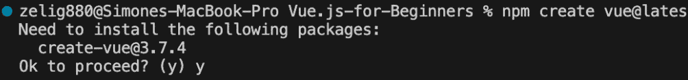
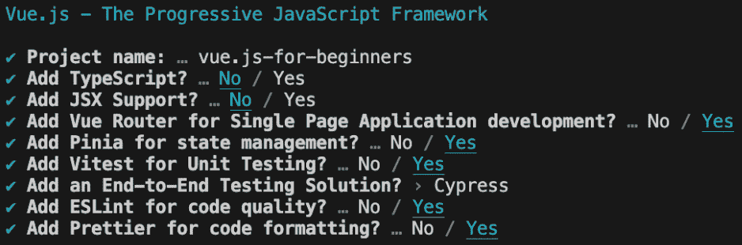
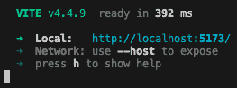
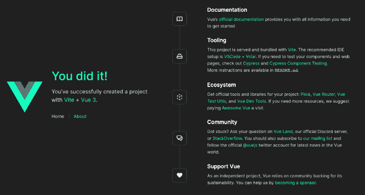
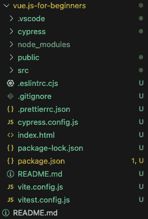
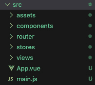
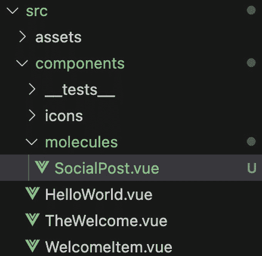
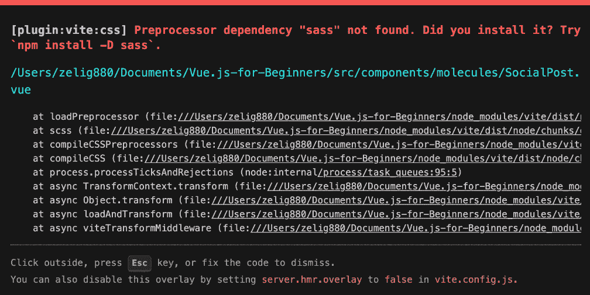
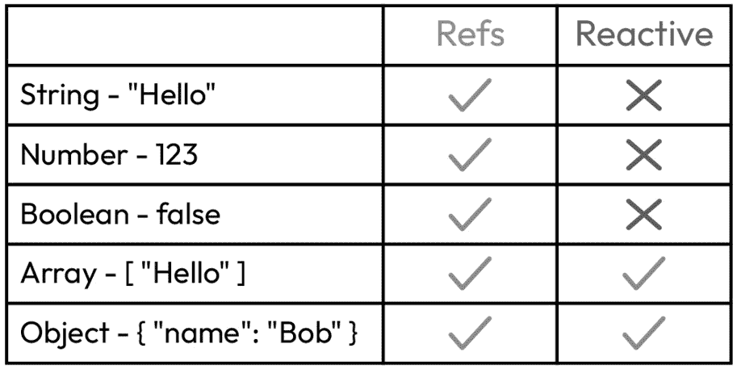
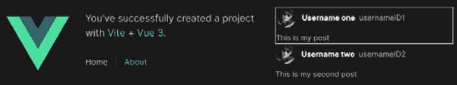

# 第三章：使我们的 HTML 动态化

理论章节现已结束。是时候开始构建我们的伴侣应用程序并学习 Vue.js 了。随着我们一步一步地构建应用程序，我们也将学习 Vue.js。这种通过实践学习的方法，当你跟随并与我一起构建应用程序时，效果最为显著。

为了帮助您掌握复杂主题并确保您已经掌握了 Vue.js 的基础知识，您还将被要求完成一些额外任务，这些任务可以应用于伴侣应用程序或作为独立项目使用。

在本章中，我们将涵盖以下主题：

+   构建你的第一个 Vue 项目

+   创建我们的第一个组件

+   介绍属性

+   了解 Vue.js 的 Refs 和响应式数据

本章的目标是向您介绍 Vue.js 的基础知识。您将学习如何从头创建项目，以了解 Vue 组件的结构。在本章结束时，您将能够创建 Vue 组件，使用 props 定义属性，并使用 Refs 和响应式处理私有状态。

# 技术要求

从现在开始，所有章节都将要求您从我们的仓库中检出特定版本的代码。我们是在*第一章*中安装我们的仓库，当时我们下载了应用程序并首次运行它。

使用相同的仓库，该仓库可在 [`github.com/PacktPublishing/Vue.js-3-for-Beginners`](https://github.com/PacktPublishing/Vue.js-3-for-Beginners) 找到，我们可以使用各种分支在章节之间跳转。每个章节都有一个单独的分支，确保我们的起点一致，防止可能出现的问题或缺失的部分，这会使学习变得复杂。

在本章中，分支被命名为 CH03。要检出此分支，请运行以下命令或使用您选择的 GUI 来支持此操作：

```js
git switch CH03.
```

请记住，在切换分支后运行应用程序之前，您必须确保所有依赖项都已安装并运行开发服务器。这可以通过以下两个命令实现：

```js
npm install
npm run dev
```

请注意，我们不需要仓库，直到到达 *创建我们的第一个* *组件* 部分。

# 构建你的第一个 Vue.js 项目

是时候开始构建我们的伴侣应用程序了。如果您已经熟悉 Vue.js 以及如何使用它创建新项目，您可以跳过本节，从我们的仓库中拉取代码，并在下一章开始构建应用程序。

当我们使用 `vue create` 命令创建新项目时，我们将很快看到，我们使用的是 Vite 构建工具。直到最近，最好的构建工具是 Webpack，包括 Vue 2 在内的所有框架都使用它来构建他们的应用程序。但现在情况已经改变，Vite 由于其无配置方法和极快的开发服务器而接管了市场。

在其官方网站上，Vite 被描述如下：

“Vite（法语中意为“快速”，发音为/vit/，类似于“veet”）是一个旨在为现代网页提供更快、更精简的开发体验的构建工具”

Vite 是由 Evan You（是的，Vue 的作者）创建的，旨在改善开发体验。Vite 仅仅存在了几年，但由于其低配置和快速的开发服务器，它已经迅速获得了人气。

与 Vue.js 一样，Vite 是完全开源的，并且它也支持所有主流框架。使用 Vite 创建项目相当简单，你只需要一个 IDE 和一个终端。

Vue CLI 图形界面

你可能听说过 Vue CLI 提供了一个可视化工具，帮助你管理 Vue 应用程序。不幸的是，该项目与 Webpack 相关，并且尚未导入 Vue 3 和 Vite。

### 创建 Vue 命令

由于无法在现有文件夹中创建项目，我们无法重用之前下载的应用程序。我们将在这个不同的文件夹中完成这一步，以确保你能够从头开始创建项目。在下一章中，我们将直接从配套应用程序仓库中拉取代码。

要使用 Vue 创建新项目，我们首先需要访问项目将要创建的文件夹。请放心，CLI 将为你的项目创建一个新的文件夹，所以你现在不需要手动创建文件夹，只需访问项目应该存在的父文件夹即可。例如，我喜欢在我的“文档”文件夹中创建所有项目，所以我将这样访问它：

```js
// Mac users
cd ~/Documents/
// Windows users
cd %USERPROFILE%/documents
```

现在我们已经处于正确的文件夹中，我们可以调用创建新 Vite 项目所需的终端命令：

```js
npm create vue@latest
```

执行前面的命令将生成一个安装 create-vue 包的请求：



图 3.1：由 create vue 命令触发的安装信息

要成功安装项目，我们需要按 *y* 并继续安装。

几秒钟后，CLI 将启动并询问一些问题，这些问题将帮助它根据我们的需求搭建项目：



图 3.2：Vue CLI 的问题

如你所见，Vue 项目附带了一套预设，有助于为你的下一个 Vue 项目打下坚实的基础。Vue CLI 提供了以下设置的选项：

+   **项目名称**

+   **TypeScript**

+   **JSX 支持**

+   **路由**

+   **状态管理**

+   **单元测试**

+   **结束** **单元测试**

+   **代码质量**

+   **代码格式化**

这些设置的选项完全取决于你，你应该遵循你个人的需求和要求。你在 *图 3.2* 中看到的设置是我用来创建下一章我们将使用的配套应用程序的设置。

在按下 *Enter* 并等待几秒钟后，我们应该会得到一些有关如何运行我们的项目的信息。这需要我们访问文件夹，安装所需的包，并运行开发服务器。

首先，让我们导航到作为我们的 Vue 项目初始化一部分创建的文件夹，即等于你的项目名称：

```js
cd "vue-for-beginners"
```

然后，安装项目运行所需的所有包。在这个例子中，我使用了 npm，但你也可以使用 Yarn 或 PNPM：

```js
npm install
```

最后，我们只需运行这个命令来运行开发服务器：

```js
npm run dev
```

在执行这两个命令后，不到一秒钟你应该会在你的控制台中看到以下消息：



图 3.3：Vue 开发环境成功运行时的 Vite 输出

Vite 项目与之前在 3000 端口运行的 Webpack 项目表现不同，它们运行在 5173 端口上。本地 URL 将在控制台中显示，如图 *图 3.3* 所示。

在我们的情况下，访问 `localhost:5173` 上的浏览器将显示以下网站：



图 3.4：新构建的 Vue 项目的欢迎页面

恭喜你创建了你的第一个 Vue 项目。这将是你众多项目中的第一个。

### Vue 项目文件夹结构

在本节中，我们将快速介绍新 Vue 项目的结构。

当创建一个新项目时，它自带一个定义良好的结构，可以作为未来开发的坚实基础：



图 3.5：新创建的 Vue 项目的文件夹结构

我们将解释不同的文件夹和文件，帮助你从你的新 Vue 项目中找到所需的一切。我们将按无特定顺序进行。

### 根目录

Vue 项目的根目录包含一些配置文件。这些文件是由 Vue 创建包预设和预生成的，并且为了使应用程序顺利运行，不需要进一步的关注。在本书的进程和你的职业生涯中，你将逐渐接触到这些配置文件的每一个，并了解它们的各种选项。

### 不可触碰区域

有几个文件夹，如 `.vscode`、`node_modules` 和 `dist`，是我所说的“不可触碰”文件夹。你可能已经熟悉这些文件夹，因为它们是由你可能已经使用的工具和软件创建和管理的，例如 Visual Studio Code、npm 或 Vite，并且不应手动修改。

### Public

在项目构建后，public 文件夹的内容将被直接复制到输出文件夹中。这个文件夹很少被开发者触及，但在需要包含在构建输出中但不是 Vue 编译部分的文件时非常有用。这个文件夹的示例文件包括 favicon 和 service worker。

### Cypress

如安装指南所示，新创建的项目附带了一个预设的 **端到端**（**E2E**）测试框架，使用您选择的工具。在我们的例子中，我选择了 Cypress，CLI 已经为我创建了一个文件夹和一个示例测试，供我使用。

### SRC

这就是您的源代码所在的地方。这是我们应用程序的主要内容，您将在日常工作中的大部分时间在这里工作。由于文件夹的重要性，我们将查看其内容并确保我们知道其文件的结构：



图 3.6：新创建的 Vue 项目的 SRC 文件夹内容

如前所述，让我们从文件夹的根目录开始。这包括两个文件，`main.js` 和 `App.vue`。`Main.js` 是我们应用程序的入口文件。此文件用于向我们的 Vue 实例添加新包，并加载和设置全局插件、组合式（利用 Vue 的组合式 API 封装和重用我们在本书后面将要介绍的有状态逻辑的函数）和组件。接下来，我们有 `App.vue`。这是第一个 Vue 入口点，是负责加载和处理 Vue 应用程序其余部分的组件。

接下来，我们有 `assets` 文件夹。此文件夹用于加载任何资产，例如图片、PDF 和视频。此文件夹的内容也会复制到我们的构建输出工件中。

在列表的下方，我们有 `components` 文件夹。此文件夹不仅包含应用程序中已提供的组件集合，还包括 `__tests__` 文件夹，其中包含我们的单元测试。

接下来的两个文件夹是 `router` 和 `stores`。正如其名所示，它们分别包含 `vue-router` 和 `Pinia` 存储代码。这两个是 Vue.js 核心团队提供的核心包，将在 *第十章* 和 *第十一章* 中详细介绍。Vue-router 将用于为我们的客户端创建导航路由，并帮助我们管理不断增长的应用程序，而 Pinia 将用于在应用程序中创建和管理数据。

最后但同样重要的是，我们有 `views` 文件夹。如果你有时间调查这个文件夹，你会注意到它包含简单的 Vue 组件。这个文件夹的原因是为了将简单的组件单元（存储在 `components` 文件夹中的那些）与实际的路由页面分开。这种分离有助于保持代码整洁并界定应用程序的路由。

您的私人游乐场

即使我们所创建的应用程序对于本书的其余部分不是必需的，但它可能作为练习本书过程中将要涵盖的主题的游乐场而有用。

我们已经完成了 Vue 项目的解释，你现在应该具备从头创建 Vue 项目的知识。你也应该对 Vite 有一些了解，并且能够导航新创建的 Vue 项目的文件夹结构。在下一节中，我们将深入代码并开始构建我们的第一个 Vue.js 组件。

# 创建我们的第一个组件

如您从第一章中记得的，我们在其中介绍了伴随应用程序，我们计划构建一个名为 X（前身为 Twitter）的社会应用程序的克隆。为了以优雅的方式开始我们的构建之旅，我们将构建应用程序中最标志性的组件，一个帖子。


图 3.7：X.com 帖子组件的示例

在本章中，我们将学习如何在书库的不同分支之间切换。然后我们将创建我们的第一个 SFC (`Refs` 和 `Reactive`）。

### 创建 Post.vue

回到 *第一章*，我们提到我们将把组件分解成不同的层级（原子、分子、生物体等），而 `SocialPost.vue` 将成为分子层的一部分。

因此，让我们在 `component` 文件夹中创建一个名为 `molecules` 的文件夹，然后添加一个名为 `SocialPost.vue` 的文件。一旦完成这些，你的文件夹应该看起来像这样：



图 3.8：伴随应用程序的 src 文件夹的文件树

关于我们创建的新文件，有两点需要注意：

+   名称由两个单词组成。这不仅仅是为了提供更多上下文，还因为像 `post.vue` 这样的单字母组件是不被推荐的，因为它们可能与未来的原生 HTML 组件（如 `<button>` 或 `<table>`）发生冲突（例如，如果未来 HTML 版本中引入了一个名为 <post> 的新 HTML 元素，它可能会与我们的自定义组件冲突）。

+   组件名称以 PascalCase 编写，这是一种命名约定，其中变量组成的每个单词的首字母都大写。

由于我们的文件是空的，让我们打开它，并通过添加 `<template>`、`<script>` 和 `<style>` 标签来创建 Vue 组件的基本结构：

```js
<template></template>
<script setup ></script>
<style lang="scss"></style>
```

这将是我们标准的 Vue 启动模板。它定义了一个空模板，我们将在这里封装我们的 `setup` 属性，这允许我们使用组合式 API 编写 JavaScript 逻辑，以及一个 `style` 部分，在其中我们选择 **SCSS** 作为我们的预处理器。

现在，我们将定义用于显示我们的帖子所需的 HTML 和 CSS。目前这将是一个非常简单的设计；我们将在本书的后续内容中添加更多。

我们组件的第一个草稿将包括一个头部图片，用户的名称和用户 ID，以及帖子的描述。所有这些也将包括一些基本样式。让我们看看代码：

```js
<template>
<div class="SocialPost">
  <div class="header">
    
    <div class="name">Name of User</div>
    <div class="userId">@userId</div>
  </div>
  <div class="post">This is a dummy post</div>
</div>
</template>
<script setup >
</script>
<style lang="scss">
.SocialPost{
  .header {
    display: flex;
    align-items: center;
    margin-bottom: 8px;;
  }
  .avatar {
    border-radius: 50%;
    margin-right: 12px;
  }
  .name {
    font-weight: bold;
    margin-right: 8px;
    color: white;
   }
}
</style>
```

如你很可能注意到的，前面的组件没有什么特别之处。没有 `script` 标签，HTML 中没有特殊的标签，CSS 中也没有什么特殊之处，但它仍然是一个完全正常的 Vue 组件。

让我们突出这个组件的几个重要方面：

+   `<div class="SocialPost">`：将类名设置为组件名，在我们的例子中是 SocialPost，分配给组件的根元素是一个好习惯。这将帮助我们限制样式范围，而无需使用 `scoped` 属性。

+   `<style lang="scss">`：在我们的示例中，我们将使用 **SCSS**。这在这里指定了。正如你将在下一节中看到的那样，这需要在我们的 Vite 项目中进行配置。你不需要添加预处理器，但我添加了一个，以便向你展示如何添加和使用它，以防你习惯于使用预处理器编写样式。

+   `.SocialPost{`：我们可以使用附加到组件名的类来限制我们的 CSS，通过将所有样式包装在它里面。这将确保我们的样式不会渗透到其他组件中。

现在组件已经准备好了，是时候测试它了。为了做到这一点，我们需要在应用程序的某个地方加载组件。我们可以在 `TheWelcome.vue` 中加载组件。

要成功加载 Vue 自定义组件，我们需要完成两个简单的操作。首先，我们需要导入组件，其次，我们需要在 HTML 中调用它，就像它是原生组件一样。

要加载组件，我们需要像导入普通 JavaScript 文件一样导入它：

```js
<script setup>
  import SocialPost from './molecules/SocialPost.vue'
</script>
```

现在组件已经加载，我们可以在 HTML 中简单地这样使用它：

```js
<template>
  <SocialPost></SocialPost>
</template>
```

现在我们已经完全开发并加载了组件，是时候尝试它了。为了做到这一点，让我们使用 `npm run dev` 命令运行我们的应用程序。现在，访问终端中显示的本地站（`http://localhost:5173/`）。

不幸的是，浏览器输出并不是我们预期的；我们遇到了一个错误：



图 3.9：Vite 显示的错误信息

幸运的是，这个错误是预期的。正如我之前提到的，SASS 要求我们进行进一步的配置。我想向你展示如果配置错误，Vite 会如何反应。如错误信息所示，Vite 注意到我们正在使用 SASS，并且还提供了安装它的命令。所以，让我们在终端中运行这个命令：

```js
npm install –D sass
```

运行此命令并刷新浏览器后，我们的应用程序现在应该会显示我们的组件：


图 3.10：Vite 欢迎屏幕显示新创建的自定义组件

恭喜！你刚刚编写了你的第一个工作 Vue 组件。这只是一个小步骤，但庆祝每一个成就都很重要。

如您从我们刚刚创建的文件中注意到的，Vue.js 允许您编写由 HTML 和 CSS 组成的简单组件。这是使用您现有的开发知识慢慢开始使用 Vue 的好方法。

您的回合

尝试添加另一个您自己的组件，例如，以确保您已经理解了组件是如何创建和添加的。您应该尝试创建一个静态页脚为我们应用程序。

在本节中，我们学习了如何创建和加载 Vue 组件，我们解决了 Vite 的第一个问题，并学习了如何安装新插件，最后，我们通过包裹其 CSS 找到了一种新的方法来将样式范围限定到我们的组件。在下一节中，我们将通过介绍一个称为**属性**的功能来学习如何使我们的组件变得动态。

# 介绍属性

如您所注意到的，我们在上一节中创建的组件是静态的，不能在实际应用中使用，因为它总是显示相同的信息，而不是实际的帖子。

在接下来的部分，我们将向我们的组件添加一些动态功能。为了确保每个主题都能被充分理解，我们将在每个部分添加一个小功能，并确保我们在整本书的过程中有足够的时间来重复这些功能。

在本节中，我们将通过公开属性来改变我们的帖子组件的结构。属性仅仅是组件暴露的属性，允许用户自定义其行为或样式。

如果您曾经使用过 HTML，您可能已经对 Vue.js 的 props 很熟悉了。许多原生 HTML 元素都有用于修改组件的属性，例如，将 `<input>` 标签的 `Type` 属性用作改变其外观，将 `<textarea>` 标签的 `column` 和 `rows` 属性用作改变其外观，以及将 `` 标签的 `src` 属性用作定义其图像的 URL。

Vue.js 属性（通常称为 props）允许我们在组件中定义这个属性，使我们能够将我们的静态组件转变为动态和灵活的构建块。

在本节中，我们将选择我们之前创建的帖子组件，并公开一些 Vue.js 属性，以便我们可以使用不同的值多次使用它。

在重新审视我们的帖子组件后，很明显以下变量应该被更改为动态条目：

+   `Username`: Twitter 用户名

+   `UserId`: Twitter ID

+   `AvatarSrc`: 头像图片的来源

+   `Post`: 帖子的内容

### 在 Vue.js 中声明 props

我们使用 props 的第一步是在组件中声明它们。声明属性意味着定义其名称和类型。为此，我们可以使用 `defineProps` 编译器宏：

```js
<script setup >
  const props = defineProps({
    username: String,
    userId: String,
    avatarSrc: String,
    post: String
  });
</script>
```

如此所示，`defineProps` 宏接受一个包含我们属性的对象。在我们的例子中，这些都是 `String` 类型，但其他类型，如 `Number`、`Object`、`Array` 和 `Boolean`，也是接受的。

当我们声明一个属性时，我们通知组件及其用户，这个组件愿意接受这些额外的数据。

现在是时候学习如何在我们的 SFC 中访问这些属性了。

### 在 Vue.js SFC 中访问属性

属性可以在多个地方访问。它们可以直接在 HTML 中以播放字符串的形式读取，它们可以在 HTML 元素声明中使用，或者它们可以在`script`标签中作为我们组件逻辑的一部分使用。

所有这些方法都有不同的语法，但即使看起来很多，由于它与 Vue 的编写风格一致，所以将很容易记住。

首先，我们将学习如何将属性用作纯文本。这是通过使用两个大括号`{{` `props name` `}}`来完成的。将此应用于我们的模板将生成以下代码：

```js
<template>
<div class="SocialPost">
  <div class="header">
    
    <div class="name">{{ username }}</div>
    <div class="userId">{{ userId }}</div>
  </div>
  <div class="post">{{ post }}</div>
</div>
</template>
```

如您所见，`username`、`userId`和`post`的值不再是硬编码的，现在它们正在使用底层的属性。

接下来，我们将学习如何在模板中使用变量。我使用了通用的单词变量而不是属性，因为这个概念适用于所有变量，而不仅仅是属性。要在模板中使用动态值，例如作为 HTML 元素属性，我们只需要在属性前加上符号`:`。所以，在我们的场景中，图像属性`src="img/..."`将变成`:src="img/avatarSrc"`。

我们的``元素看起来像这样：

```js

```

在属性前加上`:`告诉 Vue 该值不是一个普通的字符串，而是一个实际的 JavaScript 变量。所以，在接下来的示例中，类被评估为一个字符串，但`src`的值不会是字面上的`avatarSrc`，而是与该名称关联的 JavaScript 变量。

最后，我们将学习如何在`script`标签中访问属性。这是通过使用`defineProps`的返回值来实现的。

让我们通过尝试在组件挂载时记录`username`的值来将我们刚刚学到的知识付诸实践。代码应该看起来像这样：

```js
<script setup >
import { onMounted } from 'vue';
const props = defineProps({
  username: String,
  userId: Number,
  avatarSrc: String,
  post: String
});
onMounted( () => {
  console.log(props.username);
});
</script>
```

上一段代码展示了如何使用`defineProps`来访问属性。这个函数接受一个属性对象（在我们的例子中是`username`、`userId`、`avatarSrc`和`post`），并将返回一个变量，该变量包含在组件初始化时传递的所有响应式属性（例如`<MyComponent username="simone" />`）。接下来，我们介绍了 Vue.js 的另一个新特性`onMounted`。它在第二章中作为 Vue 生命周期的一部分被引入。`OnMounted`专门在组件完全渲染到页面上时触发。

`defineProps`不能被解构

`defineProps`返回的值不能被解构。解构返回的对象会导致非响应式值。

由于我们移除了硬编码的字符串，并将组件改为使用属性，在我们能够在浏览器中测试它之前，我们需要做一步额外的工作。就像接受属性的 HTML 元素一样，我们需要在创建组件实例时定义我们的属性，在我们的例子中是在`TheWelcome.vue`中发生的。

让我们看看如何更新我们的组件以包含我们新创建的属性：

```js
<template>
  <SocialPost
    username="Username one"
    userId="usernameID1"
    avatarSrc="https://i.pravatar.cc/40"
    post="This is my post"
  ></SocialPost>
</template>
```

就像普通的 HTML 元素一样，我们能够直接将属性传递到 HTML 标签中。这里使用的属性名与组件中定义的属性名相同。它们不仅需要逐字匹配，而且还需要区分大小写。

现在我们已经完全更新了组件，我们可以通过运行 CLI 命令来启动开发服务器（`npm run dev`）并检查浏览器（`http://localhost:5173/`）来访问我们的应用程序。

我们的应用程序应该看起来与组件的前一个版本没有区别。实际上，我们大部分的工作是改变组件在幕后如何表现，而不是它的外观。本节包含了多个主题和 Vue 特性。让我们回顾一下到目前为止我们学到了什么：

+   如何声明 props

+   如何使用 props

+   如何将 props 用作普通字符串

+   如何将 props 用作 HTML 属性

+   如何在 script 标签中使用 props

+   如何使用我们的第一个 Vue 生命周期，`onMounted`

记住，Vue.js 中的属性就像 HTML 属性一样。它们允许你通过暴露可以以任何形式使用的值来使组件动态化，从而使组件具有独特性。这些属性可以在组件的多个部分中访问。

在下一节中，我们将学习如何创建一个或多个组件实例，并介绍一个新概念：响应式数据。

你的回合

继续扩展你在第一部分创建的页脚组件，但使用 props 将值改为动态的。

# 使用 Refs 和响应式学习 Vue.js 的响应式数据

在上一节中，我们开始使我们的组件动态化，但这只是使组件完全可重用的两个步骤中的第一个。现在是时候学习组件状态了，也称为数据（在 Option API 中使用术语）或 Refs 和响应式（在组合 API 中使用术语）。能够设置私有组件信息，以及定义组件属性的能力，将是我们构建动态和灵活组件的工具集。

在我们跳入数据之前，我们需要回到上一节，看看我们刚刚创建的组件。如果你仔细看，`SocialPost.vue`的版本看起来很相似，并且似乎硬编码版本和动态版本之间没有实际的区别。

那么，为什么我们费尽心机做出所有这些改变，而实际上没有什么改变呢？嗯，改变是存在的，我们只是还没有使用它。

让我们稍微思考一下我们的伴侣应用，并尝试理解`SocialPost`组件将如何被使用。当使用真实的社交平台时，我们永远不会期望屏幕上只有一个硬编码的帖子；我们的时间线最终将显示大量动态帖子。在我们组件的第一个版本中，即包含硬编码值的版本，多次创建组件只会导致相同的作者和标题反复显示。但有了我们创建的动态版本，我们有传递不同值给 props 的机会，从而允许我们创建多个独特的帖子。让我们通过创建第二个帖子来看看这将在实践中看起来如何：

```js
<SocialPost
  username="Username one"
  userId="usernameID1"
  avatarSrc="https://i.pravatar.cc/40"
  post="This is my post"
></SocialPost>
<SocialPost
  username="Username two"
  userId="usernameID2"
  avatarSrc="https://i.pravatar.cc/40"
  post="This is my second post"
></SocialPost>
```

创建动态组件是 Web 开发中的一个非常强大的工具。它允许我们重用相同的组件并简化我们的开发工作。即使使组件动态化比我们最初的硬编码示例前进了一步，但它仍然需要一些改进。是时候学习响应式数据以及它如何帮助我们简化组件的 HTML 了。

将逻辑与 HTML 分离

一个干净的组件是指其大部分逻辑都封装在`<script>`标签内，并且具有非常干净的 HTML。虽然将一些逻辑添加到 HTML 中可能很有吸引力，但这会导致组件难以维护。

将 Refs 或 Reactive 添加到我们的组件中，使我们能够从 SFC 的`<template>`部分中移除静态数据，并使我们的代码具有一些动态性。

Refs 和 Reactive 的定义可以是一组原始数据、对象和数组，这些数据由组件实例使用来定义私有响应式数据（状态）。”

这个概念并不新鲜。事实上，原生的 HTML 组件也持有它们自己的状态。例如，视频组件可能持有开始或停止的状态，而下拉菜单可能持有其选中的值或展开或折叠的内部状态。

在 Vue.js 和其他主要框架中，响应式数据不仅用于声明状态（例如，保持侧边栏的当前状态为打开或关闭），还用于存储组件内部使用的组件数据，以提供特定功能。

在我们的案例中，我们将使用私有数据尝试将单个帖子的信息移动到数组中。这将允许我们在未来的章节中使用外部工具，如 API，来动态获取这些数据。

在我们深入实际实现细节之前，让我们定义一下 Refs 和 Reactive 之间的区别：

+   **Refs**：允许声明原始值，如字符串、数字和布尔值，以及更复杂的数据类型，如数组和对象

+   **Reactive**：允许声明对象和数组，但不能用于原始值



图 3.11：支持的和不支持的 Refs 和 Reactive 类型表

使用对象

一些开发者喜欢将 Refs 用于所有事情，而另一些开发者则喜欢根据分配的类型来分割使用。我将要展示的可能是主观的，你可以自由地根据你的偏好更改你的使用方式。

在本书的整个过程中，我们将使用 Refs 来处理原始值，如字符串、数字和布尔值，以及使用 Reactive 来处理数组和对象。

Refs 和 Reactive 之间的主要区别不仅在于它们可以持有的值，还在于它们的使用方式。我们将对我们的组件进行两次修改，以更好地理解 Refs 和 Reactive 之间的区别。

首先，我们将通过修改 `SocialPost` 组件并为其添加一个新功能来介绍 Refs。然后，我们将通过将帖子信息（`userId`、`avatar`、`name` 和 `post`）移动到一个数组中来简化我们的 HTML，来学习关于 Reactive 的知识。

### 将 Refs 添加到 SocialPost.vue

能够为组件定义私有数据是非常强大的。我们已经看到组件可能需要通过定义属性从其父组件接收信息，但有时组件需要处理自己的状态。在本节中，我们将通过提供选择能力来对我们的组件 `SocialPost.vue` 进行一些修改。

为了实现这个功能，我们需要对我们的组件进行三个修改：

+   我们将创建一个名为 `selected` 的私有变量

+   当组件被选中时，我们将为其分配一个特定的样式

+   当组件被点击时，我们将修改 `selected` 的值

让我们从创建第一个私有变量开始。如前所述，这将使用 `ref` 来完成。这是 Vue 库提供的一个方法，它接受一个用于初始化的值。例如，如果我想为我的名字生成一个变量，我会写 `const name = ref("Simone")`。在我们的情况下，`selected` 将是一个布尔值，并且它将被初始化为 `false`，因为组件在首次渲染时预期不会被选中：

```js
<script setup >
import { onMounted, ref } from 'vue';
const selected = ref(false);
const props = defineProps({
…
```

如前述代码片段所示，声明 `ref` 非常简单。首先，我们从 Vue 中导入它，然后我们可以通过传递变量的初始值来调用它。组件的其余部分被省略，但与前几节相同。

接下来，我们为 `selected` 状态创建一个样式，并找到一种方法，当 `selected` 的值发生变化时动态地添加这个样式。让我们首先创建一个新的类 `SocialPost__selected`，并在这个类激活时添加一个白色边框：

```js
<style lang="scss">
.SocialPost{
  &__selected{
    border: white solid 1px;
  }
  .header { ...
```

我们将把新的样式添加到`SocialPost.vue`中。多亏了 SCSS 的帮助，`&`辅助在`&__selected`中。如果你以前从未见过这种语法，这是一个 SASS 特性，它将自动将`&`替换为父声明的名称。因此，在我们的情况下，`__selected`将被`.SocialPost`前缀，创建`.SocialPost__selected`。SASS 不是必需的，你可以使用纯 CSS 实现这些样式，但我决定添加它来展示 Vue 与 Vite 的灵活性，并帮助你体验真实应用可能利用的功能。

为了使选中的帖子突出，我们只需在组件周围声明一个白色边框。

现在是时候将这个类分配给我们的组件了，但我们要根据`selected`的值动态地完成这个任务。我们的代码将看起来像这样：

```js
<template>
  <div
    class="SocialPost"
    :class="{ SocialPost__selected: selected}"
  >
  <div class="header">
  ...
```

我们刚刚介绍了 Vue.js 的一个新特性。实际上，使用纯 HTML 无法动态分配类，但 Vue 正好为我们提供了这个特性。

在*在 Vue.js SFC 中访问属性*中，我们提到，在属性前加上`:`允许我们提供动态值，在`class`属性的情况下，允许我们分配一个或多个动态类。

`:class`属性接受一个对象，如果其值为真，则应用于特定的类。因此，在我们的情况下，如果`selected`的值为`true`，它将分配一个名为`SocialPost__selected`的类。

我们现在已经准备好进行最后一步，这是我们的组件增强的最后部分，它将使我们能够切换组件并显示其选中状态。

到目前为止，我们已经创建了一个特定的样式并声明了一个存储我们状态的变量。剩下要做的就是当组件被点击时修改我们的状态变量`selected`。我们将通过在组件的根目录中使用`@click`属性来完成这项工作：

```js
<template>
  <div
    class="SocialPost"
    :class="{ SocialPost__selected: selected}"
    @click="selected = !selected"
  >
  <div class="header">...
```

通过使用原生的`@click`事件处理程序和一些基本的 JavaScript，我们能够修改我们的`selected`变量并更新我们的组件状态。

如果你对这个语法不熟悉，通过编写`selected = !selected`，我们正在将`selected`的值更改为当前值的相反。所以如果当前值是`true`，它将设置为`false`，反之亦然。

如果我们运行我们的应用程序并点击其中一个组件，我们应该看到以下结果：



图 3.12：Companion App 显示两个帖子，其中一个处于选中状态，带有白色边框。

我们现在已经学会了如何声明和使用 R`efs`来定义组件状态。在下一节中，我们将继续学习父组件`TheWelcome.vue`，并学习如何使用**响应式**。

### 使用响应式来托管我们的帖子信息

保持干净的 HTML 是可维护应用程序的关键，因此在本节中，我们将使用 Reactive 来改进 `TheWelcome.vue`。我们将声明一个 `array` 类型的私有变量。正如我们上面提到的，我们将使用 Reactive 来声明和管理数组：

```js
<script setup>
  import { reactive } from 'vue';
  import SocialPost from './molecules/SocialPost.vue'
  const posts = reactive([]);
</script>
```

使用 Reactive 的方式与 Ref 非常相似，因为它需要从 Vue 库中导入并使用一个基本值进行初始化。在我们的例子中，我们给我们的变量命名为 `posts`。

在前面的代码中，分配的值是一个空数组，但我们需要将其更改为包含当前在 HTML 中持有的实际帖子值。我们的 Reactive 初始化将更改为以下内容：

```js
<script setup>
import { reactive } from 'vue';
import SocialPost from './molecules/SocialPost.vue'
const posts = reactive([
  {
    username: "Username one",
    userId: "usernameId1",
    avatarSrc: "https://i.pravatar.cc/40",
    post: "This is my post"
  },
  {
    username: "Username two",
    userId: "usernameId2",
    avatarSrc: "https://i.pravatar.cc/40",
    post: "This is my second post"
  }
]);
</script>
```

现在我们已经准备好了变量，是时候更改 HTML 的内容以使用我们的 Reactive 值了。就像属性和 Refs 一样，我们可以在 HTML 中直接使用它。

我们将通过使用 `posts[0].username`、`posts[0].avatar` 等方式访问第一篇帖子的信息。就像我们之前做的那样，我们将通过在前面加上 `:` 来通知 Vue.js 我们的 props 值是动态的。组件应该看起来像这样：

```js
<template>
  <SocialPost
    :username="posts[0].username"
    :userId="posts[0].userId"
    :avatarSrc="posts[0].avatar"
    :post="posts[0].post"
  ></SocialPost>
  <SocialPost
    :username="posts[1].username"
    :userId="posts[1].userId"
    :avatarSrc="posts[1].avatar"
    :post="posts[1].post"
  ></SocialPost>
</template>
<script setup>
  import { reactive } from 'vue';
  import SocialPost from './molecules/SocialPost.vue'
  const posts = reactive([
    {
      username: "Username one",
      userId: "usernameId1",
      avatar: "https://i.pravatar.cc/40",
      post: "This is my post"
    },
    {
      username: "Username two",
      userId: "usernameId2",
      avatar: "https://i.pravatar.cc/40",
      post: "This is my second post"
    }
  ]);
</script>
```

我们现在已经从模板中清理了硬编码的值，它已经被使用 Reactive 声明的动态值所替代。使用 Refs 和 Reactive 定义组件将是您整个职业生涯中 Vue 组件的基础。

# 摘要

本章向您介绍了 Vue 的一些基本功能，并为我们伴侣应用程序定义了第一个组件。我们通过学习如何使用 CLI 创建 Vue 应用程序并查看其文件夹结构开始了本章。然后我们创建了我们的第一个 Vue 组件。通过这样做，我们学习了如何使用 SFC 语法编写和使用组件。然后我们将我们的静态组件更改为使用动态属性。最后，我们学习了组件状态，并通过增强组件的功能学习了如何使用 Refs 和 Reactive 数据。

轮到你了

在另一个组件中使用 Ref 和 Reactive 的概念。这可以通过将之前创建的 `footer.vue` 文件中的 `link` 值和 `src` 移动到 Reactive 属性中来实现，就像我们为帖子所做的那样。

在下一章中，我们将继续学习 Vue 的使命，通过介绍 Vue 指令。指令是 Vue 特有的属性，它赋予我们使用简单代码满足复杂需求的能力。我们将首先介绍指令的概念，然后创建新的组件或更新现有的组件来了解 Vue 框架中可用的不同内置指令。
