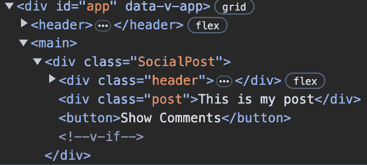

# 4

# 利用 Vue 内置指令轻松开发

在上一章中，我们看到了 Vue.js 的特性，如动态类、属性和私有状态，如何帮助我们简化开发。在本章中，我们将继续探讨我们之前的话题，通过向您介绍 Vue.js 内置指令的世界来构建。这些指令是 Vue.js 的第一次真正尝试，并将为你提供使你的代码更具动态性的工具。这些指令的主要目标是简化你的工作流程并使你的开发更加容易。在整个章节中，我们将介绍两个新的组件 `TheHeader.vue` 和 `SocialPostComments.vue`，同时继续对现有的组件如 `SocialPost.vue` 进行工作，使其更具动态性和为未来的章节做好准备。

我们将把本章分成三个不同的部分：

+   使用 `v-text` 和 `v-html` 显示文本

+   使用 `v-if` 和 `v-show` 处理元素可见性

+   使用 `v-for` 简化模板

到本章结束时，你将基本了解一些 Vue.js 内置指令，并能够使用 `v-if` 和 `v-show` 切换组件的可见性，并学习如何通过使用 `v-for` 来简化你的 HTML 模板，以及使用 `v-text` 和 `v-html` 渲染文本或 HTML。

# 技术要求

完成本章所需的代码可以在 GitHub 上的一个名为 `CH04` 的分支中找到。要拉取此分支，请运行以下命令或使用您选择的 GUI 来支持您进行此操作：

```js
Git switch CH04
```

不要忘记，仓库可以在 [`github.com/PacktPublishing/Vue.js-3-for-Beginners`](https://github.com/PacktPublishing/Vue.js-3-for-Beginners) 找到。

与上一章的结尾相比，分支有一些小的变化。这些变化是为了简化书籍，让我们能够专注于学习材料，而不是花太多时间在设置事情上。

# 使用 v-text 和 v-html 显示文本

**HTML** 是一个非常强大的工具，但它确实有其局限性，这迫使我们编写非常冗长且难以维护的代码。如果你曾经在没有框架的完全静态网站上工作过，你可能遇到过包含许多重复代码块的冗长 HTML 页面。这就是 Vue 指令发挥作用的地方。

Vue 的指令在 Vue School 网站上被描述为“特殊的 HTML 属性，允许我们操作 **文档对象模型** (**DOM**)。”

在之前的章节中，我们看到了 Vue 如何使用现有的属性语法添加功能，如组件属性。Vue 指令采用类似的方法，通过使用类似于现有 HTML 的语法来创建新的功能。

之前的描述说 Vue.js 指令允许我们操作 **DOM**，但有没有任何原生的 HTML 属性做类似的事情？答案是肯定的。

HTML 为我们提供了诸如`<input>`元素中的“value”这样的属性，用于分配可见值。我们还在`<textarea>`中有“rows”和“columns”，它们定义了元素的大小。这个列表可以很长，但我认为展示指令可以帮助我们实现什么是有益的。

Vue 的内置指令，允许我们通过使用元素属性来修改 DOM 并增强组件的灵活性。

以下是 Vue 的 15 个内置指令：

+   `v-text`: 设置给定元素的`innerText`

+   `v-html`: 设置给定元素的`innerHTML`

+   `v-show`: 切换元素的可见性（`display: hidden`）

+   `v-if`: 当条件满足时渲染元素

+   `v-else`: 如果前面的条件（`v-if`或`v-else-if`）未满足，则显示元素

+   `v-else-if`: 如果前面的条件（`v-if`）未满足，并且当前条件得到满足，则显示元素。

+   `v-for`: 根据源数据多次渲染元素或模板块

+   `v-on`: 当事件被触发时触发回调

+   `v-bind`: 将一个或多个属性或组件属性动态绑定到表达式

+   `v-model`: 在表单输入元素或组件上创建双向绑定

+   `v-slot`: 定义一个由父组件使用并替换为任意标记的占位符

+   `v-pre`: 跳过此元素及其所有子元素的编译（通常用于显示代码块）

+   `v-once`: 只渲染元素和组件一次，并跳过未来的更新

+   `v-memo`: 缓存模板的子树

+   `v-cloak`: 用于在模板准备好之前隐藏未编译的模板

一些前面的指令，包括`v-memo`、`v-once`和`v-cloak`，是针对更高级用户，本书的讲解过程中不会涉及，但如果您感兴趣，可以在 Vue.js 官方文档中找到更多关于这些信息（[`vuejs.org/api/built-in-directives.html#v-once`](https://vuejs.org/api/built-in-directives.html#v-once)）。其余的指令将会有解释，并伴随代码示例。

值得了解

所有内置指令都以`v-`为前缀。这样做是为了能够将框架属性与 HTML 中可用的原生属性分开。此标准还用于创建应始终以相同前缀开始的自定义指令。

让我们从我们的第一个指令`v-text`开始。

## 使用 v-text 将动态文本应用到我们的组件上

Vue.js 指令是 Vue.js 功能的一个非常强大的补充。不仅因为它们提供了额外的功能，而且因为它们有助于编写更干净、更易读的代码。

当被问及代码可读性有多重要时，我总是引导人们阅读罗伯特·马丁的《Clean Code》一书，他在书中指出以下内容：

“实际上，阅读与写作所花费的时间比例远远超过 10 比 1……[因此，]使其易于阅读使得写作更容易。”

让我们开始使用一些这些指令，看看它们如何被集成到我们的伴侣应用中。

在本章中，我们将工作于一个新的组件，该组件将被用作我们伴侣应用的标题。这个组件已经在仓库中创建，您可以在 `components/organisms/` 文件夹中找到它。

如您从保存组件的文件夹中推断出的那样，这个组件将成为我们之前在 *第一章* 中讨论的原子设计结构中的“有机体”。

在我们继续之前，让我们解释一下为什么我们的组件将被命名为 `TheHeader.vue`。Vue 组件的文件名需要始终唯一且与原生 HTML 元素不同，这阻止了我们简单地将其命名为 `header`，因为它将与原生的 HTML `header` 元素冲突。为了避免这些问题，Vue.js 组件名称应该始终由两个单词组成，使用 Pascal 大写格式编写，其中第一个单词和任何附加单词以大写字母开头。在某些情况下，找到两个单词来组成组件名称可能很困难。当这种情况发生时，我们可以用单词 `the` 作为组件的前缀。使用这种方法为我们的标题组件生成组件名称为 `TheHeader`。

此组件将显示一个标志、一个标题以及指向我们用户资料的链接。如果我们使用 `npm run dev` 命令运行我们的应用程序，我们将看到以下内容：


图 4.1：显示新标题的伴侣应用登录页面

我们组件的代码目前是纯 HTML，带有硬编码的数据，而我们需要更新它以使其动态化。

如果您曾经使用过互联网，您可能知道像前一个屏幕截图显示的这样的用户名不应该硬编码，而应该是动态的。

因此，我们的第一步是从 HTML 中删除这个硬编码的值，并将其转换为与我们在上一章中学到的 Ref 实例。

首先，我们将在脚本标签中创建一个带有用户名的 `Ref` 变量：

```js
<script setup>
import { ref } from 'vue';
const username = ref("Zelig880")
</script>
```

然后，我们将使用我们的第一个内置指令将此变量分配给 HTML 元素，如下面的代码片段所示：

```js
<header>
  
  <h1>Companion app</h1>
  <a href="#">
    Welcome
    <span v-text="username"></span>
  </a>
</header>
```

使用内置的 `v-text` 指令将自动更改元素的 `innerText`，其值为我们的 JavaScript 变量 `username`。

当然，在我们的例子中，名称仍然是硬编码的，因为我们的脚本中预定义了引用，但稍后这将改为从 API 动态获取。

如果您还记得我们之前的章节，我们已经成功地将动态文本分配给替换 `SocialPost.vue` 文件中的帖子、名称和用户名。我们使用类似于显示帖子的方式，通过 mustache 插值语法 `{{ }}` 实现了这一点：

```js
<div class="post">{{ post }}</div>
```

因此，在这个阶段，你可能想知道这两种方法之间实际的区别是什么？

答案不会令人兴奋——事实上，这两种方法在渲染时都会编译成相同的代码。这两种方法，即使达到相同的目标，语法也不同，一个定义为使用`v-text`的属性，另一个直接作为元素内容的一部分使用`{{ }}`编写，并且会吸引不同风格的开发者。

另一个小差异是，`v-text`将替换`innerHTML`的全部内容，而使用 mustache 插值将允许你只替换部分文本。让我们通过一个示例来展示这些差异：

```js
// v-text
<a href="#">
  Welcome
  <span v-text="username"></span>
</a>
// mustache interpolation
<a href="#">
  Welcome
  {{ username }}
</a>
```

在第一个使用`v-text`的例子中，我们必须添加一个`<span>`元素才能使用指令。实际上，如果我们直接将`v-text`指令分配给`<a>`标签，"欢迎"文本就会被覆盖。

在第二个使用双大括号的例子中，我们可以看到我们能够只更改字符串的一部分，而不需要额外的标记，这使得它更加灵活。

总之，使用`v-text`或 mustache 插值可以互换，没有对错之分，这完全取决于个人喜好。

## 使用`v-html`修改元素的内部 HTML

在前面的子节中，我们使用了我们的第一个 Vue.js 指令`v-text`。我们了解到这个指令替换了给定组件的`innerText`，但如果我们想用包含 HTML 的动态字符串替换文本怎么办？这就是`v-html`派上用场的地方。让我们深入了解如何使用它，并将其应用于我们的应用程序。

渲染 HTML 可能很危险

动态渲染 HTML 需要谨慎处理，因为它可能非常危险，并可能导致 XSS 漏洞。仅用于可信内容，绝不要用于用户提供的内容。

在解释`v-html`如何使用之前，我们首先应该尝试理解为什么你会在代码中使用这种技术。实际上，为什么你会在变量中添加 HTML，而不是直接在你的组件的`<template>`部分编写它呢？

我在职业生涯的开始时就问过自己这个问题，但后来我意识到有几个情况下`v-html`可能很有用，包括以下情况：

+   当开发一个从 CMS 接收内容（如博客文章）的应用程序时，`v-html`可能非常有用。在某些情况下，这些内容是以 HTML 的形式接收的。

+   **第三方插件输出**：有一些第三方插件，如代码可视化和画布可视化插件，可能需要使用 HTML。

+   **硬编码的 SVG 或图标**：对于小型项目来说，创建一个包含图标和 SVG 等硬编码资源的库是非常常见的。

如您所见，`v-html`的实际用途仅限于一些非常具体的场景，并且不建议在所有字符串插值使用中推荐。

我们的头组件`TheHeader.vue`目前包含一个硬编码的 SVG 来显示我们的标志。我们可以使用`v-html`使图像动态化：

1.  首先，创建一个名为 `logo` 的变量来保存我们的 SVG 代码：

```js
<script setup>
import { ref } from 'vue';
const username = ref("Zelig880");
const logo = `<svg
    height="50"
    width="50"
    viewBox="0 0 210 210"
  >
  <polygon
    points="100,10 40,198 190,78 10,78 160,198"
    style="fill:grey;"/>
  </svg>`;
</script>
```

1.  在我们的模板中应用 `v-html` 指令：

```js
<template>
  <header>
    <div v-html="logo" ></div>
    <h1>Companion app</h1>
    <a href="#">
      Welcome
      <span v-text="username"></span>
    </a>
  </header>
</template>
```

完成了！现在我们的应用程序将显示一个星形作为标志，而不是我们之前的图片，如下面的截图所示。


图 4.2：伴侣应用头部

这是一个简单的例子，并没有真正充分利用 `v-html` 的动态使用。实际上，在这种情况下，直接在 HTML 中放置 SVG 可能更合适，因为不需要为静态内容创建动态属性。

是时候继续前进，介绍如何切换组件的可见性了。在下一节中，我们将了解所有关于 `v-show` 和 `v-if` 的内容，并开始看到使用如 Vue.js 这样的框架如何真正简化我们的代码。

# 使用 v-if 和 v-show 处理元素可见性

本节全部关于元素可见性。我们将学习两个实际上可以实现相同结果——切换元素可见性——但有两个潜在差异的指令。

切换元素的可见性意味着在渲染的 HTML 中显示或隐藏元素的能力。这是当今网络中一个非常常见的功能。这可能是简单的下拉菜单出现，当按钮被点击时显示模态框，或者当点击“显示更多”链接时显示更多数据。

切换可见性是许多支持前端框架被广泛采用以实现无瑕和响应式用户体验的许多功能中的第一个。首先，我们将在 `SocialPost.vue` 文件中添加一个按钮，该按钮仅在文章有评论时显示，然后我们将显示一个名为 `SocialPostsComments.vue` 的新组件，该组件将由新按钮切换，并在后续章节中用于显示帖子列表。

## 使用 v-show 从 DOM 中隐藏元素

能够显示或隐藏元素对于极其复杂的情况非常有用，但对于我们即将要讨论的非常简单的情况也同样有用。

如果你查看 `TheWelcome.vue` 中的帖子结构，你会注意到 `posts` 对象现在包括一些尚未显示的额外信息，例如评论和标签。

我们的第一步是在 `SocialPost.vue` 中显示一个按钮，用户可以点击以显示或隐藏帖子评论。由于并非所有帖子都有评论，我们只想为包含评论的文章显示此按钮。为了实现这一点，我们将使用 `v-show`。

与所有其他指令一样，`v-show` 只是一个接受值的元素属性。在这种情况下，接受的值是 `true` 或 `false`。当 `v-show` 接收到布尔值时，如果其值为真（如 `<button v-show="true" />`），则将显示元素，如果值为假（如 `<button v-show="false" />`），则将隐藏元素：

```js
<template>
<div
  …
  <div class="post">{{ post }}</div>
  <button v-show="comments.length > 0">
    Show Comments
  </button>
</div>
</template>
```

在前面的代码中，我们已经访问了我们的`SocialPost.vue`文件并添加了一个新的按钮元素。然后，因为我们只想为有评论的帖子显示这个新元素，所以我们使用了我们新引入的`v-show`指令，并使用评论属性来定义何时切换元素的可见性。

因此，在我们的情况下，如果我们的帖子没有评论，`comments.length > 0`的值将等于`false`，当`v-show`接收到一个`false`值时，它将隐藏元素。另一方面，如果帖子有评论，`comments.length > 0`的值将是真值，按钮将被显示。前面的代码将显示以下结果：


图 4.3：伴随应用程序显示前面代码片段的结果，其中一条帖子显示了“显示评论”按钮

请注意，当使用`v-show`时，我们实际上并没有从 DOM 中移除项目，只是隐藏了它。实际上，如果我们使用浏览器调试器分析 DOM，我们可以看到按钮在第二个帖子中是可用的，但只是被隐藏了。


图 4.4：Chrome DevTools 元素标签显示 DOM 中的按钮及其样式定义为“display:none”

虽然现在这似乎不太重要，但在下一节中，我们将学习`v-if`之后，它将更有意义。

## 使用 v-if 保持 DOM 清洁和性能

在前面的子节中，我们添加了一个按钮来显示评论，但这些评论仍然没有在屏幕上显示。在本节中，我们将通过工作一个新的组件并将“显示评论”按钮增强为切换这些组件的可见性来将这些评论添加到我们的 UI 中。

`v-if`指令的工作方式与`v-show`相同。它接受一个参数，该参数将根据其是*真值*还是*假值*来显示或隐藏指定的元素。

在我们的情况下，我们将创建一个新的 Ref，名为`showComments`，这将用于切换元素的可见性。让我们一步一步地在我们的`SocialPost.vue`文件中看看如何实现这一点。

1.  我们将在**SFC**（**单文件组件**）的`<script>`块中定义我们的新 Ref：

    ```js
    const showComments = ref(false);
    ```

1.  在脚本标签的顶部导入新的组件：

    ```js
    import SocialPostComments from './SocialPostComments.vue';
    ```

1.  将该组件添加到我们的 HTML 中。我们这样做是通过传递一个包含评论的属性，如下所示：

    ```js
    <SocialPostComments :comments="comments"/>
    ```

1.  添加`v-if`指令以确保组件仅在 showComments 私有数据为 true 时显示：

    ```js
    <SocialPostComments
    ```

    ```js
      v-if="showComments"
    ```

    ```js
      :comments="comments"/>
    ```

1.  如果我们现在检查应用程序，我们会注意到新的组件还没有显示。这是因为 showComments 的值被设置为`false`，而且没有方法可以改变它。让我们通过允许我们的“显示评论”按钮改变我们的 Ref 的值来解决这个问题：

    ```js
    <button
    ```

    ```js
      v-show="comments.length > 0"
    ```

    ```js
      @click="showComments = true"
    ```

    ```js
    >Show Comments</button>
    ```

如前述代码所示，我们使用了原生的 `click` 事件，它触发了一些基本的 JavaScript 代码来改变我们 Ref 的值。多亏了 Vue 的响应性，当 `showComments` 的值改变时，我们的 UI 将会自动重新渲染。如果你想要能够切换组件的开启和关闭，你可以写 `showComment = !showComment` 来确保 `showComment` 的值将等于当前 `showComment` 值的相反。

没有样式的组件应该看起来像这样：

```js
<template>
  <div
  class="SocialPost"
  :class="{ SocialPost__selected: selected}"
  @click="selected = !selected"
>
  <div class="header">
    
    <div class="name">{{ username }}</div>
    <div class="userId">{{ userId }}</div>
  </div>
  <div class="post">{{ post }}</div>
  <button
    v-show="comments.length > 0"
    @click="showComments = !showComments"
  >Show Comments</button>
  <SocialPostComments
    v-if="showComments"
    :comments="comments"
  />
</div>
</template>
<script setup >
import { onMounted, ref } from 'vue';
import SocialPostComments from './SocialPostComments.vue';
const showComments = ref(false);
const props = defineProps({
  username: String,
  userId: Number,
  avatarSrc: String,
  post: String,
  comments: Array
});
onMounted( () => {
  console.log(props.username);
});
</script>
```

在我们进入下一节之前，我们将学习如何渲染项目列表，我们需要明确 `v-if` 和 `v-show` 之间的区别。实际上，直到现在我们还没有定义究竟是什么让它们不同，似乎也没有理由我们不能在之前的例子中使用 `v-show`。

在上一节中，我们强调了使用 `v-show` 时，HTML 元素会被渲染到 DOM 中但保持隐藏。然而，如果我们观察 `v-if` 的相同方面，我们会注意到元素完全缺失，并被一个 `<!--v-if-->` 的 HTML 注释所替代：



图 4.5：SocialPosts.vue 组件的 DOM 提取

对于新手来说，这个差异可能看起来很小，但实际上有三个主要原因非常重要：

+   如果没有从 HTML 中省略元素的能力，当我们尝试渲染一个需要特定值的组件（即使它是隐藏的）时，我们将会遇到错误。例如，在我们的案例中，如果我们使用了 `v-show`，Vue 编译器会尝试渲染组件，但这样做会失败，因为在某些情况下，评论变量可能不可用。

+   在 DOM 中渲染大量未使用的元素确实会影响你的性能。比如说，如果我们每篇帖子有 150 条评论，并且使用了 `v-show`，那么 DOM 就会有成百上千的隐藏节点，这些节点可能永远不会被使用。使用 `v-if` 允许我们确保这些节点只有在需要时才被渲染。

是时候前进到下一节了，我们将学习一个新的指令，称为 `v-for`。这个指令允许我们通过自动复制我们的 HTML 来渲染项目列表，例如我们的评论。

# 使用 v-for 简化模板

本节中介绍的指令称为 `v-for`，它将被用来渲染元素列表。如果你学习过任何编程语言，你可能已经接触到了编程语言中用于逐条遍历列表的 `for` 循环的概念，而 `v-for` 指令与此类似。

使用 `v-for` 允许我们通过多次重新渲染相同的元素（或元素集）来渲染特定的列表。使用 `v-for` 不仅简化了我们的 **HTML**，还允许我们渲染那些在事先不知道确切条目数量时无法渲染的动态列表。

让我们看看原生 HTML 实现和 Vue.js 实现的简单列表是如何比较的：


图 4.6：原生 HTML 和 Vue.js 列表实现的比较

如所示，`v-for` 指令的实现与其他您可能之前见过的 `for` 循环非常相似。该指令接受一个参数，格式为“item in array”，就像在主要编程语言中一样。

即使前面的例子看起来并不那么令人印象深刻，但随着 `v-for` 成为首选指令，并且将帮助您用优雅的代码实现复杂要求，这一切都将随着时间的推移而改变。

让我们继续开发 `SocialPostComments.vue` 文件，并利用 `v-for` 指令来显示特定帖子的不同评论。

我们使用 `v-for` 指令所需的步骤如下：

1.  获取一个对象或数组类型的变量或属性。在我们的例子中，它作为一个属性可用。

1.  创建第一个元素的 HTML。这有助于加快 HTML 开发速度。

1.  将列表更改为使用 `v-for` 并自动创建重复条目。

第一步已经在 `SocialPostComments.vue` 文件中设置好了，作为使用 `defineProps()` 定义的数组属性：

```js
const props = defineProps({
  comments: Array
})
```

接下来，我们将创建我们想要显示的 HTML。如前所述，我们将通过使用数组语法来硬编码数组的第一个条目：

```js
<div>
  {{ comments[0] }}
</div>
```

我们硬编码第一个注释的上一段代码可能看起来不相关，但在更复杂的发展中，以这种方式创建 `v-for` 将为您节省大量时间。我使用这种仅渲染 `v-for` 列表中的一个条目的过程来专注于 HTML 的设计和开发。当列表元素完全设计完成后，我然后进行下一步。

最后，是时候实现我们的 `v-for` 指令了：

```js
<div v-for="comment in comments">
  {{ comment }}
</div>
```

上一段代码将根据我们数组的长度渲染我们的 `<div>` 元素多次。

你知道吗？

`v-for` 指令的主体也可以用来加载其他 Vue 组件。这允许您将复杂代码抽象为其自己的组件，使您的应用程序更简洁。

在我们进入下一章之前，我们应该指出 `v-for` 可以接受多个元素，而不仅仅是之前显示的单个元素。为了在现实生活中展示这一点，我们将通过使用 `index` 数组为每个评论添加一个标题：

```js
<div v-for="(comment, index) in comments">
  <strong>This is comment number {{index}}</strong>
  <p>{{ comments }}</p>
</div>
```

上一段代码展示了两个额外的添加。

首先，我们通过使用 `(comment, index)` 语法暴露了数组的索引。然后我们通过将简单字符串替换为多元素结构来改进 `v-for` 循环中的 HTML。

# 摘要

本章向您介绍了第一个 Vue 指令，并开始为您的 HTML 添加一些魔法。

总的来说，你学习了如何完成三个不同的用例。首先，我们向你展示了如何使用 `v-text` 和 `v-html` 应用 HTML 和文本。这对于将动态变量绑定到组件模板中非常有用。然后，我们发现如何使用 `v-if` 和 `v-show` 来处理元素的可见性。我们发现，尽管它们在视觉上都能达到相同的结果，但实际上它们在幕后是不同的。`v-show` 使用 CSS 隐藏元素，而 `v-if` 则将元素从 DOM 中完全移除。最后，我们通过查看 `v-for` 以及它如何用于在列表中迭代并简化我们的 HTML 来结束本章。

你的回合

现在轮到你了，来做一些本节的练习。有多个地方可以练习指令，但这里有一些具体的建议。

1. 将 `SocialPost.vue` 重新整理，使用 `v-show` 来显示帖子的标签。（你需要为此添加一个新的属性。）

2. 将 `TheWelcome.vue` 重新整理，使用 `v-for` 来加载我们的帖子，而不是使用硬编码的实现方式。

3. 回到你的页脚实现，并使用 `v-text` 和 `v-for` 替换硬编码的链接。

在下一章中，我们将回到组件的逻辑部分，通过引入 **计算属性** 来增强我们的 Refs 和 props。本章的第二部分将介绍 **方法**，这些方法将包含我们的组件逻辑，并有助于进一步清理组件的 HTML。
