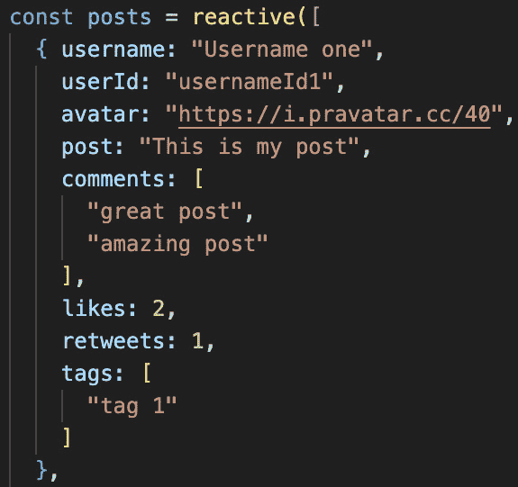
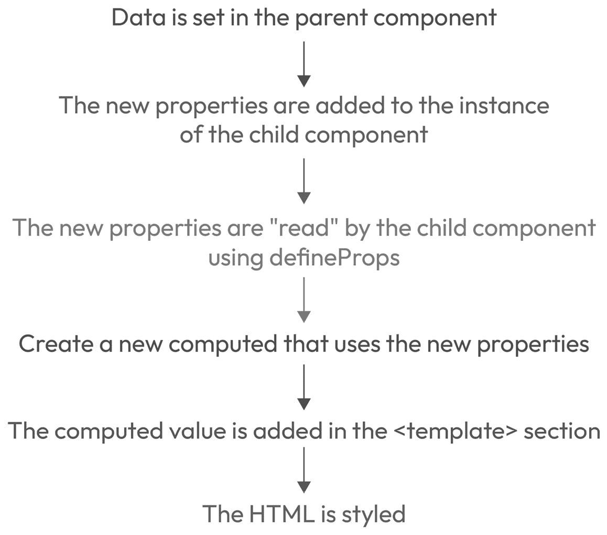
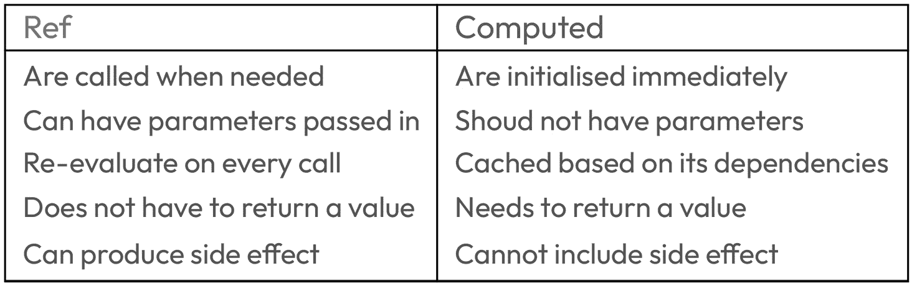

# 5

# 利用 Vue.js 中的计算属性和方法

在上一章中，我们学习了组件的`<template>`部分。在本章中，我们将把重点转移到`<script>`标签上，并学习如何确保组件的逻辑被抽象化。

本章旨在向您介绍两个功能：**方法**和**计算属性**。这些 Vue.js 功能对于确保组件逻辑保持高效和可读性至关重要。我们将回顾之前章节中创建的组件，并使用前面的技术使它们更容易阅读。在整个章节中，我们还将继续添加关于之前章节中学习到的功能的更多细节，例如 Refs 变量和指令。

本章将分为以下几部分：

+   使用方法抽象功能

+   使用计算属性创建动态数据

+   学习方法和计算属性之间的区别

到本章结束时，你将能够将逻辑抽象到方法中，使用计算属性创建响应式变量，最重要的是，理解它们之间的区别。

# 技术要求

为了能够跟随本章内容，你应该使用名为`CH05`的分支。要拉取这个分支，请运行以下命令或使用您选择的 GUI 软件来支持此操作：

```js
git switch CH05
```

本章的代码文件可以在[`github.com/PacktPublishing/Vue.js-3-for-Beginners`](https://github.com/PacktPublishing/Vue.js-3-for-Beginners)找到。

# 使用方法抽象功能

在教程和培训中展示的大多数组件，例如本书中迄今为止分享的组件，看起来总是易于阅读且非常小巧，但这并不总是如此。在实际应用中编写的组件很容易因为逻辑而变得臃肿，难以阅读。大多数情况下，这种复杂性是多次迭代和功能变更的结果。

尽量保持组件尽可能干净是非常重要的。实现这一点的最简单方法是将逻辑从 HTML 中抽象出来，并将其移动到`<script>`标签内，但我们可以使用什么来简化我们的组件呢？

这就是方法发挥作用的地方。方法是可以用于 Vue.js 组件实例中的 JavaScript 函数。方法可以被描述为助手，允许你在组件内执行操作。

方法可以在各种情况下使用，从从 API 获取数据到验证用户输入，并且将成为我们简化组件逻辑的 Vue.js 首选功能。

在使用 Composition API 语法编写方法时非常简单，因为方法只是简单的 JavaScript 函数。

是时候检查我们在*技术要求*部分中提到的正确分支了，并看看方法在实际中的应用。

我们将查看`components/molecules`文件夹中的`SocialPost.vue`组件的 HTML，并尝试找到一些可以提取的逻辑。我们要找的是任何我们可以将之转换为函数的、写在我们组件 HTML 元素中的 JavaScript 代码：

```js
<template>
<div
  class="SocialPost"
  :class="{ SocialPost__selected: selected}"
  @click="selected = !selected"
>
  <div class="header">
    
    <div class="name">{{ username }}</div>
    <div class="userId">{{ userId }}</div>
  </div>
  <div class="post" v-text="post"></div>
  <button
    v-show="comments.length > 0"
    @click="showComments = !showComments"
  >
    Show Comments
  </button>
  <SocialPostComments
    v-if="showComments"
    :comments="comments"
  />
</div>
</template>
```

当你分析一个组件时，以下是最适合重构为方法的候选者：

+   与事件（点击、更改）相关的逻辑

+   需要参数（循环索引）的逻辑

+   执行副作用逻辑

在我们前面的代码中，有两个与某些逻辑相关联的点击事件实例：第一个`<DIV>`中的`@click="selected = !selected"`和`Show Comments`按钮中的`@click="showComments = !showComments"`。

这些是很好的重构候选者，因为这种逻辑不应该存在于 DOM（文档对象模型）中，而应该移动到组件的`<script>`标签外部。重构此代码分为两个简单的步骤。首先，我们在`<script>`中创建一个方法，然后我们将逻辑替换为我们新创建的方法。

让我们在组件逻辑中创建两个函数，分别命名为`onSelectedClick`和`onShowCommentClick`。

让我们更新我们的代码：

```js
<script setup >
import { onMounted, ref } from 'vue';
import SocialPostComments from './SocialPostComments.vue';
const selected = ref(false);
const onSelectedClick = () => {
  selected.value = !selected.value;
}
const showComments = ref(false);
const onShowCommentClick = () => {
  showComments.value = !showComments.value;
}
...
</script>
```

在事件处理程序前缀加上“on”

你可能已经注意到，我已将事件方法名称前缀为“on”，后缀为事件名称（click）。这是一个好的实践，因为它使代码更易于阅读，并帮助你识别与事件相关的方法。

多亏了 Composition API 语法，我们可以通过在 Ref 的初始化下方添加方法来按组组织我们的功能，使我们的代码更加整洁且易于阅读。

### 在`<script>`标签中读取和写入 Ref

你可能已经注意到，代码与我们在 HTML 中使用的逻辑有所不同。`selected`和`showComments`Ref 的语法不同，因为它们后面跟着`.value`。

在读取和写入`<script>`标签中的 Ref 时，向 Ref 添加`.value`是一个要求，这并不适用于可以通过普通变量访问的 Reactive 变量。

让我们通过一个视觉图来帮助阐明 Ref 和 Reactive 之间的差异：


图 5.1：显示在`<script>`和`<template>`标签中读取和写入 Ref 和 Reactive 时差异的表格

我知道一开始这可能会让人感到困惑，但到书的结尾，你将掌握这个差异，因为我们在开发过程中会多次迭代并使用这个差异。

为什么 Ref 需要`.value`

Vue 的响应性是基于一个代理对象构建的，该对象监听变量的“get”和“set”事件。这个代理在原始值（如字符串、数字和布尔值，即 ref 使用的类型）中不可用。为了克服这一点，这些原始值被转换成具有单个属性 `.value` 的对象。

现在我们已经创建了方法，是时候调用它们了。我们将从组件的 HTML 中调用这些方法。为此，我们将移除之前分配给 `@click` 事件的逻辑，并用我们刚刚创建的方法替换它。

我们的主要 `<div>` 将看起来像这样：

```js
<div
  class="SocialPost"
  :class="{ SocialPost__selected: selected}"
  @click="onSelectedClick"
>
```

我们的“显示评论”按钮将变成这样：

```js
<button
  v-show="comments.length > 0"
  @click="onShowCommentClick"
>
  Show Comments
</button>
```

如前述代码所示，与我们的点击事件相关的逻辑已经被移动到了 `<script>` 标签中。

我们所做的改变可能看起来非常无关紧要，不值得这么做，但像这样的小可读性改进有助于使代码不仅易于阅读，而且易于更改。

让我们再次修改我们的组件，并假设我们被要求在组件的 `<script>` 标签每次触发时使用 `console.log`，它们可以很容易地扩展：

```js
const showComments = ref(false);
const onShowCommentClick = () => {
  console.log("Showing comments");
  showComments.value = !showComments.value;
}
```

添加 `console.log` 简单得不能再简单了。我们使用现有的 JavaScript 知识修改了方法，如前述代码所示。

轮到你了

尝试创建你自己的方法。我的建议是尝试在组件挂载时向消息中添加 `console.log`（你可以使用 `onMounted`）或者继续通过创建一个记录应用中帖子数和评论数的方法来练习使用 Ref 和 Reactive。

你现在应该能够通过使用方法来重构你的组件，并提高代码的可读性。将复杂代码分解成更小的函数将帮助我们保持组件的可维护性。在下一节中，我们将查看 Vue.js 提供的类似功能，称为计算属性。

# 使用计算属性创建动态数据

在上一节中，我们学习了如何通过抽象点击事件的逻辑来简化我们的组件。我们将继续探讨“重构”的主题，并介绍一个名为**计算属性**的新特性。

当人们第一次了解计算属性时，他们通常会由于它们的相似性而将它们与方法进行比较，但事实上，这个特性与 props 和 Ref 的关系更密切。

计算属性可以这样描述：

计算属性使你能够创建一个动态属性，可以用来修改、操作和显示你的组件数据（refs、reactive 和属性）。- [`blog.logrocket.com/`](https://blog.logrocket.com/)

到目前为止，我们已经使用了 Ref、Reactive 和 props 在我们的应用程序中传递和显示数据，但有时接收到的数据可能需要格式化，或者我们需要完全创建新的数据。

当需要动态属性时，计算属性是正确的特性来使用。

在我们开始修改配套应用程序之前，让我们介绍一些现实生活中的例子，以帮助更好地理解计算属性及其目标。

+   *场景 1 –* *学生名单*

    假设我们从 API 接收数据，该数据返回学校中的所有学生，但我们只想过滤出女学生。我们可以使用计算属性来创建一个过滤后的数组。

+   *场景 2 –* *切换数组长度*

    在这种情况下，我们被要求只在我们列表中有五个或更多条目时显示按钮。我们可以使用计算属性来检查条目的长度，并创建一个具有布尔值的新的属性。

+   *场景 3 –* *连接值*

    想象一个应用程序，它有名字和姓氏作为属性，而你希望访问一个包含全名的变量。嗯，我们可以使用计算属性来创建这个值，它将取决于名字和姓氏。

+   *场景 4 –* *片段*

    你是否遇到过这样的博客，你只能看到博客文章的一小部分，然后可以点击“显示更多”来显示完整文章？嗯，为了实现这一点，我们可以创建计算属性，它只返回一定数量的字符。

如果你重新阅读前面的例子，你可能注意到它们都有共同之处。事实上，我们提出的所有场景都有以下相似之处：

+   它们都创建了一个在组件内部需要的新数据/值

+   它们不会产生任何副作用

+   它们都依赖于另一份数据（props、Refs 或 Reactive）

前面的要点出现在我提出的所有场景中，这不是因为我选择了它们，而是因为它们是计算属性的前提条件。

计算属性是一种特性，它允许我们使用一个或多个现有的数据片段（Refs、Reactive 和 props）来创建一个新的值。

是时候开始看看一些例子，以便了解如何以及何时使用这个特性了。

计算属性的语法如下：

```js
import { computed } from 'vue'
const test = computed( ... );
```

使用计算属性时，我们首先需要从 Vue 中导入它，然后将其分配给一个新的常量。计算属性访问一个回调，该回调将包含创建新变量所需的逻辑。

让我们看看一个简单的例子，并展示一个创建全名的计算属性将是什么样子：

```js
<script setup>
import { ref, computed } from 'vue'
const name = ref("Simone");
const surname = ref("Cuomo");
const fullName = computed( () => {
  return `${name.value} ${surname.value}`;
} );
</script>
```

在前面的代码中，我们创建了一个名为 `fullName` 的新动态属性。这将像普通属性一样工作，可以在组件的任何地方使用，而无需我们的组件。

就像我们之前说的那样，计算属性满足了我们的要求，具体如下：它创建新的数据（`fullName`），依赖于另一个值（`name` 和 `surname`），并返回一个值。

### 将计算属性添加到配套应用程序中

现在是时候更新我们的组件，看看我们如何利用计算属性进一步简化我们的代码了。

就像在前一个部分一样，我们将继续修改`SocialPost.vue`文件。让我们回顾一下这个文件，并尝试看看什么是一个好的计算属性候选者：

```js
<template>
  <div
    class="SocialPost"
    :class="{ SocialPost__selected: selected}"
    @click="onSelectedClick"
  >
    <div class="header">
    
    <div class="name">{{ username }}</div>
    <div class="userId">{{ userId }}</div>
  </div>
  <div class="post" v-text="post"></div>
  <button
    v-show="comments.length > 0"
    @click="onShowCommentClick"
  >
    Show Comments
  </button>
  <SocialPostComments
    v-if="showComments"
    :comments="comments"
  />
</div>
</template>
```

从前面的代码中，我们可以看到与`v-show`指令相关的逻辑已经被突出显示。这是我们最好的候选者，可以将其转换为计算属性。

计算属性需要返回一个依赖于另一个值且没有副作用的值，前面突出显示的逻辑正是如此。实际上，它返回一个`true`或`false`的布尔值，这取决于`comments`的值，并且没有其他可以定义为副作用的操作。

就像方法一样，为了能够将这个逻辑转换为计算属性，我们需要将其逻辑移动到组件的`<script>`标签中。让我们看看实现这一目标所需的步骤：

1.  首先，我们需要在`<script>`标签的顶部导入`computed`：

    ```js
    import { onMounted, ref, computed } from 'vue';
    ```

1.  然后，我们创建一个使用计算属性的函数：

    ```js
    const hasComments = computed( );
    ```

1.  接下来，我们将把我们的逻辑作为计算方法的第一个参数添加为一个回调：

    ```js
    const hasComments = computed(() => {
    ```

    ```js
      return props.comments.length > 0;
    ```

    ```js
    });
    ```

1.  最后，我们将用新的计算属性替换 HTML 中现有的逻辑：

    ```js
    <button
    ```

    ```js
      v-show="hasComments"
    ```

    ```js
      @click="onShowCommentClick"
    ```

    ```js
    >
    ```

    ```js
      Show Comments
    ```

    ```js
    </button>
    ```

通过前面的代码，我们已经在我们的组件中创建了一个名为`hasComments`的新属性。这个属性，就像每个其他的 Vue.js 变量一样，是响应式的，并且会在`comments`数组变化时立即改变。

### 使用缓存值提高性能

创建计算属性不仅提高了我们组件的可读性，还通过缓存值提高了我们应用程序的性能。

这意味着计算属性中包含的实际函数仅在组件挂载时运行一次，除非依赖的值发生变化，否则在组件渲染时不会再次运行。

这可能不会对我们的简单示例带来巨大的改进，但在大型应用程序中，计算属性实际上可能是一个包含 100 多个条目的大型数组，这确实会带来很大的差异！

### 格式化你的数据

计算属性在其他的框架中并不常见，对于大多数 Vue.js 开发者来说，它们被视为一种新的技术/特性。由于它们的独特性质，有时在现实生活中掌握和使用它们可能会有点困难。为了确保这个主题被完全理解，我们将创建一些额外的示例，这些示例将使用计算属性。

如果你打开名为`TheWelcome.vue`的文件并检查`posts`响应式值，你会注意到对象中有额外的参数。实际上，`likes`和`retweets`的值已经添加到我们的帖子中。



图 5.2：包含额外点赞和转发条目的响应式属性

在本节中，我们将创建一个新的动态属性，用于存储交互的总数。我们将通过添加所有不同的交互来实现这一点，包括评论、点赞和转发。

这个新的计算属性将被命名为 `interactions`，在我们的帖子有 2 个评论、2 个点赞和 1 个转发的情况下，它将返回一个值为 `5`（2 + 2 + 1）。

这个例子应该能帮助你理解计算属性不仅仅是一种美化组件的方式，实际上它是一个强大的工具，可以帮助你增强应用程序的功能。

试试看

你为什么不试试看，尝试自己创建计算属性？创建这个计算属性需要你将到目前为止所学的一切付诸实践，所以为什么不接受一点挑战呢？

成功创建一个用于显示我们交互的计算属性需要几个步骤。以下图表显示了数据如何通过组件流动，这将有助于我们理解定义计算属性所需采取的步骤。



图 5.3：从父组件到计算属性的数据流

在这本书中，我们已经涵盖了前面的每个条目，但这次将是第一次我们将它们全部在一个单独的练习中使用。在开发生活中生成这样的完整数据流将会非常常见，因此提前进行一些练习是有益的。

让我们一步一步地回顾前面的数据流：

1.  **在父组件中设置数据**：

    让我们打开 TheWelcome.vue 并检查 <script> 标签内 posts Reactive 中可用的参数：

    ```js
    { username: "Username one",
    ```

    ```js
      userId: "usernameId1",
    ```

    ```js
      avatar: "https://i.pravatar.cc/40",
    ```

    ```js
      post: "This is my post",
    ```

    ```js
      comments: [
    ```

    ```js
        "great post",
    ```

    ```js
        "amazing post"
    ```

    ```js
      ],
    ```

    ```js
      likes: 2,
    ```

    ```js
      retweets: 1,
    ```

    ```js
      tags: [
    ```

    ```js
        "tag 1"
    ```

    ```js
      ]
    ```

    ```js
      }
    ```

    如前述代码所示，点赞和转发属性已经为我们设置好了。

1.  **新属性被添加到子组件的实例中**：

    如前一章所述，组件在使用属性之前需要传递属性给它。因此，在我们的情况下，我们需要将新的 likes 和 retweets 属性添加到 <SocialPost> 的实例中：

    ```js
    <SocialPost
    ```

    ```js
    :username="posts[0].username"
    ```

    ```js
    :userId="posts[0].userId"
    ```

    ```js
    :avatarSrc="posts[0].avatar"
    ```

    ```js
    :post="posts[0].post"
    ```

    ```js
    :comments="posts[0].comments"
    ```

    ```js
    :likes="posts[0].likes"
    ```

    ```js
    :retweets="posts[0].retweets"
    ```

    ```js
    ></SocialPost>
    ```

    前面的例子展示了如何将其添加到第一个条目，以及如何对第二个条目进行相同的复制。

1.  **新属性通过 definedProps 被子组件读取**：

    要实现这一步，我们需要打开 SocialPost.vue 文件，并将新属性 likes 和 retweets 添加到定义的 props 列表中。这两个都将属于 Number 类型：

    ```js
    const props = defineProps({
    ```

    ```js
      username: String,
    ```

    ```js
      userId: Number,
    ```

    ```js
      avatarSrc: String,
    ```

    ```js
      post: String,
    ```

    ```js
      comments: Array,
    ```

    ```js
      likes: Number,
    ```

    ```js
      retweets: Number,
    ```

    ```js
    });
    ```

1.  **创建一个新的计算属性，使用以下新属性**：

    计算函数将使用新创建的属性并创建一个名为 interactions 的新动态属性：

    ```js
    const interactions = computed( ()=> {
    ```

    ```js
      const comments = props.comments.length;
    ```

    ```js
      return comments + props.likes + props.retweets;
    ```

    ```js
    });
    ```

    就像每个计算属性一样，我们前面的函数使用 `computed()` 函数创建一个新的 `interactions` 值，并返回一个值，在我们的例子中，这个值是不同属性的总和。

1.  计算值被添加到 `<template>`：

    ```js
    <div class="interactions">Interactions: {{ interactions }}</div>
    ```

    在这里，我们使用了字符串插值的知识来在组件中打印交互的值。

1.  **样式** **HTML**：

    最后一步需要我们为 HTML 添加样式。这可以通过在组件的 <style> 标签中使用纯 CSS 来完成：

    ```js
    .interactions {
    ```

    ```js
      font-weight: bold;
    ```

    ```js
      margin-top: 8px;
    ```

    ```js
    }
    ```

在遵循之前定义的步骤之后，我们的新 `interactions` 属性已经完全设置并可在配套应用程序中使用，如下面的截图所示。


图 5.4：显示交互的配套应用程序截图

计算属性将是您 Vue.js 应用程序的重要组成部分，了解何时以及如何使用它们至关重要。

轮到你了

尝试创建自己的计算属性。打开 `TheHeader.vue` 文件，并尝试用一个新的计算属性 `welcomeMessage` 替换当前 `Welcome {{ username }}` 的实现。

在本节中，我们学习了如何通过创建计算属性来增强我们的组件，从而创建动态属性。我们解释了使计算属性成为可能的三个因素，如下所述：它不会产生副作用，创建一个新变量，并依赖于其他组件变量。最后，我们回顾了两个不同的编码练习，以更好地理解计算属性的意义和用法。

# 学习方法和计算属性之间的区别

在我的职业生涯中，我见过许多人误用方法和计算属性。在本节中，我们将阐明这两个功能之间的区别，并提供一个您可以在早期职业生涯中回顾的指南。

## 技术差异

重新回顾前两节中讨论的内容，并对比这两个 Vue.js 功能之间的技术差异可能是一个好的起点：



图 5.5：展示方法和技术差异以及计算属性的表格

让我们关注一下 *图 5.5* 中显示的一些主要差异：

+   **初始化时间**：方法可以在用户需求时初始化，而计算属性则在组件创建生命周期中触发。

+   **参数和依赖关系**：虽然方法可以接受参数，但计算属性只能使用其他组件属性和数据，这些数据被称为依赖项。

+   **评估**：每次调用方法时都会进行评估，这使得它们非常昂贵，而计算属性则被缓存，只有当其依赖项更新时才会重新评估。

+   **副作用**：当方法或函数在其局部作用域之外修改值或触发动作时，就会发生副作用。例如，触发 API 调用是一个副作用，或者改变方法未返回的变量也是一个副作用。

计算属性的目标是创建一个新的变量，它不应该包含任何副作用，而方法的主要作用域是产生副作用。

如果有人被要求用一句话来定义计算属性和方法之间的区别，我会说以下内容：

方法是辅助函数，允许你完成一个动作，而计算属性允许你创建一个新的组件属性。

## 如何在组件中找到它们

在上一节中，我们讨论了方法和计算属性之间的技术差异，而在本节中，我们将看到这些辅助函数在组件中的位置。

了解计算属性和方法在组件结构中的使用位置将帮助你做出正确的选择。为了更好地看到我们是否可以做出正确的选择，我们将使用一个虚拟组件。这个组件有几个由`???`分隔的占位符。

花几分钟时间尝试理解这将是什么方法或计算属性，以及你为什么做出这个选择。当你准备好了，你可以阅读我的解释，看看它是否与你的选择相符：

```js
<script setup>
import { reactive } from 'vue'
const post = reactive({
  title: '',
  content: '',
showOnlySnippets: true
});
const fetchBlog = //???;
const onShowAll = //???;
const snippets = //???;
onMounted(() => {
  fetchBlog();
} );
</script>
<template>
  <h1>{{ post.title }}</h1>
  <p v-if="post.showOnlySnippets">{{ snippets }}</p>
  <p v-else>{{ post.content }}</p>
  <button @click="onShowAll" >Show All</button>
</template>
```

第一个占位符是`fetchBlog`。这将是一个方法。这个决定基于`fetchBlog`不仅将触发副作用，联系外部 API，而且它还在`onMounted`生命周期中被调用。正如我们之前定义的，只有方法可以被按需触发。

第二个是`onShowAll`。这将执行一个动作，当用户点击按钮时将被触发。同样，在这个例子中，我们将将其定义为方法，因为它由事件触发，将包含副作用，并接受参数。

最后，我们有“片段”。这个变量在模板中的使用就像一个变量一样。正如我们现在所知道的，创建动态变量是计算属性的完美匹配。在这个例子中，“片段”将是一个依赖于博客内容的计算属性。

让我们看看`updates`脚本可能的样子：

```js
<script setup>
import { reactive } from 'vue'
const post = reactive({
  title: '',
  content: '',
  showOnlySnippets: true
});
const fetchBlog = () => {
  fetch('fakeApi.com').then( result => {
    post.title = result.title;
    post.content = result.content;
  } );
};
const onShowAll = (event) => {
  post.showOnlySnippets = false;
};
const snippets = computed( () => {
  return post.content.slice(0, 100);
} );
onMounted(() => {
  fetchBlog();
} );
</script>
```

到目前为止，我们已经涵盖了所有示例，你应该对这些两个不同的特性有了很好的理解。

# 摘要

在这一章中，我们介绍了方法，并使用它们来清理我们的伴侣应用组件。我们学习了 Refs 和 Reactive 之间的区别，并学习了如何在组件的`<script>`部分中使用它们，然后我们继续前进，学习了如何使用计算属性创建动态属性。为了完成这一章，我们通过一些更多示例来巩固这两个主题的知识。

在下一章中，我们将学习如何使用 Vue 事件处理来创建和管理事件。到目前为止，我们一直专注于单个组件，但随着事件和事件处理的引入，我们将能够定义组件之间的双向通信。事件传播是开发可扩展且清晰的基于组件的应用程序所必需的一项基本技能。
