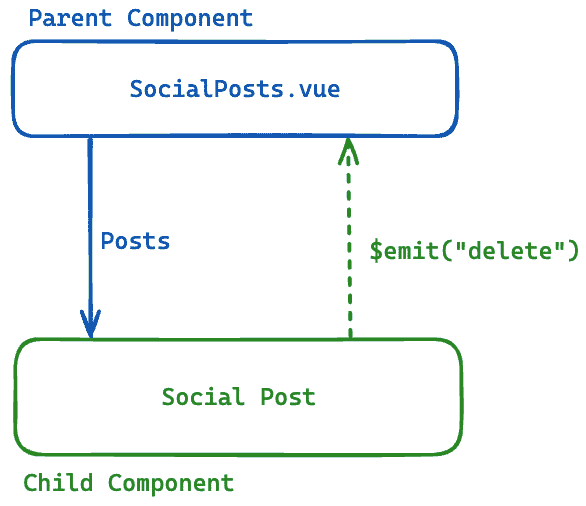

# 6

# Vue.js 中的事件和数据处理

主要框架不仅因其能够将大页面分解成小可重用组件的能力而受到欢迎，还因为它们可以以简单的方式相互通信。

在本章中，我们将关注数据如何在不同的组件之间流动。组件之间的信息交换以两种不同的方式处理：通过属性从父组件到子组件，以及通过事件从子组件到父组件。

我们将从这个章节开始，介绍自上一章节以来在伴侣应用中提交的一些变化。这些修改可以用作一个好的指南，帮助你提高技能并巩固你已经学到的知识。我们将通过创建一个简单的按钮作为我们的第一个可重用组件，来重新审视属性，并学习更多高级技术，如`validator`和`required`。然后，我们将学习如何处理原生事件，如`click`和`change`，最后，介绍自定义事件，这将允许我们的组件向应用的其他部分广播消息。

本章包括以下部分：

+   探索伴侣应用的变化

+   深入了解 props

+   在 Vue.js 中处理原生事件

+   使用自定义事件连接组件

到本章结束时，你将学会如何处理多个组件之间的通信。有了这些新知识，你应该能够从单个组件转向宏观层面思考，考虑包含多个组件的更复杂的应用结构。

# 技术要求

为了能够跟随本章，你应该使用名为`CH06`的分支。要拉取此分支，请运行以下命令或使用你选择的 GUI 来支持此操作：

```js
git switch CH06
```

这个分支将包括一些变化。这些变化将在本章的第一节中解释，但你也可以开始并运行应用，熟悉其更新的外观并浏览仓库。

本章的代码文件可以在[`github.com/PacktPublishing/Vue.js-3-for-Beginners`](https://github.com/PacktPublishing/Vue.js-3-for-Beginners)找到。

# 探索伴侣应用的变化

到目前为止，伴侣应用的外观和感觉非常基础，其变化完全是由我们在章节中编写的代码所引起的，但情况已经改变。

让我们看看现在应用看起来是什么样子：


图 6.1：更新设计和组件的伴侣应用

如你在前面的屏幕截图中所观察到的，伴侣应用不仅在外观上进行了更新，采用了新的样式，而且还展示了将在本章和未来章节中使用的新组件。

这些变更已被应用，以便充分利用书籍内容，使我们能够专注于新的学习材料，而无需花费太多时间创建组件的脚手架和基本结构，但你应该花一些时间探索所做的变更，并尝试理解为什么以及如何实现这些变更。

自上次章节以来添加的所有变更和修改都使用了你已经接触过的功能，逐一查看每个变更是一个完美的练习，可以加强你的学习。

对应用进行了两组主要的变更：

+   文件夹和文件变更

+   逻辑变更

让我们详细查看这些变更，从影响文件夹和文件的变更开始。

## 文件夹和文件变更

在`CH06`分支中，应用文件夹和文件中发生了一些变更。这些变更是为了开始将应用结构化，使其更像一个真实的生产应用，并远离应用至今为止简单的“概念证明”外观和结构。

文件结构所做的变更如下：

+   我们添加了第一个原子组件`TheLogo.vue`。

    在上一章中，我们伴侣应用的 logo 的`SVG`元素被硬编码在头部。现在，它已经被移动到自己的文件中，并已导入到`TheHeader.vue`中。

+   在 UI 中添加了一个名为`SideBar.vue`的侧边栏。

    我们的应用布局已修改，并在`organism`文件夹中添加了一个名为`SideBar.vue`的新侧边栏。

+   使用`CreatePost.vue`创建帖子的功能已搭建。

    我们应用的主要容器现在包含了一个旨在创建新帖子的新组件。这个组件只包括 HTML 结构和一些样式，但还没有逻辑。该组件位于`molecules`文件夹中的`CreatePost.vue`。

+   我们将`TheWelcome.vue`重命名为`SocialPosts.vue`。

    为了更好地将我们的组件与更新的布局对齐，需要移除非常通用的`TheWelcome.vue`组件，并将其与组件结构对齐。为此，我们将组件重命名为`SocialPosts.vue`，因为它包含了一系列社交帖子，并将其移动到`molecules`文件夹中。

现在我们已经了解了所有文件和文件夹的变更，是时候查看可能包含在这个更新中的任何代码逻辑变更了。

## 逻辑变更

就像文件夹变更一样，应用也经历了一些修改。这些变更将使应用适应未来的变更，并且通过添加更多文件和更复杂的文件夹结构，让你一窥在真实项目中工作的样子。

如果你以包含少量组件的存储库结束这本书，你将无法体验到在真实应用中工作的感觉，因此你将无法学习如何导航代码库，更重要的是，如何结构化你的代码库。因此，应用被增强，以拥有更多的结构：

+   定义 `homeView.vue`：在这个时间点，应用程序是一个单页应用，但这一点会在以后发生变化。为了开始并适应这些变化，我们已经开始定义 `src/views/HomeViews.vue` 以包括侧边栏、页眉和主页主体。这将允许我们在未来创建其他页面而无需重复此结构。

+   清理页眉中的代码：页眉文件已经被清理。我们移除了硬编码的标志，并在“欢迎”信息旁边添加了一个新图标。为了完成这些更改，我们还为我们的组件添加了一些样式。查看此文件以提醒自己如何加载外部组件。

+   使用 `v-for` 使 `SocialPost` 渲染动态内容：到目前为止，`SocialPost` 帖子是在 `SocialPosts.vue`（之前称为 `TheWelcome.vue`）中单独和手动加载的。现在多个帖子的渲染是动态的，并由 `v-for` 处理。使用 `v-for` 不仅提高了组件的可读性，还使其动态化，允许我们无需手动更改 HTML 就可以将 `post` 添加到我们的列表中。


图 6.2：SocialPost 的硬编码版本与使用 v-if 的版本之间的 Git 差异

我们现在已经解释了本章中包含的结构和逻辑更改。在我们继续前进之前，有一个小细节我想提到，那就是关于 `:key` 属性的。

如果你仔细检查之前的屏幕，你会注意到新版本的代码（右侧）有一个额外的属性叫做 `:key`。这个属性在使用 Vue 组件的 `v-for` 时是必需的。

键值被框架用来防止整个列表的不必要重新渲染。实际上，Vue.js 使用这个属性来跟踪哪个特定的组件实例已更改，并只更新特定的节点而不是整个列表。

因此，在前进的过程中，每次你使用 `v-for` 指令时，都应该记得使用 `:key` 设置一个唯一的键。这通常会被代码检查工具作为警告提出。提供这个值有助于 Vue.js 识别它使用 `v-for` 创建的所有不同节点，并在其中任何一项发生变化时加快重新渲染的速度。你应该尽可能定义一个键，除非创建的 DOM 非常简单。

避免使用数组索引

很常见的是看到数组索引被用作 `v-for` 循环的 `:key` 值。不幸的是，这是一个非常不好的做法，因为如果移除数组项，索引将会改变，迫使 Vue.js 重新渲染整个列表，并可能产生难以发现的错误。

我们现在已经熟悉了我们所做的所有更改。如前所述，你应该花几分钟熟悉这些更改，并了解所做的工作及其原因。

在下一节中，我们将开始我们的数据流之旅，并仔细研究属性。这个主题已经在上一章中介绍过，但它还有更多内容，现在是学习它的时候了。

# 深入了解属性

在*第三章*中，我们介绍了并开始使用属性作为从组件传递信息到其子组件的方式。随着我们对 Vue.js 理解的加深，是时候扩展我们对这个基本功能的知识了。

就像快速回顾一样，到目前为止，我们已经了解到属性（props）是通过`defineProps`编译器宏定义的，如下所示：

```js
const props = defineProps({
  name: String
});
```

这样做将允许我们的组件接受一个名为`name`的`String`类型属性：

```js
<myComponent :name="myName" />
```

在本节中，我们将学习属性还有哪些其他配置可以提供。定义属性类型的能力并不是唯一的配置。

## 属性配置

在大多数情况下，只需配置属性类型，如之前所示，就足够了，但有时需要精细控制，以下配置将有助于你。

我们用来声明属性的语法是一个名称后跟期望的类型，`PropsName: Type`，但为了能够使用高级配置，我们需要将属性更改为接受一个对象。因此，我们之前提供的`name: String`在对象语法的示例将如下所示：

```js
const props = defineProps({
  name: {
    type: String
  }
});
```

现在属性有了对象，我们可以添加额外的配置。

### 多种类型

Vue.js 属性可以接受多种类型。要做到这一点，我们只需将类型定义为数组：

```js
name: {
  type: [ String, Number ]
}
```

### 设置必需属性

属性有两种类型，`required`或`optional`。默认情况下，框架将所有属性设置为`optional`，这是故意的，以与原生 HTML 处理属性的方式保持一致（例如，`disabled`或`readonly`）。

在开发组件时，你应该始终问自己组件是否可以在没有属性值的情况下渲染，如果不能，请确保将属性设置为`required`：

```js
name: {
  type: String,
  required: true
}
```

当一个属性是必需的，如果用户尝试不传递它来实现组件，组件将抛出错误，在某些情况下，根据你的设置，甚至可能根本不渲染组件。

### 使用默认值设置属性回退

当一个属性被设置为`optional`且未传递时，组件将给它一个`undefined`值。这在大多数情况下是可以的，但有时你可能希望属性有一个回退值。

对于初学者开发者来说，使用 HTML 中的`v-if`来实现这一点是很常见的：

```js
<button>{{ welcomeMsg ? welcomeMsg : "Welcome" }}</button>
```

这个解决方案非常冗长，应该用默认属性值替换：

```js
welcomeMsg: {
  type: String,
  default: "Welcome"
}
```

当`welcomeMsg`属性未传递时，组件将渲染`Welcome`字符串。现在我们的 HTML 可以更干净地用于逻辑：

```js
<button>{{ welcomeMsg }}</button>
```

数组和对象的默认初始化

对象和数组对于`default`有不同的语法，必须由工厂函数返回：`default: () => []`或`default: () => {}`。

### 验证你的属性

我们将要介绍的最后一个配置是验证接收到的值的能力。这在你的属性只能接受一组特定值或它们必须以特定方式格式化时非常有用。验证器是一个接收等于属性值的参数的函数，并期望返回`true`以标记验证或返回`false`以使验证无效。

例如，如果我们想创建一个只能接受两个字符串`light`或`dark`的属性，我们将设置`validator`函数如下：

```js
theme: {
  type: String,
  validator: (value ) => ["light", "dark"].includes(value)
}
```

通过前面的代码行，我们的组件属性`theme`将只接受这两个值。如果传递了错误的值，组件将不会渲染并抛出错误。

## 创建一个基本按钮

为了将我们所学的一切付诸实践，我们将创建一个简单的基按钮。基础组件，如由组件库提供的组件，接受多个属性，通常是利用高级属性设置的最好选择。

我们的按钮将具有以下功能：

+   它将需要可以是一个字符串或数字的值

+   它将有一个`optional`的`width`属性，默认为`100px`

+   它将有一个`optional`主题，只接受`light`或`dark`值

新的按钮可以在`atoms`文件夹下以`TheButton.vue`的名称找到：

```js
<template>
  <button
    :class="theme"
  >
    {{ value }}
  </button>
</template>
<script setup>
  defineProps({
})
</script>
<style scoped>
button {
  width: v-bind(width);
}
.light {
  background-color: #1DA1F2;
  color: white;
}
.dark {
  background-color: black;
  color: #1DA1F2;
}
</style>
```

文件基本上已经定义。其 HTML 包括一个`button`元素，其中包含我们属性和样式的占位符，准备好容纳我们的属性值。这个组件剩下的只是定义其属性。在阅读以下解决方案之前，尝试使用前面的信息自己定义属性。

当完全定义后，定义的属性应该看起来像这样：

```js
defineProps({
  value: {
    type: [String, Number],
    required: true
  },
  width: {
    type: String,
    default: "100px"
  },
  theme: {
    type: String,
    default: "light",
    validator: (value) => ["light", "dark"].includes(value)
  }
})
```

属性配置非常强大且易于使用。正确使用它们可以帮助在模板中节省许多行代码，并有助于使组件更加健壮。

在本节中，我们学习了如何使用属性配置并创建了一个基础按钮来帮助我们理解其实际用法。我们学习了如何提供多种类型，如何设置属性为`required`，如何定义默认值，以及最后但同样重要的是，如何验证它。

在下一节中，我们将开始将注意力转移到数据处理的其他部分：事件。事件被子组件用来与父组件通信。我们将首先介绍原生元素，然后继续定义自定义元素。

# 在 Vue.js 中处理原生事件

由于 JavaScript 的诞生，事件始终在编程语言的成功中扮演着至关重要的角色。因此，所有 JavaScript 框架都确保它们提供强大的解决方案来处理原生和自定义事件。

我们将原生事件称为内置在 HTML 元素和 API 中的事件，例如由`<button>`触发的`click`事件，由`<select>`触发的`change`事件，或由``触发的`load`事件。

就像与 props 和指令一样，Vue.js 事件处理无缝地与现有的原生语法结合，以处理 HTML 元素提供的事件。在原生 HTML 中，所有事件处理器都以 `on` 字符开头，所以一个 `click` 事件变为 `onclick`，一个 `change` 事件变为 `onchange`。Vue.js 通过创建一个以 `v-` 开头的指令（正如我们所知）来遵循这个约定，即 `v-on`。因此，Vue 中的 `click` 事件使用 `v-on:click` 处理，而 `change` 事件使用 `v-on:change` 监听。

你可能已经注意到了，这并不是我们在代码库中迄今为止使用的语法。实际上，如果你打开 `SocialPost.vue`，你会注意到我们使用了不同的语法，其中事件以 `@` 符号作为前缀。

这只是 Vue.js 框架提供的一个简洁的缩写。使用 `@` 符号不仅简化了事件的实际编写，而且与其他指令明显区分开来。

让我们看看这些不同的方法在应用于 `<button>` 时会是什么样子：

```js
// HTML Native
<button onclick="method()">Click Me</button>
// Vue.js
<button v-on:click="method">Click Me</button>
<button @click="method">Click Me</button>
```

即使语法不完全相同，使用起来也非常相似且直观。

有一个小的差异需要注意。实际上，在原生处理事件的方法中，传递给 `onclick` 的方法实际上被调用为 `onclick="method()"`，而在 Vue.js 的情况下，方法不会被调用，它们只是作为方法名称的引用传递给框架引擎，即 `@click="method"`。

是时候通过打开 `SideBar.vue` 来对代码库进行一些修改了：

```js
<template>
<aside>
  <h2>Sidebar</h2>
  <button>Create Post</button>
  <div>
    Current time: {{currentTime}}
  </div>
  <button>Update Time</button>
</aside>
</template>
<script setup>
import { ref } from 'vue';
const currentTime = ref(new Date().toLocaleTimeString());
</script>
```

这个文件负责在我们布局中显示新的侧边栏。该组件包含一些元素和按钮，这些元素和按钮将在本章节和未来的章节中作为学习材料使用。

对于本节，我们将关注屏幕上显示的当前时间。更具体地说，我们将创建一个在点击按钮时更新这个时间的能力。

处理事件分为两个步骤。首先，我们创建一个包含触发事件所需所有逻辑的方法，然后将它附加到 HTML 上。

让我们首先创建这个方法：

```js
<template>
<aside>
  <h2>Sidebar</h2>
  <button>Create Post</button>
  <div>
    Current time: {{currentTime}}
  </div>
  <button @click="onUpdateTimeClick">Update Time</button>
</aside>
</template>
<script setup>
import { ref } from 'vue';
const currentTime = ref(new Date().toLocaleTimeString());
const onUpdateTimeClick = () => {
  currentTime.value = new Date().toLocaleTimeString();
};
</script>
```

通过前面的修改，点击标记为 **更新时间** 的按钮将更新屏幕上显示的当前时间。让我们分析一下我们是如何实现这一点的。

首先，我们为事件逻辑创建一个方法。这个方法将以 `on` 字符开头，后面跟着实际事件的标识符——例如，`updateTimeClick`——生成一个名为 `onUpdateTimeClick` 的名称。

这个特定事件的逻辑相当简单，但正如我们在上一章所学，方法可以是复杂的，也可能有副作用，因此事件可以实现的目标没有限制。

接下来，我们在 HTML 中添加 `click` 指令。我们可以使用 `v-on:click` 或 `@click`。这将自动将我们的 Vue 方法与原生的 `click` 事件链接起来。

这个例子不应该与我们在早期章节中已经覆盖的例子有太大不同，但事件处理并没有停止。事实上，我们需要了解两个重要的概念：事件修饰符，我们现在将介绍，以及稍后在本章中将要介绍的参数。

## 事件修饰符

在使用 JavaScript 处理事件时，通过阻止默认行为（`event.preventDefault()`）或停止事件传播（`event.stopPropagation()`）来修改事件是非常常见的。

这就是事件修饰符发挥作用的地方。Vue.js 为我们提供了一个简单的语法，可以直接从 HTML 中触发这些逻辑，而无需通过事件对象进行导航。

Vue.js 提供了许多修饰符——从事件修饰符（如`.prevent`、`.stop`和`.once`）到允许您监听特定按钮（如`.enter`、`.tab`和`.space`）的键盘修饰符，最后是允许您通过`.left`、`.right`和`.middle`触发特定鼠标点击事件的鼠标修饰符。

让我们分解 Vue 指令的语法：


图 6.3：Vue 指令的语法分解

Vue.js 中的指令由四个主要部分组成：

+   指令的名称——例如，`v-on`、`v-if`，或者在使用可用的缩写时使用`@`。

+   例如，对于`click`事件使用`click`，或者属性的名称。

+   例如`prevent`或`stop`这样的修饰符。

+   指令实际需要的值。在事件处理程序的情况下，值将是当事件被触发时运行的函数，而在属性的情况下，值将是一个简单的变量。

事件修饰符附加到事件指令上，所以例如，对于`preventDefault`，您将写`@click.prevent="methodName"`。

了解所有这些修饰符超出了本书的范围，因为其中一些（如`capture`和`passive`）有非常具体的用法，并不总是必需的。如果您想了解更多信息，可以在 Vue.js 官方文档中找到更多细节（[`vuejs.org/guide/essentials/event-handling#event-modifiers`](https://vuejs.org/guide/essentials/event-handling#event-modifiers)）。

在继续之前，我们将尝试在我们的应用程序中使用这些修饰符之一：`.once`。这个修饰符可以防止事件处理器被触发多次。当您有只能执行一次的操作时，这非常有用，例如，保存新条目或更新表格行。

我们将应用这个方法到我们最近写的同一个`click`事件上。通过这样做，我们只能更新一次当前时间，因为多次点击按钮不会执行任何操作：

```js
<button @click.once="onUpdateTimeClick">Update Time</button>
```

修饰符的使用非常简单，正如我们刚才所展示的。我们只需要在事件指令后添加单词 `.once`，以防止事件被触发多次。

修饰符不仅用于事件，也用于所有指令

如前所述，向指令提供修饰符的能力并不仅限于事件；实际上，修饰符是所有指令都可用的一项功能。唯一具有修饰符的内建指令是 `v-on`，但你可以创建自己的自定义指令或使用外部包，该包可能有自己的修饰符。

在对原生事件做了简要介绍之后，现在是时候学习自定义事件以及它们如何用于在组件之间广播消息了。

# 使用自定义事件连接组件

如 Vue.js 这样的框架允许我们将应用程序分解成非常小的组件，有时甚至小到单个 HTML 元素。没有强大的通信系统，这是不可能的。

原生 HTML 元素提供事件作为它们触发动作和向父元素传递信息的方式，Vue.js 组件通过提供自定义事件使用一个非常相似的模式。

自定义事件并不是什么新鲜事物，因为它们在 JavaScript 中已经存在了一段时间，但它们在纯 JavaScript 中通常使用起来非常冗长，而使用 Vue.js，创建、发出和监听自定义事件则感觉既简单又直观。让我们看看这些是如何定义和使用的。

要了解自定义事件，我们将通过添加用户删除帖子的功能来修改伴侣应用：



图 6.4：显示父组件和子组件之间数据流的流程图

如前图所示，属性如 `Posts` 由父组件用于向子组件发送信息。另一方面，事件用于子组件向父组件发出信息。

在图 *6**.4* 中所示的示例中，`SocialPosts.vue` 文件向子组件发送一系列社交帖子，子组件使用名为 `delete` 的自定义事件请求父组件删除帖子。

让我们看看如何在 `SocialPost.vue` 文件中实现这个自定义事件。第一步需要我们在点击 *删除* 图标时触发一个原生的 `click` 事件。就像我们在上一节中所做的那样，我们通过在 HTML 中添加 `@click` 指令来实现这一点：

```js
<div class="header">
  
  <div class="name">{{ username }}</div>
  <div class="userId">{{ userId }}</div>
  <IconDelete @click="onDeleteClick" />
</div>
```

然后，我们在 `<script>` 标签中添加 `onDeleteClick` 方法：

```js
...
onMounted( () => {
  console.log(props.username);
});
const onDeleteClick = () => {}
</script>
```

接下来，我们需要定义事件，并在 `onDeleteClick` 被触发时触发它：

```js
...
onMounted( () => {
  console.log(props.username);
});
const emit = defineEmits(['delete']);
const onDeleteClick = () => {
  emit('delete');
}
</script>
```

我们使用一个名为 `defineEmits` 的编译器宏来定义 emits。这与 `defineProps` 的语法相同，因为它接受一个可以由组件发出的事件的数组。在我们的例子中，我们只定义了一个 `delete` 事件。

`defineEmits` 返回一个函数，可以用来触发我们的事件。建议将这个常量命名为 `emit`，以与 Vue.js 中可用的原生 `$emit` 方法保持一致。

这个函数接受两个参数。第一个是事件名称，第二个是传递给事件监听者的参数。在我们的例子中，这是通过 `emit('delete')` 定义的，其中 `delete` 是我们的自定义事件名称。

现在子自定义事件已经完全设置，是时候确保父组件正在监听这个事件了。让我们回顾一下 `SocialPosts.vue` 并运用我们的技能：

```js
    ...
    :retweets="post.retweets"
    :key="post.userId"
    @delete="onDelete"
  ></SocialPost>
</template>
<script setup>
import { reactive } from 'vue';
import SocialPost from '../molecules/SocialPost.vue'
const onDelete = () => {
  posts.splice(0, 1);
}
...
```

在 Vue.js 中监听自定义事件与监听原生事件没有区别。事实上，两者都使用 `v-on`（或 `@`）指令，如 `@delete="onDelete"` 所示。就像其他事件监听器一样，这段代码将等待事件被触发后再运行提供的函数。

由事件触发的方法称为 `onDelete`，并使用纯 JavaScript 从 `Posts` 对象中删除项目。如果我们尝试当前的代码，我们会看到功能按预期工作，并且在点击 *删除* 图标时删除了第一个帖子。

这很好，但还不够完美，因为我们希望选择要删除的帖子，而不是将这个值硬编码为第一个帖子。为了修复这个错误，我们必须在声明我们的自定义事件时添加一个参数来定义要删除的正确帖子。

## 事件参数

直到这一刻，在伴侣应用中处理的所有事件都不需要访问事件对象或外部参数。

现在，我们将学习如何扩展事件处理程序以接受这些额外的值。

由于附加到事件的方法可以访问组件的所有响应式数据，你可能会认为传递参数可能不是非常有用，但这并不是事实。

事实上，当从使用 `v-for` 的元素中触发事件时，参数非常有用——就像在我们的例子中，我们需要通知事件 `post` 索引。访问触发事件的帖子的正确值对于功能正确运行至关重要。

为了能够删除正确的帖子，我们首先需要在触发事件处理程序时添加 `post` 索引的值，然后确保这个值被读取并用于方法中。

1.  让我们通过在 `v-for` 中暴露它来使 `post` 索引可用：

    ```js
    <SocialPost
    ```

    ```js
      v-for="(post, index) in posts"
    ```

    ```js
      :username="post.username"
    ```

1.  接下来，将索引添加到事件声明中：

    ```js
    <SocialPost
    ```

    ```js
      v-for="(post, index) in posts"
    ```

    ```js
      :username="post.username"
    ```

    ```js
      ...
    ```

    ```js
      :key="post.userId"
    ```

    ```js
      @delete="onDelete(index)"
    ```

    ```js
    ></SocialPost>
    ```

1.  最后，在事件处理程序中添加 `postIndex` 参数：

    ```js
    const onDelete = ( postIndex ) => {
    ```

    ```js
      posts.splice(postIndex, 1);
    ```

    ```js
    }
    ```

经过这三次修改后，我们应该能够从我们的伴侣应用中删除正确的帖子。

通过 `$event` 获取事件原生对象

事件处理程序可以访问一个名为 `$event` 的特殊参数。这个参数自动传递给所有没有参数或可以直接从 HTML 传递自定义参数的事件：`<button @click="handler($event, customParameter) />"`。

# 摘要

在本章中，我们通过分析伴侣应用程序中的变化，回顾了之前学过的主题。然后，通过介绍所有可能的选项，我们扩展了对 props 的知识。接下来，我们转向事件处理，解释了如何在 Vue.js 组件中使用原生 HTML 事件，并在本章结束时定义了自定义事件处理程序以及如何使用它来在组件之间传递信息。

现在，你应该能够创建和使用自定义事件。有了这些知识，再加上关于 props 的额外知识，你应该能够处理具有多个组件的更大应用程序。你还应该利用在伴侣应用程序中做出的更改，学习如何导航新的代码库。

在下一章中，我们将通过移除硬编码的值、开始使用外部 API、通过观察值变化来学习如何处理副作用，以及克服计算属性的局限性，继续围绕“增加范围”这一主题进行构建。这些变化将进一步增加我们应用程序的复杂性，同时，也为我们提供了增加对 Vue.js 框架知识的重要技能。
