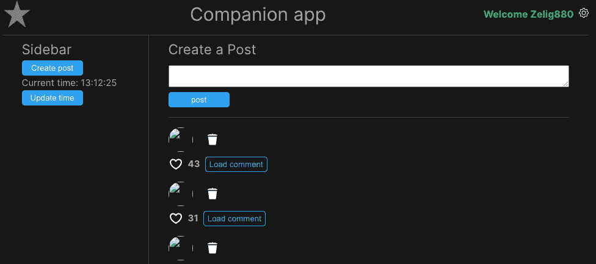
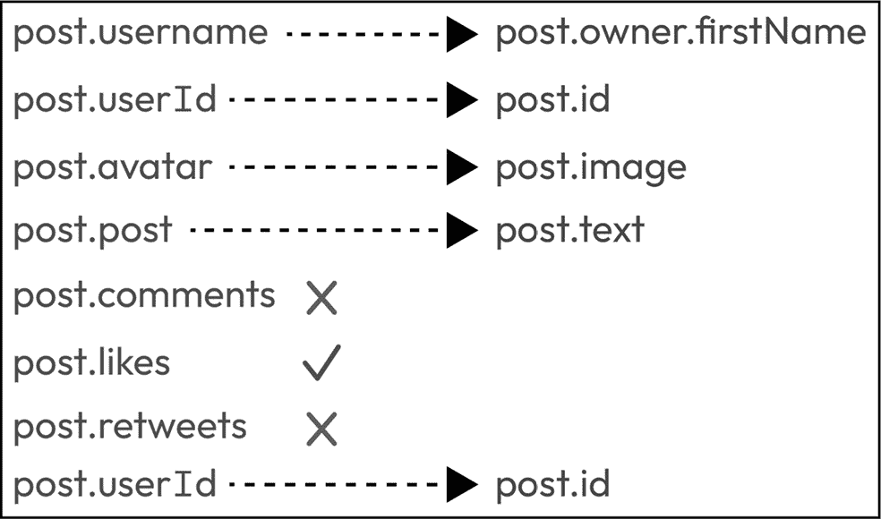
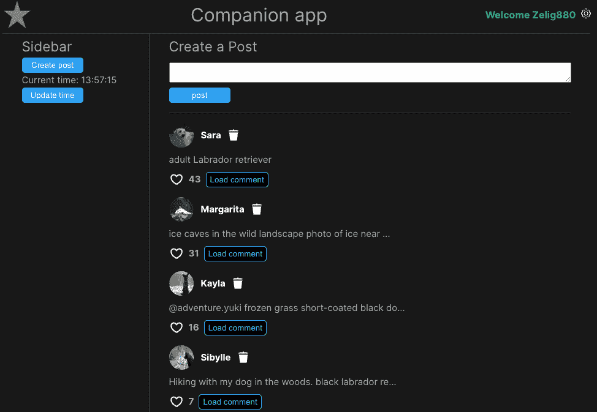
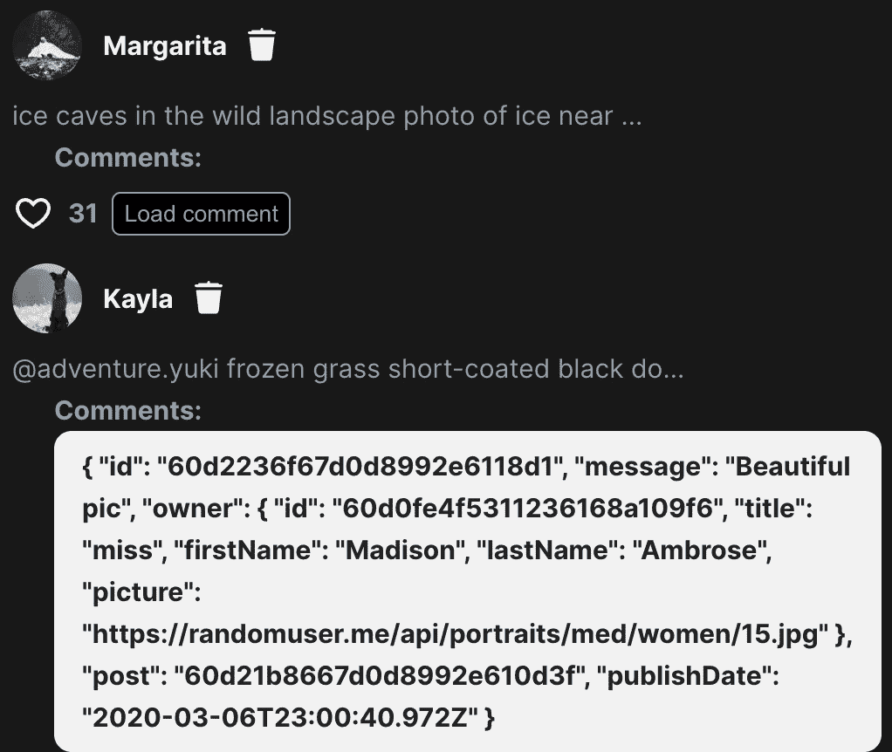
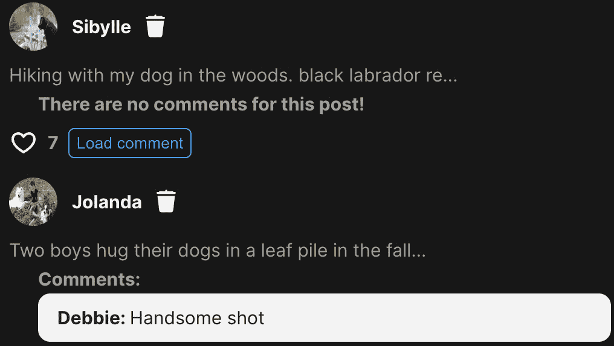
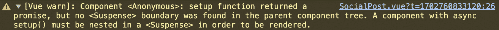

# 7

# 使用 Vue.js 处理 API 数据和异步组件管理

在*第六章*中，我们关注了组件如何通过使用属性进行相互通信，这些属性用于父到子通信，以及事件来处理从子组件发送给父组件的消息。

在本章中，我们将继续探讨通信的话题，展示如何与外部资源，如 API 进行通信。在外部通信是开发无法使用静态数据的动态网站时，这是一个非常常见的方法。学习如何管理异步操作不仅会导致干净的用户体验，而且有助于保持应用程序的性能。

从外部源，如 API 加载数据使得数据处理更加复杂。实际上，当数据是硬编码时，我们不需要担心任何事情，因为信息是立即可用的。而当我们处理来自外部源的数据时，我们不仅需要考虑数据加载期间应用程序的空状态，还要考虑数据加载失败的可能性。

我们将首先移除硬编码的帖子并动态加载它们；然后我们将对评论做同样的处理，通过按需加载数据。然后我们将增强我们的应用程序，使其能够自动使用`watch`加载更多帖子。最后，我们将学习如何使用`<Suspense>`定义和使用异步组件。

本章将涵盖以下主题：

+   使用 Vue.js 生命周期从 API 加载数据

+   使用`watch`函数监视组件中的变化

+   使用 Suspense 处理异步组件

到本章结束时，你将学会如何动态加载数据和组件。你将知道如何创建按需加载数据的组件，以及这给我们的应用程序带来的好处。你还将能够使用`watch`处理副作用，最后定义并处理异步组件以确保应用程序正确渲染。

# 技术要求

在本章中，分支被称作`CH07`。要拉取这个分支，运行以下命令或使用您选择的 GUI 来支持此操作：

```js
Git switch CH07.
```

作为本章的一部分，我们还将使用一个名为 Dummyapi.io 的外部资源。这个网站将提供一个模拟 API，我们将用它来动态加载我们的帖子。要使用 API，您需要注册并生成一个**APP ID**。创建**APP ID**是完全免费的，您可以通过以下链接创建账户来获取：[`dummyapi.io/sign-in`](https://dummyapi.io/sign-in)。

这个新分支，`CH07`，仅包含一些样式更改以及用我们在上一章`TheButton.vue`中创建的自定义按钮组件替换了原生按钮。

该章节的代码文件可以在[`github.com/PacktPublishing/Vue.js-3-for-Beginners`](https://github.com/PacktPublishing/Vue.js-3-for-Beginners)找到。

# 使用 Vue.js 生命周期从 API 加载数据

对于大多数为网络构建的应用来说，暴露一定程度的动态内容是很常见的。提供即时加载数据的能力是 JavaScript 框架（如 Vue.js）增长的最重要因素之一。

到目前为止，伴随应用一直是使用直接在组件中加载的静态数据构建的。在真实应用中，硬编码的值并不常见，应用中使用的帖子评论只是权宜之计，帮助我们专注于 Vue.js 的基本功能，但现在是我们学习如何动态加载数据的时候了。

能够成功处理异步数据加载非常重要。无论你的下一个应用有多大或多小，你很可能需要处理外部数据。

在本节中，我们将更新我们应用的两个部分。首先，我们将更新`SocialPosts.vue`以从外部源加载帖子，然后我们将更改`SocialPostComments.vue`以动态加载评论，但会有一个小变化，因为我们将会实现一个叫做“按需加载数据”的功能。然后我们将简要讨论动态加载可能对我们应用性能和用户体验产生的影响。

## 从 API 加载数据的社会帖子

到目前为止，我们应用显示的帖子总是相同的，这是由于在`SocialPosts.vue`中定义的`posts`数组是硬编码的。在本节中，我们将使用**DummyAPI**提供的公共 API（[`dummyapi.io/`](https://dummyapi.io/))来使我们的帖子动态化。

**DummyAPI**等服务对于开发应用框架和帮助你练习技能非常有用。互联网上有许多这样的免费服务，并且可以通过搜索引擎轻松找到。

研究是开发的一部分

花几分钟时间浏览**DummyAPI**网站，尝试理解我们将如何使用 API 以及我们将使用哪些端点。学习外部资源是网络开发中非常重要的一个部分。

使用 Vue.js 方法、原生的 Fetch API 和 Vue.js 生命周期将实现外部数据的加载。首先，我们将从`SocialPosts.vue`中移除旧的、硬编码的数据。这个文件可以在`molecules`文件夹中找到，因为它是一个渲染我们伴随应用主页大部分内容的组件：

```js
const posts = reactive([]);
```

然后，在同一文件中，我们将创建一个调用外部 API 以获取新帖子的方法：

```js
const fetchPosts = () => {
  const baseUrl = "https://dummyapi.io/data/v1";
  fetch(`${baseUrl}/post?limit=5`, {
    "headers": {
      "app-id": "1234567890"
    }
  })
    .then( response => response.json())
    .then( result => {
      posts.push(...result.data);
    })
}
```

上述代码使用原生的 JavaScript `fetch`方法([`developer.mozilla.org/en-US/docs/Web/API/Fetch_API`](https://developer.mozilla.org/en-US/docs/Web/API/Fetch_API))向[dummyapi.io](http://dummyapi.io) API 发送`GET`请求。由于 API 的要求，我们需要在请求中传递`app-id`。正如*技术要求*部分所述，这可以免费获得。

我们随后使用`response.json()`以`json`格式获取结果，最后将返回的数据追加到帖子的`Reactive`属性中。

在定义方法之后，是时候“调用”它了。在这种情况下，当触发一个`async`请求时，我们利用 Vue.js 的生命周期来确保我们的请求在正确的时间被触发。

在*第二章*中，我们介绍了不同的生命周期，并提到`created`生命周期是异步数据的正确选择。我们对它的描述如下：

“[`created`生命周期]是触发异步调用来收集数据的完美阶段。现在触发慢速请求将帮助我们节省时间，因为这个请求将在组件渲染的同时在幕后继续。”

让我们去调用我们新创建的方法`fetchPosts`，在`created`生命周期中。与`mounted`等其他生命周期不同，`created`不需要显式定义。官方文档的解释如下：

“因为`setup`是在`beforeCreate`和`created`生命周期钩子周围运行的，所以你不需要显式地定义它们。换句话说，任何应该写入这些钩子内部的代码都应该直接写在`setup`函数中。”

这简化了我们的需求，意味着我们只需要在我们的组件 JavaScript 逻辑体中定义方法后调用它：

```js
const posts = reactive([]);
const fetchPosts = () => {
   ...
}
fetchPosts();
```

在这个阶段，我们的帖子应该从 API 动态加载，但工作还没有完成；事实上，应用程序显示的帖子是错误的：



图 7.1：显示损坏 UI 的伴侣应用

上述错误是由什么引起的？

在阅读答案之前，你为什么不尝试调查一下是什么导致了*图 7.1*中显示的渲染问题呢？你会如何着手修复它？

API 获取的数据已成功加载并应用于我们的“posts”，但数据的结构并不符合我们之前设置的。这个问题与我们之前章节中学到的高级属性设置有关。

## 修复 SocialPost.vue 属性的不匹配

在实际应用中，属性不匹配是非常常见的问题，但这是可以避免的。事实上，应用渲染出破碎的用户界面是因为我们没有指定在`SocialPost.vue`中哪些属性是期望的“必需”属性，因此 Vue.js 试图使用它拥有的数据来渲染应用，导致缺失的数据被设置为`null`。

让我们比较帖子数组之前的硬编码结构与通过 API 接收的新结构，看看这两个结构如何比较以及确保伴侣应用可以正确渲染帖子信息所需进行的更改：



图 7.2：帖子之前结构与新 API 提供结构的过渡

*图 7.2* 显示了我们将要对我们应用进行的更改以适应新的数据。一些字段需要更改以匹配新的对象属性，评论和转发已被完全移除。调用`<SocialPost>`组件现在将更改为以下内容：

```js
<SocialPost
  v-for="(post, index) in posts"
  :username="post.owner.firstName"
  :id="post.id"
  :avatarSrc="post.image"
  :post="post.text"
  :likes="post.likes"
  :key="post.id"
  @delete="onDelete(index)"
></SocialPost>
```

上述突出显示的代码显示了旧组件实例与新组件实例之间的差异。请注意，我们必须将`userId`替换为仅`id`，这将在以后是必需的。现在，是时候修改子组件以确保它可以与新数据一起工作。这将涉及几个步骤：

1.  从 UI 中移除`UserId`，因为它太长了：

    ```js
    <div class="name">{{ username }}</div>
    ```

    ```js
    <div class="userId">{{ userId }}</div>
    ```

    ```js
    <IconDelete @click="onDeleteClick" />
    ```

1.  从`props`声明中移除`comments`和`retweets`：

    ```js
    const props = defineProps({
    ```

    ```js
      username: String,
    ```

    ```js
      userId: Number,
    ```

    ```js
      avatarSrc: String,
    ```

    ```js
      post: String,
    ```

    ```js
      likes: Number,
    ```

    ```js
      comments: Array,
    ```

    ```js
      retweets: Number
    ```

    ```js
    });
    ```

1.  将 UI 中的`interactions`和`commentsNumber`重构为仅`likes`：

    ```js
    <div class="interactions">
    ```

    ```js
      <IconHeart />
    ```

    ```js
      {{ interactions }}
    ```

    ```js
      <IconCommunity />
    ```

    ```js
      {{ commentsNumber }}
    ```

    ```js
      {{ likes }}
    ```

1.  移除与`interactions`和`commentsNumber`相关的逻辑：

    ```js
    const commentsNumber = computed( () => {
    ```

    ```js
      return props.comments.length;
    ```

    ```js
    });
    ```

    ```js
    const interactions = computed( ()=> {
    ```

    ```js
      const comments = props.comments.length;
    ```

    ```js
      console.log(comments, props.likes, props.retweets);
    ```

    ```js
      return comments + props.likes + props.retweets;
    ```

    ```js
    Show comment button:

    ```

    <TheButton

    ```js

    ```

    v-show="hasComments"

    ```js

    ```

    @click="onShowCommentClick"

    ```js

    ```

    value="显示评论"

    ```js

    ```

    width="auto"

    ```js

    ```

    theme="dark"

    ```js

    ```

    />

    ```js

    ```

当阅读这些更改时，它们可能看起来相当复杂，但它们遵循一个逻辑模式。它们都是相互关联的，一个组件的修改可能会导致另一个组件的变化，依此类推。例如，从父组件中移除`retweet`属性会导致在`defineProps`中的子组件属性被移除，进而导致与这些属性相关联的任何代码逻辑被移除，最终，组件模板中任何对这些属性的引用也会被移除。

随着你对框架越来越熟悉，上述更改将显得微不足道，但我故意在这里添加它们并逐步介绍，是为了给你一些关于如何逻辑思考组件及其数据流的思路。

到目前为止，应用应该可以正确渲染，主页应该显示来自我们已实现的虚拟 API 的帖子：



图 7.3：显示来自外部 API 的帖子伴侣应用

伴随应用程序正确地显示了帖子，但仍然缺少一些东西。用于显示评论的逻辑现在不再正确工作。

在我们继续前进之前，你应该通过改进其属性来提高我们刚刚制作的组件的可靠性。

你的任务 - 改进 `SocialPost.vue` 中的属性

花几分钟时间来增强 `SocialPost.vue` 中设置的属性。查看每个属性，并决定是否应该使用 `required` 属性将其设置为必需的，或者是否可以通过定义 `default` 值将其设置为可选的。

## 按需加载评论

当 `posts` 数据是硬编码时，与单个帖子相关联的评论在第一次渲染时是可用的，并且我们可以立即在父组件和子组件之间传递它们。但现在信息是动态加载的，我们可以改变我们的逻辑，只按需加载评论。

想象一个应用程序，其中所有数据都在主页上加载，并且需要在数十个组件之间传递。无论你多么努力工作，代码都很难维护。在组件多层之间传递属性在业界被称为“属性钻取”。

可以使用两种技术来避免属性钻取：

+   按需加载数据

+   使用状态管理

在本章中，我们将介绍第一种技术，按需加载数据，而状态管理将在*第十一章*中稍后介绍。

我们刚才执行的改变防止了一些数据立即加载，而是按需获取。这是一个非常好的实践，可以提高性能和代码结构。

当分析评论在我们应用程序中的行为时，我们可以看到，当我们知道应用程序将仅在用户交互（按钮点击）时显示它们时，立即加载与帖子相关联的所有评论将是相当浪费的。

我们将处理两个文件。首先，我们将用帖子 ID 替换 `SocialPost.vue` 中的 `comments` 属性。然后，我们将在 `SocialPostComments.vue` 中创建按需加载评论所需的功能。

到目前为止，你应该有足够的知识来从组件中移除 `comments` 属性，并用另一个名为 `post-id` 的属性替换它。这将在稍后用于从模拟 API 请求正确的评论，代码更改应如下所示：

```js
<SocialPostComments
  v-if="showComments"
:comments="comments"
  :post-id="id"
  @delete="onDeleted"
/>
```

因为在上一节中，`comments` 属性已经被从 `defineProps` 中移除，所以剩下的工作就是确保我们从 `<SocialPostComments>` 组件声明中移除该属性，并用一个名为 `post-id` 的属性替换它。

下一步需要我们重写处理评论加载的逻辑。我们将从修改属性开始，移除 `comments` 并用新传递的 `post-id` 替换它：

```js
<script setup >
  import IconDeleteVue from '../icons/IconDelete.vue';
  const props = defineProps({
    comments: Array,
    postId: String
  })
</script>
```

我们需要帖子 ID 才能从 API 获取正确的评论。在传递 ID 时，通常会在其前面加上实际上下文作为前缀。因此，在我们的情况下，我们不是将我们的 prop ID 命名为 `postId`，而是将其命名为 `postId.` 这样的小改进真的可以帮助保持你的代码整洁和可读。

使用短横线命名法定义多词属性

你注意到我们刚刚定义的属性在组件声明中被称为 `postId`，但在组件中使用时使用的是短横线命名法，`post-id`？HTML 不区分大小写，所以使用 `postId` 就等同于 `postid`。因此，为了更好地定义多词属性，我们使用短横线命名法——即“单词-单词。”

现在是时候进行必要的更改，以确保 `SocialPostComments.vue` 能够正确地与新的帖子结构一起工作，并创建加载评论所需的逻辑。

我们将使用以下 API 路径，`/post/{postId}/comment`。这将返回给定 `postId` 的评论，其中 `postId` 是所选帖子的实际 ID。

让我们分解所有需要进行的更改：

1.  首先，我们从 `vue` 中导入 `reactive` 并使用它来定义一个新的 `comments` 数组：

    ```js
    import { reactive } from 'vue';
    ```

    ```js
    const props = defineProps({
    ```

    ```js
      postId: String
    ```

    ```js
    });
    ```

    ```js
    const comments = reactive([]);
    ```

1.  第二，我们创建了一个名为 `fetchComments` 的新方法，它接受一个名为 `postId` 的参数：

    ```js
    const fetchComments = (postId) => {  }
    ```

1.  接下来，我们在新创建的方法体中创建一个获取请求，并使用 `postId` 创建正确的请求 URL。就像之前一样，我们确保传递正确的 `app-id`：

    ```js
    const fetchComments = (postId) => {
    ```

    ```js
      const baseUrl = "https://dummyapi.io/data/v1";
    ```

    ```js
      fetch(`${baseUrl}/post/${postId}/comment?limit=5`,
    ```

    ```js
      {
    ```

    ```js
        "headers": {
    ```

    ```js
          "app-id": "1234567890"
    ```

    ```js
        }
    ```

    ```js
      });
    ```

    ```js
    }
    ```

1.  然后，我们获取响应的 JSON 并将其分配给 `comments` 响应式：

    ```js
    fetch(...)
    ```

    ```js
      .then( response => response.json())
    ```

    ```js
      .then( result => {
    ```

    ```js
        Object.assign(comments, result.data);
    ```

    ```js
    })
    ```

1.  最后，我们在组件加载时调用此函数。如前所述，在脚本设置体中调用函数等同于在创建生命周期中调用它。该函数将接收 `postId` 属性作为其参数：

    ```js
    const fetchComments = (postId) => {
    ```

    ```js
      ...
    ```

    ```js
    };
    ```

    ```js
    fetchComments(props.postId);
    ```

在这个阶段，我们的伴侣应用将渲染从 API 请求中接收到的 `comments` 内容：



图 7.4：在伴侣应用中显示的评论正文

从显示在 *图 7.4** 中的截图，我们可以推断出我们需要在组件中实施的两个主要更改：

+   当没有评论可用时改进 UI

+   格式化评论的正文，只显示作者的名字和消息，而不是 API 接收到的原始对象

为了提高用户体验，并在没有评论的帖子中显示不同的消息，我们可以使用内置的 `v-if` 和 `v-else` 指令：

```js
<template v-if="comments.length === 0"></template>
<template v-else></template>
```

就像简单的 `if`/`else` 语句一样，当一个 Vue.js 组件接收到包含 `v-if` 和 `v-else` 指令的元素时，它将只渲染两个中的一个，具体取决于接收到的条件。在我们的例子中，如果评论数组为空且长度为零，则将渲染第一个块，而如果存在评论，则将渲染第二个块。

使用 `<template>` 避免未使用的 HTML 元素

您可能已经注意到，在介绍`v-if`/`v-else`代码块时，我们使用了名为`<template>`的元素。`<template>`元素是一个特殊的 Vue.js 元素，它允许您在不添加 HTML 元素的情况下添加逻辑。实际上，如果模板元素不可用，我们就必须添加`<span>`或`<div>`来仅允许我们添加逻辑。每次您使用`<template>`元素时，它都会消失，并且不会在 DOM 中渲染任何内容。它在使用`v-if`、`v-else`、`v-if-else`或`v-for`的逻辑中非常有用。

让我们用正确的 HTML 填充我们刚刚创建的代码块。第一个块将仅显示一个静态消息用于空状态，而对于第二个，我们需要分析 API 接收到的对象，并理解我们想要显示的内容。

现在是时候关注注释的结构了。`comment`对象似乎包含多个属性，但我们应该使用的只有用户名和消息，因此分别是`owner.firstName`和`message`：

```js
<template v-if="comments.length === 0">
  There are no comments for this post!
</template>
<template v-else>
  <p>Comments:</p>
  <div v-for="{owner, message} in comments" class="comment">
    <p>{{ owner.firstName }}: <strong>{{ message }}</strong></p>
  </div>
</template>
```

`v-if`语句包含一个简单的静态消息，而`v-else`包含一个使用`v-for`指令创建的循环，`<div v-for="{owner, message} in comments" class="comment">`，它包括两个 mustache 模板来格式化我们的字符串，`<p>{{ owner.firstName }}: <strong>{{ message }}</strong></p>`。

经过最新的修改后，我们的 Companion App 应该会显示一个格式良好的布局来展示我们的注释。



图 7.5：Companion App 的格式化注释

在本节中，我们学习了如何使用外部 API 异步加载数据；然后我们探讨了确保我们的应用程序能够与新动态数据一起工作的必要更改。本节还包含了一些有助于提高您 Vue.js 技能的技巧，例如使用`<template>`来保持 HTML 的整洁，需要用短横线命名法声明多词属性，以及定义良好的属性以确保我们的组件在值缺失时不会渲染错误。

在下一节中，我们将学习如何在监视组件数据变化时触发副作用，例如 API 请求。

# 使用 watch 监视组件的变化

在前一节中，我们学习了如何在组件渲染周期中触发 API 请求来动态加载数据。在本节中，我们将通过描述如何处理作为监视数据变化副作用触发的 API 请求来展示异步数据加载的另一个方面。

正如我们在*第五章**中学习的那样，计算属性是监视其他属性和内部数据以创建新变量的绝佳工具，但当我们需要触发副作用时，例如 DOM 更改或 API 调用，它们就不太方便了。

这就是 Vue.js 的一个功能`watch`发挥作用的地方。`watch`就像`computed`一样，允许你监听任何属性、响应式数据或另一个计算属性的变化，但它还提供了在数据变化时触发回调的能力。

`watch`仅用于边缘情况，而不是日常使用

如果你发现在开发过程中经常使用`watch`，这意味着你使用`methods`和`computed`的方式不正确。对于经验不足的 Vue.js 开发者来说，过度使用`watch`是非常常见的。我个人在多年的开发中只使用了它几次。

我们将修改我们的应用程序，使其在屏幕上显示的帖子少于四个时自动加载更多帖子。如前所述，我们将监视一个组件变量（在我们的例子中，是`posts`数组），然后在满足一定条件时触发副作用（在我们的例子中，是另一个 API 调用）。

让我们一起来开发这个功能。首先，我们需要更新我们的`fetch`方法，使其接受一个页面参数，以确保我们获取新的帖子而不是总是相同的帖子：

```js
const fetchPosts = (page) => {
  const baseUrl = "https://dummyapi.io/data/v1";
  fetch(`${baseUrl}/post?limit=5&page=${page}`, {
    "headers": {
      "app-id": "1234567890"
    }
  })
    .then( response => response.json())
    .then( result => {
      posts.push(...result.data);
    })
}
```

`fetchPosts`方法现在接受一个名为`page`的参数，并将其附加到请求查询参数中，``${baseUrl}/post?limit=5&page=${page}``。

然后，我们将创建一个新的`ref`名为`page`，它将保存当前页面的值。为了实现这一点，我们将从 Vue.js 导入`ref`：

```js
import { reactive, ref} from 'vue';
```

接下来，我们定义并初始化变量。因为帖子列表的第一页将是 0，我们将使用这个数字作为初始化值：

```js
const page = ref(0);
```

最后，我们将在调用`fetchPosts`时传递这个`ref`：

```js
fetchPosts(page.value);
```

记住，因为我们使用了`ref`来定义我们的页面变量，所以我们需要使用`.value`表示法来访问它的值。

现在，是时候创建我们的`watch`了。就像`computed`一样，`watch`将依赖于一个或多个其他响应式值，如`Ref`和`Reactive`，并将包含一个回调值。语法是`watch(依赖数据, 回调函数(新值, 旧值))`。所以，在我们的情况下，代码将看起来像这样：

```js
<script setup>
import { reactive, ref, watch } from 'vue';
import SocialPost from '../molecules/SocialPost.vue'
watch(
  posts,
  (newValue, old) => {
    if( newValue.length < 4 ) {
      page.value++;
      fetchPosts(page.value);
    }
  }
)
```

`watch`是用来观察变量变化并触发回调的。在我们的例子中，应用程序会观察名为`posts`的变量，并在触发回调时更改`page`变量并获取新的帖子，使用我们的 API。由`watch`触发的回调提供两个值；第一个是观察变量接收的新值，第二个是旧值。

大多数时候，你可能只会使用第一个值（因此，观察数据的新值），但是当触发的效果依赖于变量的“变化”时，访问这两个值非常有用。例如，如果你有一个根据值增加或减少显示不同效果的动画，这可能就是必要的。这只有在你有旧值和新值进行比较的情况下才可能实现。

我们的伴侣应用现在应该准备好进行测试了。为了测试我们的新功能，点击它们旁边的删除图标删除几篇帖子，然后查看新帖子动态加载。

`watch`还有一些其他选项可用，例如在 DOM 中副作用发生后触发它，或者组件渲染时立即触发它的可能性。然而，这些内容超出了本书的范围，因为它们适用于更高级的使用，在这个阶段可能会造成混淆。

记住使用`watch`是有代价的。事实上，观察一个值是有代价的，但在每次值变化时触发回调的性能成本更大。因此，建议仅在需要时使用`watch`，并确保回调体的资源消耗不是太密集。

使用计算属性最小化`watch`回调

如果你正在观察一个变化过于频繁的变量，并想尝试提高性能，你可以使用`computed`创建一个新的变量。然后可以监视这个新的计算属性。由于计算属性是缓存的，这种方法性能更优。

这就完成了我们对`watch`的介绍。这是一个有用的功能，当正确使用时，可以帮助你创建干净且易于阅读的组件。

在本节中，我们学习了什么是`watch`以及如何使用它来改进我们的组件，给我们机会从应用程序中触发副作用，例如 API 请求或 DOM 修改。然后我们在伴侣应用中进行了更改，以更好地理解这个主题。最后，我们解释了使用`watch`的缺点，并讨论了何时以及如何使用它。

在下一节中，我们将介绍一个名为`<Suspense>`的内置组件。这个功能简化了我们处理异步组件加载状态的方式。

# 使用`<Suspense>`处理异步组件

处理动态数据加载从来都不容易。事实上，当数据是静态且硬编码时，显示信息不需要任何努力，因为数据在首次渲染时即可获得，但当你需要从外部来源获取数据，例如数据库或第三方 API 时，复杂性就会增加。在异步加载数据时，数据在第一次加载时不可用，迫使我们处理“加载状态”直到数据可用，或者在加载事件未能完成时显示错误状态。

为了防止需要在多个组件中处理状态变化和代码重复，Vue.js 引入了一个全局可用的内置组件，称为`<Suspense>`。

使用`<Suspense>`，我们可以一次性以非常干净的语法编排所有加载状态。在接下来的章节中，我们将首先了解是什么使组件异步，然后了解如何使用它来简化我们的代码。

一个实验性功能

在撰写本文时，`<Suspense>` 仍然是一个实验性功能，没有确定的时间表，也不知道它何时以及是否会成为 Vue.js 框架的核心部分。团队正在修复一些与之相关的错误，更重要的是，在将其转变为完整功能之前，正在开发服务器端支持。

## 理解异步组件

在前面的介绍中，我们通过一个需要动态加载数据的组件的例子来讨论了异步组件，但这并不是异步组件的实际定义。

异步组件是“*一个组件在渲染初始化之前需要执行并完成异步函数*”。

从前面的定义中，我们可以得出的重要结论是“异步操作”和“需要它完成”是定义组件为异步组件的要求。

事实上，如果我们看看我们的当前应用程序，我们可以看到我们已经有动态数据被加载到 `SocialPosts.vue` 中，但这并不使它成为一个异步组件，因为组件是立即渲染的，并不等待 `fetch` 操作完成。

异步组件的特点是存在一个顶级的 `<script setup>` 代码块。

异步组件会影响页面渲染

异步组件将停止自身及其所有子组件的渲染，直到数据完全加载。这仅应在组件没有理由在没有数据的情况下渲染时使用。

让我们看看我们的伴侣应用程序，并尝试找到一个好的候选者来转换为异步组件。目前，只有两个组件之间存在异步操作，即 `SocialPosts.vue` 和 `SocialPostComments.vue`。

如果我们看看 `SocialPostComments.vue` 中的逻辑，我们可以看到该组件目前没有正常工作。当前组件逻辑在评论数组为空时显示一条消息，“`<p>此帖子没有评论！</p>`”，但这条消息也会在组件首次渲染时显示。这是因为组件立即渲染，即使 `fetch` 请求仍在进行中。

这是一个非常适合转换为异步组件的候选者。事实上，这个组件既有“异步操作”，也有“需要它完成”的需求，正如异步组件的定义中提到的。

## 将组件转换为异步组件

Vue.js 提供了一种非常简单的方式来定义一个异步组件。实际上，我们只需要确保组件在其主体中包含一个或多个 `await` 函数。

当 Vue.js 框架看到 `await` 函数时，它会自动将该组件定义为异步。

让我们修改 `SocialPostComments.vue`，使其等待 `fetch` 方法：

```js
<script setup >
import { reactive } from 'vue';
const props = defineProps({
  postId: String
});
const comments = reactive([]);
const fetchComments = (postId) => {
  const baseUrl = "https://dummyapi.io/data/v1";
  return fetch(`${baseUrl}/post/${postId}/comment?limit=5`,
  {
    "headers": {
      "app-id": "1234567890"
    }
  })
    .then( response => response.json())
    .then( result => {
      Object.assign(comments, result.data);
    })
};
await fetchComments(props.postId);
</script>
```

我们的组件逻辑只需要进行两个小的更改，就可以将组件转换为动态组件。首先，我们确保我们的`fetchComments`方法通过在`fetch`方法之前添加`return`来返回一个 promise。然后，在调用方法时添加`await`。这两个更改就是确保组件转换为异步组件所需的所有内容。

现在剩下的就是学习如何使用异步组件了。实际上，在这个阶段，Companion App 无法加载评论，点击“加载评论”按钮会记录以下错误：



图 7.6：Vue.js 在尝试错误地加载异步组件时触发的错误信息

错误信息提到，异步组件需要嵌套在`<Suspense>`中以进行渲染。让我们了解这个`<Suspense>`是什么，以及它是如何被用来加载异步组件的。

## 渲染异步组件

在前一个部分，我们将`SocialPostComments.vue`文件转换为异步的，现在是时候学习如何处理这个组件以确保它被正确加载。

正如我们之前提到的，当一个组件被转换为异步组件时，我们就需要处理它的加载状态。以我们目前在应用程序中做的方式正常加载这个组件是不行的，因为这个组件不是立即可用的，所以我们需要找到一种优雅地处理其加载的方法。

像往常一样，Vue.js 核心团队努力为我们提供所有快速完成复杂操作所需的工具。

该组件在官方 Vue.js 文档中的定义如下：

“`<Suspense>`是一个用于在组件树中编排异步依赖的内置组件。它可以在等待多个嵌套的异步依赖在组件树中解决时渲染加载状态。”

将一个或多个组件包裹在`<Suspense>`中可以防止它们在所有异步操作完成之前渲染。此外，`<Suspense>`还允许你在异步操作完成时显示一个“加载中”组件。

`<Suspense>`已经在应用程序中预加载，不需要导入。让我们打开`SocialPost.vue`并更改我们的代码，以正确加载我们的异步组件：

```js
...
<div class="post" v-text="post"></div>
<Suspense v-if="showComments" >
  <SocialPostComments
    v-if="showComments"
    :post-id="id"
    @delete="onDeleted"
  />
</Suspense>
<div class="interactions">
...
```

使用这个内置组件非常简单。实际上，我们只需要将`SocialPostComments`包裹在`<Suspense>`中，就像前一个代码块中突出显示的那样，并将`v-if`指令`v-if="showComments"`从`SocialPostComments`移动到内置的`Suspense`组件。经过这些更改后，`SocialPostComments`将在组件内的异步操作解决后简单地渲染。

在某些情况下，你可能需要在异步操作完成时显示一个加载指示器。`<Suspense>` 提供了一个名为 **fallback** 的命名插槽，可以处理这种情况。让我们通过在帖子评论加载时添加回退消息来学习如何使用这个功能。

要实现回退消息，我们的代码需要进行以下修改：

```js
<Suspense v-if="showComments" >
  <SocialPostComments
    :post-id="id"
    @delete="onDeleted"
  />
  <template #fallback>
    fetching comments...
  </template>
</Suspense>
```

要在获取评论时添加消息，我们使用 `SocialPostComments`。这个插槽将使用 `<template #fallback>` 语法定义。这个插槽的内容将在 `SocialPostComments` 内部的异步操作运行时显示，一旦组件渲染完毕，它就会消失。

自定义错误处理

在这个阶段，错误处理不是由 `<Suspense>` 处理的，需要手动使用 `onErrorCapture()` 钩子来处理。解释这一点超出了本书的范围。

# 概述

我们现在已经完成了关于异步数据和组件加载的所有学习内容。我们通过移除硬编码的 `posts` 并用动态加载的虚拟数据替换它们来开始本章。然后我们修复了由于数据变化引起的属性不匹配问题，并学习了如何通过改进属性类型和验证来防止未来发生这种情况。

然后，我们学习了如何将我们的数据流改为按需加载评论，并定义了何时应该使用它，以及它带来的性能和用户体验优势。然后我们介绍了与异步操作相关的另一个功能，`watch`。我们使用这个功能来触发副作用，并在帖子数量达到一定数量时自动加载更多帖子。

最后，我们学习了如何创建和处理异步组件。我们描述了异步组件的特点，并将我们的伴侣应用修改为在加载组件之前先获取评论。通过介绍内置的 `<Suspense>` 组件，我们正确地加载了异步组件，并检查了在组件加载期间显示文本的回退功能。

在这个阶段，你应该能够完全处理异步数据加载、副作用以及需要在显示之前满足 JavaScript 承诺的组件。

在下一章中，我们将把重点从 Vue.js 转移到测试我们的应用。我们将学习使用 **Cypress** 进行端到端测试和 **Vitest** 进行单元测试的基础知识。

# 第三部分：通过 Vue.js 及其核心库扩展您的知识

在我们的学习旅程的这个阶段，是时候介绍 Vue.js 生态系统中的外部库了，这些库是构建生产就绪应用所必需的。

本部分包含以下章节：

+   *第八章**，使用 Vitest 和 Cypress 测试您的应用*

+   *第九章**，高级 Vue.js 技术介绍 – 插槽、生命周期和模板引用*

+   *第十章**，使用* *Vue Router*处理路由

+   *第十一章**，使用 Pinia 管理你的应用程序状态

+   *第十二章**，使用 VeeValidate 实现客户端验证
