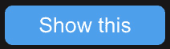

# 9

# 高级 Vue.js 技术介绍 – 插槽、生命周期和模板引用

到目前为止，我们已经了解了 Vue.js 提供的基本功能和技巧。例如属性和计算属性是 Vue.js 框架的基础，您在用 Vue.js 开发下一个应用程序时将每天使用它们。在本章中，我们将介绍一些我称之为“高级”的功能。这不是因为它们的复杂性而被描述为“高级”，而是因为您在日常使用中不太可能使用它们。例如插槽和模板引用用于解决特定的用例，并不期望在您的常规任务中遇到，而更可能用于在项目过程中发生的较少的特定情况。您在本章中学到的知识可能不会立即使用，所以记住它的存在，并在需要任何这些功能时确保您能回想起它。

在本章中，我们将向我们的伴侣应用程序添加更多功能。首先，我们将增强我们的基本按钮以引入插槽的概念。接下来，我们将创建一个共享布局，使用命名插槽在我们的静态页面中使用。然后，我们将关注添加一个新功能，这将使我们能够添加新帖子。在这样做的时候，我们将学习如何使用模板引用来访问`CreatePost.vue`组件。为了结束本章，我们将构建一个全新的功能，这将使我们能够展开和折叠侧边栏。在这样做的时候，我们不仅将遍历 Vue.js 的生命周期钩子，而且还将利用这个机会回顾之前学过的技术，如方法、动态类和指令。

本章将分为以下几部分：

+   插槽的力量

+   使用模板引用访问组件元素

+   深入了解真实应用的生命周期

到本章结束时，您将能够使用提供插槽的组件，并开发暴露一个或多个插槽的组件。您还将能够使用模板引用在组件内访问元素，并最终在使用生命周期时做出更好的决策，以确保应用程序无 bug。

# 技术要求

在本章中，分支被命名为`CH09`。要拉取此分支，请运行以下命令或使用您选择的 GUI 来支持您进行此操作：

```js
git switch CH09.
```

本章的代码文件可以在[`github.com/PacktPublishing/Vue.js-3-for-Beginners`](https://github.com/PacktPublishing/Vue.js-3-for-Beginners)找到。

# 插槽的力量

在本书的前几章中，我们学习了如何使用属性和事件让父组件和子组件相互通信。这种通信方式不是很灵活，因为组件暴露信息的唯一方式是创建一个新的属性。

在许多情况下，属性提供的僵化性正是我们想要确保组件正确渲染的，但有时需要更多的灵活性，这就是插槽发挥作用的地方。

让我们考虑我们的基础按钮组件。它的外观和感觉由其属性定义，其值也是如此，但如果我们想在值之前创建一个带有图标的按钮会怎样呢？

根据我们对 Vue.js 的当前了解，我们会求助于创建一个新的属性 `icon`（`prependIcon`），它接受一个图标。然后，进一步的要求可能需要我们在值之后添加一个图标，因此我们又会求助于一个新的属性 `icon`（`appendIcon`）。每个额外的请求可能会导致一个新的属性，使得我们的组件难以维护。幸运的是，所有上述要求都可以使用插槽来解决。

插槽将你的组件变成一个包装器，允许人们传递任何任意的 HTML 或组件到其中。插槽并不是什么新东西；实际上，原生 HTML 提供了非常类似的功能，你一直在不知不觉中使用它。`<div>` 只是一个包装其他元素的容器，`<h1>` 可以包含文本，也可以在其内容中包含其他元素，以此类推。

Vue.js 插槽也提供了原生按钮、标题或 span 提供的相同功能。

让我们考虑一下在 HTML 中如何使用按钮。我们会用 `<button>` 打开元素，然后在其内容中添加一些东西——这可以是简单的文本，另一个元素，或者两者都有。最后，我们会用 `</button>` 关闭元素，就像这样：

```js
<button>
  <icon src="img/myIcon" />
  My button with icon
</button>
```

好吧，`My button` 文本和之前代码片段中显示的 `<icon>` 元素，在 Vue.js 中我们称之为**插槽内容**。正如之前提到的，使用属性是确保传递给组件的值是特定类型的一种很好的方式，但这种优势很容易变成劣势，使得组件变得相当僵化。

让我们通过修改 `TheButton.vue` 来看看如何使用插槽。我们将移除名为 `value` 的属性，并用一个插槽来替换它，这样我们的按钮将像原生 HTML 按钮一样工作。

让我们修改我们的组件：

```js
<template>
  <button :class="theme">
    <slot></slot>
  </button>
</template>
<script setup>
defineProps({
  value: {
    type: [String, Number],
    required: true
  },
  width: {
    type: String,
    default: "100px"
  },
  theme: {
    type: String,
    default: "light",
    validator: (value) => ["light", "dark"].includes(value)
  }
})
</script>
```

首先，我们从 `defineProps` 对象中移除了名为 `value` 的属性，然后在组件模板中添加了一个 Vue.js 元素 `<slot>` 来添加一个插槽。这个元素不需要导入，因为它可以在全局范围内访问。

现在，我们需要找到所有 `TheButton` 的出现，并替换之前使用属性值时的语法：

```js
<TheButton value="Example value" />
```

我们需要用新的插槽来替换它：

```js
<TheButton>Example value</TheButton>
```

上述更改需要在 `CreatePost.vue`、`SocialPost.vue` 和 `Sidebar.vue` 中发生。

插槽不仅仅是文本

记住，现在我们的组件值不仅接受文本，还可以接受其他 HTML 元素和 Vue 组件。

现在我们已经了解了插槽的基础知识，让我们继续深入学习，从插槽默认值开始。

## 为插槽添加默认值

Vue.js 的插槽不仅允许我们复制原生的功能，还提供了一些额外功能，其中之一是能够向我们的插槽添加默认值。这可以是对话框标题或表单提交按钮中显示的文本；默认值可以帮助你保持代码的整洁。

为你的插槽添加默认值非常简单；你只需要直接在`<slot>`声明中添加你想要的值。如果没有传递其他替代值给组件，这个值将被使用，否则，它将被移除并从接收到的插槽中覆盖。

让我们通过一个快速示例来了解默认插槽的声明和使用。

首先，我们将向`TheButton.vue`添加一个默认文本`点击我`：

```js
<template>
  <button :class="theme">
    <slot>Click Me</slot>
  </button>
</template>
```

现在我们已经添加了默认值，我们的按钮将自动显示新的文本，在这种情况下没有传递内容。

要看到默认插槽的实际效果，我们需要调用我们的按钮而不包含任何插槽内容，因此代码看起来是这样的：

```js
<TheButton></TheButton>
```

这将渲染我们的默认文本。


图 9.1：默认按钮，值为“点击我”

文本只是作为一个后备；实际上，在插槽内添加一个值将覆盖文本：

```js
<TheButton>Show this</TheButton>
```

正如我们之前看到的，在插槽中添加文本将显示它，就像你预期在原生的 HTML 元素中一样：



图 9.2：默认按钮，值为“显示此内容”

## 插槽与属性对比

在我们学习关于插槽的另一个特性之前，我想说几句话来澄清为什么我们需要两种方法（插槽和属性）来实现非常相似的结果。

插槽和属性解决了两种不同的用例，并且两者都有优点和缺点：

+   **插槽**：这些主要用于需要值灵活性的组件。这些组件仅提供结构，例如对话框或按钮或标题等结束元素。

+   **属性**：这些用于需要精细控制传递给它们的元素的元素。这可能是由于某些样式会因不同内容而破坏，或者因为需要验证或格式化接收到的值。

我们可以使用原生的 HTML 元素来强调我们刚刚定义的差异。对于插槽，我们有标题标签，如`<h1>`和`<h2>`。这些是非常通用的元素，它们提供样式，主要是以字体大小和间距的形式为其内容提供样式。这个元素需要灵活性，使用插槽是完美的。事实上，原生的标题元素就像插槽一样包裹其内容。

另一方面，我们有 `<input>` 元素来证明属性值（Vue.js 中的属性）的有用性。输入元素需要一个特定的属性，称为 `value`。输入字段提供的值只接受字符串或数字作为其值。提供接受属性的语法，`<input value="text" />` 确保传递给输入字段的值是经过验证的。

## 提供多个带有命名插槽的插槽

如您可能已经注意到的，插槽有很多有用的功能，对于构建复杂组件非常有用。在前一节中，我们看到了如何定义单个插槽，但 Vue.js 提供的不仅仅是这些。

实际上，Vue.js 中的组件可以同时定义多个插槽。这是通过一个称为**命名插槽**的功能实现的。

命名插槽的常见用途是定义布局。您可以定义一个接受侧边栏、主要内容以及页脚的布局，然后允许用户在各个部分中传递他们认为合适的内容。另一个很好的例子是一个提供标题和副标题的主要英雄组件，或者是一个提供标题及其内容的对话框组件。

让我们为我们的静态内容创建一个非常基本的布局。我们打算将新组件存储在一个名为 `templates` 的文件夹中，并命名为 `StaticTemplate.vue`。相对 URL 将是 `src/components/templates/StaticTemplate.vue`：

```js
<template>
  <h1></h1>
  <main></main>
  <footer></footer>
</template>
<style scoped>
h1, main, footer {
  grid-column-start: 1;
  grid-column-end: 3;
}
h1{
  align-items: center;
}
main {
  padding: 16px 32px;
}
footer {
  border-top: solid 1px lightgray;
}
</style>
```

我们的布局将包含一些基本的样式，这些样式是创建正确间距并显示各个部分之间差异所必需的。模板还包括三个不同的部分：使用 `<h1>` 定义的标题，使用 `<main>` 元素定义的主要内容，以及最后的 `<footer>`。

现在，让我们给我们的模板添加一个命名插槽。命名插槽的语法与普通插槽非常相似，因此也是使用 `<slot>` 元素定义的，但增加了一个 `name` 属性。为了强调之前的学习材料，我们将为页脚提供一个默认值：

```js
<template>
  <h1><slot name="heading"></slot></h1>
  <main><slot name="default"></slot></main>
  <footer>
    <slot name="footer">
    Copyright reserved to Vue.js for beginners
    </slot>
  </footer>
</template>
```

在前面的代码中，`StaticTemplate.vue` 文件可以调用，并具有传递三个不同部分的可能性。让我们查看 `Views` 文件夹中的 `AboutView.vue` 页面，并尝试使用这个新布局。

命名插槽的语法与默认插槽略有不同，因为我们需要定义我们正在定义的章节的实际名称。要使用命名插槽，您使用 `<template #slotName></template>` 语法。

让我们尝试将其应用到我们的 `AboutView` 页面上：

```js
<template>
<StaticTemplate>
  <template #heading>About Page</template>
  <template #default>
    This is my content and default slot
  <template>
</StaticTemplate>
</template>
<script setup>
import StaticTemplate from '../components/templates/staticTemplate.vue'
</script>
```

首先，我们在脚本部分导入了新组件，然后就像使用 `<div>` 或 `<span>` 一样使用该组件。最后，我们通过定义标题和默认部分来为我们的插槽添加内容。由于**关于页面**不需要覆盖页脚，所以我们将其排除在我们的实例之外，以便可以渲染默认值。

如果我们访问“[`localhost:5173/about`](http://localhost:5173/about)”上的**关于页面**，我们应该看到以下内容：


图 9.3：使用新布局的关于页面

页面正在显示我们预期的所有三个部分。

默认插槽不需要`<template #default>`语法

如果我们愿意，我们可以在不使用`<template #default>`的情况下调用默认插槽，但这不是一个建议的方法，因为它会产生难以阅读的代码，并且混合了不同的方法。

Vue.js 插槽实现提供的一个额外功能是**作用域插槽**。这是一个非常高级的技术，允许你定义将子组件的作用域暴露给其父组件的插槽。由于它们的复杂性，这些内容不会在本书中讨论。

插槽是一个非常强大的技术，它帮助我们使组件更容易使用，提高其可读性，并提供增强的灵活性。就像其他每个特性一样，插槽也有自己的优缺点，并且应该只在需要时使用。使用插槽带来的灵活性可能会对 UI 产生不期望的副作用，有时通过使用属性来强制设置值，可以更容易地控制组件的布局。

到目前为止，我们通过将它们与原生 HTML 元素中现有的功能进行比较，介绍了插槽的概念，然后学习了定义和使用默认插槽所需的语法。之后，我们比较了插槽和属性，并试图区分在哪些情况下一种方法可能比另一种方法更可取。最后，我们学习了如何为插槽定义默认值以及定义多个具有命名插槽的可能性。

我们将继续本章，介绍另一个高级主题，介绍如何使用模板引用来访问子组件或 HTML 元素。

# 使用模板引用访问组件元素

在本节中，我们将通过学习如何访问 DOM 元素来提高我们组件的控制能力。

当我最初开始学习 Vue.js 时，我被它在不访问 DOM 元素的情况下能完成多少事情所震惊。Vue.js 引擎的结构是这样的，我们可以使用 props、data、methods 和计算属性来完成所有基本操作。

就像其他所有事情一样，有时候我们可能需要一些额外的控制，而这可以通过使用`模板引用`来实现。使用这个特性会暴露出定义了引用的 DOM 元素。这和直接使用原生 JavaScript 提供的`querySelector`或`getElementById`方法是一样的。

相同的引用，不同的用法

你可能想知道为什么我们学习 Refs，因为我们已经在书的开始部分学习了它来定义组件的私有属性。嗯，这个 Refs 是不同的。它是用相同的语法定义的，但它将持有 HTML 元素或组件的值，而不是字符串和数字等原始数据。

Refs 可用于两种不同的场景。第一种是访问原生元素以访问其原生 API；这样的事情之一可能是聚焦一个元素或触发输入字段的原生验证。第二种是访问另一个 Vue 组件或包以公开方法或其内部信息。一个常见的场景是需要设置或获取 WYSIWYG（所见即所得）或代码编辑器的值。第二种场景不是常见做法，仅应在紧急情况下使用。不建议使用模板引用访问子组件的原因是它将两个元素耦合在一起，而在基于组件的架构中，这应该始终避免。

## 专注于 onMounted 元素

让我们通过学习如何获取输入字段的引用并在页面加载时将其聚焦来开始玩转模板引用。聚焦功能原本可以通过`autofocus`属性实现，但我们将手动开发这个功能来展示 Refs 的使用。

我们将在`CreatePost.vue`中工作，并自动聚焦用于撰写新帖子的`textarea`。

我们需要对组件进行三项修改。首先，我们将定义一个`ref`，就像我们在整本书中学到的。接下来，我们将模板引用分配给`textarea`，并使用`onMounted`生命周期访问该元素并聚焦组件：

```js
<template>
  <form>
    <h2>Create a Post</h2>
      <textarea rows="4" cols="20" ref="textareaRef">
      </textarea>
      <TheButton>Create</TheButton>
  </form>
</template>
<script setup>
  import { onMounted, ref } from 'vue';
  import TheButton from '../atoms/TheButton.vue';
  const textareaRef = ref(null);
  onMounted( () => {
    textareaRef.value.focus();
  });
</script>
```

使用 Refs 的顺序是特定的；我们首先创建`const textareaRef = ref(null)` Ref，此时 Ref 将是 null。然后我们将 ref 分配给组件内的一个特定元素；在我们的场景中，我们将其添加到`textarea`。由于组件尚未渲染，元素尚未在页面上存在，因此 Ref 仍然是空的。最后，我们在`onMounted`生命周期中触发我们的逻辑。因为`onMounted`生命周期是在组件完全渲染后触发的，所以 Ref 将完全定义并准备好使用。

在我们继续之前，我想关注代码块中的三个更多部分。首先是一个提醒，Vue.js 中的 Refs 需要附加 `.value` 才能访问它们的内部值。这适用于正常的 Refs，如字符串和数字，以及我们在本书的这一部分中介绍的模板 Refs。其次，我想强调，与元素关联的模板 Ref（在我们的例子中是 `textareaRef`）在 `onMounted` 触发之前将是 null。这意味着如果我们将其用于计算属性或方法，我们需要确保检查 null 值以避免错误。最后是关于命名约定的问题。模板 Ref 的名称和用于 HTML 元素的名称必须匹配才能正常工作。模板 Ref 变量（const textareaRef）和用于 HTML 属性（ref="textareaRef"）的名称必须匹配才能成功工作。

Refs 仅适用于特殊情况

Vue.js 提供了我们大部分需要的现成功能，因此 Refs 不应过度使用。Refs 的使用应仅限于特定的用例，而不是成为常规。如果你在项目中发现 Refs 的使用次数超过几次，那么你很可能误用了其他 Vue.js 功能。

## 从原生验证访问

本节将关注高级主题；我们将通过实现另一个使用模板 Ref 访问元素的示例来重述我们刚刚介绍的主题。我们将继续处理创建帖子的代码，通过添加一些使用 HTML 表单输入提供的原生 HTML 验证来执行验证。

我们将继续在 `CreatePost.vue` 中工作。首先，我们将在 `<textarea>` 元素内添加一些特定的验证：

```js
<textarea
  rows="4"
  cols="20"
  ref="textareaRef"
  required="true"
  minlength="10"
></textarea>
```

我们将 `textarea` 设置为必填，并定义了最小字符长度为 `10`。接下来，我们将创建一个新的 Ref，这次我们将获取页面中主 `<form>` 元素的访问权限：

```js
<template>
<form ref="createPostForm">
   ...
</form>
</template>
<script setup>
import TheButton from '../atoms/TheButton.vue';
import { onMounted, ref } from 'vue';
const textareaRef = ref(null);
const createPostForm = ref(null);
```

就像我们之前的例子一样，创建 Ref 需要两个步骤。首先，我们给一个元素添加一个 Ref 属性，然后创建一个与 Ref 名称匹配的常量。

在这一最后步骤中，我们将创建一个在表单提交时被调用的方法，并使用我们新创建的模板 Ref 来访问原生的表单验证 API：

```js
<template>
  <form ref="createPostForm" @submit="createPost">
    <h2>Create a Post</h2>
    <textarea
      rows="4"
      cols="20"
      ref="textareaRef"
      required="true"
      minlength="10"
    ></textarea>
    <TheButton>Create Post</TheButton>
  </form>
</template>
<script setup>
import TheButton from '../atoms/TheButton.vue';
import { onMounted, ref } from 'vue';
const textareaRef = ref(null);
const createPostForm = ref(null);
const createPost = (event) => {
  event.preventDefault();
  if(createPostForm.value.reportValidity()){
    //code to create post
  };
}
...
```

为了实现这一点，我们使用了在 *第六章* 中获得的事件知识，并在表单提交时触发了名为 `createPost` 的方法。然后，我们创建了一个方法来阻止原生提交触发，并使用 `createPostForm` Ref 通过 `createPostForm.value.reportValidity()` 检查表单的有效性。

此方法将返回一个布尔值（因此是 `true` 或 `false`），取决于表单是否有效，并且它还会在屏幕上显示原生错误消息。

让我们启动我们的应用程序，并尝试通过一个空输入来触发表单：


图 9.4：在 textarea 上显示的本地 HTML 验证错误

我们将保留这个表单的原样，即使它不完全功能，因为提交表单所需的代码将在*第十二章*中完成。

在本节中，我们了解到 Ref 不仅用于定义组件值，还用于保存 HTML 元素的值。我们通过开发在`CreatePost.vue`中创建新帖子所需的功能和验证来应用这项新学到的技术。最后，我们迭代了定义 Refs 的流程以及它如何需要完成挂载状态才能使其可访问。

在下一节中，我们将添加扩展和最小化应用侧边栏的能力，并迭代生命周期概念。

# 深入研究真实应用的生命周期

生命周期不是一个新概念，在本书中被提及过一两次，但由于其重要性，通过向我们的伴侣应用添加更多功能来迭代它们是个好主意。

在本节中，我们将添加新的功能，使我们能够扩展和最小化应用的左侧边栏，并将值存储在`localStorage`中，以确保在刷新时用户偏好保持持久。我们将学习如何更好地理解生命周期可以改善我们应用提供的用户体验。

在我们深入代码本身之前，让我们思考一下实现这个新功能所需的步骤。思考问题有助于你记住我们所学 Vue.js 框架的所有不同方面，并支持你实现任何可能存在的知识或理解上的缺乏。

要完成使侧边栏能够折叠和展开的任务，我们需要做以下几步：

1.  添加用户触发此操作的 UI。

1.  添加一些样式以改善侧边栏的外观和感觉。

1.  创建一个新的值来保存侧边栏的状态。

1.  扩展侧边栏以对不同状态有不同的渲染。

1.  添加处理侧边栏状态变化并保存值的逻辑。

1.  最后，在加载时读取用户偏好并应用到组件上。

列表可能看起来非常长，但这些都是你可以不依赖我的帮助就能完成的小任务。让我们通过着手新的 UI 更改开始我们的工作。

## 向侧边栏添加条件渲染

让我们从使用`v-if`和`v-else`重述 Vue.js 指令开始，有效地显示两种不同的视图。一个将显示展开的侧边栏，而另一个将显示一个仅包含展开侧边栏按钮的最小布局。

所有后续的开发都将发生在包含我们侧边栏所需逻辑的 `SideBar.vue` 文件中。在我们对其布局进行更改之前，我们将导入两个新图标，`IconLeftArrow` 和 `IconRightArrow`：

```js
<script setup>
import { ref } from 'vue';
import TheButton from '../atoms/TheButton.vue'
import IconLeftArrow from '../icons/IconLeftArrow.vue'
import IconRightArrow from '../icons/IconRightArrow.vue'
...
```

接下来，我们将使用 `v-if/v-else` 提供的条件逻辑添加两个布局：

```js
<template>
<aside>
  <template v-if="">
    <IconRightArrow />
  </template>
  <template v-else>
    <h2>Sidebar</h2>
    <IconLeftArrow />
    <TheButton>Create post</TheButton>
    <div>Current time: {{currentTime}}</div>
    <TheButton @click="onUpdateTimeClick">Update Time</TheButton>
  </template>
</aside>
</template>
```

`<aside>` 包含两个不同的块，都由 `<template>` 元素界定。第一个块只包含右箭头图标，将用于显示我们的折叠布局，而另一个布局包括我们在开始修改之前组件中存在的现有代码，并添加了左箭头图标。

如果你仔细查看前面的代码，你可能意识到某些内容缺失或不完整。事实上，如 if/else 这样的条件语句需要一个假设，而我们的代码中目前缺少这个假设：`<template v-if="" >`。

为了使该语句生效，我们需要添加一个条件，该条件将由 Vue.js 编译器评估以显示正确的布局。我们将创建一个名为 `closed` 的 R`ef`，它将保存一个布尔值。这个变量将用于我们的 if/else 语句，以定义应该显示哪个布局。

为了实现这一点，我们首先在我们的脚本部分定义 `ref`：

<script setup>

```js
import { ref } from 'vue';
...
const currentTime = ref(new Date().toLocaleTimeString());
const closed = ref(false);
```

接下来，我们在之前定义的 `v-if` 指令中使用这个新变量：

```js
<template>
<aside>
  <template v-if="closed">
    <IconRightArrow />
  </template>
```

由于 `closed` 的值被硬编码为 `false`，侧边栏将始终显示展开布局。在下一节中，我们将编写切换两种布局所需的逻辑。

## 编写处理侧边栏状态的逻辑

为了能够在两个不同的侧边栏视图中切换，我们需要提供用户改变 `closed` 值的能力。我们将使用上一节中添加的左箭头和右箭头图标来触发用户输入的点击事件。该事件将启动我们即将调用的 `toggleSidebar` 方法。

为了编写这段代码，我们首先将事件处理程序添加到两个图标上：

```js
<template v-if="closed">
  <IconRightArrow @click="toggleSidebar" />
</template>
<template v-else>
  <h2>Sidebar</h2>
  <IconLeftArrow @click="toggleSidebar" />
  <TheButton>Create post</TheButton>
...
```

然后，我们在组件的 `<script>` 部分声明 `toggleSidebar` 方法：

```js
const toggleSidebar = () => {
  closed.value = !closed.value;
}
```

该方法不接受任何参数，只是通过将其设置为 `closed` 当前值的相反来重新声明 `closed` 的值。这生成了一种在 `true` 和 `false` 之间切换布尔值的逻辑。

如果你现在运行应用程序，你应该能够在两种布局之间切换。下一步涉及向当前仍然显示全尺寸侧边栏的折叠布局添加一些样式。

让我们在我们的组件中添加一些样式：

```js
<template>
<aside :class="{ 'sidebar__closed': closed}">
  <template v-if="closed">
    <IconRightArrow class="sidebar__icon" @click="toggleSidebar" />
  </template>
  <template v-else>
    <h2>Sidebar</h2>
    <IconLeftArrow class="sidebar__icon" @click="toggleSidebar" />
    <TheButton>Create post</TheButton>
    <div>Current time: {{currentTime}}</div>
    <TheButton @click="onUpdateTimeClick">Update Time</TheButton>
  </template>
</aside>
</template>
<script setup>...</script>
<style scoped>
aside {
  display: flex;
  flex-direction: column;
  position: relative;
  &.sidebar__closed{
    width: 40px;
  }
  .sidebar__icon{
    position: absolute;
    right: 12px;
    top: 22px;
    cursor: pointer;
  }
}
</style>
```

为了更好地样式化我们的两个布局，我们声明了两个类。第一个是 `sidebar__closed`，用于减小侧边栏的宽度。第二个是 `sidebar__icon`，用于定义箭头的大小和位置。

`sidebar__icon` 应用于两个图标，而 `sidebar__closed` 仅在 `closed` 的值为 `true` 时分配给 `<aside>`。为此，我们使用了 `:class="{ 'sidebar__closed': closed}"` 语法。这种语法很有用，因为它允许你在满足特定条件时轻松地应用类，从而创建复杂的样式。

在这个阶段，侧边栏不仅功能正常，而且其折叠和展开布局也被正确地样式化了。剩下要做的就是使数据 *持久化*。在开发中，我们描述数据为持久化，当其值在浏览器刷新后仍然保持一致时。


图 9.5：展开的侧边栏


图 9.6：折叠的侧边栏

现在侧边栏的外观已经得到改善，是时候让它刷新后也能保持其价值了。

## 在 localStorage 中保存和读取用户偏好

在这个阶段，即使侧边栏逻辑完全正常工作，其数据还没有持久化。实际上，如果你将侧边栏设置为折叠状态并刷新页面，你会看到它会回到默认的展开视图（我们用来初始化 `closed` 引用的值是 `false`）。

为了实现持久性，我们将使用 `localStorage` 来保存我们的值，并在页面加载时重新读取它。

在我们查看代码之前，我们应该尝试定义实现这一目标的最佳方法。实际上，本节是以 Vue.js 生命周期命名的，但到目前为止，我们还没有使用它们。

为什么正确使用生命周期很重要？

在继续前进之前，花几分钟时间尝试理解使用不正确的生命周期从 `localStorage` 加载数据的后果。考虑不同的生命周期，它们何时被触发，以及它们可能对应用程序产生的影响。

如我们在 *第二章* 中所学，存在不同的生命周期，支持不同的用例。在我们的场景中，我们计划使用一个生命周期来读取我们的 `closed` 变量的值，并将其应用于组件。在执行此类操作时，你通常应该问自己几个问题。第一个问题是数据是否异步，第二个问题是数据是否在应用程序渲染到屏幕之前就必需。

每个生命周期都在组件生命周期的不同阶段发生。例如，`beforeCreate` 在组件甚至创建之前就被触发，而其他如 `onMounted` 则在组件完全挂载到 DOM 中后触发，因此选择正确的生命周期对于我们的特定场景非常重要。

在我们的情况下，数据是从 `localStorage` 中获取的，这是一个同步操作；它需要在组件完全渲染或显示之前，也称为“在挂载之前”。

最适合我们需求的生命周期是`onBeforeMount`。这将触发在组件渲染之前，但在所有方法和 Refs 初始化之后。

让我们将这个逻辑添加到我们的组件中：

```js
<script setup>
import { ref, onBeforeMount } from 'vue';
import TheButton from '../atoms/TheButton.vue'
import IconLeftArrow from '../icons/IconLeftArrow.vue'
import IconRightArrow from '../icons/IconRightArrow.vue'
const currentTime = ref(new Date().toLocaleTimeString());
const closed = ref(false);
const toggleSidebar = () => {
  closed.value = !closed.value;
  window.localStorage.setItem("sidebar", closed.value);
}
...
onBeforeMount( () => {
  const sidebarState = window.localStorage.getItem("sidebar");
  closed.value = sidebarState === "true";
});
</script>
```

为了实现持久性，我们首先从 Vue 包中导入了`onBeforeMount`方法，然后每次触发`toggleSidebar`方法时，我们都保存`closed` Ref 的值。为了实现这一点，我们使用了`window`对象中可用的`localStorage.setItem`方法。最后，我们使用`onBeforeMount`从 localStorage 中读取值，并将其分配给`closed` ref。

在这个阶段，我们的应用不仅允许用户切换侧边栏，而且其值在刷新时也会保持持久。

在完成本章之前，我想重点强调为什么正确使用生命周期很重要。实际上，如果我们使用了另一个生命周期，比如`onMounted`，那么在读取并应用`localStorage`的值之前，侧边栏就已经被完全渲染（错误地）了。这类 bug 的主要问题是，在开发过程中它们可能不会复现，或者非常难以发现。

在创建将要改变组件视图的代码时，确保你已经使用了正确的生活周期，如果处理异步数据，那么在组件的其他部分执行之前，必须定义正确的加载状态，或者等待 promise 完成。这种做法一开始可能难以理解，但代码实践和错误将帮助你提高对 Vue.js 组件的理解，并提高你的技能。

# 摘要

在本章中，我们介绍了一些高级主题，例如插槽、生命周期和 refs。本章的目标并不是提供你在这方面的所有信息，而是让你对这些概念有所了解，以便你在接下来的开发中能够实践它们，并在扩展你对 Vue.js 知识的过程中继续学习。

我们已经学习了如何使用插槽来扩展组件的灵活性。插槽和命名插槽可以用于简单的情况，例如`<button>`、样式元素，如`<div>`，或者用于更高级的技术，例如定义具有不同区域的页面布局。

然后，我们继续讨论模板`Ref`，这是一个我们在之前章节中部分介绍过的主题。我们学习了如何使用模板`Ref`来访问组件的 DOM 元素。这被定义为一种高级技术，因为，在 Vue.js 提供的所有功能中，你很少需要以这种方式使用模板`Ref`。

最后，我们再次回顾了生命周期。Vue.js 的生命周期非常重要，需要大量的实践来帮助你理解它们的用法以及，更重要的是，它们的执行顺序。我们在我们的伴侣应用中增加了一个额外功能，以便我们能够理解其一个使用案例，并思考如果使用不同的生命周期会产生什么样的可能结果。

在下一章中，我们将学习如何使用**vue-router**定义多个路由。对于大多数应用来说，定义多个页面是一个必要的步骤，而**vue-router**提供了一个非常简单的语法，这将帮助我们在我们的小伴侣应用中实现这一功能。
