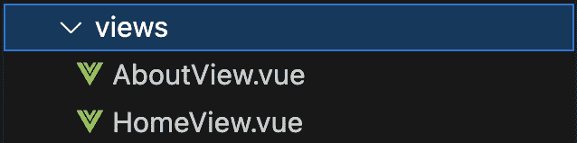
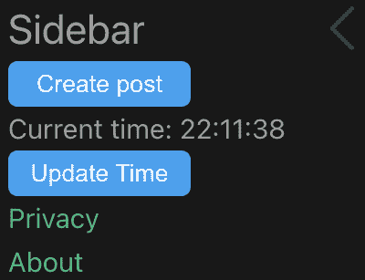
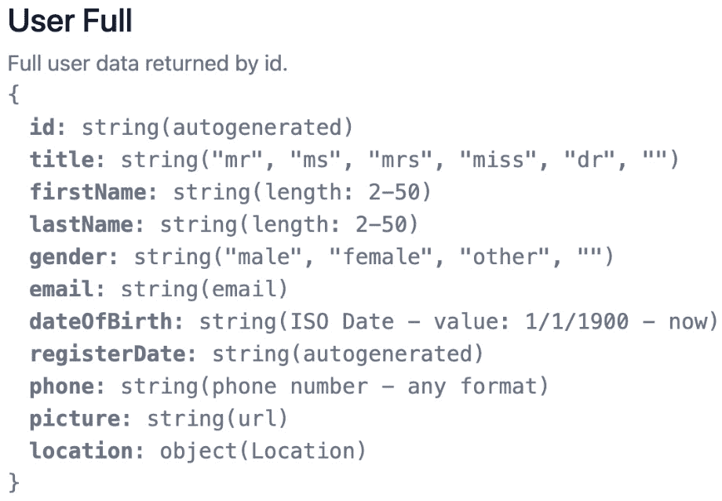
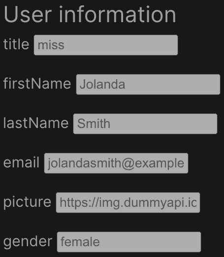
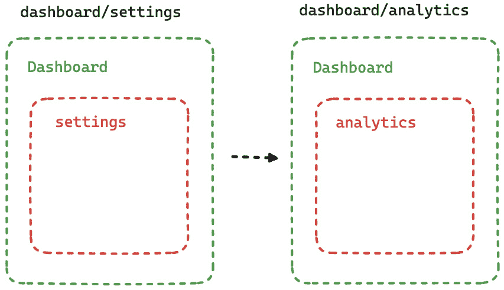

# 10

# 使用 Vue Router 处理路由

**单页应用程序**（**SPAs**），例如 Vue.js 提供的，基于单页面的架构。这种方法防止页面完全重新加载，并提供了改进的用户体验。

随着您的应用程序增长，您将需要在应用程序中创建不同的视图。即使术语 *SPA* 可能会导致您认为您的应用程序将建立在单个页面上，但事实远非如此。

大多数框架，包括 Vue.js，都提供旨在在其他框架（如 PHP、.NET 等）中重现路由系统的包。SPA 框架提供的路由功能提供了两者的最佳结合。它为开发者提供了一个完整的路由工具包，同时仍然提供了 SPA 框架预期的相同用户体验。Vue.js 中使用的路由包称为 vue-router。

在本章中，您将学习如何在您的 Vue.js 应用程序中使用路由。在本章结束时，您将很好地理解 vue-router 及其配置，以及路由是如何定义和使用的。您将能够创建基本、动态和嵌套路由，并使用不同的方法导航到它们。最后，您将学习如何使用 `redirect` 和别名来提高用户体验。

我们首先将通过介绍其配置来了解 vue-router。然后，我们将通过创建几个静态页面来学习如何实现我们的第一个路由和路由导航。接下来，我们将通过定义用户个人资料页面来介绍动态路由。然后，我们将通过使用嵌套路由将用户视图拆分为用户个人资料和用户帖子来添加另一个导航级别。最后，我们将通过熟悉 `redirect` 和 `alias` 来完成本章。

本章将分为以下部分：

+   介绍 vue-router

+   在路由间导航

+   动态路由匹配

+   嵌套路由

+   使用 `alias` 和 `redirect` 重复使用路由

# 技术要求

在本章中，该分支被称为 `CH10`。要拉取此分支，请运行以下命令或使用您选择的 GUI 来支持您进行此操作：`git switch CH10`。

本章的代码文件可以在 [`github.com/PacktPublishing/Vue.js-3-for-Beginners`](https://github.com/PacktPublishing/Vue.js-3-for-Beginners) 找到。

# 介绍 vue-router

vue-router 是由 Vue.js 核心团队和社区成员构建和维护的官方路由包。就像我们在 Companion App 中介绍的其他包一样，当我们使用 Vite 初始化应用程序时，vue-router 也自动为我们设置好了。

在本节中，我们将了解 vue-router 所需的文件结构和配置，并介绍在处理路由时使用的部分语法。

vue-router 提供了一组标准的、从路由器期望的功能。所以，如果您在其他语言中以前使用过路由器，我们将涵盖的大部分内容听起来可能很熟悉，但阅读它仍然值得，因为语法可能不同。

## 了解 vue-router 配置

让我们先学习如何最好地配置应用程序中的路由。实际上，即使 vue-router 通常由**createVue**和**Vite**等工具预设，了解它在幕后是如何设置的仍然很重要。

插件工作所需的配置存储在一个通常命名为`router.js`的文件中，或者存储在名为`router`的文件夹中的`index.js`文件中。

在我们的案例中，文件存储在`router`文件夹内。

所有插件都需要在`main.js`中注册

所有插件必须在`main.js`中注册后才能工作。因此，如果您想找到当前在您的应用程序中加载的插件的配置文件或信息，您可以打开`main.js`文件并搜索`app.use(pluginName)`语法。

让我们看看您可能会在`index.js`文件中找到的语法：

```js
import { createRouter, createWebHistory } from 'vue-router'
import HomeView from '../views/HomeView.vue';
const router = createRouter({
  history: createWebHistory(import.meta.env.BASE_URL),
  routes: [{
    path: '/',
    name: 'home',
    component: HomeView
  }]
})
export default router
```

让我们回顾一下前面配置的重要点。首先，我们可以谈谈`createRouter`方法。这个由 vue-router 包提供的方法创建了一个可以附加到 Vue 应用程序的 router 实例。此方法期望一个包含 router 配置的对象。

接下来，是时候看看配置对象中的第一个条目，`history`。`history`属性定义了您的应用程序如何在不同的页面之间导航。在标准应用程序中，这通常是通过将网站 URL 更改为所需的页面来实现的——例如，通过将`/team`附加到 URL 来访问团队页面。让我们看看可以用来设置`history`属性的一些不同的配置。

### Hash 模式

这种方法是通过使用`createWebHashHistory`实现的。这个方法由 vue-router 包提供，并且它是实现起来最简单的一个，因为它不需要任何服务器端配置。当使用 hash 模式时，实际的 hash（`#`）将被添加到基础 URL 和我们的路由之间。使用这种配置，访问团队页面可以通过访问`www.mywebsite.com#team`来完成。

这种方法可能会对您的 SEO 产生负面影响，所以如果您的应用程序是公开访问的，您应该投入时间并设置下一个可用的方法，即 web 历史模式。

### HTML5/web 历史模式

HTML5 模式可以通过使用`createWebHistory`方法进行配置。使用这种历史模式，我们的网站将表现得像一个标准网站，其路由将直接在网站 URL 之后提供（例如，`www.mywebsite.com/team`）。

由于 SPA 网站是建立在单个页面上的（因此得名），它们可以从一个单一的端点（网站基础 URL）提供应用程序。因此，部署我们的网站并直接尝试访问团队页面会导致`404`页面（未找到）。

在今天的托管网站上解决此问题是一个简单任务，因为所需的一切只是一个通配符规则，确保网站导航被引导到 SPA 入口点。如果您想使用这种方法，稍作搜索就能找到您在托管提供商中正确设置所需的说明。

在我们的情况下，我们使用 Web 历史记录。这是我的默认历史设置，不仅因为它提高了 SEO，而且因为它已经是我们网站导航的正常方式多年了，我喜欢保持一致性。

最后，是时候介绍我们的配置中的最后一个条目：路由。

### 定义路由

我们已经到达了我们的路由配置中最重要的一部分，即实际的路由。单词 *route* 定义了我们的应用程序将用户引导到特定页面的能力。因此，当声明路由时，我们定义了用户可以在我们的网站上访问的页面。

要声明一个路由，我们需要两个信息，`path` 和 `component`，但我通常更喜欢总是包括第三个称为 `name` 的信息。

`path` 属性用于定义需要访问此路由才能加载的 URL。因此，如果用户导航到您网站的基路径，将传递 `/` 路径，而 `/team` 路径将可在 `www.mysite.com/team` 上访问。

`component` 属性是当访问此路由时预期要加载的 Vue 组件。最后，我们有 `name`。将此参数添加到所有我们的路由中是良好的实践，因为 `name` 用于程序化导航路由。我们将在稍后更详细地介绍这一点，因为我们将会学习如何在我们的应用程序内导航。

现在我们已经了解了路由的所有不同方面，让我们尝试解码之前共享的代码片段中声明的路由。这些片段显示了一个路由将用户引导到我们网站的基路径（`path` 是 `/`），`name` 值为 `home`，这将加载一个 `HomeView.vue` 组件。

到目前为止，我们已经学习了如何配置 Vue 实例，但在我们的路由能够正常工作之前，还需要一个额外的步骤：将 `RouterView` 添加到我们的应用程序中。

我们已经定义了给定 URL 要加载的组件，但我们还没有告诉我们的 Vue 应用程序在哪里加载此组件。

路由器的工作方式是在每次用户导航到不同的页面时替换我们应用程序的内容。所以，用非常简单的话说，路由器可以被定义为一个巨大的 `if/else` 语句，根据 URL 渲染组件。

为了允许路由器正确工作，我们将向我们的应用程序的主要入口点，即 `App.vue` 文件，添加一个名为 `<RouterView>` 的组件：

```js
<script setup>
  import { RouterView } from 'vue-router'
</script>
<template>
  <RouterView />
</template>
```

从这个阶段开始，vue-router 将接管我们配置中定义的路由定义所显示的屏幕内容。

## 创建我们的第一个视图

让我们尝试添加一个新的路由导航，用于一个名为 **隐私** 的静态页面。现在这仅仅包括一些占位文本。

要添加一个新页面，我们需要两个步骤：在我们的`routes`数组中定义一个路由，以及当访问该路由时将被加载的组件。

用作路由的组件存储在一个名为`views`的文件夹中。如果我们访问这个文件夹，我们会看到我们目前有两个视图设置，`Home`和`About`。



图 10.1：显示视图文件夹内容的文件夹树

我们将在我们的文件夹中添加一个名为`PrivacyView.vue`的新文件。将文件名与路由的名称匹配是常见的。因为这个文件将是静态的，所以当我们学习插槽时，我们将重用定义在*第九章*中的布局。

用于定义静态页面的布局`StaticTemplate.vue`接受三个不同的命名插槽：一个标题、一个页脚以及用于其主内容的默认模板。我们的`PrivacyView.Vue`文件内容应该定义如下：

```js
<template>
  <StaticTemplate>
    <template #heading>Privacy Page</template>
    <template #default>
      This is the content of my privacy page
    </template>
  </StaticTemplate>
</template>
<script setup>
import StaticTemplate from '../components/templates/StaticTemplate.vue'
</script>
```

你可能已经注意到，文件内容仅定义了两个槽位（`heading` 和 `default`）并且缺少页脚。这是故意为之，因为页脚有一个我们想要显示的默认值。

在我们的新组件可以被访问和显示之前，我们需要将其添加到我们的路由中。让我们通过回到`router`文件夹内的`index.js`并添加我们的隐私页面路由到`routes`数组中来实现这一点：

```js
import { createRouter, createWebHistory } from 'vue-router'
import HomeView from '../views/HomeView.vue'
import AboutView from '../views/AboutView.vue'
import PrivacyView from '../views/PrivacyView.vue'
const router = createRouter({
  history: createWebHistory(import.meta.env.BASE_URL),
  routes: [
    {
        path: '/',
        name: 'home',
        component: HomeView
    },
    {
      path: '/about',
      name: 'about',
      component: AboutView
    },
    {
      path: '/privacy',
      name: 'privacy',
      component: PrivacyView
    }
  ]
})
export default router
```

我们的新页面视图首先作为普通 Vue 组件导入页面的顶部，然后分配给新的路由。正如我们之前提到的，路由需要三个值。首先，我们将`path`值设置为`/privacy`，然后我们定义了一个名为`privacy`的`name`值，用于未来的程序化导航，最后，我们将导入的`PrivacyView`组件分配给它。

在这些更改之后，我们应该可以通过访问`http://localhost:5173/privacy`来看到我们的页面：


图 10.2：隐私页面的截图

在本节中，我们学习了如何配置 vue-router，介绍了路由以及它们如何被应用程序用于渲染页面，最后讨论了`<RouterView>`以及 vue-router 如何使用它来向我们的访客显示正确的页面。

在下一节中，我们将学习如何在不同的路由之间进行导航。

# 在路由之间导航

到目前为止，我们已经学习了如何创建我们的路由以及如何通过在浏览器中直接加载 URL 来导航它们。在本节中，我们将学习如何在代码库中直接导航到不同的路由。

确实，我们可以使用简单的`<a>`标签来定义我们的导航，但这将迫使应用程序在每次导航时完全重新加载，这与 SPA 的整体架构相违背，SPA 提供了一种“无重新加载”的体验。

为了解决这个问题，vue-router 提供了组件和方法来处理导航而不会重新加载页面。

在使用 vue-router 时，可以通过两种不同的方式进行导航。一种使用名为`<router-link>`的组件，另一种则是通过`router.push()`程序化触发。让我们看看这两种方法的具体操作，并了解何时使用它们。

## 使用`<router-link>`组件

使用`<router-link>`组件在您的应用内进行导航是一个简单的任务，因为它使用了与原生 HTML `<a>`元素相同的语法。在幕后，`<router-link>`只是一个带有附加功能的锚点标签，它阻止应用在导航时完全重新加载。

我们的伴随应用有三个不同的页面，但除非直接输入 URL，否则无法访问它们。现在让我们通过在侧边栏中添加两个链接来修复这个问题，每个链接对应我们迄今为止创建的每个静态页面。

作为提醒，主页是`HomePage.vue`，但实际的侧边栏只是该页面的一个子组件，可以在`organisms`文件夹下以`SideBar.vue`的名称找到。现在我们已经找到了文件，是时候添加我们的路由链接了。

首先，我们在组件的`script`部分导入 vue-router 组件：

```js
import { RouterLink } from 'vue-router';
```

接下来，我们在侧边栏中添加链接，直接在`Update Time`按钮之后：

```js
<TheButton @click="onUpdateTimeClick">
  Update Time
</TheButton>
<router-link to="privacy">Privacy</router-link>
<router-link to="about">About</router-link>
```

`router-link`组件接受一个名为`to`的属性。这个属性可以接受浏览器需要导航到的 URL 或`route`对象，我们将在本章后面介绍。

在我们的示例中，我们已将`to`属性的值指定为`privacy`，用于指向`about`页面，以便导航到**关于**页面。

在这两项更改之后，应用侧边栏将新增两个链接。



图 10.3：带有路由链接的伴随应用侧边栏

因为路由链接只是简单的`<a>`元素，它们继承了项目模板中定义的锚点样式。

## 程序化导航

对于大多数情况，使用路由链接组件进行导航就足够了，但在某些情况下，您可能会发现直接在代码中通过应用进行导航更有益。

使用`router-link`组件进行导航或程序化导航之间没有真正的区别，这两种方法都提供以确保代码整洁且易于阅读。

程序化导航在逻辑部分使用时很有用。能够手动触发导航可以帮助您控制数据流，确保代码编写良好，用户获得最佳体验。

要导航到不同的页面，我们可以使用`router`对象提供的一个名为`push`的方法。这个方法与`<router-link>`一样，可以接受 URL 或`route`对象。

我们将添加另一个链接，但这次是一个简单的锚点元素，并使用`onclick`事件触发导航。

首先，我们将从 vue-router 包中添加一个名为 `useRouter` 的导入：

```js
import { RouterLink, useRouter } from 'vue-router';
```

然后，我们使用此方法来访问 `router` 实例。这只需要在每个文件中做一次：

```js
const router = useRouter();
```

接下来，我们将创建一个方法来处理我们的锚点的 `click` 事件：

```js
const navigateToPrivacy = (event) => {
  event.preventDefault();
  console.log("Run a side effect");
  router.push("privacy");
}
```

通过编程方式触发导航允许我们触发使用 `<router-link>` 组件时不可能出现的副作用，例如，根据从服务器返回的值有条件地导航用户到不同的页面。

最后，我们将在组件的 HTML 部分创建一个新的锚点。这个元素将使用 `navigateToPrivacy` 方法：

```js
<a @click="navigateToPrivacy">Programmatic to privacy</a>
```

到目前为止，我们已经完成了本章的第一部分。在这个阶段，你已经学习了 vue-router 的基础知识，并了解了如何定义路由、它们的工作原理以及如何在不同的页面之间导航。

在接下来的章节中，我们将学习更高级的主题，例如嵌套路由和动态路由匹配。

# 动态路由匹配

如果你被分配去构建一个简单的个人作品集网站，基本的路由就足够了。然而，当你开始处理更复杂的网站，例如博客时，你需要更复杂的路由。在本节中，我们将学习动态路由匹配。动态路由匹配用于定义需要一个或多个参数来动态化的路由。

我们到目前为止定义的所有路由都是静态的，没有变化。因此，我们有一个 `/about` 端点，它会渲染 `/` 路径，欢迎我们的网站主页。如果我们想用当前的知识开发一篇博客文章会发生什么？在我们的第一篇博客文章之后，我们会写一个路由 `/blog/1`，然后第二篇之后，我们必须创建另一个路由 `/blog/2`，依此类推。

以这种方式静态定义路由不是一个理想的选择，这正是动态路由匹配发挥作用的地方。动态路由匹配允许我们创建一个模式，例如，`blog/:blogId`，然后让应用程序渲染一个特定的页面，该页面使用定义的参数来渲染另一个特定的页面。

为了了解这个伟大的功能，我们将通过添加一个新功能来增强我们的伴侣应用程序，该功能将允许我们打开特定的用户个人资料。

这个任务的要求如下：

+   我们将添加用户从应用程序的主视图打开用户个人资料页面的能力

+   我们将创建一个新的路由，用于显示用户信息

+   我们将创建一个新的组件，用于显示包含所有信息的用户

我们将从这个任务的反向开始开发，首先创建用户特定的页面。

## 创建用户个人资料页面

我们的第一项任务需要我们创建一个新页面，该页面将作为我们路由的用户页面内容。就像所有其他页面一样，它也将位于一个名为 `views` 的文件夹中，并被称为 `UserView.vue`。

在这个组件中，我们首先将加载一个特定的用户配置文件，然后在屏幕上显示其信息。为了简化开发，我们将硬编码`userId`，这样我们目前可以在屏幕上看到正确的信息，之后在完全设置动态路由后将其移除。

就像简单的组件一样，我们需要定义三个不同的部分：HTML、获取正确信息的逻辑以及样式。

为了帮助您为现实世界做好准备，您可以比这本书更进一步，了解我们从 API 需要哪些信息来开发页面。当从外部来源（如 API 或内容管理系统）开发时，`user`对象（但那将包括什么？会有名字吗？会有出生日期，如果是的话，格式会是什么？）

所有这些问题通常都由`user`对象回答，该对象通常可以直接从 API 和 CMS 文档中获得。在我们的案例中，由于我们使用[dummyapi.com](http://dummyapi.com)，有关 API 模型的信息可以在这里找到：[`dummyapi.io/docs/models`](https://dummyapi.io/docs/models)。

在模型中，我们可以找到我们的特定模型，称为**User Full**：



图 10.4：用户全信息的模式信息

如*图 10**.4*所示的模式信息可以帮助我们开发一个结构良好的代码库，并提前做出正确的选择。

现在我们已经很好地理解了 API 将返回的对象，是时候构建我们的组件了。让我们从定义 HTML 部分开始：

```js
<template>
<section class="userView">
  <h2>User information</h2>
   <template v-for="key in valuesToDisplay">
    <label v-if="user[key]" >
      {{ key }}
      <input
        type="text"
        disabled
        :value="user[key]"
      />
    </label>
  </template>
</section>
</template>
```

HTML 标记使用了`v-for`指令来遍历从 API 接收到的用户对象中预选的属性列表，我们随后使用`v-if`添加一些额外的验证，以确保我们的应用程序在 API 更改其返回对象的情况下不会崩溃。HTML 将生成一个简单的布局，为每个属性渲染一对标签/输入，但可以进行进一步的开发以改进 UI。

接下来，我们将创建获取和分配我们的用户信息的逻辑。如前所述，我们将硬编码一个 ID 为`657a3106698992f50c0a5885`，这将在以后被改为动态：

```js
<script setup>
import { reactive } from 'vue';
const user = reactive({});
const valuesToDisplay = [
  "title",
  "firstName",
  "lastName",
  "email",
  "picture",
  "gender"
];
const fetchUser = (userId) => {
  const url = `https://dummyapi.io/data/v1/user/${userId}`;
  fetch(url, {
    "headers": {
      "app-id": "1234567890"
    }
  })
    .then( response => response.json())
    .then( result => {
      Object.assign(user, result.data);
    })
}
fetchUser("60d0fe4f5311236168a109ca");
</script>
```

API 逻辑与其他我们已经在这本书中做出的请求非常相似。唯一的区别如下：

+   `url`变量不是一个静态值，而是动态的，因为它使用了`userId`。

+   由于我们需要切换`user`的全值，我们必须使用`Object.assign`。在更改`reactive`属性的整个值时，这是必需的。

+   `valuesToDisplay`的值已被设置为简单的数组，并且没有使用`ref`或`reactive`。这是故意为之，因为这个数组预计不会被修改，因此不需要是响应式的。在你开始 Vue.js 开发时，最好始终将变量定义为`ref`/`reactive`，因为静态的预期可能会很容易变成动态的。

用户资料组件现在已经完成，但它仍然无法从 UI 中访问，因为没有组件或视图来加载它。我们将在下一节中修复这个问题，我们将介绍动态路由。

## 创建用户资料路由

动态路由的创建遵循与正常路由相同的流程。所有路由都是通过在`router/index.js`中的路由配置文件中添加到`route`数组中定义的：

```js
...
import PrivacyView from '../views/PrivacyView.vue'
import UserView from '../views/UserView.vue'
...,
{
  path: '/privacy',
  name: 'privacy',
  component: PrivacyView
},
{
  path: "/user/:userId",
  name: "user",
  component: UserView
}]
```

就像之前一样，我们向我们的`route`对象添加了三个不同的属性：`name`（这将为我们提供一个与路由关联的友好名称），`component`（这将显示要加载哪个组件——在我们的例子中，是我们新创建的`UserView`组件），最后是`path`。

你可能已经注意到，与之前的路由相比，`path`值有不同的语法，这就是使这条路径成为动态路由的原因。实际上，在之前的例子中，由路由创建的 URL 是唯一的和静态的，而在这个例子中，我们在 URL 中添加了一个名为`:`的动态部分，位于`userId`单词之前。因此，这个路径不会翻译成`website.com/user/:userId`，而是定义了一个期望用值替换`:userId`的 URL。在我们的例子中，路径可能看起来像`website.com/user/1234`或`website.com/user/my-user-id`。

正如我们之前提到的，替换参数的值将在 Vue 组件内部可用，并可用于渲染唯一的页面。在我们的例子中，提供的 ID 将用于加载特定用户的信息，因此访问不同 ID 的 URL 将渲染不同的用户信息页面。

你可以在一个路由中拥有多个参数

你知道你可以在单个路由中拥有多个动态参数吗？每个参数都将使用相同的语法定义。例如，你可以定义一个 URL 为`/account/:accountId/user/:userId`。将加载此路由的组件将能够访问两个动态参数，一个包含账户 ID，另一个包含用户 ID。

## 使用路由名称添加导航

现在用户路由已经定义，是时候对我们的设计做一些更改，以确保用户可以导航到它。

即使我们可以通过使用之前章节中学到的导航轻松完成这个任务，我们还是要抓住这个机会来介绍一种新的语法，即使用路由名称进行导航。

在定义新路由时，我们为每个路由项提供了`path`和`name`值。使用路径导航对基本 URL 来说很简单，但随着事情变得复杂，可能更干净的做法是使用路由名称来定义导航代码。

在路由系统中为每个路由提供名称是一种高度采用的最佳实践，因为它允许代码更易于阅读和维护。

让我们打开`SocialPost.vue`并添加导航逻辑到用户头像。为了完成这个任务，我们首先将向``元素添加一个`click`事件：

```js

```

我们将名为`navigateToUser`的方法附加到`click`事件。这个方法没有参数，因为我们能够直接从`component`作用域访问所需的一切。

接下来，我们将在组件的`<script>`块中创建`navigateToUser`方法：

```js
<script setup >
import { onMounted, ref, computed } from 'vue';
import SocialPostComments from './SocialPostComments.vue';
import IconHeart from '../icons/IconHeart.vue';
import IconDelete from '../icons/IconDelete.vue';
import TheButton from '../atoms/TheButton.vue';
import { useRouter } from 'vue-router';
const showComments = ref(false);
  const onShowCommentClick = () => {
  console.log("Showing comments");
  showComments.value = !showComments.value;
}
const props = defineProps({
  username: String,
  id: String,
  avatarSrc: String,
  post: String,
  likes: Number
});
const router = useRouter();
const navigateToUser = () => {
  router.push({
    name: "user",
    params: {
      userId: props.id
    }
  });
}
```

要添加我们的程序化导航，我们首先导入了`useRoute`方法，然后使用`const router = useRouter();`初始化路由，最后定义了我们的方法。

使用名称进行导航使用与路径导航相同的`router.push`方法。区别在于传递给它的值。在之前的例子中，我们只是传递了一个单个字符串，而现在我们传递了一个对象。

此对象包括路由名称和参数列表，在我们的案例中相当于`userId`：

```js
{
  name: "user",
  params: {
    userId: props.id
  }
}
```

名称和参数都需要与`route`数组中定义的信息相匹配。这个信息是区分大小写的，所以在将其应用于导航对象时要格外小心。

运行应用程序并点击用户头像将重定向到类似`http://localhost:5173/user/60d21b4667d0d8992e610c85`的 URL。

在我们庆祝工作完成之前，我们需要做一步，这将需要我们读取路由的值并使用它来加载正确的用户。用于从 API 加载用户的 ID 已经硬编码，点击不同的头像将导致显示相同的用户。

## 在路由组件中读取路由参数

当一个任务需要你创建一个动态路由时，很可能会需要一个或多个动态参数来正确渲染页面。

如果你正在创建一个博客页面，动态参数将是博客 ID；如果你正在加载一个图书库，参数可能是用于过滤的分类或作者。无论原因如何，使用动态 URL 将需要你在组件中读取和使用该值。

可以使用`route`包中可用的`params`对象来实现读取路由参数。让我们回到`UserView.vue`并修改代码以从路由中动态加载`userId`：

```js
<script setup>
import { reactive } from 'vue';
import { useRoute } from 'vue-router';
const user = reactive({});
const fetchUser = (userId) => {
  const url = `https://dummyapi.io/data/v1/user/${userId}`;
  fetch(url, {
    "headers": {
      "app-id": "657a3106698992f50c0a5885"
    }
  })
    .then( response => response.json())
    .then( result => {
      Object.assign(user, result.data);
    })
}
const route = useRoute();
fetchUser(route.params.userId);
</script>
```

为了从路由中加载我们的参数，我们对视图进行了三项更改。首先，我们从 vue-router 包中导入了`useRoute`。然后，我们使用`const route = useRoute()`创建了一个路由实例，最后，我们移除了硬编码的`userId`，并用路由参数替换了它，即使用`route.params.userId`。

使用`UseRouter`与`UseRoute`

你可能已经注意到，在之前的组件中，我们使用了`useRouter`，而在当前组件中，我们使用了`useRoute`。这两个名字非常相似，它们之间的差异很容易被忽略。`useRouter`用于我们需要访问路由对象时——例如，添加路由、推送导航和触发路由的前后操作——而`useRoute`用于获取当前路由的信息，如参数、路径或 URL 查询信息。

在这个阶段，动态路由将完全可用，点击用户头像将加载该特定用户的信息。



图 10.5：显示用户信息的用户视图页面

在本节中，我们学习了动态路由的所有不同方面。我们了解了为什么需要它们以及它们试图解决的问题，并且通过在我们的`route`数组中添加一个动态路由来介绍它们的语法。在此过程中，我们利用机会学习了如何使用路由的`name`和`params`值进行程序化导航，并最终学习了如何使用 vue-router 包提供的路由对象来访问路由信息，如`params`，从而使我们的用户视图动态化。

在完成本节的同时，我们还回顾了之前学习过的主题，如组件、指令、事件等等。

在下一节中，我们将进一步学习嵌套路由。这将遵循与本节类似的流程，并希望对你来说感觉熟悉。

# 学习嵌套路由

单页应用（SPAs）非常强大，但添加一个结构良好的路由器，如 vue-router，可以帮助将 SPAs 提升到另一个层次。SPA 的强大之处在于其能够在不刷新页面的情况下动态交换组件的能力，但如果你告诉我 vue-router 甚至可以比页面布局更深层次，你会怎么想？这就是嵌套路由发挥作用的地方。

嵌套路由允许你在路由中定义路由，可以有多层深度，以创建一个非常复杂的布局。嵌套路由的概念可能听起来很复杂，但它们的使用使得应用程序更容易开发，并且对于大多数应用程序来说都是推荐的。

当我们创建主路由时，我们说当进行导航时页面将完全交换；对于嵌套路由，概念相同，但不是交换整个页面，而是只交换页面的一部分内部内容。



图 10.6：嵌套路由示例

为了更好地理解嵌套路由的工作原理，让我们来讨论一下*图 10**.6*中展示的小例子。想象一下，你已经创建了一个仪表板。在开发仪表板的不同部分，例如`settings`视图和`analytics`视图时，你意识到布局中有一部分是共享的。这可能包括导航栏、侧边栏，甚至一些功能，如*打印屏幕*或聊天。

为了避免重复这些功能，我们可以使用嵌套路由。在我们的例子中，我们将有一个父路由称为`dashboard`，它将有一组子路由——在我们的例子中，这些将是一个`settings`嵌套路由和一个`analytics`嵌套路由。

主要的`dashboard`路由将包括我们之前提到的所有可复用组件，以及新增的`<RouterView>`组件。这个组件，就像我们在本章开头`app.vue`文件中所做的那样，将被路由器用来渲染适当的路由。

在对嵌套路由的理论介绍之后，现在是时候将这个知识应用到我们的 Companion App 中，并学习如何使用 vue-router 的这个新特性了。

## 将嵌套路由应用于用户

在本节中，我们将回到用户页面，通过添加在用户个人资料和用户帖子视图之间切换的能力来启用嵌套路由。

我们将要开发的例子是一个非常合适的用例，你可能在现实生活中的开发中会遇到。

嵌套路由的想法是视图有共同之处。这可能是仅仅是布局，或者是某些特定的路由参数。一个非常常见的嵌套路由例子是具有标签或提供多步表单的应用程序。

完成这个任务需要几个步骤。首先，我们将创建一个文件，用于加载用户的帖子列表。接下来，我们将重命名`userView`文件以符合新的路由，最后，我们将修改`route`数组以定义新的嵌套视图。

对于第一步，我将只提供一些完成任务的建议，因为我希望给你一个机会自己尝试并找出答案。如果你卡住了，可以查看`CH10-end`分支，其中包含完成的文件。

需求是创建一个文件，该文件将加载用户帖子。这个文件将被命名为`userPostsView.vue`，并将位于`views`文件夹中。

这个文件的逻辑将非常类似于`SocialPost.vue`文件。事实上，两个端点返回的响应是相同的，这使我们能够重用大部分逻辑和 UI。对于本书的范围，我们可以将`SocialPost.vue`文件的内容复制到我们新创建的文件中，但在实际例子中，我们会重构组件以便重用。

文件需要的唯一修改是从`route`对象中加载`userId`，就像我们在`userView.vue`中所做的那样，然后更改用于加载信息的 URL 为`{baseUrl}/user/${userId}/post?limit=10`。

测试和开发新组件

你可能会想，“*如果你无法在浏览器中测试组件，你如何开发组件呢？*”。在开发新组件时，创建用于测试新组件的虚拟路由是一种常见的做法。在这种情况下，我们的路由需要能够从路径中访问用户 ID，因此一个简单的方法是在 `route` 数组中替换它，以便在访问现有的 `user` 端点时返回新的组件。

接下来，我们将把 `userView.vue` 文件重命名为与我们将要进行的路由更改相匹配。新的名称将是 `userProfileView.vue`。

最后，我们将学习创建嵌套路由所需的语法。因此，让我们打开 `router` 文件夹内的 `index.js` 文件，看看分割 `user` 端点所需进行的更改：

```js
import PrivacyView from '../views/PrivacyView.vue'
import UserProfileView from '../views/UserProfileView.vue'
import UserPostsView from '../views/UserPostsView.vue'
...
{
  path: "/user/:userId",
  name: "user",
  children: [
    {
      path: "profile",
      name: "user-profile",
      component: UserView
    },
    {
      path: "posts",
      name: "user-posts",
      component: UserPostView
    }
  ],
  component: UserView
}
```

嵌套路由所需的语法非常直观，它使用了我们在上一节中获得的知识。

嵌套路由是在我们现有的 `user` 路由内部定义的，并通过 `children` 属性来标识。这个属性接受一个数组形式的路由，其结构与我们之前使用的 `name`、`path` 和 `component` 相同。在这里你需要考虑的唯一一点是，当我们定义嵌套路由时，我们不再处于项目的根目录，因此分配给 `path` 的值会被添加到现有的路径上。所以，在这种情况下，`userProfile` 路由的完整路径将是 `mysite.com/user/:userId/profile`。

用户资料和用户帖子视图已经准备好通过导航到 `http://localhost:5173/user/:userId/profile` 和 `http://localhost:5173/user/:userId/posts`（其中 `userId` 被替换为实际的用户 ID）来访问。

嵌套路由并不意味着嵌套布局

你可能已经注意到，在 *图 10.6* 的例子中，我们提到嵌套路由可以共享布局，并用于更新页面的一部分，例如内部标签页，但在这个例子中，情况并非如此，因为我们使用嵌套路由来完全更新页面。我们所做的是不常见的。事实上，嵌套路由的使用不仅仅是为了共享布局，也是为了共享特定的数据。在我们的例子中，嵌套路由的使用是为了允许两个路由共享名为 `userId` 的 `path` 参数。如果你想进一步练习，你可以创建一个用于用户路径的组件，并将其用作用户资料和帖子路由的布局。只需记住，在你的 HTML 中添加一个 `<RouterView>` 组件来定义 vue-router 应该附加路由的位置。

在本节中，我们学习了嵌套路由的概念。然后，我们将我们的伴侣应用更新，以使用嵌套路由来加载两个不同的用户视图。我们还创建了一个新的视图来显示用户帖子。接下来，我们学习了并应用了实现嵌套路由所需的语法。最终产品是我们能够导航到两个不同的页面，一个显示用户个人资料信息，另一个显示用户帖子。

您可能已经注意到，我们已经将`user`路由移动到了其子路由之一。因此，如果我们访问`user`路由（例如，`http://localhost:5173/user/60d21b4667d0d8992e610c85`），我们将看到一个空页面。这不是一个错误，而是预期的，因为我们实际上没有声明任何满足该特定端点的路由。我们现在将通过创建别名来解决这个问题。

# 使用别名和重定向重用路由

到目前为止，我们已经学习了如何创建新路由，但掌握 vue-router 还需要另一项技能：**别名**和**重定向**。

`alias`和`redirect`都允许您通过将用户从一个路由导航到另一个路由来重用现有路由，这在您想要创建 SEO 友好的 URL 时非常有用。这两个功能之间的唯一区别是用户在浏览器中看到的结果。

使用我们之前的示例，我们发现自己处于一个路由目前无法使用的情况，因为它没有组件或视图与之关联。这是在处理`children`路由时常见的情况，可以通过别名或重定向轻松解决。

为了解决我们的空路由问题，我们将使用`redirect`将所有到达`user/:userId`路径的用户导航到其子路径`user/:userId/profile`。

创建别名或重定向与简单路由相同，只是增加了一个`redirect`或`alias`属性，用于指定应使用哪个视图。

让我们更改我们的用户视图以包含`redirect`属性：

```js
path: "/user/:userId",
name: "user",
redirect : { name: "user-profile" },
children: [
```

通过简单地添加高亮代码，用户现在将被重定向到另一个路径。如果您尝试访问路径`http://localhost:5173/user/60d21bf967d0d8992e610e9b`，您将立即看到 URL 变为`http://localhost:5173/user/60d21bf967d0d8992e610e9b/profile`。

`redirect`的值可以是包含名称的对象，如我们的示例所示，一个简单的路径，甚至可以是一个包含`name`、`params`等更多内容的复杂对象。

现在是时候介绍`alias`了。之前，我们看到了我们可以使用`redirect`将用户从一个路由传输到另一个路由。但如果你只想确保用户能够通过多个 URL 访问给定的路由，那会怎么样？一个很好的例子是我们需要创建一个“友好 URL”，这是一个用户容易输入或记住的 URL。对于网站来说，如电子商务网站，在用户浏览网站时定义一个特定的 URL 是很常见的，同时提供一个友好 URL，这通常是 Google 索引和使用的 URL。

仅举一个例子，如果你希望当用户访问[mywebsite.com/p/123](http://mywebsite.com/p/123)和[mywebsite.com/product/123](http://mywebsite.com/product/123)时渲染相同的路由，我们可以使用别名来实现这一点。为了达到这个目的，我们可以使用别名。

当使用别名时，我们可以定义一个或多个可以与同一路由匹配的 URL。别名接受一个字符串或字符串数组，这些字符串匹配给定路由的不同 URL。

让我们假设，例如，我们希望我们的静态`/privacy`页面在用户访问`/privacy-policy`时也能渲染。为了实现这一点，我们将在路由中写下以下规则：

```js
{
  path: '/privacy',
  name: 'privacy',
  alias: '/privacy-policy',
  component: PrivacyView,
},
```

在我们的路由声明中添加别名后，我们的伴侣应用将为`localhost:5173/privacy`和`localhost:5173/privacy-policy`两个地址都渲染隐私页面。

在这个小节中，我们介绍了`alias`和`redirect`的方法。我们定义了这两个方法解决的问题及其区别。最后，我们在自己的路由定义中实现了这个方法，以防止用户在访问`user`端点时看到空白页面，并提供了两个端点定义一个路由的简单示例来展示别名。

# 摘要

在本章中，我们学习了 vue-router，这是书中将要介绍的 Vue 核心库集的第一个外部包。本章通过介绍其配置和设置，如历史模式，向我们介绍了这个包。然后我们学习了路由的使用，如何定义它们，以及如何导航到它们。

在学习完 vue-router 的基础知识后，我们继续深入到更高级的主题，例如动态路由和嵌套路由。

最后，我们学习了`alias`和`redirect`，以完成我们对路由及其如何用于构建简单和复杂应用的基本理解。

在下一章中，我们将学习 Vue 生态系统中的另一个核心包：**Pinia**。这个包用于在应用中定义和共享状态。
