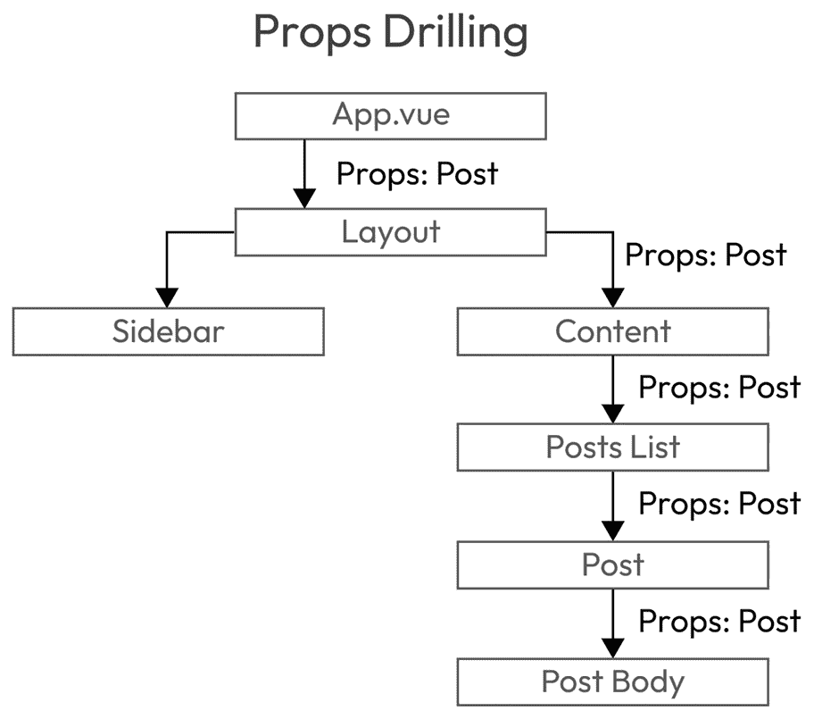
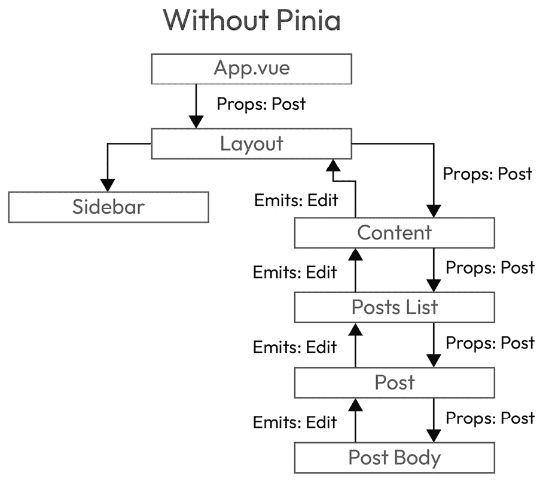
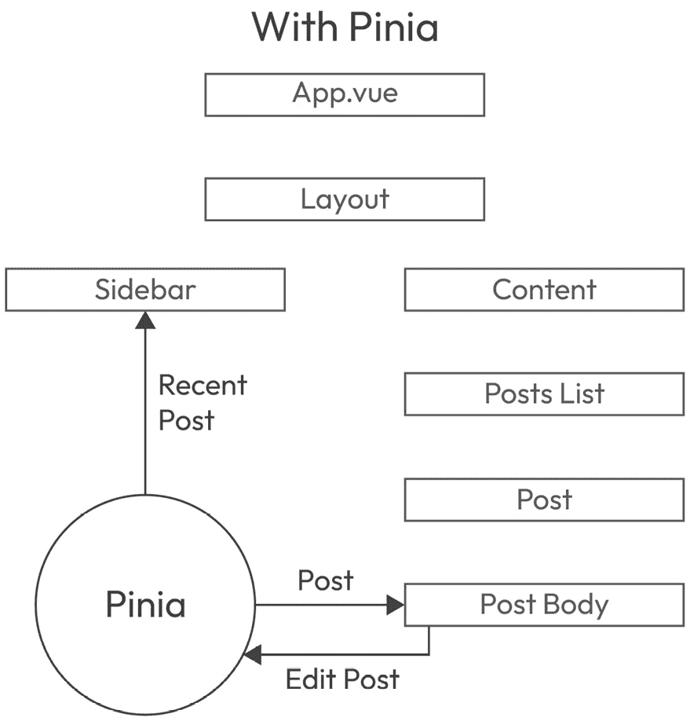
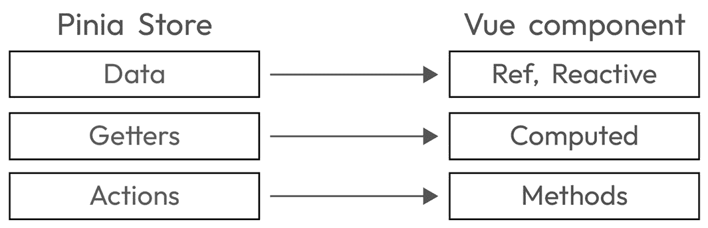
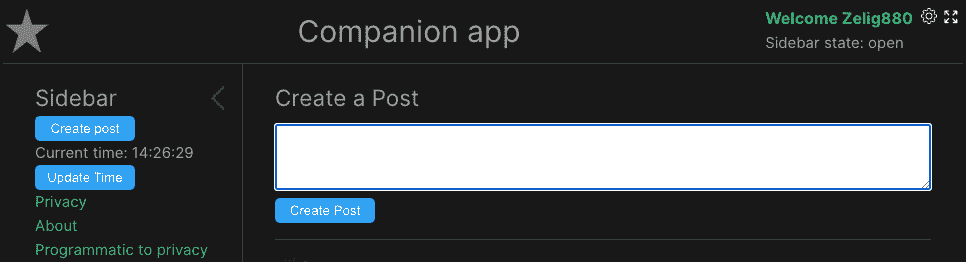

# 第十一章：使用 Pinia 管理您的应用程序状态

构建 Web 应用程序不是一项简单的任务，这不仅是因为编写它们所需的知识的数量，而且还因为成熟的应用程序可能发展的架构复杂性。

当我们最初开始这本书时，我们介绍了简单的话题，比如使用字符串插值替换文本或使用`v-if`指令隐藏元素。这些功能是 Vue.js 框架的核心，并且是使用此框架构建应用程序所必需的。

随着我们这本书的进展，我们开始介绍那些在项目开发初期并不总是必需的话题——在某些情况下甚至根本不需要。在前一章中，我们介绍了 Vue Router，这是第一个加入 Vue.js 核心框架的附加包。我们将继续这一趋势，通过介绍 Vue 生态系统的一部分核心维护包：Pinia。

Pinia 是 Vue.js 的官方状态管理包。它是之前状态管理包的继承者，该包被称为 Vuex。

为什么有两个不同的名字？

如果这两个包都是由同一个开源维护者创建和维护的，为什么它们有不同的名字？Pinia 原本应该被称为 Vuex 5，但在其开发过程中，他们决定给它一个不同的名字，因为这两个版本在主要方面彼此不同。

正如我之前提到的，并非每个应用程序都需要所有功能，状态管理就是其中之一。实际上，在一个非常小的网站上引入状态管理可能是一个过度架构的迹象。

在本章中，我们将解释什么是状态管理，并介绍 Pinia 作为 Vue.js 生态系统的官方包。然后，我们将讨论应用程序预期包含状态管理系统的情况，并讨论使用一个系统的优缺点。然后，我们将通过在我们的应用程序中包含两个存储来进行一些实践：一个用于处理侧边栏，另一个用于处理我们的帖子。在这样做的时候，我们还将向我们的应用程序添加一些功能，例如从标题栏切换侧边栏的能力以及添加新帖子的选项。

本章有以下部分：

+   何时使用状态管理

+   了解 Pinia 存储的结构

+   使用 Pinia 进行集中式侧边栏状态管理

到本章结束时，你应该熟悉状态管理的概念，并且能够在你未来的应用程序中定义和使用存储。

# 技术要求

在本章中，我们将使用的分支被称为`CH11`。要拉取这个分支，请运行以下命令或使用您选择的 GUI 来支持您进行此操作：

```js
git switch CH11
```

本章的代码文件可以在[`github.com/PacktPublishing/Vue.js-3-for-Beginners`](https://github.com/PacktPublishing/Vue.js-3-for-Beginners)找到。

# 何时使用状态管理

本章最重要的部分是学习何时在您的应用程序中使用 Pinia，何时不使用。

所有添加到应用程序中的额外包和功能都会带来额外的成本。这种成本体现在学习这些新技能所需的时间、构建新功能可能需要额外的时间、整体架构可能给项目增加的额外复杂性，以及另一个包添加到您的 JavaScript 包中的额外大小。

将状态管理器添加到您的应用程序属于这类可能不是总是需要的可选功能。幸运的是，添加和使用 Pinia 非常简单，并且不会像 React Redux 等其他类似工具那样给项目增加太多开销。

常规做法是，只有在项目足够复杂且包含许多组件层，并且跨应用程序传递值变得复杂时，才应该将状态管理添加到项目中。

Pinia 的一个良好用例是大型应用程序，属性在多个层之间传递。另一个用例是一个 SPA，它具有非常复杂的数据，需要由应用程序的多个部分共享和操作。

状态管理解决的主要问题是**属性钻取**。因此，应用程序的结构越复杂、越深入，Pinia 就越适合该项目：



图 11.1：属性传递到多个组件层

什么是属性钻取？

从父组件传递数据到子组件的过程，尤其是多层深度的传递，也被称为属性钻取。当谈论状态管理时，这是一个常用的术语，也将在本章的其余部分中使用。

让我们分析几个项目示例，看看我们是否需要 Pinia 的支持来处理状态管理：

+   **宣传册网站**：一个包含几个静态页面的简单网站，非常适合本地企业。该网站可能包含一个联系表单。没有真正需要管理的数据。

    *不需要存储*

+   **个人博客**：这个网站稍微复杂一些，具有动态页面，可以渲染我们在 Vue Router 章节中学到的博客页面。数据被传递到页面，但在应用程序的多个部分中不需要修改或使用。

    *不需要存储*

+   **电子商务网站**：一个用于销售产品的商业网站。该网站将主要是动态的，提供大量的交互性。数据需要通过应用程序的多个层传递和修改，例如从购物车到结账。

    *需要存储*

+   **社交媒体网站**：一个用于创建和分享帖子的网站。该网站还将有按用户、标签、类别等过滤的页面。相同的数据可以在应用程序的许多部分中重复使用，使用存储可以确保数据只被获取一次，然后重复使用。

    *需要存储*

对于所有网站来说，添加状态管理器并不是必须的，但它是由您特定 SPA 的用例和需求驱动的需求。诚然，随着您职业生涯的进步，您将熟悉框架提供的工具和技术，您会发现您经常过度设计您的应用程序。然而，在您职业生涯的初期，保持简洁并只选择您真正需要的 SPA 工具是非常重要的。

在进入下一节之前，我们应该对使用状态管理的真正好处说几句。我们将通过比较两个具有相同组件结构但处理数据方式不同的应用程序来实现这一点。一个使用属性钻取，而另一个使用状态管理。

我们将从 *图 11.1* 中所示的示例开始。这个示例类似于我们的伴侣应用，它展示了 `post` 属性从 `App.vue` 组件流向屏幕上渲染的最后组件的方式。在这个阶段，应用程序仍然相当简单。即使有一些多层属性钻取发生，复杂性仍然是可接受的。

现在，我们将添加用户编辑帖子的可能性。由于属性可以在定义它们的组件中简单地修改，因此我们不得不在整个组件树中发出一个“编辑”事件：



图 11.2：属性向下传递，事件向上传递到组件树

这里的情况开始变得更加复杂。除了属性钻取之外，我们还有 `Post` 属性。

我们将包括一个 Pinia 存储，看看它会给桌面带来什么变化。Pinia 将接管 `post` 属性，并将其提供给需要读取或修改它的组件：



图 11.3：一个 Pinia 存储管理数据

添加存储已经从我们的应用程序中移除了很多复杂性。当我们编辑帖子时，现在唯一需要重新渲染的组件将是 **帖子正文**。此外，存储使我们能够轻松地向下传递特定数据，例如侧边栏中的 **最近帖子**。这样做也将确保除非更改的帖子包含在侧边栏中，否则侧边栏不会重新渲染（这也可能使用属性实现，但通常不这样做）。

在这个简短的章节中，我们定义了何时需要状态管理以及何时应该从您的应用程序中省略它。然后，我们通过描述一些示例应用程序来定义在您的应用程序中何时需要存储。最后，我们介绍了状态管理的概念，并涵盖了它为您的应用程序带来的好处。

在下一节中，我们将学习 Pinia 的结构以及我们如何在应用程序中使用它。

# 了解 Pinia 存储的结构

在本章中，我们将介绍构成 Pinia 存储的内容以及它是如何支持您管理应用程序数据的。Pinia 建立在多个存储的概念之上。每个单独的存储都将管理一组特定的数据或公司逻辑，这些数据或逻辑不绑定到特定的组件。您的应用程序可以有一个帖子存储、评论存储，甚至一个用于管理侧边栏状态的存储。

存储可以相互通信，但最重要的是您应该能够轻松定义单个存储的特点。存储的数据应该很好地分割。

每个存储被分为三个不同的部分：**state**、**getters** 和 **actions**。

这三组在 Pinia 存储中可用的选项实际上可以与我们关于 Vue 单文件组件所了解的现有功能进行比较。

Pinia 中定义的 `state` 对象与用作私有组件数据的 Ref 或 Reactive 相当。`getters` 与计算属性相当，因为它们用于创建现有 **state** 的修改版本。最后，我们有 **actions**，它们类似于方法，用于在存储上执行副作用。



图 11.4：Pinia 选项与 Vue 组件之间的比较

当我们首次初始化应用程序时，我们选择了 `CLI` 命令来为我们创建存储。因此，伴侣应用程序在这里提供了一个非常简单的存储示例：[src/stores/counter.js](https://src/stores/counter.js)。让我们看看它包含的内容，以了解更多关于 Pinia 存储的实际结构：

src/stores/sidebar.js

```js
import { defineStore } from 'pinia'
export const useCounterStore = defineStore('counter', {
  state: () => ({ count: 0, name: 'Eduardo' }),
  getters: {
    doubleCount: (state) => state.count * 2,
  },
  actions: {
    increment() {
      this.count++
    },
  },
})
```

存储的第一部分是其声明。存储是通过 `pinia` 包内可用的 `defineStore` 方法声明的。在创建存储时，通常期望导出的方法遵循 `counter` 存储库的格式，我们可以预期导出的方法被命名为 `useCounterStore`。

接下来，我们有 `state` 对象。它被声明为一个返回对象的函数。语法可能看起来很熟悉，因为它与我们介绍选项 API 时使用的语法相同，当时我们讨论了使用选项 API 声明 Vue 组件。`state` 对象包括存储在初始状态下的值。

接下来，我们有获取器（getters），它们是 Vue 组件内部可用的计算属性的等价物。获取器用于使用 `state` 或其他获取器创建派生值。例如，在一个帖子存储中，我们可能有 `visiblePost` 获取器，它只返回具有 `visible` 标志的帖子。获取器接收状态，正如前一个获取器代码片段中显示的第一个参数所示。

最后，我们有动作。这些相当于方法，用于触发一个副作用，可以用来修改一个或多个存储条目。在我们的例子中，动作被命名为 `increment`，它用于增加 `count` 状态的值。动作是异步的，可以包括外部副作用，如调用 API 或调用其他存储动作。

现在我们已经学习了存储的结构，是时候学习如何在组件中使用存储了。要在组件中使用存储，我们需要使用由 `definedStore` 生成的导出方法来初始化它。在计数器存储的实例中，我们的初始化方法将是之前代码块中定义的 `useCounterStore`：

```js
const counter = useCounterStore();
```

然后使用它直接访问状态条目：

```js
counter.count
counter.name
```

同样的方法也适用于获取器和动作：

```js
counter.doubleCount
counter.increment()
```

在本节中，我们介绍了 Pinia 存储的基本结构。我们学习了如何使用 `defineStore` 声明它，然后解释了存储的三个不同部分：状态、获取器和动作。最后，我们学习了如何通过使用计数器存储来学习访问其状态、获取器和动作所需的语法。

在下一节中，我们将通过创建一些存储来应用我们迄今为止所学的内容。

# 使用 Pinia 实现集中式侧边栏状态管理

在上一节中，我们介绍了 Pinia 的基本结构和语法。为了更好地学习和理解状态管理，我们将通过重构一些现有数据到其自己的存储中，来修改我们的伴侣应用。我们将实现两个不同的存储。第一个将是一个非常简单的存储，用于管理侧边栏的状态，而第二个将处理帖子。

处理侧边栏状态的存储将会相当小。这将非常适合我们理解存储的基本语法和用法，而处理帖子的存储将会稍微复杂一些。

状态管理不应用于所有数据，其添加应伴随着支持其使用的好理由。那么，在侧边栏上添加它是正确的吗？

做好你的研究

回到代码库，尝试理解关于侧边栏及其功能的一切。探索性知识在提升你的技术技能方面非常有用。

当前侧边栏提供以下功能：

+   它可以是打开的或关闭的

+   它可以通过按钮切换

+   它使用本地存储来记住其状态

+   所有逻辑都包含在同一个组件中

我们简单的 `Sidebar.vue` 组件使侧边栏变得既美观又交互。但从前面的列表中，有一行应该引起我们的注意：“所有逻辑都包含在同一个组件中。”

如果你回到上一节，你可能会注意到我们提到使用商店通常与复杂场景相关联，在这些场景中，数据在多个组件之间传递。然而，在我们的情况下，所有数据都存储在一个文件中，逻辑或计算并不多。那么我们为什么需要包含一个商店呢？这样做是个好主意吗？

简短的回答是不。在这种场景下，实际上并不需要商店。即使我在个人项目中可能会用商店来处理侧边栏，我也不建议每个人都应该用所有 Vue 项目这样做。

在当前状态下，侧边栏过于简单，以至于不能将其移动到 Pinia 商店中。

幸运的是，我们对应用程序有完全的控制权，所以我们可以简单地添加一个要求，使使用商店变得合适。在这种情况下，新的要求是*从* *主标题* *添加切换侧边栏的能力*。

即使这个要求看起来不合理，侧边栏通常由不同的元素控制是非常常见的。这种情况可能会成为你下一个项目的现实。

为了完成这个新要求，我们需要执行一些属性钻取和事件冒泡，以便在没有商店的情况下使其工作。然而，使用简单的商店，逻辑将被从组件中抽象出来，并且可以很容易地被整个应用程序访问。

创建我们的第一个商店需要两个步骤。首先，我们将通过将现有方法和数据移动到商店中来重构我们的应用程序。其次，我们将更新组件以使用新创建的商店。

正如我们之前提到的，处理侧边栏切换的所有逻辑目前都存储在`Sidebar.vue`组件中。在这个组件中，我们可以找到以下与侧边栏切换相关的代码：

+   `closed`状态的声明：

    ```js
    const closed = ref(false);
    ```

+   切换侧边栏的方法：

    ```js
    const toggleSidebar = () => {
    ```

    ```js
      closed.value = !closed.value;
    ```

    ```js
      window.localStorage.setItem("sidebar", closed.value);
    ```

    ```js
    }
    ```

+   初始化侧边栏状态的生命周期：

    ```js
    onBeforeMount( () => {
    ```

    ```js
      const sidebarState = window.localStorage.getItem("sidebar");
    ```

    ```js
      closed.value = sidebarState === "true";
    ```

    ```js
    });
    ```

让我们去创建我们的第一个商店。

## 创建我们的第一个商店

现在，我们将前面的代码移动到一个名为`sidebar.js`的新商店中。就像我们之前提到的，`Ref`变量将变成`State`，方法将变成 Pinia 动作。

让我们先为我们的商店创建一个空的结构：

src/stores/sidebar.js

```js
import { defineStore } from 'pinia'
export const useSidebarStore = defineStore('sidebar', {
  state: () => ({}),
  getters: {},
  actions: {},
})
```

我们的空商店包括从`pinia`包中导入`defineStore`，使用我们之前提到的命名约定（use + store name + Store）来初始化商店，从而创建`useSidebarStore`，最后是状态、获取器和动作的三个空选项。

在这个阶段，商店已经准备好填充信息。让我们用侧边栏逻辑来填充它：

src/stores/sidebar.js

```js
import { defineStore } from 'pinia'
export const useSidebarStore = defineStore('sidebar', {
  state: () => ({ closed: true }),
  getters: {},
  actions: {
    toggleSidebar() {
      this.closed = !this.closed
      localStorage.setItem('sidebar', this.closed)
    },
    loadSidebarFromLocalStorage() {
      const closed = localStorage.getItem('sidebar')
      this.closed = closed === 'true'
    }
  },
})
```

在前面的代码中，我们在状态对象中声明了一个新的值`closed`。它最初被设置为`true`。我们目前没有修改`getters`，因为它将在后面的部分中使用。接下来，我们声明了两个动作。一个是切换侧边栏，另一个是使用我们之前方法中的现有代码从本地存储中加载侧边栏。

如果我们将动作中的代码与组件中存在的方法进行比较，你会注意到它们非常相似。主要区别在于我们可以访问状态的方式。实际上，当这些方法在组件中时，我们必须使用`closed.value`来访问引用的值，而在 Pinia 中，可以使用`this.closed`关键字来访问单个状态实体的值。

现在我们已经完成了存储，我们只需要回到侧边栏并替换之前的逻辑为新存储。用存储替换当前逻辑需要三个步骤。首先，我们需要加载和初始化存储。其次，我们需要用 Pinia 动作替换方法，最后，我们需要修改模板以使用存储的状态而不是引用。

让我们先移除之前的引用并初始化存储：

```js
import IconRightArrow from '../icons/IconRightArrow.vue'
import { useSidebarStore } from '../../stores/sidebar';
const currentTime = ref(new Date().toLocaleTimeString());
const router = useRouter();
const closed = ref(false);
const sidebarStore = useSidebarStore();
```

存储是通过导入并调用`useSidebarStore`来初始化的。这是我们声明的导出方法。通常声明一个名为`store`或名称+`Store`的常量是很常见的。

你知道吗？

使用特定的存储名称，如`sidebarStore`而不是仅仅调用它为`Store`，在尝试搜索特定存储的所有用法时非常有用。由于使用状态管理允许你在应用的任何地方使用这种逻辑，所以能够快速搜索它是非常好的，因此有一个一致的命名约定是有帮助的。

在下一步中，我们将处理方法。我们将移除现有方法并用存储动作替换它们：

```js
const toggleSidebar = () => {
  closed.value = !closed.value;
  window.localStorage.setItem("sidebar", closed.value);
}
const onUpdateTimeClick = () => {
  currentTime.value = new Date().toLocaleTimeString();
};
const navigateToPrivacy = (event) => {
  event.preventDefault();
  console.log("Run a side effect");
  router.push("privacy");
}
onBeforeMount ( () => {
  const sidebarState = window.localStorage.getItem("sidebar");
    closed.value = sidebarState === "true";
  sidebarStore.loadSidebarFromLocalStorage();
});
```

就像之前一样，前面的代码包括两个步骤。它首先移除之前的逻辑，然后用存储实现替换它。我们通过移除处理从状态中检索侧边栏的逻辑，并用`loadSidebarFromLocalStorage`动作替换它来更新了`onBeforeMount`生命周期内容。

你可能已经注意到我们还没有替换`toggleSidebar`方法。这不是一个错误；实际上，我们将能够直接从`<template>`调用 Pinia 动作。

让我们看看我们的组件 HTML 需要哪些更改来完成我们的重构到 Pinia 存储：

src/components/organisms/sidebar.vue

```js
<template>
  <aside :class="{ 'sidebar__closed': sidebarStore.closed}">
    <template v-if="sidebarStore.closed">
      <IconRightArrow class="sidebar__icon" @click="sidebarStore.toggleSidebar" />
    </template>
    <template v-else>
      <h2>Sidebar</h2>
      <IconLeftArrow class="sidebar__icon" @click="sidebarStore.toggleSidebar" />
      <TheButton>Create post</TheButton>
```

更新 HTML 是最容易的改变之一。实际上，这里唯一的必要条件是将所有状态和动作前缀为`sidebarStore`存储常量。就像动作一样，状态值也可以直接访问，就像`sidebarStore.closed`所示。这被用来访问`closed`状态值。

在这个阶段，我们对侧边栏的重构已经完成。所有曾经存在于组件中的逻辑都已经移动到一个新的存储中。侧边栏应该按预期工作，唯一的区别是它的值和逻辑存储在存储中，而不是在组件本身中。

为了完成我们的任务，我们需要允许应用程序的另一部分切换侧边栏。这是我们添加以证明创建存储的必要性和深入了解存储的要求。

### 将侧边栏扩展到头部

在本节中，我们将进入头部文件，通过添加从应用程序的不同部分切换侧边栏可见性的能力来完成我们的任务。

我们将通过在头部旁边添加一个简单的按钮来实现这一点。就像之前一样，我们将导入并初始化存储，然后直接使用其动作。重要的是要记住，这个新按钮可以放置在应用程序的任何地方，因为它的动作由存储拥有和控制。

让我们进入`TheHeader.vue`并添加存储：

src/stores/TheHeader.vue

```js
<template>
  <header>
    <TheLogo />
    <h1>Companion app</h1>
    <span>
      <a href="#">Welcome {{ username }}</a>
      <IconSettings class="icon" />
      <IconFullScreen class="icon" @click="sidebarStore.toggleSidebar" />
    </span>
  </header>
</template>
<script setup>
import { ref } from 'vue';
import TheLogo from '../atoms/TheLogo.vue';
import IconSettings from '../icons/IconSettings.vue';
import IconFullScreen from '../icons/IconFullScreen.vue';
import { useSidebarStore } from '../../stores/sidebar';
const username = ref("Zelig880");
const sidebarStore = useSidebarStore();
</script>
```

我们在头部编写的代码与我们之前在侧边栏中定义的代码之间没有区别。事实上，当使用存储时，我们可以在应用程序的任何地方使用它，而无需定义任何其他内容。所有存储的实例将作为一个整体工作，允许我们从应用程序的不同部分使用和修改状态。

在这个阶段，我们的 Companion App 将增加一个新功能，允许我们通过使用侧边栏本身或从头部来切换侧边栏。

### 介绍获取器（getters）的概念

在我们进入本章的下一节之前，我们应该介绍存储的另一个特性，该特性已被提及但尚未在我们的 Companion App 中使用：获取器。

获取器与计算属性类似。它们允许你使用存储状态来创建变量。在我们的例子中，我们将引入一个简单的获取器，为我们的侧边栏创建一个友好的`open`或`closed`标签。在除这个用例之外，获取器还可以用于翻译目的、过滤数组或规范化数据。

让我们回到`sidebar.js`文件并添加我们的`friendlyState`获取器：

src/stores/sidebar.js

```js
state: () => (
  { closed: true }
),
getters: {
  friendlyState(state) {
    return state.closed ? "closed" : "open";
  }
},
actions: {
...
```

创建获取器非常简单。你必须在获取器对象中声明一个方法，然后添加逻辑来创建获取器将要返回的值。就像计算属性一样，这将被缓存。更重要的是，它不应该产生任何副作用（例如，调用 API 或记录数据）。

关于获取器需要提出的主要观点是它们自动接收状态对象作为第一个参数。因此，要访问关闭状态，我们将编写`state.closed`。就像计算属性一样，多亏了 Vue 的反应系统，如果状态值发生变化，`friendlyState`值也会自动更新。

现在我们已经设置了 getter，是时候使用它了。我们回到标题部分，将这个字符串添加到用户设置下方可见的位置。我们可以重用之前导入的存储来访问新定义的 getter：

```js
<template>
<header>
  <TheLogo />
  <h1>Companion app</h1>
  <span>
    <a href="#">Welcome {{ username }}</a>
    <IconSettings class="icon" />
    <IconFullScreen class="icon" @click="sidebarStore.toggleSidebar" />
    <p>Sidebar state: {{ sidebarStore.friendlyState }}</p>
  </span>
</header>
</template>
<script setup>
import { ref } from 'vue';
import TheLogo from '../atoms/TheLogo.vue';
import IconSettings from '../icons/IconSettings.vue';
import IconFullScreen from '../icons/IconFullScreen.vue';
import { useSidebarStore } from '../../stores/sidebar';
const username = ref("Zelig880");
const sidebarStore = useSidebarStore();
</script>
```

你可能已经注意到，从之前的代码片段中我们没有需要任何额外的初始化或代码，并且我们能够使用现有的存储来打印`friendlyState` getters。

现在标题应该会显示我们的字符串：



图 11.5：带有侧边栏状态的伴侣应用程序标题

这是一个简单的例子，帮助我们学习如何重构现有代码，以及如何定义具有状态、getter 和 actions 的存储。最后，它帮助我们学习如何在应用程序中的一个或多个组件中使用存储。

我们将通过在伴侣应用程序中引入另一个存储来继续我们的 Pinia 学习之旅。在下一节中，我们将创建一个将处理我们的帖子的存储。这将比之前的更复杂一些，并允许我们介绍状态管理器提供的更多功能。

## 使用 Pinia 创建帖子存储

在应用程序中添加状态管理是一个永无止境的任务，因为随着应用程序的增长，它也在不断进化。到目前为止我们在应用程序中所做的工作——通过将逻辑从组件中移出并放入存储中来进行应用程序的重构——是一种常见的做法。正如我们之前提到的，将侧边栏逻辑移入存储中有点过于激进，在真实的应用程序中并不期望这样做，因为逻辑足够小，足以在组件内部运行（即使有属性钻取）。

在本节中，情况有所不同。我们将重构应用程序的一个关键部分到存储中：帖子。处理帖子的数据获取和管理是应用程序的一个关键部分，并且随着应用程序的增长可能会变得更加复杂。正因为如此，将帖子移入存储将改善应用程序的整体结构。

就像之前一样，我们将通过首先分析代码库以找到所有与帖子相关的代码来重构当前代码。然后，我们将创建一个新的存储并将代码移到那里。最后，我们将更新组件以使用存储。

由于这是我们第二次进行这个练习，我将跳过一些步骤，直接进入存储的创建。在你跳到下一节之前，我建议你搜索所有与帖子相关的所有方法，并将它们与我们将在存储中编写的那些方法进行比较。这个练习将非常有价值，因为它将为你提供关于你对应用程序当前理解的洞察。

我们的新存储将被命名为`posts.vue`。它将保存在`src/stores`文件夹中，就像我们之前的存储一样。

此存储将包含具有 `posts` 和 `page` 属性的状态，以及两个不同的操作：`fetchPosts` 和 `removePosts`：

```js
import { defineStore } from 'pinia'
export const usePostsStore = defineStore('posts', {
  state: () => (
    { posts: [], page: 0 }
  ),
  actions: {
    fetchPosts(newPage = false) {
      if(newPage) {
        this.page++;
      }
      const baseUrl = "https://dummyapi.io/data/v1";
      fetch(`${baseUrl}/post?limit=5&page=${this.page}`, {
        "headers": {
          "app-id": "1234567890"
        }
      })
        .then( response => response.json())
        .then( result => {
          this.posts.push(...result.data);
        })
    },
    removePost(postIndex) {
      this.posts.splice(postIndex, 1);
    }
  },
})
```

我们通过利用之前引入的命名约定初始化了存储。这产生了一个名为 `usePostsStore` 的命名导出。然后我们使用空数组为 `posts` 变量声明了状态，并使用 `{ posts: [], page: 0 }` 的值为 `0`。接下来，我们复制了我们的方法并将它们转换为 Pinia 的操作。与前存在于组件中的方法以及我们添加到存储中的副本之间的主要区别是我们访问变量（如 `page` 和 `posts`）的方式。在 Pinia 存储中，可以通过 `page.value` 访问状态值，我们将它改为 `this.page`。

这是我们将要为方法做出的唯一更改，因为其余的逻辑保持不变，并且不需要任何修改。

与上一节相比，我们还没有引入任何新内容，对帖子存储的重构流程与侧边栏存储实现非常相似。将逻辑重构到存储中通常是一个非常简单的练习，我们可以像在两个示例中那样提升和转移大部分逻辑。

现在存储已设置，我们将把注意力转向组件，确保它使用存储状态和操作。在这个过程中，我们将学习如何解构 Pinia 存储以增加组件的可读性。

直接使用如 `const { test, test2 } = useTestStore()` 这样的语法解构存储是不可能的，因为这会破坏此状态的响应性。

打破响应性意味着如果存储中的值发生变化，该变化将不再传播到组件中。为了解决这个问题，Pinia 提供了一个 `storeToRefs` 方法，它将允许我们安全地解构 Pinia 存储。

存储或 ref 是个人喜好

使用存储，就像我们在之前的示例中所做的那样，或者将值解构为 Refs 是一个完全个人的选择。没有对错之分。

直接使用存储将明确定义来自存储的数据，因为它将使用存储名称作为所有数据的前缀，例如 `myStore.firstName`。另一方面，使用 Refs 将生成一个更干净的组件，因为状态不需要前缀，访问状态只需使用 ref 的名称，例如 `firstName`。

让我们通过将组件更改为使用存储并使用 `storeToRefs` 方法来完成我们的存储迁移。由于文件包含许多更改，我们将将其分解为多个阶段：

1.  初始化存储：

    ```js
    import { usePostsStore } from '../../stores/posts';
    ```

    ```js
    import { storeToRefs } from 'pinia'
    ```

    ```js
    const postsStore = usePostsStore();
    ```

1.  将 `private` 状态替换为 `store` 状态：

    ```js
    const { posts } = storeToRefs(postsStore);
    ```

1.  将方法替换为存储操作：

    ```js
    const { fetchPosts, removePost } = postsStore;
    ```

1.  更新 HTML。

    由于我们选择将存储状态转换为 Refs，因此 HTML 内部不需要进行任何更改，因为旧 Refs 和新 Refs 的名称现在是一致的。我们唯一需要更改的是`watch`方法。实际上，因为我们已经将 posts 数组从响应式转换为 ref，现在我们需要添加`.value`以便它能够正常工作：

    ```js
    watch(
    ```

    ```js
      posts.value,
    ```

    ```js
      (newValue) => {
    ```

    ```js
        if( newValue.length <= 3 ) {
    ```

    ```js
          fetchPosts(true);
    ```

    ```js
        }
    ```

    ```js
      }
    ```

    ```js
    )
    ```

在我们继续之前，我想将您的注意力引到第 3 步。实际上，如果您足够细心，可能会注意到我们没有使用`storeToRefs`直接提取了存储的动作。这是可能的，因为动作是无状态的，并且没有任何响应性。

完整的文件将看起来像这样：

```js
<template>
  <SocialPost
    v-for="(post, index) in posts"
    :username="post.owner.firstName"
    :id="post.id"
    :avatarSrc="post.image"
    :post="post.text"
    :likes="post.likes"
    :key="post.id"
    @delete="removePost(index)"
  ></SocialPost>
</template>
<script setup>
import { watch } from 'vue';
import SocialPost from '../molecules/SocialPost.vue'
import { usePostsStore } from '../../stores/posts';
import { storeToRefs } from 'pinia'
const postsStore = usePostsStore();
const { posts } = storeToRefs(postsStore);
const { fetchPosts, removePost } = postsStore;
watch(
  posts.value,
  (newValue) => {
    if( newValue.length <= 3 ) {
      fetchPosts(true);
    }
  }
)
fetchPosts();
</script>
```

## 实现添加帖子动作

在几章之前，我们介绍了一个旨在向我们的状态添加新帖子的组件。这个组件从未完全实现，因为它缺少创建帖子所需的主要逻辑。组件被留下这种状态的原因是，在没有存储的情况下添加功能将需要大量的属性钻取和事件冒泡。

多亏了帖子存储，这种情况不再存在。实际上，我们将能够使用存储动作生成添加新帖子所需的逻辑。

存储是帖子的唯一所有者，所以我们不必担心帖子在哪里被使用。我们可以简单地创建一个添加帖子的动作，知道存储将处理应用程序其余部分的状态传播和处理。

首先，我们将在`posts.js`文件中添加一个动作：

src/stores/post.js

```js
addPost(postText) {
  const post = generatePostStructure(postText);
  this.posts.unshift(post);
}
```

`addPost`动作将通过在帖子列表的开头添加帖子来添加帖子。对于我们的 Companion App 的范围，添加新帖子将只设置帖子的主要内容，因为其他信息，如 ID 和用户信息，将被硬编码并由名为`generatePostStructure`的函数提供。

接下来，我们将初始化存储并将此动作附加到`createPostHandler`：

```js
<script setup>
import TheButton from '../atoms/TheButton.vue';
import { usePostsStore } from '../../stores/posts';
import { onMounted, ref } from 'vue';
const postsStore = usePostsStore();
const { addPost } = postsStore;
const textareaRef = ref(null);
const createPostForm = ref(null);
const createPostHandler = (event) => {
  event.preventDefault();
  if(createPostForm.value.reportValidity()){
    addPost(textareaRef.value.value);
  };
}
...
```

使用新动作遵循之前使用的相同语法。首先，我们导入存储。其次，我们初始化它。然后，我们解构我们想要使用的动作，最后，我们像使用简单方法一样使用动作。

之前的例子使用了文本区域 ref 来获取`textarea`的值。这不是 Vue.js 的正确用法，并且应该避免以这种方式访问值。实际上，在下一章中，我们将通过引入`v-model`的双向绑定对这个文件进行重构。

创建自己的存储

在进入下一章之前，您应该尝试创建自己的存储。您可以通过创建一个可以处理`create post`组件可见性的存储来创建一个与侧边栏非常相似的存储。您可以使用侧边栏中标记为`CreatePost.vue`可见性的按钮。您可以在`CH11-END`分支中看到完整的实现。

在本节中，我们继续通过重构帖子数据来学习关于 Pinia 存储库的知识。我们通过定义其状态和动作创建了一个新的存储库。然后，我们将现有代码转换为在 Pinia 存储库中工作。接下来，我们介绍了 `storeToRefs` 方法，并学习了如何从存储库中解构状态和动作。最后，我们通过添加用户通过创建新的动作添加新帖子的能力来利用新的存储库。您在这里学到的不是 Pinia 提供的所有功能的完整列表，而是一个对优秀状态管理包的快速介绍。随着您练习的增多，您将了解其他功能，如 `$patch` 和 `$reset`。

# 摘要

将状态管理引入您的应用程序可以真正帮助您轻松处理数据。在本章中我们分享的两个示例中，我们看到了状态管理如何通过避免属性钻取和事件冒泡来为您的应用程序增加好处。

在我们结束本章之前，我想分享使用状态管理在您的应用程序中的一个额外好处。在前两节中我们所完成的重构突出了使用 Pinia 存储库帮助我们从组件中移除大量逻辑到存储文件的单个位置这一事实。

这种抽象不仅对开发体验有益，还可以用来选择我们应用程序中哪些部分可以进行单元测试。您可能还记得从*第八章*，选择要测试的内容相当复杂，因为测试过多和测试过少之间有一条非常细的界限。我个人使用状态管理来界定我将要单元测试的应用程序部分。我通过始终确保所有存储库都得到彻底测试来实现这一点。

在本章中，我们首先介绍了状态管理的概念，并讨论了 Pinia 提供的语法和功能。然后，我们开始将所学知识付诸实践，通过将侧边栏重构为其自己的存储库。通过这样做，我们学习了如何声明状态、获取器和动作，以及如何在组件中使用它们。接下来，我们继续学习，通过重构我们应用程序的另一部分：帖子。我们创建了一个存储库，并将方法转换为 Pinia 动作。最后，我们学习了如何解构状态以及状态管理在我们应用程序架构中的重要性。

在下一章中，我们将学习如何通过引入 `v-model` 的双向绑定和客户端验证的 **VeeValidate** 来处理我们应用程序中的表单。
