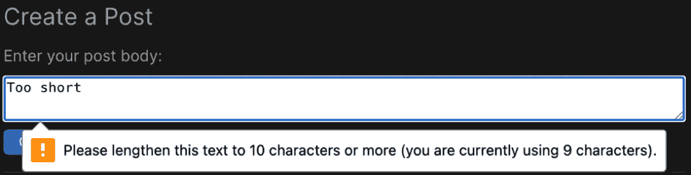
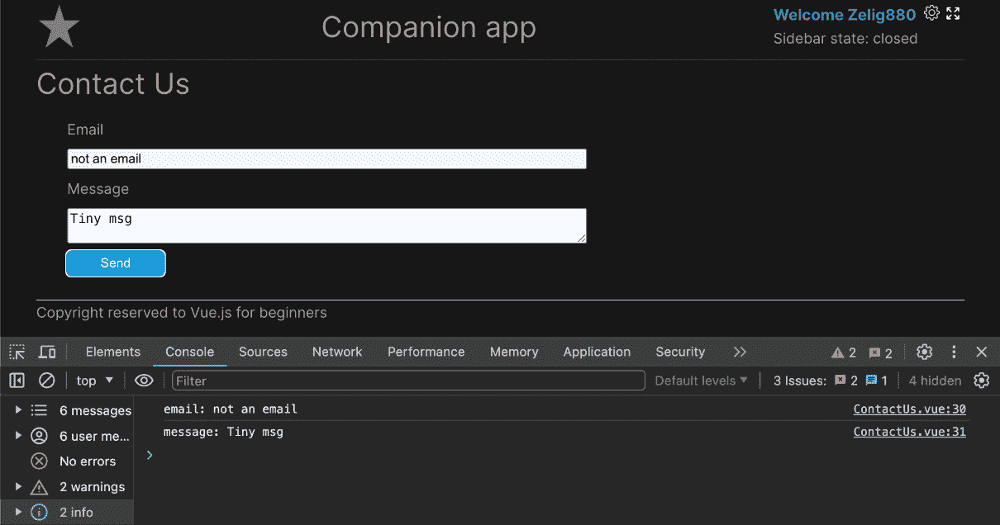
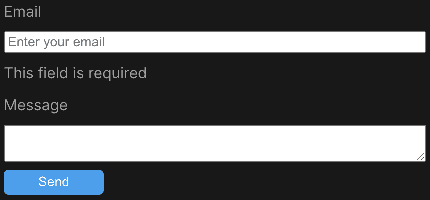
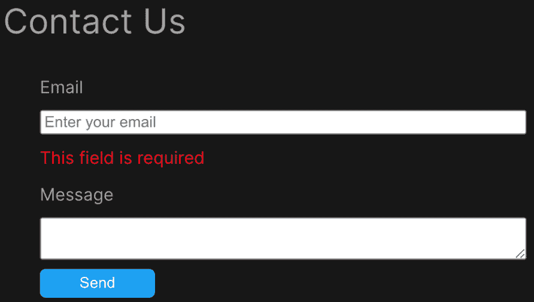

# 第十二章：使用 VeeValidate 实现客户端验证

一个网站在拥有某种形式的表单之前是不完整的。联系我们、反馈和评论表单只是我们可能需要在 Vue.js 应用程序中开发和验证的几个例子。

在本章中，我们将解释什么构成了语义正确的表单，介绍可用的字段，并讨论其无障碍需求。然后，我们将更新我们的 `CreatePost` 组件，学习如何处理表单字段和管理使用 `v-model` 的双向绑定。接下来，我们将继续创建一个新的表单，称为 `contactUs`。这将用于介绍一个新的包，称为 **VeeValidate**。最后，我们将学习如何开发自定义验证规则，以及如何通过使用 VeeValidate 预设规则简化我们的验证。

在本章中，我们将涵盖以下内容：

+   理解表单

+   使用 `v-model` 进行双向绑定

+   使用 VeeValidate 控制你的表单

+   使用 VeeValidate 定义你的表单验证

到本章结束时，你应该对表单及其在 Vue.js 中的处理有了很好的理解。你将能够定义结构良好且无障碍的表单，使用 `v-model` 处理用户输入，并使用 VeeValidate 定义具有验证的复杂表单。

# 技术要求

在本章中，分支被命名为 `CH12`。要拉取此分支，请运行以下命令或使用你选择的 GUI 来支持此操作：

```js
git switch CH12
```

本章的代码文件可以在 [`github.com/PacktPublishing/Vue.js-3-for-Beginners`](https://github.com/PacktPublishing/Vue.js-3-for-Beginners) 找到。

# 理解表单

无论你是开发新手还是有经验，花点时间了解什么构成了一个好的表单以及如何最佳地定义表单都是很重要的。

我在 10 年前开始学习表单，但即便如此，在我完成本章研究的过程中，我仍然发现了一些新的东西可以学习。HTML5 的增强和无障碍要求已经改变了我们定义表单的方式。在本节中，我们将了解什么构成了一个好的表单，然后在后面的章节中，我们将利用这些知识在我们的伴侣应用中定义一些表单。

在大多数静态网站中，例如宣传册网站或博客，表单是用户与你的网站互动的唯一时刻，因此它们需要提供出色的用户体验（UX）并尽可能的无障碍。

一个好的表单包括三个不同的方面：

+   它具有语义正确性

+   它是无障碍的

+   它经过了验证

到本章结束时，我们将涵盖所有三个方面，你将能够创建出色的表单。

让我们从第一个要点开始，看看什么构成了一个好的 HTML 结构。使用正确的 HTML 不仅会提升我们的用户体验，也会为稍后本节中将要讨论的无障碍工作打下基础。

请注意，这本书不是关于基本的 HTML 和 JavaScript，而是专注于 Vue.js。因此，本节将只是一个非常快速的对表单的介绍；我们不会花太多时间深入细节，但会涵盖主要主题，这样你可以轻松地跟随本章的其余部分，并确保你的表单结构良好。

## 将你的表单包裹在<form>元素中

让我们从经常被忽视的基本知识开始。所有表单都需要被包裹在`<form>`元素中。这不仅仅是一件好事，它背后还有一些非常重要的意义。

使用`<form>`元素有三个好处。首先，它通知浏览器存在表单（对浏览器扩展很重要）。其次，它通过支持**表单**模式（屏幕阅读器用于在网站上完成表单的特定模式）来提高使用屏幕阅读器的视觉障碍用户的用户体验。接下来，它有助于处理验证。

你可能想知道使用`<form>`元素如何提高用户体验。好吧，你有没有想过为什么有时可以通过按*Enter*键提交表单，而有时却不能？好吧，这是由`<form>`元素驱动的。当一个表单被包裹在`<form>`元素中时，如果用户在完成表单时按下*Enter*键，表单将触发其`submit`方法。

## 不要忘记标签

`<label>`元素的主题在我心中占有特殊的位置。许多开发者和设计师忽略了这一元素的重要性，要么将其从 UI 中移除，要么误用它。几年前，有一种趋势是开发紧凑的表单设计，其中占位符取代了标签。这些表单看起来非常清晰，开始被到处使用，但从用户体验的角度来看，它们是一个巨大的失败。即使它们看起来很棒，它们也可能很难使用，因为占位符在用户（或浏览器）在字段中输入内容后就会消失，并且无法再次看到，直到用户删除输入。

标签的另一个问题是它们在可访问性方面是必不可少的。事实上，没有它们，视觉障碍用户将无法知道字段的内容，因此将无法完全填写表单。

标签可以用两种不同的方式使用。它既可以作为一个独立的元素使用，使用 ID 将其链接到输入字段，也可以将其包裹在它所属的输入字段中：

```js
// Label standalone
<label for="name">Name:</label>
<input type="text" name="name" id="name">
// label wrapping input
<label>Email:
  <input type="email" name="email" id="email">
</label>
```

这两种方法在语义上都是正确的，它们的使用通常是由你可能需要实现的设计驱动的。

## 不仅仅是 type="text"

正如我之前提到的，我很早就开始使用表单了，随着时间的推移，有一件事是进步的，那就是现在所有主流浏览器都支持的输入类型的不同。

这是所有可用输入类型的列表：

+   `按钮`

+   `复选框`

+   `颜色`

+   `日期`

+   `日期时间`

+   `电子邮件`

+   `文件`

+   `隐藏`

+   `图片`

+   `月份`

+   `数字`

+   `密码`

+   `单选按钮`

+   `range`

+   `reset`

+   `search`

+   `submit`

+   `tel`

+   `text`

+   `time`

+   `url`

+   `week`

浏览器提供了电话号码、日期甚至电子邮件的字段。但使用它们的益处是什么？为什么不用一个简单的`text`字段呢？好吧，区别可能不在于字段的外观，而在于字段的工作方式。

不同的字段可能会触发不同的 UI。例如，点击日期字段会打开日历，数字字段可能会显示小开关，等等。这种 UX 的改进在手机上尤为明显，因为手机可以提供定义良好的原生组件来支持用户完成表单。

## 设置表单以自动填充

谁不喜欢一个完全由浏览器自动填充的表单呢？幸运的是，浏览器正在非常努力地工作，以便尽可能多地自动填充表单。我们可以做几件事情来帮助浏览器。

首先，我们需要通知浏览器我们希望表单能够自动填充。这不是自动完成的，而是需要`<form>`元素接收一个`autocomplete`属性：

```js
<form autocomplete >...</form>
```

接下来是确保我们用正确的名称描述字段，因为浏览器可以读取名称并分配正确的字段。所以，如果一个字段是地址，你应该给它正确的`address`名称，而不是使用像`addr`或其他浏览器无法理解的缩写。

最后但同样重要的是，定义正确的值来分配给自动完成属性。在主表单上设置`autocomplete`可能并不足够。有时，例如在用于自动填充密码的浏览器扩展程序的情况下，浏览器需要更多信息，这可以通过在字段上直接使用`autocomplete`属性来传递。`autocomplete`可以接受不同的值，具体取决于输入的角色。以下是一些示例：

+   对于用户名：

    ```js
    <input type="email" autocomplete="username" id="email" />
    ```

+   对于注册表单：

    ```js
    <input type="password" autocomplete="new-password" id="new-password" />
    ```

+   对于登录：

    ```js
    <input type="password" autocomplete="current-password" id="current-password" />
    ```

如用户名示例所示，输入的类型和名称不必与它们的`autocomplete`值匹配。实际上，在用户名的情况下，即使浏览器看到并使用该字段作为电子邮件，密码工具也会用用户名填充该字段。

在本节中，我们学习了如何定义一个好的表单。将表单包裹在`<form>`中，设置`autocomplete`，为每个字段定义正确的标签，以及使用正确的输入类型，这些都是我们可以采取的几个步骤，以确保我们的用户在填写我们的表单时拥有良好的体验。

在下一节中，我们将学习如何定义和使用 Vue.js 中的表单，以及框架如何帮助我们进一步改进 UX。

# 使用 v-model 的双向绑定

在前一个部分，我们学习了我们的表单应该如何定义，现在是时候通过在我们的伴侣应用中添加几个表单来将我们的学习付诸实践了。在本节中，我们将学习如何使用`v-model`使我们的输入字段实现双向绑定，这是一个术语，用来描述当字段可以同时发出更改事件和更新值时（因此是双向的）。

在前一章中，我们提到用来在`CreatePost`组件中管理值的解决方案是次优的，现在是时候将其调整为使用最佳行业标准了。

让我们先重新阐述双向绑定真正实现的内容。让我们以一个输入字段为例。到目前为止，我们已经学习了如何使用`ref`设置该字段的值。`ref`的使用允许我们在加载时设置特定输入字段的值，但当我们想要通过访客的输入来设置值时，这并不很有用。在前一章中，我们学习了如何使用事件来发出更改，因此，在输入字段的案例中，我们可以发出一个更改事件，该事件会改变`Ref`变量，进而更新字段的值。

这看起来可能像这样：

```js
<input value="firstName" @input="firstName= $event.target.value" />
```

即使前面的代码确实实现了双向绑定，它看起来并不整洁，而且在我们所有的表单中添加这些代码会使 HTML 非常难以阅读。

幸运的是，Vue.js 框架有一个很好的快捷方式可以使我们的 HTML 更简洁，称为`v-model`。

将前面的代码改为使用`v-model`将导致以下语法：

```js
<input v-model="firstName" />
```

幕后，`v-model`和`event`/`value`语法生成相同的代码，但由于`v-model`的代码简洁，当可能时，它是建议的选项来实现双向绑定（可能存在我们需要手动处理事件以处理特定副作用的情况；在这些场景中，`event`/`value`语法可能更受欢迎）。

现在我们已经了解了语法以及如何定义表单，让我们回到`CreatePost`组件并应用我们的学习：

```js
<template>
  <form
    v-show="postsStore.inProgress"
    ref="createPostForm"
    @submit.prevent="createPostHandler"
>
    <h2>Create a Post</h2>
    <label for="post">Enter your post body:</label>
    <textarea
      rows="4"
      cols="20"
      ref="textareaRef"
      required="true"
      minlength="10"
      v-model="postText"
      name="post"
      id="post"
    ></textarea>
    <TheButton>Create Post</TheButton>
  </form>
</template>
<script setup>
import TheButton from '../atoms/TheButton.vue';
import { usePostsStore } from '../../stores/posts';
import { onMounted, ref } from 'vue';
const postsStore = usePostsStore();
const { addPost } = postsStore;
const textareaRef = ref(null);
const createPostForm = ref(null);
const postText = ref("");
const createPostHandler = (event) => {
  event.preventDefault();
  if(createPostForm.value.reportValidity()){
      addPost(textareaRef.value.value);
  };
  addPost(postText.value);
}
onMounted( () => {
  textareaRef.value.focus();
});
</script>
```

让我们分解我们对表单所做的所有更改。首先，我们移除了`createPostForm`的`Ref`初始化。这个引用是为了保存 HTML 表单的值，但在重构之后不再需要。接下来，我们创建了一个名为`postText`的引用，它将保存我们输入字段的值。然后我们在输入字段中添加了`v-model`，将其分配给新创建的`postText`。

在首次加载时，输入字段将是一个空字符串（`const postText = ref("");`），但这个值将由`v-model`在用户输入到输入字段时自动更新。幕后，`v-model`在首次加载时分配值，然后每次输入字段发出更改事件时自动更新它。

在重构表单时，我们还通过向`@submit`事件添加`.prevent`修饰符引入了一个小的增强。这样做会在提交表单时自动调用`event.preventDefault()`。

最后的更改是在`addPost`方法的负载中。现在该方法使用`postText.value`而不是使用输入引用来获取值。

快速提醒

提醒一下，使用模板引用（Template Ref）来获取输入值仅用于教学目的，不应在实际生活中使用。使用模板引用（R`ef`）来访问 HTML 对象仅应用于无法通过基本 Vue.js 功能（如指令、计算属性和事件）实现的方法和动作。

在这个阶段，表单完全使用 Vue.js 支持的双向绑定和`v-model`功能正常工作。如果我们尝试使用表单，这将按预期工作，要么创建一个帖子，要么在输入错误时显示浏览器原生的验证，如图*图 12**.1*所示。



图 12.1：在创建帖子表单中显示的原生验证消息

通过在本节中获得的知识，你将能够创建表单并在你的应用程序中处理用户输入。在许多情况下，原生浏览器的验证要么不够“美观”，或者不能满足表单的验证要求。

因此，在下一节中，我们将学习如何使用名为 VeeValidate 的外部包来控制我们表单的验证。

# 使用 VeeValidate 控制你的表单

在上一节中，我们学习了如何使用`v-model`处理用户输入，如表单字段，但在现实生活中，处理表单比仅仅设置双向绑定要复杂得多。

实际上，一个完整的表单将包括复杂的验证和错误处理，仅举两个例子。即使我们能够手动使用 Vue.js 实现这些功能，我们也可能花费大量时间和精力在由外部包很好地处理的事情上。因此，在本节中，我们将介绍**VeeValidate**，这是一个旨在使表单开发变得简单的包。

在官方网站([`vee-validate.logaretm.com/`](https://vee-validate.logaretm.com/))上，VeeValidate 被描述如下：

“VeeValidate 是最受欢迎的 Vue.js 表单库。它负责值跟踪、验证、错误、提交等。”

并非每个你将要编写的表单都需要使用外部包，但如果你想创建一个高质量的表单，这个包会为你提供一个一致的方式来定义和处理逻辑。

处理 Node 包的第一步是安装它。要安装 VeeValidate，我们需要打开项目根目录下的终端并运行以下命令：

```js
npm install vee-validate
```

此命令将包添加到我们的存储库中，以便我们可以导入和使用。

在下一步中，我们将创建一个表单，并学习如何使用这个包使表单开发变得简单且一致。我们本可以使用“创建帖子”表单，但我们将创建一个新的，这样你就可以在将来的代码库中查看两个示例。

这个新表单的一些基本框架已经就位。我们在侧边栏上有一个新的按钮，标签为`router`对象，还有一个名为`ContactView.vue`的 Vue.js 组件，它使用我们在前一章中定义的静态模板。最后但同样重要的是，我们还有一个基本的页面框架，其中包含一个名为`ContactUs`的组件，它将成为我们创建这个新表单的游乐场。

为了更好地理解 VeeValidate，我们将分步骤构建我们的表单，从基本的表单创建开始：

```js
<template>
  <form @submit="handleSubmit">
    <label for="email">Email</label>
    <label for="message">Message</label>
    <TheButton>Send</TheButton>
  </form>
</template>
<script setup>
import TheButton from '../atoms/TheButton.vue';
const handleSubmit = ({email, message}) => {
  console.log("email:",email)
  console.log("message:",message);
};
</script>
```

我们创建了一个带有`submit`事件绑定到名为`handleSubmit`的方法的`<form>`元素。然后我们定义了两个标签，一个用于`email`，另一个用于`message`，最后是一个用于提交表单的按钮。

你可能已经注意到我们还没有任何输入字段。这些是有意被省略的，因为它们将使用 VeeValidate 提供的内置组件。

使用 VeeValidate 将完全控制表单，包括其状态，这意味着我们不需要像在之前的例子中使用`v-model`那样定义或管理单个值。

VeeValidate 能够实现这一点的途径是使用专门构建来为我们处理和管理表单的内置组件。

在本节中，我们将查看三个组件：`Form`、`Field`和`ErrorMessage`。

`Form`组件将取代 HTML 中可用的原生`<form>`元素。`Field`将取代`<input>`字段，最后，`ErrorMessage`将用于在字段进入`error`状态时显示自定义消息。

让我们回到我们的表单，并更新它以使用新的内置组件，然后讨论它们是如何被使用的：

```js
<fForm @submit="handleSubmit">
  <label for="email">Email</label>
  <Field
    id="email"
    type="email"
    name="email"
  ></Field>
  <label for="message">Message</label>
  <Field
    id="message"
    as="textarea"
    name="message"
  ></Field>
  <TheButton>Send</TheButton>
</fForm>
</template>
<script setup>
...
```

我们现在已将表单更新为使用 VeeValidate。第一个变化可能不太明显，但它包括将`<form>`元素更改为 VeeValidate 自定义元素`<Form>`。自定义`<Form>`元素由 VeeValidate 用于处理表单值的状态。

接下来，我们为每个标签配对了一个`Field`组件。这个组件是从`vee-validate`包中导入的。

`Field`组件与原生的表单元素（如`<input>`和`<radio>`）非常相似，并接受大多数你会在原生输入中使用的属性，例如占位符和名称类型。

我们创建了两个字段。第一个字段用于电子邮件，有三个属性：`id`、`type`（它是`email`）和`name`，它将被用来将字段与其错误消息连接起来。

第二个字段与`message`相关联；它与用于电子邮件的前一个字段类似，唯一的区别是有一个额外的属性称为`as`。这个属性用于指定字段应该渲染为哪个表单元素。当使用不带`as`属性的`Field`组件时，它默认为`<input>`元素。实际上，对于我们的消息，我们希望字段是一个文本区域，我们通过使用`as`属性并将其赋值为`textarea`来实现这一点。

在这个阶段，表单已经有了使其功能所需的 HTML 和逻辑。如果我们打开我们的应用程序在`http://localhost:5173/contact`并填写表单，我们将在控制台看到表单正在提交：



图 12.2：由“联系我们”表单触发的控制台消息

即使我们对 VeeValidate 还没有完成，你也应该能够看到它带来的好处。你可能已经意识到，我们从未需要为电子邮件和消息声明任何引用或使用`v-model`定义任何双向绑定。所有这些都在后台由带有`Form`和`Field`自定义字段的包处理。

在本节中，我们已经将 VeeValidate 添加到我们的表单中，并学习了这将给我们的应用程序带来哪些好处。然后我们重构了我们的`Field`和`Form`组件。

在我们完成本章之前，我们只需要对我们的表单进行最后一次修改：验证。前面的例子显示，我能够提交一个包含错误值（如伪造的电子邮件和非常简短的消息）的表单。在下一节中，我们将学习如何使用 VeeValidate 进行表单验证。

# 使用 VeeValidate 定义您的表单验证

一个表单只有在某种形式的验证之后才算完整。表单的值会发送到我们的服务器，我们希望确保我们的表单可以在任何字段值不正确时为用户提供即时反馈。

在我们的案例中，我们在*图 12.2*中使用的表单将无法通过后端验证，因为电子邮件格式不正确。在本节中，我们将学习如何创建自定义验证，并介绍 VeeValidate 提供的另一个支持包，该包包含一组预置的验证规则，以加快我们的开发速度。

前端验证是不够的

记住，像 VeeValidate 执行的前端验证只能提高用户体验，但它的安全性不足，因为它很容易被绕过。当与表单一起工作时，您还应该在后端定义验证。使用同时在前端和后端工作的验证模式，例如 Zod，可以帮助。

VeeValidate 提供了使用声明式方法或使用组合函数（VeeValidate 提供的一组可组合函数，可用于创建自己的表单组件）来定义其规则的可能性。对于本书的范围，我们将使用声明式方法。

为了验证我们的输入字段，我们需要定义一些验证规则。这些规则将是运行在单个或多个输入字段上的特定条件的方法。一个例子可能是一个`required`验证，它会检查输入值是否已定义，或者一个`最小字符数`规则，它会检查字符数是否等于或大于设置的极限。

我们将要定义的第一个规则是一个简单的`required`规则。为了定义一个规则，我们使用一个名为`defineRule`的 VeeValidate 方法。此方法接受两个参数。第一个是规则名称，第二个是执行验证的函数。我们可以在`ContactUs.vue`文件中添加以下代码：

```js
<script setup>
import { Field, Form, ErrorMessage, defineRule } from 'vee-validate';
import TheButton from '../atoms/TheButton.vue';
defineRule('required', value => {
  if (!value || !value.length) {
    return 'This field is required';
  }
  return true;
});
```

声明一个规则验证与在 Vue 中本地定义的方法没有区别。在我们的`required`规则的情况下，我们使用`!value`和`value.length`分别检查值是否设置以及它是否至少有一个字符。然后，我们返回`true`（如果验证成功通过）或者返回一个字符串作为错误信息。

在声明规则后，剩下的就是在表单字段中使用它。验证规则可以分配给之前使用的`<Field>`元素。`Field`组件期望一个名为`rules`的属性。此属性可以接受一个字符串或一个对象。我更喜欢字符串表示法，因为它类似于 HTML 的本地验证，而且因为它有更短的语法，有助于保持`<template>`部分清晰易读。

将`required`规则应用于我们的`email`字段将生成以下代码：

```js
<Field
  type="email"
  name="email"
  placeholder="Enter your email"
  rules="required"
></Field>
```

在这个阶段，除非验证成功通过，否则我们的表单将不再提交。实际上，如果表单中的所有字段都有效，VeeValidate 将仅触发我们的`submit`方法。下一步需要做的是在表单无效时向用户显示错误信息。这可以通过 VeeValidate 提供的另一个组件实现，称为`ErrorMessage`。错误信息本身已经在我们的验证规则中定义，VeeValidate 将负责显示和隐藏信息的逻辑。

`ErrorMessage`组件接受一个名为`name`的属性，用于将其与特定的输入字段连接。因此，在我们的情况下，它将是`name="email"`：

```js
<Label for="email">Email</Label>
<Field
  type="email"
  name="email"
  placeholder="Enter your email"
  rules="required"
></Field>
<ErrorMessage name="email" />
```

当尝试提交表单时，现在我们将看到一个错误信息，如图*图 12**.3*所示。



图 12.3：显示验证错误的表单

即使我们的错误信息显示成功，它也没有真正突出，因为它使用了与页面上的其余文本相同的颜色。这是因为 VeeValidate 提供的 `ErrorMessage` 组件只是一个实用组件，这意味着它实际上并不提供任何 HTML 标记，但它用于提供一些额外的功能，例如处理错误位置和可见性。

为了改进我们的 UI，我们可以使用 `as` 属性来定义一个将用于包装错误信息的 HTML 元素，就像我们处理 `textarea` 一样，我们可以使用 "as" 属性来定义组件应该渲染为哪个 HTML 字段，并添加一些类。代码库已经为名为 `error` 的类提供了一些样式。所以，让我们去修改我们的 `ErrorMessage` 组件以使用这个类：

```js
<ErrorMessage as="span" name="email" class="error" />
```

在添加 `as` 属性和 `class` 属性后，我们的组件现在将在屏幕上更加突出。



图 12.4：显示红色错误信息的表单

表单开始成形。表单字段和标签已设置，`submit` 处理器已就位（即使只是一个占位符），验证规则已定义并正在工作。

在本章的下一节和最后一节中，我们将了解 VeeValidate 提供的预设验证规则。声明一个简单的规则，如 `required`，很简单，但情况并不总是如此。

我个人非常喜欢使用预设规则，因为它们帮助我保持组件小巧且易于阅读，同时仍然能够提供复杂的验证规则。

## 使用 VeeValidate 规则

到目前为止，我们只是对 `email` 字段应用了一个简单的验证，检查它是否已设置，但即使字段目前只需一个字符就能通过验证，这仍然会导致问题。

在本节中，我们将验证电子邮件（以确保其格式有效）和消息文本区域（以确保我们收到的消息至少有 100 个字符）。

我们不是通过定义其规则来手动声明验证，而是将使用 `@vee-validate/rules` 包，并使用其两个预设规则来实现我们的验证需求。

VeeValidate 提供了超过 25 条规则([`vee-validate.logaretm.com/v4/guide/global-validators#vee-validaterules`](https://vee-validate.logaretm.com/v4/guide/global-validators#vee-validaterules))，包括简单的规则，如 `required`、`numeric` 和 `emails`，以及复杂的规则，如 `one_of`、`not_one_of` 和 `regex`。

在学习使用这些规则所需的语法之前，我们需要在我们的应用程序中安装该包。我们可以通过运行以下命令来完成此操作：

```js
npm install @vee-validate/rules --save
```

VeeValidate 和其验证的强大之处在于，它允许我们对单个字段使用多个验证，允许我们定义复杂的规则，例如 `password` 字段定义的规则，而无需编写任何代码。

为了实现我们的验证需求，我们将使用`email`和`min`规则：

```js
<template>
<Form @submit="handleSubmit">
  <Label for="email">Email</Label>
  <Field
    type="email"
    name="email"
    placeholder="Enter your email"
    rules="required|email"
  ></Field>
  <ErrorMessage as="span" name="email" class="error" />
  <label for="message">Message</label>
  <Field
    as="textarea"
    name="message"
    rules="required|min:100"
  ></Field>
  <ErrorMessage as="span" name="message" class="error" />
  <TheButton>Send</TheButton>
</Form>
</template>
<script setup>
import { Field, Form, ErrorMessage, defineRule } from 'vee-validate';
import TheButton from '../atoms/TheButton.vue';
import { required, email, min } from '@vee-validate/rules';
defineRule('required', required);
defineRule('email', email);
defineRule('min', min);
...
```

让我们分析我们最新的代码片段，看看如何使用 VeeValidate 的验证规则。

首先，我们手动从`@vee-validate/rules`包中导入验证。我们本来可以全局导入所有规则，但我更喜欢在每个组件内部进行。这不仅帮助我理解组件范围内使用的验证，还能通过确保我们只导入代码库中使用的规则来保持构建大小小。

然后，我们移除了之前定义的`required`规则，并用 VeeValidate 提供的规则替换了它。我们声明了两个新规则，分别称为`email`和`min`。我们使用从`@vee-validate/rules`导入的规则通过`defineRule`方法做到了这一点。

接下来，我们在组件的`<template>`部分添加了我们的验证。`rules`属性可以接受由字符`|`分隔的多个条目。在`email`的情况下，规则是`"required|email"`，但对于`textarea`，它们是`"required|min:100"`。

最后，我们在消息文本区域添加了`ErrorMessage`。

你可能已经注意到，`message`字段中使用的规则与`email`中使用的规则略有不同。这是因为`min`规则需要一个等于字段在标记为有效之前所需字符数的参数。为了为规则设置指定的参数，我们添加一个冒号（`:`）后跟一个或多个用逗号分隔的值。例如，为了定义一个`max`规则为`164`个字符，我们会写`rules="max:164"`，而为了定义一个允许在`10`到`20`之间的数字的规则，我们会写`rules="between:10,20"`。

规则可以被定义为对象

如我之前提到的，`rules`属性可以被定义为对象。你的选择是个人喜好，没有对错之分。如果我们想将`message`字段规则替换为对象，我们会写`rules="{ required: true, min: 100}"`。

在本节中，我们学习了如何验证我们的表单。我们首先通过创建一个简单的`required`验证来定义和使用验证规则，然后介绍了预设的验证规则，并使用它们来完全验证我们的表单。

你的回合

继续工作在`handleSubmit`方法上，以发送一个`fetch`请求（到一个假端点）并带上表单输入。

# 概述

在本章中，我们通过引入使用`v-model`的双向绑定和 VeeValidate 进行表单验证及处理来学习如何处理用户交互。在章节中，我们重新定义了语义正确表单的构成要素，学习了如何使用`v-model`语法来定义双向绑定，然后通过引入 VeeValidate 进入表单领域，并看到了它如何被用来定义、处理和验证我们的表单。

在下一章中，我们将从编码中退一步，通过介绍调试技术和使用精美的 Vue 调试器浏览器扩展来学习如何调查和解决问题。

# 第四部分：结论和进一步资源

在本书的最后一部分，我们将探索阅读材料、资源和主题，这些将使你对 Vue.js 框架的知识更进一步。在这一部分，我们还将学习如何调试我们的应用程序。

本部分包含以下章节：

+   *第十三章**，使用 Vue Devtools 揭示应用问题*

+   *第十四章**，未来阅读的高级资源*
