# 第十三章：使用 Vue Devtools 揭示应用程序问题

如果说 Vue.js 在其他框架和库中有一个明显的优势，那就是其对 **开发体验**（**DX**）的关注。从开始，Vue.js 就专注于为开发者提供良好的体验，并且这种体验在几年前随着 Guillaume Chau 创建 Vue **Devtools** 达到了顶峰。

可作为 Firefox 和 Chrome 扩展程序或独立 Electron 应用程序提供的 Vue Devtools 一直是 Vue.js DX 的核心。

最近，Vue Devtools 因其能够为 **Nuxt.js**（Vue.js 的元框架）提供深入了解而备受关注，帮助开发者通过简单直观的界面理解全栈 JavaScript 应用程序的复杂性。

我们将从这个章节开始，学习如何在我们的首选浏览器中安装和使用扩展程序；然后我们将通过理解扩展程序的每一部分如何工作以及它们如何相互配合来了解其布局。然后我们将检查每个单独的部分，组件、时间轴、Pinia 和 vue-router，以向您提供对扩展程序的全面理解。

本章包括以下主题：

+   熟悉 Vue Devtools

+   深入探索 Vue Devtools 时间轴标签

+   使用 Vue Devtools 插件分析附加数据

到本章结束时，您将很好地理解 Vue Devtools，并能够在日常生活中使用它。您将能够使用它来创建新组件，检查您的应用程序组件树，在时间轴中记录用户交互，并最终利用 Pinia 和 vue-router 等包信息。

# 熟悉 Vue Devtools

即使是最资深的开发者也依赖于调试工具来帮助他们开发高质量且无错误的代码（没有代码是完全无错误的，但这是开发时的目标）。Vue Devtools 的目标是提供对 Vue.js 框架不同部分的快速洞察，这可以帮助我们完成日常任务。

我们可以通过在我们的代码中放置 `alert` 和 `console.log` 或其他首选方法来调试我们的应用程序，但如果您可以直接在浏览器中使用一个非常漂亮且干净的界面找到所有所需信息呢？这就是 Vue Devtools。

在本节中，我们将学习如何在我们的浏览器上启用 Vue Devtools，并了解此扩展程序的不同部分。

在本章的内容中，我们将使用 Vue Devtools 的 Chrome 扩展程序，但界面和功能应与其他可用资源相匹配，例如 Firefox 和 Electron 应用程序。

要开始使用，我们需要在我们的浏览器上安装应用程序；这可以通过在浏览器扩展商店中搜索 `Vue.js devtools` 来完成。如果您使用 Chrome，可以在 [`chromewebstore.google.com/category/extensions`](https://chromewebstore.google.com/category/extensions) 找到它。

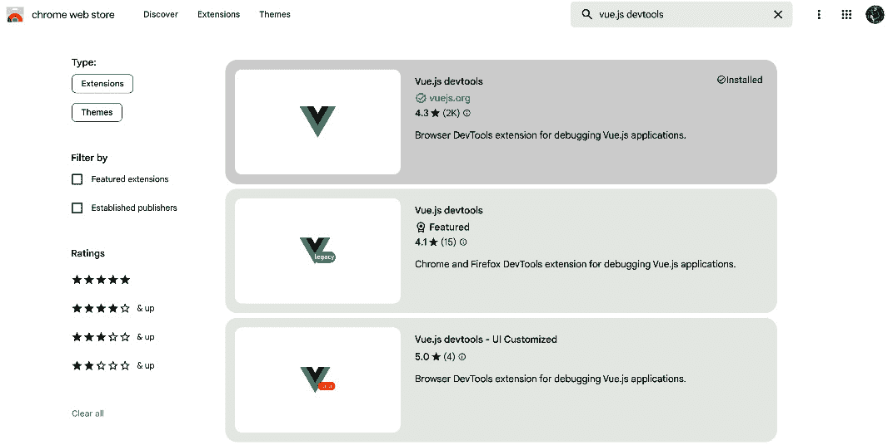

图 13.1：Chrome 扩展商店

有几个扩展名为 **Vue.js devtools**，但你想要安装由核心团队支持并开发的官方版本。这可以通过 **vuejs.org** 的勾选标记来识别。

在快速安装和浏览器重启后，你现在应该可以完全访问扩展。实际上，扩展不需要任何配置，直接使用即可。

要测试扩展是否工作，我们可以访问我们的伴侣应用网站 [`localhost:5173/`](http://localhost:5173/) 并检查 Vue.js 扩展图标。如果扩展当前未工作，图标会变灰，如果 Vue Devtools 可用并正在运行，图标则会着色。

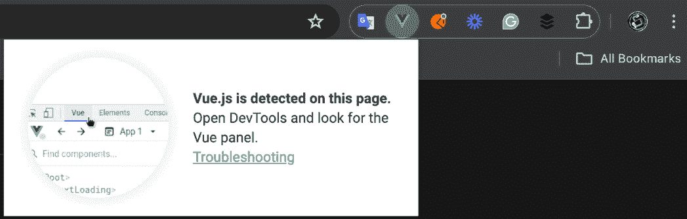

图 13.2：Vue Devtools 扩展

点击图标将确认扩展能够找到 Vue.js 并启用 Vue Devtools，如图 *图 13*.2* 所示。扩展作为 Chrome DevTools 中的一个新标签存在。这个标签应该会自动作为 DevTools 导航栏中最后一个可用的标签，名为 **Vue**。

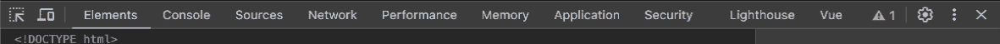

图 13.3：Chrome DevTools 导航

什么是 Chrome DevTools？

如果你不知道 Chrome DevTools 是什么，或者以前从未使用过它，我建议你查看官方文档 [`developer.chrome.com/docs/devtools`](https://developer.chrome.com/docs/devtools)，并开始了解这个工具可以以不同方式使用的所有不同方法。

Vue Devtools 会自动监听 Vue.js 应用，并在开发模式下运行的所有 Vue.js 网站上立即可用。这是一个非常重要的点，因为扩展在用于生产的网站上不会工作。如果你尝试访问一个生产 Vue.js 网站（如 Vue.js 官方网站），扩展会加载但处于非活动状态。

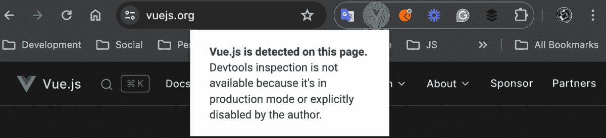

图 13.4：访问生产构建网站时 Vue Devtools 的弹出窗口

现在是时候回到伴侣应用，打开 Chrome DevTools，并点击 **Vue** 选项卡，开始学习这个扩展能提供什么功能。

在本节中，我们将介绍扩展的主要部分，但正如我们将在本章后面提到的，扩展会自动扩展以提供有关不同包（如 Pinia 或 vue-router）的更多信息。

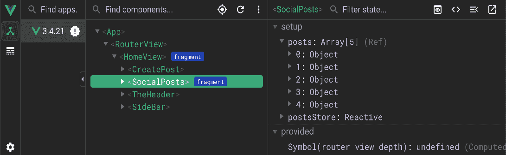

图 13.5：Vue Devtools

Vue Devtools 可以分为四个主要部分。我们将简要介绍所有这些部分，从左到右依次介绍：

+   **主要导航**：它位于左侧，作为一个垂直菜单。目前包含两个实体——组件和时序图。

+   **应用列表**：Vue.js 3 允许你在同一个网站上拥有多个应用，Vue Devtools 允许我们轻松地调试每一个。

+   **主要内容**：这是包括所选工具的区域。在*图 13*.5 中，我们选择了组件，因此本节显示组件树。

+   `<SocialPost>`组件。

现在是时候开始学习扩展的各个部分了。我们首先从默认部分开始，即组件和时间轴，然后进入如 Pinia 和 vue-router 等附加插件。

## 在 Vue Devtools 中调试组件

在本节中，我们将了解 Vue Devtools 为我们提供的调试和开发组件的功能。

在开发组件时拥有 Vue Devtools 这样的工具可以真正帮助您提高技能。Vue Devtools 可以帮助显示组件属性、事件和其他信息，这些信息有时在没有视觉线索的情况下可能难以发现或理解。

扩展组件部分的主体目标，可以通过点击主导航中的顶部图标访问，是提供我们对组件树的全面可见性和每个组件的详细信息。

让我们先看看组件树以及它为我们提供了哪些信息：

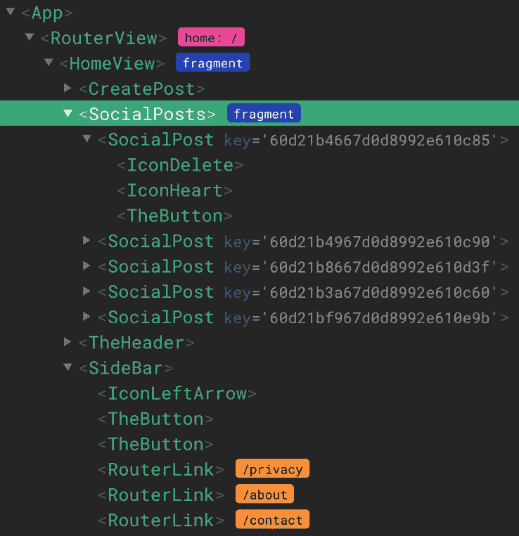

图 13.6：组件树

扩展提供的组件树与浏览器开发者工具提供的 DOM 树非常相似，主要区别在于 DOM 树显示 DOM 节点，而 Vue Devtools 由 Vue 组件组成。

在*图 13*.6 中，我们可以看到父组件和子组件之间的关系。实际上，我们可以看到`<SocialPosts>`有五个`<SocialPost>`子组件，而`<SocialPost>`有三个子组件。

树状图还显示了重要信息，例如由`home :/`紫色药丸定义的`<RouterView>`使用的路由，每个`<SocialPost>`个体的唯一键，以及每个`<RouterLink>`中定义的 URL。

能够可视化页面上渲染的组件很重要，但能够突出显示它们则更好。您可能一开始不会觉得这很重要，但能够在树中选择组件并在屏幕上看到它是一个非常实用的功能。

有两种方式可以突出显示组件。您可以直接在树中点击组件，或者通过启用**在页面上选择组件**来在页面上选择组件，如图*图 13*.7 所示。此功能可以通过点击图标或使用悬停在图标上时显示的弹出窗口中提示的键盘快捷键来启用。

图 13.7：页面中选择组件的按钮

当选择一个组件时，它将在屏幕上以绿色背景突出显示。

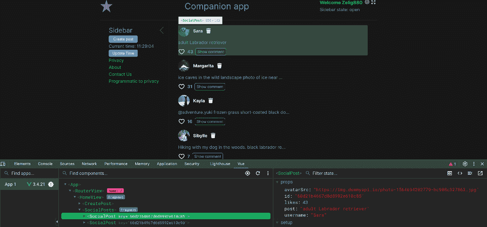

图 13.8：由 Vue Devtools 突出显示的社会帖子组件

现在我们已经可以读取树并选择单个组件，是时候深入扩展并查看每个组件显示的详细信息。

实际上，选择一个组件不仅通过将其高亮显示为绿色（如图*图 13.8*所示）提供给您一个关于组件的视觉线索，而且还暴露了关于它的内部信息列表。

侧边栏包括组件作用域内可用的所有信息，相当于能够打印出脚本设置中可用的所有内容。它包括基本信息，如`props`、Refs 和响应式，以及更高级的功能，如 Pinia 存储依赖项和路由信息。

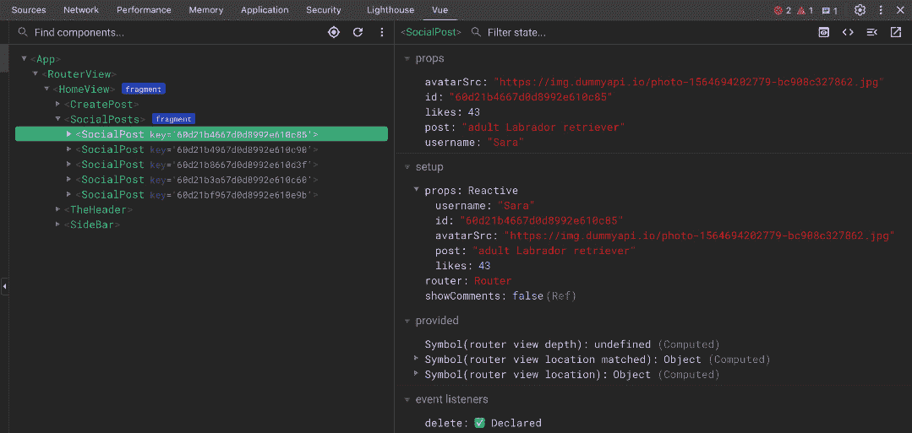

图 13.9：Chrome DevTools 显示的社交帖子详细信息

能够访问屏幕上每个组件的内部信息是 Vue Devtools 最重要的强大功能。能够快速查看父组件发送给子组件的属性或特定 R`ef`的当前值，可以为您节省无数小时的调试时间。此外，查看组件状态也将帮助您更好地理解 Vue.js 框架。当我最初开始学习 Vue 时，我使用 Vue Devtools 来了解组件的工作原理，并发现 props、内部数据和生命周期之间的联系，并且从那时起我就向我的所有徒弟推荐它。

## Vue Devtools 信息面板的用例

在本节中，我们将探讨几个使用 Vue Devtools 信息面板的用例。如前所述，信息面板包含许多有用的资源，但除非我们知道如何以及何时使用它们，否则它们毫无用处。

### 分析动态加载数据

在这个第一个场景中，我们将考虑一个开发者需要调试和理解 API 返回数据的用例。在我们的 Companion App 中，这种情况可能在开发**社交帖子**时出现。实际上，能够看到数据结构和值将有助于该组件的开发。

我们可以在*图 13.10*中看到 API 检索到的完整信息，即`<SocialPosts>`中的`posts`数组。

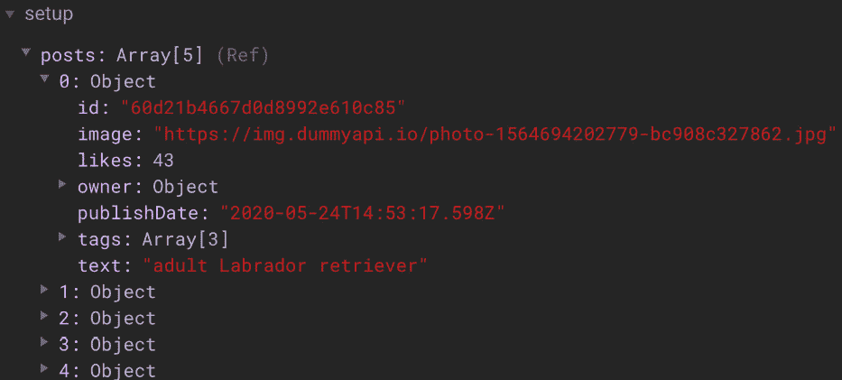

图 13.10：Vue Devtools 信息面板中显示的帖子信息

### 修改 Refs 和响应式数据

由于为我们的网页添加交互性的巨大可能性，JavaScript 已经变得流行。不幸的是，交互性并不总是容易实现，通常需要多次尝试才能使逻辑按预期工作。

在开发 Vue.js 组件时，你可能会发现自己处于需要测试不同场景的情况，这些场景要求数据处于特定状态。这有时可能非常耗时或复杂。

一个非常常见的场景是需要开发一个“错误”屏幕或电子商务购买后显示的“感谢”页面。为了开发这个组件，开发者需要重现多个步骤以达到所需的组件状态，这使得开发组件的过程非常缓慢。幸运的是，有了 Vue Devtools 的帮助，我们可以轻松地重现开发此组件所需的状态。

实际上，Vue Devtools 允许您实时修改 Refs 和 Reactive 数据。这可以直接在信息面板中完成，如图 *图 13.11* 所示。

您也可以修改 props

默认设置下，唯一可以修改的数据是 Refs 和 Reactive，但有一个设置允许您修改 Props。我个人不建议启用此功能，因为它可能会产生意外的后果，但了解其存在可能作为最后的手段是有帮助的。

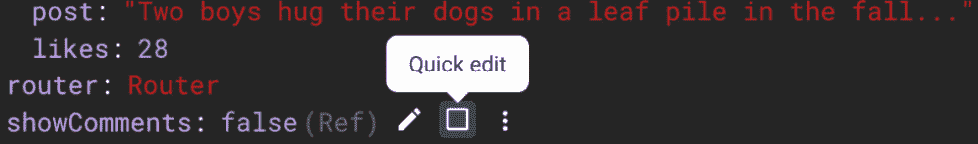

图 13.11：Vue Vue Devtools 快速编辑

### 监控变化

修改组件内的数据不是开发复杂组件的唯一要求。实际上，另一个重要的功能是能够实时查看组件数据的值。例如，您可能想确保您的切换按钮能够成功工作，同时一个 R`ef` 从 `false` 变为 `true`，一个计算属性按预期更改其值，或者最后，通过重置所有数据到其初始状态来确保“重置”逻辑正常工作。可能性是无限的。

当使用 Vue Devtools 时，信息面板中显示的数据会在修改时自动实时更改。这使我们能够与应用程序交互并看到我们的交互产生的变化。

在本节中，我们通过学习如何安装和启用扩展来介绍了 Vue Devtools。然后我们定义了 Vue Devtools 的所有不同区域，并学习了如何使用它来突出显示和读取 Vue 组件树。最后，我们学习了如何通过访问信息面板来深入一个组件。在这个面板中，我们学习了如何查看数据、监控变化，甚至实时进行更改。

在下一节中，我们将介绍 DevTool 的一个更高级的部分——时间轴部分。

# 深入 Vue Devtools 时间轴标签

在上一节中，我们介绍了如何使用 Vue Devtools 的组件部分来分析和开发我们的 Vue 组件。在本节中，我们将继续探索主要导航，介绍下一个可用的部分——时间轴。

时间轴部分是事件和性能监控等工具的家园，这些工具有助于理解应用程序，让我们一窥框架引擎。

本节可能更适合高级用例，但了解工具提供的内容总是有益的，即使它们在日常活动中没有被使用。

可以从扩展的左侧主导航中访问时间轴标签，就在我们之前使用的组件标签下方。

时间轴面板包括三个部分。第一部分是图层部分，它显示我们将要收集和显示信息的所有不同图层。第二部分是时间轴本身。它以两种不同的方式提供，实际的时间轴或表格格式。最后，我们有信息面板，它与组件部分提供的信息面板非常相似。

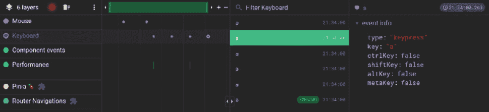

图 13.12：Vue Devtools 时间轴面板

图层部分包括时间轴可以提供的所有不同信息。Vue Devtools 提供的图层在不同应用程序之间可能有所不同，因为它还可以包括一个已安装的包，如*图 13.12*中所示，其中 Pinia 和 Router 的数据也包含在图层菜单中。

图层可以产生大量数据（我们将在后面的部分中看到），通常隐藏大多数图层，只保留与你的特定任务相关的图层。

启用时间轴是资源密集型的，并且它不会一直自动运行。要启用时间轴，我们需要点击图层标题旁边的记录按钮。

能够开始和停止录制不仅可以帮助我们节省一些电池寿命；它还将确保时间轴上显示的数据尽可能紧凑。例如，如果你想分析用户创建帖子时发生的情况，你将启用它，创建帖子，然后停止录制。这样做将确保仅显示你感兴趣的事件。

### 调试帖子删除

为了更好地理解时间轴，我们将记录和分析在删除帖子时时间轴提供的信息，并试图确定如何将其用于未来的调试目的。

为了能够分析 Vue Devtools 时间轴部分的输出，我将在我们的应用中执行以下步骤。这些步骤将生成一个报告，我们可以用它来了解时间轴提供了哪些信息：

1.  **访问时间轴标签**：打开 DevTools 并点击主导航中的时间轴标签。

1.  **选择图层**：我们只会使用**组件事件**、**性能**和**Pinia**图层。从图层菜单中选择它们。

1.  **开始录制**：现在，我们准备好记录我们的操作。通过点击记录按钮开始录制。

1.  屏幕上显示的某个帖子中的“删除”图标。

1.  **停止录制**：再次点击记录按钮以停止录制。

在完成前面的步骤后，时间轴应该显示类似于*图 13.13*所示的内容。

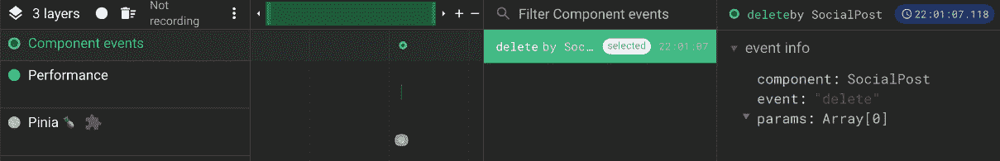

图 13.13：删除帖子后显示的时间轴信息

让我们看看记录活动后显示的信息。在检查记录会话的输出之前，让我们回到应用程序代码中，发现我们期望上述操作执行的动作。代码显示，当在`<SocialPost>`组件内部点击删除图标时，它应该发出一个名为`"delete"`的事件，然后用于`<SocialPosts>`触发 Pinia 操作，从而从存储中删除帖子。

如果我们回到我们的记录活动，我们可以看到时间线显示了所有三个层的一些活动。第一层是`"delete"`，正如我们所期望的那样，是由`<SocialPost>`触发的。信息面板显示了有关事件的详细信息，例如参数，但在这个案例中，我们没有参数，数组为空。

接下来，我们将查看**Pinia**层显示的内容：

图 13.14：Pinia 的时间线事件

在选择`removePost`操作后，信息面板中显示了详细的信息。接下来，我们有一个突变；这是从`removePost`调用的，是实际从`posts`数组中删除帖子的操作。然后，我们有`removePost end`事件的`removePost`结束。总的来说，该操作耗时 0.8 毫秒完成。到目前为止，我们已经能够分析事件是否被触发，并跟踪 Pinia 操作的步骤。

跟踪您的操作

我们的`removePost`操作非常快，在不到 1 毫秒内完成。这并不总是如此，因为某些操作可能包括复杂的代码或外部操作，这可能会延迟其执行。使用时间线可以帮助您调试和修复慢速操作。

最后，我们将检查性能层显示的信息。就像其他两个层一样，当选择此层时，我们会看到单个事件及其信息。

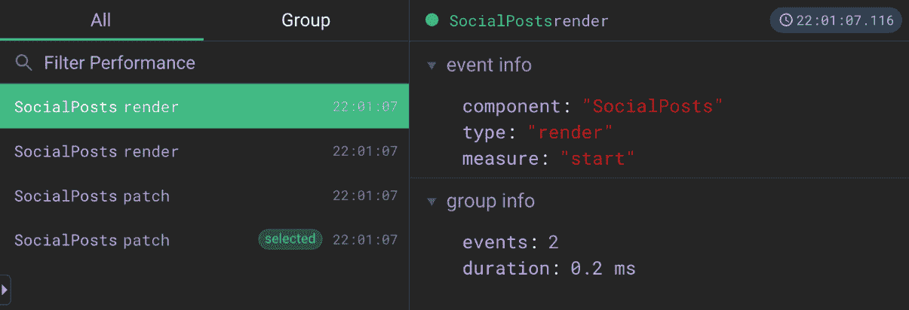

图 13.15：性能时间线层

性能层用于高级用例，通常用于挖掘性能相关的问题或突出显示配置错误的代码库，这迫使您重新渲染一个或多个组件。

此层显示特定组件何时渲染或更新。在这种情况下，它只记录了四个事件，但对于大型应用程序来说，这可能会非常复杂。

能够分析渲染时间和组件渲染的次数对于性能问题严重的应用程序非常有用。**计算属性**或**监视器**的不正确使用可能导致组件的不必要重新渲染，性能时间线是帮助您调试和修复性能瓶颈的最佳工具。

在本节中，我们学习了如何使用 Vue Devtools 的时间线部分。我们定义了其结构，记录了一个示例测试以查看我们的应用程序性能，并了解了各个层显示的信息。

在下一节和最后一节中，我们将看到如何通过自定义插件扩展 Vue Devtools。

# 使用 Vue Devtools 插件分析附加数据

你可能已经注意到，从上一节中，Vue Devtools 不仅包括有关核心框架的信息，还公开了额外的信息，例如 Pinia 存储 和 vue-router。

这一切都是自动发生的，因为我们没有做任何额外的事情来扩展 Vue Devtools 的功能。事实上，插件实际上是我们在应用程序中安装的包的一部分，因此安装一个包有时会导致在 Vue Devtools 中显示额外的功能。

任何插件都提供不同的功能。在我们的例子中，Pinia 和 vue-router 都在时间轴视图中添加了一层，在组件详细信息面板中添加了信息，最后在主导航中添加了一个额外的选项卡。

在本节中，我们将深入了解两个可用的插件——Pinia 和 vue-router。

## Pinia Vue Devtools 插件

我们将要分析的第一款扩展插件是由 Pinia 存储提供的。

以其标志性的菠萝标志而闻名的 Pinia 存储，可以从扩展的左侧主导航中访问。

这个插件可能会让你感到有些熟悉，因为它与组件部分的布局相似。

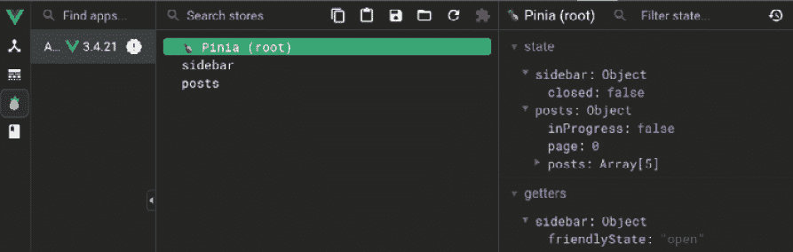

图 13.16：Pinia Vue Devtools 插件

在 Pinia 扩展中，我们能够检查我们的存储。该插件提供了通过选择 **Pinia (root**) 或我们状态管理中可用的单个存储来查看所有存储的能力。

信息面板中显示的数据按 `state` 和 `getters` 分隔，就像组件部分一样，它可以随时修改。

就像我们迄今为止探索的大多数功能一样，能够快速查看存储的当前状态并修改它们的值非常有价值。能够随时访问这些信息将节省你无数小时的开发时间。

## vue-router Vue Devtools 插件

如你所记，在*第十章*中，我们介绍了在伴侣应用中引入的路由，我们必须创建一组规则，这些规则将由路由器使用以决定向用户显示哪个路由。

vue-router 插件可以帮助你在浏览器中直接可视化并检查这些规则。该插件提供了一个包含完整信息的路由列表，包括名称、正则表达式匹配和所需键。

图 13.17：vue-router 规则列表

*图 13.17* 中显示的列表显示了以下信息：

+   为特定路由定义的 URL (`/about`)。

+   蓝色药丸中显示的路由名称（`user-profile`）。

+   当前活动路由，由带有 `active` 标签的蓝色药丸表示。

+   如`redirect`和`exact`之类的额外信息。这分别表示存在重定向规则（`/user/:userId`）以及当前活动路由与规则匹配正则表达式完美匹配的概念。

现在我们已经定义了 vue-router 规则列表中可用的所有信息，是时候看看为每个单独的路由规则提供了哪些信息。让我们点击`/user/:userId`来查看它显示的内容：

图 13.18：vue-router Vue Devtools 插件的路由信息

该插件显示路由数组中可用的所有数据，例如`path`、`name`和`redirect`。此外，该插件还公开了更高级的数据，例如包用于决定显示正确路由所使用的正则表达式，以及关于键的详细信息，例如`optional`和`repeatable`，最后但同样重要的是，路径中每个条目的`score`值。

在您的职业生涯中，您可能不会在这个区域花费很多时间，但当你这样做时，它将拥有解决您问题的所有所需。

# 摘要

Vue 生态系统自豪地提供整个行业中最好的开发体验之一，Vue Devtools 可能是造成这种情况的罪魁祸首。

详细信息、性能指标和自动插件扩展使该扩展成为所有 Vue 开发者的必备品。本章最重要的收获是您需要在本地安装扩展并开始在项目中使用它。

在本章中，我们学习了如何安装和导航 Vue Devtools。我们涵盖了提供的各个默认部分——组件和时间线。最后，我们通过展示 Pinia 和 vue-router 在调试扩展中提供的附加信息，介绍了 Vue Devtools 中包插件的强大功能。

在下一章和最后一章中，我们将探讨未来的学习和资源，您可以使用这些资源继续您的 Vue 开发者之旅。
