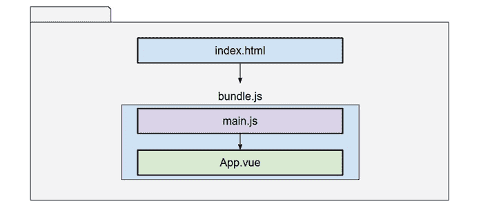

# 1

# Vue 3 框架

与互联网早期只是学术和科学目的的链接页面集合相比，今天的全球互联网已经发生了巨大的变化。随着技术的进步和机器变得更加强大，早期协议中添加了越来越多的功能，新技术和技术竞争，直到最终采用标准。额外的功能以浏览器插件和嵌入式内容的形式出现。Java 小程序、Flash、Macromedia、Quicktime 以及其他插件都很常见。随着 HTML5 的到来，其中大多数，如果不是全部，都逐渐被标准所取代。

现在，结构、样式和行为之间存在明确的区分。**超文本标记语言**（**HTML**）定义了构成网页的结构元素。**层叠样式表**（**CSS**）提供规则来修改 HTML 元素的显示外观，包括动画和转换。最后，JavaScript 是一种编程语言，它提供行为并可以访问和修改 HTML 和 CSS。因此，引入了众多不同的功能，也带来了浏览器之间的高度复杂性和不兼容性。这就是库和框架诞生的原因，最初是为了解决不兼容性问题并标准化外观，但很快演变为包括其他编程范式，而不仅仅是简单的 HTML 和 CSS 操作。

当今最流行的库和框架中，一些使用 **响应式范式**。它们巧妙地在 JavaScript 中进行更改，以自动反映在 HTML/CSS 中。Vue 3 是进阶框架的最新版本，它大量使用了响应性的概念。它还实现了其他软件设计范式和模式，允许你从静态网页中的简单交互构建到可以本地安装并可与原生桌面应用程序竞争的复杂应用程序。

在本书中，我们将探索 Vue 3 框架，并研究不同的设计模式，以帮助我们构建一流的应用程序：从简单的网页到强大的 **渐进式网络应用程序**（**PWAs**）。在这个过程中，我们将探讨软件工程中的最佳实践和经过验证的模式。

本章涵盖了以下主题：

+   进阶框架

+   单文件组件

+   不同的语法选项来编写组件

到本章结束时，你将基本了解 Vue 3 在 JavaScript 生态系统中的位置以及它提供的功能。对于 Vue 2 用户，本书附录中包含迁移应用程序时需要了解的更改。随着本书的进展，我们将在此基础上构建知识。

# 进阶框架

在我们描述 Vue 是什么之前，我们需要区分术语**库**和**框架**。这些术语经常被互换使用，但它们之间有一个区别，一个好的开发者应该在选择其中一个来构建 Web 应用程序时意识到这一点。

让我们来看看这些术语的定义：

+   **图书馆**是一个由他人开发的可重用代码集合，以函数、类等形式存在，可以轻松导入到你的程序中。它并不规定如何以及在哪里使用它，但通常，它们会提供如何使用它们的文档。程序员需要决定何时以及如何实现它们。这个概念存在于大多数开发语言中，以至于其中一些完全基于导入库来提供功能的概念。

+   **框架**也提供了一系列供你使用的类和函数，但规定了定义程序运行和构建方式、架构以及你的代码可以在何种条件下或如何使用的规范。这里要考虑的关键属性是，框架在应用程序中反转了控制权，因此它定义了程序的流程和数据。通过这样做，它强调了程序员应该遵守的结构或标准。

在区分了这些概念之后，现在提出了一个问题：何时使用库，何时使用框架。在回答这个问题之前，让我们明确，在构建实际应用程序时，这两者之间有一个巨大的灰色区域。从理论上讲，你可以使用任何一个来构建相同的应用程序。像软件工程中的所有事情一样，这是一个决定每种方法权衡的问题。所以，带着一点盐来接受接下来的内容；这不是刻在石头上的法律：

+   当构建小型到中型应用程序或需要向应用程序添加额外功能时（通常，你可以在框架内部使用额外的库），你可能想使用**库**。也有一些“大小”指南的例外。例如，**React**是一个库，但基于它构建了巨大的应用程序，如 Facebook。需要考虑的一个权衡是，仅使用库而不使用框架将需要建立团队内的共同方法和更多协调，因此管理和方向的努力可以显著增加。另一方面，在纯 JavaScript 编程中使用库可以提供一些重要的性能改进，并给你带来相当大的灵活性。

+   当你构建中到大型应用程序时，你可能需要使用一个*框架*，当你需要一个结构来帮助你协调开发，或者当你想要快速入门而跳过从头开始开发常见功能的基础。有些框架是建立在其他框架之上的，例如，**Nuxt**是建立在**Vue**之上的。需要考虑的权衡是，你被指定了一个架构模型来构建应用程序，这通常遵循特定的方法和思维方式。你和你的团队将不得不学习框架及其限制，并在这个范围内工作。总有可能你的应用程序在未来会超出框架的范围。同时，一些好处如下：更容易协调工作，从先发优势中获得相当大的收益，真正解决并经过测试的常见问题，专注于特定情况（例如，考虑购物应用与社交媒体之间的差异），等等。然而，根据框架的不同，你可能会因为额外的处理而面临一些小的性能损失或扩展困难。权衡每种情况的利弊取决于你。

那么，Vue 究竟是什么呢？根据定义，*Vue 是一个渐进式框架*，用于构建用户界面。渐进式意味着它具有框架的架构优势，同时也具有库的速度和模块化优势，因为特性和功能可以增量实现。在实践中，这意味着它规定了构建应用程序的某些模型，但同时也允许你从小规模开始，并根据需要扩展。你甚至可以在单个页面上使用多个 Vue 应用程序，或者接管整个应用程序。如果需要，你甚至可以导入和使用其他库和框架。相当复杂！

Vue 的另一个基本概念是**响应性**。它指的是自动在 HTML 中显示 JavaScript 中变量值或变化的能力，但也包括在你的代码中。这是 Vue 提供的魔法的一部分。

在传统编程中，一旦变量被分配了一个值，它就会保持这个值直到程序性地改变。然而，在响应式编程中，如果一个变量的值依赖于其他变量，那么当这些依赖项中的任何一个发生变化时，它将采用新的结果值。以下是一个简单的公式为例：

```js
A = B + C
```

在响应式编程中，每当`B`或`C`的值发生变化时，`A`也会发生变化。正如你将在本书后面看到的，这是一个构建用户界面的非常强大的模型。在这个例子中，并且为了符合术语，`A`是依赖项，而`B`和`C`是依赖项。

在接下来的章节中，我们将随着构建示例应用程序来探索这个*渐进式*属性。但在那之前，我们需要看看 Vue 3 在其最基本形式下提供了什么。

# 在你的 Web 应用程序中使用 Vue

在你的 Web 应用中使用 Vue 有几种选择，这很大程度上取决于你的目标：

+   要在页面上包含一个小型自包含的应用或代码片段，你可以直接在脚本标签中导入 Vue 和代码

+   要构建一个更大的应用，你需要一个构建工具，它将你的代码打包以进行分发

注意，我使用的是“打包”这个词，而不是“编译”，因为 JavaScript 应用是在浏览器上运行时解释和执行的。这一点将在我们介绍**单文件组件**的概念时变得明显。

让我们简要地看看一个非常简单的 HTML 页面中的第一个案例示例：

```js
<html>
<head>
    <script src="img/vue@3"></script>
</head>
<body>
    <div id="app">
    {{message}}
    </div>
<script>
    const {createApp} = Vue
    createApp({
        data(){
            return {message:'Hello World!'}
        }
    }).mount("#app")
</script>
</body>
</html>
```

在`head`部分，我们定义一个`script`标签并从免费的`Vue`导入 Vue，它暴露了框架的所有方法和函数。在我们的`body`标签内部，我们声明一个具有`id="app"`的`div`元素。这定义了我们的小型应用将被挂载的位置以及我们的 Vue 框架将控制的页面部分。请注意`div: {{message}}`的内容。双大括号定义了一个在运行时将被`message`变量的值替换的内容点，该变量我们在 JavaScript 中定义。这被称为**插值**，是值（字符串、数字等）在网页上显示的主要方式。

到了`body`的结尾，我们创建了一个包含我们应用的脚本元素。我们首先从 Vue 中提取`createApp`函数，并通过传递一个对象来使用它创建一个应用。这个对象有特定的字段，定义了一个`data()`方法，该方法反过来返回一个对象。这个对象中的字段名将被视为响应式变量，我们可以在 JavaScript 以及 HTML 中使用它们。最后，`createApp()`构造函数返回 Vue 3 应用实例，因此我们链式调用并调用`mount()`方法，将我们谦逊的应用挂载到具有`app` ID 的元素上。请注意，我们使用 CSS 选择器作为参数（井号表示`id`属性，因此`id="app"`通过`#app`被选中）。

由于这种使用 Vue 的方法并不常见（或流行），我们将关注更重要的事情，并使用**打包器**来组织我们的工作流程，并拥有显著更好的开发者体验……但首先，我们需要了解更多关于 Vue 以及是什么让它如此出色的信息。

## 打包器的方式，更好的方式...

如你所想，直接将 Vue 导入到网页中只会适用于非常小的应用程序。相反，Vue 以*组件*的概念构建，这些是可重用的、隔离的 JavaScript 代码、HTML 和 CSS 集合，它们作为一个单元运行。你可以把它们看作是构建网页的构建块。显然，浏览器对此一无所知，因此我们将使用*打包器*将我们的应用程序转换成浏览器可以解释的格式，同时在这个过程中还可以运行一系列优化。这就是“框架”部分开始发挥作用的地方，因为它规定了这些组件应该如何编写以及需要包含哪些方法。

使用打包器时，它将把我们的所有代码打包成一个或多个浏览器在运行时加载的 JavaScript 文件。Vue 应用程序在浏览器中的执行工作流程可以简化如下：



图 1.1：使用打包器时我们应用程序执行顺序的非常简化的视图

浏览器将像往常一样加载`index.html`页面，然后加载并执行`bundle.js`文件，就像任何其他 JavaScript 文件一样。打包器将打包所有我们的文件，并按规定的顺序执行它们：

1.  `main.js`文件将导入并启动 Vue 3 应用程序。

1.  然后，它将从*主*组件开始页面组合，这里封装在`App.vue`文件中。这个组件将生成其他组件，从而形成一个构成页面的组件树。

如果现在听起来有点奇怪，请不要担心。随着我们在书中构建示例应用程序的进展，我们将看到这些概念的实际应用。在*第三章* *设置工作项目*中，我们将使用这个相同的图表开始一个简单的应用程序。

到目前为止，你已经对库和框架有了了解，并且对 Vue 能提供的内容有了一个快速的浏览。重要的是要记住，在现代 JavaScript 世界中，使用打包器来帮助我们组织应用程序并对浏览器代码进行优化是很常见的。稍后我们将使用官方的 Vue 3 打包器**Vite**。但首先，我们需要一些更多的基础概念。

# 理解单文件组件

如你所猜，之前提到的`App.vue`文件是一个从`App.vue`到最后的自定义按钮的组件，如果你愿意的话。我们将在*第四章*中深入讨论组件，即*组件的用户界面组合*，但就目前而言，请记住这是框架规定的做法。如果你有面向对象语言的经验，这可能会看起来很熟悉（而且你不会错）。

SFC 是一个带有`.vue`扩展名的纯文本文件，包含以下部分：

```js
<script setup>
    // Here we write our JavaScript
</scrip>
<template>
    <h1>Hello World! This is pure HTML</h1>
</template>
<style scoped>
    h1{color:purple}
</style>
```

最初看起来可能有些奇怪，所有这些内容都集中在一个地方，但实际上这正是它的优点所在。以下是每个部分的描述：

+   一个`setup`。这将定义我们将用于在 Vue 中编写代码的应用程序接口。我们还可以声明`lang="ts"`属性来使用 TypeScript 而不是纯 JavaScript。

+   一个**template**标签包围着我们的组件的 HTML。在这里，我们可以使用 HTML 元素、其他组件、指令等等。Vue 的一个巨大优势是我们可以使用纯 HTML 来编写我们的 HTML。这听起来可能很显然，但其他库处理这个问题完全不同，并且有自己的语法。然而，Vue 3 也允许通过使用打包器插件来使用其他语法。我们在这里也有选择。

+   一个`scoped`属性，它将封装规则并限制它们只应用于我们的组件，从而防止它们“溢出”到应用程序的其他部分。与前面的部分一样，我们也可以使用不同的语法来编写样式，只要它被打包器支持。

最佳实践

总是作用域你的样式，除非你在父组件上定义样式或你希望明确传递到整个应用程序的 CSS 变量。对于应用程序范围的样式，请使用单独的 CSS 文件。

需要记住的重要概念是，一个 SFC 包含这三个定义单个组件的元素。打包器应用程序将施展其魔法，将每个部分分离并放置在适当的位置，以便浏览器可以正确地解释它们。我们将在*第三章*“设置工作项目”和*第四章*“组件的用户界面组合”中使用快速且新的**Vite**，深入探讨组件以及如何在它们之间处理控制流和信息流。但首先，让我们看看我们如何编写我们的组件。

# 不同的笔触——选项、组合和脚本设置 API

在 Vue 2 中描述组件的经典方式已被标记为*Options API*。为了保持向后兼容性，Vue 3 也支持相同的语法。然而，还有一个名为*Composition API*的新语法，这是我们将在本书中使用的。

*Options API*是从 Vue 2 继承的，规定一个组件由一个具有定义字段的对象定义，其中没有任何字段是强制性的。此外，其中一些具有定义的参数和预期输出。例如，这些是最常用的字段（也是一个非排他性列表）：

+   `data`应该是一个返回对象的函数，其字段将成为响应式变量。

+   `methods`是一个包含我们的函数的对象。这些函数可以通过使用`this.variableName`格式访问`data`中的响应式变量。

+   `components` 是一个对象，其中每个字段提供了一个模板的名称，值指向另一个组件（当前组件的子组件）的构造函数。

+   `computed` 是一个对象，其属性定义了“计算”属性。每个成员随后是一个函数或对象，可以用作模板和代码中的响应式变量。函数将是只读的，对象可以包含读取和写入它们值的逻辑。这个概念将在我们查看*第三章*的*设置工作项目*中的代码示例时得到阐明。

+   `props` 和 `emits` 声明参数以从父组件接收数据，并声明发送到父组件的事件。这为在相关组件之间进行通信和传递数据提供了一种正式的方式，但并非唯一，正如我们将在*第七章*的*数据流管理*中看到的。

+   生命周期钩子方法是一系列在组件生命周期中触发的函数。

+   混合是一种对象，它描述了可以在多个组件之间共享的通用功能。这并不是在 Vue 3 中重用代码的唯一方式。在 Options API 中使用混合引起了一些复杂性，从而产生了 Composition API。我们不会详细讨论混合，但会看到其他在组件之间共享功能的方法（例如“composables”）。

这种语法定义良好，但有一些限制。对于小型组件，它提供了过多的脚手架代码，而对于大型组件，代码组织受到严重影响，且非常冗长。此外，为了引用在 `data` 部分或其他方法中声明的响应式变量，内部代码必须使用 `this` 关键字（例如，`this.data_variable_name` 或 `this.myMethod()`）。`this` 关键字指的是组件创建的实例。问题是当保留字 `this` 的含义根据使用范围和上下文而变化时。随着时间的推移，出现了其他缺点，导致了组合式 API 的创建。然而，这种语法在 Vue 3 中是相关且完全支持的。这个优点之一是你可以轻松地将代码从 Vue 2 迁移过来（在附录中稍后展示的某些考虑范围内，如*附录 - 从 Vue 2 迁移*）。

组合式 API 提供了一个名为 `Setup()` 的方法，它在组件挂载之前执行。在这个方法中，我们导入函数和组件，声明变量等，这些定义了我们的组件，而不是将它们声明为“选项”。这意味着你可以用更 JavaScript 的方式编写代码，这给了你更好的导入、重用和组织代码的自由。

让我们通过一个反应变量`_hello="Hello World"`来比较这两种方法：

**选项式 API**

```js
<script>
 export default{
    data(){return {_hello:"Hello World"}}
 }
</script>
```

**组合式 API**

```js
<script>
  import {ref} from "vue"
  export default{
    setup(){
      const _hello=ref("Hello World")
      return {_hello}
    }
  }
</script>
```

在选项 API 中，我们只是使用`data`字段来返回一个对象，其字段将变成响应式变量。Vue 将负责解释这个对象。然而，请注意，在组合式 API 中，我们首先需要从 Vue 导入`ref`构造函数，这将为我们创建一个响应式常量或变量。最终结果是一样的，但在这里，我们对自己的操作和位置有更多的精细控制。当使用新的 Vite 打包器时，这种对组件中导入内容的精细控制可能会导致代码构建和开发时间的加快。

初看之下，似乎组合式 API 比选项 API 更冗长，对于这样一个简单的例子确实如此。然而，随着我们的组件开始增长，这种状况就相反了。尽管如此，仍然很冗长...所以，组合式 API 有一个名为*脚本设置*的替代语法，这是我们将在本书中使用的语法。现在让我们比较一下使用这种新语法时组件的外观：

**组合式 API –** **脚本设置**

```js
<script setup>
    import {ref} from "vue"
    const _hello=ref("Hello World")
</script>
```

仅仅两行代码！这很难超越。因为我们添加了`setup`属性到`script`标签中，打包器就知道我们在这里所做的所有事情都属于组合式 API 的范畴，所有的函数、变量和常量都会自动暴露给模板。不需要定义导出。如果我们需要什么，我们可以直接导入并使用它。此外，我们现在还有一些额外的优势，如下所示：

+   我们可以在模板中显示响应式和非响应式变量

+   我们知道所有代码都是在组件挂载之前执行的

+   语法更接近 vanilla JavaScript（一个很大的优点！！！），因此我们可以根据我们的方便和愉悦来组织代码

+   更小的包大小（我之前提到过吗？是的，这很重要！）

但是等等，你可能注意到我把一个响应式变量定义为一个*常量*！是的，我是这样做的！而且，不，这并不是一个错误。在 JavaScript 中，常量指向一个特定的不可变值，在这个例子中，是一个对象，但这个规则只适用于对象，不适用于它的成员。`ref()`构造函数返回一个对象，因此常量适用于对象引用，我们可以改变其成员的值。如果你在 Java、C 或类似的语言中处理过指针，你可能认识这个概念，即使用对象的`value`属性。以下是一个例子：

```js
_hello.value="Some other value";
```

但是，与此同时，访问这个变量在模板中的方式并没有改变：

```js
<div>{{_hello}}</div>
```

简而言之，每次使用`ref()`构造函数将变量声明为响应式时，你需要使用`constant_name.value`格式来引用其值，就像模板（HTML）中的`constant_name`一样。当在模板中使用常量名称时，Vue 已经知道如何访问该值，你不需要像在 JavaScript 中那样显式地引用它。

小提示

采用代码约定，这样你就可以知道标识符是指变量、常量、函数、类等等

# 探索 Vue 3 的内置指令

Vue 还提供了称为 `v-` 的特殊 HTML 属性。对于本书的目的，让我们解释最常用的 Vue 指令：

## v-bind: (缩写 ":")

`v-bind:` 指令将 HTML 属性的值绑定到 JavaScript 变量的值。如果变量是响应式的，每次它更新其值时，它都会反映在 HTML 中。如果变量不是响应式的，它将仅在 HTML 的初始渲染期间使用一次。我们通常只使用 `:` 缩写前缀（分号）。例如，`my_profile_picture` 响应式变量包含一个指向图片的网址：

`<``img :src="img/my_profile_picture">`

`src` 属性将接收 `my_profile_picture` 变量的值。

## v-show

这个指令将显示或隐藏元素，而不会将其从文档中移除。它相当于修改 CSS 的 `display` 属性。它期望一个提供布尔值的变量（或可以解释为真或非空的东西）。例如，`loading` 变量有一个布尔值：

`<``div v-show="loading">…</div>`

当 `loading` 变量为真时，`div` 将会显示。

重要的是要记住，`v-show` 将使用对象的样式来显示或隐藏它，但元素仍然是 **文档对象模型**（**DOM**）的一部分。

## v-if, v-else, 和 v-else-if

这些指令的行为与 JavaScript 中的条件语句预期一致，根据传递的表达式解析的值显示或隐藏元素。在它们将元素显示或隐藏的意义上，与 `v-show` 类似，但不同之处在于它们会完全从 DOM 中移除元素。因此，如果在大规模上不正确地使用经常切换状态的元素，这可能会在计算上非常昂贵，因为框架必须执行更多操作来操作 DOM，而与 `v-show` 不同，当只需要更改显示样式时。

注意

使用 `v-if` 来显示或显示那些一旦显示或隐藏后不会切换的元素（并且在初始状态为隐藏时首选）。如果元素将经常切换状态，请使用 `v-show`。这将提高显示大量元素时的性能。

## v-for 和 :key

这两个属性结合使用时，在 JavaScript 中表现得像 `for` 循环。它们将根据迭代器中指定的数量创建元素副本，每个副本都有相应的插值值。这对于显示数据项集合非常有用。`:key` 属性在内部用于更有效地跟踪变化，并且必须引用正在迭代的项的唯一属性——例如，对象的 `id` 字段，或者当索引不会改变时数组中的索引。以下是一个示例：

`<span v-for="i in 5" :key="i"> {{``i}} </span>`

这将在网页上显示五个 `span` 元素，`i` 的插值显示以下内容：

`1 2 3 4 5`

## v-model

这个指令简直就是魔法。当它附加到输入元素（input、textarea、select 等）上时，它将把 HTML 元素返回的值赋给引用的变量，从而保持 DOM 和 JavaScript 状态的一致性——这被称为**双向绑定**。以下是一个示例：

`<input type="text" v-model="name">`

当用户在 HTML 中输入文本时，JavaScript 中的`"name"`变量将立即被赋予该值。在这些示例中，我们使用的是原始数据类型，如数字和字符串，但我们也可以使用更复杂的数据类型，如对象或数组。更多内容将在*第四章*中介绍，即使用组件进行用户界面组合，届时我们将深入探讨组件。

## v-on:（以及缩写@）

这个指令的行为与之前看到的不同。它期望的不是变量，而是一个函数或表达式，并将一个 HTML 事件绑定到一个 JavaScript 函数上以执行它。事件需要在冒号后立即声明。例如，为了响应按钮上的`click`事件，我们会写出以下内容：

```js
<button v-on:click="printPage()">Print</button>
```

当按钮触发`click`事件时，JavaScript 中的`"printPage()"`函数将被执行。此外，这个指令的缩写更常用，从现在起，我们将在这本书中使用它：只需将`v-on:`替换为`@`。然后，之前的示例变为以下内容：

`<button @click="printPage()">打印</button>`

您可以在官方文档中找到内置指令的完整列表：[`vuejs.org/api/built-in-directives.html`](https://vuejs.org/api/built-in-directives.html)。随着我们的前进，我们将看到其他指令。

到目前为止，我们已经看到 Vue 3 应用程序是通过组件构建的，这些组件我们可以用在我们的 HTML 中，并且我们使用 SFCs 创建它们。该框架还为我们提供了用于操作 HTML 元素的指令，但这并不是全部。在下一节中，我们将看到该框架还提供了一些方便的预构建组件供我们使用。

# 内置组件

该框架还为我们提供了几个内置组件，我们可以在不将它们显式导入每个 SFC 的情况下使用。我在这里为每个组件提供了一个简短的描述，因此您可以参考官方文档以获取语法和示例（见[`vuejs.org/api/built-in-components.html`](https://vuejs.org/api/built-in-components.html)）：

+   `Transition`和`TransitionGroup`是两个可以协同工作以提供元素和组件动画和过渡的组件。它们需要您创建 CSS 动画和过渡类，以便在将元素插入或从页面中删除时实现动画。它们主要（或经常）用于您使用`v-for`/`:key`或`v-if`/`v-show`指令显示元素列表时。

+   `KeepAlive` 是另一个包装组件（意味着它包围其他组件），用于在包裹的组件不再显示时保留状态（内部变量、元素等）。通常，组件实例在卸载时会被清除并“垃圾回收”。`KeepAlive` 将它们缓存起来，以便它们在重新显示时恢复状态。

+   `Teleport` 是 Vue 3 中的一个全新的组件，允许你将组件的 HTML 传输到页面上的任何位置，甚至可以传输到应用组件树之外。这在某些情况下很有帮助，当你需要在外部显示信息但必须由组件的内部逻辑处理时。

+   `Suspense` 是 Vue 3 中的一个新组件，但仍然处于实验阶段，因此在撰写本文时其未来尚不确定。其基本思想是在所有异步子组件/元素准备好渲染之前显示“后备”内容。它作为一个便利性提供，因为存在可以用来解决这个问题的一些模式。我们稍后会看到一些。

+   `Component-is` 是一个特殊元素，它将在运行时根据变量的内容加载组件——例如，如果我们需要根据变量的值显示一个组件，而使用其他指令可能很繁琐。它也可以用来渲染 HTML 元素。让我们看一个例子：

    ```js
    <script setup>
        import EditItem from "EditItem.vue"
        import ViewItem from "ViewItem.vue"
        import {ref} from "vue"
        const action=ref("ViewItem")
    </script>
    <template>
        <component :is="action"></component>
        <button @click="action='EditItem'">Edit</button>
    </template>
    ```

在这个简单的例子中，当用户点击“编辑”按钮时，动作值将更改为`EditItem`，并且组件将在原地交换。你可以在这里找到文档：[`vuejs.org/api/built-in-special-elements.html.`](https://vuejs.org/api/built-in-special-elements.html)

基于框架和组件的理念，我们现在更好地准备向前迈进。

# 书籍代码约定

在这本书中，我们将使用一组适用于 Vue 3 的代码约定和指南，这些都是良好的实践。它们将帮助你不仅理解本书的示例，还能理解你可能会遇到的野外科普代码，因为越来越多的开发者正在使用它。让我们从开始讲起。

## 变量和属性

这些名称总是小写，并且空格被下划线替换，例如 `total_count` 和 `person_id`..

## 常量

对注入对象的引用以 `$`（美元符号）开头，例如 `$router`、`$modals` 和 `$notifications`。

对响应式数据的引用以 `_` 开头，并使用蛇形命名法，例如 `_total` 和 `_first_input`。

对常量值的引用全部使用大写字母，例如 `OPTION` 和 `LANGUAGE_CODE.`

注入依赖的构造函数将以 `use` 开头，例如 `const $store=useStore().`

## 类和组件名称

这些名称使用 PascalCase（每个单词以大写字母开头），例如 `Person`、`Task` 和 `QueueBuilder`。

## 函数、方法、事件和文件名

例如，这些是用驼峰命名法编写的，例如，`doSubscribe()`和`processQueue()`

## 实例

实例将具有抽象名称，对于提供函数的纯 JavaScript 对象，后面跟着单词`Service`，对于状态模型，则是`Model`，等等。我们将使用服务来封装功能。

这里有一个例子：`const` `projectService=new ProjectService().`

小贴士

与你的团队一起，始终使用大家都同意的代码约定。这将使代码更易于阅读和维护。还建议使用一个 linter（一个用于捕获你代码中约定的处理器）。

正如之前提到的，这些代码约定越来越受欢迎，所以你可能会在多个项目中看到它们。然而，这些并不是强制性的标准，绝对不是由框架规定的。如果你喜欢全部大写，那也可以，但真正重要的是你和你的团队能够以一致的方式定义并遵守自己的约定。最终，重要的是我们都有一种共同的代码编写语言。

# 摘要

本章已经从库和框架的基础知识过渡到 Vue 3 指令、组件，甚至代码约定。这些概念仍然有些抽象，所以随着我们继续阅读本书的其余部分并编写实际代码，我们将把它们具体化。然而，我们现在已经安全地站在了学习下一章设计原则和模式的基础上。

# 复习问题

为了帮助你巩固本章内容，你可以使用以下复习问题：

+   库和框架之间的区别是什么？

+   为什么 Vue 是一个“渐进式”框架？

+   单文件组件是什么？

+   在 Vue 开发中最常用的指令有哪些？

+   代码约定为什么很重要？

如果你能在脑海中迅速回答这些问题，那么你已经准备好了！如果不能，你可能需要简要回顾本章，以确保你具备继续前进的基础。
