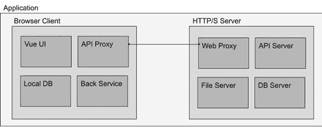
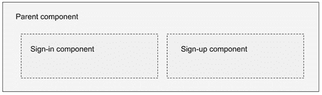
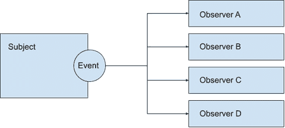
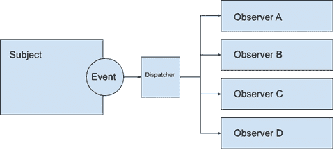
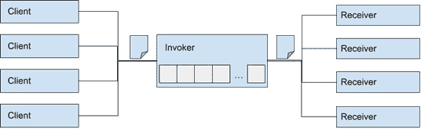
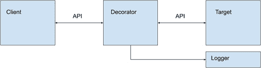
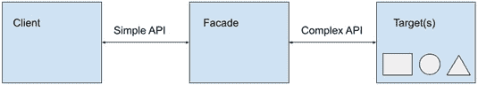

# 第二章：软件设计原则和模式

软件开发本质上是一门*人密集型学科*。这意味着它需要了解技术和技术，同时也需要理解问题和在多个抽象层次上实施解决方案的决策能力。编程与开发者的思维方式有很大关系。多年来，在每个上下文和语言中，都出现了解决重复问题的指南和解决方案。了解这些*模式*将帮助您确定何时应用它们，并确保您的开发工作稳步推进。另一方面，*原则*是指导概念，应在过程的每个阶段应用，并且更多关乎您如何处理这个过程。

在本章中，我们将探讨在 Vue 3 应用程序开发中常见的非排他性和非详尽性的原则和模式列表。

| **原则** | **模式** |
| --- | --- |

|

+   关注点分离

+   组合优于继承

+   单一职责

+   封装

+   KIC – 保持清洁

+   DRY – 不要重复自己

+   KISS – 简单就是聪明

+   为未来编写代码

|

+   单例

+   依赖注入

+   观察者

+   命令

+   代理

+   装饰者

+   门面

+   回调

+   承诺

|

表 2.1 – 本章涵盖的原则和模式

理解这些原则和模式将帮助您更有效地使用框架，并且通常情况下，它将防止您“重新发明轮子”。与第一章一起，这将结束本书的*基础部分*，并为您跟随本书剩余部分的实际部分和应用示例的实现提供基础。

# 软件设计原则是什么？

在软件开发中，设计原则是适用于整个过程的宏观概念性指南。并非每个项目都会使用相同的原理，这些也不是必须强制执行的规则。它们可以从架构到用户界面（**UI**）和最后一段代码出现在项目中。在实践中，这些原则中的一些也可以影响软件属性，如可维护性和可重用性。

# 设计原则的非排他性列表

设计原则因上下文、领域，甚至一个人可能参与的团队而异。因此，本章包含的原则是非排他性的。

## 关注点分离

这可能是软件工程中最重要的原则。关注点的分离意味着一个系统必须被划分为由功能或服务（即**关注点**）组成的子系统。例如，我们可以将人体视为由许多子系统（呼吸、循环、消化等）组成的**系统**。这些子系统再由不同的器官整合，器官由组织构成，以此类推，直至最小的细胞。在软件中遵循同样的理念，一个应用程序可以被划分为按关注点分组的不同元素，从大型架构一直到最后的函数。如果没有将复杂性分解为可管理的部分，创建一个功能系统将会更加困难，甚至不可能。

通常，这一原则的应用从系统应该是什么的大图景开始，考虑它应该做什么来实现这一点，然后将它分解为可管理的可工作部分。

例如，这里是一个关于 Web 应用程序关注点分离的粗略图形表示。这个图中的每个框都标识了一个不同的**关注点**，这些关注点反过来又可以细分为更小的功能部分。更好的是，你可以看到这一原则如何帮助你识别系统的整合部分。



图 2.1 – 一个简单的 Web 应用程序架构视图，展示了关注点的分离

如果我们要深入到各自领域内的任何这些小框中，我们仍然可以找到更多需要进一步细分的关注点，直到达到不可分割的原子元素（例如组件或函数）。这一原则与许多其他原则有很大关系，并从中受益，如抽象和单一职责。我们将在本章的后面进一步讨论它们。

## 组合优于继承

**组合优于继承**的原则直接来源于**面向对象编程**（**OOP**）。它指出，一个对象在需要时应该尝试使用其他对象的功能，通过引用或实例化它们，而不是创建一个庞大而复杂的继承家族树来添加这样的功能。现在，JavaScript 本质上是一种**函数式**语言，尽管它支持多种范式，包括来自 OOP 的特性，所以这一原则同样适用。对于那些从 OOP 迁移到 JavaScript 的人来说，有一个警告需要注意，那就是避免将 JavaScript 视为纯粹的 OOP 语言。这样做可能会创造不必要的复杂性，而不是从语言的优点中受益。

在 Vue 3 中，没有组件的扩展或继承。当我们需要共享或继承功能时，我们有一套很好的工具集来替代继承范式。我们将在第四章“用户界面组件组合”中看到如何通过使用*组合组件*来遵守这一原则。

## 单一职责原则

这一原则在面向对象编程以及函数式编程中都可以找到。简单来说，它指出一个类、方法、函数或*组件*应该只处理一个职责或功能。如果你在其他学科和语言中工作过，这会自然而然地发生。多功能函数难以维护，并且往往会失去控制，尤其是在像 JavaScript 这样松散类型和高度动态的语言中。同样的概念也直接适用于 Vue 3 组件。每个组件应该处理一个特定的操作，避免试图自己完成太多。在实践中，当一个组件超出一定范围时，最好将其拆分为多个组件或将行为提取到外部模块中。有时你可能会得到一个数千行长的组件，但根据我的经验，这很少是必要的，并且可以也应该避免。不过，有一个警告，即过多的具体性也可能导致不必要的复杂性。

例如，让我们想象一个同时显示注册选项的登录屏幕。这种做法在许多网站上都很常见。您可以将所有功能都包含在一个组件中，但这会违背这一原则。更好的选择是将组件拆分为至少三个组件来完成这项任务：

+   处理 UI 逻辑的父组件。该组件决定何时显示/隐藏登录和注册组件。

+   处理登录功能的子组件。

+   处理注册功能的子组件。

这里是这个配置的图形表示：



图 2.2 – 使用多个组件组合的登录/注册界面

我认为你可以很快地理解这一原则的好处。它使得代码易于管理、维护和适应，因为网络应用有快速变异和演化的趋势。

最佳实践技巧

给组件赋予单一职责和功能。尽可能避免庞大的单体组件。

## 封装

封装是指你应该将数据和函数包装成一个单一单元，同时暴露一个定义良好的**应用程序编程接口**（**API**）。通常，这以类、模块或库的形式完成。JavaScript 也不例外，强烈建议遵循这个原则。在 Vue 3 中，这个概念不仅适用于组件，也适用于 CSS 样式和 HTML。*单文件组件*的引入是框架如何在实际中促进这个原则的一个明显例子，以及它对当今开发的重要性。在只有少数边缘情况的情况下，我们应该将（**UI**）组件视为接收传入参数并提供输出数据的黑盒，其他组件不应*了解*它们的内部工作方式，只有 API。随着我们在本书中构建示例应用程序，你将看到这个原则是如何发挥作用的。

## KIC – 保持清洁

这个原则主要指的是你编写代码的方式。我应该在这一点上强调，KIC 直接应用于两个强烈影响 Web 和 Vue 3 应用程序的类别：

+   你如何格式化你的代码

+   你如何整理事件和变量

第一项包括使用代码约定、注释和缩进来组织代码以及函数的逻辑分组。例如，如果你有处理**创建、读取、更新和删除**（**CRUD**）操作的方法，最好将它们放在代码的附近，而不是分散在源文件中。许多**集成开发环境**（**IDE**）包含折叠或展开函数内部代码的功能。这有助于快速审查和定位具有相似逻辑的代码部分。

这个原则的第二部分与内存和引用处理有关。JavaScript 有一个非常好的垃圾回收器，其功能是丢弃未使用的数据以回收内存。然而，有时算法因为引用仍然挂起而无法释放资源。如果你使用过其他语言，如 C/C++，这个问题可能听起来很熟悉，因为你需要在不再使用时手动分配和释放内存。在 JavaScript 中，如果你注册一个函数来监听一个事件，当不再需要时，最好在你的组件适当的生命周期事件中手动注销它。这将防止内存泄漏和内存浪费，同时也防止一些安全风险（这些风险超出了本书的范围）。

我们将在*第四章**，使用组件的用户界面组合*中回顾组件的生命周期，但到目前为止，以下示例是这一原则的良好应用，并作为最佳实践保留。在这个例子中，我们将创建一个*可组合*组件来检测窗口大小的变化，因此，在`script setup`部分，我们会找到如下内容：

1.  在挂载状态下，在窗口对象的 resize 事件上注册一个函数。

1.  在组件卸载之前注销事件。

这里是代码片段：

```js
<script setup>
   import {onMounted, onBeforeUnmount} from "vue"
   onMounted(()=>{
       window.addEventListener("resize", myFunction)
   })
   onBeforeUnmount(()=>{
       window.removeEventListener("resize", myFunction)
   })
   function myFunction(){
       // Do something with the event here
   }
</script>
```

`onMounted`和`onBeforeUnmount`函数是 Vue 3 框架的一部分，并由适当的组件生命周期事件触发。在这里，当组件挂载到**文档对象模型**（**DOM**）时，我们将函数附加到`resize`事件上，并在它被移除之前释放它。需要记住的重要概念是清理自己的工作并保持其整洁。

## DRY – 不要重复自己

这个原则相当有名，几乎到了变成陈词滥调的地步。遗憾的是，它很容易被遗忘。它归功于安德鲁·亨特和大卫·托马斯，他们在《实用程序员》一书中使用了它。它主要被认为是“不要重复写同一件事”，虽然接近，但它的含义更广。它包括在过程以及应用程序的逻辑中避免冗余的概念。核心思想是，执行业务逻辑的每个过程应该只存在于整个应用程序的一个地方。

例如，大多数 Web 应用程序都通过 API 使用与服务器的一些异步连接。应用程序中可能还有多个元素将使用或需要使用这种远程计算机/服务器通信。如果你打算在每个组件中编写与服务器通信的整个代码/逻辑，我们最终会得到代码重复以及应用程序逻辑。维护这样的系统会打开通往大量负面副作用和安全问题的门，包括糟糕的用户体验等等。根据这个原则，更好的方法是将与服务器 API 相关的所有通信代码抽象成一个单独的模块或类。在实践中，在 JavaScript 中，这甚至可以委托给一个单独线程中的 Web Worker。我们将在*第八章*，*使用 Web Workers 进行多线程*中探讨这种实现。

作为一条经验法则，如果你发现自己正在不同的组件或类中编写“有点相似”的代码，那么将功能抽象成其自己的模块或组件是一个明显的机遇。

## KISS – 保持简单和简洁

这个原则并不仅限于软件开发领域。它是在 20 世纪 60 年代由美国海军提出的（根据维基百科，[`en.wikipedia.org/wiki/KISS_principle`](https://en.wikipedia.org/wiki/KISS_principle)）。这个想法纯粹是常识：构建简单、小巧且能协同工作的功能部件，比一次性尝试创建一个庞大而复杂的程序要好。此外，算法应以最简单和最有效的方式进行实现。在 Web 开发中，这个原则至关重要。现代 Web 应用程序由数百个工作部件组成，这些部件分布在多个计算机、服务器和环境上。系统或代码实现越复杂，维护和适应的难度也越大。

虽然有一个警告。保持简单并不意味着过度简化或不必要的隔离。太多的部分可能会在系统中引入不必要的复杂性。应用 KISS 原则意味着保持在那个事物可管理和易于理解的美好中间点。

## 为未来编写代码

这个原则是指你应该让你的代码对除了你自己之外的其他人来说也是可读和易于理解的。命名约定、逻辑流程和行间注释都是这个原则的一部分。这不仅是为了在你可能需要将代码委托给其他人时，也是为了当你一年或两年后回到相同的代码时。你不想做的事情就是浪费时间思考过去那个缺乏经验的你用那行巧妙的意大利面代码做了什么。聪明的开发者编写代码就像他们要教给别人一样，简单而优雅。特别是如果你在使用或为开源代码做出贡献，这个原则对于团队协作至关重要。在这种情况下，值得提到的是*童子军原则*，它与前者类似，但适用于团队。它指出，当你发现难以阅读或“意大利面”代码时，你应该重构它以使其变得干净。

最佳实践技巧

使用源代码注释和文档来解释你的逻辑，保持你的代码干净，就像在教别人一样。大多数情况下，你实际上是在教自己。

设计原则适用于许多不同的场景，一些场景甚至超出了软件开发实践。考虑它们直到它们成为第二天性是很重要的。一般来说，这些原则以及其他原则的应用，以及设计模式的应用，对你的职业发展留下了重要的影响。

# 什么是软件设计模式？

在软件开发中，某些流程和任务以某种方式或某种程度的变化出现在多个项目中是很常见的。*设计模式*是解决此类类似问题的有效解决方案。它不规定代码，而更像是一个推理模板，一种独立于实现进行抽象、可重用和适应特定情况的方法。在实践中，有足够的空间发挥创意来应用模式。已经有许多书籍致力于这个主题，并提供了比本书范围更详细的信息。在接下来的几页中，我们将探讨我认为对于 Vue 3 应用程序来说最常见且需要记住的模式。尽管我们为了研究它们而单独看待它们，但现实情况是，通常实现会重叠、混合和封装多个模式在一个代码块中。例如，你可以使用**单例**来充当**装饰器**和**代理**，以简化或改变应用程序中服务之间的通信（我们实际上会这样做很多次，完整的代码可以在*第八章**，使用* *Web Workers* *进行多线程* *中查看*）。

设计模式也可以理解为软件工程和开发*最佳实践*。而与之相反的，*不良实践*通常被称为**反模式**。反模式是“解决方案”，尽管它们在短期内解决了问题，但沿着这条线会引发问题和不良后果。它们产生了绕过问题的需要，并使整个结构和实现不稳定。

现在让我们查看一个列表，这些模式应该是 Vue 3 项目工具箱的一部分。

# 模式快速参考列表

模式根据它们解决的问题或功能类型进行分类。根据系统的上下文、语言和架构，有许多模式。以下是我们将在本书中使用的模式列表，以及根据我的经验，这些模式更有可能在 Vue 应用程序中出现：

+   **创建型模式**：这些处理创建类、对象和数据结构的方法：

    +   单例模式

    +   依赖注入模式

    +   工厂模式

+   **行为模式**：这些处理应用程序中对象、组件和其他元素之间的通信：

    +   观察者模式

    +   命令模式

+   **结构模式**：这些提供模板，影响应用程序的设计和组件之间的关系：

    +   代理模式

    +   装饰器模式

    +   门面模式

+   **异步模式**：这些模式处理单线程应用程序（在 Web 应用程序中大量使用）中的异步请求和事件的数据和流程：

    +   回调模式

    +   承诺模式

无论如何，这个模式列表并不是唯一的。还有许多其他模式和分类，一个完整的库专门用于这个主题。值得一提的是，这些描述和应用可能因文献而异，并且根据上下文和实现可能存在一些重叠。

在介绍完设计模式之后，让我们通过示例来详细探讨它们。

## 单例模式

这是在 JavaScript 中非常常见的一种模式，也许是最重要的一种。基本概念定义了一个对象实例在整个应用程序中只能存在一次，所有的引用和函数调用都通过这个对象进行。单例可以作为资源、库和数据的网关。

### 何时使用

这里有一个简单的规则，可以帮助您了解何时应用此模式：

+   当您需要确保资源只通过一个网关访问时，例如，全局应用程序状态

+   当您需要封装或简化行为或通信（与其他模式结合使用时）。例如，API 访问对象。

+   当多次实例化的 *成本* 有害时。例如，创建网络工作者。

### 实现

您可以在 JavaScript 中以多种方式应用此模式。在某些情况下，从其他语言迁移的实现会遵循 Java 示例，通常使用 `getInstance()` 方法来获取单例。然而，在 JavaScript 中实现此模式有更好的方法。让我们看看下面的例子。

#### 方法 1

最简单的方法是通过导出一个普通的对象字面量或 **JavaScript 对象表示法**（**JSON**），这是一个静态对象：

./chapter 2/singleton-json.js

```js
const my_singleton={
    // Implementation code here...
}
export default my_singleton;
```

您可以将此模块导入其他模块，并且始终拥有相同的对象。这是因为打包器和浏览器足够智能，可以避免重复导入，所以一旦这个对象第一次被引入，它将忽略后续的请求。当不使用打包器时，JavaScript 的 ES6 实现也定义了模块是单例的。

#### 方法 2

此方法创建一个类，然后在第一次实例化时保存对未来的引用。为了使此方法生效，我们使用类中的一个变量（传统上称为 `_instance`）并在构造函数中保存对实例的引用。在后续调用中，我们检查 `_instance` 值是否存在，如果存在，则返回它。以下是代码：

./chapter 2/singleton-class.js

```js
class myClass{
    constructor(){
        if(myClass._instance){
            return myClass._instance;
        }else{
            myClass._instance=this;
        }
        return this;
    }
}
export default new myClass()
```

第二种方法可能对其他语言开发者来说更为熟悉。注意我们也是导出一个新的类实例，而不是直接导出类。这样，调用者就不必每次都记住实例化类，代码将与 *方法 1* 中的代码相同。这种情况需要与您的团队协调，以避免不同的实现。

调用者可以直接调用每个对象的方法（假设单例有一个名为 `myFunction()` 的函数/方法）：

./chapter 2/singleton-invoker.js

```js
import my_method1_singleton from "./singleton-json";
import my_method2_singleton from "./singleton-class";
console.log("Look mom, no instantiation in both cases!")
my_method1_singleton.myFunction()
my_method2_singleton.myFunction()
```

单例模式非常有用，尽管它很少**独立存在**。通常，我们使用单例来封装其他模式的实现，并确保我们有一个单一的访问点。在我们的示例中，我们将经常使用这个模式。

## 依赖注入模式

这个模式简单地声明，一个类或函数的依赖项作为输入提供，例如作为参数、属性或其他类型的实现。这个简单的声明打开了一个非常广泛的可能性。以一个与浏览器的 `dbManager.js` 文件一起工作的类为例，它公开了一个处理数据库操作的对象，而 `projects` 对象处理项目表的 CRUD 操作（或集合）。如果不使用依赖注入，你将得到类似这样的结果：

./chapter 2/dependency-injection-1.js

```js
import dbManager from "dbManager"
const projects={
    getAllProjects(){
        return dbManager.getAll("projects")
    }
}
export default projects;
```

上述代码展示了“正常”的方法，即在文件开头导入依赖项，然后在我们的代码中使用它们。现在，让我们调整相同的代码以使用依赖注入：

./chapter 2/dependency-injection-2.js

```js
const projects={
    getAllProjects(dbManager){
        return dbManager.getAll("projects")
    }
}
export default projects;
```

如您所见，主要区别在于现在将 `dbManager` 作为参数传递给函数。这就是所谓的**注入**。这为依赖项管理开辟了许多途径，同时将依赖项的硬编码推到实现树的更高层次。这使得这个类非常易于重用，至少在依赖项遵守预期 API 的情况下是这样。

上述示例并不是注入依赖的唯一方式。例如，我们可以将其分配给对象的内部属性。例如，如果 `projects.js` 文件使用属性方法实现，它将看起来像这样：

./chapter 2/dependency-injection-3.js

```js
const projects={
    dbManager,
    getAllProjects(){
        return this.dbManager.getAll("projects")
    }
}
export default projects;
```

在这种情况下，对象的调用者（顺便提一下，是一个单例）需要知道这个属性，并在调用任何函数之前将其分配。以下是一个示例：

./chapter 2/dependency-injection-4.js

```js
import projects from "projects.js"
import dbManager from "dbManager.js"
projects.dbManager=dbManager;
projects.getAllProjects();
```

但这种方法并不推荐。你可以清楚地看到，它打破了封装的原则，因为我们直接为对象分配了一个属性。尽管它是有效的代码，但它看起来并不像是整洁的代码。

逐个传递依赖项也不是推荐的做法。那么，更好的方法是什么呢？这取决于实现方式：

+   在一个类中，在构造函数中要求依赖项（如果找不到，则抛出错误）是很方便的。

+   在一个普通的 JSON 对象中，提供一个函数来显式设置依赖项，并让对象决定如何内部使用它是很方便的。

最后一种方法也推荐在对象实例化后传递依赖项，当依赖项在实现时未准备好时使用。

以下是对前面列表中提到的第一点的一个代码示例：

./chapter 2/dependency-injection-5.js

```js
class Projects {
    constructor(dbManager=null){
        if(!dbManager){
            throw "Dependency missing"
        }else{
            this.dbManager=dbManager;
        }
    }
}
```

在构造函数中，我们声明一个具有默认值的预期参数。如果未提供依赖项，我们抛出错误。否则，我们将它分配给实例的一个内部私有属性以供使用。在这种情况下，调用者应该如下所示：

```js
// Projects are a class
import Projects from "projects.js"
import dbManager from "dbManager.js"
try{
    const projects=new Projects(dbManager);
}catch{
    // Error handler here
}
```

在另一种实现中，我们可以有一个函数，它基本上通过接收依赖并将其分配给一个私有属性来完成相同的功能：

```js
import projects from "projects.js"
import dbManager from "dbManager.js"
projects.setDBManager(dbManager);
```

这种方法比直接分配内部属性更好，但你仍然需要记住在使用对象中的任何方法之前进行分配。

最佳实践提示

无论你使用什么方法进行依赖注入，都要在整个代码库中保持一致。

你可能已经注意到，我们主要关注的是对象。正如你可能已经猜到的，将依赖项传递给函数与传递另一个参数是一样的，所以它不值得特别注意。

这个例子只是将依赖实现的责任移动到层次结构中的另一个类。但如果我们实现一个单例模式来处理我们应用程序中的所有或大部分依赖呢？这样，我们就可以在应用程序生命周期中的某个确定点将依赖的加载委托给一个类或对象。但我们应该如何实现这样的功能？我们需要以下内容：

+   注册依赖的方法

+   通过名称检索依赖项的方法

+   一个结构来保持对每个依赖项的引用

让我们将其付诸实践，创建一个非常*天真*的单例实现。请记住，这是一个学术练习，所以我们不考虑错误检查、注销或其他考虑因素：

./chapter 2/dependency-injection-6.js

```js
const dependencyService={                          //1
    dependencies:{},                               //2
    provide(name, dependency){                     //3
        this.dependencies[name]=dependency         //4
        return this;                               //5
    },
    inject(name){                                  //6
        return this.dependencies[name]??null;      //7
    }
}
export default dependencyService;
```

在这个最基本实现的基础上，让我们逐行通过注释来看：

1.  我们创建一个简单的 JavaScript 对象字面量作为单例。

1.  我们声明一个空对象，用作字典来按名称存储我们的依赖项。

1.  `provide`函数让我们可以通过名称注册依赖项。

1.  在这里，我们只使用名称作为字段名，并分配通过参数传递的依赖项（注意我们没有检查预存在的名称等）。

1.  在这里，我们返回源对象，主要是为了方便，这样我们就可以链式调用。

1.  `inject`函数将接受在`provide`函数中注册的名称。

1.  我们返回依赖项或`null`（如果未找到）。

在有了这个单例之后，我们现在可以在整个应用程序中使用它，按需分配依赖项。为此，我们需要一个父对象来导入它们并填充服务。以下是一个示例，说明这可能看起来像什么：

./chapter 2/dependency-injection-7.js

```js
import dependencyService from "./dependency-injection-6"
import myDependency1 from "myFile1"
import myDependency2 from "myFile2"
import dbManager from "dbManager"
dependencyService
    .provide("dependency1", myDependency1)
    .provide("dependency2", myDependency2)
    .provide("dbManager", dbManager)
```

正如你所见，这个模块有硬编码的依赖项，它的作用是将它们加载到 `dependencyService` 对象中。然后，依赖的函数或对象只需要导入服务，并通过注册名称检索所需的依赖项，如下所示：

```js
import dependencyService from "./dependency-injection-6"
const dbManager=dependencyService.inject("dbManager")
```

这种方法确实在组件之间创建了一个紧密的耦合，但这里提供它作为参考。它的优点是我们可以在一个位置控制所有的依赖项，这样维护的益处可能是显著的。`dependencyService` 对象的方法名称的选择也不是随机的：这些名称与 Vue 3 在组件层次结构内部使用的名称相同。这对于实现一些用户界面设计模式非常有用。我们将在*第四章*，*使用组件进行用户界面组合*和*第七章*，*数据流管理*中更详细地看到这一点。

正如你所见，这种模式非常重要，并且在 Vue 3 中通过 `provide`/`inject` 函数实现。这是对我们工具集的一个很好的补充，但还有更多。让我们继续下一个。

## 工厂模式

工厂模式为我们提供了一种创建对象而不直接创建依赖项的方法。它通过一个函数来实现，该函数根据输入将返回一个实例化的对象。这种实现的用法将通过一个公共或标准接口进行。例如，考虑两个类：`Circle` 和 `Square`。这两个类都实现了相同的 `draw()` 方法，该方法将图形绘制到画布上。然后，一个 `factory` 函数将类似于这样：

```js
function createShape(type){
    switch(type){
        case "circle": return new Circle();
        case "square": return new Square();
}}
let
    shape1=createShape("circle"),
    shape2=createShape("square");
shape1.draw();
shape2.draw();
```

这种方法相当流行，尤其是在与其他模式结合使用时，正如我们将在本书中多次看到的。

## 观察者模式

观察者模式非常有用，是响应式框架的基础之一。它定义了对象之间的关系，其中一个对象（**主题**）被观察以检测变化或事件，而其他对象（**观察者**）则被通知这些变化。观察者也被称为**监听器**。以下是它的图形表示：



图 2.3 – 主题对象发出事件并通知观察者

正如你所见，主题对象会发出事件来通知观察者。主题对象需要定义它将**发布**哪些事件和参数。同时，观察者通过向发布者注册一个函数来**订阅**每个事件。这种实现方式使得这种模式通常被称为**发布/订阅**模式，并且它可以有多种变体。

在考虑实现此模式时，重要的是要注意发布的基数：`1` 个事件对应 `0..N` 个观察者（函数）。这意味着主题必须在它的主要目的之上实现发布事件和跟踪订阅者的功能。由于这会打破设计中的几个原则（关注点分离、单一责任等），通常会将此功能提取到一个中间对象中。因此，先前的设计变为添加一个中间层：



图 2.4 – 带有调度器中间对象的观察者实现

这个中间对象，有时被称为“**事件调度器**”，封装了注册观察者、从主题接收事件并将它们分发给观察者的基本功能。当观察者不再观察时，它还会执行一些清理活动。让我们将这些概念应用到纯 JavaScript 中的简单且原始的事件调度器实现中：

./chapter 2/Observer-1.js

```js
class ObserverPattern{
constructor(){
    this.events={}                                             //1
}
on(event_name, fn=()=>{}){                                     //2
    if(!this.events[event_name]){
       this.events[event_name]=[]
    }
    this.events[event_name].push(fn)                           //3
}
emit(event_name, data){                                        //4
    if(!this.events[event_name]){
       return
    }
for(let i=0, l=this.events[event_name].length; i<l; i++){
    this.events[event_name]i
}
}
off(event_name, fn){                                           //5
    let i=this.events[event_name].indexOf(fn);
    if(i>-1){
        this.events[event_name].splice(i, 1);
    }
}
}
```

上述实现再次是原始的。它不包含在生产环境中使用的必要错误和边缘情况处理，但它确实为事件调度器提供了基本的基本功能。让我们逐行查看它：

1.  在构造函数中，我们声明一个对象，将其用作内部字典来存储我们的事件。

1.  `on` 方法允许观察者注册他们的函数。在这一行中，如果事件尚未初始化，我们创建一个空数组。

1.  在这一行中，我们只是将函数推送到数组中（正如我所说的，这是一个原始的实现，因为我们没有检查重复，例如）。

1.  `emit` 方法允许主题通过其名称发布事件并向其传递一些数据。在这里，我们遍历数组并执行每个函数，传递我们接收到的作为参数的数据。

1.  `off` 方法是必要的，以便在不再使用函数时取消注册（参见本章早些时候提到的 *保持清洁* 原则）。

为了使此实现工作，每个观察者和主题都需要引用相同的 `ObserverClass` 实现。最简单的方法是通过 *单例模式* 来实现它。一旦导入，每个观察者都会使用以下行向调度器注册：

```js
import dispatcher from "ObserverClass.js"    //a singleton
dispatcher.on("event_name", myFunction)
```

然后，主题通过以下行发出事件并传递数据：

```js
import dispatcher from "ObserverClass.js"    //a singleton
dispatcher.emit("event_name", data)
```

最后，当观察者不再需要监视主题时，它需要使用 `off` 方法清理与主题的引用：

```js
dispatcher.off("event_name", myFunction)
```

在这里，我们没有涵盖许多边缘情况和控制，而不是重新发明轮子，我建议使用现成的解决方案来处理这些情况。在我们的书中，我们将使用一个名为`mitt`的解决方案（[`www.npmjs.com/package/mitt`](https://www.npmjs.com/package/mitt)）。它具有与我们示例中相同的方法。我们将在*第三章*，*设置工作项目*中看到如何安装打包的依赖项。

## 命令模式

这个模式非常有用且易于理解和实现。而不是立即执行一个函数，基本概念是创建一个包含执行所需信息的对象或结构。这个数据包（**命令**）然后委托给另一个对象，该对象将根据某些逻辑执行执行。例如，命令可以被序列化并排队、调度、反转、分组和转换。以下是这个模式的图形表示，包括必要的部分：



图 2.5 – 命令模式的图形实现

该图显示了客户端如何向**调用者**提交他们的命令。调用者通常实现某种队列或任务数组来处理命令，然后将执行路由到适当的**接收者**。如果有任何数据要返回，它也会返回给适当的客户端。调用者通常还会将附加数据附加到命令中，以跟踪客户端和接收，特别是在异步执行的情况下。它还提供了一个“入口点”到接收者，并将“客户端”与它们解耦。

让我们再次尝试一个`Invoker`类的简单实现：

./chapter 2/Command-1.js

```js
class CommandInvoker{
    addCommand(command_data){                          //1
        // .. queue implementation here
    }
    runCommand(command_data){                          //2
        switch(command_data.action){                   //3
            case "eat":
                // .. invoke the receiver here
                break;
            case "code":
                // .. invoke the receiver here
                break;
            case "repeat":
                // .. invoke the receiver here
                break;
        }
    }
}
```

在前面的代码中，我们逐行实现了`Invoker`应该具备的裸骨示例：

1.  `Invoker`提供了一个方法来向对象添加命令。这仅在命令需要以某种方式排队、序列化或根据某些逻辑处理时才是必要的。

1.  这行代码根据`command_data`参数中包含的`action`字段执行命令。

1.  根据`action`字段，*调用者*将执行路由到适当的接收者。

实现路由执行逻辑的方法有很多。重要的是要注意，这个模式可以根据上下文在更大范围内实现。例如，调用者可能甚至不在 Web 客户端应用程序中，而是在服务器或不同的机器上。我们将在*第八章*，*使用 Web Workers 进行多线程*中看到这个模式的实现，在那里我们使用这个模式在不同线程之间处理任务并卸载主线程（Vue 3 运行的地方）。

## 代理模式

这种模式的定义直接来源于其名称，因为“代理”一词意味着代表他人行事的人或事物，仿佛它就是同一个。这听起来有点复杂，但它会帮助你记住它。让我们通过一个例子来了解它是如何工作的。我们需要至少三个实体（组件、对象等）：

+   一个需要访问目标实体 API 的**客户端**实体

+   一个暴露了知名 API 的**目标**实体

+   一个位于中间并暴露与目标相同 API 的同时拦截来自客户端的每条通信并将其转发给目标的**代理**对象

我们可以用这种方式图形化地表示这些实体之间的关系：


图 2.6 – 代理对象暴露与目标相同的 API

这种模式的关键因素是代理的行为和暴露的 API 与目标相同，这样客户端就不知道或不需要知道它正在处理的是代理而不是目标对象。那么，我们为什么要这样做呢？有很多很好的理由，例如以下：

+   你需要保持原始未修改的 API，但与此同时：

    +   需要处理客户端的输入或输出

    +   需要拦截每个 API 调用以添加内部功能，例如维护操作、性能改进、错误检查和验证

    +   目标是一个昂贵的资源，因此代理可以实现逻辑来利用它们的操作（例如，缓存）

+   你需要更改客户端或目标，但不能修改 API

+   你需要保持向后兼容性

你可能会遇到更多理由，但希望到现在你能够看到这如何有用。作为一个模式，这个模板可以在多个级别上实现，从简单的对象代理到完整的应用程序或服务器。在执行系统的部分升级时，这相当常见。在较低级别上，JavaScript 甚至原生包含一个用于代理对象的构造函数，Vue 3 使用它来创建响应性。

在*第一章*，*Vue 3 框架*中，我们回顾了使用`ref()`进行响应式的选项，但这个 Vue 的新版本还包括另一个用于复杂结构的替代方案，称为`reactive()`。第一个使用 pub/sub 方法（观察者模式！），但后者使用原生代理处理程序（这个模式！）。让我们看看这个原生实现可能如何与一个简单的部分实现一起工作。

在这个简单的例子中，我们将创建一个具有反应性属性的自动将摄氏度转换为华氏度并反向转换的`Proxy`对象：

./chapter 2/proxy-1.js

```js
let temperature={celsius:0,fahrenheit: 32},                    //1
    handler={                                                  //2
      set(target, key, value){                                 //3
         target[key]=value;                                    //4
    switch(key){
     case "celsius":
           target.fahrenheit=calculateFahrenheit(value);       //5
           break;
    case "fahrenheit":
           target.celsius=calculateCelsius(value);
         }
      },
      get(target, key){
         return target[key];                                   //6
      }
    },
    degrees=new Proxy(temperature, handler)                    //7
// Auxiliar functions
function calculateCelsius(fahrenheit){
    return (fahrenheit - 32) / 1.8
}
function calculateFahrenheit(celsius){
    return (celsius * 1.8) + 32
}
degrees.celsius=25                                             //8
console.log(degrees)
// Prints in the console:
// {celsius:25, fahrenheit:77}                                 //9
```

让我们逐行审查代码，看看它是如何工作的：

1.  在这一行，我们声明了`temperature`对象，它将成为我们要代理的目标。我们用相等的转换值初始化其两个属性。

1.  我们声明一个`handler`对象，它将成为我们的温度对象代理。

1.  代理处理程序中的`set`函数接收三个参数：目标对象、引用的键以及尝试分配的值。请注意，我说“尝试”，因为操作已被代理拦截。

1.  在这一行，我们按照预期将赋值操作应用于对象属性。在这里，我们可能执行其他转换或逻辑，例如验证或引发事件（再次是观察者模式！）。

1.  注意我们如何使用 switch 来过滤我们感兴趣的属性名。当键是`celsius`时，我们计算并分配华氏值。当我们收到`fahrenheit`度数的赋值时，情况相反。这就是**响应性**发挥作用的地方。

1.  对于`get`函数，至少在这个例子中，我们只是返回请求的值。按照这种方式实现，它将等同于跳过`getter`函数。然而，它在这里作为一个例子，我们可以操作和转换要返回的值，因为这个操作也被拦截了。

1.  最后，在第 7 行，我们使用处理程序将`degrees`对象声明为`temperature`的代理。

1.  在这一行，我们通过将*摄氏度*值赋给`degrees`对象的成员来测试响应性，就像我们通常对任何其他对象所做的那样。

1.  当我们将`degrees`对象打印到控制台时，我们注意到`fahrenheit`属性已被自动更新。

这是一个相当有限且简单的例子，说明了原生的`Proxy()`构造函数是如何工作并应用该模式的。Vue 3 使用更复杂的方法来实现响应性和跟踪依赖，这涉及到代理和观察者模式。然而，这让我们对当我们亲眼看到 HTML 实时更新时幕后发生的方法有了很好的了解。

客户端和目标之间代理的概念也与下两个模式相关：*装饰器模式和外观模式*，因为它们也是一种代理实现。区分的关键因素是代理保留了与原始目标对象相同的 API。

## 装饰器模式

这种模式乍一看可能非常类似于*代理模式*，确实如此，但它增加了一些独特的特性，使其与众不同。它确实与代理模式有相同的移动部件，这意味着存在一个**客户端**、一个**目标**以及一个在目标之间实现相同接口的**装饰器**（是的，就像在代理模式中一样）。然而，在*代理模式*中，拦截的 API 调用主要处理数据和内部维护（“家务”），而装饰器则增强了原始对象的功能以执行更多操作。这是将它们区分开来的决定性因素。

在代理示例中，注意额外的功能是如何作为一个*内部反应性*来保持每个刻度中的度数同步的。当你改变一个时，它会内部自动更新另一个。在装饰器模式中，代理对象在执行目标对象的 API 调用之前、期间或之后执行额外的操作。就像在代理模式中一样，所有这些对客户端对象都是透明的。

例如，在之前的代码基础上，假设现在我们想要在保持相同功能的同时记录对某个目标 API 的每次调用。从图形上看，它将看起来像这样：



图 2.7 – 一个增强目标以添加日志功能的装饰器示例

在这里，最初只是一个简单的代理，现在仅仅通过执行一个谦逊的日志调用，它已经变成了一个装饰器。在代码中，我们只需要在`set()`方法结束前添加这一行（假设还有一个名为`getTimeStamp()`的函数）：

```js
console.log(getTimeStamp());
```

当然，这只是一个简单的例子，只是为了说明问题。在现实世界中，装饰器非常有用，可以在不重写逻辑或代码的很大一部分的情况下为你的应用程序添加功能。在此基础上，装饰器可以是*可堆叠的*或*可链式的*，这意味着如果需要，你可以创建“装饰器的装饰器”，这样每个装饰器将代表添加功能的一个步骤，同时保持目标对象的相同 API。就这样，我们开始步入**中间件模式**的边界，但在这本书中我们不会涉及它。无论如何，那个其他模式背后的想法是创建具有指定 API 的中间件函数层，每个函数执行一个动作，但不同之处在于任何步骤都可以决定终止操作，因此目标可能被调用也可能不被调用。但这又是另一个故事...让我们回到装饰器。

在这本书的之前部分，我们提到 Vue 3 组件没有像通过扩展彼此实现的纯 JavaScript 类那样具有继承。相反，我们可以使用装饰器模式在组件上添加功能或改变视觉外观。现在让我们看看一个简短的例子，因为我们将在*第四章*中详细讨论组件和 UI 设计，*使用组件的用户界面组合*。

假设我们有一个最简单的组件，它显示一个谦逊的`h1`标签，该标签接收以下作为输入：

./chapter 2/decorator-1.vue

```js
<script setup>
    const $props=defineProps(['label'])          //1
</script>
<template>
    <h1>{{$props.label}}</h1>                    //2
</template>
<style scoped></style>
```

在这个简单的组件中，我们在第`//1`行声明了一个名为`label`的单个输入。现在不用担心语法，因为我们将在*第四章**，*使用组件的用户界面组合*中详细看到它。在第`//2`行，我们像预期的那样在`h1`标签内直接插值值。

因此，为了为这个组件创建一个装饰器，我们需要应用以下简单的规则：

+   它必须代表组件（对象）执行操作

+   它必须遵守相同的 API（输入、输出、函数调用等）

+   它必须在目标 API 的执行之前、之后或期间增强功能或视觉表示

考虑到这一点，我们可以创建一个装饰器组件，它拦截标签属性，稍作修改，并也修改目标组件的视觉外观：

./chapter 2/decorator-2.vue

```js
<script setup>
    import HeaderH1 from "./decorator-1.vue"
    const $props=defineProps(['label'])                //1
</script>
<template>
    <div style="color: purple !important;">            //2
        <HeaderH1 :title="$props.label+'!!!'">         //3
        </HeaderH1>
    </div>
</template>
```

在此代码中，在行`//1`中，您可以看到我们保持了与目标组件（我们在上一行导入的）相同的接口，然后在行`//2`中，我们修改（增强）了`color`属性，在行`//3`中，我们通过添加三个感叹号来修改传递给目标组件的数据。通过这些简单的任务，我们保持了构建装饰器模式扩展到 Vue 3 组件的条件。这并不坏。

装饰器非常有用，但还有一个类似于代理的、也非常常见且实用的模式：界面（facade）模式。

## 界面模式

到目前为止，您可能已经看到了这些模式中的渐进模式。我们从代理开始，代表另一个对象或实体执行操作，通过使用装饰器增强了它，同时保持了相同的 API，现在轮到界面模式了。它的作用除了代理和装饰器的功能外，还要简化 API 并隐藏其背后的巨大复杂性。因此，界面（facade）位于客户端和目标之间，但现在目标是高度复杂的，可能是一个对象，甚至是系统或多个子系统。这种模式也用于更改对象的 API 或限制对客户端的暴露。我们可以将交互想象如下：



图 2.8 – 简化与复杂 API 或系统交互的界面对象

如您所见，界面（facade）的主要目的是提供一个更简单的方法来处理复杂的交互或 API。在我们的示例中，我们将多次使用这个模式，以使用更友好的方法简化浏览器中的原生实现。我们将使用库来封装 IndexedDB 的使用，并在*第八章*“使用 Web Workers 进行多线程”中创建与 Web Workers 的简化通信。

不言而喻，您之前一定见过这种模式的应用，因为它是现代技术的基础概念之一。在简单的界面（API）背后*隐藏复杂性*无处不在，并且是 Web 开发的重要组成部分。毕竟，整个互联网极其复杂，有成千上万的移动部件，构成网页的技术几乎像是魔法。没有这种模式，我们仍然会使用零和一进行编程。

在实践中，你会在自己的应用中添加简化层来分解复杂性。实现这一目标的一种方法就是使用提供简化界面的第三方库。在接下来的章节中，我们将使用其中的一些，例如以下这些：

+   **Axios**：用于处理与服务器所有**异步 JavaScript 和 XML（AJAX**）通信

+   **DexieDB**：用于处理到 IndexedDB（浏览器本地数据库）的 API

+   **Mitt**：用于创建事件管道（我们在观察者模式中提到过）

+   **Vue 3**：用于创建惊人的 UI

通常，大多数 Web 技术的本地实现都有门面库，这些库经过良好的实战测试。开发者非常擅长简化这些库，并通过开源运动与其他人共享代码。然而，当使用他人的模块时，请确保它们是“安全”的。不要重复造轮子，也不要重复自己。但现在，是时候继续到我们列表中的下一个模式了。

## 回调模式

回调模式易于理解。当需要在同步或异步操作完成后执行操作时适用。为此，函数调用包括一个参数，该参数是在操作完成后要执行的功能。话虽如此，我们需要区分以下两种代码流类型：

+   同步操作按顺序依次执行。这是基本的代码流，从上到下。

+   异步操作一旦被调用，就会在正常流程之外执行。它们的长度不确定，以及它们的成功或失败。

对于异步情况，*回调模式*特别有用。例如，考虑一个网络调用。一旦调用，我们不知道从服务器获取答案需要多长时间，也不知道它是否会成功、失败或抛出错误。如果没有异步操作，我们的应用将会*冻结*，等待直到有结果出现。这不会是一个好的用户体验，尽管从计算上是正确的。

JavaScript 中的一个重要特性是，由于它是单线程的，异步函数不会阻塞主线程，允许执行继续。这是很重要的，因为浏览器的渲染函数是在同一个线程上运行的。然而，这并不是免费的，因为它们确实消耗资源，但它们不会冻结 UI，至少在理论上是如此。在实践中，这将取决于许多因素，这些因素受到浏览器环境和硬件的严重影响。不过，我们还是坚持理论。

让我们来看一个同步回调函数的例子，并将其转换为异步。示例函数非常简单：我们将使用回调模式计算给定数字的斐波那契值。但首先，让我们回顾一下计算公式：

```js
F(0)=0
F(1)=1
F(n)=F(n-1)+F(n-2), with n>=2
```

因此，这里有一个 JavaScript 函数，它应用公式并接收一个回调来返回值。注意，这个函数是同步的：

./chapter 2/callback-1.js - 同步斐波那契

```js
function FibonacciSync(n, callback){
    if(n<2){
       callback(n)
    } else{
        let pre_1=0,pre_2=1,value;
        for(let i=1; i<n; i++){
           value=pre_1+pre_2;
           pre_1=pre_2;
           pre_2=value;
        }
        callback(value)
    }
}
```

注意看，我们不是用`return`返回值，而是将值作为参数传递给`callback`函数。什么时候使用这种做法是有用的呢？考虑以下简单的例子：

```js
FibonacciSync(8, console.log);
// Will print 21 to the console
FibonacciSync(8, alert)
// Will show a modal with the number 21
```

只需替换回调函数，我们就可以显著改变结果的呈现方式。然而，这个示例函数有一个影响用户体验的基本缺陷。由于它是同步的，计算时间与传递的参数成正比：`n`越大，所需时间越长。使用足够大的数字，我们很容易挂起浏览器，但在那之前，我们就可以冻结界面。你可以通过以下片段测试执行是否是同步的：

```js
console.log("Before")
FibonacciSync(9, console.log)
console.log("After")
// Will output
// Before
// 34
// After
```

要将这个简单的函数转换成异步函数，你只需将逻辑封装在`setImmediate`调用中即可。这将使执行脱离正常的工作流程。新的函数现在看起来是这样的：

```js
function FibonacciAsync(n, callback){
    setImmediate(()=>{
        if (n<2){
            callback(n)
        } else{
            let pre_1=0,pre_2=1,value;
            for(let i=1; i<n; i++){
                value=pre_1+pre_2;
                pre_1=pre_2;
                pre_2=value;
            }
            callback(value);
        }
    })
}
```

如您所见，我们使用箭头函数来封装代码，没有任何修改。现在，看看我们用这个函数执行与之前相同的片段时的区别：

```js
console.log("Before")
FibonacciAsync(9, console.log)
console.log("After")
// Will output
// Before
// After
// 34
```

如您所见，输出片段在`34`之前输出了`After`。这是因为我们的异步操作已经按照预期从正常流程中移除。在调用异步函数时，执行*不会等待*结果，而是继续执行下一个指令。有时这可能会让人困惑，但它非常强大且有用。然而，这种模式并没有规定如何处理错误或失败的操作，或者如何链式或顺序地运行多个调用。处理这些情况有不同的方法，但它们不是模式的一部分。还有另一种处理异步操作的方法，它提供了更多的灵活性和控制：*承诺（promises）*。我们将在下一节看到这一点，在大多数情况下，你可以互换使用这两种模式。我说“在大多数情况下”，并不是所有情况！

## 承诺模式

`promises`模式主要是为了处理异步操作。就像回调一样，承诺函数的调用会使执行脱离正常流程，但它返回一个特殊对象，称为`Promise`。这个对象提供了一个简单的 API，包括三个方法：`then`、`catch`和`finally`：

+   `then`方法接收两个回调函数，传统上称为`resolve`和`reject`。在异步代码中，它们用于返回成功值（`resolve`）或失败或负值（`reject`）。

+   `catch`方法接收一个`error`参数，当过程抛出`error`并中断执行时被触发。

+   `finally`方法在两种情况下都会执行，并接收一个回调函数。

当一个 Promise 正在运行时，它处于一个*不确定*状态，直到它被解决或拒绝。Promise 在这个状态下等待的时间没有时间限制，这使得它在处理长时间操作（如网络调用和**进程间通信**（IPC））时特别有用。

让我们看看如何使用 Promise 实现之前的斐波那契数列示例：

```js
function FibonacciPromise(n) {
    return new Promise((resolve, reject) => {          //1
        if (n < 0) {
            reject()                                   //2
        } else {
             if (n < 2) {
                 resolve(n)                            //3
             } else {
                  let pre_1 = 1, pre_2 = 1, value;
                  for (let i = 2; i < n; i++) {
                      value = pre_1 + pre_2;
                      pre_1 = pre_2;
                      pre_2 = value;
                  }
                  resolve(value);
             }
        }
    })
}
```

初看之下，很容易看出实现方式略有变化。我们从第`//1`行开始，立即返回一个`new Promise()`对象。这个构造函数接收一个回调函数，该函数反过来会接收两个名为`resolve()`和`reject()`的回调。我们需要在我们的逻辑中使用这些回调，以便在成功时返回值（`resolve`）或失败时返回值（`reject`）。注意，我们不需要将我们的代码包裹在`setImmediate`函数中，因为 Promise 本质上就是异步的。我们现在检查负数，并在这种情况下拒绝操作（第`//2`行）。我们做的另一个改变是在第`//3`行和第`//4`行用`resolve()`替换了`callback()`调用。

调用现在也发生了变化：

```js
console.log("Before")
FibonacciPromise(9).then(
    value=>console.log(value),
    ()=>{console.log("Undefined for negative numbers!")}
);
console.log("After")
// Will output:
// Before
// After
// 34
```

如您所见，我们将`then`方法链接到调用，并传递给它成功和失败的两个函数（在我们的代码中是`resolve`和`reject`）。就像之前一样，我们得到了相同的结果。现在，这可能会显得更冗长（确实是），但好处远远超过了额外的输入。Promise 是可链式的，这意味着对于成功的操作，你可以返回一个新的 Promise，从而实现顺序操作。以下是一个例子：

```js
MyFunction()
    .then(()=>{ return new Promise(...)}, ()=>{...})
    .then(()=>{ return new Promise(...)}, ()=>{...})
    .then(()=>{ return new Promise(...)}, ()=>{...})
    .then(()=>{ return new Promise(...)}, ()=>{...})
    .catch(err=>{...})
```

`Promise`构造函数还公开了其他方法，例如`.all`，但我将向您推荐查阅文档以深入了解可能性和语法（[`developer.mozilla.org/en-US/docs/Web/JavaScript/Reference/Global_Objects/Promise`](https://developer.mozilla.org/en-US/docs/Web/JavaScript/Reference/Global_Objects/Promise)）。尽管如此，仍然相当冗长。幸运的是，JavaScript 为我们提供了一个简化的语法来处理 Promise，即**async/await**，我们可以将其视为一种更“传统”的编码方式。这仅适用于 Promise 函数的调用，并且只能在函数中使用。

为了举例说明，让我们假设我们有三个返回 Promise 的函数，分别命名为`MyFuncA`、`MyFuncB`和`MyFuncC`（是的，我知道，这些名字不是很好）。每个函数在成功的情况下返回一个*单个值*（这是一个条件）。然后，这些函数在`MyProcessFunction`中使用新的语法。以下是声明：

```js
async function myProcessFunction() {                  //1
    try {                                             //2
         let     a = await MyFuncA(),                 //3
                 b = await MyFuncB(),
                 c = await MyFuncC()
         console.log(a + b + c)                       //4
    } catch {
             console.log("Error")
    }
}
// Invoke the function normally
MyProcessFunction()                                   //5
```

我们首先使用 `async` 关键字声明我们的函数（行 `//1`）。这向解释器表明我们将在函数内部使用 `await` 语法。一个条件是必须将代码包裹在 `try...catch` 块中。然后，我们可以在每个承诺函数调用的调用前使用 `await` 关键字，就像行 `//3` 一样。到行 `//4` 时，我们可以确信每个变量都已接收到值。当然，这种方法更容易遵循和阅读。

让我们调查以下行的等价性：

```js
let a=await MyFuncA()
```

这将与*thenable*（使用 `.then`）语法相匹配：

```js
let a;
MyFuncA()
    .then(result=>{ a=result; })
```

然而，这种最后一种语法的缺点是我们需要确保所有变量 `a`、`b` 和 `c` 都有值，我们才能运行行 `//4` 的 `console.log(a+b+c)`，这意味着需要像这样链式调用：

```js
let a,b,c;
MyFuncA()
    .then(result=>{ a=result; return MyFuncB()})
    .then(result=>{ b=result; return MyFuncC()})
    .then(result=>{ c=result; console.log(a+b+c)})
```

这种格式更难遵循，当然也更冗长。在这些情况下，`async/await` 语法更受欢迎。

使用承诺（promises）来封装长时间或不确定的操作，以及与其他我们已看到的模式（如外观模式、装饰器模式等）集成是非常有用的。这是一个重要的模式，我们需要牢记，我们将在我们的应用程序中广泛使用它。

# 摘要

在本章中，我们看到了软件开发的原则和重要的设计模式，以及使用纯 JavaScript 的示例，在适当的时候，也暗示了使用 Vue 3 的实现。这些模式在第一次看到时可能很难理解，但我们将使用它们，并在本书的其余部分回顾它们，以便本章可以作为参考。这将让您更好地了解根据您应用程序的需求何时以及如何应用不同的模式。

在下一章中，我们将从头开始实现一个项目，并为本书其余部分将要构建的应用程序奠定基础。随着我们的前进，我们将参考这些模式来帮助您巩固它们的应用。

# 复习问题

+   原则和模式之间的区别是什么？

+   单例模式为什么如此重要？

+   你如何管理依赖关系？

+   哪些模式使得反应性成为可能？

+   模式是否交织在一起？为什么？你能给出一个例子吗？

+   异步编程是什么，为什么它如此重要？

+   你能想到哪些适用于*承诺*函数的使用案例吗？
