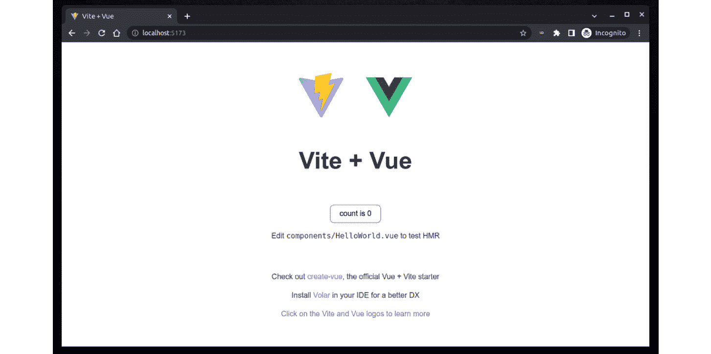
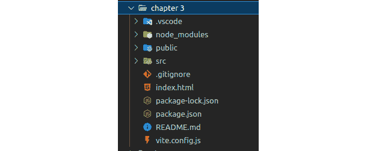
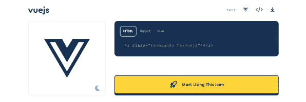
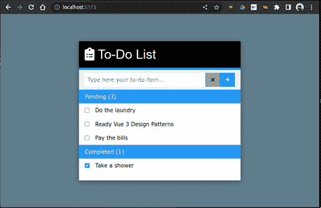

# 3

# 设置工作项目

在前几章中，我们为使用 *Vue 3 框架* 设计 JavaScript Web 应用程序奠定了理论基础。然而，到目前为止，我们还没有真正进入一个实际项目。这正是本章的内容。我们将使用 Vue 3 伴随的新工具集从头开始创建一个项目，并准备一个我们将在其他项目中使用的模板。按照惯例，这个 Web 应用的初始项目是构建一个 *待办事项列表*（相当于 *Hello World*）。随着我们对每个新概念的介绍，我们将过度设计应用程序，使其变得更有用，或者至少更吸引人。

我们在这里将学习的一些实用技能如下：

+   设置你的工作环境和 **集成开发** **环境**（**IDE**）

+   使用新的命令行工具和新的 **Vite** 打包器来构建我们的应用程序

+   修改基本模板和文件夹结构以适应 *最佳实践* 和高级架构 *设计模式*

+   将现成的 **CSS 框架**集成到我们的应用程序中

+   配置 Vite 打包器以满足我们的需求

与前几章不同，这一章将主要侧重于实践，并且会对生态系统中每个元素的官方文档进行参考，因为这些内容会不时发生变化。你不需要记住这些步骤，因为从头开始启动项目对于大型项目来说并不常见，而且构建这些项目的工具也在不断进化。让我们开始吧。

# 技术要求

要遵循本章中的实际步骤，你需要以下内容：

+   一台运行 **Windows**、**Linux** 或 **macOS** 且具有 64 位架构的计算机。我将使用 **Ubuntu 22.04**，但这些工具是跨平台的，步骤可以在不同的操作系统之间转换（如果有不同之处，我会指出）。

+   **Node.js 16.16.0 LTS** 以及已安装的 **npm**（**节点包管理器**）。你可以在官方文档中找到安装 Node.js 的步骤，网址为 [`nodejs.org/`](https://nodejs.org/)。构建工具在 Node.js 上运行，所以没有这个，你无法走得很远。Node.js 是一个适用于在服务器和浏览器“外部”运行的 JavaScript 版本，这使得它非常方便且强大。今天的大多数 Web 开发打包器都以某种方式使用 Node.js，如果不是至少为了它提供的极大便利性。

+   一个 `Volar` 插件。官方网站是 [`code.visualstudio.com/`](https://code.visualstudio.com/)，在这本书中，我们将使用这个编辑器作为推荐的开发环境（IDE）来与 Vue 和 Vite 一起工作。

+   **Sublime Text**（免费试用/付费）：这是另一个流行的选择，尤其是在 macOS 用户中。官方网站是 [`www.sublimetext.com/`](https://www.sublimetext.com/)。

+   **Jetbrains WebStorm**（免费试用，付费）：官方网站是[`www.jetbrains.com/webstorm/`](https://www.jetbrains.com/webstorm/)。

+   **Komodo IDE**（免费）：官方网站是[`www.activestate.com/products/komodo-ide/`](https://www.activestate.com/products/komodo-ide/)。

+   **NetBeans IDE**（免费）：官方网站是[`netbeans.apache.org/`](https://netbeans.apache.org/)。

+   **控制台**或**终端模拟器**。Linux 和 macOS 用户对此概念最为熟悉。Windows 用户可以使用**命令提示符**，某些 IDE 的集成终端，或者从 Microsoft Store 安装**Windows Terminal**.*   一个现代的网页浏览器，无论是基于 Chromium 引擎（Google Chrome、Microsoft Edge、Opera、Brave、Vivaldi 等）还是 Mozilla Firefox。

安装好这些工具后，我们就可以开始跟随示例和基本项目了。然而，我建议您也安装**Git**，用于代码版本控制。我们将在本书的*第九章* *测试和源代码控制*中使用它。在现代开发中，很难想象在没有一些工具来跟踪代码更改和版本控制的情况下进行项目工作。Git 已成为行业标准。您可以通过访问官方网站上的文档进行安装：[`git-scm.com/`](https://git-scm.com/)。

本章的代码文件可以在 GitHub 上找到：[`github.com/PacktPublishing/Vue.js-3-Design-Patterns-and-Best-Practices/tree/main/Chapter03`](https://github.com/PacktPublishing/Vue.js-3-Design-Patterns-and-Best-Practices/tree/main/Chapter03)。

查看以下视频，了解代码的实际应用：[`packt.link/CmuO9`](https://packt.link/CmuO9)

现在，随着我们的工具准备就绪，我们就可以开始我们的第一个 Vue 3 项目了。

# 项目设置和工具

我们将使用**Vite**作为打包器，直接从命令行创建一个新的项目。在您将放置项目的目录中打开一个终端窗口，并按照以下步骤操作：

1.  输入以下命令：

`$ npm create vite@latest`

1.  如果出现提示安装附加包，请输入`Y`（是）。

1.  接下来，您将被提示按照以下顺序输入项目信息：

    1.  `.`) 作为名称。

    1.  `chapter-3`（或您选择的任何名称）。如果已输入或接受了一个项目名称或接受默认名称，则此选项可能不会显示。如果您输入点（`.`）作为创建项目的名称，那么此选项将是强制性的。

    1.  使用箭头键选择`vue`并按*Enter*键。

    1.  **选择版本**：就像之前一样，使用箭头键选择 JavaScript（或 TypeScript，但本书我们将使用纯 JavaScript）。

接下来，您将看到助手如何根据您的选择下载额外内容并搭建项目。它将创建一个包含多个文件的目录结构。然而，如果我们打算运行项目，我们很快就会发现问题在于它根本无法工作。这是因为搭建过程并没有安装依赖项，只是提供了一个骨架。因此，我们还需要再进行一个步骤，那就是使用`npm`安装依赖项。在终端中，输入以下命令并按*Enter*（如果您是在当前目录下安装的；如果不是，首先进入刚刚创建的目录）：

```js
$ npm install
```

包管理器将下载并安装我们项目的依赖项，并将它们放置在一个名为`node_modules`的新目录中。正如您所猜测的，我们使用 Vite 的**Vue**开发环境是一个**Node.js**项目。

依赖项就绪后，现在就是运行项目并查看搭建工具为我们准备了什么的时候了。在终端中，输入以下命令：

```js
$ npm run dev
```

接下来发生的事情可能相当快。Vite 将解析您的项目文件，并在您的机器上启动一个开发服务器，您可以在浏览器中使用这个网址。您在终端中会看到如下内容：


图 3.1 - 使用 Vite 运行开发服务器的结果

这里最重要的信息是`localhost`和您的项目网站正在提供服务的端口。显示的毫秒数只是为了让您知道 Vite 启动的速度有多快（如果您问我，这就是炫耀的权利）。接下来，为了查看我们到目前为止的工作结果，请在您的网络浏览器中打开**本地地址**，您应该会看到一个类似于以下屏幕的网站：



图 3.2：浏览器中的基本 Vite + Vue 项目

这个网站本身已经完全可用，尽管不是非常高效。为了测试 Vue 3 是否工作正常，点击屏幕中间的按钮，您会看到每次点击计数器都会增加。这就是响应性的体现！此外，Vite 为我们提供了一个带有实时更新和**热模块替换**（**HMR**）的开发服务器，这意味着只要我们在代码中进行更改并保存文件，网站就会自动更新。在实践中，当开发用户界面时，通常会在浏览器中保持这个自更新网站打开以预览我们的工作，在某些情况下，甚至同时打开几个浏览器。非常方便！

我们已经在这段旅程中取得了进步，但距离终点还远。搭建的网站不过是一个起点。我们将对其进行修改，以更好地满足我们的需求，并在本章的剩余部分创建一个简单的待办事项应用。

在下一节中，我们将更详细地查看我们起始项目的结构和组织。

# 文件夹结构和修改

在*第一章*《Vue 3 框架》中，我们提到框架为你的应用程序规定了一些结构。Vue 3 并不是例外，但与其他框架相比，目录结构中使用的约定是最小的。如果你在文件资源管理器中打开你安装项目的目录（无论是从你的操作系统还是在你的 IDE 中），你会找到一个类似这样的结构：



图 3.3：Visual Code 中的项目结构

`.vscode`文件夹是由 IDE 创建的，`node_modules`是由`npm`创建的，用于分配依赖项。我们将忽略它们，因为我们不需要担心或处理它们。从顶部开始，让我们回顾每个目录的作用：

+   `public`

这个文件夹包含目录结构和文件，这些文件不会被打包器处理，将被直接复制到最终网站中。你可以在这里自由放置自己的静态内容。这就是你将放置你的图片、网络字体、第三方 CSS 库、图标等的地方。一般来说，这里的文件是那些永远不会被你的代码引用的文件，例如`manifest.json`、`favicon.ico`、`robots.txt`等等。

+   `src`

我们将在这里放置我们的 JavaScript、动态 CSS、组件等等。如果我们展开这个文件夹，我们会发现脚手架工具已经创建了一个最小结构，如下所示：

+   一个包含 SVG 文件的`assets`文件夹。在这个文件夹中，我们可以包含将被代码或打包器处理的文件。你可以直接将它们导入到你的代码中，打包器将负责在服务器上提供它们时正确映射它们。

+   一个`components`文件夹，我们将在这里放置我们的`.vue`扩展。我们可以根据需要在这里创建目录结构。脚手架工具已经被放置在一个`HelloWorld.vue`组件中供我们使用。

+   一个`App.vue`文件。这是我们应用程序的主组件，也是我们层次结构的根组件。按照惯例，我们这样称呼它。

+   一个`main.js`文件，这是我们的应用程序的起点。它负责加载初始依赖项、主组件（`App.vue`）、创建带有所有额外功能（插件、全局指令和组件）的 Vue 3 应用程序，并将应用程序启动和挂载到网页上。

+   一个`styles.css`文件，这是一个全局样式表，将应用于我们的整个应用程序。之前的脚手架工具通常将其放置在`assets`文件夹中，但现在它已经移动到`src/`根目录，给它一个更突出的位置。当这个文件被导入到`main.js`文件中时，它将被解析并与我们的 JavaScript 打包。

现在是时候调查项目根目录中的文件了，按照它们出现的顺序：

+   `.gitignore` 是一个控制从 Git 源代码控制中排除内容的文件。我们将在 *第九章* 中看到 Git，*测试和* *源代码控制*。

+   `index.html` 是主文件，也是我们 Web 应用的起点。打包器将按照文件出现的顺序开始访问和处理其他文件，首先是 `index.html`。你可以根据需要修改它，因为生成的文件相当基础。注意，在 `body` 标签的末尾，脚手架工具包含了一个 `script` 标签来加载我们的 `main.js` 文件。这个文件就是创建我们的 Vue 应用的文件。与其他自动生成此文件并将其注入 `index.html` 的打包器不同，Vite 要求你显式地导入它。除了其他优点之外，这让你可以控制 Vue 应用在网页中加载的时间。

+   `package-lock.json` 由 `npm` 用于管理 `node_modules` 中的依赖项。忽略它。

+   `package.json` 文件非常重要。该文件定义了项目，跟踪你的开发和生产依赖项，并提供了一些便捷的功能，例如通过简单的命令自动化一些任务。目前值得关注的是 `scripts` 部分，它定义了命令的简单别名。我们可以通过在命令行中输入 `npm run <script name>` 来运行这些命令。脚手架工具已经为我们准备好了三个 Vite 命令：

    +   `npm run dev`：这将以开发者模式启动网站，带有本地服务器和实时刷新。

    +   `npm run build`：这将打包我们的代码并将其优化，以创建一个生产就绪版本。

    +   `npm run preview`：这是前两个选项之间的中间点。它将允许你在本地查看构建的生产就绪版本。这听起来可能有些令人困惑，直到你考虑到，在开发期间，你的应用程序访问的地址和资源，以及公共 URL，可能与生产环境中的不同。此选项允许你在本地运行应用程序，但仍然引用和使用那些生产端点和资源。在部署应用程序之前运行“预览”是一个好的做法。

+   `vite.config.js` 是一个配置文件，它决定了 Vite 在开发和打包生产版本时的行为。我们将在本章后面看到一些最重要的或常见的选项。

现在我们已经对 Vite 脚手架工具提供的内容有了更清晰的了解，是时候开始构建我们的示例应用了。在我们深入代码之前，还有几件事情需要处理：如何集成第三方样式表和 CSS 框架，以及一些会使我们的生活更轻松的 Vite 配置。

# 与 CSS 框架的集成

如果我们还记得在*第二章*“软件设计原则和模式”中讨论的最后三个原则（*不要重复自己*、*保持简洁*和*为未来编写代码*），那么在视觉外观和图形语言方面重新发明轮子通常是不受欢迎的。网络上有不断增长的 CSS 框架和库集合，我们可以轻松地将它们整合到我们的应用程序中。从旧的流行 Bootstrap 到原子设计，再到像 Tailwind 这样的实用类，以及经过图形语言如 Material Design 和拟物主义，选项范围非常广泛。Vue 已经有一些组件库实现了这些库中的一些，你可以在`npm`仓库中找到它们。使用这些库，你将局限于了解和应用设计师应用的约定，这在某些情况下可能会使你构建用户界面的方式变得固定。这些典型的例子包括使用**Vue-material**（以及其他）遵守 Google 的 Material Design 规范或整合网络字体和图标字体。不可能讨论每一个，但这里有一些指南和一些示例，说明如何将这些库整合到你的项目中：

1.  按照框架或库提供的静态资产的要求结构，将它们放置在`public`文件夹中，并尊重所需的树结构。

1.  在你的`index.html`文件中包含 CSS 框架或库的依赖项，按照它们的说明进行。通常，这意味着在`head`部分或`body`标签中导入样式表和 JavaScript 文件。在任何情况下，确保这些文件在我们应用程序加载之前放置（引用我们的`main.js`文件的`script`标签）。

1.  如果框架或库需要实例化，请在挂载我们的应用程序之前进行。你可以在`index.html`中的`script`标签、`main.js`或另一个模块中直接这样做。

1.  在组件的模板部分通常使用类（以及 JavaScript 函数），就像在纯 HTML 中使用这些库一样。一些框架会在`window`对象上创建 JavaScript 全局对象，因此你可以在组件的`script`部分直接访问它们。如果不是这种情况，考虑使用设计模式如*单例*、*代理*或*装饰者*模式来封装功能，以便在应用程序中使用。

现在我们将这些简单的说明付诸实践，应用到我们的示例项目中。我们将整合一个仅使用 CSS 的框架（这意味着它不使用额外的 JavaScript），以及字体图标来包含基本的图标。在生产构建中，我们应该删除未使用的 CSS 规则。一些 CSS 框架提供了这个功能，例如 Tailwind ([`tailwindcss.com/`](https://tailwindcss.com/))。然而，这个主题超出了本书的范围，但值得在网上进行研究。

## The w3.css 框架

网站 [w3school.com](http://w3school.com) 提供了一个基于 Google 流行的 Material Design 语言的部分 CSS 框架，用于许多移动应用程序。它提供了许多你可以免费实施的应用程序实用类。你可以在官方网站上了解更多信息：[`www.w3schools.com/w3css/`](https://www.w3schools.com/w3css/)。

我们将遵循之前提到的指南，所以让我们按照以下步骤进行：

1.  从 [`www.w3schools.com/w3css/w3css_downloads.asp`](https://www.w3schools.com/w3css/w3css_downloads.asp) 下载`w3.css`文件，并将其放置在`public`目录中名为`css`的新文件夹中。完成后，它应该看起来像这样：


图 3.4 - w3.css 文件的位置

1.  通过添加类似这样的`link`标签来修改我们项目的根目录下的`index.html`文件，引用`w3.css`文件：

    ```js
    <link rel="stylesheet" href="/css/w3.css">
    ```

通过这次添加，CSS 文件中定义的类现在可以用于我们的组件模板中。为了避免项目脚手架中不欢迎的样式，请记住清除安装程序提供的`styles.css`文件。如果我们现在使用`npm run dev`运行开发服务器，我们会看到网站的外观略有变化，因为新的样式表已经成功应用。下一步现在是要添加一个 *图标字体*。

# FontAwesome 真是太棒了

开发者在处理大量图标时节省资源的一种方法是通过使用 **字体图标**。这些是字体文件，它们显示图标而不是字符。这个概念并不新鲜，但在网络开发中有许多应用。与 CSS 精灵表等其他技术相比，使用字体作为图标有许多好处。其中最相关的一点是，这些图标可以像常规字体一样进行操作，因此我们可以轻松地改变它们的大小、颜色等，并使它们与文本保持协调。这种方法并非全是快乐和幸福，因为现在，主要的权衡是这些图标最多只能显示一种或两种颜色，并且必须从必要性出发相对简单。

**FontAwesome** 是一个提供 **图标字体** 以供我们在应用程序中使用（无论是网页还是桌面）的网站。它已经这样做了很多年，并且拥有一些最好的图标集合。我们可以下载并使用其免费层来为我们项目使用。让我们再次遵循指南，在我们的项目中实现它们：

1.  从 [`fontawesome.com/download`](https://fontawesome.com/download) 下载 *网页字体*。这将下载一个包含所有不同替代方案的相当大的 ZIP 文件。

1.  从 ZIP 文件中，将`css/`和`webfonts/`目录原样复制到我们的`public/`文件夹中。我们在这里的项目中不会使用这个文件夹中的所有内容，所以你可以稍后删除我们不需要的部分。

1.  编辑`index.html`文件以添加我们将使用的样式表。这些 CSS 文件将自动从`/webfonts/`文件夹加载图标字体：

    ```js
    <link rel="stylesheet"href="/css/fontawesome.min.css"
    >
    <link rel="stylesheet" href="/css/solid.min.css">
    <link rel="stylesheet" href="/css/brands.min.css">
    ```

这就是我们包含 FontAwesome 到项目中的所有需要做的事情。还有其他一些替代方案已经将字体封装到 Vue 组件中，甚至网站还提供了 Vue 实现。然而，就本书的目的而言，我们将使用*直接*方法。如果我们打开网站的图标部分，我们可以浏览和搜索所有可用的图标。你可以将搜索限制为“solid”和“brands”，因为这是我们项目中包含的。例如，如果你想使用 FontAwesome 显示 Vue 图标，我们可以在模板中包含以下内容：

```js
<i class="fa-brands fa-vuejs"></i>
```

这些类在任意空元素中实现所有魔法，但出于传统和方便的考虑，我们总是使用`i`标签。此外，你甚至不需要手动输入它们。一旦你找到了想要使用的图标，网站提供了一种“点击并复制”代码的便捷功能。上一行代码来自这里：



图 3.5 - FontAwesome 图标页面

让我们记住，当只使用少量图标时，包含大量图标库会影响性能。对于生产构建，请确保你只包含你将在应用程序中使用的图标，通过仅使用必要的图标创建图标字体。就本书的目的和开发过程而言，我们可以跳过这一做法。

配备了漂亮的样式表和一些好的图标字体后，我们几乎可以开始编码了。还有一件事要做，那就是在我们的 Vite 配置中包含一些额外的选项。

# Vite 配置选项

`vite.config.js`文件导出 Vite 将用于开发和生产的配置。Vite 旨在适用于许多不同的框架，而不仅仅是 Vue 3，尽管它是 Vue 3 的官方打包器。当我们打开文件时，我们注意到 Vue 是 Vite 的一个插件。内部，Vite 分别使用**Rollup.js**([`www.rollupjs.org/`](https://www.rollupjs.org/))和**esbuild**([`esbuild.github.io/`](https://esbuild.github.io/))进行开发和生产构建。这意味着我们可以向 Vite 传递选项，还可以通过向这两个底层工具传递参数来对一些边缘情况有更精细的控制。此外，你可以为每种处理模式（开发和生产）传递不同的配置，所以我们在这里并不缺乏选项。

我们将在*第十章*“部署您的应用程序”中看到一些特定的部署配置，但到目前为止，我们将只关注开发部分，并添加一些内容以避免在代码中过多重复输入。

打开`vite.config.js`文件并添加以下导入：

```js
import path from "path"
```

是的，路径导入不是 JavaScript，而是 Node.js，我们可以这样做，因为此文件是在 Node.js 上下文中读取和执行的。它永远不会到达浏览器或任何 JavaScript 上下文。

修改导出配置，使其看起来像这样：

```js
export default defineConfig({
plugins: [vue()],
  resolve:{
    alias:{
      "@components":
          path.resolve(__dirname, "src", "components")
    }
  }
})
```

在这些行中，我们指定了一个名为`@components`的别名，与项目路径`/src/components`匹配。这样，当我们导入组件时，我们可以避免编写相对路径或完整路径，只需以这种方式引用组件内部的导入：

```js
import MyComponent from "@components/MyComponent.vue"
```

为路径设置别名是一个很好的开发者体验特性。在大型项目中，组件的路径可能会相当长，而且代码重组有时会发生，这使得维护又是一个可能的中断点。定义别名可以让我们通过只在一个地方进行更改来获得更多的灵活性（原则：不要*重复自己*）。

您可以在[`vitejs.dev/config.`](https://vitejs.dev/config)找到 Vite 配置文件的完整参考。Vite 在[`vitejs.dev/plugins/`](https://vitejs.dev/plugins/)提供了一个官方插件短列表（例如 Vue 插件），但社区也提供了一些插件来覆盖许多场景，请访问[`github.com/vitejs/awesome-vite#plugins`](https://github.com/vitejs/awesome-vite#plugins)。这些插件可以在需要时安装并导入到我们的配置文件中。

到目前为止，我们已经完成了足够的准备工作，可以继续前进，最终创建我们的简单待办事项应用程序。

# 待办事项应用程序

我们的示例应用程序将基于基本应用程序的框架文件构建。它将为我们提供一个输入元素来输入我们的待办事项，并将显示待办和已完成的任务列表。这个练习的目的如下：

+   开发具有实时更新的应用程序

+   创建一个组件，使用`script` `setup`语法中的响应式元素

+   应用第三方库的样式和图标字体

当我们完成时，我们将拥有一个简单的网站，其外观应该如下（已添加待办事项作为示例）：



图 3.6 - 应用样式后的最终待办事项应用程序结果

为了这个练习的目的，我们将开发整个待办事项应用程序的一个单一组件，然后将其导入我们的`main`组件（`App.vue`）。当然，这是故意打破我们在*第二章*，*软件设计原则和设计模式*中看到的一些原则。在*第四章*，*组件用户界面组合*中，我们将使用这个产品并通过多个组件“使其正确”。

在应用程序中，用户将执行以下操作：

1.  输入简短描述并按*Enter*键或点击加号将其作为任务输入。

1.  系统将显示待办和已完成任务分别在不同的列表中，显示每个组中有多少。

1.  用户可以点击任何任务来标记它是否已完成或未完成，应用程序将将其移动到相应的组。

了解应用程序的工作方式后，让我们继续编写代码。

### App.vue

这是我们的主要组件。在启动应用程序中，我们需要从每个部分中删除内容，并更改为以下内容（我们将在下一节解释每个部分的作用）：

```js
<script setup>
    import ToDos from "@components/ToDos.vue"
</script>
```

在`script`部分，我们只需要导入一个名为`ToDos`的组件（我们将在下一节创建此文件）。注意我们是如何使用已经定义的别名来指定路径（`@components`）。我们的主组件不会处理任何其他数据或功能，我们只使用它作为包装器来控制这个应用程序的布局。考虑到这一点，我们的模板现在将看起来像这样：

```js
<template>
  <div class="app w3-blue-gray">
    <ToDos />
  </div>
</template>
```

我们声明了一个具有私有类（`.app`）的`div`元素，我们将在`style`部分中定义它。我们还应用了我们从`W3.css`导入的一种样式，为我们的应用程序添加了背景颜色。在我们的`div`元素内部，我们放置了`ToDos`组件。注意我们使用的是与`script`部分导入时相同的名称，并且使用的是 Pascal 大小写。我们可以使用这种表示法，或者 HTML 的 kebab-case 等价表示法（`<to-dos />`，单词之间用连字符分隔，且为小写）。然而，建议在我们的模板中始终使用 Pascal 大小写，以避免与现有或未来的 HTML 组件发生冲突。这个名称将在最终的 HTML 中转换为 kebab-case。

接下来，我们将定义样式，使用 CSS 的`flex`布局将组件居中显示在屏幕中央：

```js
<style scoped>
.app {
  display: flex;
  justify-content: center;
  width: 100vw;
  min-height: 100vh;
  padding: 5rem;
}
</style>
```

在主组件就位后，现在让我们在`/src/components`目录中创建我们的`ToDos`组件，正确命名为`ToDos.vue`。

### ToDos.vue

在这个组件中，我们将放置这个简单应用程序的所有逻辑。我们需要以下响应式变量：

+   一个变量用于捕获输入框中的文本，并创建我们的任务

+   一个数组，我们将在这里存放具有以下字段的任务对象：一个唯一的 ID、一个描述和一个布尔值，用于指示它是否已完成

+   一个过滤函数或计算属性（或属性），用于仅显示已完成的任务

根据前面的要求，让我们用以下代码填充我们的`script`部分：

```js
import { ref, computed } from "vue"                        //1
const                                                      //2
_todo_text = ref(""),
_todo_list = ref([]),
    _pending = computed(() => {                            //3
         return _todo_list.value.filter(item =>
                                        !item.checked)
         }),
    _done = computed(() => {                               //4
         return _todo_list.value.filter(item =>
                                        item.checked)
     })
function clearToDo() {_todo_text.value = ""}               //5
function addToDo() {                                       //6
    if (_todo_text.value && _todo_text.value !== "") {
        _todo_list.value.push({id:  new Date().valueOf(),
        text: _todo_text.value, checked: false})
        clearToDo()
    }
}
```

我们从第`//1`行开始导入 Vue 的`ref`和`computed`构造函数，因为这是我们在这个应用程序中需要从框架中获取的所有内容。在第`//2`行，我们开始声明两个常量来指向响应式值：`_todo_text`，它将在输入元素中存储用户的任务描述，以及`_todo_list`，它将是我们任务（待办项）的数组。在第`//3`行和第`//4`行，我们声明了两个名为`_pending`和`_done`的`computed`属性。第一个将包含所有未完成的待办项的响应式数组，第二个将包含所有标记为完成的项。请注意，通过使用`computed`属性，我们只需要保留一个包含所有项目的数组。`computed`属性用于根据我们的需求获取列表的视图段。这与，例如，为每个组保留两个数组并将项目在它们之间移动的常见模式相比，是一种常用的模式。

最后，在第`//5`行，我们有一个辅助函数来重置项目文本的值，而在第`//6`行，我们有一个简单的函数，它检查描述的值并创建一个任务（待办项）添加到我们的列表中。重要的是要注意，当我们修改`_task_list`时，所有依赖于它的属性和变量都将自动重新评估。这种情况与`computed`属性相同。

在我们的组件逻辑中，要实现我们想要的结果，我们只需要这些。现在，是时候用 HTML 创建模板了。为了方便，我们将代码分成几个部分。代码中突出显示的部分标记了与框架和`script`部分中的代码有绑定或交互的部分：

```js
<div class="todo-container w3-white w3-card-4">                    //1
    <!-- Simple header -->                                         //2
    <div class="w3-container w3-black w3-margin-0
        w3-bottombar w3-border-blue">
        <h1>
            <i class="fa-solid fa-clipboard-list"></i>
            To-Do List
        </h1>
</div>
```

我们的组件模板从第`//1`行开始，通过定义一个带有一些样式的包装元素来定义。然后，在第`//2`行，我们放置了一个带有样式和图标字体的简单标题。注意我们是如何同时使用**W3 CSS 框架**的 CSS 类和我们的作用域样式。接下来的代码行将专注于捕获用户输入：

```js
<!-- User input -->                                                //3
<div class="w3-container flex-container w3-light-gray w3-padding">
    <input class="w3-input w3-border-0" type="text"
           autofocus
           v-model="_todo_text"
           @keyup.enter="addToDo()"
           placeholder="Type here your to-do item...">
    <button class="w3-button w3-gray" @click="clearToDo()">
        <i class="fa-solid fa-times"></i>
    </button>
    <button class="w3-button w3-blue" @click="addToDo()">
        <i class="fa-solid fa-plus"></i>
    </button>
</div>
```

与用户的交互从第`//3`行的部分开始，我们在这里定义了一个输入元素，并使用`v-model`指令附加我们的`_todo_text`响应式变量。从这时起，用户在我们输入框中输入的任何内容都将是我们代码中变量的值。为了方便起见，我们还通过以下属性捕获了*Enter*键：

```js
@keyup.enter="addToDo()"
```

这将触发脚本中的`addToDo`函数。我们将在输入字段旁边的加号按钮上添加相同的操作，也是在`click`事件上：

```js
@click="addToDo()"
```

这为我们提供了两种方式将我们的描述作为任务添加到待办事项列表中，即使用与同一功能相关联的多个事件。以下代码现在专注于显示输入数据：

```js
<!-- List of pending items -->                                    //4
<div class="w3-padding w3-blue">Pending ({{ _pending.length }})
</div>
<div class="w3-padding" v-for="todo in _pending" :key="todo.id">
    <label>
        <input type="checkbox" v-model="todo.checked">
        <span class="w3-margin-left">
            {{ todo.text }}
        </span>
    </label>
</div>
<div class="w3-padding" v-show="_pending.length == 0">No tasks
</div>
<!-- List of completed tasks -->                                  //5
<div class="w3-padding w3-blue">Completed ({{ _done.length }})
</div>
<div class="w3-padding" v-for="todo in _done" :key="todo.id">
    <label>
        <input type="checkbox" v-model="todo.checked">
        <span class="w3-margin-left">
            {{ todo.text }}
        </span>
    </label>
</div>
<div class="w3-padding" v-show="_done.length == 0">               //6
  No tasks
</div>
</div>
```

要显示我们的任务列表，我们有两个几乎相同的代码块，从第`//4`行和第`//5`行开始——一个用于待办任务，另一个用于已完成任务。我们只关注第一个代码块（从第`//4`行开始），因为这两个代码块的行为几乎相同。在第一个`div`元素中，我们创建了一个小标题，显示`_pending`数组中的项目数量，通过插值其长度。我们用以下行来完成这个操作：

```js
Pending ({{ _pending.length }})
```

注意我们如何在双大括号内直接访问数组属性，而不使用`.value`属性。虽然在我们的 JavaScript 代码中，我们应该写成`_pending.value.length`，但当我们使用 HTML 中的插值时，Vue 足够智能，能够识别`template`部分中的响应式变量并直接访问其值。这对于`computed`属性以及使用`ref()`创建的响应式变量同样适用。

在下一个`div`元素中，我们创建了一个带有`v-for/:key`指令的列表，该指令将遍历我们的`_pending`数组并为每个项目创建一个元素副本。在每一个元素中，我们现在可以使用在`v-for`指令中声明的名称`todo`来引用每个项目。接下来，我们在`label`元素内包裹一个`input`复选框和一个`span`，并将`todo.checked`属性（布尔值）绑定到输入框上，使用`v-model`。Vue 将负责根据复选框的状态分配`true`或`false`值。当发生这种情况时，它还会触发`computed`属性的重新计算，我们会看到只需通过勾选/取消勾选一个项目，它就会在组（待办和已完成）之间移动，并更新每个块的总量。我们还有一个`span`元素来显示任务的文本。

最后，对于列表组为空的情况，我们还有一个`div`元素，当该列表在第`//``6`行（`_pending.length==0`）为空时才会可见。

如前所述，显示“已完成”列表的部分也是以相同的方式工作，应用相同的逻辑。

在这种情况下，我们的作用域样式将会相当小，因为我们只需要一些额外的设置，因为大部分繁重的工作都是使用`w3.css`库完成的。在我们的`style`部分中，添加以下内容：

```js
.todo-container {max-width: 100%; min-width: 30rem;}
label {cursor: pointer; display: flex;}
```

`todo-container`类限制了我们的组件的最大和最小宽度，我们还修改了`label`元素，使用`flex`布局显示其子元素。

要查看应用程序的实际运行情况，保存所有更改，并在终端中使用以下命令启动 Vite 开发服务器：

```js
$ npm run dev
```

一旦 Vite 准备就绪，就像我们之前做的那样，在网页浏览器中打开地址。如果一切顺利，你应该会看到我们的待办列表按预期工作。如果不这样，请检查存储库中的源代码，以确保你输入的代码与完整示例匹配。

### 对我们的待办应用进行快速评估

我们刚刚创建的应用程序正在运行，并且比简单的 `Hello World` 或计数按钮更高级一些。然而，我们还没有应用所有应该或可以应用的最佳实践和模式。这是故意的，作为一个学习练习。有时，为了知道如何正确构建某物，我们首先需要构建它以使其工作。一般来说，所有工程实践都理解，有一个迭代精炼的过程，每次交互都提供学习和成熟。一旦我们构建了第一个原型，就是时候退后一步，真诚地对其进行分析，思考我们如何改进它并做得更好。在这种情况下，以下是我们的分析：

+   在我们的模板中，代码有重复，因为 `_pending` 和 `_done` 计算属性基本上是相同的，只是基于变量值的微小差异。

+   我们没有充分利用组件的力量，因为一切都是在单个组件中构建的。

+   我们的组件也在创建我们的模型（待办事项），因此我们的业务逻辑与我们的组件绑定。

+   在输入清理和控制方面，我们做得很少。可以预见，一些代码，甚至是相等的输入，都会破坏我们的应用程序。

+   我们的待办事项列表是易变的。页面刷新将清除我们的列表。

+   我们的任务只容纳两种状态（完成和待办）。如果我们想有第三种状态或更多状态怎么办？例如，进行中、等待或下一个？

+   当前设计不提供编辑或删除已创建任务的方法。

+   我们一次只能管理一个项目列表。

随着我们继续前进，我们将改进我们的应用程序，并应用原则和模式，使其成为一个更具弹性和有用的应用程序。在下一章中，我们将探讨如何以更易于接受的方式使用 Web 组件来组合 Web 应用程序。

# 摘要

在本章中，我们已经开始使用真实工具创建应用程序，从 IDE 到命令行工具，以构建、预览和构建我们的应用程序。我们还创建了一个简单的待办事项应用程序，并学习了如何将第三方 CSS 库和图标字体集成到我们的应用程序中，并定义了一些一般性指南以纳入其他库。我们还以批判性的态度对待我们的简单应用程序，作为提高其功能性和技能的步骤。在下一章中，我们将探讨如何更好地组织我们的代码并创建组件层次结构以创建我们的用户界面。

# 复习问题

+   开发一个使用 Vite 的 Vue 3 应用程序有哪些要求？

+   是否可以将第三方库和框架与 Vue 3 集成？

+   将 CSS-only 库集成到 Vue 应用程序中的一些步骤是什么？

+   在单个组件中创建应用程序是一个好主意吗？为什么是或不是？你能想到哪些场景，单组件应用程序是合适的？又或者，有哪些场景它是不合适的？

+   为什么软件开发是一个迭代精炼的过程？
