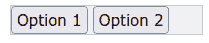

# 4

# 使用组件进行用户界面组合

在本章中，我们将更深入地探讨如何使用组件来组合用户界面。虽然我们可以像在*第三章*中我们的初始*待办事项列表*应用中那样，只用一个组件创建整个网页，但这并不是一个好的实践，除非是简单的应用、现有应用程序功能的部分迁移，或者在某些边缘情况下没有其他选择。组件是 Vue 构建界面的核心。

在本章中，我们将执行以下操作：

+   学习如何使用组件层次结构来组合用户界面

+   学习组件之间相互交互和通信的不同方式

+   探索特殊和自定义组件

+   创建一个应用设计模式的示例插件

+   使用我们的插件和组件组合重新编写我们的待办事项应用

本章将介绍核心和高级概念，并为您提供构建具有可重用组件的稳健 Web 应用程序的工具。特别是，我们将应用从*第二章*中学习的设计模式，*软件设计原则和模式*，在代码实现中。

关于样式的说明

为了避免代码示例过长，我们将省略示例中的图标和样式。完整的代码，包括样式和图标，可以在本书的 GitHub 仓库中找到：[`github.com/PacktPublishing/Vue.js-3-Design-Patterns-and-Best-Practices`](https://github.com/PacktPublishing/Vue.js-3-Design-Patterns-and-Best-Practices)。

# 技术要求

遵循本章的要求与之前在*第三章*中提到的相同，*设置一个* *工作项目*。

查看以下视频以查看代码的实际应用：[`packt.link/eqm4l`](https://packt.link/eqm4l)

本章的代码文件可以在 GitHub 上找到：[`github.com/PacktPublishing/Vue.js-3-Design-Patterns-and-Best-Practices/tree/main/Chapter04`](https://github.com/PacktPublishing/Vue.js-3-Design-Patterns-and-Best-Practices/tree/main/Chapter04)

# 使用组件进行页面组合

要创建用户界面，我们必须有一个起点，无论是粗糙的草图还是复杂的设计。Web 应用程序的图形设计超出了本书的范围，因此我们将假设它已经创建好了。为了将设计转换为组件，我们可以将其视为一个回答以下问题的过程：

1.  我们如何使用组件来表示布局和多个元素？

1.  这些组件将如何相互通信和关联？

1.  将有哪些动态元素进入或离开场景，以及它们将由哪些事件或应用程序状态触发？

1.  考虑权衡，我们可以应用哪些设计模式来最好地满足用例？

Vue 3 非常适合创建动态、交互式的界面。这些问题引导我们到一个可重复的实现方法。所以，让我们定义一个具有明确阶段和步骤的通用过程。

## 步骤 1 – 识别布局和用户界面元素

此步骤回答的问题是：*我们如何用组件来表示布局和多个元素？*

我们将考虑整个页面，并根据设计考虑哪种布局最合适。我们应该使用列？部分？导航菜单？内容岛屿？是否有对话框或模态窗口？一种简单的方法是将设计图像取出来，并用矩形标记可能代表组件的部分，从最外层到单个交互单元。迭代这个页面的*切割*，直到你有一个舒适的组件数量。考虑到新的待办事项应用设计，这一步可能看起来是这样的：


图 4.1 – 将设计切割成带有虚线框的组件

一旦我们确定了组件，我们必须提取它们之间的关系，从最顶层的根组件（通常，这将是我们`App.vue`）创建一个层次结构。由于按上下文或功能分组组件，可能会出现新的组件。这是命名组件的好时机。这个初始架构将随着我们实现设计模式而演变。按照这个例子，层次结构可能看起来像这样：


图 4.2 – 组件层次结构的初步方法

注意到由于对其他组件的分组，出现了一个新的组件`ToDoProject.vue`。`App`组件通常处理应用程序的主要布局和层次结构中的起点。现在，随着我们的初始设计就位，是时候进行下一步了。

## 步骤 2 – 识别关系、数据流、交互和事件

此步骤回答的问题是：*这些组件将如何相互沟通和关联？*

在这个阶段，我们需要了解用户的交互（使用用例、用户故事或其他）。对于每个组件，我们决定它将保存什么信息（状态），将传递给其子组件的内容，它需要从其父组件获取的内容，以及它将触发哪些事件。在 Vue 中，组件只能垂直地相互关联。兄弟组件大部分情况下会忽略彼此的存在。如果一个兄弟组件需要与另一个组件共享数据，那么这些数据必须由一个可以与双方共享的第三方托管，通常是具有共同可见性的父组件。还有其他解决方案，例如响应式状态管理，我们将在*第七章*，*数据流管理*中详细讨论。对于本章，我们将满足基本的关联功能。

记录这些信息有许多方法：在层次结构树中手写的笔记（见 *图 4.2*），描述性的正式文档，UML 图表（**UML** 代表 **通用建模语言**，是软件组件的图标表示），等等。为了简单起见，我们只将树的一个部分以表格格式写下：

| **组件** | **功能** | **状态，输入/输出，事件** |
| --- | --- | --- |
| ToDoProject.vue | 托管待办事项列表并与用户协调交互。此组件将主动修改项目。 | 状态：待办事项列表 | 事件：打开新项目、编辑和删除模态框 |
| ToDoSummary.vue | 显示按状态分类的待办事项汇总。 | 输入：待办事项列表 | 状态：每个项目状态的计数器 |
| ToDoFilter.vue | 收集一个字符串以过滤待办事项列表。 | 输出：一个过滤字符串 | 状态：一个辅助变量 |
| ToDoList.vue | 显示待办事项列表，以及每个项目的信号操作。 | 输入：待办事项列表，一个过滤字符串 | 事件：切换项目状态，编辑和删除项目 |

为了简洁，我省略了将构成用户对话框的组件和交互。我们将在本章后面看到它们，但可以简单地说，`ToDoProject.vue` 负责使用模态对话框管理交互。

## 第 3 步 – 识别用户交互元素（输入、对话框、通知等）

此步骤回答的问题是：*哪些动态元素将进入或离开场景，以及它们将触发哪些事件或应用程序状态？*

在我们的应用程序中，主要的 CRUD 操作（`ToDoProject.vue` 组件作为对某些事件的响应来控制此交互）由 `ToDoProject.vue` 组件执行。此过程在本序列图中表示：


图 4.3 – 通过模态框进行用户交互 – 编辑项目

在此图中，`ToDoProject` 组件与 `ToDoList` 组件共享待办事项列表。当用户触发 `edit` 事件时，子组件通过引发此类事件来通知父组件。然后，父组件复制项目并打开一个模态对话框，传递该副本。当对话框被接受时，父组件使用更改修改原始项目。然后，Vue 的响应性反映了子组件中的状态变化。

通常，这些交互帮助我们识别在 *第 1 步* 中不明显需要的额外组件，例如设计模式的实现……这是下一步。

## 第 4 步 – 识别设计模式和权衡

此步骤回答的问题是：*在考虑权衡的情况下，我们可以应用哪些最佳设计模式来满足用例？*

决定使用哪些模式可能是一个非常创造性的过程。没有银弹，多个解决方案可以提供不同的结果。通常需要制作几个原型来测试不同的方法。

在我们的新应用程序中，我们引入了模态对话框的概念来捕获用户输入。当操作需要用户操作或决策才能继续时，会使用模态对话框。用户可以接受或拒绝对话框，并且在做出决定之前不能与应用程序的任何其他部分交互。在这些条件下，一个可能的模式是应用 **异步** **Promise** 模式。

在我们的代码中，我们希望将模态对话框作为一个 promise 打开，这个 promise 按定义将提供给我们一个 `resolve()`（接受）或 `reject()`（取消）函数。此外，我们希望能够在多个项目中，以及在我们的应用程序中全局地使用这个解决方案。我们可以创建一个插件来实现这个目的，并使用 **依赖注入模式** 从任何组件访问模态功能。这些模式将为我们提供所需的解决方案，使我们的模态对话框可重用。

在这个阶段，我们几乎准备好从概念上开始实现组件。然而，为了创建一个更适合且更坚固的应用程序，并实现上述模式，我们应该花点时间来更多地了解 Vue 组件。

# 深入了解组件

组件是框架的构建块。在 *第一章*，*Vue 3 框架* 中，我们看到了如何与组件一起工作，声明响应式变量，以及更多。在本节中，我们将探索更多高级功能和定义。

## 本地组件和全局组件

当我们开始我们的 Vue 3 应用程序时，我们在 `main.js` 文件中将主组件 (`App.vue`) 挂载到一个 HTML 元素上。之后，在各个组件的脚本部分，我们可以通过以下命令导入其他组件以本地使用：

```js
import MyComponent from "./MyComponent.vue"
```

以这种方式，为了在另一个组件中使用 `MyComponent`，我们需要在这个组件中再次导入它。如果一个组件在多个组件中连续使用，这种重复操作会打破开发 DRY 原则（参见 *第二章*，*软件设计原则和模式*）。另一种选择是将组件声明在 `main.js` 文件中，我们可以使用 `App.component()` 方法来实现这种情况：

Main.js

```js
Import { createApp } from "vue"
import App from './App.vue'
Import MyComponent from "./MyComponent.vue"
createApp(App)
    .component('MyComponent', MyComponent)
    .mount("#app")
```

`component()` 方法接收两个参数：一个表示组件 HTML 标签的 `String`，以及一个包含组件定义的对象（可以是导入的或内联的）。注册后，它将可供我们应用程序中的所有组件使用。然而，使用全局组件有一些缺点：

+   即使从未使用过，组件也将包含在最终的构建中

+   全局注册会模糊组件之间的关系和依赖

+   本地导入的组件可能会发生名称冲突

建议只全局注册那些提供通用功能的组件，并避免那些是工作流程或特定上下文不可或缺部分的组件。

## 静态、异步和动态导入

到目前为止，我们导入的所有组件都使用 `import XYZ from "filename"` 语法以*静态*方式定义。例如 **Vite** 这样的打包器将它们包含在一个单一的 JavaScript 文件中。这增加了包的大小，并且可能会在我们的应用程序启动时造成延迟，因为浏览器需要下载、解析和执行包及其所有依赖项，然后才能进行任何用户交互。此代码可能包含很少使用或访问的功能。这种做法的明显替代方案是将我们的包文件分割成多个较小的文件，并在需要时加载它们。在这种情况下，我们有两种方法——一种由 Vue 3 提供，另一种由最新的 JavaScript 动态导入语法提供。

Vue 3 提供了一个名为 `defineAsyncComponent` 的函数。此函数接受一个参数，即返回动态导入的另一个函数。以下是一个示例：

```js
import {defineAsyncComponent} from "vue"
const MyComponent = defineAsyncComponent(
                    ()=>import("MyComponent.vue")
                 )
```

使用此函数使其在大多数打包器中安全使用。Vue Router 使用此语法的替代方案，我们将在*第五章*“单页应用程序”中看到：JavaScript 提供的 `import()` 动态声明([`developer.mozilla.org/en-US/docs/Web/JavaScript/Reference/Operators/import`](https://developer.mozilla.org/en-US/docs/Web/JavaScript/Reference/Operators/import))，其语法非常相似：

```js
const MyComponent = () => import('./MyComponent.vue')
```

如您所见，此语法更简洁。然而，它只能在定义 Vue Router 路由时使用，因为 Vue 3 和 Vue Router 处理懒加载组件的方式在内部是不同的。最终，两种方法都将主包文件分割成多个较小的文件，这些文件将在需要时自动加载到我们的应用程序中。

然而，`defineAsyncComponent` 有一些优点。我们还可以传递任何返回解析为组件的 promise 的函数。这允许我们在运行时动态地控制过程。以下是一个示例，其中我们根据输入值的值决定加载一个组件：

```js
const ExampleComponent=defineAsyncComponent(()=>{
    return new Promise((resolve, reject)=>{
        if(some_input_value_is_true){
            import OneComponent from "OneComponent.vue"
                resolve(OneComponent)
           }else{
               import AnotherComponent from
                   "AnotherComponent.vue"
               resolve(AnotherComponent)
           }
    })
})
```

`defineAsyncComponent` 的第三种语法可能是最有用的。我们可以将一个具有属性的对象作为参数传递，这提供了对加载操作的更多控制。它具有以下属性：

+   `loader`（必填）：它必须提供一个返回加载组件的 promise 的函数

+   `loadingComponent`: 在异步组件加载时显示的组件

+   `delay`: 在显示 `loadingComponent` 之前等待的毫秒数

+   `errorComponent`: 如果 promise 拒绝或由于任何原因加载失败时显示的组件

+   `timeout`: 在认为操作失败并显示 `errorComponent` 之前的时间（毫秒）

这里是一个使用所有这些属性的示例：

```js
const HeavyComponent = defineAsyncComponent({
    loader: ()=> import("./HeavyComponent"),
    loadingComponent: SpinnerComponent,
    delay: 200,
    errorComponent: LoadingError,
    timeout: 60000
    })
```

当浏览器从 `loader` 属性检索组件时，我们显示 `SpinnerComponent` 来通知用户操作正在进行中。根据 `timeout` 定义的 1 分钟后，它将自动显示 `LoadingError` 组件。

采用这种方法，我们的代码优化得更好。现在，让我们学习如何通过事件接收数据和通知其他组件。

## 属性、事件和 v-model 指令

我们已经看到了使用属性和事件作为在组件与其父组件之间传递数据的基本用法。但通过多种语法，可以实现更强大的定义。属性可以在 `script setup` 语法中使用 `defineProps` 和以下任何参数格式定义：

+   作为字符串数组 – 例如：

`const $props=defineProps(``)`

+   作为对象，其属性用作名称，值是数据类型 – 例如，

`const $props=defineProps(``)`

作为对象，其属性定义了一个具有类型和默认值的对象 – 例如，

`const $props=defineProps(`**{**

**    name: { type: String, default: “John”},**

**    last_name: {type: String, default: “Doe”}**

`)`

我们需要记住，原始值是通过 **value**（意味着在子组件内部更改它们的值不会影响父组件中的值）传递给组件的。然而，复杂的数据类型，如对象和数组，作为 **引用** 传递，因此它们内部键/值的更改将反映在父组件中。

关于复杂类型的说明

当使用默认值定义 `Object` 或 `Array` 类型的属性时，默认属性必须是一个返回该对象或数组的函数。否则，对象/数组的引用将由组件的所有实例共享。

*事件* 是子组件向父组件发出的信号。这是在 `script` `setup` 语法中定义组件事件的示例：

```js
const $emit=defineEmits(['eventName'])
```

与属性不同，emits 只接受字符串声明的数组。事件还可以向接收者传递值。以下是从上述定义中调用的示例：

```js
$emit('eventName', some_value)
```

如您所见，`defineEmits` 返回一个函数，该函数接受定义数组中提供的相同名称作为第一个参数。第二个参数 `some_value` 是可选的。

## 自定义输入控制器

当属性和事件共同作用时，有一个特殊的应用是创建自定义输入控制器。在之前的示例中，我们使用了 Vue 的 `v-model` 指令在基本的 HTML 输入元素上捕获它们的值。遵循特殊命名约定的属性和事件允许我们创建接受 `v-model` 指令的输入组件。让我们看一下以下代码：

父组件模板

```js
<MyComponent v-model="parent_variable"></MyComponent>
```

现在我们已经在父组件中使用了 `MyComponent`，让我们看看我们如何创建连接：

MyComponent 脚本设置

```js
const $props=defineProps(['modelValue']),
      $emit=defineEmits(['update:modelValue'])
```

我们使用 `Props` 的数组定义来简化。请注意，prop 的名称是 `modelValue`，事件是 `update:modelValue`。这种语法是预期的。当父组件使用 `v-model` 分配变量时，值将被复制到 `modelValue`。当子组件发出 `update:modelValue` 事件时，父组件变量的值将被更新。这样，您可以创建强大的输入控件。但还有更多——您可以有多个 `v-model`！

让我们考虑在使用 `v-model` 时 `modelValue` 是默认值。Vue 3 引入了一种新的语法来处理这个指令，以便我们可以拥有多个模型。声明非常简单。考虑以下子组件的声明：

子组件的 props 和事件

```js
const
  $props=defineProps(['modelValue', 'title']),
  $emit=defineEmits(['update:modelValue','update:title'])
```

在前面的 props 和 emits 定义之后，我们现在可以从父组件中引用它们，如下例所示：

父组件模板

```js
<ChildComponent v-model="varA" v-model:title="varB"></ChildComponent>
```

如我们所见，我们可以在 `v-model:name_of_prop` 指令上附加一个修饰符。在 `Child` 组件中，事件的名称现在必须包含 `update:` 前缀。

使用 props 和事件允许在父组件和子组件之间直接进行数据流。这意味着如果需要与多个子组件共享数据，它必须在父级进行管理。当父组件需要将数据传递给不是子组件，而是孙组件或其他深层嵌套的组件时，这种限制就会产生一个问题。这就是 *依赖注入模式* 来拯救的时刻。Vue 通过 `Provide` 和 `Inject` 函数自然地实现了这一点，我们将在下一节中更详细地介绍。

## 使用 Provide 和 Inject 进行依赖注入

当父组件中的数据需要在深层嵌套的子组件中可用时，仅使用 props，我们就必须在组件之间“传递”数据，即使它们不需要或使用这些数据。这个问题被称为 *props 钻孔*。同样，事件在相反方向上“冒泡”时也会发生这种情况。为了解决这个问题，Vue 提供了名为 `Provide` 和 `Inject` 的两个函数来实现依赖注入模式。使用这些函数，父或根组件可以 *提供* 数据（无论是按值还是按引用，如对象），这些数据可以被 *注入* 到其层次树中的任何子组件中。直观上，我们可以将这种情况表示如下：


图 4.4 – Provide/Inject 的表示

如您所见，这个过程非常简单，以及实现该模式的语法：

1.  在父（根）组件中，我们导入 Vue 的 `provide` 函数并创建一个带有键（名称）和要传递的数据的提供：

    ```js
    import {provide} from "vue"
    provide("provision_key_name", data)
    ```

1.  在接收组件中，我们导入 `inject` 函数并通过键（名称）检索数据：

    ```js
    import {} from "vue"
    const $received_data = (")
    ```

我们还可以以下列方式在应用级别提供资源：

```js
const app = createApp({})
app.provide('provision_key_name', data_or_value)
```

这样，提供的内容可以注入到我们应用程序的任何组件中。值得一提的是，我们还可以提供复杂的数据类型，例如数组、对象和响应式变量。在以下示例中，我们提供了一个包含函数和父方法引用的对象：

在父/根组件中

```js
import {provide} from "vue"
function logMessage(){console.log("Hi")}
const _provision_data={runLog: logMessage}
provide("service_name", _provision_data)
```

在子组件中

```js
import {inject} from "vue"
const $service = inject("service_name")
$service.runLog()
```

在这个例子中，我们有效地提供了一个`Admin.Users.Individual.Profile`，它比`user_data`更具描述性。命名约定（类似于路径的命名只是一个建议，而不是标准）由团队和开发者来定义。正如本书之前提到的，一旦你决定了一个约定，重要的是在整个源代码中保持一致性。在本章的后面部分，我们将使用这种方法创建一个用于显示模态对话框的插件，但在那之前，我们需要了解一些关于特殊组件和模板的更多概念。

# 特殊组件

组件的层次结构非常强大，但也有局限性。我们已经看到如何应用依赖注入模式来解决这些问题之一，但还有其他一些情况需要更多的灵活性、可重用性或力量来共享代码或模板，甚至将渲染在层次结构之外的组件移动过来。

## 插槽，插槽，还有更多的插槽...

通过使用 props，我们的组件可以接收 JavaScript 数据。通过类比推理，我们也可以使用称为**插槽**的占位符将模板片段（HTML、JSX 等）传递到组件模板的特定部分。就像 props 一样，它们接受几种类型的语法。让我们从最基本的一个开始：*默认插槽*。

假设我们有一个名为`MyMenuBar`的组件，它充当顶部菜单的占位符。我们希望父组件以我们使用常见 HTML 标签（如`header`或`div`）的方式填充选项，如下所示：

父组件

```js
<MyMenuBar>
    <button>Option 1</button>
    <button>Option 2</button>
</MyMenuBar>
```

MyMenuBar 组件

```js
<template>
<div class="...">
    <slot></slot>
</div>
</template>
```

假设我们在`MyMenuBar`中应用了必要的样式和类，最终的渲染模板可能看起来像这样：



图 4.5 – 使用插槽的菜单栏

应用到的逻辑非常直接。`<slot></slot>`占位符将在运行时被父组件在子标签内提供的任何内容所替换。在前面的示例中，如果我们检查渲染后的最终 HTML，我们可能会发现如下内容（考虑到我们正在使用`W3.css`类）：

```js
<div class="w3-bar w3-border w3-light-grey">
  <button>Option 1</button>
  <button>Option 2</button>
</div>
```

这是用户界面设计中的一个基本概念。现在，如果我们需要多个“插槽”——例如，创建一个布局组件呢？在这里，一个称为*命名插槽*的替代语法就派上用场了。考虑以下示例：

MyLayout 组件

```js
<div class="layout-wrapper">
    <section><slot name="sidebar"></slot></section>
    <header><slot name="header"></slot></header>
    <main><slot name="content"></slot></main>
</div>
```

如您所见，我们通过 *name 属性* 命名了每个槽。在父组件中，我们现在必须使用带有 `v-slot` 指令的 `template` 元素来访问每个槽。以下是一个父组件如何使用 `MyLayout` 的示例：

父组件

```js
<MyLayout>
    <template v-slot="sidebar"> ... </template>
    <template v-slot="header"> ... </template>
    <template v-slot="content"> ... </template>
</MyLayout>
```

`v-slot` 指令接收一个参数，匹配槽名称，以下是一些注意事项：

+   如果名称不匹配任何可用的槽，则内容不会被渲染。

+   如果没有提供名称，或者使用了名称 `default`，那么内容将在默认的无名槽中渲染。

+   如果模板没有提供内容，那么在槽定义内部的默认元素将被显示。默认内容放置在槽标签之间：`<slot>...default` `content here...</slot>`。

`v-slot` 指令也有简写符号。我们只需在槽名称前加上一个数字符号（`#`）。例如，前面父组件的模板可以简化如下：

```js
<template #sidebar> ... </template>
<template #header> ... </template>
<template #content> ... </template>
```

Vue 3 中的槽非常强大，甚至允许在需要时将属性传递给父组件。语法取决于我们是否使用 *默认槽* 或 *命名槽*。例如，考虑以下组件模板定义：

向上传递属性组件

```js
<div>
    <slot :data="some_text"></data>
</div>
```

在这里，槽将一个名为 `data` 的属性传递给父组件。父组件可以使用以下语法访问它：

接收槽属性的父组件

```js
<PassingPropsUpward v-slot="upwardProp">
    {{upwardProp.data}} //Renders the content of some_text
</PassingPropsUpward>
```

在父组件中，我们使用 `v-slot` 指令并给槽传递的属性分配一个本地名称——在这种情况下，`upwardProp`。这个变量将接收一个类似于属性对象的对象，但作用域限于元素。正因为如此，这类槽被称为 *命名作用域槽*，语法类似。看看这个例子：

```js
<template #header="upwardProp">
    {{upwardProp.data}}
</template>
```

槽还有其他高级用法，涵盖了边缘情况，但在这本书中我们将不涉及这些。相反，我鼓励您在官方文档中进一步研究这个主题：[`vuejs.org/guide/components/slots.html`](https://vuejs.org/guide/components/slots.html)。

与此主题相关的一个概念我们将在本书的后面章节中看到，即 *第七章*，*数据流管理*，它适用于响应式中心状态管理。现在，让我们看看一些有点不寻常的特殊组件。

## 组合式和混入

在 Vue 2 中，有一个名为 `composables` 的特殊组件。

**组合式**是一个使用组合式 API 封装和重用组件之间 *状态逻辑* 的函数。区分组合式与服务类或其他 *业务逻辑* 的封装非常重要。组合式的主要目的是共享 *用户界面或用户交互逻辑*。一般来说，每个组合式都执行以下操作：

+   提供一个返回 *响应式* 变量的函数。

+   遵循以`use`为前缀的*camelCase*命名约定 – 例如，`useStore()`、`useAdmin()`、`useWindowsEvents()`等。

+   它在其自己的模块中是自包含的。

+   它处理*状态逻辑*。这意味着它管理随时间持续变化的数据。

组合式的经典例子是将其附加到环境事件（窗口大小调整、鼠标移动、传感器、动画等）上。让我们实现一个简单的组合式组件，它读取文档的垂直滚动：

DocumentScroll.js

```js
import {ref, onMounted, onUnmounted} from "vue"                //1
function useDocumentScroll(){
    const y=ref(window.scrollY)                                //2
    function update(){y.value=window.scrollY}
    onMounted(()=>{
        document.addEventListener('scroll', update)})          //3
    onUnmounted (()=>{
        document.removeEventListener('scroll', update)})       //4
    return {y}                                                 //5
}
export {useDocumentScroll};                                    //6
```

在这个小组合式组件中，我们首先从 Vue 导入组件的生命周期事件和响应式构造函数（`//1`）。我们的主函数`useDocumentScroll`包含了我们稍后要共享和导出的全部代码（`//6`）。在`//2`中，我们创建一个响应式常量并将其初始化为当前窗口的垂直滚动位置。然后，我们创建一个内部函数`update`，它更新`y`的值。我们在`//3`中将这个函数作为监听器添加到文档滚动事件，然后在`//4`中移除它（来自*第二章*的*“清理自己的东西，”*原则）。最后，在`//5`中，我们返回一个包裹在对象中的响应式常量。然后，在一个组件中，我们这样使用这个组合式组件：

SomeComponent.js – 脚本设置

```js
import {useDocumentScroll} from "./DocumentScroll.js"
const {y}=useDocumentScroll()
...
```

一旦我们导入了响应式变量，我们就可以像往常一样在我们的代码和模板中使用它。如果我们需要在多个组件中使用这段逻辑，我们只需导入组合式组件（**DRY**原则）。

最后，[`vueuse.org/`](https://vueuse.org/)为我们项目提供了一个令人印象深刻的组合式组件集合。它值得一看。

## 带有“component:is”的动态组件

Vue 3 框架提供了一个名为`<component>`的特殊组件，其任务是作为一个占位符动态渲染其他组件。它使用一个特殊属性`:is`，可以接收一个带有组件名称的**String**，或者一个带有组件定义的变量。它还接受一些基本表达式（一个解析为值的代码行）。以下是一个使用表达式的简单示例：

CoinFlip 组件

```js
<script setup>
    import Heads from "./heads.vue"
    import Tails from "./tails.vue"
    function flipCoin(){return Math.random() > 0.5}
</script>
<template>
    <component :is="flipCoin()?Heads:Tails"></component>
</template
```

当这个组件被渲染时，我们将根据`flipCoin()`函数的结果看到`Heads`或`Tails`组件。

在这一点上，你可能想知道，为什么不使用简单的`v-show/v-if`？当动态管理组件并且不知道在创建模板时哪些组件可用时，这个组件的力量就显现出来了。我们将在*第五章*中看到的官方 Vue Router，*单页应用*，使用这个特殊组件来模拟页面导航。

然而，有一个边缘情况，我们需要注意。虽然大多数模板属性将传递到动态组件，但某些指令（如`v-model`）在*原生输入元素*上不起作用。这种情况非常罕见，我们不会详细讨论，但可以在官方文档中找到[`vuejs.org/api/built-in-special-elements.html#component`](https://vuejs.org/api/built-in-special-elements.html#component)。

现在我们对组件有了更深入的了解，让我们将新知识应用于两个项目：一个插件和我们的待办事项应用的新版本。

# 一个现实世界的例子 – 模态插件

我们已经看到了多种在项目内部共享数据和功能的方法。插件是在项目之间共享功能并同时增强系统功能的设计模式。Vue 3 提供了一个非常简单的接口来创建插件并将它们附加到我们的应用实例。任何暴露`install()`方法或接受相同参数的函数都可以成为插件。插件可以执行以下操作：

+   注册全局组件和指令

+   在应用级别注册可注入的资源

+   为应用创建和附加新的属性或方法

在本节中，我们将创建一个实现模态对话框作为全局组件的插件。我们将使用依赖注入来提供它们作为资源，并利用 Vue 的响应性通过 promises 来管理它们。

## 设置我们的开发项目

按照*第三章*中的说明，*设置工作项目*，以便您有一个起点。在`src/`目录下，创建一个名为`plugins/`的新文件夹，并在其中创建一个名为`modals/`的子文件夹。将插件放置在`plugins/`文件夹内的单独目录中是一种标准做法。

## 设计

我们的插件将全局安装一个组件，并保持一个内部响应式状态来跟踪当前模态对话框的状态。它还将提供一个 API，以便将其作为依赖项注入需要打开模态对话框的组件。这种交互可以表示如下：


图 4.6 – 模态插件表示

组件将实现模态元素，我们将通过代码打开对话框。当模态打开时，它将返回一个遵循异步模式的 promise。当用户接受模态时，promise 将解析，并在取消时拒绝。模态的内容将由父组件通过使用插槽提供。

## 实现

对于这个插件，我们只需要两个文件——一个用于插件的逻辑，另一个用于我们的组件。请在前往`src/plugins/modal`文件夹中创建`index.js`和`Modal.vue`文件。目前，只需使用该节段的脚本设置、模板和样式来搭建组件。我们稍后再回来完成它。有了这些文件，让我们一步一步地开始处理`index.js`文件：

/src/plugins/modals/index.js

```js
import { reactive } from "vue"                     //1
import Modal from "./Modal.vue"
const
    _current = reactive({}),                       //2
    api = {},                                      //3
    plugin = {
        install(App, options) {                    //4
            App.component("Modal", Modal)
            App.provide("$modals", api)
        }
    }
export default plugin
```

我们从`//1`开始，从 Vue 导入`reactive`构造函数和一个我们尚未创建的`Modal`组件。然后在`//2`行中创建一个内部状态属性`_current`，在`//3`行中创建一个将成为我们的 API 的对象。目前，这些只是占位符。重要的部分在`//4`行，我们在这里定义了`install()`函数。这个函数接收两个参数：

1.  应用程序实例（`App`）。

1.  如果在安装过程中传递了选项，则包含选项的对象。

使用应用程序实例，我们将`Modal`注册为全局组件，并将 API 作为名为`$modals`的可注入资源在应用程序级别提供。为了在我们的应用程序中使用此插件，我们必须将其导入到`main.js`中，并使用`use`方法进行注册。代码如下：

/src/Main.js

```js
import { createApp } from 'vue'
import App from './App.vue'
import Modals from "./plugins/modals"
createApp(App).use(Modals).mount('#app')
```

如您所见，创建和使用插件相当简单。然而，到目前为止，我们的插件并没有做很多事情。让我们回到我们的插件代码，并完成 API。我们需要的是以下内容：

+   一个`show()`方法，它接受一个标识模态对话框实现的名称，并返回一个 promise。然后我们将名称和`resolve()`和`reject()`函数的引用保存在我们的响应式状态中。

+   `accept()`和`cancel()`方法，分别用于解决和拒绝 promise。

+   一个`active()`方法，用于检索当前模态的名称。

按照这些指南，我们可以完成代码，使我们的`index.js`文件看起来像这样：

/src/plugins/modals/index.js

```js
import { reactive } from "vue"
import Modal from "./Modal.vue"
const
_current = reactive({name:"",resolve:null,reject:null}),
api = {
      active() {return _current.name;},
      show(name) {
           _current.name = name;
           return new Promise(
           (resolve = () => { }, reject = () => { }) => {
                _current.resolve = resolve;
                _current.reject = reject;
           })
},
      accept() {_current.resolve();_current.name = "" },
      cancel() {_current.reject();_current.name = "" }
},
plugin = {...} // Omitted for brevity
export default plugin;
```

我们使用`reactive`变量来保持内部状态，并且只通过我们的 API 进行访问。一般来说，这对任何 API 来说都是一个很好的设计。现在，是时候在我们的`Modal.vue`组件中施展魔法，以完成工作流程了。为了简洁，我省略了类和样式，但完整的代码可以在本书的 GitHub 仓库[`github.com/PacktPublishing/Vue.js-3-Design-Patterns-and-Best-Practices`](https://github.com/PacktPublishing/Vue.js-3-Design-Patterns-and-Best-Practices)中找到。

我们的模式组件需要执行以下操作：

+   使用半透明元素覆盖整个可查看区域，以阻止与应用程序其他部分的交互

+   提供要显示的对话框：

    +   一个*属性*用于注册组件的名称，由父组件提供。

    +   一个*标题*用于显示标题。标题也将是一个属性。

    +   一个区域供父组件填充自定义内容。

    +   包含带有*接受*和*取消*按钮的页脚。

    +   一个在组件应该出现时触发的响应式属性。

在我们的定义到位后，让我们开始处理模板：

/src/plugins/modals/Modal.vue

```js
<template>
<div class="viewport-wrapper" v-if="_show">              //1
  <div class="dialog-wrapper">
   <header>{{$props.title}}</header>                     //2
   <main><slot></slot></main>                            //3
   <footer>
     <button @click="closeModal(true)">Accept</button>   //4
     <button @click="closeModal(false)">Cancel</button>
   </footer>
  </div>
</div>
</template>
```

在第 `//1` 行，响应式变量 `_show` 控制对话框的可见性。我们在第 `//2` 行显示 `title` prop，并在第 `//3` 行预留一个槽位。第 `//4` 行的按钮将在点击事件中关闭模态，每个按钮都有一个代表性的布尔值。

现在，是时候编写组件的逻辑了。在我们的脚本中，我们需要做以下事情：

+   定义两个 props：`title`（用于显示）和 `name`（用于识别）

+   注入 `$modals` 资源，以便我们可以与 API 交互并执行以下操作：

    +   检查模态的名称是否与当前组件匹配（这“打开”了模态对话框）

    +   通过解决或拒绝承诺来关闭模态

按照这些指示，我们可以完成我们的 `script setup：`

```js
<script setup>
  import { inject, computed } from "vue"                 //1
  const
  $props = defineProps({                                 //2
      name: { type: String, default: "" },
      title: { type: String, default: "Modal dialog" }
      }),
  $modals = inject("$modals"),                           //3
  _show = computed(() => {                               //4
      return $modals.active() == $props.name
  })
  function closeModal(accept = false) {
      accept?$modals.accept():$modals.cancel()           //5
  }
</script>
```

我们从第 `//1` 行开始，导入 `inject` 和 `computed` 函数。在第 `//2` 行，我们创建具有合理默认值的 props。在第 `//3` 行，我们注入 `$modals` 资源（依赖项），我们将在第 `//4` 行的 computed 属性中使用它来检索当前活动模态并将其与组件进行比较。最后，在第 `//5` 行，根据按钮的点击，我们触发承诺的解决或拒绝。

要在我们的应用中的任何组件中使用此插件，我们必须遵循以下步骤：

+   在 `template` 中，定义一个名为我们在插件中注册的组件（`Modal`）。注意使用属性为 props：

    ```js
    <Modal name="myModal" title="Modal example">
          Some important content here
    </Modal>
    ```

+   在我们的脚本设置中，使用以下代码注入依赖项：

    ```js
    const $modals = inject("$modals")
    ```

+   使用以下代码通过给定的名称显示模态组件：

    ```js
    $modals.show("myModal").then(() => {
          // Modal accepted.
    }, () => {
          // Modal cancelled
    })
    ```

使用这个，我们已经完成了我们的第一个 Vue 3 插件。让我们在我们的新待办事项应用中好好利用它。

# 实现我们的新待办事项应用

在本章的开头，我们看到了我们新待办事项应用的设计，并将其切割成层次组件（见 *图 4**.1*）。为了跟随本节的其余部分，你需要从本书的 GitHub 仓库中获取源代码副本（[`github.com/PacktPublishing/Vue.js-3-Design-Patterns-and-Best-Practices`](https://github.com/PacktPublishing/Vue.js-3-Design-Patterns-and-Best-Practices)）。随着我们的代码库的增长，不可能详细查看每个实现，因此我们将关注主要更改和特定的代码片段。考虑到这一点，让我们回顾前一个实现中的更改，大致按照文件执行顺序。首先，我们在项目中添加了两个新的目录：

+   `/src/plugins`，我们放置我们的 `Modals` 插件的位置。

+   `/src/services`，我们放置具有我们的业务或中间件逻辑的模块。在这里，我们创建了一个服务对象来处理我们的待办事项列表的业务逻辑：`todo.js` 文件。

在 `main.js` 中，我们导入并添加我们的插件到应用对象，使用 `.use(Modals)` 方法注册我们的插件。

`App.vue`文件已经变成了一个主要的布局组件，没有其他应用程序逻辑。我们导入并使用一个头部组件`(MainHeader.vue)`和一个父组件来管理我们的待办事项和 UI，(`ToDoProject.vue)`，就像*图 4.2*中所示的设计一样。

`ToDoProject`组件通过反应变量包含列表的状态，其中我们有以下内容：

+   `_items`是一个包含我们的待办事项的数组

+   `_item`是一个辅助反应变量，我们用它来创建新项目或编辑项目的副本

+   `_filter`是另一个辅助反应变量，我们用它来输入一个字符串以过滤我们的列表

值得注意的是，我们还声明了一个常量`$modals`，它接收注入的`Modals`对象 API。注意`showModal()`函数如何使用此对象打开和管理新项目和编辑项目的对话框结果。然后，相关的模态在模板中显示，通过注释的结尾标记。通常，将所有模态模板放置在组件的末尾，而不是分散在整个模板中。

`ToDoProject`组件通过 props 将状态数据委派给子组件以显示摘要和列表项。它也从它们那里接收事件，带有操作列表的指令。你可以将这个组件视为功能的*根*。我们的应用程序只有一个，但这开始暗示了网络应用程序如何通过功能开始组织。

另一个值得注意的点，是使用*服务对象和类*。在我们的应用程序中，我们有`todo.js`，我们在需要的地方将其导入为`todoService`。在这种情况下，这是一个*单例*，但它也可以是一个类构造函数。*请注意，它不包含任何接口逻辑，只有应用程序或业务逻辑*。这是区分它与之前看到的*组合式*的一个决定性因素。

另一个变化是待办事项现在有多个状态，我们可以通过点击在它们之间循环。我们在服务的`toggleStatus()`函数中实现了这个逻辑，*而不是在组件中*。状态之间的流程可以表示如下：


图 4.7 – 一个循环有限状态机

你可能认出了这个设计，因为它代表了一个`switch`语句，就像我们例子中的那样：

Todo.js

```js
[function] toggleStatus(status){
    switch(status){
        case "not_started":     return "in_progress"
        case "in_progress":     return "completed"
        case "completed":       return "not_started"
    }
}
```

这个函数，根据其当前状态，将返回下一个状态。在每次点击时调用此函数，我们可以以干净的方式更新每个项目的状态。

关于这个新实现的最后一个要点是`ToDoSummary`组件中计算属性的用法。我们使用它们来显示具有不同状态的项目的摘要卡片。注意反应性工作得有多好——当我们改变列表中项目的状态时，摘要会立即更新！

新的实现已经有序进行，现在是时候退一步，用批判性的思维审视我们的工作了。

# 对我们新的待办事项应用的小批评

与我们的第一次方法相比，这个新的待办事项应用版本是一个明显的改进，但它还可以改进：

+   我们仍然只有一个任务列表。

+   所有的操作都只在一个页面上发生。

+   我们的项目是短暂的。当我们关闭或刷新浏览器时，它们就会消失。

+   没有安全性，没有多用户的方式，等等。

+   我们只能添加纯文本。图像或富文本怎么办？

+   经过一些工作，我们可以扩展我们的应用程序，使其管理多个项目、额外内容、分配等等。

+   我们已经取得了良好的进展，但仍有许多工作要做。

# 摘要

在本章中，我们深入研究了组件，学习了它们如何在框架内进行通信、共享功能以及实现设计模式。我们还看到了将粗糙草图或详细设计转化为组件的方法。然后我们了解了特殊组件，使用框架的依赖注入创建了一个模态对话框插件，并应用其他模式使我们的编码更加容易和一致。此外，我们对应用程序进行了重构，扩展了其功能，同时审视了更好的状态管理，独立于我们之前使用的 HTML 元素。我们已经取得了良好的进展，但仍有许多工作要做。

在下一章，我们将使用到目前为止所学的内容创建一个**单页应用**（SPA）。

# 复习问题

回答以下问题以测试你对本章知识的掌握：

+   我们如何从一个视觉设计或原型开始，并使用组件来规划实现？

+   组件之间可以以多少种方式相互通信？

+   我们如何在多个组件中重用代码？还有其他方法吗？

+   插件是什么，我们如何创建一个？

+   我们在新的待办事项应用中应用了哪些模式？

+   你会在实现中做哪些改变？
