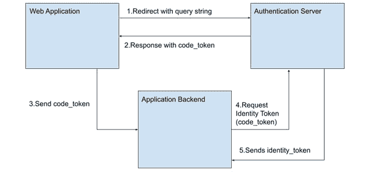

# 5

# 单页应用

在本章中，我们通过介绍**单页应用**（**SPAs**）继续提高我们在 Vue 3 中的技能。我们将学习它们与常规网站的区别，并深入研究它们的关键特性。为了将这一点付诸实践，我们将使用 Vue Router 构建我们待办事项应用的新版本，并使用与之前章节不同的通信模式。我们还将通过代码示例学习认证方法。

到本章结束时，您将了解以下内容：

+   如何使用 Vue 3 创建 SPA

+   如何组织您的应用以利用 Vue Router 的不同路由策略

+   如何使用不同模式的实际应用重新实现我们的待办事项应用

+   如何在您的 SPA 中实现不同的认证模式

虽然上一章在基础知识方面有些繁重，但从现在开始，我们将更多地关注实际问题。因此，您需要访问示例应用以继续学习。

# 技术要求

本章的代码可以在 GitHub 上找到，地址为[`github.com/PacktPublishing/Vue.js-3-Design-Patterns-and-Best-Practices/tree/main/Chapter05`](https://github.com/PacktPublishing/Vue.js-3-Design-Patterns-and-Best-Practices/tree/main/Chapter05)。

查看以下视频以查看代码的实际应用：[`packt.link/RnAyz`](https://packt.link/RnAyz)

# 什么是 SPA？

要解释什么是单页应用（SPA），我们首先应该解释我们如何与**万维网**（**WWW**或**W3**）交互。当我们在一个网页浏览器中输入地址时，我们会收到由一个网络服务器发送的网页。在最基本的形式中，一个网站只是一个页面的集合，大多数是我们所说的“静态页面”。在这个语境中，“静态”意味着服务器上的相同文件在发送时没有经过修改。这使得网站非常快且安全。然而，一个纯静态网站与最终用户之间的交互性并不强。有时这被称为**Web 1.0**。服务器和浏览器脚本的出现解决了这一限制，并催生了**多页应用**（**MPAs**）。页面现在可以是静态的，也可以在服务器上动态生成，服务器也可以接收请求新页面的调用，这些调用会处理额外的数据并返回一个新的页面作为响应。这些“即时生成”的新页面被称为**动态**，使得应用成为可能。这些技术使得博客、服务和商业得以迅速发展。

正是在异步通信（**AJAX**）、更强大的 JavaScript、本地存储方法、网络速度和计算能力的引入下，我们来到了被称为**Web 2.0**的时代。现在，我们可以将单个文件加载到浏览器中，并使用 JavaScript 控制整个界面和交互性，从而在不生成新页面的情况下创建丰富且高度交互的应用程序。SPA 仅在需要时与服务器联系，加载数据片段、UI 等。现在，可以将传统的“仅桌面”应用程序，如文本编辑器、电子表格、丰富的电子邮件客户端、图形设计套件等迁移到网络技术。*Office 365*、*Google Docs*、*Photoshop 在线*、*Telegram*、*Discord*、*Netflix*、*YouTube*等都是 SPA 的良好例子。重要的是要认识到，SPA 的引入并没有使 MPA 的使用无效或使其过时——每种方法在特定环境中都有其用途。实际上，今天的许多博客和新闻网站都是 MPA，并且仍然是互联网的重要组成部分。当今最复杂的网络应用程序包括 MPA 和 SPA 的混合使用，共同工作。SPA 甚至可以作为混合应用程序安装在桌面和移动设备上。我们将在*第六章*，“渐进式 Web 应用程序”中看到如何实现这一点。

随着分布式和去中心化计算的爆发，以及智能区块链的出现，构成单页应用（SPAs）的技术获得了更大的相关性。尽管尚未完全融入通用应用，但这个网络演化的新时代被称为**Web 3.0**。在本章中，我们将更深入地探讨这个主题，并举例说明。

到目前为止，我们制作的所有应用程序都属于 SPA 类别，即使我们还没有充分利用它们的潜力。Vue 3 专门设计用于创建这些类型的应用程序，并且是与*React*、*Angular*、*Svelte*等其他技术一样相关的技术之一。但并非一切都是甜蜜、闪亮和彩虹。与任何技术一样，使用 SPA 也有其权衡。在下一表中，我们列出了一些：

| **优点** | **缺点** |
| --- | --- |

|

+   加载速度更快，更智能

+   本地缓存以提高性能

+   丰富的 UI 和交互性

+   比 MPA 更容易开发和测试

+   与完整页面重新/加载相比，更有效地使用代码和模板，减少网络通信。

|

+   对搜索引擎索引或发现困难

+   复杂性增加

+   加载时间增加和首次交互速度变慢

|

表 5.1 – SPAs 的优缺点和权衡

如你所见，优势列表远远比劣势列表重要。当应用需要显著的用户交互和实时反馈时，你应该考虑使用 SPA。现在我们已经对 SPA 有了更好的了解，让我们看看它们功能核心的关键概念：应用**路由**。

# Vue 3 路由

Vue 是一个构建单页应用（SPA）的出色框架，但没有路由，任务很快就会变得相当复杂。Vue 路由是一个官方插件，它接管了应用的导航并将 URL 与组件匹配。这为我们带来了多页应用（MPA）的优势。有了路由，我们可以做以下事情：

+   创建和管理指向组件的动态路由，如果需要，自动将参数匹配到 props

+   通过名称识别路由（地址和组件），并通过代码触发导航

+   当需要时动态加载组件，从而减少包的大小

+   创建一种自然且逻辑的方法来处理网站导航和代码拆分

+   使用已知事件控制导航，在导航发生前后

+   以 MPAs 无法实现的方式创建页面过渡动画

Vue 3 路由的实现简单，遵循与生态系统其他组件相同的方法论。让我们从*第四章*，*使用组件的用户界面组合*，修改我们的项目以使用 Vue 路由。

## 安装

当开始一个新的项目时，你可能已经注意到安装程序菜单为你提供了安装 Vue 路由的选项。如果你没有选择此选项，就像我们在示例应用中所做的那样，之后的安装相当简单。在终端中，在项目目录下，只需执行以下命令：

```js
$ npm install vue-router@4
```

命令将下载并安装依赖项，就像在`node_modules`目录中的任何其他包一样。为了在我们的应用中使用它，我们需要做以下操作：

1.  创建我们的路由。

1.  将路由链接到我们的组件。

1.  将路由包含在我们的应用中。

1.  设置路由将显示我们的组件的模板。

与框架中的许多其他组件一样，路由没有指定你的路由应该放在哪个目录或组织结构中，或者你的组件也是如此。然而，我们将会使用一种已经成为行业默认标准的约定。在`/src`文件夹中，创建以下目录：

+   `/router`（或`/routes`）：在这里，我们将放置我们应用的 JavaScript 文件，包含路由

+   `/views`：这个文件夹将包含与应用导航匹配的最高级组件（作为最佳实践）

在这些目录就位后，我们就可以开始修改我们的应用以包含路由导航了。在此之前，让我们看看我们希望通过路由实现什么。

## 一个新的待办事项应用

我们的新应用程序将重用组件来显示我们的待办事项列表，但也将容纳创建多个列表或项目。我们将显示一个侧边栏，其中包含所有我们的项目，并在选择它们时，列表将更新 11。这些项目也将保存在浏览器中，因此我们可以通过使用 `localStorage` 在以后返回它们。然后我们将有一个非常简单的导航，包含两个顶级页面（组件）：

+   一个可以创建新项目的登录页面

+   一个可以处理我们的待办事项列表的项目页面

依据这些简单的原则，我们的应用程序完成后将看起来像这样：


图 5.1 – 我们的登录页面

如您在 *图 5**.1* 中所见，登录页面也是我们可以创建新项目的地方。我们使用模态对话框来收集用户输入，就像我们之前做的那样。在侧边栏中，我们显示一个链接到 **主页**（登录页面）以及一个包含我们创建的所有不同项目名称的列表。当您点击任何一个时，浏览器中的路由（URL）以及页面都将更新，我们将看到如下内容：


图 5.2 – 待办事项项目页面

您可能已经认出了这个最后的截图，因为它就是我们的 `ToDoProject.vue` 组件显示的内容。实际上，要达到这个结果需要非常少的修改。现在，让我们从路由开始。

## 路由定义和路由对象

要为我们的项目创建路由，我们首先需要在它们自己的模块中定义它们。在 `/router` 目录中，创建一个 `index.js` 文件，内容如下：

/src/router/index.js

```js
import {createRouter,createWebHashHistory} from 'vue-router'       //1
import Landing from "../views/Landing.vue"                         //2
const routes = [
    {path: "/",name: "landing",component: Landing},
    {path: "/project/:id",name: "project",
        component: () =>
            import("../views/ToDoProject.vue"),                    //3
        props: true
}],
router = createRouter({                                            //4
    history: createWebHashHistory(),                               //5
    routes,
    scrollBehavior(to, from, savedPosition){return{top:0}}
})
export default router;
```

我们从 `vue-router` 包中导入两个构造函数开始我们的文件，在行 `//1`：

+   `createRouter`，它将创建一个路由对象，我们可以将其作为插件注入到我们的应用程序中

+   `createWebHashHistory`，这是一个构造函数，我们将将其传递给我们的路由对象，并指示它如何管理浏览器中的 URL 重写

`Web hash history` 将在 URL 中显示 `#`（一个数字符号），并指示所有导航都指向单个文件。所有导航和 URL 参数都将遵循此符号。这是最简单的方法，不需要任何特殊配置。然而，其他可用的方法还有 **Web history**（也称为 *HTML5 模式* 或 *美观的 URL*）和 **Memory**。Web history 不使用哈希符号，但需要特殊的服务器配置。我们将在 *第十章* 的示例中看到如何完成，*部署您的应用程序*。Memory 模式不会修改 URL，主要用于网页视图（如 NW.js、Electron、Tauri、Cordova、Capacitor 等混合框架）和 **服务器端渲染**（**SSR**）。现在，我们将继续使用 **Web hash** **历史**方法。

在行`//2`中，我们使用静态符号导入了一个组件，并定义了一个包含我们的路由的`routes`数组。每个路由都由一个至少包含以下字段的对象表示：

+   `path`：表示与组件关联的 URL 的字符串

+   `name`：一个字符串，它像一个唯一的 ID 一样作用于路由，并且我们可以通过编程方式调用它

+   `component`：要渲染的组件

注意在行`//2`中我们导入了一个静态组件，但在行`//3`中，我们使用了动态导入符号。这意味着第一个路由（命名为`"landing"`)将被包含在主包中，但第二个路由（在行`//3`中，命名为`"project"`)只有在第一次需要时才会从单独的包中加载。使用路由，我们可以为提高我们的应用程序加载和包大小创建一个策略。

最后，在行`//4`中，我们使用构造函数创建我们的`router`对象，并传递一个选项对象。注意在行`//5`中，我们如何传递`history`字段一个我们选择的`history`方法的构造函数。我们还传递了我们的路由（显然），并且作为一个例子，我们创建了一个可能的*导航守卫*，以确保在导航到每个路由后，窗口滚动到顶部。如果没有这个，我们可能会遇到一个奇怪的副作用，滚动不会在“*页面*”之间改变。导航守卫在导航事件之前和之后触发。它们可以在多种情况下使用，例如身份验证控制或数据预加载。请参阅官方文档以获取守卫的完整列表，包括示例（[`router.vuejs.org/guide/advanced/navigation-guards.html`](https://router.vuejs.org/guide/advanced/navigation-guards.html)）。

在我们的第二个路由中，我们还包含了路径表示法中的一个变体，通过包含一个以分号（`;`)为前缀的命名参数（`:id`)。这个路由将匹配`/project/`之后的所有内容，并将其分配给一个响应式变量，我们可以通过编程方式访问它（我们将在后面看到它是如何工作的）。该路由还有一个额外的字段，`props: true`。这表示路径中命名的参数将被自动传递给组件作为 prop，如果组件定义了具有相同名称的 prop。这将在下一节中变得有用和明显。

在定义了我们的路由和路由器之后，现在是时候将它们导入到我们的`main.js`文件中，并将它们附加到我们的应用程序上了。文件现在看起来是这样的：

/src/main.js

```js
import { createApp } from 'vue'
import router from “./router”
import App from './App.vue'
import Modals from "./plugins/modals"
import styles from "./assets/styles.css"
createApp(App).use(router).use(Modals).mount('#app')
```

足够简单——现在是时候创建目前缺失的组件，并调整我们已有的组件了。在处理代码之前，让我们看看路由器为我们应用程序提供了哪些新组件。

## 路由模板组件

当我们将路由器包含到应用程序中时，它会将以下新组件注入到全局作用域中：

+   `RouterView`：这个组件提供了将要渲染的路由组件的占位符。

+   `RouterLink`：提供了一种简单的方式来链接到路由；通过使用方便的属性和样式，我们可以控制外观和最终渲染元素。

与路由和路由定义一起，我们模板中的这两个组件使我们能够提供导航并更好地组织我们的代码。在我们深入探讨它们的细节之前，让我们看看它们在我们应用程序中的实际应用。让我们开始修改我们的`App.vue`组件，将其转换为布局容器（省略了样式）：

App.vue

```js
<script setup>
    import Sidebar from './components/Sidebar/Sidebar.vue';
</script>
<template>
<div class="app">
   <Sidebar></Sidebar>
   <main>
      <router-view></router-view>
   </main>
</div>
</template>
```

如你所见，我们包含了一个新的组件`Sidebar`，它将包含我们应用程序的主要导航。然后，我们只放置一个`<router-view>`组件，我们的路由将在其中渲染每个页面。当涉及到样式时，我将参考 GitHub 中的代码来获取详细信息。现在，是时候在`/src/components/Sidebar/Sidebar.vue`路径下创建`Sidebar`组件，并从存储库中复制代码。在这个小文件中有许多内容可以查看。让我们从模板开始，看看我们如何使用`RouterLink`实例。第一个是静态的，指向主页。我们不是仅仅使用一个链接或锚标签，而是定义链接的目标为一个对象，其中直接引用路由的名称：

```js
<RouterLink :to="{name:'landing'}" class="w3-padding" active-class="w3-yellow">Home</RouterLink>
```

当这个组件被渲染时，默认情况下，它将成为一个锚标签，并且`href`属性将被动态转换为适当的路由。如果我们更改路由的定义并给它另一个路径，这不会影响此代码。引用路由时使用其名称而不是 URL 是一个好的做法。如果我们需要将一些查询字符串参数传递给 URL，我们可以通过传递一个具有键/值成员的对象作为`params`属性来轻松完成。以下是一个示例：

```js
<RouterLink :to="{name:'search',params:{text:'abc' }}" >Search</RouterLink>
```

之前的`params`属性将被渲染为一个带有`?text=abc`查询字符串的 URI。正如我们提到的，如果路由有激活的`props`属性，并且接收到的组件已定义了同名属性，则值将自动分配。这种情况允许我们生成一个链接列表并将其传递给我们的项目页面，如你接下来在文件中看到的：

```js
<div v-for="p in _projects" :key="p.id">
    <RouterLink :to="{name:'project',params:{id:p.id}}">
        {{p.name}}
    </RouterLink>
</div>
```

当我们在主页上创建一个项目时，我们自动为每个项目分配一个唯一的 ID，我们在之前的代码中使用它。就像其他属性一样，我们可以监视变化并通过加载每个项目的相应待办事项来做出反应。考虑到这一点，我们修改了`ToDoProject.vue`文件来定义属性（不需要定义类型）：

```js
$props=defineProps(["id"])
```

然后，我们在`script`部分也设置了一个监视器来检测这些行的变化：

```js
import { watch } from "vue"
watch(()=>$props.id, loadProject)
```

这个监视器接收一个返回`prop`属性的函数，然后运行`loadProject()`函数。此时，你可能会问为什么我们需要这样做，因为每个 URL 都是不同的。答案是 Vue 和路由器只在第一次需要时加载一个组件。只要它保持在视图中，它就不会重新加载它，而只更新响应式属性。由于我们的`script setup`代码只在第一次加载时运行，在创建的时刻，我们需要一种方法来检测变化以运行非响应式操作，例如从`localStorage`加载项目的待办事项。

你可以在仓库中查看其余的更改。与处理待办事项列表的组件相比，变化非常少，这正是封装的目的。即使是`ToDoProject.vue`的修改也很小。然而，有一个设计决策我们需要指出：使用*发布/订阅模型*来保持侧边栏菜单的同步。

我们使用事件总线（`eventBus`）创建了一个单例。当我们创建或删除一个新项目时，我们通过这一行触发一个更新事件：

```js
eventBus.emit("#UpdateProjects")
```

我们在组件的`mounting`生命周期事件中注册需要监听的事件，并在它`unmounted`之前注销。在我们的例子中，我们只需要在`Sidebar`组件中这样做，但根据需要，我们可以在应用程序的任何地方这样做：

```js
onMounted(()=>{
    eventBus.on("#UpdateProjects", updateProjects)
})
onBeforeUnmount(()=>{
    eventBus.off("#UpdateProjects", updateProjects)
})
```

事件名称很简单，不遵循任何约定。在这本书中，我们根据个人喜好在它前面加上一个数字符号。

在之前的实现中，以及`ToDoProject.vue`组件中，我们使用父组件作为在兄弟组件之间共享信息的通道，正如我们之前讨论的那样。在这里，我们使用另一种模式，即*发布/订阅模式*，以避免将此类任务污染`App.vue`组件。在*第七章*“数据流管理”中，我们将看到其他中央状态管理的方法。现在让我们更详细地看看使用路由器在更高级场景中的更多示例和细节。

## 嵌套路由、命名视图和编程导航

到目前为止，我们已经创建了静态和动态路由，甚至在地址中包含一些参数。但路由器可以做得更多。通过使用命名路由，我们还可以创建“子路由”和命名的“子视图”，以创建更深的导航树和复杂的布局。

让我们从例子开始。假设我们有一个三层的数据结构，并且我们希望以响应式的方式向用户展示，使他们能够选择一个层级，然后“深入”到细节。我们还想在 URL 中反映这一点，以便我们可以共享或引用整个案例。在这种情况下，层级将是国家、州和城市。UI 将看起来像这样：


图 5.3 – 使用多个命名视图和子路由的选择

如您从截图中所猜测的，当用户选择国家时，州列表被填充，并且 URL 被更新。当选择州时，城市列表被更新...最后，当选择城市时，信息出现在最后一列。你可能之前见过这种导航方法。有多种实现方式，其中一些比其他方式更高效。我们的意图是将此作为学习练习来实现，所以让我们从路由的定义开始。以下是我们的路由定义数组的一部分：

```js
{
path: "/directory", name: "directory",
component: () => import("../views/Directory.vue"),
children:[
{ path:":country", name: "states", props: true,
  component: ()=>import("../views/State.vue"),
  children:[
       { path:":state", name: "cities", props: true,
         component: ()=>import("../views/City.vue")
       }  ]
} ] }
```

### 嵌套路由的定义

初看之下，你会发现变化不大，除了在路由上添加了一个新属性：`children[]`。这个属性接收一个路由数组，这些路由又可以有其他子路由，正如我们在前面的代码片段中所看到的。子路由将在其父组件的 `RouteView` 组件中渲染，并且它们的路径将与父路径连接，除非它们以根（反斜杠）开头。

要导航到每个路由，我们可以使用路由器识别的任何方法。然而，使用它们的名称，并通过一个对象传递任何参数或查询字符串，让路由器解析 URL 是一个好习惯。作为一个例子，看看在 `Directory.vue` 组件中我们是如何使用 `RouterLink` 元素的：

`/src/views/Directory.vue` 组件，第 13-18 行

```js
<div v-for="c in countries" :key="c.code">
<RouterLink
      :to="{name:'states', params:{country:c.code}}"
      active-class="selected">
     {{c.name}}
</RouterLink>
</div>
```

我们在我们的循环中包含了 `RouterLink` 组件，根据我们的数据创建所需数量的链接。链接的目标被设置为对象，我们传递路由的名称（`states`），并传递符合路由和组件 props 定义的参数。请注意，组件的路径已被定义为参数（以冒号字符开头——`:country`），它也匹配 `State.vue` 中对象的 props 定义。这种关联使得路由器能够自动为我们传递数据。

当你检查代码时，你会注意到在我们的最小子组件 `City.vue` 文件中，我们在 props 中定义了国家和州。然而，在路由定义中，只出现了一个参数：州（`:state`）。然而，当你运行示例时，你会注意到 prop 也有数据。这是因为子组件除了继承 URL 路径外，还继承了父路由中定义的所有参数。在这种情况下，我们的组件也接收到了传递给父组件的 `:country` 参数，即使它没有出现在其特定的路由中。

当你运行应用程序时，你会看到类似于以下截图的内容：


图 5.4 – 嵌套路由示例，带有选择

为了简单起见，只从静态文件中包含了两个国家。在实际项目中，这些数据将从数据库中检索。

到目前为止，我们使用的是“默认”的 `RouteView` 组件，但 Vue 路由允许我们在一个组件中包含多个视图，通过为它们分配不同的名称来实现。在这里我们只展示这个表示法，因为实现起来非常简单。考虑以下模板的组件：

```js
<div>
    <RouterView name="header"></RouterView>
    <RouterView name="sidebar"></RouterView>
    <RouterView></RouterView>
</div>
```

在前面的代码中，我们使用 `name` 属性为我们路由赋予了一个标识。我们还有一个没有名称的视图，在这种情况下，它被认为是“默认”视图，或者也可以命名为 `default`。为了使用这种新的布局，路由的定义略有变化。现在，在每个定义中，我们没有 `component` 属性，而是有一个 `components`（复数）属性，它期望一个对象。对象中每个字段的名称必须与我们的 `RouterView` 组件给出的名称相匹配，并且等于一个对象。对于前面的代码片段，等效的路由定义可能如下所示：

```js
{ path:"/layout", name: "main",
  components:{
      default: ()=>import('...'),
      header: ()=>import('...'),
      sidebar: ()=>import('...')
}}
```

使用这种类型的定义，我们可以创建复杂的布局，因为我们还可以定义子路由来利用父组件中的头部和侧边栏，并且只在默认视图中渲染。我们在构建动态 UI 方面有令人印象深刻的可能性数量。

在进入下一节之前，我们必须讨论的一个重要主题是程序化导航。到目前为止，我们已经使用了路由提供的新组件，但我们可以直接从我们的 JavaScript 中触发导航，而无需依赖于用户触发事件。为此，Vue Router 为我们提供了两个方便的构造函数，可以在组件的脚本中使用：`useRoute` 和 `useRouter`。我们使用以下行将这些构造函数导入到我们的组件中：

```js
import {useRoute, useRouter} from "vue-router"
const     $route=useRoute(),
          $router=useRouter()
```

如您所想象，`$route` 为我们提供了有关当前路由的信息，而 `$router` 允许我们修改和触发导航事件。

`$router` 对象提供了几个方法，其中最常用的总结如下表：

| **方法** | **描述** |
| --- | --- |

| `.push()` | 最重要的方法。它将新的 URL 推入网络历史记录，并导航到相应的组件。它是使用 `RouterLink` 的程序等效。它接受一个字符串，其中包含要导航的 URL，或者一个具有可选属性的对象。以下是每个接受参数的示例：

```js
// Navigate to an URL
$router.push("/my/route")
// Navigate to a URL, using an object
$router.push({path: "/my/route"})
// Navigate to a route, with parameters
$router.push({
   name:"route-name",
   params:{key:value}
})
// Navigate to a route, with query strings
$router.push({
   name:"route-name",
   query:{key:value}
})
```

当然，您可以通过传递参数和查询字符串来创建复杂的路由。需要记住的是，`.push` 将会更新浏览器中的导航历史。|

| `.replace()` | 替换当前的导航组件，而不会修改 URL。它接受与 `.push` 相同的参数。 |
| --- | --- |

| `.go()` | 这个方法接收一个整数作为参数，并使用浏览器的历史记录触发导航。正数向前导航，负数在导航历史中向后导航。它最常见的使用是用于实现应用程序中的“返回”链接。以下是一些示例：

```js
// Go back one entry
$router.go(-1)
// Go forward one entry
$router.go(1)
```

|

如前所述，这些是最常用的方法，也是你应该掌握的方法。我可以告诉你，使用这些方法可以满足绝大多数常规需求。所有可用方法的完整列表可以在官方文档中找到，并允许你管理可能出现的边缘情况。我鼓励你查看它们，至少要了解它们，可以在[`router.vuejs.org/api/interfaces/Router.html`](https://router.vuejs.org/api/interfaces/Router.html)#properties 中查看。其中一些边缘情况可能包括：动态添加和删除路由（`.addRoute()` 和 `.removeRoute()`）、检索已注册的路由（`.getRoutes()`）、在导航到路由之前检查路由是否存在（`.hasRoute()`）等等。我们不会使用它们，所以在这里详细查看它们并不相关。

相反，`$route` 对象为我们提供了有关组件正在渲染的当前路径（URL）的信息。与前面的示例一样，这里有一个最常用属性及其功能的列表：

| **属性** | **描述** |
| --- | --- |
| `.``name` | 返回当前路由的名称。 |
| `.``params` | 返回一个对象，其中包含与路径（URL）一起提供的参数。如果这些参数与 props 匹配，则值可能重叠。 |
| `.``query` | 返回一个对象，其中包含附加到当前路径的解码查询字符串。 |
| `.``hash` | 如果存在，则返回包含哈希符号（`#`）的 URL 路径。 |
| `.``fullPath` | 返回路由的完整路径字符串。 |

在本书的示例中，我们将多次使用 `.name()`、`.params()` 和 `.query()`，因为它们也是最常用的。所有方法和属性的完整列表可以在官方文档中找到。

重要注释差异

我们一直在使用 `useRoute` 和 `useRouter` 构造函数与 `script setup` 注释一起在组合式 API 中使用。在选项 API 中，不需要初始化这些对象。它们都通过 `this.$route` 和 `this.$router` 自动提供。此外，当使用组合式 API 时，`$route` 和 `$router` 对象在模板中也是自动可用的。

一个完整的代码示例可以在 GitHub 仓库中找到，位于 `Chapter 5``/Nested Routes` 目录下，URL 为：[`github.com/PacktPublishing/Vue.js-3-Design-Patterns-and-Best-Practices/tree/main/chapter05`](https://github.com/PacktPublishing/Vue.js-3-Design-Patterns-and-Best-Practices/tree/main/chapter05)。

现在我们已经知道了如何处理路由、参数和查询字符串，是时候看看在单页应用（SPA）中的一些常见认证模式了，因为许多模式需要不同的路径（URL）。

# 探索认证模式

当 SPA 背后也有服务器提供额外服务时，其力量就变得明显了。其中一项服务就是身份验证。在大多数应用中，都需要识别用户并根据他们的权利、状态、隐私、群体或其他与应用上下文相关的类别提供额外服务。一个明显的例子是网络邮件应用，如*Outlook*或*Gmail*。

当前网络标准为我们提供了与服务器进行异步通信的几种选项。这些通常被称为用于这些网络通信的`XMLHttpRequest`对象，但新的规范为我们提供了一个直接的功能，`fetch()`，它在浏览器之间更方便且更标准化。虽然这些方法对于其他用途而不是简单需求是完全可以接受的，但最好使用一个库，它在这些技术之上提供更多功能——例如，一个提供`GET`、`POST`、`PUT`、`OPTIONS`和`DELETE`的库，以便轻松消费**RESTful API**（其中**REST**代表**表示状态传输**，这是一种在网络通信中使用的架构）。我们将在*第八章*中了解更多，*使用 Web Workers 进行多线程*。现在，只需记住，一个用于处理网络异步通信的库是更好的选择。在我们的案例中，我们将使用优秀的**Axios**库([`axios-http.com/`](https://axios-http.com/))，您可以使用以下命令将其安装到您的应用中：

```js
$ npm install axios
```

然后，在您的服务或组件中，您可以使用以下代码导入和使用该库：

```js
import axios from “axios”
```

该库公开了匹配每个 HTTP 请求（`.get()`、`.post()`、`.put()`等等）的方法，每个方法都返回一个解析为请求结果或因错误而拒绝的承诺。

通过这个介绍，我们准备好查看我们应用中用户身份验证的一些常见模式。

## 简单的用户名和密码认证

这是认证用户的最简单方法，其中凭证的验证是由我们服务器上的实现完成的。在这种情况下，我们的服务器后端提供了 API 来验证由我们的 SPA 收集的一组凭证。传统上，凭证存储在服务器上，在数据库中，通信将在**安全套接字层**（**SSL**）或加密通信之上进行，这两者实际上是同一回事。让我们从图形上看看工作流程：


图 5.5 – 简单的用户名和密码认证

在这个工作流程中，以下情况会发生：

1.  SPA 收集用户名和密码值，并将它们传输到我们服务器上的特定端点进行身份验证。

1.  服务器使用存储在数据库中的信息来验证用户名和密码。

1.  操作的结果作为对客户端 SPA 初始查询的响应返回(*1*)。

尽管图 5.5 显示了步骤的数量，但请考虑所有这些都是在一次网络调用及其回复中完成的。在服务器上开发验证代码超出了本书的范围，但我们在服务或 Vue 3 组件内部的代码看起来会与此类似：

```js
import axios from "axios"
import {ref} from "vue"
const _username=ref(""), _password=ref("")
function doSignIn(){
axios.post("https://my_server_API_URL",
    {username:_username.value,password:_password.value})
  .then(response=>{
     console.log(response.status)
     console.log(response.data)
  }).catch(err=>{...})
}
```

如您所见，实现相当简单，取决于我们自己的逻辑和服务器 API 设计。重要的是要记住检查响应的状态（`200`到`299`之间的任何状态都是成功）以及服务器发送回的数据，然后相应地采取行动。Axios 为我们处理所有通信和数据转换（假设我们的 API 接收和处理 JSON 数据）。

在成功的情况下，我们应该在我们的应用程序状态中保存结果，并相应地允许用户访问，主要是通过解锁导航到私有或受限路由。我们可以以多种不同的方式应用这种保护，最常见的是使用导航守卫、创建动态路由等。

这种方法是完全有效的，并且被大多数应用程序普遍实现。然而，它有几个缺点：

+   我们负责维护一个包含用户名和密码（请加密！）的数据库，并实现验证逻辑

+   我们根据当地法律对处理用户数据负有法律责任

+   我们负责整个系统的安全性，从端到端

+   用户必须记住或对自己的凭证负责

+   我们应该提供处理边缘情况的方法，以及用户问题和凭证检索的方式

这些缺点绝不是阻碍，而是我们在选择这条路时要牢记的大要点。无论如何，大多数应用程序都需要有一种方式来验证用户身份，这取决于它们自己的逻辑和实现，因为并非所有用户（根据上下文）都愿意使用另一种身份验证方式，正如我们接下来将要看到的。

## OpenID 和第三方身份验证

除了安全顾虑之外，处理身份验证时一个主要问题是如何容易地让最终用户丢失或不当处理这些凭证。这种情况我们每个人都可能遇到。我们在线访问的服务越多，用户需要“记住”的凭证数量就越大。有许多不同的方法来解决这个问题，以减轻用户在跟踪所有这些用户名和密码时的负担。其中一种标准是**OpenID**协议([`openid.net/`](https://openid.net/))。

OpenID 协议可以在不需要在网站之间共享凭据（用户名和密码）的情况下验证用户。它基于 **OAuth 2.0** 协议的工作流程，该协议用于在无需使用密码的情况下安全地共享信息和资源。这是通过在不同参与者之间共享令牌来实现的。这些通信的标准是使用 **JSON Web Tokens**（JWT）。本段有很多内容需要解释，所以让我们更详细地看看这些术语，以便我们更好地理解该协议的工作原理。

JWT 是一个包含三个部分并由点（`.`）分隔的字符串，这些部分已被 Base64 编码。每个部分随后编码一个包含以下信息的 JSON 对象：

+   `头部`：这包含用于编码令牌的加密信息，例如算法、令牌类型（通常是 `JWT`），以及在某些情况下甚至有效载荷中提交的数据类型。

+   `有效载荷`：此对象包含我们想要（需要）共享的信息，并且主要是“自由格式”，这意味着它可以包含任何所需的 `key:value` 对。然而，也可以使用一些定义良好的字段，例如“`iat`”（`sub` 字段，表示主题）。

+   `签名`：签名是通过连接头部和有效载荷的加密字符串表示形式（以 Base64 表示）得到的字符串。对于加密，使用一个秘密密钥（密码），只有认证服务器和网站服务器知道。

当工作流程中的网站收到一个令牌时，它会使用与发行者相同的方法使用秘密密钥对其进行解码和验证。如果签名不匹配，则假定令牌已被损坏或泄露，并将其拒绝。JWT 可以被第三方拦截和解码，因此这种方法作为防止篡改的安全措施。让我们看看创建令牌的例子：

+   `{"alg": "HS256", "typ": "JWT"}`。在这里，我们使用 `HS256` 算法并声明使用的类型为 `JWT`。

+   `{"sub":"1234567890","name":"Pablo D. Garaguso","iat":1516239022}`。

+   `secret key`。

在前面的信息的基础上，使用以下公式创建一个签名字段（假设我们有一个使用 HS256 算法加密文本的函数）：

`HMACSHA256(base64UrlEncode(header) + "." + base64UrlEncode(payload),"secret key")`

最后，将 Base64 编码的结果字符串再次连接起来，给我们一个完全有效的令牌。同时，请注意每个部分（头部、有效载荷和签名）是如何通过点（`.`）分隔的。

`eyJhbGciOiJIUzI1NiIsInR5cCI6IkpXVCJ9.eyJzdWIiOiIxMjM0NTY3ODkwIiwi bmFtZSI6IlBhYmxvIEQuIEdhcmFndXNvIiwiaWF0IjoxNTE2MjM5MDIyfQ.mPr551xpsCgmIzp8EZuSCoy7t7iQNpp_iGzIR14E_Jo`

要测试此令牌，您可以使用类似[`jwt-decoder.com/`](https://jwt-decoder.com/)的服务。然而，要验证它，您将需要使用密钥。您可以在[`jwt.io`](https://jwt.io)测试此，在那里您还可以找到更多关于此标准的信息。

在 OpenID 协议中，JWT 用于在各方之间传输和验证信息，这就是为什么理解这个概念如此重要的原因。该协议认可了几个工作流程。让我们在这里看看协议的**授权代码流**（[`openid.net/specs/openid-connect-core-1_0.html`](https://openid.net/specs/openid-connect-core-1_0.html)）的简化表示，以及所有参与者，然后看看我们需要在我们的 Vue 3 SPAs 中实现的部分：



图 5.6 – OpenID 授权代码流的全貌

如您所见，为了使此工作流程发生，我们需要三个参与者：1) 我们的单页应用（SPA），处理多个路由，2) 认证**服务提供商**（**SP**）服务器，以及 3) 我们自己的后端服务器。在浏览器中执行我们后端的认证和验证是可能的，这样只需要两个参与者，但这样做并不推荐，因为它会暴露我们的 JavaScript 中的密钥。然而，对于用户无法轻松访问页面代码的嵌入式应用程序（如移动应用）来说，这个选项是存在的。

为了实现工作流程，客户端（我们的应用）必须向认证服务进行注册。这个过程取决于每个实体，但结果是我们将注册以下内容：

+   一个独特的`client_id`标识字符串，仅适用于我们的应用。

+   一个`secret_key`值，这将只被认证服务器和我们的后端应用所知。这将用于编码和签名我们的令牌。

+   认证服务器中的一系列*端点*，以及在我们应用中，用户将在每个步骤被重定向的地方。在这些重定向过程中，将作为 URL 查询字符串的一部分进行适当的令牌交换。

那么，让我们详细看看这些步骤，以及如何在我们的 Vue 3 应用中实现它们：

| **步骤** | **描述** |
| --- | --- |

| 1 | 用户需要被认证，因此我们将他们重定向到认证服务器给我们的端点。查询字符串需要包含以下（强制）字段：

+   `scope`：**openid**

+   `response_type`：**code**

+   `client_id`：认证服务器提供的客户端标识

+   `redirect_uri`：用户在成功认证后将被重定向到的与服务器注册的相同地址

+   `state`：我们希望在认证后返回的任何数据或应用状态

为了准备重定向 URL，我们首先创建一个包含前面字段和值的对象，并使用 `URLSearchParams` 创建器来创建一个查询字符串（见 [`developer.mozilla.org/en-US/docs/Web/API/URLSearchParams`](https://developer.mozilla.org/en-US/docs/Web/API/URLSearchParams)）:`const` `query_data={scope:"openid", ...},``query_string=new URLSearchParams(query_data).toString()`接下来，我们可以使用 location 对象来执行重定向:`location.assign("https://auth_endpoint" + "?" +` `query_string)` |

| 2 | 在成功认证后，认证服务器将用户重定向到我们注册为接收者的端点。发送的查询参数将取决于操作的结果：

+   成功登录：

    +   `code`: `identity_token`。

    +   `state`: 我们发送到服务器并希望返回的任何数据。我们可以使用它在我们应用程序内部重定向用户，例如。

+   登录失败：

    +   `error`: 根据协议指定的错误代码（`interaction_required`、`invalid_request_uri` 等）。

|

|  | 重定向将触发我们的应用程序加载，并且路由器将渲染我们指定的组件。在我们的脚本设置中，我们需要捕获传递给我们的查询字符串，以便在下一步中使用。一种不使用第三方库的方法是以下代码：

```js
import {useRoute} from "vue-router"
const $route=useRoute()
if($route.query.error){
   // The authentication failed, take action
}else{
   // Authentication succeeded do something
   sendToServer($route.query.code)
}
```

|

| 3 | 在这一步，我们只需将接收到的代码发送到我们的后端，这意味着实现之前提到的 `sendToServer()` 函数。由于我们现在处理的是自己的实现，这样做是显而易见的。在这个例子中，我们使用 Axios：

```js
import{axios}from "axios"
function sendToServer(code){
axios
  .post("our server URL", {code})
  .then(result=>{
    // Set the token in our headers
    axios.defaults.headers.common={
     "Authorization":"Bearer " + result.data.identity_token
    }
  }).catch(()=>{
   // Handle the error
})}
```

在前面的例子中，我们已经将 `code_token` 字符串发送到我们的服务器，并从我们的服务器接收了 `identity_token` 字符串作为响应。然后我们更进一步，将应用程序的默认头设置为使用标准的 `Authorization` 头，带有 `Bearer` 令牌。从那时起，我们的服务器只需要检查头并验证请求的操作属于有效用户。 |

验证令牌以及 *步骤 4* 和 *步骤 5* 超出了本书的范围，因为我们专注于 Vue 3 应用程序。正如你所见，我们的单页应用程序（SPA）需要处理的部分相当简单，实际上并不涉及太多代码（为了简洁起见，省略了一些错误检查）。

现在有相当多的联合认证服务，既有免费的也有付费的，我们可以在我们的应用程序中实现。如今最常见的做法是看到徽章将用户重定向到使用它们，例如使用 *Google*、*Facebook*、*Twitter*、*GitHub*、*Microsoft* 等进行登录。还有提供所有上述提供者并在良好包装的库中的元服务，例如 **Auth0** ([`auth0.com/`](https://auth0.com/), 现在是 **Okta** 的部分，[`www.okta.com/`](https://www.okta.com/))。当涉及到实现此工作流程时，我们当然不会缺少选择。

## 无密码或一次性密码（OTP）认证

另一种移除凭证使用的方法是完全移除它们，实现无密码访问。基本思想是依赖于另一个系统的安全性（电子邮件、短信、认证器应用程序等）来验证用户。这个过程生成一个时间敏感的“一次性使用”代码，并通过后端服务通过支持系统发送给用户。前端服务（应用程序）等待用户在确定的时间框架内输入。例如，一个常见的实现是后端向用户的手机发送包含代码的短信，该代码必须在时间到期之前输入到应用程序中。

这里是这个工作流程的视觉表示，考虑到用户已经通过电子邮件或电话号码注册。这些应该是*众所周知的*，意味着所有权已经得到验证：


图 5.7 – 基于电子邮件的无密码认证

在前面的工作流程中，请注意，OTP 代码直到用户输入之前永远不会到达 Web 应用程序。验证发生在后端，而不是前端。这使得我们的应用程序非常简单，因为它只需要首先收集电子邮件并将其提交到服务器，然后等待指定的时间进行新的输入。在一个服务或组件中，使用 Axios，这段代码看起来可能像这样：

```js
const _user_email=ref(""),
      _wait_seconds=ref(0),
      _show_input_code=ref(false),
      _otp_code=ref("")
function signInUser(){
    axios.post("https://requestOTP_url",
                {email:_user_email.value})
    .then(result=>{
        _wait_seconds.value=result.data.wait_time;
        _show_input_code.value=true;
        startOTPtimer();
    }).catch(err=>{...})
}
function startOTPtimer(){
   let interval_id=setInterval(()=>{
   if(_wait_seconds.value>0){_wait_seconds.value--;}
   else{clearInterval(interval_id);}},1000)
}
function checkOTP(){
   axios.post("https://validateOTP_URL",{code:_otp_code.value})
   .then(result=>{
     if(result.status>200 && result.status<300){
        // User validated, proceed to protected route
     }else{
        // Validation failed. Redirect to error route
     }
 }).catch(err=>{...})
}
```

在前面的代码中，我们省略了导入和模板，因为在这个阶段，它们对读者来说应该是显而易见的。我们的模板应该至少有一个输入来收集用户的电子邮件，第二个输入来收集 OTP 代码，以及两个按钮来触发点击`signInUser()`函数和`checkOTP()`函数。第一个按钮会将电子邮件传递到后端，并等待至少一个等待时间的回复，我们使用这个时间来启动计时器（总是让用户知道他们有多少时间输入代码）。如今，对于电子邮件和短信，标准是 60 秒。当这种情况发生时，我们也会隐藏第一个输入，然后显示“OTP”输入表单。当用户输入代码并点击`checkOTP()`函数被激活时，我们再次将代码传递给服务器等待回复。如果成功，我们可以根据我们的应用程序逻辑将用户重定向到受保护区域。考虑到模板的简单性，对于读者来说，自己创建组件和模板将是一个很好的练习。然后，可以在代码示例中找到一个可能的解决方案，在*第五章*文件夹中。

遵循渐进式安全方法，下一步是将之前的方法合并到一个新的通用流程中：**双因素认证**（**2FA**），我们现在将看到。

## 2FA - 双因素认证

在双因素认证中，我们的应用程序合并了之前提到的两种或多种方法来验证用户。这种方法背后的关键概念是，即使第三方或简单的用户名和密码也不够，用户还需要一个“二级因素”来验证——例如，使用已注册的电子邮件、电话号码（用于短信提交代码）、认证应用（例如：谷歌身份验证器）、USB 设备、安全卡（带有芯片或带读卡器）等等。

工作流程很简单，但确实需要我们的后端比前端应用程序做更多的工作。一旦我们的 SPA 使用之前列出的任何一种方法验证了我们的用户，后端就会触发第二个请求，以提交适当的查询到安全设备。假设我们的用户从我们的服务器收到一个包含代码的短信。我们的 SPA 将等待并收集这个代码在特定的时间范围内（通常是 60 秒），并将其提交到后端的一个特定端点。是服务器验证这个代码。实际上，这就像有两个或多个密码，其验证是级联进行的。任何一步失败，整个操作都会被丢弃。

这里是这个过程的一个可视化：


图 5.8 – 我们 SPA 和服务器与 2FA 的简化视图

从简化的工作流程中我们可以看出，使用双因素认证（2FA）验证用户的过程（如无密码和一次性密码方法）并不那么依赖于代码或某些特定的加密，而是依赖于巧妙的通信和数据隔离。数据和验证过程永远不会离开我们的服务器，甚至对于最终用户来说也不可见，即使打开我们的单页应用（SPA）的代码。从某种意义上说，你可以将这个工作流程视为 OpenID 或凭证认证的串联，随后是 OTP 的实现。

我们应用程序的主要职责仅仅是收集构成每一步的数据片段并将它们传递到服务器。在这个过程中，我们可以更改路由或更新界面，但这种实现非常简单，所以这里不会看到具体的代码（例如，你可以查看之前如何编程更改路由的方法）。

通常，双因素认证被认为是一种“更安全的方法”，但它并非没有缺点，并且可能并不适合每个应用程序。例如，如果你知道你的用户名和密码，但失去了你的二级设备（你的手机被盗、被黑等），会发生什么？使用这种方法的组织通常会提供一种恢复你身份的方式，通常伴随着昂贵的实现（想想银行和电话服务）。最终，这种方法确实在用户认证中增加了一层复杂性，并且随之而来的是另一个可能的故障点，如果处理不当，最终会导致用户非常沮丧。

接下来，我们将看到另一种正在获得关注的新兴身份验证模式：Web3 身份验证。

## Web3 身份验证

在深入探讨这个主题之前，我们需要定义什么是**Web3**。关于定义的范围似乎存在一些混淆，因此，为了我们的目的，Web3 被认为互联网的下一迭代或进化，其中处理能力在去中心化和分布式服务器上完成，使用区块链技术。如今，这些技术的最知名和最受欢迎的应用是加密货币、去中心化自治组织、去中心化金融、玩赚游戏、分布式云存储等等。

**区块链**是由分布式计算机网络维护的账本。写入其中的任何内容都是不可变的，并且对网络上的任何人都是公开可见的。一些区块链是“智能”的，这意味着它们不仅可以包含数据，还可以运行应用程序，就像任何后端服务一样。连接到区块链的前端应用程序称为**分布式应用程序（DApps**），其中大部分是*单页应用（SPAs）*。对于这个任务，Vue 3 框架非常适合，如我们迄今为止所看到的。一个 DApp 必须连接到目标区块链网络的一部分后端服务器。这类服务器被称为**节点**。在某些情况下，DApp 可以直接与区块链交互。大多数，如果不是所有，区块链都使用加密货币来规范操作并奖励支持网络的贡献节点。加密货币逻辑上分配给一个唯一的区块链 ID，称为“钱包”。这些钱包在执行操作时通过使用公钥和私钥实现一些非常智能的加密技术来相互验证。用户可能有多个钱包。在区块链中，没有电子邮件或恢复丢失密钥的方法，每个钱包都是唯一的。

为了解决所有这些加密签名和验证问题，并使用户操作更便捷，存在一些特殊的浏览器插件，称为“数字钱包”，以及也实现网页浏览功能的移动应用程序钱包。这些应用程序保存凭证并在处理区块链时承担繁重的工作。当然，也有许多库可以在纯 JavaScript 中执行相同任务，但这超出了本书的范围。接下来我们将看到，在我们的单页应用（SPA）中，如何利用这些技术的力量来识别用户，甚至在访问我们的应用页面时自动识别。

我们将主要关注最大的智能区块链——以太坊网络，作为一个例子。具有更多或更少步骤的相同工作流程适用于使用不同 SDK 的其他网络，因此迁移或合并其他区块链并不遥远。基本概念工作流程如下：

在我们的 JavaScript 中导入一个库来连接到网络，无论是通过`web3js`（[`www.npmjs.com/package/web3`](https://www.npmjs.com/package/web3)）、`ethjs`还是`window.ethereum`

+   使用`ethereum`对象，我们请求用户将他们的钱包连接到我们的网站并检索选定的钱包地址

+   然后，我们的应用可以将钱包 ID（这是公开的）发送到我们的后端，并用作用户账户的唯一 ID

正如刚才提到的，我们将使用**MetaMask**（https://metamask.io/）注入的对象，因为它是最知名的浏览器钱包之一。在这种情况下，以下是请求当前用户钱包的代码：

```js
ethereum
.request({ method: 'eth_requestAccounts' })
.then(
    result=>console.log(result[0]),
    err=>console.log(err)
)
```

就这些了！高亮行会提示*MetaMask*打开一个新窗口并请求用户允许将他们的钱包连接到您的 Web 应用，然后返回一个方便的承诺。如果批准，结果将是一个字符串数组，其中第一个位置是当前网络的钱包地址。如果拒绝，将触发一个错误。

小贴士

使用 MetaMask，您可以在浏览器中打开**开发者工具**并输入一行代码来测试它。

使用`windows`对象创建一个新的对象`.solana`。检查您目标区块链的文档，以熟悉每个实现的细节。

与每个区块链及其代码的交互超出了本书的范围，因此我们将限制自己通过钱包地址来识别用户。获得这种识别后，我们的应用逻辑将负责存储它们以供将来参考，就像用户 ID 一样。

还有第三方解决方案可以用于认证和与多个区块链交互，我们在实现自己的解决方案之前应该考虑它们。

# 摘要

在本章中，我们显著提高了我们的应用，并使用 Vue 路由创建了具有导航功能的 SPA。这是一个重要的概念，用于分割我们的应用和组织开发团队成员之间的工作。根据导航路径分割我们的应用使得开发和维护更容易接近且更有组织。我们还学习了几个认证标准模式，我们可以考虑用于我们的应用，涵盖了今天行业中使用的许多场景，从最基本的用户名和密码，到新的 Web3 DApps。我们还花时间了解了标准协议如 OAuth 的工作原理，以及 OTP，以及如何将这些协议作为第二因素认证的额外安全层实现。所有这些技能对于今天的网络应用标准都是相关且必要的。

在下一章中，我们将通过介绍**渐进式 Web 应用**（**PWAs**）来继续扩展我们的技术知识。

# 复习问题

在本章中，我们涵盖了多个不同的主题，并介绍了新的概念。使用以下问题来巩固您刚刚学到的知识：

+   在什么情况下使用单页面应用（SPA）比多页面应用（MPA）更好，反之亦然？

+   使用路由器在我们的 SPA 中有哪些好处？请至少从你自己的分析中列出三个。

+   你如何使用视图来定义应用程序的布局？

+   你如何在 JavaScript 中访问传递给路由的参数和查询字符串？

+   有哪些常见的标准模式用于用户认证？

+   在 SPA 中认证用户时有哪些安全考虑？
