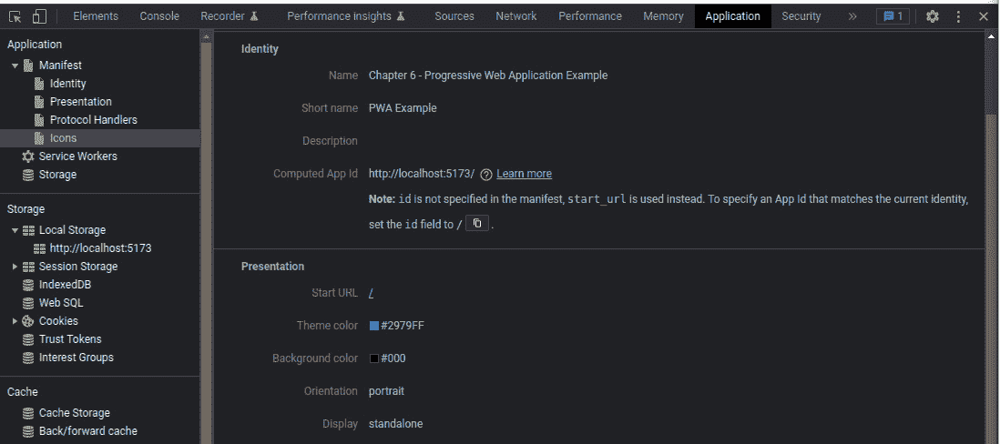
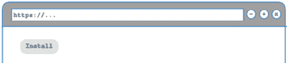
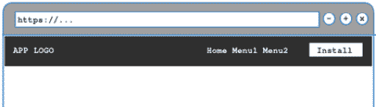
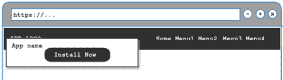
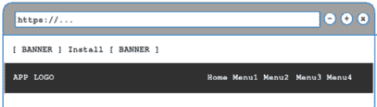
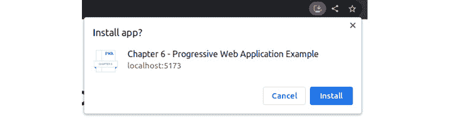
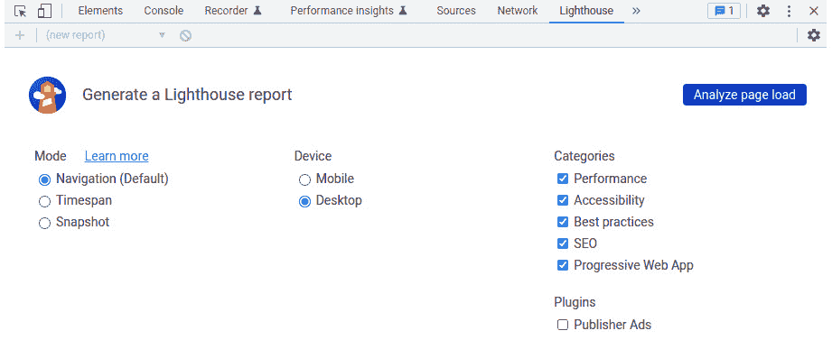
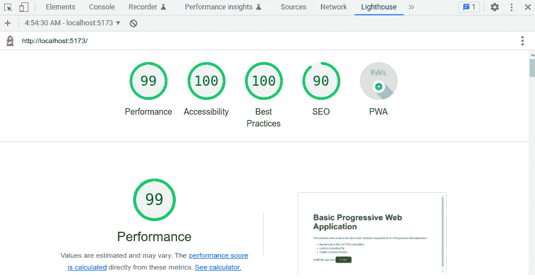

# 6

# 渐进式网络应用程序

在本章中，我们将看到网络应用程序的下一个进化步骤：**渐进式网络应用程序**（**PWAs**）。这个术语可能看起来描述不够充分，但它指的是一组技术，这些技术创造了通用概念，可以逐步或部分实现。其背后的基本思想是将网络应用程序从浏览器环境中解放出来，在任何类型的设备上实现，尽可能像原生应用程序一样行动和表现。这是通过在浏览器引擎中实现新的 API 以及桌面和移动设备上最流行的操作系统的集成来实现的。PWA 的起点当然是**单页应用程序**（**SPA**）。

到本章结束时，我们将学习以下内容：

+   什么是使 SPA 成为 PWA 的因素，以及涉及哪些技术

+   如何手动实现响应式 SPA、清单文件、服务工作者、离线存储等

+   什么是 *服务* *工作者*

+   如何使用 Vite 插件自动化创建 PWAs

+   如何使用 *Google Lighthouse* 测试应用程序的准备工作

从前面的列表中，我们将专注于学习几种技术的脚手架，为以后使用它们打下基础，这些内容在*第七章* *数据流管理*和*第八章* *使用 Web Workers 的多线程*中详细实现。到这些章节结束时，您将了解如何创建充分利用当今计算能力的 PWAs，使它们响应、可靠且性能良好。

# 技术要求

为了跟随本章内容，您需要查看存储库中的代码示例，该存储库位于[`github.com/PacktPublishing/Vue.js-3-Design-Patterns-and-Best-Practices/tree/main/Chapter06`](https://github.com/PacktPublishing/Vue.js-3-Design-Patterns-and-Best-Practices/tree/main/Chapter06)。本节中的文本代码示例可能不足以创建一个可工作的示例，除非您从存储库中添加额外的代码。

查看以下视频以查看代码的实际应用：[`packt.link/SBZys`](https://packt.link/SBZys)

# PWAs 或可安装的 SPA

PWA 不是一个单一的设置或技术，而是对网络应用程序的系统增强，以符合某些条件，无论是**多页应用程序**（**MPA**）还是 SPA。然而，当这些技术应用于 SPA 时，它们真正闪耀并变得生动，为我们提供了融合在线/离线和桌面或网络之间界限的强大应用程序。这里使用的**渐进式**一词与我们之前在 Vue 框架中讨论的含义相同——对网络技术的增量应用。

浏览器和操作系统对 PWA 有某种特殊处理。它们可以与原生或桌面应用程序一起安装，并管理网络通信（发送、接收、缓存文件，甚至从服务器推送通知）。在此阶段，重要的是要注意，我们不再仅仅指的是桌面计算机，还包括移动设备，如平板电脑和手机，以及不同的操作系统。正因为这种多平台方法，如果目的是覆盖不同设备上的用户基础，就需要特别注意，例如使用特殊的和专用的 CSS 规则来适应不同大小的 UI（所谓的**响应式应用程序**），不同的图标和颜色，以与操作系统级别的本地用户自定义设置相融合（例如，浅色和深色模式）等。此外，PWA（就像 SPAs 一样）具有存储内容以供离线使用的功能，并且希望也能提供一些离线使用功能。为了实现所有这些，至少，一个 PWA 必须符合以下要求：

+   网络应用程序必须通过安全连接（HTTPS）提供服务。

+   应用程序必须提供一个清单文件。

+   它必须提供和安装一个服务工作者。

当所有这些条件都满足时，浏览器或操作系统可能会提示用户“安装”应用程序。如果用户接受，则使用清单文件来定制应用程序的外观，以匹配本地操作系统（图标、名称、颜色等），并将在系统中所有其他应用程序旁边显示。当运行时，它将在自己的窗口中打开（如果选择这样做），位于网络浏览器之外，就像常规原生应用程序一样。内部，它仍然使用浏览器引擎通过 Web 技术运行，但目的是让用户感觉这是透明的，提供两者的最佳之处。可能的情况是，用户可能一直在使用 PWA 而不是常规应用程序，而自己却不知道。这种方法的成功案例包括星巴克、Trivago 和 Tinder（[`medium.com/@addyosmani/a-tinder-progressive-web-app-performance-case-study-78919d98ece0`](https://medium.com/@addyosmani/a-tinder-progressive-web-app-performance-case-study-78919d98ece0)）。

这创造了大量优势，这些优势超过了创建一个适应不同安装场景的 Web 应用程序的复杂性：

+   使用单一代码库即可在多个设备（桌面、移动设备等）和操作系统（Windows、Linux、macOS、Android、iOS 等）上安装应用程序

+   支持从服务器推送通知、手动处理缓存、离线使用等功能

+   它们与本地操作系统集成

+   更新对用户来说是透明的，并且比传统应用程序（大部分情况下）要快得多

+   开发 PWA 的成本远低于针对每个平台的等效针对性独立应用

+   可以使用所有可用的 Web 技术、框架和库

+   可以被搜索引擎索引，其分发和安装不依赖于专有应用商店

+   它们是响应式的、安全的和快速的，并且只需一个链接就可以分享

+   您可以使用标准 Web API 访问本地设备，例如本地文件系统和 USB 设备，使用硬件加速图形等

+   一些专有应用商店允许你重新打包你的 PWA 并将其作为常规应用分发（例如，微软商店、亚马逊商店、安卓商店等）

有更多优势，但这些可能已经足够让我们为它们辩护。此外，向我们的单页应用（SPA）添加必要元素以使其成为渐进式 Web 应用（PWA）更容易；这可能会让 PWA 看起来像是应用的银弹；然而，还有一些需要注意的注意事项和缺点：

+   PWA 的性能良好，但在某些特定场景中始终会落后于原生应用。在较旧的硬件上也可能发生这种情况——它们可以运行，但性能可能会受到影响。

+   苹果设备在采用某些 Web 技术或有意限制 PWA 方面稍微落后（例如，服务器推送通知）。

+   需要投入更多精力来覆盖多设备上的不同用户体验场景（但略多于普通响应式 Web 应用）。

+   一些应用商店不允许 PWA（特别是在撰写本文时，苹果应用商店）。此外，应用将无法从应用商店的曝光和*流量*中受益。

总体而言，优势远大于劣势。随着 Web 技术的不断发展，PWA 从中受益更多，变得更加普遍。现在，让我们更好地理解 PWA 是什么以及它能做什么，将我们的 SPA 升级为 PWA。

# 将 SPA 升级为 PWA

之前提到的第一个要求是在安全连接上提供服务。我们将在*第十章*“部署您的应用”中看到如何通过在我们的服务器上安装免费的 SSL 证书来实现这一点，使用**Let’s Encrypt**，在*第十章*，*部署您的应用*。考虑到这一点，让我们看看如何满足其他要求。

## 清单文件

添加清单文件是将我们的应用程序转变为 PWA 的起点。这不仅仅是一个包含已知字段的 JSON 文件，它指导浏览器或操作系统如何将应用程序安装在桌面或移动设备上。此文件必须出现在我们的`index.html`文件的`head`部分中，尽管它可以任意命名，但惯例是使用名称`manifest.json`或`app.webmanifest`。官方规范建议使用`.webmanifest`扩展名，但同时也明确指出，只要文件正确接收，名称实际上并不重要，为了简便起见，这里使用`manifest.json`：

```js
<link rel="manifest" href="/manifest.json">
```

从前面的代码中可以看出，文件放置在我们的应用程序的根目录中，并且`rel`属性必须是`manifest`。我们清单文件中的字段属性可以以任何顺序出现，并且根据上述规范，所有这些都被认为是*可选的*。然而，一些平台确实期望一组最小属性，我们将它们视为*必需的*。常见的做法还要求其他属性，我们将它们分类为*推荐项*，最后，规范中的一些属性在应用商店、社交媒体等地方经常被用来展示或描述应用程序，因此我们将这些称为*描述性字段*。这种分类不是规范的一部分，但有助于指导你的实现。以下是最常见和有用的属性列表：

| 分类 | 属性 |
| --- | --- |
| 必需项 |
| `short_name` | 当没有足够空间显示应用程序的全名时使用的简称。在移动设备上，它通常用于图标名称。 |
| `name` | 应用程序的全名。 |

| `icons` | 一个对象数组，每个对象代表一个在不同上下文中使用的独立图标。每个对象至少有两个属性：

+   `src`: 图片的路径

+   `sizes`: 包含图像尺寸的字符串

|

| `start_url` | 应用程序应启动的 URL，由开发者设置。 |
| --- | --- |

| `display` | 表示应用程序如何呈现的字符串：

+   `fullscreen`: 全屏显示，但显示浏览器 UI。

+   `standalone`: 与`fullscreen`类似，但没有浏览器控制。在桌面设备上，窗口控制仍会显示。

+   `minimal-ui`: 与`standalone`类似，但具有基本导航以前进和后退、打印、分享等。

+   `browser`: 应用程序在默认浏览器中打开。

|

| 推荐项 |
| --- |
| `theme_color` | 表示应用程序的 CSS 颜色的字符串。操作系统将决定如何使用此值（通常，应用于窗口标题栏）。 |
| `background_color` | 表示应用程序启动时以及实际应用应用程序样式之前背景颜色的字符串。 |
| `orientation` | 主要用于移动设备，它定义了应用程序必须使用的方向——例如，`横向、纵向、任意`等。 |
| `lang` | 定义应用程序主要语言的字符串。 |
| 描述 |
| `shortcuts` | 这是一个对象数组，定义了与操作系统紧密集成的直接菜单选项。通常，这些出现在上下文菜单中，例如当用户右键单击应用程序图标时。每个快捷方式对象必须至少包含`name`和`URL`，并且可选地包含`description`和`icons`数组。 |
| `description` | 包含应用程序简短描述的字符串。 |

| `screenshots` | 一个对象数组，具有以下字段： |

+   `src`: 图片的 URL

+   `type`: 图片的 MIME 类型

+   `sizes`: 包含图片尺寸的字符串

|

表 6.1 – 清单字段

在实践中，我建议为每个 PWA 完成必要的和推荐的字段，而描述性字段则根据您应用程序的上下文按需使用。此外，研究您的目标平台以获取标准规范之外的额外支持字段。

按照前面的表格，以下是一个`manifest.json`文件的示例：

```js
{
    "short_name":"PWA Example",
    "name": "Chapter 6: Progressive Web Application Example",
    "start_url":"/",
    "display": "standalone",
    "theme_color":"#2979FF",
    "background_color":"#000",
    "orientation": "portrait"
}
```

如您所见，创建清单文件并不需要太多额外的工作，并且很容易添加到我们的 SPA 中。

## 测试您的清单

一旦您创建了清单文件并将其链接到您的`index.html`文件，您就可以使用浏览器中的开发者工具来检查它是否已正确加载。例如，当使用 Google Chrome 时，在**应用程序**菜单中，我们可以看到示例文件已被正确加载：



图 6.1 – Google Chrome 中的开发者工具，显示清单文件

然而，还有一个与应用程序安装相关的话题需要我们审查：用户何时以及如何知道该 Web 应用程序可以安装？这就是*安装提示*发挥作用的地方，我们将在下一节中看到。

## 安装提示

每个平台（移动或桌面）都有自己确定符合安装标准 PWA 可以安装的方法。这可能会在一段时间后触发一个通知，让用户接受安装，或者只提供一个用户界面来执行此操作。在移动设备上，已安装的 PWA 将被放置在主屏幕上，与其他原生应用程序并列，而在桌面上，它可能被放置在浏览器内和/或主菜单中。此外，在像 Android 这样的移动操作系统中，将自动创建一个带有主题和背景颜色以及清单中提供的应用程序图标的启动画面。无论 PWA 可以如何和何时安装，重要的是要知道，它只能通过用户的同意和主动操作来完成。在没有用户批准的情况下，我们不能从代码中自动触发安装。

基本安装流程如下：

1.  当平台检测到我们的应用程序可以安装时，它将在窗口对象中触发一个名为 `beforeinstallprompt` 的事件。我们可以缓存这个事件，以便稍后从我们的应用程序中触发提示。

1.  用户可以通过平台 UI 或通过我们提供的 PWA 方法（如按钮）启动安装。

1.  平台将提示用户接受或拒绝安装。

1.  如果用户接受，它将安装 PWA 并触发另一个名为 `appinstalled` 的事件。

这是一个相当简单的流程。然而，`beforeinstallprompt` 事件只会触发一次，所以如果用户拒绝安装，我们需要等待浏览器再次触发该事件。

现在我们已经了解了事情的工作原理，是时候看看代码中的实现了。假设在我们的 Vue 3 组件模板中，我们有以下元素：

```js
<p v-show="_install_ready && !_app_installed">
   Install this app
   <button @click="installPWA()">Install</button>
</p>
<p v-show="_app_installed">
   Progressive Web Application installed
</p>
```

如您所见，我们有两个段落将根据 `_install_ready` 和 `_app_installed` 这两个布尔值反应变量显示。第一个将在 PWA 准备安装时出现，并提供一个按钮通过 `installPWA()` 函数触发安装。第二个将在安装完成后显示。

我们在脚本部分中的代码也是相当直接的：

```js
import { onMounted, ref, onBeforeUnmount } from 'vue'
const
    _install_ready=ref(false),
    _install_prompt=ref(null),
    _app_installed=ref(false)
// Detect PWA installable
onMounted(()=>{
    window.addEventListener("beforeinstallprompt",savePrompt)
    window.addEventListener("appinstalled",handleAppInstalled)})
function savePrompt(event){
    event.preventDefault(); // Prevents mobile prompt
    // Save reference to the event, to activate it later
    _install_prompt.value=event;
    // Notify UI that the application can be installed
    _install_ready.value=true;
}
function installPWA(){
    // Trigger the installation prompt
    if(_install_prompt.value){
        _install_prompt.value.prompt()
    }
}
function handleAppInstalled(){
    _install_prompt.value=null;
    _app_installed.value=true;
}
```

在前面的代码中，当我们的组件被挂载到页面上时，我们注册了两个监听器，一个用于管理和缓存安装提示，另一个用于检测应用程序何时已安装。为了保持代码简单，一些部分已被省略，但完整的组件（包括样式）可以在 GitHub 仓库中找到。

尽管前面的例子相当简单，但有一些众所周知的模式可以促进或向最终用户介绍安装选项。它们都依赖于相同的逻辑，即捕获事件并在稍后显示触发元素。实现很简单，更多与设计有关，而不是编码模式，所以我们在这里只展示原型图：

+   简单的**安装**按钮（如我们的示例应用程序所示）：



图 6.2 – 简单安装按钮

+   菜单 **安装** 按钮一放置在主导航中：



图 6.3 – 主菜单安装按钮

+   一个叠加通知：



图 6.4 – 叠加通知

+   一个在顶部叠加的元素，例如安装横幅（在页眉之前或视口底部）：



图 6.5 – 安装提示横幅

一旦应用程序已安装，我们希望防止不断提示用户进行安装。在这种情况下，建议我们在 `localStorage`、cookie、`indexeDB` 上保存离线标志，或将我们应用程序的起始 URL 标记为特定位置。我们将在 *第七章* *数据流管理* 中看到离线持久存储选项。现在，是时候看看使我们的 SPA 成为真正的 PWA 的最后一项：服务工作者。

# 服务工作者

服务工作者是一个在单独的线程上运行的 JavaScript 脚本，作为应用程序的后台进程。它充当网络的代理，拦截所有调用，并根据预定的策略提供页面和数据。

我们可以有多个服务工作者，因为每个服务工作者都负责其作用域。作用域定义为服务工作者源文件所在的目录（URL 路径）。因此，放置在应用程序根目录的服务工作者将处理整个 SPA/PWA。

服务工作者无需用户干预即可安装，因此即使用户没有安装 PWA，也可以使用它们。它们有一个定义良好的生命周期（见 https://web.dev/service-worker-lifecycle/），为每个完成状态触发事件。首先，服务工作者需要先 *注册*，然后它变为 *激活*，最终我们也可以 *注销* 它。一旦服务工作者被激活，它将不会控制应用通信，直到下次访问网站。

编程服务工作者的最常见策略如下：

+   仅提供缓存

+   仅提供网络

+   尝试首先提供缓存，然后回退到网络

+   尝试首先提供网络，然后回退到缓存

+   首先提供缓存，然后更新缓存

在考虑缓存和离线策略时，我们需要考虑我们的应用程序运行所需的哪些文件和资产将几乎不会改变，以便进行缓存。我们还需要确定永远不会被缓存的路径。

要使用服务工作者，我们在 `main.js` 文件中通过以下行进行注册：

```js
if(navigator.serviceWorker){
   navigator.serviceWorker.register("/service_worker.js")
}
```

在这些行中，我们首先测试当前浏览器是否有使用服务工作者的能力，如果有，我们就注册它。正如我们所见，我们将工作者放置在根目录。对于这个例子，我们将手动对所有网络调用使用缓存优先、网络回退策略：

```js
// Set strategy, cache first, then network
const CACHE_NAME="MyCache"
self.addEventListener("fetch", event=>{
    // Intercepts the event to respond
    event.respondWith((async ()=>{
    // Try to find the request in the cache
    const found=await caches.match(event.request);
    if(found){
        return found;
    }else{
        // Not cached fount, fall back to the network
        const response=await fetch(event.request);
        // Open the cache
        const cache=await caches.open(CACHE_NAME);
        // Place the network response in the cache
        cache.put(event.request, response.clone());
        // Return the response
        return response;
    }
  })())
})
```

之前的代码几乎完全基于在[`developer.mozilla.org/en-US/docs/Web/Progressive_web_apps/Offline_Service_workers`](https://developer.mozilla.org/en-US/docs/Web/Progressive_web_apps/Offline_Service_workers)提供的**Mozilla 开发者网络**文档中的示例。代码中的注释将帮助您理解实现策略的逻辑。然而，如果不说得太多，使用服务工作者可用的基本 API 可能会很繁琐。相反，使用框架或库来处理它们并实现更复杂的策略会更方便。今天的标准是使用由**Google**（https://developer.chrome.com/docs/workbox/）制作的**Workbox**。我们不会直接使用它，而是通过下一节将要看到的 Vite 插件来使用它。

到目前为止，我们看到的所有代码，我们的 PWA 已经准备好工作并安装。如果我们运行示例应用程序在开发服务器上，我们会注意到它可以安装。使用浏览器 UI 或我们的**安装**按钮，我们将收到以下提示：



图 6.6 – 本地主机上的 PWA 安装提示

将我们的 SPA 手动调整为 PWA 并不复杂，但这确实需要一些手动工作。然而，有了我们选择的工具，我们可以做得更好。有一种更简单的方法可以直接将清单文件和服务工作者作为工作流程的一部分生成并注入我们的 SPA：使用 Vite 插件。

# Vite-PWA 插件

在 Vite 插件生态系统中，有一个出色的零配置 Vite-PWA 插件([`vite-pwa-org.netlify.app/`](https://vite-pwa-org.netlify.app/))。开箱即用，它为我们提供了许多功能，而无需太多手动工作。我们使用以下终端命令将插件作为开发依赖项安装：

```js
$ npm install –-save-dev vite-plugin-pwa
```

一旦安装，我们必须在 Vite 配置中注册它。修改`vite.config.js`文件以匹配以下内容：

```js
import { defineConfig } from 'vite'
import vue from '@vitejs/plugin-vue'
import { VitePWA } from 'vite-plugin-pwa'
export default defineConfig({
plugins: [
vue(),
VitePWA({
    registerType: "autoUpdate",
    injectRegister: 'auto',
    devOptions: { enabled:true },
    workbox: {
        globPatterns: ['**/*.{js,css,html,ico,png,svg}']
    },
    includeAssets:
              ['fonts/*.ttf','images/*.png','css/*.css'],
    manifest: {
        "short_name": "PWA Example",
        "name": "Chapter 6 - Progressive Web Application Example",
        "start_url": "/",
        "display": "standalone",
        "theme_color": "#333333",
        "background_color": "#000000",
        "orientation": "portrait",
        "icons": [
           {
            "src": "/images/chapter_6_icon_192x192.png",
            "sizes": "192x192",
            "type": "image/png"
           },
           {
            "src": "/images/chapter_6_icon.png",
            "sizes": "512x512",
            "type": "image/png"
           },
           {
            "src": "/images/chapter_6_icon.png",
            "sizes": "512x512",
            "type": "image/png",
            "purpose":"maskable"
           }
         ],
         "prefer_related_applications": false
    }
  })]
})
```

使用此插件，我们将生成服务工作者和 Web 清单的负担卸载给打包器。这是必要的，因为随着每次生产构建，Vite 都会根据我们在上一章中讨论的按需加载组件的策略为每个脚本生成不同的文件名。

在前面的示例中，我们将一个包含一些合理选项的对象传递给 `VitePWA()` 插件，用于自动创建和注入我们的清单和工作者。如果我们需要更精细地控制创建的服务工作者策略以及网络清单，可以使用“注入模式”使用插件，并为我们提供服务工作者的基础文件。在这种情况下，脚本将注入构建过程中生成的文件。在底层，此插件使用 `workbox` 字段。深入探讨不同实现和策略的细节超出了本书的范围，但读者应查阅有关 **Vite-PWA** 插件和 **Workbox** 的文档，以了解特定上下文和使用案例。

# 使用 Google Lighthouse 测试您的 PWA 评分

基于 Chrome 的浏览器与开发者工具一起提供了一个名为 Lighthouse 的工具，专门用于测试和评分网页以及 PWA 的就绪状态。要访问此工具，在浏览器中打开您的应用程序后，请按照以下步骤操作：

1.  打开开发者工具（在 Windows/Linux 上按 *F12*，在 Mac 上按 *Fn* + *F12*，或通过浏览器菜单）。

1.  点击位于更右侧的 **Lighthouse** 菜单。

1.  选择 **移动** 或 **桌面**，并确保已勾选 **渐进式网络应用** 类别。

1.  在工具的右上角点击 **分析页面加载**。

开发者工具应该看起来像这样：



图 6.7 – Lighthouse 工具

工具将运行一系列测试，每个不同的类别都会显示一个评分，以及一个详细的项目列表，显示这些项目是已通过还是未通过。如果我们的应用程序不符合 PWA 的标准，标记为红色的项目将告诉我们原因以及如何修复它们：



图 6.8 – Lighthouse 中第六章代码示例的评分

我们的示例代码应用程序完全符合 PWA 的标准，并且所有测试都轻松通过。当然，对于较小的应用程序来说，这更容易实现。在实践中，任何超过 90 分的评分都是非常好的。

# 摘要

在本章中，我们从一个简单的单页面应用（SPA）开始，学习了如何手动以及通过 Vite 插件将其升级为渐进式网络应用（PWA）。用户可以在他们的平台上安装 PWA 并与它们交互，即使它们没有连接到互联网。PWA 相比纯网络应用提供了许多优势。我们还看到了如何使用 Lighthouse 在几个行业标准类别中衡量和评估我们的应用程序。随着本章的结束，我们使用网络技术构建应用程序的增量构建也随之结束，从此我们将专注于内部性能和效率的模式和模型。

# 复习问题

为了帮助您巩固本章学到的概念，请回答以下问题：

+   SPA 和 PWA 之间的区别是什么？

+   PWA 的优势是什么？

+   一个 Web 应用要被视为 PWA，必须遵守的基本三个要求是什么？

+   我们可以使用哪些工具来逐步准备我们的应用成为 PWA？

+   什么是服务工作者，以及有哪些策略可以使用它？

+   什么是 Web 清单，为什么它是必要的？
