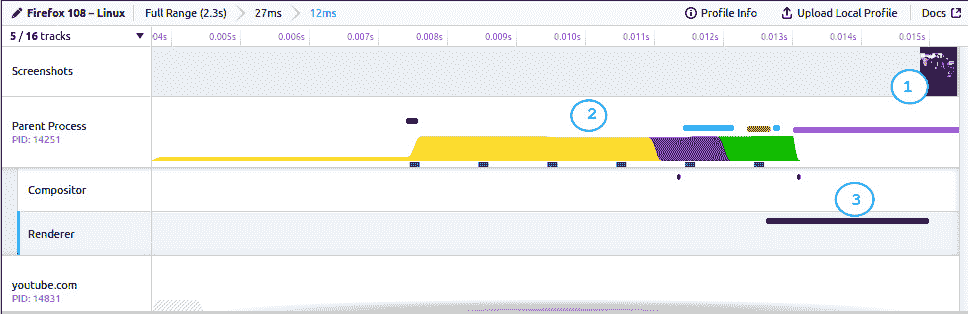
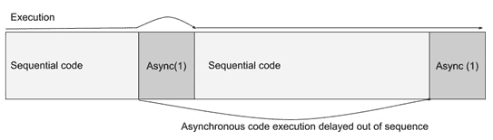
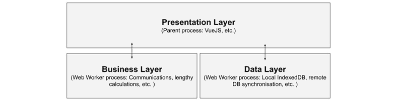
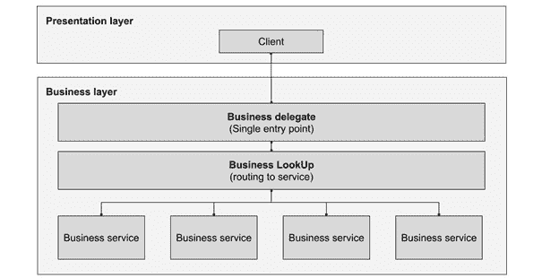
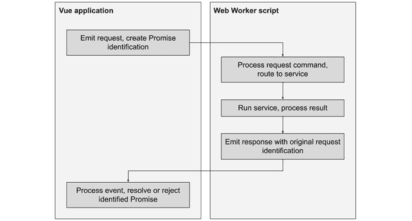

# 8

# 使用 Web Workers 进行多线程

在本章中，我们将涵盖一些重要主题，这些主题将极大地提高 Web 应用程序的性能，尤其是单页应用程序。首先，我们将学习网站和 JavaScript 是如何工作的，以及如何使用`web workers`来利用我们的应用程序处理能力、数据访问和网络通信。然后，我们将介绍两种新的概念设计模式，并将它们与我们在之前看到的其他模式一起在一个示例应用程序中实现。在此基础上，我们还将介绍两个库，它们将简化我们的网络通信以及在我们的 IndexedDB 中处理持久数据库。我们还将实现一个简单的 Node.js 服务器，以提供反馈并测试我们在高度解耦的架构中的工作，在这种架构中，我们的前端和后端服务通过 HTTP 协议使用标准 API 进行通信。

在本章中，我们将涵盖以下主题：

+   WebWorkers

+   商业和调度器模式

+   在`WebWorker`内部的网络通信

+   浏览器持久嵌入式数据库 – IndexedDB

+   如何构建简单的 Node.js API 服务器进行测试

本章中的概念可以被认为是“高级”的，但我们将把它们浓缩成可理解的片段，并立即实现。到本章结束时，你将拥有如何在 Web 应用程序中实现多线程的扎实知识，以及一个参考框架来扩展和简化复杂浏览器 API 的使用。

# 技术要求

本章不会对我们的应用程序增加额外的要求。然而，我们只会看到代码的相关部分，因此要查看整个应用程序的工作情况，你应该参考书中*第八章*，*使用 Web Workers 进行多线程*，在 GitHub 仓库[`github.com/PacktPublishing/Vue.js-3-Design-Patterns-and-Best-Practices/tree/main/Chapter08`](https://github.com/PacktPublishing/Vue.js-3-Design-Patterns-and-Best-Practices/tree/main/Chapter08)中的代码示例。

查看以下视频以查看代码的实际应用：[`packt.link/D4EHt`](https://packt.link/D4EHt)

# Web Workers 简介

JavaScript 是一种单线程语言，这意味着它本身没有在单独的线程中生成进程的方法。这使得网络浏览器在网页上运行 JavaScript 时，与其他进程在同一个线程上运行，这直接影响了页面的性能，尤其是渲染过程，它负责在屏幕上呈现页面。浏览器会付出相当大的努力来优化所有这些移动部件的性能，以使页面响应、性能良好、快速且高效。然而，有一些任务网络应用程序必须在 JavaScript 中执行，这些任务很重，并且可能“阻塞渲染”。这意味着浏览器必须关注代码的结果，并使用所有资源来完成正在运行的函数，然后才能专注于渲染（将页面呈现到屏幕上）。如果你在开始操作后（在某些情况下，你的鼠标甚至可能冻结）发现网页上的某个进程使网站看起来“无响应”或“卡顿”，这可能是其中的一个原因。

如果我们在现代浏览器中打开开发者工具，我们可以访问一些性能工具来分析网页的行为以及每个进程步骤花费多少时间。例如，这里是对共享链接中 Firefox for Linux 上 YouTube 首次加载的快速查看：



图 8.1 – 使用开发者工具看到的 YouTube 首次加载的性能

上一张截图已经放大到页面的实际处理过程，显示了在第一次渲染之前发生的事情，也就是说，在用户实际上可以在屏幕上看到某样东西之前。这体现在第一行，**截图**，在这个案例中，第一个可见元素出现在时间轴的末尾（*#1*）。第二行显示了主要的**父进程**一直在忙于做什么，如果你注意看，第一个部分（*#2*）全部都是关于处理 JavaScript 的。**渲染器**进程，用黑色条带突出显示并显示（#3），甚至在 JavaScript 运行之前都无法开始。当它运行时，它会在屏幕上绘制页面，你就可以看到从 *#1* 出来的可见内容。这给出了浏览器在屏幕绘制（称为“帧”）之间每个周期所做工作的近似概念。浏览器试图尽可能多地产生每秒**帧数**（**fps**）。为了保持流畅的 60 fps，它需要在大约 16.67 毫秒或更短的时间内完成所有这些处理。最佳情况下，你的 JavaScript 进程应该在半数时间内解决，以保持用户的流畅体验。考虑到这一点，如果你的 JavaScript 耗时超过这个时间，会发生什么呢？很简单，渲染过程会被推迟，fps 会下降，用户可能会体验到卡顿，甚至可能发生用户界面**（UI**）冻结的情况。根据你的网络应用程序，这可能会成为一个重要的问题。

你可能会说，“等等，为什么我们不将重任务异步化？这不会解决我们的问题吗？” 答案是：可能和不一定。当你声明一个异步函数时，这只意味着执行将被推迟到顺序代码处理完成的时间点。很可能是将异步代码推到最后或顺序代码执行之后，但随后它将像往常一样顺序执行。如果在那时渲染过程发生，你可能会感觉到性能提升，但如果不是，如果异步函数执行时间更长（因为它将影响下一次渲染），你将面临同样的问题。如果我们把所有函数都改为异步，我们可能会得到与所有内容都是顺序执行相同的结果，加上异步调用的开销：



图 8.2 – 异步代码执行表示，在顺序代码执行之后移动（1）

那么，如果异步操作不能完全解决性能问题，我们该如何解决它？在所有可能的优化之外，你还应该考虑将一种技术放在替代方案列表的顶部：Web Workers API。

Web Workers 是执行在其自身进程（或线程，取决于实现方式）中的 JavaScript 脚本；因此，它们不会影响渲染发生的父进程。浏览器 API 提供了一个相对简单但有效的通信方式：消息系统。这些消息只能传递可序列化的数据。父进程和每个 Web Worker 在自己的环境和内存边界内操作，因此它们不能共享引用或函数，这就是为什么所有在它们之间传递的数据都必须是可序列化的，因为它们被复制到每个进程中。虽然这看起来可能像是一个缺点，但实际上，如果正确使用，它实际上是一个优点，正如我们很快就会看到的。这个架构的另一个缺点是，Web Workers 无法访问**文档对象模型**（**DOM**）或 Window 对象及其任何服务。然而，它们确实可以访问网络和 IndexedDB。这为你的前端应用程序的架构设计开辟了丰富的机会，因为你可以轻松地分离表示层和业务层。



图 8.3 – 使用 Web Workers 的 Vue 应用程序分层表示，包含后台进程

如前图所示，我们可以实例化多个 Web Worker 来表示我们应用程序中不同类型的层（**业务**、**数据**、**通信**等）。虽然 Web Worker 可以从父进程随意启动和终止，但这两个动作都是计算密集型的，因此建议一旦创建 Web Worker，就保持其在应用程序运行期间活跃，并在需要时访问。还建议不要过度使用这种资源，创建“太多”的 Web Worker，因为每个 Web Worker 都是一个不同的进程，拥有自己的资源预留。没有明确的定义来界定“太多”，因此建议谨慎行事。根据我的经验，当 Web Worker 的数量保持在个位数时，即使是低功耗设备也应该能够以出色的性能处理你的应用程序。与许多其他事物一样，好事可能做得太多，这也适用于 Web Worker。

现在我们已经了解了什么是 Web Worker 以及它们能为我们做什么，让我们来看看如何在纯 JavaScript 中实现它们，然后是如何使用 Vite 来实现。

## 实现 Web Worker

在纯 JavaScript 中创建 Web Worker 非常简单直接。`window.Worker`接收一个参数，即脚本文件的路径。例如，考虑到我们的 Web Worker 包含在`my_worker.js`文件中，我们可以这样创建它：

```js
if(window.Worker){
    let my_worker=new Worker("my_worker.js")
    ...
}
```

足够简单，如果构造函数存在于`window`对象中，那么我们只需直接访问构造函数来创建一个新的 worker。新创建的 worker 再次暴露了一个简单的 API：

+   `.postMessage(message)`: 这将消息发送到 Web Worker。它可以是被序列化的任何数据类型（基本数据类型、数组、对象等）。

+   `.onmessage(callback(event))`: 当 worker 向父进程发送消息时，将触发此事件。接收的事件有一个`.data`字段，其中包含 worker 传递的消息/数据。

+   `.onerror(callback(event))`: 当 worker 中发生错误时，将触发此事件，并且它将包含以下字段：

    +   `.filename`: 生成错误的脚本文件名。

    +   `.lineno`: 发生错误的行号。

    +   `.message`: 包含错误描述的字符串。

这个消息系统允许我们进行原本可能非常复杂的**进程间通信**（IPC）。由于实现了它，我们的代码应该看起来如下：

```js
let my_worker=new Worker("my_worker.js")
my_worker.onmessage=event=>{
    // process message here
    console.log(event.data)
}
my_worker.onerror=err=>{
    //process error here
}
my_worker.postMessage("Hello from parent process");
```

为了完成这个任务，我们现在需要实现`my_worker.js`脚本。对于这个例子，它可以像这样简单：

./my_worker.js

```js
self.onmesssage=event=>{
    console.log(event.data)
})
setTimeout(()=>{
    self.postMessage("Hello from the worker")
},3000)
```

我们的示例工作线程非常简单。它将接收到的数据打印到控制台，并在激活后 3 秒钟向父进程发送一条消息。请注意，我们正在使用 `self` 保留字。当在函数内部访问 API 时需要它，因为它引用的是工作线程本身。这就是为什么它需要在 `setTimeout` 回调内部使用。在根级别，它是可选的，因此你可以像我们的示例中那样写 `self.onmessage`，或者直接写 `onmessage`。

Web Workers 可以通过 `self.importScript()` 方法或直接使用 `importScript()` 来实例化其他工作线程并导入其他脚本。此方法接收一个包含脚本文件名的字符串作为参数。这与我们在主应用程序中的服务和组件中使用 `import` 语句的方式类似。

当使用 Vite 时，正如我们用来打包 Vue 应用程序那样，我们可以通过使用后缀来提供一种替代方法来导入和创建一个工作线程。例如，在我们的 `main.js` 脚本中添加以下内容：

./main.js

```js
import MyWorker from "my_worker.js?worker"
const _myWorker=new MyWorker()
_myWorker.postMessage("Hi there!")
_myWorker.onmessage=(event)=>{...}
```

当使用 `worker` 后缀表示法时，Vite 会将实现包装在一个构造函数中，我们可以使用它来实例化我们的工作线程。这种方式使得处理工作线程更类似于使用我们应用程序中的任何其他类，因为我们可以使用相同的方法将其包含在我们的应用程序中，这就是我们将在示例中使用的语法。此外，Vite 将处理我们工作线程中的脚本，因此我们可以使用更熟悉的语法来导入资源（`import ... from ...`），而不是使用原生的 `self.importScript()`。

关于 Web Workers 有更多内容需要学习。就我们的目的而言，这已经足够，我们将使用这些内容。如果您想了解更多信息，请参阅 Mozilla 开发者网络上的文档（[`developer.mozilla.org/en-US/docs/Web/API/Web_Workers_API/Using_web_workers`](https://developer.mozilla.org/en-US/docs/Web/API/Web_Workers_API/Using_web_workers)）。

通过这些构建块，我们现在可以通过应用设计模式来实现一个健壮且易于处理的对我们的 Web Workers 的连接。在我们这样做之前，我们需要从概念上学习两个更多的模式：业务代理模式和调度器模式。

# 业务代理模式

此模式通过提供一个具有良好定义和简单（更）接口的单一点访问，用于隐藏从客户端或表示层访问业务服务或业务层的复杂性。它可以在一定程度上被视为我们在 *第二章**，软件设计原则和模式* 中看到的代理和装饰器模式的变体或演变，但应用于更大逻辑尺度的架构层之间。它通常涉及以下至少实体：

+   一个 **业务代理** 实体，作为客户端进入所有可用服务的单一入口点

+   一个 **业务查找或路由器** 实体，其功能是将传入请求的执行路由到适当的服务

+   提供公共接口（直接或通过代理模式）的**业务服务**

为了我们的目的，这个模式可以用以下图表来表示：



图 8.4 – 业务代理模式的表示

这种模式可以应用于多个架构级别。在我们特定的案例中，我们希望将这种设计应用于我们的 Web Workers 应用程序。我们将把父进程视为我们的表示层，把 Web Worker 视为我们的业务层。在父进程（或主进程）中，我们将拥有我们的 Vue 应用程序，一如既往地主要关注提供卓越的用户体验。然后，工作者将负责为我们提供访问服务，无论是本地的（如 IndexedDB 的情况），还是远程的，封装与我们的服务器和附加服务以及任何额外的计算密集型函数的通信。这种关注点的分离具有许多优点，不仅从性能角度来看，而且从整个应用程序的设计和实现来看。

在我们实现本章的代码之前，我们需要看到另一个我们将要实现的模式，因为我们只能在进程间传递可序列化的数据，而不能像纯业务代理模式所建议的那样执行函数调用。我们将扩展命令模式的想法，并使用所谓的分发器模式。

# 分发器模式

我们之前已经看到，无论是我们的父进程还是 Web Worker 进程都可以通过向对方发送消息来启动通信。只要定义了适当的监听器（`onmessage`），任何一个都可以接收并响应这些事件。在分发器模式中，这些消息包含与事件相关的信息，例如数据。区分这种设计模式的关键因素是*事件消息必须在线程间发布，并在到达时进行调度*。当然，这种调度也可以包括某些任务或函数的“立即执行”。

这个模式的实现相当简单，你可能认为它类似于我们在*第二章*“软件设计原则与模式”中看到的命令模式，因此我们不会再看到这个模式。相反，我们将利用线程间通信、调度和与数据相关的事件这些概念来创建我们与 Web Workers 协同工作的解决方案。

# 建立与 Web Worker 的通信管道

我们现在已经看到了我们想要应用于我们的 Vue 应用程序 Web Workers 通信实现的关键概念。这个模型可以在应用程序之间重复使用，并根据需要改进。作为一个一般行动计划，这是我们将会使用迄今为止看到的模式来构建的：

+   我们将在 Vue 应用程序中创建一个网络工作器，遵循业务代表模式，以实现单一点访问。

+   每条消息都会引发一个事件，用于处理（父-工作器或工作器-父）并包含命令和有效负载数据，以及调度信息，如调度器模式中所述。

如此简单，前面描述的架构使我们能够建立如这里所示的工作流程：



图 8.5 – 与网络工作器的通信工作流程实现

现在我们已经有了理论基础和广泛的了解，我们将要创建的内容，是时候进入代码编写阶段了。我们将关注实现之前提到的模型的代码中最相关的部分。要查看整个应用程序代码，请查看 GitHub 仓库中的完整源代码。让我们首先创建一个服务，它将成为客户端应用程序的入口点：

./services/WebWorker.js

```js
import WebWorker from "../webworker/index.js?worker"
const _worker = new WebWorker()                               //1
const service = {
    queue:{},                                                 //2
    request(command, payload = {}) {                          //3
        return new Promise((resolve, reject) => {             //4
        let message = {
            id: crypto.randomUUID(),
            command,
            payload
        }
        service.queue[message.id]={resolve, reject}           //5
        _worker.postMessage(message);                         //6
        })
    },
    processMessage(data) {
        let id=data.id
        if(data.success){
            service.queue[id].resolve(data.payload)           //7
        }else{
            service.queue[id].reject(data.payload)
        }
        delete service.queue[id];                             //8
    }
}
_worker.onmessage = (event) => {
    service.processMessage(event.data);                      //9
}
export default service;                                      //10
```

这种实现简单而有效。它很好地帮助我们理解这些模式是如何工作的。我们首先使用 Vite 的特殊后缀 `worker` 导入网络工作器构造函数，然后在第 *//1* 行创建实例引用。像往常一样，这个服务将是一个单例，所以我们将其创建为一个 JavaScript 对象，我们将在第 *//10* 行将其导出。该服务只有三个成员：

+   `queue`：在第 *//2* 行定义，是一个我们将使用它来存储对网络工作器预定调用的字典，使用唯一标识符。每个条目将保存承诺（`resolve` 和 `reject`）的解析方法的引用。

+   `request()` 方法：在这里的第 //3 行定义，将由其他服务和组件（“客户端”）用来从网络工作器请求任务。它总是返回一个承诺（第 //4 行）。传递给网络工作器的消息封装了作为参数接收的 `command` 和 `payload` 以及一个唯一的标识符。我们在 `queue` 中保存 `resolve()` 和 `reject()` 方法的引用（第 //5 行），最后，使用网络工作器的原生消息方法，在第 //6 行发布消息。

+   `processMessage()` 方法：这个方法接收网络工作器提交的数据，根据标识符和 `.success` 属性（布尔值）中传递的操作结果，我们访问 `queue` 并使用 `resolve()` 或 `reject()` 函数来解析或拒绝承诺（第 //7 行）。最后，我们在第 //8 行从 `queue` 中移除引用。

在此文件的最后一步是将传入的消息直接从工作器链接到第 9 行的`service.processMessage()`。到现在为止，可能已经很清楚，我们已经就消息的结构和回复做出了一些决定。消息有三个组成部分：`id`、`command`和`payload`。回复也有三个元素：`id`、`success`和`payload`。在客户端，我们选择使用承诺来操作，因为它们不会“超时”。

客户端解决后，现在是我们开始工作在网页工作器脚本的时候了。在`webworker`目录中创建以下`index.js`文件：

./webworker/index.js

```js
import testService from "./services/test"
const services=[testService]                                //1
function sendRequest(id, success=false, payload={}){
    self.postMessage({id, success, payload})                //2
}
self.onmessage=(event)=>{                                   //3
    const data=event.data;
    services.forEach(service=>{                             //4
        if(service[data.command]){                          //5
        servicedata.command                 //6
                .then(result=>{
                    sendRequest(data.id, true, result)      //7
                }, err=>{
                    sendRequest(data.id, false, err)
            })
        }
    })
}
```

网页工作器甚至更短，我们还在每个底层服务实现的接口上做出了一些决定：它们的方法必须返回一个承诺。让我们看看代码，找出原因。

我们从第 1 行开始，导入`testService`（我们稍后会创建它），并将其包含在一个服务数组中。这将使得通过导入并仅将它们包含在这个数组中来添加新服务变得更容易（这可能是通向插件架构的垫脚石，但现在我们将保持简单）。然后我们定义一个全局的`sendRequest()`函数，它将向父进程发送一个带有三个字段：`id`、`success`和`payload`的编码消息，正如客户端在定义中所期望的那样。这就是第 2 行发生的事情。

在第 3 行，我们定义了`onmessage`事件处理器来处理传入的消息。当收到一个消息时，我们遍历我们的`services`数组以找到匹配的命令（第 4 行），当我们找到时（第 5 行），我们通过 JSON 实用程序解析它后，将有效载荷作为参数传递给函数执行（第 6 行）。然后，通过承诺的解决或拒绝，我们在第 7 行将适当的结果传输给客户端。这段简短的代码充当了*业务委托和调度器*。最后，让我们看看`testService`是如何工作的：

./webworker/services/test.js

```js
const service={
   test(){
      return new Promise((resolve, reject)=>{
         setTimeout(()=>{
            resolve("Worker alive and working!")
         }, 3000)
      })
   }
}
export default service;
```

如你所见，这个测试服务除了返回一个承诺并设置一个 3 秒后解决的定时器外，没有做太多其他的事情。这个延迟是人为的，因为否则回复将是立即的。如果你运行示例应用程序，当你点击**发送请求**按钮时，你将看到消息在 3 秒后从**等待...**变为**工作器活跃并工作！**，正如预期的那样：


图 8.6 – 测试应用程序向工作器发送命令并显示结果

为了实现这一点，在我们的`App.vue`组件中，我们导入我们的网页工作器服务，并使用命令字符串作为服务中要执行的函数的名称发送我们的请求。对于这个例子，添加以下代码：

```js
import webWorker from "./services/WebWorker.js"
webWorker.request("test").then(data=>{...}, err=>{...})
```

这些简单的代码行用于创建和管理 Web Worker，为您的应用程序提供了相当大的计算能力和性能提升。现在我们的基础已经打好，是时候用我们的服务 Worker 做些更有意义的事情了。让我们让它访问我们的本地数据库和网络。

# 在 Web Worker 中使用 DexieJS 访问 IndexedDB

IndexedDB 是一个非常强大的键值数据库；然而，其原生实现提供的 API 相当难以处理。实际建议是不要直接使用它，而是通过框架或库来与之交互。数据库引擎速度快且非常灵活，因此许多库在其基础上构建，并重新创建了原本不存在的功能和特性。一些库甚至模仿 SQL 和基于文档的数据库。以下是一些可用且免费使用的库：

+   **DexieJS** ([`dexie.org/`](https://dexie.org/))：一个非常快且文档齐全的库，实现了基于 NoSQL 的文档数据库。

+   **PouchDB** ([`pouchdb.com/`](https://pouchdb.com/))：一个模仿 Apache CouchDB 功能的数据库，并提供与远程服务器的内置同步。

+   **RxDB** ([`rxdb.info/`](https://rxdb.info/))：这是一个实现了响应式模型的数据库。它还支持与 CouchDB 的复制。

+   **IDB** ([`www.npmjs.com/package/idb`](https://www.npmjs.com/package/idb))：这是在 IndexedDB API 之上实现的一个轻量级包装实现，进行了一些改进以提高其可用性。

根据您对本地存储的要求，这些或其他选项将非常适合您。我们将使用 DexieJS 作为此示例，因为它有很好的文档记录，并且在批量操作方面速度惊人。我们将扩展我们之前的示例，创建一个单组件迷你应用程序来存储、检索、删除和查看笔记。这涵盖了非常基础的**创建、读取、更新和删除**（**CRUD**）操作。当您运行示例代码时，它看起来可能像这样：


图 8.7 – 单组件 CRUD 示例

在此示例中，您可以创建新的笔记，查看之前保存的内容（这将基于域名持久化），选择它们以查看文本，还可以删除它们。所有操作都将由 Web Worker 解决。让我们使用`npm`将 Dexie 包含到我们的应用程序中：

```js
$ npm install dexie
```

接下来，让我们创建我们的示例组件应用程序：

/src/components/DbNotes.vue

```js
<script setup>
import webWorker from "../services/WebWorker"                 //1
import { ref } from "vue"
const _notes=ref([]),_note=ref({}),_selected=ref({})          //2
loadNotes()
function saveNote(){                                          //3
   if(_note.value.title && _note.value.text){
      webWorker
         .request("addNote", JSON.stringify(_note.value))
         .then(id=>{loadNotes()},err=>{...})
         .finally(()=>{_note.value={}})
   }
}
function deleteNote(id){                                      //4
   WebWorker
      .request("deleteNote", {id})
      .finally(()=>{loadNotes()})
}
function openNote(note){_selected.value=note;}                //5
function loadNotes(){                                         //6
   webWorker
      .request("getNotes",[])
      .then(data=>{_notes.value=data;},
            ()=>{_notes.value=]})
}
</script>
<template>
<div>
   <section>
      <h3>New note</h3>
      <input type="text"
            v-model="_note.title"
            placeholder="Title">
      <textarea v-model="_note.text"
            placeholder="Note text..."></textarea>
      <button @click="saveNote()">Save</button>
   </section>
   <section>
      <h3>Notes</h3>
      <div v-for="n in _notes" :key="n.id">
         <a @click="openNote(n)">{{ n.title }}</a>
         <a @click="deleteNote(n.id)">[X]</a>
      </div>
   </section>
   <section>
      <h3>Selected note</h3>
      <strong>{{ _selected.title }}</strong>
      <p>{{ _selected.text }}</p>
   </section>
</div>
</template>
```

前面的文件已经去除了样式和其他布局元素，这样我们就可以专注于实现我们所学习操作的代码的活跃部分。我们首先在第*//1*行导入我们的服务类以处理 web worker，并在第*//2*行创建一些内部反应性变量。我们将使用`_notes`来保存从数据库中提取的完整笔记列表，`_note`作为创建新笔记的占位符，以及`_selected`来显示从列表中点击的笔记。你可以在每个函数（第*//3*到*//6*行）中找到 CRUD 操作，并且你会注意到除了处理 UI 反应性元素之外，它们非常相似。它们只是收集创建对 web worker 请求所需的信息，然后应用结果。然而，请注意，在`saveNote()`函数中，当需要传递描述我们新笔记的对象时，我们正在将 Vue 反应值序列化。这是因为 Vue 用于处理反应性的代理实现不可序列化，除非我们创建一个纯对象的副本或应用其他类似技术来提取值，否则 web worker 通信将失败并抛出错误。确保数据对象作为可克隆对象提供的简单方法是将其转换为字符串，如我们的代码中所示使用`JSON.stringify(_note.value)`（你也可以直接创建一个克隆，使用`JSON.parse(JSON.stringify(_note.value))`）。你需要记住信息将如何发送，以便在 web worker 接收端得到适当的处理。现在当我们看到`dbService.js`在 worker 中时，这一点将变得明显：

./src/webworker/services/dbService.js

```js
import Dexie from "dexie"
const db=new Dexie("Notes")                                 //1
db.version(1).stores({notes: "++id,title"});                //2
const service={
addNote(note={}){                                           //3
  return new Promise(async (resolve, reject)=>{
    try{
      let result_id=await db.notes.add(JSON.parse(note))    //4
      resolve({id:result_id})
    }catch(err){reject({})}
})},
getNotes(){
  return new Promise(async (resolve, reject)=>{
    try{
      let result=await db.notes.toArray();                  //5
      resolve(result)
    }catch{reject([])}
})},
deleteNote({id}){
  return new Promise(async (resolve, reject)=>{
    try{
      await db.notes.delete(id)                             //6
      resolve({})
    }catch{reject({})}
})}}
export default service;
```

要使用 Dexie，我们首先在第*//1*行导入构造函数，并创建一个名为`Notes`的新数据库。在我们实际使用它之前，我们需要定义版本和表格/集合的简单模式，包括将要索引的字段。这就是第*//2*行发生的事情，在那里我们定义了具有两个索引字段`id`和`title`的`notes`集合。这些索引字段以字符串形式传递，字段名以逗号分隔。我们还为`id`字段包含了一个双加号作为前缀。这使得该字段由数据库自动生成并随着每个新记录自动递增。

下一个重要的函数`addNote()`，将记录添加到`notes`集合中。由于我们在组件中通过将对象序列化为字符串传递数据，在第*//4*行，我们需要解析字符串以重新组合对象。

在`getNotes()`函数中，我们只是从集合中检索所有元素，并使用 Dexie 提供的`toArray()`方法将其转换为 JavaScript 数组（第*//5*行）。这样，我们可以直接将其作为我们的结果返回以解决承诺。

关于这段代码的最后一句话是关于 `deleteNote()` 方法的：在第 *//6* 行，我们没有捕获异步操作的结果。这是因为这个操作不返回可用的值。在这种情况下，这个操作总是会解析，除非数据库引擎错误中断执行。

重要的是要记住，Web Worker 上的错误不会影响父进程，并且该进程中的任何操作都不会受到影响。

现在我们已经设置了服务，是时候稍微修改一下 web worker 的索引文件了。添加以下行：

./src/webworker/index.js

```js
import dbService from "./services/dbService";
const services=[dbService, testService];
```

对于此文件，无需进行其他更改。正如我们所看到的，在 web worker 上实现 CRUD 操作并不需要太多。尽管这些可以在父进程中完成，并且会有轻微的进程间通信的代价，但性能上的好处是相当可观的，并且值得付出努力。特别是如果我们的应用程序包括应该作为后台进程的内容，比如与远程服务器的同步，这些应该由 web worker 完成。让我们看看接下来我们如何从 worker 访问网络并消费 **表示状态转换 API**（**RESTful API**）。

# 使用 Web Worker 消费 RESTful API

今天在 Web 开发中，网络 API 最常见的应用之一是通过实现 RESTful API。这是一个无状态的协议，每个通信都代表了在目的地所需操作的类型。Web 上使用的 HTTP 协议为这种类型的 API 提供了完美的匹配，因为每个网络调用都暴露了一个标识所需操作类型的方法：

+   `GET` 操作检索数据和文件

+   `PUT` 操作更新数据

+   `POST` 操作在服务器上创建新数据

+   `DELETE` 操作在服务器上擦除数据

很容易看出这些方法与 CRUD 操作相匹配，因此通过进行适当的网络调用，服务器就知道如何处理在正确端点接收到的数据。在端点之间发送的数据格式有许多标准。特别是其中最常见的一种是 JSON 格式，我们在 JavaScript 中非常方便地使用它。

在浏览器中使用原生实现处理异步调用，至少是繁琐的，但并非不可能。出于实用性和安全性的考虑，建议使用像 **Axios** 这样的知名库。要安装库，我们需要从终端运行以下命令：

```js
$ npm install axios
```

几分钟后，库将作为依赖项安装到我们的项目中。该库提供了非常方便的方法来为每个 HTTP 方法发起网络调用。例如，`axios.get` 发起 `GET` 请求，`axios.post` 发起 `POST` 请求，依此类推。

我们将为我们的学习练习实现一个简单的服务，以便在我们的 web worker 中从远程服务器进行网络调用。为了简单起见，我们只会创建两个方法：

./webworker/services/network.js

```js
import axios from "axios"
axios.defaults.baseURL="http://localhost:3000"
const service={
   GET(payload={}){
     return new Promise((resolve, reject)=>{
       axios
         .get(payload.url,{params:{data:payload.data}})
         .then(result=>{
             if(result.status>=200 && result.status<300){
                  resolve(result.data)
             }else{reject()}
         }).catch(()=>{reject()})
  })},
  POST(payload={}){
    return new Promise((resolve, reject)=>{
      axios
         .post(payload.url,{data:payload.data})
         .then(result=>{
           if(result.status>=200 && result.status<300){
                resolve(result.data)
           }else{reject()}})
         .catch(()=>{reject()})
})}}
export default service;
```

此服务相当简单。在生产应用中，它将是服务于其他服务的中间件。此示例仅实现了两种方法来匹配相应的 HTTP 请求方法。请注意，它们非常相似，只是更改了方法名称和一些参数的签名。第一个参数始终是连接的端点（URI）。第二个参数是数据或包含选项的对象。我建议您参考官方文档了解如何处理每个具体的请求和处理边缘情况（[`axios-http.com/docs/intro`](https://axios-http.com/docs/intro)）。

值得注意的是，在文件的开头，我们为所有其他网络调用设置了默认域名。这样，我们就可以避免在每个调用中重复设置。我们可以使用这个库轻松地设置特定的 HTTP 头和选项，例如**JSON Web Tokens**，用于身份验证，正如我们在*第五章*，“单页应用”，提到不同的身份验证方法时所述。

要将此服务包含在我们的 web worker 中，我们导入它并将其添加到我们之前使用的`services`数组中。修改此文件的开头，使其看起来像这样：

./webworker/index.js

```js
import netService from "./services/network"
const services=[dbService, netService, testService]
```

通过这个新添加的功能，我们的 web worker 现在已准备就绪。我们现在实现一个单独的组件来测试通信，它看起来像这样：


图 8.8 – 一个简单的测试，其中服务器返回发送的信息

我们的组件将允许我们选择 HTTP 请求的方法（`GET`或`POST`）并发送一些任意数据。测试服务器将仅将接收到的数据返回给客户端，组件将在屏幕上展示这些数据。实现相当直接：

./src/components/NetworkCommunication.vue

```js
<script setup>
import webWorker from "../services/WebWorker"
import { ref } from "vue"
const
    _data_to_send = ref(""),
    _data_received = ref(""),
    _method = ref("GET")
function sendData(){
    webWorker
        .request(_method.value,                              //1
            {url:"/api/test", data: _data_to_send.value})
        .then(reply=>{_data_received.value=reply},
        ()=>{_data_received.value="Error"
        })
}
</script>
<template>
    <div>
       <section>
           <h4>Text to send</h4>
           <div>
               <label>
                    <input
                        type="radio"
                        value="GET"
                        name="method"
                        v-model="_method">
                    <span>GET Method</span>
               </label>
               <label>
                    <input
                        type="radio"
                        value="POST"
                        name="method"
                        v-model="_method">
                    <span>POST Method</span>
               </label>
           </div>
               <input type="text" v-model="_data_to_send">
               <button @click="sendData()">Send</button>
       </section>
       <section>
           <h4>Data received from server</h4>
               {{ _data_received }}
       </section>
    </div>
</template>
```

在这个组件中，我们导入`webWorker`服务并声明三个响应式变量用于发送和接收数据，以及一个用于保存所选方法的请求。我们的简单测试服务器将接收请求并将我们提交的数据返回。我们将在后面看到如何使用 Node.js 创建这个简单服务器。

在模板中，用户可以选择要发送的请求类型（`GET`或`POST`），我们将这个选择保存在`_method`变量中。我们使用这个值作为传递给工作线程的命令（在行*//1*）。我们将数据作为成员对象作为有效载荷传递。当这个承诺解决时，我们将回复中的值保存到`_data_received`变量中。在此阶段，源代码的其他部分应该很容易理解，因为它主要涉及模板和信息在屏幕上的展示。在我们结束这一章之前，让我们看看如何使用 Node.js 实现测试服务器。

# 一个简单的 NodeJS 服务器用于测试

为了测试我们的网络通信，似乎使用 Node.js 实现端点以测试我们正在测试的内容是合适的。在我们的 Vue 应用程序的单独目录中，打开一个终端窗口并输入以下命令：

```js
$ npm init
```

命令行向导会问你一些问题来创建代表 Node.js 应用程序的`package.json`文件。完成后，运行以下命令来安装**Express.js**依赖项，这将为我们提供一个创建 Web 服务器的框架：

```js
$ npm install express cors
```

一旦过程完成，创建一个包含以下代码的`index.js`文件：

./server/index.js

```js
const express = require("express")                     //1
const cors=require("cors")                             //2
const app=express()                                    //3
const PORT=3000
app.use(cors())                                        //4
app.use(express.json())                                //5
app.get("/api/test", (req, res)=>{                     //6
    const data=req.query                               //7
    res.jsonp(data)                                    //8
})
app.post("/api/test", (req, res)=>{
    const data=req.body                                //9
    res.jsonp(data)
})
app.listen(PORT, ()=>{                                 //10
    console.log("Server listening on port " + PORT)
})
```

使用这几行代码，我们可以启动一个小型服务器，该服务器接收并响应 JSON 数据。我们导入 express 构造函数（第*//1*行），以及一个插件（第*//2*行）。这样做很重要，这样我们才能从任何域名（源）访问这个服务器。`GET`请求（第*//6*行）和另一个用于`POST`请求。第一个参数是服务器将监听调用的 URL。在这种情况下，它们是相同的，因为唯一的区别将是请求方法的类型。这是标准做法。

每个端点作为最后一个参数接收一个至少包含两个参数的回调函数：`req`（请求）和`res`（响应）。这些对象包含关于接收到的请求和创建对客户端响应所需的方法和信息。

对于`GET`请求，接收到的数据作为“查询字符串”附加到 URL 上，因此为了访问它，*Express*将其优雅地包装在`request.query`字段中的对象（第*//7*行）。由于我们只是回复接收到的相同数据，在第*//8*行，我们使用`res`(ponse)对象创建一个带有相同数据对象的填充 JSON 回复。我们这样做是因为我们认为我们可能会从任何域名（因为我们启用了 CORS）接收调用，并确保回复被完全理解。**带有填充的 JSON**（**JSONP**）是使用不同方法发送响应的方法。我们不需要担心这一点，因为两端（发送者和接收者）都由 Express 服务器和 Axios 客户端处理。

在`post`方法中，区别在于数据包含在消息体中（第*//9*行），因此有不同的处理方式。最后，服务器开始在指定的端口上监听（第*//10*行）。现在我们可以通过[`localhost:3000`](http://localhost:3000)访问服务器，这是我们配置在网络服务中作为 Axios 默认地址的地址。

通过实现这个服务器，我们现在可以对系统的所有部分进行全面测试。

# 摘要

在本章中，我们回顾了一些非常重要的概念，这些概念可以从根本上提高我们应用程序的架构和性能。网络工作者是一项惊人的技术，它允许网络应用程序利用现代硬件架构和现代操作系统。从固定点的角度来看，使用网络工作者进行多线程涉及很少的额外努力和复杂性，而且收益是高度可观的。我们还看到了如何利用工作者来访问网络服务以及浏览器提供的本地持久数据库（IndexedDB）。我们学习了两种更多设计模式来实现我们应用程序的可扩展架构，并通过简单的组件和服务测试了这些概念和实现。使用网络工作者在性能和执行方面为精心设计的网络应用程序带来了显著差异。在下一章中，我们将探讨工具和技术来自动测试我们的代码，确保各个部分符合其预期目的，以匹配我们的软件规范和需求。

# 复习问题

+   JavaScript 有哪些限制可能会损害网络应用程序的性能？

+   网络工作者是什么？它们的限制是什么？

+   Vue 应用程序如何与网络工作者通信？

+   使用像业务代表（Business Delegate）这样的设计模式与网络工作者（web workers）一起工作的好处是什么？

+   你可以在示例代码中做哪些更改来管理多个网络工作者而不是一个？在你看来，何时这样做是可取的？
