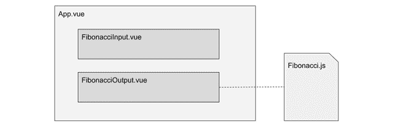
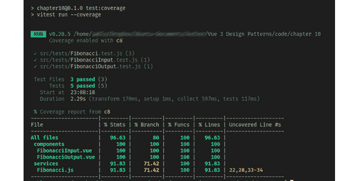
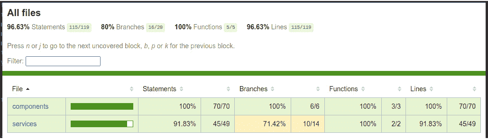
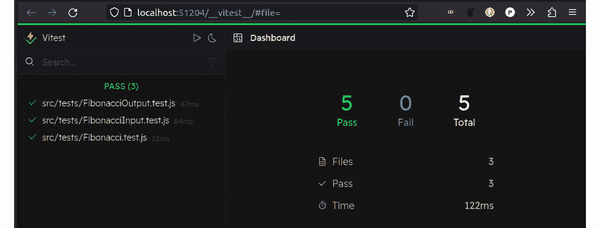
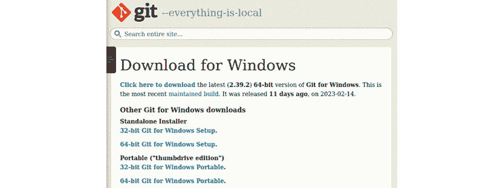
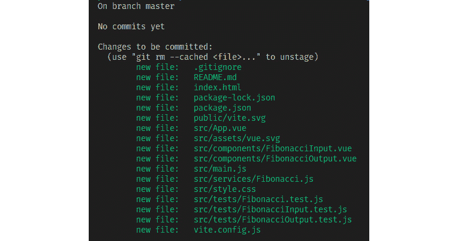
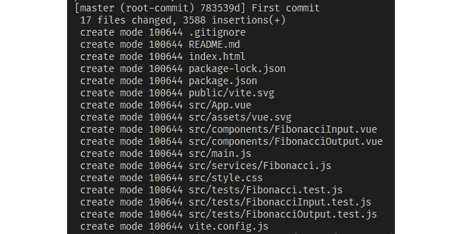
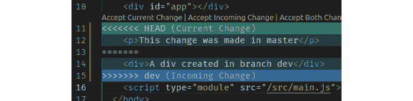

# 9

# 测试和源代码控制

我们应用程序的成功取决于许多因素，而不仅仅是代码组织或模式的品质。此外，软件的本质意味着在开发和之后都会有变化，包括需求、范围等方面的变化。随着每个功能的开发，软件中会引入一个复杂性项，形成关系和依赖。新的添加可能会破坏这些连接，引入破坏性变更、错误，甚至完全禁用系统。解决这个问题的方法是跟踪代码变更并在应用程序上进行测试，以识别问题并尽可能确保系统符合所需的软件属性并满足需求。

本章将涵盖以下内容：

+   测试的不同方法和**测试驱动开发（TDD）**的概念

+   为我们的项目安装测试套件（Vitest）和测试工具（Vue Test Utils）

+   在现有项目中创建和运行同步和异步代码的测试

+   通过模拟用户交互来测试我们的组件

+   使用 Git 和在线仓库（如 GitHub 或 GitLab）安装和管理我们的源代码

本章中的概念是介绍对开发者确保交付高质量软件的重要专业技能。通常，这些任务会被搁置或作为事后考虑。然而，缺乏这些任务可能会导致昂贵的错误和长时间的超负荷工作，随着软件复杂性的增长。对于涉及多个开发者的非平凡应用程序，如今几乎无法想象一个不使用这些工具的项目。

在本章中，我们将重点关注**单元测试**以及 Vue 团队提供的执行它的工具。

# 技术要求

本章没有对之前代码示例实现的要求的额外要求。最终源代码可以在本书的官方仓库[`github.com/PacktPublishing/Vue.js-3-Design-Patterns-and-Best-Practices/tree/main/Chapter09`](https://github.com/PacktPublishing/Vue.js-3-Design-Patterns-and-Best-Practices/tree/main/Chapter09)中找到。

查看以下视频，了解代码的实际应用：[`packt.link/UqRIi`](https://packt.link/UqRIi)

# 测试和 TDD 是什么

测试是验证软件是否按照项目需求执行其预期功能的过程。它涉及手动或自动执行工具来评估和测量软件的不同属性和特性，识别错误和缺陷，并为开发者提供反馈，以便采取行动进行纠正。有许多不同的测试方法和类型需要执行，如下所示：

+   **单元测试**：这是对源代码的相关单元进行一系列输入和输出的验证。这通常会被自动化。

+   **集成测试**：系统中的所有组件作为一个组一起验证，寻找在集成、通信等方面出现的错误和缺陷。

+   **端到端测试**：这涉及到对应用程序的完整验证，模拟真实世界的使用，与数据库、网络场景等交互。可以使用模拟人类交互的自动化工具，以及使用真实用户进行的手动测试。

这些类型的测试只是这个领域的一小部分，因为针对软件可能有数百种可能的测试。大型公司可能拥有专门的测试团队，以确保软件的质量。通常，软件越复杂，测试可能越复杂。在实践中，测试计划可能和开发计划一样复杂。正如引言中提到的，我们将专注于 Vue 团队为此任务提供的官方工具。

测试可以在开发之前、开发期间、开发之后或与开发并行进行。**TDD**是一种将测试负担尽可能提前到项目中的学科，甚至在实际编码开始之前，目标是匹配需求。它包括以下步骤：

1.  根据应用程序的需求和设计编写一个测试用例，包括关键输入和预期输出。

1.  运行测试，它应该失败（因为还没有编写代码）。

1.  编写要测试的实际代码（一个函数、Vue 组件等）。

1.  对创建的代码运行测试。如果测试失败，重构代码或设计。

1.  从一个新的测试用例开始，为下一个单元测试。

这个过程会重复进行，预计可以为开发者提供显著的“错误”和错误的减少，并帮助他们专注于需求。这个过程在项目早期就会产生一定的努力开销，与重构相比，测试是在项目后期进行的。

TDD（测试驱动开发）在一些团队和一些框架中已经变得流行，它被认为可以帮助开发者提高自己的代码质量，因为他们现在培养了一种“测试”的思维模式。然而，并没有具体的研究来证实这一点，但这个领域的实践者确实报告说，它改善了他们的代码和设计。这当然引发了一个问题：需要测试什么，我们如何将这项任务简化到我们的工作流程中？这正是我们接下来要讨论的主题。

# 要测试什么

一个良好的测试计划和实施成功的关键因素是决定测试什么。在考虑内部和外部因素时，不可能测试所有可能性的全集或项目中的 100%的组件和交互。即使尝试全面覆盖所有可能性也会极其昂贵且在实际上不可能实现。相反，我们需要关注在时间和预算限制内可以测试的真实可能性，通过仔细选择那些“成败”我们项目需求的非平凡元素。这通常不是一个容易的任务。

当涉及到 Vue 应用时，我们需要关注执行关键操作的关键服务和组件。我们需要测试以下内容：

+   **服务**：自包含的函数，包括同步和异步。不返回值但执行逻辑过程的函数将涉及不同于我们在这里看到的测试类型。这些将涉及模拟网络通信或数据库调用、应用程序策略等。然而，测试这些的原则是相似的。

+   **组件**：我们需要测试输入（属性）和输出（事件和 HTML）。将其他组件分组以执行工作流程或业务逻辑的高级组件也可以以相同的方式进行测试（属性、事件和渲染的 HTML）。然而，这些也需要其他类型的测试，例如端到端测试。

我们可以编写自己的函数和工具来执行测试，但除了某些边缘情况外，明显的建议是使用稳定的测试套件和工具。在我们的案例中，对于 Vue，有由同一团队提供的官方资源，称为**Vitest**和**Vue Test Utils**。使用测试套件/库有许多好处，类似于在“常规”应用开发中使用框架或库。可能其中一个主要好处与**DX**（开发者体验）有关，因为它们使开发过程更加流畅或更轻便。让我们通过一个示例应用来学习如何将这些工具应用到我们的工作流程中，我们将在下一节中介绍这个应用。

# 我们的基础示例应用

最好通过将测试应用到实际项目中通过实践来了解测试的学科并学习工具。作为一个学习练习，我们将首先基于在*第二章*中介绍的示例之一，即*软件设计原则和模式*，选择一个正在运行的应用程序。我们将构建一个**斐波那契计算器**并将 Vitest 测试套件和 Vue 测试工具安装到项目中。稍后，我们将解释在应用 TDD（测试驱动开发）纪律时，这种方法会有哪些变化。

该应用的代码可以在本章的仓库中找到。下载后，您需要执行以下命令来安装依赖项：

```js
$ npm install
```

然后，为了运行该应用程序，您必须运行以下命令：

```js
$ npm run start
```

当服务器准备好后，在您的网络浏览器中加载网站应该会显示一个像这样的应用程序：


图 9.1 – 带有斐波那契计算器的示例应用程序

这个应用程序的设计是为了学习测试函数和组件的基础，所以它非常基础但足够了。我们面前有一个服务文件（`/src/services/Fibonacci.js`）和三个组件：`App.vue`、`FibonacciInput.vue` 和 `FibonacciOutput.vue`。



图 9.2 – 应用程序组件和服务

我们的应用级组件 `App.vue` 通过一个事件从 `FibonacciInput.vue` 接收一个正整数，并将其作为属性输入传递给 `FibonacciOutput.vue`。该组件使用 `Fibonacci.js` 服务来计算相应的斐波那契数列中的数，并将其展示给用户。尽管这个应用程序听起来很简单，但它为我们提供了创建测试最常见情况的示例，这将为我们提供一个坚实的基础。现在是时候安装我们的测试套件了。

# Vitest 的安装和使用

`/src/__tests__` 文件夹，一些示例，以及 `package.json` 文件中的一些额外条目。但除非我们在这个领域有之前的经验，否则所有这些样板代码可能会有些令人困惑。相反，我们从已经创建的项目开始，因此我们将安装 Vitest 作为开发依赖项——这将让我们了解它是如何工作的以及它的组织结构。

使用以下命令在项目的根目录下通过命令行安装 Vitest：

```js
$ npm install -D vitest
```

包管理器将花费一些时间来包含 Vitest 和所有必要的依赖项，但不会修改我们的源代码或组织结构。为了方便起见，我们还将使用 `npm` 来运行我们的测试，因此我们需要打开我们的 `package.json` 文件，并在 `scripts` 部分输入以下行，以便该部分看起来像这样：

```js
"scripts": {
    "start":"vite",
    "build": "vite build",
    "preview": "vite preview",
    "test": "vitest",
    "test:once": "vitest run",
    "test:coverage": "vitest run --coverage"
}
```

到目前为止，我们现在可以测试我们的测试套件了：

```js
$ npm run test
```

运行该命令后，你会看到一个红色的消息友好地告诉你测试失败了。太好了。这正是我们期望的，因为我们还没有任何测试！所以，让我们添加它们。我们将从测试我们的 `Fibonacci.js` 服务开始。

Vitest 允许我们在独立的文件或源文件中编写我们的测试函数，这意味着我们将它们放置在与组件的 JavaScript 相同的目录下。这两种方法都有其优势和权衡，但为了开始，我们将测试代码放置在独立的文件中，每个服务和组件一个文件。这样，我们将这些文件放在它们自己的目录中，按照惯例可以是 `/src/tests` 或 `/src/components/__tests__`，但它们也可以放置在单文件组件或服务旁边。Vitest 将扫描整个源文件夹以查找测试文件。尽管我们可以非常创意地放置这些文件，但我们仍将它们放在 `/src/test` 以保持整洁有序。还有一个需要遵守的惯例，即每个测试文件必须与被测试的文件具有相同的名称，加上 `.spec.js` 或 `.test.js` 扩展名。Vitest 使用这个惯例以有组织的方式识别和运行测试。因此，在我们的情况下，我们的 `Fibonacci.js` 服务将在 `/src/tests/Fibonacci.test.js` 中有其测试对应物。请继续创建该文件，并输入以下行：

/src/tests/Fibonacci.test.js

```js
import { describe, expect, test } from "vitest"
import { Fibonacci, FibonacciPromise } from "../services/Fibonacci.js"
```

在第一行，我们导入来自 Vitest 的三个函数，这是所有测试的基础，也是我们将最常使用的函数。以下是每个函数的作用：

+   `describe(String, Function)`: 这个函数将多个测试组合在一起，Vitest 将使用作为第一个参数提供的描述来报告测试组。第二个参数是一个函数，我们将使用 `test()` 函数在其中运行测试。

+   `test(String, Function)`: 第一个参数是对第二个参数中包含的测试的描述，第二个参数是一个函数。如果在这个函数中没有抛出错误，测试将“通过”。这意味着我们可以根据这个条件编写自己的测试逻辑和工具，当验证失败时抛出 JavaScript 错误。然而，有一个更简单的方法...

+   `expect(value)`: 这是一个执行测试“魔法”的函数。它接收一个唯一的参数，即单个值或解析为单个值的函数。`expect()` 的结果是可链式对象，它公开了许多不同的几乎与语言自然相符的断言（比较、验证等），可以对参数值执行。在底层，它在一定程度上使用 Chia 语法，并且也与其他测试套件兼容，例如 Jest – 例如，`expect(2).toBe(2)`。所有可能的断言方法的全列表可以在官方文档中找到：[`vitest.dev/api/expect.html`](https://vitest.dev/api/expect.html)。

在测试文件的第二行，我们直接导入服务中包含的两个函数：`Fibonacci()` 和 `FibonacciPromise()`。我们需要导入我们想要测试的每个函数，并为每个函数创建必要的测试组。让我们从添加以下测试组开始，以自包含的 `Fibonacci()` 函数为例：

```js
describe("Test the results from Fibonacci()", () => {
 test("Results according to the series definition", ()=>{
    // Expected values as defined by the series
    expect(Fibonacci(0)).toBe(0)
    expect(Fibonacci(1)).toBe(1)
    expect(Fibonacci(2)).toBe(1)
    expect(Fibonacci(3)).toBe(2)
    // A known value defined by calculation of the series
    expect(Fibonacci(10)).toBe(55)
 })
})
```

我们首先使用 `describe()` 创建一个测试组，并在传递的函数内部创建所需数量的测试。在每一个 `test()` 函数内部，我们可以创建所需数量的断言，但至少要有一个。注意我们是如何使用不同的参数从服务中执行函数，然后将它们断言为数值序列中定义的预期值。在这种情况下，我们使用 `.toBe()` 来测试相等性，但同样，我们也可以使用其他断言，如 `.not, .toEqual, .toBeGreaterThan` 等，来测试字符串、对象、类型等。文档中定义了超过 50 种断言方法（[`vitest.dev/api/expect.html`](https://vitest.dev/api/expect.html)）。花些时间回顾它们，并记住这些是可链式的，所以你可以一次做出多个断言。

保存此文件后，你可以再次运行测试：

```js
$ npm run test
```

你应该会收到几条绿色的消息，指示执行了多少次测试以及它们是否通过。如果其中一个引发了错误，它将用红色字母指出，并使用描述性文本和发生错误的行。这是一个开始重构代码的信号（假设测试函数和断言被正确且恰当地编写；否则，你会得到一个假阳性！）。

如果没有断言方法适用于特定的边缘情况，你可以在 `test()` 内部创建自己的逻辑，使用纯 JavaScript 并在验证失败时抛出错误。例如，这两个代码片段是等价的：

```js
// Using expect
expect(Fibonacci(10)).toBe(55);
// Using your own logic
let result=Fibonacci(10);
if(result!=55) throw Error("Calculation failed");
```

尽管这个例子很简单，但很容易看出，使用 `expect()` 的第一种情况，结果会带来更好的开发者体验，因为它简洁、优雅且易于阅读。

Vitest 仍在运行！

可能你已经注意到，运行 `npm run test` 并不会在测试结束后结束脚本的执行。就像开发者服务器一样，Vitest 会持续等待源代码或测试文件发生变化，并自动为你重新运行所有测试。如果你想只运行一次测试，请使用 `npm run test:once` 或 `vitest –-run` 来标记 Vitest 只运行一次测试然后退出。

## 特殊断言情况 – 故意失败

到目前为止，所有之前的断言都是使用“积极”方法进行的，即函数将返回预期的结果。在测试中使用“消极”方法是为了确保函数在应该失败时确实会失败。例如，斐波那契数列在负数上没有定义，因此任何计算都不应该返回值，而应该抛出错误。在这些情况下，我们需要将函数的执行封装在另一个函数中，从而测试抛出的错误。这相当于在纯 JavaScript 中使用`try..catch`块来避免在发生错误时终止脚本的执行。例如，执行`Fibonacci(-5)`应该抛出错误，因此我们将我们的测试用例写成这样：

```js
test("Out of range, must fail and throw an error", ()=>{
    expect(()=>Fibonacci(-5)).toThrow()
})
```

前面的断言将按预期工作，而不会中断测试过程。

## 特殊断言情况 - 异步代码

另一个需要考虑的特殊情况是异步代码，例如网络调用、Promise 等。在这种情况下，解决方案是在`expect`上使用`async..await`，而不是在函数上。例如，为了测试`FibonacciPromise()`异步函数，我们会编写一个像这样的测试：

```js
test("Resolve promise", async ()=>{
await expect(FibonacciPromise(10)).resolves.toBe(55)
})
```

注意我们是如何将`async`语法应用于整个测试函数，将`await`应用于`expect()`函数的。我们还需要使用`.resolves`断言来指示值的成功解析以进行验证。如果我们需要测试`Promise`拒绝，我们将使用`.rejects`而不是`.resolves`。

通过这种方式，我们已经涵盖了大多数工具和测试方法，以帮助我们开始对纯 JavaScript 函数进行单元测试。然而，所有这些测试都是使用**Node.js**（JavaScript 的服务器版本）执行的，而不是在 Vue 组件将要执行的浏览器上。在 Node.js 中，没有**DOM**或**Windows**对象，所以我们没有 HTML...那么我们如何测试我们的**单文件组件**？

答案是向 Vitest 提供一个模拟的 DOM，我们可以在其中挂载我们的组件并运行测试，就像它是一个浏览器窗口一样。这就是 Vue Test Utils 工具发挥作用的地方。

# Vue Test Utils 的安装

目前，Vitest 为我们提供了开箱即用的工具来测试纯 JavaScript 函数、类、事件等。为了测试我们的单文件组件，我们需要额外的资源，这些资源再次由官方 Vue 团队以**Vue Test Utils**（[`test-utils.vuejs.org/`](https://test-utils.vuejs.org/)）的形式提供。要安装它们，请运行以下命令：

```js
$ npm install -D @vue/test-utils
```

安装完成后，我们需要更新我们的`vite.config.js`文件，以包含组件将被测试的环境，即浏览器上下文。修改配置文件，使其看起来像这样：

```js
export default defineConfig({
    plugins: [vue()],
    test:{environment:"jsdom"}
})
```

Vitest 和 Vue Test Utils 都可以无缝集成到 Vite 中，以至于它们共享相同的配置文件。现在，您可以运行测试套件，Vitest 将在第一次运行后尝试下载并安装任何缺失的依赖项。如果由于某种原因，`jsdom` 的安装没有自动发生，您可以使用以下命令手动安装：

```js
$ npm install –D jsdom
```

现在，经过这些更改，我们已准备好开始我们的第一个组件测试。让我们开始创建一个文件来测试我们的 `FibonacciOutput.vue` 组件，因为它是我们应用程序中最简单的，创建以下文件在测试目录中，并使用此代码：

/src/tests/FibonacciOutput.test.js

```js
import { describe, expect, test } from "vitest"
import { mount } from "@vue/test-utils"                             #1
import FibonacciOutput from "../components/FibonacciOutput.vue"     #2
describe("Check Component props and HTML", () => {
    test("Props input and HTML output", () => {
        const wrapper = mount(FibonacciOutput,
            { props: { number: 10 } })                              #3
        expect(wrapper.text()).toContain(55)                        #4
    })
})
```

上述代码与我们之前所做的基本单元测试没有太大区别，但它做了一些不同的事情。在第 `#1` 行，我们从 Vue Test Utils 库中导入一个函数，该函数允许我们在模拟浏览器窗口的测试环境中“挂载”我们的组件，使用 Vue 3。在第 `#2` 行，我们以通常的方式导入我们的组件，然后像以前一样继续编写我们的测试组。这里的区别在于第 `#3` 行。我们使用 `mount` 函数通过将其作为第一个参数传递来创建我们的实时组件，作为第二个参数，我们传递一个包含将应用于组件的属性的对象。在这种情况下，我们传递了值为 `10` 的 `number` 属性。`mount` 函数将返回一个表示我们的组件的包装器对象，提供了一个我们可以访问的 API 来执行我们的断言。在这种情况下，在第 `#4` 行，我们检查组件渲染的纯文本是否包含值 55，当测试运行时，我们会发现这是真的。正是通过使用这个包装器对象，我们可以通过访问适当的方法来访问组件属性、事件、插槽和渲染的 HTML。我们将在本章中仅讨论其中的一些，但完整的列表可在官方文档中找到，网址为 [`test-utils.vuejs.org/api/#wrapper-methods`](https://test-utils.vuejs.org/api/#wrapper-methods)。

这个简短的示例为我们提供了一个编写测试的模板，但现在我们转向一个更复杂的示例来测试我们的 `input` 组件。在测试目录中，创建以下文件：

/src/tests/FibonacciInput.test.js

```js
import { describe, expect, test } from "vitest"
import { mount } from "@vue/test-utils"
import FibonacciInput from "../components/FibonacciInput.vue"
describe("Check Component action and event", ()=>{
    test("Enter value and emit event on button click",()=>{
        let wrapper=mount(FibonacciInput)                           #1
        wrapper.find("input").setValue(10)                          #2
        wrapper.find("button").trigger("click")                     #3
        // Capture the event parameters
        let inputEvents=wrapper.emitted("input")                    #4
        // Assert the event was emitted, and with the correct value
        // Each event provides an array with the arguments passed
        expect(inputEvents[0]).toEqual([10])                        #5
        // or
        expect(inputEvents[0][0]).toBe(10)                          #6
    })
})
```

这个最后的例子与之前一样，首先通过导入我们将用于描述测试、挂载组件以及组件本身的函数开始。我们的目的是通过在`input`字段中输入一个值、点击按钮，然后以编程方式捕获事件和传递的值，在一定程度上模拟用户与组件的交互。我们将像之前一样依赖这些方法。我们从第`#1`行开始，挂载我们的组件并创建包装器。请注意，这次我们没有传递任何选项，因为我们不需要它们。在第`#2`行，我们使用包装器的`find()`方法定位一个`input`元素并设置值为`10`。`find()`方法使用与浏览器窗口中`querySelector`相同的语法字符串检索元素。返回的对象是围绕元素的包装器，它再次暴露了用户与之交互的方法——在这种情况下，`.setValue()`。使用类似的逻辑，在第`#3`行，我们也定位了按钮并触发`click`事件，这将触发我们组件中的`input`事件。注意在第`#2`行和第`#3`行中操作我们的组件是多么容易。通过这种方式，我们可以以编程方式访问和与之交互，就像它可能发生在端到端测试中一样。从理论上讲，我们可以使用这个工具创建我们的端到端测试，但还有更好的选择，例如**Cypress** ([`www.cypress.io/`](https://www.cypress.io/))，它与 Vitest 配合得非常好，为我们提供了极佳的开发体验。

在第`#3`行，我们点击了一个按钮，我们知道它应该触发一个事件。在第`#4`行，我们捕获所有名为`input`的事件。结果是包含包装事件的数组，我们可以通过引用每个事件的序号索引在断言中使用它。在这种情况下，我们只触发了一个事件，所以我们在第`#5`行将其传递给预期的函数作为`inputEvents[0]`。然而，请注意，断言将输出与数组`[10]`匹配，而不是我们在第`#2`行输入的值。为什么是这样？答案是每个*事件*都可能传递一个不确定数量的参数，所以这些参数被捕获在一个数组中。这里在第`#6`行显示了等效的表示法，我们将第一个事件参数数组中的第一个元素的值直接传递给`expect()`：`inputEvents[0][0]`。然后，我们可以直接使用`.toBe(10)`验证结果。现在，这种方法可能看起来有点复杂和笨拙，需要以这种方式引用事件及其值，但它非常强大。考虑一下，我们可以在一行中断言一个包含相关值的完整数组！

在这两个文件中，我们现在已经测试了组件的输入和输出，甚至验证了预期的交互性。我们还学习了如何检索渲染的元素并访问它们的属性。在这些函数中抛出的任何错误都将使测试无效，并指引我们找到正确的方向、行和注释，以便修复它。将测试放在单独的文件中是一个非常方便的替代方案。然而，Vitest 也接受源代码测试，我们将在下一节中看到。

# 源代码测试

使用源代码测试，我们可以指示 Vitest 在我们的 JavaScript 和单组件文件中查找测试运行，而不是特定文件。这些替代方案不是互斥的，因此我们可以在同一时间同时使用它们。背后的原因是，在某些情况下，测试用例可能受益于与它试图断言的原始代码“靠近”。这样的代码必须按照以下格式放置在我们的文件末尾：

```js
if (import.meta.vitest) {
    const { describe, test, expect } = import.meta.vitest
   //... Test functions here
}
```

然后，为了使 Vitest 在我们的文件中找到这段代码，我们还需要修改`vite.config.js`文件，包括以下内容：

```js
export default defineConfig({
    test: {
        includeSource: ['src/**/*.{js,ts}'],
        // other configurations here...
    },
})
```

最后，为了从生产构建中消除测试代码，我们需要在打包之前添加以下内容：

```js
export default defineConfig({
    define: { 'import.meta.vitest': 'undefined' },
    // Other configurations...
})
```

通过这些更改，我们可以在 JavaScript 文件末尾包含测试，并带来相应的利弊。例如，如果有一个内部服务被多个项目共享或使用，将测试放在与每个项目重复的同一文件中可能是个好主意。

现在我们已经设置了测试，让我们看看使用 Vitest 我们能获得的两项额外好处：*覆盖率*和*实时 web UI*。

# 覆盖率

覆盖率的概念非常简单，它回答了我们的代码有多少部分被自动化测试覆盖的问题。我们知道，对于小型应用来说，100%的覆盖率是可能的，因为在大项目上投入相同的努力很快就会落入 Vitest 提供的递减回报定律。Vitest 通过运行`vitest –coverage`命令提供了一个简单的方式来回答这个问题。在我们的案例中，我们已经在`package.json`脚本部分设置了此选项，因此我们可以运行以下命令：

```js
$ npm run test:coverage
```

当运行前面的命令时，如果任何依赖项缺失，它将提示我们是否想要尝试下载和安装它：


图 9.3 – Vitest 提示我们安装缺失的依赖以进行覆盖率

对于我们的章节代码示例，覆盖率报告应该看起来像这样：



图 9.4 – Vitest 覆盖率报告示例

如果需要，我们可以从文件中检索此信息（作为`json`、`text`或`html`）。为此，我们只需在`vite.config.js`文件中添加一行：

```js
test:{
    coverage: {reporter: ['text', 'json', 'html']},
    //...
}
```

再次运行命令的结果将在我们项目的根目录下一个新的名为`coverage`的目录中放置一个网站。这个静态网站提供了导航并在报告中深入挖掘。在我们的例子中，它看起来是这样的：



图 9.5 – 覆盖率 HTML 报告

根据我们的需求，这个简单的工具可能为我们提供对项目的洞察，这些洞察在其他情况下很难找到。如果需要将我们的项目与其他报告软件或格式集成，导出到 JSON 文件也非常方便。还有一个可能很有用的替代方案：Vitest 还提供了一个仪表板形式的 Web UI，可以查看和交互测试。我们将在下一节看到这一点。

# Vitest UI

由于 Vitest 基于 Vite，它确实很好地利用了一些其功能，不仅用于实时测试，还提供实时显示测试的开发服务器。要使用此选项，我们只需要按照以下方式安装适当的依赖项：

```js
$ npm install –D @vitests/ui
```

然后，为了方便起见，我们应该在我们的`package.json`文件中添加以下行，这样我们就可以使用`npm`运行应用程序：

```js
scripts:{
    "test:ui": "vitest –-ui"
    // Other settings...
}
```

我们可以使用以下命令行启动服务器：

```js
$ npm run test:ui
```

开发测试服务器将启动并提供一个地址，以便我们在浏览器中打开。对于我们的应用程序，它看起来是这样的：



图 9.6 – Vitest UI 仪表板

Web UI 也有新的可能性与测试用例进行交互，甚至以图形方式查看组件和服务之间的关系，一直到底层的测试代码。

现在我们已经清理了代码并运行了测试，是时候考虑另一个工具来跟踪更改了，这是今天的一个基本概念：使用 Git 的源代码控制。

# 源代码控制是什么...为什么？

软件开发是一个“人力密集型”学科，这意味着它严重依赖于开发者的创造力和参与度以及他们的专业知识。尝试不同的方法来应对相同的情况，编写和重写代码是很常见的。即使在测试后的重构过程中，也需要在代码中进行更改。在这个过程中，我们需要“回退”到之前的代码，当更改或方法没有达到预期时，这并不罕见。如果我们不断覆盖相同的文件...我们如何跟踪哪里发生了变化？以及由谁引起的？当时间和复杂性增长时，我们自己的记忆是不够的。用不同的名字保存文件？这很快就会变得不切实际。那么，如何合并多个开发者的源代码？我们可以很快看到，对于非平凡项目来说，管理源代码本身就是一个非常重要的任务。

计算机科学早期这个问题的历史解决方案是创建额外的软件来跟踪代码中的更改，允许开发者回溯，并简化将多个开发者的代码合并成一个统一源代码的工作。这个任务的兴起学科被称为**源代码控制**（**SC**），而实现它的软件被称为**源代码控制系统**（**SCS**）或**源代码管理系统**（**SCMS**）。现在和过去都有许多不同的系统在使用，例如**Mercurial**、**Subversion**、**ClearCase**、**Git**和**BitKeeper**。每个系统都有自己的权衡。特别是，Git 现在被全球大多数项目和开发者使用。互联网上的统计数据显示了最受欢迎的系统的不同百分比，但每个都显示了这一趋势。因此，学习如何使用 Git 非常重要，这是我们接下来要讨论的主题。

# Git 的源代码控制

目前，最流行的 SCS 是 Git，它是由**林纳斯·托瓦兹**创建的，他也是 Linux 内核的创造者。据说 Linux 内核项目曾使用*BitKeeper*进行源代码控制，但随着项目复杂性和分布式开发特性的增长，团队遇到了许多问题。沮丧的林纳斯·托瓦兹决定创建自己的 SCS 来解决他们面临的实际问题……而这只花了他一个周末！（参见[`www.linux.com/news/10-years-git-interview-git-creator-linus-torvalds/`](https://www.linux.com/news/10-years-git-interview-git-creator-linus-torvalds/)。）这就是 Git 谦逊的开始，从那时起，它在开源社区以及企业界都变得流行起来。

Git 是一个分布式的 SCMS，从命令行使用简单且有效。它提供了以下功能：

+   创建并管理一个**仓库**，其中收集每个源文件的源代码和更改历史。

+   允许通过将**远程仓库**克隆到本地项目来共享项目。

+   允许项目进行分支和合并。这意味着你可以拥有具有不同代码的同一项目的不同副本（一个**分支**），在它们之间切换，将它们合并，并按请求统一它们（一个**合并**）。

+   将远程仓库中的更改同步到本地副本（称为**拉取**）。

+   将本地更改发送到远程仓库（称为**推送**）。

让我们通过将 Git 应用于本章的当前项目来学习如何使用 Git。让我们首先在我们的系统中安装它，这样它就可以用于所有我们的项目。

## 在 Windows 系统上安装

在 Windows 系统上安装 Git 最简单、最推荐的方式是从官方 Git 网站[`git-scm.com/download/win`](https://git-scm.com/download/win)下载安装程序。根据您的操作系统（32 位或 64 位）选择您想要使用的版本，然后按照指示运行安装程序。



图 9.7 – Windows 的官方 Git 安装程序

安装完成后，命令行工具将安装到您的系统上，因此我们可以通过终端运行它们。此外，如果您正在使用 Visual Studio Code 等代码编辑器，它将集成这些工具并提供一个 GUI 来处理基本操作。

## Linux 系统上的安装

在 Linux 系统中，安装是通过命令行完成的，使用发行版的包管理器。在几乎所有发行版中，包名简单地为 `git`。在 Debian 和 Ubuntu 系统中，可以使用以下命令进行安装：

```js
$ sudo apt install git
```

然而，在这些发行版中，可能没有最新版本，所以如果您需要最新的稳定版本，您需要添加官方的 PPA 仓库。在这种情况下，按照以下顺序运行以下命令：

```js
$ sudo add-apt-repository ppa:git-core/ppa
$ sudo apt update
$ sudo apt install git
```

上述命令将更新您的系统依赖项并在您的系统上安装（或升级）Git。有关安装 Git 的完整列表和命令，请参阅官方文档 [`git-scm.com/download/linux`](https://git-scm.com/download/linux)。

## macOS 系统上的安装

在 macOS 系统中，安装 Git 有不同的方法：

+   如果您已安装 Homebrew，请在终端中运行 `$ brew install git`。

+   如果您有 MacPorts，请在终端中运行 `$ sudo port install git`。

+   如果您已安装 Xcode，Git 已包含在内

对于其他替代方案，请查看 https://git-scm.com/download/mac 的官方文档。

## 使用 Git

无论您在哪个系统上工作，或您进行了哪种安装类型，Git 都将安装到您的本地路径中，因此可以从任何终端窗口执行它。要验证安装和版本，请运行此命令（不需要管理员权限）：

```js
$ git –-version
```

在撰写本文时，当前稳定版本为 *2.39.2*。完成此操作后，在项目的根目录中打开一个终端窗口。要开始使用 Git，我们需要使用此命令创建本地仓库：

```js
$ git init
```

执行完成后，文件夹中将会创建一个新的隐藏目录。您不必担心它，因为它将由 Git 管理。如果您的文件资源管理器已禁用查看隐藏文件选项，那么您可能不会注意到它的创建。建议您在系统中激活“显示/查看隐藏文件”。

一旦我们创建了仓库，我们就可以开始使用它。与文件一起工作的步骤通常包括以下阶段：


图 9.8 – Git 的工作阶段

一旦我们创建了文件或进行了编辑，下一步就是“暂存”这些文件。这表示 Git 需要跟踪更改并将文件包含在下一个提交事件中。**提交**是将这些文件/更改移动到仓库的行为。如果文件未暂存，则不会包含在提交中。要添加文件，请运行以下命令：

```js
$ git add [filename1] [filename2]..
```

这将添加文件，但相当冗长。相反，如果你想添加所有文件中的所有更改，请运行以下命令：

```js
$ git add .
```

这将在初始化存储库时的第一次提交中派上用场。运行此命令后，所有文件都将开始被跟踪。然而，我们不想在根目录中跟踪所有内容，因此要排除文件或目录，我们可以使用一个名为 `.gitignore` 的特殊文件。如果你在示例目录中打开此文件，你会找到如下内容：

/第十章/.gitignore

```js
logs
*.log
npm-debug.log*
yarn-debug.log*
yarn-error.log*
pnpm-debug.log*
lerna-debug.log*
node_modules
dist
dist-ssr
*.local
.vscode/*
!.vscode/extensions.json
.idea
.DS_Store
*.suo
*.ntvs*
*.njsproj
*.sln
*.sw?
```

这是一个纯文本文件，指示 Git 不要跟踪每行中指示的文件和目录。你还可以使用通配符，如星号（`*`）和问号（`?`），来包含匹配模式。这非常有用，因为你的代码库中有一些部分你不需要跟踪，例如节点依赖项和二进制文件（图像等）。在大量暂存之前，请确保你的目录中有此文件。

一旦你已暂存文件，你可以使用此命令检查它们：

```js
$ git status
```

在我们的示例项目中，它将显示如下内容：



图 9.9 – Git 中的第一次暂存

注意 Git 也告诉我们我们处于 `master` 分支，并且还没有任何提交。`master` 分支是代码的主要分支，默认创建。这是一个特殊的分支，用于保留我们应用程序的稳定代码。在 GitLab 和 GitHub 等工具中（我们稍后会讨论它们），这些分支在提交后也会触发某些事件。现在，让我们继续前进，使用此命令创建我们的第一个提交：

```js
$ git commit –m "First commit"
```

我们将看到如下结果：



图 9.10 – 第一次提交的结果

通过这些简单的行，我们已经开始跟踪我们的源代码。现在，如前所述，我们已经将初始代码提交到 `master` 分支。Git 允许我们快速复制代码的状态，就像截图一样，然后从这里继续工作而不会影响原始代码。这被称为**分支**，是使用 Git 的重要部分。

## 管理分支和合并

使用分支来控制我们的开发是一个非常好的前进方式。以下是管理分支的最常见命令：

| 操作 | 命令示例 |
| --- | --- |
| 创建分支并切换到它 |

```js
$ git checkout –b [branch_name]
```

|

| 创建分支但保持在当前分支 |
| --- |

```js
$ git branch [branch_name]
```

|

| 删除分支 |
| --- |

```js
$ git branch –d [branch_name]
```

|

| 切换到分支 |
| --- |

```js
$ git checkout [branch_name]
```

|

| 将分支与当前合并 |
| --- |

```js
$ git merge [branch_name]
```

|

| 检查当前分支 |
| --- |

```js
$ git branch
```

|

一旦你切换到另一个分支，你可以执行所有常规的 Git 操作（编辑和删除文件等），而不会影响其他文件。

## 合并冲突

当合并多个分支或与 `master` 合并时，很可能会出现一些文件与当前分支存在差异。在这种情况下，*合并* 将失败，用户将被提示解决差异。Git 做的是用标记标记目标文件（当前分支中的文件），以便用户编辑。一旦编辑完毕，文件就可以暂存和提交，从而结束 *合并*。让我们通过故意创建一个差异来修复它，不使用代码。按照以下步骤操作：

1.  使用此命令创建一个新的分支 `dev`：`$ git checkout –``b dev`。

1.  编辑 `index.html`，在行 11（在脚本标签之前）添加以下内容：`<div>在` `branch dev` `中创建的 div</div>`。

1.  保存文件，将其暂存，并使用 `$ git add index.html` 和 `$ git commit –m "在 dev 中添加 div"` 提交更改。

1.  现在，我们将使用 `$ git checkout master` 切换到 `master` 分支。

1.  注意到带有 div 的第 11 行已从 `index.html` 中消失。这是因为对这个文件从未进行过编辑。现在，添加以下内容到该行：`<p>此更改是在` `master` `中进行的</p>`。

1.  保存文件，将其暂存，并使用不同的消息提交（查看 *步骤 3*）。

现在，我们将尝试合并两个分支，由于 `index.html` 在两个分支上都有不同的代码，所以会失败！要开始 *合并*，运行 `$ git merge dev`。

你应该在终端上看到一个错误，以及添加到 `index.html` 中的新行，指示差异。在我们的代码示例中，它看起来像这样：



图 9.11 – 合并冲突

1.  要解决冲突，只需根据你的最佳判断编辑源代码（也删除 Git 添加的额外标签），然后保存文件，将其暂存，并最终提交。你将收到一条消息，表明 *合并* 已解决。

在分支上工作并解决出现的合并冲突是一种常见的做法，并且非常有用，但我们还没有充分利用 Git 的全部潜力。正如你所记得的，Git 是一个分布式版本控制系统，这依赖于其巨大的潜力。进入远程仓库...

## 与远程仓库一起工作

与我们处理本地仓库的方式相同，Git 也可以与远程仓库同步代码。这使得世界各地的团队成员能够共同在同一个代码库中协作，解决冲突，并将自己的代码与其他人的贡献同步。与远程仓库一起工作涉及以下步骤来设置：

1.  必须创建远程仓库，并提供一个 URL 以连接到它。

1.  我们使用以下命令将远程仓库作为新的源添加到本地仓库：

    ```js
    $ git remote add origin URL
    ```

1.  我们将我们的 `master` 分支设置为与远程仓库同步：

    ```js
    $ git push –set-upstream origin master
    ```

1.  我们从远程仓库检索更改：

    ```js
    $ git pull origin master
    ```

1.  我们将我们的更改提交到远程仓库：

    ```js
    $ git push origin master
    ```

完成步骤 1 到步骤 3 后，常规活动将涉及步骤 4 和步骤 5。这些活动将保持您的本地仓库与远程仓库同步。实际上，现代 IDE（如 Visual Studio Code）已经提供了图形工具来执行这些操作，这使得在项目上工作时更加方便。它们还包括在**合并**过程中解决冲突的视觉工具。

在您的本地网络中设置 Git 服务器超出了本书的范围，但如果没有提到**GitHub**和**GitLab**，这篇介绍就不会完整。通常，当人们第一次听说 Git 时，他们会将其与 GitHub 联系起来，这是可以理解的，因为后者在媒体上拥有更广泛的知名度。GitHub 不是 Git。它是一个基于 Git 构建的工具平台，用于托管在线项目和远程仓库。因此，您可以在本地完美地使用 Git，并与 GitHub 或 GitLab 的远程仓库同步。这是最常见的情况。

GitHub 提供消息和文档工具，还有更多——甚至允许检测仓库中的事件以触发某些动作和服务的附加服务，一些是在本地（付费）提供的，另一些是在远程（例如，webhooks）提供的。例如，您可以在本地提交，将更改推送到 GitHub 上的`master`分支，然后启动一系列程序，从编译到网站展示。再次强调，管理所有这些选项超出了本章当前的范围，但重要的是要记住，所有这些都基于 Git 构建，所以如果您理解它是如何工作的以及它做什么，您就有了一个坚实的基础来继续使用其他工具和服务。还有一个与这个主题相关的概念变得熟悉，那就是持续集成和持续交付，我们将在下一节中看到。

# 持续集成和持续交付

**持续集成**（**CI**）是由我们迄今为止看到的科技所启用的一种实践，开发者尽可能频繁地将他们的更改提交到一个中央（远程）仓库。中央仓库检测到传入的更改，并对代码执行自动化测试。然后，它编译/构建最终产品。这是持续进行的，而不是在发布前指定日期进行合并和编译的实践。

**持续交付**（**CD**）在持续集成（CI）的基础上进一步发展，它还包括将发布的产品部署到其最终位置。您可以配置此过程以创建软件或 Web 应用的预发布版本（例如，测试版、夜间构建等），并为最终位置和客户交付（有时，这部分可能涉及自己的流程，称为**持续部署**）设置发布日期。前面提到的两种服务（GitHub 和 GitLab）都提供这些类型的服务。

通过使用这些概念，您可以从桌面到网络设置一个完整的自动化工作流程，其中简单的 Git 提交和服务器推送将触发您的应用程序进行测试和发布到其在线目的地。实现此工作流程的方法取决于用于实现 CI 和 CD 的工具。

# 摘要

在本章中，我们介绍了关于我们代码的护理和质量的重要概念。我们学习了如何安装官方工具以在我们的代码和组件中执行自动化测试，以及如何跟踪源代码中的更改和管理。虽然这里提供的示例和信息是入门级的，但它们足够详细，可以在您自己的项目中实施，并保持您的学习技能不断增长。CI 和 CD 的概念，以及在线存储库提供的服务，也为您提供了一个坚实的基础，以便学习如何使用它们，因为它们都基于 Git 提供的功能。所有这些工具对开发者都具有专业价值，并且在当今行业中是必需的。

# 复习问题

+   自动化测试为什么重要？它是否消除了执行手动测试的需要？

+   在 Vue 中测试我们的单文件组件需要什么？

+   源代码控制是什么，为什么它是必要的？

+   Git 是什么，它与 GitHub/GitLab 有何不同？

+   当您在分支中修改文件时，它是否会在所有其他分支中修改？为什么会发生或不发生这种情况？

+   控制 Git 的命令在所有平台上都相同吗？

+   CI 和 CD 代表什么，它们为工作流程增加了什么价值？
