# 第十一章：奖励章节 - UX 模式

很久以前，计算机软件是与重型印刷手册一起销售的，在许多情况下，还附有专门的培训。虽然其中一些仍然适用于企业应用程序和专用硬件，但这种概念几乎已经完全从消费市场消失。想象一下，对于每个网站，你都必须阅读手册并参加三个月的培训课程，才能开始使用它。那么，为什么今天，用户可以面对一个新应用程序，并且能够一眼就完成基本任务呢？毫无疑问，对这种当前情况做出巨大贡献的是人类计算机交互领域多年的研究和进步，这个学科几乎与计算机本身一样古老。

在本章中，我们将从软件模式和工作原理的复杂性以及架构中退一步，看看一些为设计**用户界面**（**UI**）和**用户体验**（**UX**）而建立的良好模式。我们将做以下几件事：

+   理解 UI 和 UX 之间的区别

+   熟悉网络应用中的常见 UX 模式

+   了解 UX 的阴暗面——暗模式。

到本章结束时，你将广泛了解 UX 模式是什么，它们基于哪些原则，目前最常见的方法有哪些，以及它们对用户产生的影响，无论是积极的还是消极的。你还将学习和发展一种共同的语言，以便与 UI 和 UX 设计师以及其他开发者进行交流。

# 技术要求

本章主要是信息性的；然而，本章讨论并实现了 Vue 3 中的小型示例，因为它们展示了本书到目前为止尚未见到的技术。对于完整的源代码，请参考书中项目文件夹的完整源代码，该文件夹位于书籍仓库的[`github.com/PacktPublishing/Vue.js-3-Design-Patterns-and-Best-Practices/tree/main/Chapter11`](https://github.com/PacktPublishing/Vue.js-3-Design-Patterns-and-Best-Practices/tree/main/Chapter11)。

查看以下视频，看看代码的实际应用：[`packt.link/5ymkr`](https://packt.link/5ymkr)

# UI 设计与 UX 设计对比

常常听到这两个术语被关联或无区别地使用，在某些情况下，这两个职责合并为一个团队中的同一角色，这增加了混乱。虽然有些重叠，正如在计算机科学学科中经常发生的那样，我们将专注于学习目的的差异：

+   **UI 设计**负责定义表示信息和捕获用户输入以与应用程序交互的视觉语言。它涵盖了视觉风格、排版、交互、颜色、尺寸、动画、声音等设计，这些构成了人与计算机（软件和硬件）之间的界面。这适用于视觉媒介（网络、移动等）以及其他类型，如自然语言界面（例如，考虑 Siri、Alexa 等 AI 助手）。

+   **UX 设计**包括影响和指导 UI 设计的条件，但具有更广泛的视角，关注用户对系统、公司或他们与之互动的功能的认知。它涉及软件或硬件之外的元素，如支持、推广、售后服务等。目标是创造一个广泛且希望成功的正面用户体验。根据这个定义，它还与其他学科合作，如营销、客户支持、分销、产品管理、品牌识别等。其主要目标是改变或创造用户对产品、服务或系统易于使用、高效，并且最重要的是，对他们有用的认知。

理解每个学科的原则和目标将帮助我们开发更好的软件，并在与这些任务中的合作者交流时有一个共同的基础。没有 UI 和 UX，即使是最优秀的软件也可能被遗忘。软件历史充满了公司走向灭绝的例子，即使他们的产品比竞争对手更优越，也是因为忽视了用户体验或视觉设计不佳。有时，书的封面和内容一样重要...

# UI 设计的原则

UI 设计的核心目标是创建一个用户认为易于使用、高效、信息丰富且令人愉悦的界面。用户保留和满意度等营销概念在很大程度上依赖于产品设计。就我们的目的而言，我们将 UI 的介绍限制在显示屏上的应用程序界面（通过视觉媒介，如屏幕或触摸设备展示）。

有大量的文档详细研究了 UI 设计，具有工程精度和明确的行业标准。每个方面都有自己的规则，优秀的 UI 设计师需要牢记。例如，网页设计师和工业设计师看待事物的方式不同。在我们的案例中，UI 设计的模式大多数从一开始就被包含在 HTML 标准中，所以我们将看到的模式大多数，如果不是全部，对你和最终用户来说都是熟悉的。然而，它们是如何工作的，或者它们遵循的原则，并不是通常讨论或显而易见的事情。例如，为什么关闭窗口的“X”在右上角？每个不同的菜单图标代表什么？为什么“开始”按钮出现在屏幕的右上或左下角？为什么有些功能难以找到，而其他功能则一目了然？所有这些问题都有根植于 UI 设计和 UX 模式的解决方案。考虑到这一点，让我们回顾一些 UI 原则，然后继续讨论 UX 模式。

## 元素之间要有足够的对比度或区分度

这个原则指出，页面上的元素应该彼此清晰可辨，并代表其功能。它反映了使用大小、颜色、字体、边距和空白来组织视觉元素，以便每个功能都能清晰表示并与其他功能区分开来。主要目标是引导用户的注意力到界面的焦点。让我们以 Packt 主页（[`www.packtpub.com/`](https://www.packtpub.com/））为例：

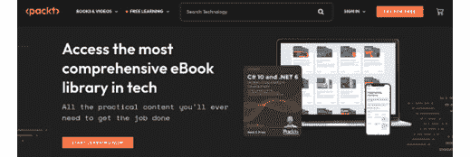

图 11.1 – Packt 的主页和颜色对比

在这个例子中，大部分内容使用有限的颜色（一个“调色板”），两个按钮具有高对比度，这吸引了用户的注意力：**免费试用**和**立即开始学习**按钮。显然，设计师已经为这两个动作设置了焦点。

与此原则相关，在这个截图中有一种设计“规则”被应用，这是一个值得记住的实用规则：*60-30-10 颜色规则*。这意味着该部分必须有 60%的基础色（在这里是深棕色），30%是主色（用于常规文本、菜单和图像，在这里是白色），而 10%则保留用于辅助色或高对比度（用于焦点或“行动号召”按钮，在这里是橙色）。让我们继续分析这个页面，看看其他 UI 设计原则。

## 激发重复和保持一致性

这个原则基于人们通过重复学习的概念。它表明，即使是通过不同的界面完成的相同任务，也应该模拟出更多或更少的重复行为。例如，如果你要求用户打开一个文字处理器，并要求他们打开一个文件，他们会尝试在哪里点击？大多数“经验丰富”的用户会将鼠标移到窗口的左上角，寻找代表“**打开**”的图标，或者**文件**菜单。为什么是这样？因为这已经成为了标准，我们通过重复学习知道了在哪里可以找到它。如果你将**文件**菜单放置在屏幕的右下角，大多数，如果不是所有用户，在没有指示的情况下都会很难找到它。

当显示视觉元素时，重复和一致性的另一个例子出现在它们是列表或常见集合的一部分时。让我们通过 Packt 出版社网站的一个例子来继续：

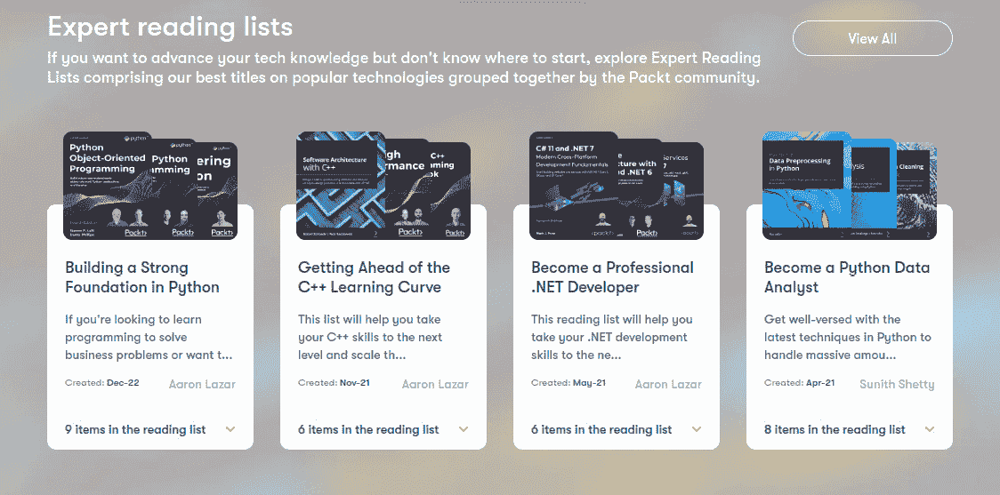

图 11.2 – 书籍卡片

在前面的例子中，设计师通过重复使用垂直的“卡片”来展示黄金时段的书籍。每个卡片都重复了相似的布局、颜色和格式。一旦你理解了一个卡片显示的内容，同样的规则也适用于其他所有卡片：这是视觉设计的重复，这一点很重要，因此用户不需要为每一本书重新学习界面。

简而言之，它是放置、动作和视觉风格的重复。让我们转向下一个。

## 注意对齐和方向

元素（图形、字体等）的对齐创造出一种秩序和组织感，表明这些元素属于同一组或具有相同的权重或重要性。我们在处理字体时大多熟悉对齐（和间距），但同样的概念也适用于图标、部分、图像等图形元素。从上一幅图中，注意标签是如何对齐的，以及卡片及其内容。仅通过对齐和风格，我们就可以区分哪些属于哪个自然分组。

当仅使用排版来显示菜单和功能时，可以看到对齐的另一个例子。例如，在这个页面的页脚中，即使没有使用图标或视觉边界，仅通过使用空间和对齐，也很容易看出哪个选项属于每个自然分组：


图 11.3 – Packt 网站页脚，使用对齐显示自然分组

虽然这个例子很简单，但它已经展示了对比（粗体与正常字体粗细）、重复的一致性、对齐，以及我们接下来将要看到的下一个原则：邻近性。

## 使用邻近性和距离来显示自然分组

这个原则遵循起来很简单：将自然相关的元素放置在彼此附近。这使得用户更容易找到和理解。排版和图标学也可以用来显示邻近性和类似的功能。微软在其 Office 应用程序中引入的著名“功能区”就大量使用了这个概念，并很快成为标准。例如，这里是一个处理对齐、列表、间距和缩进的**主页**标签段：

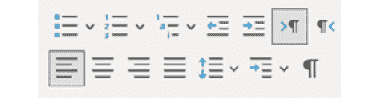

图 11.4 – 段落图标

注意到修改段落类型、间距和对齐的图标彼此靠近，而没有“混合”。

这些不是 UI 设计的唯一原则，但它们是我们开发组件时应该牢记的最基本的原则。如果你与包括 UI 设计师在内的团队一起工作，你可能会收到模板或原型，甚至故事板，以实现 Vue 组件，正如我们在*第四章*，“组件的用户界面组合”中看到的。如果你是“单打独斗的团队”的一员，并且界面的设计落在了你的肩上，这些原则将极大地帮助你创建专业且实用的 UI。但还有更多...

## UI 设计定律

就像我们有原则一样，几个研究已经发布或确定了设计“定律”，这些是可以预测某些软件属性的可测量函数，例如可用性和友好性。特别是以下这些突出。

### Fitt’s 定律

这条规则规定，用户获取目标所需的时间是目标距离指针和目标大小的函数。这里的重要概念是目标距离和大小：目标之间的距离越长，这些目标应该越大。

这条规则的应用使得窗口关闭按钮（**X**）位于屏幕的一个角落（当窗口最大化时），**开始**按钮位于屏幕左下角，*显示桌面*位于屏幕右下角，等等。如果用户将鼠标移动到这些方向中的任何一个，迟早会到达这些目标，并且继续在同一方向上移动不会影响结果。在 UI 设计的语言中，这些按钮是“无限”的，因为一旦光标通过屏幕边缘到达一个角落，继续用鼠标在同一方向上滚动仍然会击中目标。

这条规则的一个影响是，相似的功能也应该放置在彼此附近（例如*图 11.4*中的例子）。有关这条规则更详细的信息可以在维基百科上找到，网址为[`en.wikipedia.org/wiki/Fitts’s_law`](https://en.wikipedia.org/wiki/Fitts’s_law)。

### Hick’s law

这条规则表示，用户做出选择所需的时间是基于可用选项数量及其复杂性的对数函数。简单来说，选项过多会让人困惑，并使用户花费更多时间来做出决定。这条规则的一些影响如下：

+   将复杂任务分解成更小的组，以便用户可以快速做出决定

+   避免创建选项过多的界面，因为它们会使用户感到不知所措

+   如果一个功能是时间敏感的，将选项减少到最基本的情况

在日常软件中，我们可以在多个地方看到这条规则的应用——例如，在特定软件的“安装程序”中，在安装开始前或开始时，以顺序方式向用户展示带有选项的连续窗口，而不是填写表格。有关这条规则更详细的信息可以在维基百科上找到：[`en.wikipedia.org/wiki/Hick%27s_law`](https://en.wikipedia.org/wiki/Hick%27s_law)。

### 本·施奈德曼的八条规则

1986 年，本·施奈德曼教授出版了名为《设计用户界面：有效人机交互策略》的书籍，其中他规定了八条界面设计规则。这些规则自创建以来一直具有相关性，因此在这里值得提及：

1.  力求一致性（在动作、步骤、位置等方面）。

1.  允许使用快捷键执行常见任务（无论是使用键盘还是图标）。

1.  提供有信息的反馈（尤其是在发生错误时）。

1.  设计带有终点的对话框

1.  提供简单的错误处理，以便用户可以快速采取行动，避免用户犯严重错误。规则*#4*和*#5*的经典实现是在执行永久性操作（如删除内容）之前进行“确认对话框”。

1.  允许轻松撤销操作（多亏了这一点，我们才有 *Ctrl* + *Z*！）。

1.  支持用户的控制感。没有什么比用户感觉到机器“在做它自己的事情，失控”更糟糕的了。如果你不小心发送了一个 800 页的文件去打印，并且在你能够真正取消操作之前需要翻到第 12 页……这就是这个问题所在。

1.  减少短期记忆负担。用户一次只能记住少量项目和任务，屏幕上的元素（菜单等）过多会引发拒绝。这一原则也与希克定律有关。

对于实际应用和该主题的介绍，这些原则、规则和法律应该为我们提供一个稳固的基础。

关于这些规则和本·施奈德曼的更多信息可以在维基百科上找到（[`en.wikipedia.org/wiki/Ben_Shneiderman`](https://en.wikipedia.org/wiki/Ben_Shneiderman)）。

### UX 设计原则

UX 设计也有其自己的目标和原则，这些原则适用于模式。最重要的是，UX 的主要目标是向用户提供良好的感知，通过精心定制交互流程，与品牌或产品建立联系。在这种情况下，解决方案必须如下：

+   *有用且易用*：首先，应用程序必须完成它打算做的事情，做得好，并且用户使用起来容易。

+   *易于学习和记忆*：用户必须能够学习和理解所呈现的信息，并将其内化以供将来使用。

+   *可信并赋予用户控制权*：当用户与应用程序交互时，必须感觉到它正在执行用户意图的事情，并且结果对用户来说是“安全”的。

最后一条原则非常重要。如果用户感觉在交互过程中应用程序在某个地方“失去了对正在发生的事情的控制”，那将是一场灾难。遗憾的是，这种情况在我们将在本章后面看到的暗模式中发生得太频繁了，但现在，让我们看看一些好的模式，这些模式可以为用户提供良好的体验。

# 数据操作常见模式

这些模式通常由纯 HTML 元素匹配，而另一些则是近年来通过巧妙地使用这些元素的样式而出现的。这些已成为行业标准，并且用户一眼就能理解。以下是一个非排他性的列表，简要描述了何时使用每个模式。

## HTML 输入元素

HTML 提供的标准输入字段是接收用户输入的清晰模式。如今，由于`type`属性，输入元素有许多变体，允许输入除了纯文本以外的内容。在表单和验证库中使用，这些元素是现成的，可以读取和格式化从文本和数字到 URL、日期、时间、图像和颜色。今天浏览器支持的可用类型完整列表可以在此处找到：[`developer.mozilla.org/en-US/docs/Web/HTML/Element/Input#input_types`](https://developer.mozilla.org/en-US/docs/Web/HTML/Element/Input#input_types)。

在大多数情况下，这些元素与基本功能和一些重 CSS 样式一起使用。当需要用户输入文本信息时，使用`inputs`（和`textareas`）。今天的浏览器为更复杂类型提供了原生外观的小部件，例如日期和颜色选择器。

## 复选框、单选按钮和切换开关

复选框和单选按钮由 HTML 原生提供，并按照本地操作系统或环境的格式呈现给用户。**复选框**向用户表示多个选项，他们可以从组中自由选择。相比之下，**单选按钮**只允许从列表中选择一个选项：

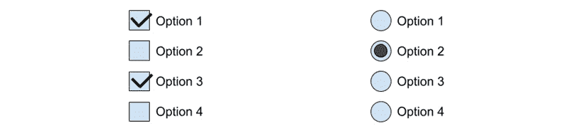

图 11.5 – 左侧的复选框和右侧的单选按钮

随着**原始 iPhone**的发布，一种新的复选框变体变得非常流行：**切换开关**。它不是 HTML 标准原生提供的，但可以通过 CSS 轻松地“伪装”成复选框。切换开关有两种状态，启用和禁用，它通常用于激活或禁用功能或特性。这是一个重要的区别，因为复选框应该关注选项或替代方案。以下是一个例子：


图 11.6 – 每个状态的切换开关

当切换开关向左时，切换开关处于“关闭”状态（或 false），当向右时处于“开启”状态。通常，切换还会影响颜色，关闭时以灰度哑光色调显示，激活时以鲜艳的颜色显示。内部，这两个状态通常表示为`true`（开启）和`false`（关闭），它们应该用于激活或禁用设置、功能等。您可以在本章的存储库中找到实现样式和`v-model`代码的`Toggle`组件。

## 芯片、药丸或标签

这种模式包括一个圆形框内的简短文本（或“副本”在 UI 术语中），副本可以伴随一个图标以强调选中时的状态，或者一个动作，例如“`span`元素”）。

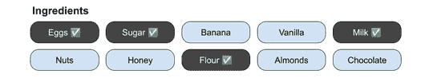

图 11.7 – 带有药丸的物品列表

这是一个捕获用户输入的 UI 模式简短列表，但它确实涵盖了最常见的类型：HTML 输入和样式变化。

# 数据可视化的常见模式

这些模式将信息反馈给用户，无论是响应用户操作还是应用程序事件。以下是一个非排他性的模式列表。

## 工具提示

此模式向用户显示有关目标元素的一些浮动小文本信息，通常当用户使用某些操作（悬停、点击、选择等）激活元素时。信息以“话泡”的形式显示在元素上方、下方或旁边（如漫画书中）。以下是一个示例：


图 11.8 – 显示图标名称/操作的提示和快捷键的工具提示

此模式主要用于显示有关目标对象的帮助信息，但也可以用于显示上下文菜单。例如，在在线文本编辑器中选择此段落中的单词将显示一个带有菜单的弹出窗口：


图 11.9 – 用于显示上下文菜单的工具提示模式

可能会有一些关于这种最后使用的是工具提示还是上下文菜单的讨论，但它在选择时打开的事实表明是前者。传统上，上下文菜单是通过次要操作打开的，例如右键鼠标按钮（在 Windows 和 Linux 中）。在任何情况下，此模式的概念是要在用户选择或预激活时向用户显示信息，以帮助他们决定下一步要做什么。

## 通知点、气泡、标记或徽章

此模式由在较大图标上显示的小图标组成，以表示已发生事件并需要用户的注意，但不是紧急的。这个小图标可以是点、气泡等。如果通知中包含数字，它也被称为**徽章**。以下是一些此模式的示例：

+   在电子邮件图标中的带有数字的小圆圈表示收到的新电子邮件

+   在聊天应用程序中的双勾表示对方已接收并阅读了消息

+   在任务栏上的一个小标记表示已打开应用程序

关键概念是使用某种小变化来表示图标需要未来关注，但这不是紧急的，也不会影响用户当前的活动。

## 吐司通知

这种模式在多个应用程序和操作系统中被使用。它包括在短时间内显示一个带有用户快速信息的叠加浮动窗口。通常，它包括一个简短的文字片段和合适的图标。根据操作系统，这可以在屏幕顶部中央、右侧或系统托盘上方右侧显示。Web 应用程序可以在浏览器窗口内实现自己的通知，或者要求用户授权并使用本地操作系统显示“原生通知”。以下是一个通知的例子：

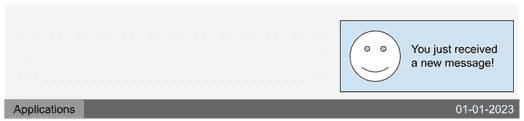

图 11.10 – 桌面上的原生通知

这些通知有助于通知用户需要他们注意的环境变化，报告异步操作的结果（成功、错误等），等等。这些引起注意的调用是短暂的，因此它们不应该成为重要工作流程的关键部分，除非是上述提到的条件。

## 旋转木马或图片滑块

旋转木马或图片滑块是一种在同一空间内按顺序显示不同带有图像和内容的板块的模式。通常，使用计时器，这些板块每隔几秒钟向用户展示一次，同时也提供了通过点状导航跳转到任何一个板块的选项。虽然它们几年前非常流行，但使用这些模式也有一些反对方，因为“不耐烦”的用户可能永远看不到旋转木马的全部内容。在实践中，建议尽可能缩短板块列表，大约在三个到五个元素之间。

这种实现的例子在互联网上随处可见，因为它们主要在网站的首页实现。实际上，几乎所有购物和新闻网站都使用了这种模式——例如，亚马逊的首页([www.amazon.de](http://www.amazon.de)):


图 11.11 – 亚马逊的旋转木马式展示商店的优惠

图片滑块可以像旋转木马一样大，也可以小得多，用于显示缩略图。这里再次给出一个来自亚马逊的例子：


图 11.12 – 亚马逊很好地利用图片滑块向用户展示商品

虽然实现起来很简单，但使用旋转木马和图片滑块是向用户展示信息的好方法。不过，有一个警告，滥用这种模式可能会导致用户感到压倒性和饱和，造成混淆，甚至引发不希望出现的副作用，如感官过载和内容回避。

## 进度条和旋转器

进度条是任何能够向用户展示工作流程当前状态进度的元素。虽然名字似乎暗示了一个“条”，但实际上，任何通过有限数量的动作显示进度的元素都属于这一类别。基本目标是通知用户耗时任务的进度，并显示系统正在“忙碌”地处理它们，从而为用户提供可见性和控制感。进度条对于防止用户无意识地执行负面操作非常重要。如果一个长时间运行的任务在后台（比如在 web worker 中）执行，没有任何关于进度的反馈，用户可能会认为任务尚未开始，已经失败，或者计算机“挂起了”。让用户感到困惑是一种负面的用户体验。以下是一些进度条元素的示例：

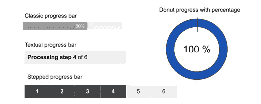

图 11.13 – 进度条的示例

除了样式之外，进度条还可以用于“不确定状态”，这意味着应用程序无法计算一个过程可能需要多少时间或多少步骤；然而，它仍然想通知用户系统正在忙碌，不应该被打断。HTML 标准确实提供了一个专门用于处理这些情况的元素（进度元素；见[`developer.mozilla.org/en-US/docs/Web/HTML/Element/progress`](https://developer.mozilla.org/en-US/docs/Web/HTML/Element/progress)），但在这些情况下还有其他模式可以使用，例如**spinner**。

如“spinner”这个名字所暗示的，这是一个“自转”的图标，给人一种应用程序正在忙碌并工作的印象。以下是一个带有文本指示器的 spinner 示例：

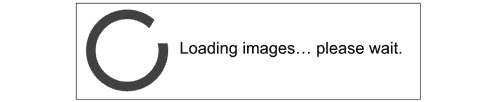

图 11.14 – Spinner 圆形，指示应用程序正在忙碌

这种方法在操作系统和应用程序中已经使用了一段时间，因此用户理解其含义。在使用这种模式时有一个需要注意的问题，那就是经过一段时间后，它可能会引起焦虑，因此建议伴随某种动作指示器。在 Vue 中实现`spinner`组件相当简单，主要使用 CSS：

./components/Spinner.vue

```js
<script setup>
const $props=defineProps(['caption'])
</script>
<template>
    <div>
        <span class="spinner"></span> {{ $props.caption }}
    </div>
</template>
<style scoped>
.spinner{
    display: inline-block;
    height: 1rem; width: 1rem;
    border: 2px solid;
    vertical-align: middle;
    border-radius: 50%;
    border-top-color: #06c9c9;
    animation: rotate 1s linear infinite;
}
@keyframes rotate {
    0%{ transform: rotate(0deg);}
    100%{transform: rotate(360deg);}
}
</style>
```

在这个简单的组件中，我们只需要定义一个用于文本的 prop 和一个用于旋转元素的 class。这里通过设置边框半径并定义一个边框的颜色来制作圆形，这样旋转动作就非常明显。

## 分页和无限滚动

当我们需要向用户显示长列表项时，有两种模式会浮现在脑海中，作为人们熟知的解决方案：分页和无限滚动。

在 **分页** 中，数据集被分成顺序排列的固定大小的更小部分。每个子集被称为 **页面**，并通过序号（通常是数字）进行引用。这允许在页面之间进行轻松导航，例如通过页码进行随机和顺序访问。此外，在数据中提供相同的排序函数允许在不同的会话中快速轻松地“返回”到数据。允许用户在分页数据中导航的元素通常被称为 **分页器**，并且通常的做法是将它放置在项目列表的顶部和底部。一个典型的分页器可能看起来像这样：

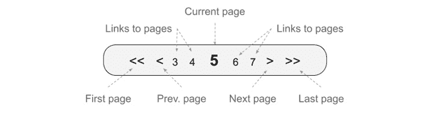

图 11.15 – 典型呼机元素

在前面的图中，你可以看到典型分页器的不同元素，通常用于表格或内容列表。然而，分页器可能采取的形状不止这一种。例如，它可以使用下拉菜单来显示页码，显示页面范围等。这个模式的重要概念是集合的划分和快速导航到每个单独的小组。

分页的另一种选择是使用 **无限滚动器**。在这个模式中，数据集中每个项目的确切位置可能需要也可能不需要，项目在用户滚动网页时呈现给用户。当用户到达列表的末尾时，新项目会以块的形式加载到页面上，直到用户停止滚动或整个数据集已加载完毕。以下是这种模式的图形表示：

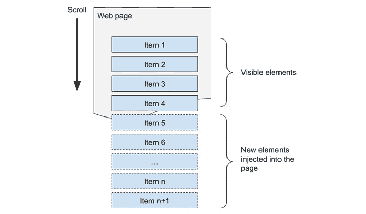

图 11.16 – 无限滚动器的实现

为了检测用户行为和加载数据或预加载数据，使用了多种技术。其中一种最简单的实现方式是通过使用一个 **交叉观察者**，这是浏览器在 JavaScript 中提供的一个原生元素，当这样的观察者与其它元素（在这种情况下，与视口）相交时，会触发一个事件。由于这是一个新概念，我们将实现一个最小化的无限滚动器，其外观如下：

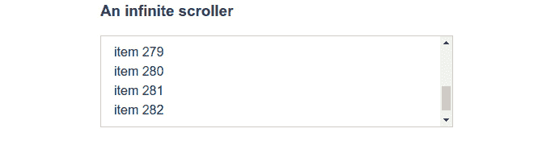

图 11.17 – 限制在 `div` 元素上的示例无限滚动器

如果你通过任何可用的方式（鼠标、键盘等）在 `div` 边界处向下滚动，列表将生成新的项目，并且永远不会停止，给人一种滚动是无限的印象。以下是该组件的源代码：

./src/components/InfiniteScroller.vue

```js
<script setup>
import { ref, onMounted } from "vue"
const _max_value = ref(30),                               #1
    _scroll_watcher = ref(null),                          #2
    observer = new IntersectionObserver(triggerEvent)     #3
onMounted(() => {
    observer.observe(_scroll_watcher.value)               #4
})
function triggerEvent() {_max_value.value += 20;}
</script>
<template>
    <div v-for="elem in _max_value" :key="elem">
        item {{ elem }}
    </div>
    <div     ref="_scroll_watcher"></div>                 #5
</template>
```

前面的组件是最基本的，但它确实说明了这种技术。我们将有一个数字列表，初始限制将触发容器中的溢出（`#1`）。这很重要，因为在第一次加载时，用户会知道有一个滚动条和更多内容在下面（如*图 11.17*所示）。现在，这里的技巧是定义一个指向`null`的响应式变量`_scroll_watcher`。这个变量将后来具有列表底部元素的值，我们将其标记为参考（`#5`）。我们使用`null`是为了 Vue 在此点不运行任何优化。在行`#3`中，我们创建了一个新的`IntersectionObserver`，并将`triggerEvent`函数的引用作为值传递，我们将简单地增加列表的边界。在我们的模板中，我们使用`v-for`指令生成列表中每个整数的元素，这些元素应该出现在我们的滚动监视器元素之前。魔法发生在行`#4`，一旦我们的组件被创建并挂载到页面上。在这个时候，Vue 已经将`_scroll_watcher`分配给了 HTML 元素的引用，因此我们可以将其传递给我们的`IntersectionObserver`实例。由于我们使用默认值，它将在相关 div 出现在视口中时运行`triggerEvent`函数，这将在我们到达列表末尾时发生。在这个函数中，我们再次增加项目数量，使 Vue 将更多元素注入到网页中，并将滚动监视器 div 再次推出视口。这个过程无限重复，给我们一个简单但有效的无限滚动器。

除了实现 UX 模式之外，这种技术是将响应式变量绑定到 DOM 元素上的正确方法，并且它使我们免于编写直接的 JavaScript DOM 操作，例如`document.getElementById("#someId")`和处理诸如 ID 冲突等问题。Vue 为我们解决了这个问题。

# 交互和导航的常见模式

这些模式控制着交互或为用户提供控制应用程序过程和导航的选项。通常情况下，其中一些模式也可能适合其他类别。

## 菜单的位置

菜单的位置也是三种基本布局中已经标准化的模式之一：

+   **菜单栏**（水平）通常放置在屏幕顶部的一个“粘性”位置（这意味着它们不会随着页面滚动而滚动）。

+   **导航栏**（水平），主要适用于移动设备，是在屏幕底部放置的一个图标菜单，用于导航到应用程序的不同部分。

+   **侧边栏**覆盖整个屏幕高度，并且具有可变宽度。这些显示带有图标和/或文本的菜单。在屏幕真实状态对移动和桌面应用程序很重要的应用中，通常有一个选项可以切换它进入或退出视口。触发此功能的标准图标已成为“汉堡”图标（见本章后面的内容）。

遵循桌面和移动端的标准布局将确保用户能够轻松地导航网站。通常，一些应用如视频游戏会打破这些标准，但除非有强有力的理由这样做，否则应避免。

## 面包屑

面包屑是一个链接的层级列表，显示了网页在整体网站组织中的当前位置。每个链接都允许用户返回一个层级，无需使用浏览器的**后退**按钮或深入主菜单。当前的做法是将面包屑放置在页面顶部，在主要内容之前。以下是一个面包屑路径的示例：

```js
Home > Level 1 > Level 2 > Level 3 > Current page
```

习惯上使用大于号（`>`）来分隔每个导航页面，但在这方面有很多艺术许可。这种导航的另一种表示方法是使用树状结构，如下所示：

```js
Home
  └── Level 1
   └── Level 2
    └── Level 3
     └── Current Page
```

这种“文件夹式”结构在主要导航中并不常见，但主要用于嵌套内容，如论坛中的评论和回复。

## 模态对话框

模态对话框是一个在应用程序前面打开的小窗口，完全控制焦点。它阻止用户与应用程序的其他部分交互，直到对话框中展示的活动得到解决。模态对话框应专注于单一操作，并通过提供清晰的选项，为用户提供足够的信息以便采取行动。以下是一个示例：


图 11.18 – 确认对话框

我们之前已经实现了一个在 Vue 3 中显示模态对话框的系统，因此您可以查看*第五章*，“单页应用程序”中的代码，以查看实现方法。

## 菜单图标

除了菜单项的普通文本命名约定外，今天还有许多图标用于在用户第一眼看到菜单时展示预期的交互类型。以下是您今天可以找到并使用的标准图标：

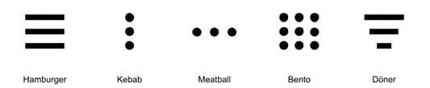

图 11.19 – 菜单图标

下面是它们的描述：

+   **汉堡图标**（三个水平线）：用于*主菜单*和导航，此图标切换侧边栏中宽网站菜单的显示。这些显示和隐藏方便的侧边栏类型被称为**抽屉**，在移动网站和应用中非常流行。

+   **咖喱棒图标**（三个垂直点）：由谷歌的 Material Design 流行起来，表示当前元素或活动有更多*选项*，它们将在模态对话框中显示。

+   **肉丸图标**（三个水平点）：显示在列表项旁边，表示有包含额外*操作*的弹出菜单。

+   **Bento 图标**（3x3 网格中的 9 个方块）：用于指示弹出菜单，在同一个解决方案或环境中导航不同的*应用程序*。

+   **多纳圈图标**（不同大小的三个堆叠线条）：这表示使用可选顺序选项（通常在弹出窗口中）对列表条目进行*排序*的选项。然而，这个图标并没有像其他图标那样流行。

## 展开菜单

这种模式的基本用途是在标题下分组内容，并在用户选择时显示它，一次只显示一个组。如今，它常用于*常见问题解答*页面和侧边栏菜单。以下是从 Packt 网站([`www.packtpub.com/`](https://www.packtpub.com/))的一个示例：

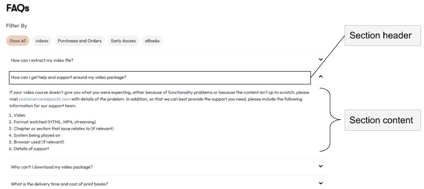

图 11.20 – 用于常见问题解答的展开菜单

展开菜单是一个用户理解良好的模式，并且实现起来相对简单。它有助于保持设计整洁，并使用户能够只关注对他们重要的事情。

## 大菜单

到目前为止，我们看到的多数模式的目标是隐藏复杂性，以避免使用户感到不知所措。然而，这种模式乍一看似乎打破了这一规则。当导航的复杂性会使功能难以找到（例如，超过三个级别的深度：组 -> 子组 -> 子子组）时，一个替代方案是使用**大菜单**。这种模式通常用于政府网站和其他具有大量不可避免内容的复杂组织。基本概念是展示一个包含所有（或大多数）可选选项的大菜单。这并不意味着在这些部分之后不会有“深入挖掘”，但它确实使访问更快。例如，让我们看看芬兰 Hyvinkää市的官方网站([www.hyvinkaa.fi](http://www.hyvinkaa.fi))：

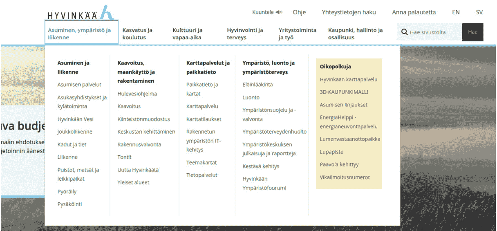

图 11.21：Hyvinkää 市主页大菜单

如您所见，在顶部菜单中只需单击一下，就有许多引人注目的选项。然而，请注意它们的组织多么井然有序，并且彼此之间视觉上分离。大菜单模式打破了*简单性*规则，但并未忘记 UI 设计的其他规则和原则，使其仍然赏心悦目。在其他情况下，也可以考虑将大菜单视为其他模式的占位符，例如侧边栏或展开菜单。官方 Packt 网站([`www.packtpub.com/`](https://www.packtpub.com/))在主菜单**书籍 & 视频**选项中使用了这种模式：

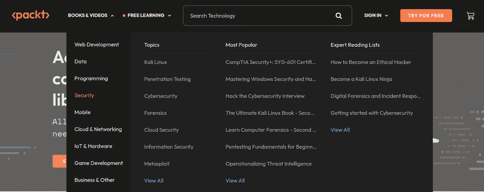

图 11.22 – Packt 大菜单带有侧边栏以分类和筛选选项

大菜单可能是一个创新的地方，因为它更容易让用户理解和使用。它并不是每个 Web 应用的可行选项，但使用得当的话可以非常强大。当没有其他选项，只能显示大量快捷方式或选项时，这是一个值得记住的好模式。

## 下拉菜单

当下拉菜单和选择框通过触发区域（图标、文本或按钮）被激活（例如点击或触摸）时，它们会向用户显示一个选项列表。在这里，隐藏选项并在用户“请求”时显示它们的概念比具体的实现更重要。例如，手风琴菜单和超级菜单就利用了这个概念。手风琴菜单可以被视为一系列下拉菜单，并不那么遥远。HTML 为选择列表提供了一个原生解决方案（`select`元素），但同样的概念可以在许多情况下应用，并且通过一些创意，可以产生新的实现。

# 内容组织常见模式

我们接下来要看到的模式与网站或应用的总体组织和布局有关。

## 响应式应用

“响应式”这个术语与应用布局如何适应屏幕大小有关。你可能听说过“移动优先方法”，这是一种设计理念，首先为较小的屏幕设计，然后向上移动到可能的分辨率，达到桌面，这被认为是最大的。虽然可以通过 JavaScript 实现这一点，但最合理的直接方法还是使用经过深思熟虑的设计和 CSS 媒体查询。

根据应用的不同，有一些公式可以创建一个响应式网站，但分析许多替代方案超出了本书的目标。相反，我们将只看到一个例子，使用“切换列”方法。这种方法基本上为移动（或窄肖像屏幕）设置了单个垂直列中的主要内容，部分部分。主导航栏或菜单放置在屏幕的顶部或底部，始终可见。然后，对于桌面，导航栏完全或部分移动到顶部菜单或侧边栏，主列的内容移动到水平部分，一个接一个地堆叠。这个方法通过这个图例来说明，更容易理解：

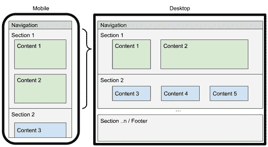

图 11.23 – 从移动优先到桌面端的转换

如前图所示，部分始终保持在相同的顺序，但内容内部从垂直布局方向适应到水平布局方向。这个概念设计起来既简单又干净，已经成为大多数着陆页的标准。一旦你理解了这个模式，你开始看到它在任何地方的应用。

通过使用 CSS flexbox 模型并在部分级别改变方向从垂直到水平，这是一种简单的编码方法来实现这种变化。以下是一个例子：

```js
// For mobile
    @media only screen and (max-width: 600px) {
         section{
             display: flex;
             flex-direction: column;
         }
    }
// For desktop
section{
    display: flex;
    flex-direction: row;
}
```

注意代码中已经包含了一个在 600 像素宽度的断点。你可以通过应用多个带有断点的媒体查询来控制不同的屏幕尺寸。

## 首页链接

这种模式如此普遍，以至于我们甚至没有意识到它。主要的公司标志被放置在页面左上角，作为返回主页的链接。这个位置不是随机的，它源于用户“扫描”页面的一种方式。不同的用户在页面加载时会快速浏览，引导眼睛在页面中做*Z*、*L*或*T*形状的运动。将标志作为链接放置在左上角确保它是用户首先注意到的项目。在本章中，*图 11.21*和*图 11**.22*是这种模式的良好例子。但是，也有一些位置上的例外，比如谷歌的主页：

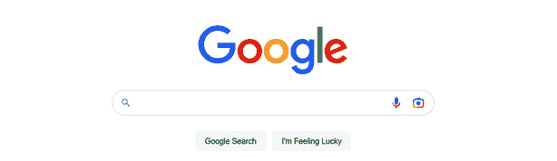

图 11.24 – 谷歌的主页是这种模式的例外，因为标志不是链接

然而，前面图示中的例外只是暂时的，因为谷歌在展示搜索结果后会回到这个模式：

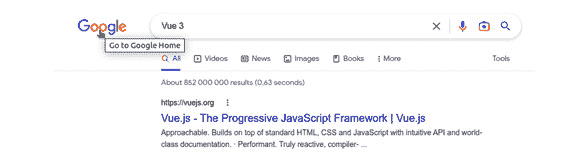

图 11.25 – 谷歌的搜索结果应用了这种模式

主页链接模式应该将您带回到主页或流程的第一步。这种模式非常普遍，并且用户都能理解，因此任何例外都应该非常谨慎地做出，并且对用户群体的行为和交互有很好的理解。

## 英雄部分、行动号召和社交媒体图标

**英雄部分**是当页面在浏览器中加载时首先显示的部分，从最顶部（主页链接和主菜单所在的位置）延伸到屏幕的可见底部。这个部分以下的所有内容被称为“页脚以下”，意味着要看到它，用户需要滚动页面。英雄部分被认为是主页最重要的部分，也是初始**行动号召**放置的地方。我们在这章之前讨论 UI 设计原则和对比时已经提到了这个概念。如今，大多数网站都会遵循这个模式，并通过对比显示英雄部分，使用大图像或轮播图，以及突出的行动号召。

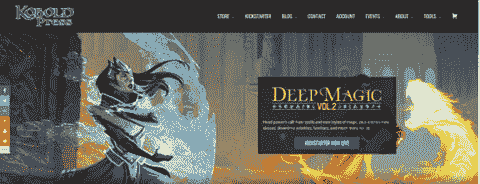

图 11.26 – Kobold Press 主页的英雄部分 – 鲜艳且直接

在 Kobold Press 的先例（[`koboldpress.com/`](https://koboldpress.com/)）中，我们可以看到他们如何应用了这里看到的一些模式，从主页链接和主菜单到英雄部分和行动号召。注意，在左侧，社交媒体图标作为浮动侧边栏的显示。将此类图标及其链接放置到每个机构的社交媒体地址，或者在某些帖子或文章中，链接到“分享”内容，已经成为一种模式。以下是一些常见的放置社交媒体图标栏的位置：

+   在网站页脚

+   在文章的开头和/或结尾

+   在产品描述中

当包括链接以分享来自 Vue 应用程序（例如，来自在线商店的产品）的直接内容时，链接和 Vue 应用程序直接指向此类项目非常重要。需要仔细注意导航 URL 的形成和 Vue 应用程序在首次加载时的解释方式，以避免分享会打开主屏幕而不是应用程序所需部分的链接。

## 其他模式

还有其他模式，如果不说数百也有数千，它们对用户体验有直接影响。我鼓励你继续调查这些模式，例如以下内容：

+   购物车模式

+   用户入门

+   游戏化模式

+   注册和注销模式

然而，用户体验也有其阴暗面，这与使用操纵和欺骗性做法有关。作为一名道德的开发者，你应该避免使用任何这些暗模式。

# 暗模式

暗模式是精心设计的界面和交互，其唯一目的是操纵或欺骗用户执行非预期操作，甚至使他们陷入恶意结果。在这样定义之后，你可能认为这样的行为属于互联网最阴暗的角落。遗憾的是，即使是主流公司也经常遵循这些不道德的做法。实际上，这些章节中复制的例子都属于这一类，而且正如设计模式经常发生的那样，许多这些模式相互重叠或可以嵌套在一起。让我们逐一看看。

## 陷阱问题

这种模式是一种简单或复杂的文字游戏，目的是欺骗用户去做与他们意图相反的事情。以下是一个例子：


图 11.27 – 有关订阅通讯的陷阱问题

正如你在本例中看到的，如果一个用户填写表格时不想收到公司的通讯，他们可能会被诱惑不勾选这个复选框。常见的倾向是关注加粗的文字，这相当于一个标题。复选框的实际操作可以在段落的末尾找到，但大多数用户不会阅读：**如果您不想收到** **我们的通讯**，请勾选此选项。

## 悄悄放入购物车

这种暗模式出现在许多购物应用中，在诸如托管和机票等服务中相当常见。它包括在结账时将商品放入购物车，但用户并未选择，通常以优惠或“必需”的小额商品的形式呈现。以下是一个例子：


图 11.28 – 购物车中已添加额外项目

在这个例子中，在订购新域名后，购物车中自动添加了一个新项目，**首次设置**。这个项目没有其他解释，与购买的主要目的相比，金额看起来“很小”。通常，这类项目是“欺诈性”的，没有其他意图，只是通过一点一滴地增加最终金额。在某些情况下，在确认购买之前可能有选项移除此类项目，但很多时候却没有。

## 蟑螂旅馆

这种模式在服务和订阅中相当常见。它包括在免费试用期后进行非常容易的购买，条件是费用将继续，直到用户明确取消。这就是暗模式出现的地方：通过使“取消订阅”过程变得复杂或无法完成。例如，一些公司要求用户通过带有法律身份证件的签字信件联系支持团队。基本概念是“陷阱”用户，使取消合同服务变得几乎不可能。

## 隐私诱导

这种暗模式是以一家知名社交媒体公司的创始人为名的。它包括向用户提供大量免费服务，同时应用程序会监控用户的活动和行为。然后，这些数据在幕后被收集并出售给第三方公司，而用户并不知情。通常，这种做法会在相当长的服务条款合同中提及，用户在使用服务之前需要接受。这样，公司声称用户已经给予了同意并且知情，而实际上很少有用户会正确阅读或解释这样的协议。

## 阻止价格比较

在这种模式中，网站向用户展示了一系列服务计划，但故意隐藏或伪装了功能或个别价格，因此用户无法直接比较以选择最合适的选项。

价格被隐藏或伪装得让用户无法做出明智的决定，必须根据功能或其他属性选择选项。

## 引导错误

这是另一种常用于购物车工作流程的模式。它包括使用对用户来说令人困惑的名称和选项，以及预先选择的选项，这些选项隐藏了替代方案和更好的价格优惠。如果系统有一个浮动价格值（例如，酒店或飞机票），这种模式通常被用来操纵用户选择对公司最有利的选项。

## 隐藏成本

在这种模式中，用户选择的产品或服务并未披露涉及的相关成本的总和或全面描述（除税收外）。无论是在初始购买还是后续购买中，支付的总金额都高于用户最初估计的价格。

## 诱饵和更换

这种模式被在线广告商广泛使用，并且是导致用户最讨厌的一种。它简单地将一个选项伪装成执行另一个或用户原本意图的相反操作。一个典型的例子是，当弹出窗口显示一个**关闭**按钮（通常是简单的**X**）时，但用户点击它意图关闭对话框窗口时，它会打开一个新标签页，显示广告网站。

## 确认羞辱

这是一个高度操纵性的模式，它涉及故意使用措辞或行动来羞辱和嘲笑用户，使他们做交易开始时不想做的事情。它可以从轻微的烦恼到直言不讳的侮辱。它经常与其他暗黑模式一起使用。以下是一个例子：

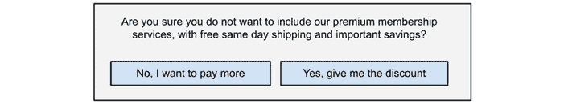

图 11.29 – 从购物车中删除服务时的确认对话框

在示例中注意，操作按钮的措辞非常具有操纵性，尽管原始问题并非如此。这种模式是一把双刃剑，因为用户可能会感到整个服务的拒绝并取消整个操作。

## 伪装广告

当广告被注入到页面中时，它可以伪装成适当的内容，模仿样式和操作按钮，目的是欺骗用户触发重定向或下载文件。在某些情况下，伪装如此之好，以至于无法区分网站的号召性用语和广告。这种模式在提供托管文件下载的免费网站上很受欢迎，在这些网站上，页面上通常会有多个**下载**按钮，但只有一个是实际下载所需文件，其他则将用户重定向到第三方网站。以下是一个例子：

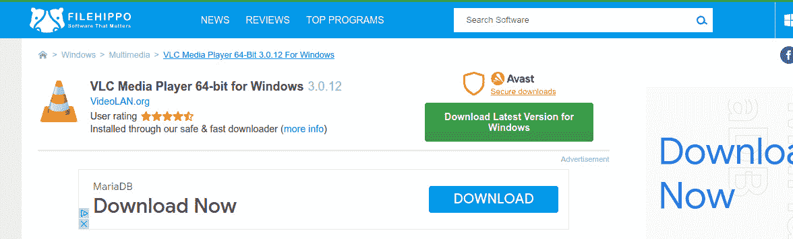

图 11.30 – FileHippo.com 托管免费软件。一些广告伪装成下载按钮

在这个来自[FileHippo.com](http://FileHippo.com)的屏幕截图中，如果你访问 VLC 媒体播放器的下载页面，该网站会提供多个**下载**按钮。如果用户没有注意，可能会触发与预期软件下载不同的操作。

## 友好型垃圾邮件

在这个暗黑模式中，应用程序请求访问用户的联系人，目的是扩大他们的网络或社交圈。如果用户同意，他们的整个联系人列表将被“垃圾邮件”式地发送电子邮件，仿佛来自用户，提供该服务。通常，一旦这些信息被分享，也会与第三方实体和广告商分享。

暗黑模式的列表可能不直接与单一媒体或框架相关联，但这个行业的从业人员的道德责任是避免或预防它们。

# 摘要

在本章中，我们看到了向用户呈现满意用户体验的重要模式。我们还学习了与设计师平等对话并相互理解的重要术语——这是协作和向用户基础提供最佳可能积极体验的必要点。我们还回顾了一些最常见的暗模式，这些模式是操纵用户的技术和工作流程实现，通常剥夺他们的隐私和资源。虽然主要是信息性的，但本章应该让你更好地理解构建网络应用程序的环境，以及为了易于使用应遵循的标准。所有这些都是优秀工程师和开发者应该了解的知识。

# 复习问题

这里有一些简单的问题可以帮助您总结本章学到的内容：

+   UI 和 UX 模式是什么？

+   你能说出使用 UX 模式的益处吗？

+   你如何在 Vue 3 组件中使用标准模式获得好处？

+   什么是暗模式，为什么应该避免它们？

# 附录：从 Vue 2 迁移

将 Vue 2 应用程序迁移到 Vue 3 并不像只是替换框架那样简单。虽然 Options API 仍然完全兼容，并且不应该需要迁移到 Composition API，但还有一些其他破坏性变化我们应该注意。

版本之间的变化不仅影响核心框架，还影响生态系统（新路由、状态管理等）和其他依赖项。在 Vue 3 中，还有一个新的官方打包器 **Vite**（取代 **WebPack**），一个新的路由和状态管理（**Pinia**，取代 **Vuex**），以及其他插件。这里列出的变化列表是一个快速参考，以帮助您迁移应用程序，但可能不会详尽无遗地涵盖每个特定项目特定需求的细微差别。因此，我将向您推荐官方迁移文档 [`v3-migration.vuejs.org/`](https://v3-migration.vuejs.org/)。

这里是一个非排他性的主要变化列表，除了新的 Composition API 之外：

+   启动和启动应用程序的不同方式

+   全局组件和插件注册的变化

+   `data` 属性的变化

+   `v-model`、`props` 和 `emits` 的变化

+   响应式选项

+   框架浏览器兼容性

+   目录和文件组织的变化

+   路由和状态管理的变化

这个列表并没有显示框架在内部经历了所有变化，但它将为您提供一个起点，将您的工作应用程序从 Vue 2 迁移到 Vue 3。现在，让我们更详细地看看这些变化。

# 启动和启动应用程序的不同方式

启动和启动我们的应用程序的方式已经改变。现在需要我们从 Vue 包中导入一个构造函数。让我们从 `main.js` 中比较两种实现：

**Vue 2** **应用程序实例化**：

```js
import Vue from "vue"
const app=new Vue({el:"#app"})
```

在 Vue 2 中，我们导入 Vue 构造函数并传递一个包含选项的对象。在 Vue 3 中，在创建应用程序之后，在将应用程序挂载到顶级组件之前，我们附加组件、插件等。以下是针对 Vue 3 重写的示例：

**Vue 3** **应用程序实例化**：

```js
import {createApp} from "vue"
const app=createApp({..})
app.mount("#app")
```

`index.html`文件的位置也已经改变，现在放置在我们的应用程序的根目录下。你可以在*第三章*，*设置工作项目*中看到对文档结构的更多更改。

# 注册全局组件、插件等

在 Vue 2 中，我们通过将其附加到 Vue 根实例来声明一个应用程序范围内的组件（全局）。以下是一个示例：

```js
import Vue from "vue"
import MyComponent from "MyComponent.vue"
vue.component("myComponent", MyComponent)
const app=new Vue({...})
```

在 Vue 3 中，我们而是在创建并挂载应用程序之后注册组件和插件。`component`（用于组件）、`use`（用于插件）和`directive`（用于指令）方法都是可链式的。以下是前面示例在 Vue 3 中的样子：

```js
import { createApp }from "vue"
import MyComponent from "MyComponent.vue"
const App=createApp({...})
App.component("myComponent", MyComponent).mount("#app")
```

如果我们不需要引用应用程序，我们只需像这个示例中那样连接应用程序的实例化即可：

```js
import { createApp }from "vue"
import MyComponent from "MyComponent.vue"
createApp({...}).component("myComponent", MyComponent) .mount("#app")
```

应用程序引导与描述组件（选项 API、组合 API 或 script setup）所使用的语法无关。

# 数据属性现在始终是一个函数

在 Vue 2 应用程序中，`data`属性存在差异。根组件有一个直接是响应式定义的属性，而所有其他组件都需要提供一个函数作为`data`属性，该函数返回一个对象。这导致了组件创建的不一致性。这个问题在 Vue 3 中得到了解决，因此现在*所有组件都被同等对待*，这意味着数据属性始终必须是一个返回对象的函数，该对象的成员将是响应式属性。

下面是`main.js`中根组件的一个示例：

```js
createApp({
    data(){return {...}}
})
```

然后在所有其他组件中，你有以下内容：

```js
export default {
    data(){return {...}}
}
```

注意，对于这些示例，我们使用选项 API 来提高清晰度。当使用`script setup`语法时，你不需要声明`data`属性。

# 有更多可选择的响应式选项

当使用组合式 API 时，我们有两种选项来创建响应式属性：`ref()`和`reactive()`。第一个返回一个具有`.value`属性的响应式对象。第二个将作为参数传递的对象转换为具有响应式属性的相同对象。以下是一个示例：

```js
<script setup>
import {reactive, ref} from "vue"
const
    data=reactive({name:"John", surname:"Doe"}),
    person=ref({name: "Jane", surname:"Doe"})
    // Then, to access the values in JavaScript
    // Reactive object
    data.name="Mary"
    data.surname="Sue"
    // Reactive ref
    person.value.name="Emma"
    person.value.surname="Smith"
</script>
<template>
    <strong>{{data.surname}}, {{data.name}}</strong><br>
    <strong>{{person.surname}}, {{person.name}}</strong>
</template>
```

注意语法上的差异。在这个阶段，你可能需要考虑何时使用其中一个。以下是对何时使用每个选项的小比较：

| `ref()` | `reactive()` |
| --- | --- |

|

+   适用于任何数据类型，而不仅仅是原始类型。

+   当应用于对象或数组时，你可以替换它们。

+   它使用 getter 和 setter 来检测更改并触发响应性。

+   对于简单数据，默认使用它。对于数组和对象（复杂类型），建议在处理其内部元素时使用`reactive()`。当整个对象将被替换时，使用`ref()`会更方便。

|

+   适用于对象和数组，但不适用于原始数据类型。使它们的属性具有响应性。

+   对象不能被替换，只能替换其属性。

+   它使用`Proxy()`处理器的本地实现来检测变更并触发响应性。

+   当您需要将大量必须“一起旅行”的变量分组时使用。

|

表 A.1 - 选择 ref()和 reactive()之间的简单指南

每种方法都有自己的优点。从复杂类型响应属性的角度来看，您使用哪个都无关紧要。在某些情况下，由于浏览器中使用了本地实现，`reactive()`可能更高效。

# v-model、props 和事件的变更

这是从 Vue 2 的一个重大变化，可能会破坏您的代码。在 Vue 3 中，我们不再接收和发射属性值。相反，任何属性都可以作为输入/输出，例如`v-model`。默认的`v-model`属性以名为`modelValue`的**prop**接收，对应的**emit**前缀为`update:`，因此称为`update:modelValue`。

在 Vue 3 中，我们现在可以同时拥有多个*v-models*。例如，我们可以在组件中使用`v-model:person="person"`，并将属性定义为`"modelPerson"`，事件定义为`"update:modelPerson"`。

Props 和 emits 现在是宏（宏是打包器或框架提供的特殊函数）。**Props**与 Vue 2 中的占用空间相同，因此您可以将其定义为数组、对象、包含类型、默认值等。

这里有一个带有默认 v-model 和注记模型的示例：

```js
const $props=defineProps(['modelValue','modelPerson']),
$emit=defineEmits(['update:modelValue','update:modelPerson'])
```

在本书的*第四章*中更详细地讨论了 Props 和 emits，*组件的用户界面组合*。

# 移除了旧浏览器的兼容性

Vue 3 是为了速度和“现代”JavaScript 而构建的。已移除对旧浏览器的向后兼容性。现在，用于响应性的许多内部函数默认使用本地实现（例如，Proxy API）。如果您需要支持旧版浏览器中的应用程序，您应该考虑继续使用 Vue 2，但不必担心！有一个官方插件可以让 Vue 2 使用新的*Composition API*，包括`script` `setup`语法：

+   Vue 2.7 无需插件即可包含它（[`blog.vuejs.org/posts/vue-2-7-naruto.html`](https://blog.vuejs.org/posts/vue-2-7-naruto.html)）

+   如果您使用 Vue 2.6 或以下版本，您可以在以下位置找到插件：[`github.com/vuejs/composition-api`](https://github.com/vuejs/composition-api)

+   如果您仍然想要 Vue 3 的速度，有一个特殊的迁移构建，其 API 几乎与 Vue 2 相同（见[`v3-migration.vuejs.org/migration-build.html`](https://v3-migration.vuejs.org/migration-build.html)）

+   为什么移除旧浏览器的兼容性？原因有很多，包括以下：

    +   旧浏览器的全球使用率已经下降到显著百分比以下，预计未来还会继续下降。

    +   通过移除旧代码和兼容性检查，得到的 Vue 核心实现更轻量级和性能更高。速度的提升和包大小的减少非常显著，使得我们的应用程序加载更快，响应更灵敏。

实际上，有两个浏览器引擎占据了大部分市场份额：基于 Chromium 的浏览器和基于 Mozilla Firefox 的浏览器。如果您需要使用可能在旧浏览器中不可用的功能，请检查 [www.caniuse.com](http://www.caniuse.com)。

# 目录和文件组织的变化

Vue 2 中目录结构的组织在一定程度上受到当时打包器的影响，`index.html` 已经从 `Public/` 文件夹移动到根文件夹。现在它在打包过程中有更突出的位置。这些和其他变化可以在 *第三章*，*设置工作项目* 中找到。

# 路由和状态管理的变化

组件和模块化的新方法也影响了路由和状态管理。虽然 Vue 3 提供了新的路由版本，但状态管理的官方解决方案已经从 **Vuex** 转向 **Pinia**。关于新路由和 Pinia 的更多信息可以在 *第五章*，*单页应用程序* 和 *第七章*，*数据流管理* 中找到。

新的路由现在采用不同的方法来定义模式，使用构造函数如 `createWebHashHistory`（哈希模式）、`createWebHistory`（历史模式）和 `createMemoryHistory`（仅内存导航）。此更改还影响了生产包的配置。在 WebPack 中，当处于历史模式时，部署路径是打包器配置的一部分。现在，路径作为参数传递给构造函数，由路由器完全处理。

# 新组件和其他变化

Vue 3 还引入了新的组件，例如 `teleport`（一个特殊组件，允许将响应式模板放置在 Vue 组件树之外，另一个 DOM 元素内部），同时也突破了 Vue 2 的一些限制。例如，组件现在可以有多个根元素。请参阅官方文档了解 Vue 3 中的新组件。

# 其他破坏性变化

要查看此处未提及的所有破坏性变化的完整列表，请检查官方文档 [`v3-migration.vuejs.org/breaking-changes/`](https://v3-migration.vuejs.org/breaking-changes/)。

# 摘要

从 Vue 2 迁移到 Vue 3 有一条清晰的路径，只需要注意少数破坏性变更。然而，新的组合 API 确实需要心态上的改变，但在使用`script setup`语法时，这种改变是自然而然的。但 Vue 3 最重要的特性是性能的提升和体积的减小。简而言之，Vue 3 速度快，非常快，迁移是值得的。对于支持过时浏览器的项目，Vue 2.x 分支的插件提供了一些 Vue 3 的优势，但对于寻求 Vue 3 积极收益的其他项目，迁移是值得的。

# 最后的话

恭喜你到达这本书的结尾！我们已经涵盖了从 Vue 的非常基础到最终产品部署的广泛主题。让我们一起来回顾每一章的主要概念：

+   在 *第一章*，*Vue 3 框架*，我们介绍了 Vue 的关键概念和编写组件时可用的一些不同语法选项

+   在 *第二章*，*软件设计原则和模式*，我们深入探讨了构建代码时的重要概念和经过良好测试的模式

+   在 *第三章*，*设置工作项目*，和 *第四章*，*使用组件的用户界面组合*，我们学习了如何启动 Vue 项目以及如何将设计转换为可工作的代码

+   在 *第五章*，*单页应用程序*，和 *第六章*，*渐进式 Web 应用程序*，可能是最重要的章节，我们学习了如何通过浏览器的原生功能创建具有导航和安装的高级应用程序

+   在 *第七章*，*数据流管理*，和 *第八章*，*使用 Web Workers 的多线程*，我们学习了更多关于如何通过良好的实践提高性能和控制信息流的方法

+   *第九章*，*测试和源代码控制*，介绍了自动化程序测试的工具，以确保我们代码的良好质量

+   *第十章*，*部署您的应用程序*，展示了发布和通过安全协议保护我们的服务器所需的步骤和资源

+   *第十一章*，*bonus 章节 -UX*，从用户的角度提供了视角，以及与 UI/UX 设计师协作的常用词汇

的确，这是一段漫长的旅程，但我有信心和积极的态度相信，这些内容将提高你作为开发者和专业人士的技能。

# 接下来去哪里

技术每天都在进步，因此还有很多东西需要学习。新的工具和模式经常被创造出来。正因为如此，不可能在一本书中涵盖所有这些内容。通常，在准备章节时，由于本书的范围和广度，我仅限于对一些技术和概念进行表面上的探讨。例如，除了网页之外，Vue 还可以用 **NW.js** ([`nwjs.io/`](https://nwjs.io/))、**Electron** ([`www.electronjs.org/`](https://www.electronjs.org/))、**Tauri** ([`tauri.app/`](https://tauri.app/)) 等工具开发混合应用程序。

了解这个框架及其所基于的技术将为你提供重要的技能。

# 最后...

我对你在这一学科上的奉献表示感谢，并感谢你购买这本书。祝愿你在未来的努力和职业生涯中取得美好和辉煌的成就。

诚挚地，

巴勃罗·大卫·加拉斯索

[www.pdgaraguso.com](http://www.pdgaraguso.com)
