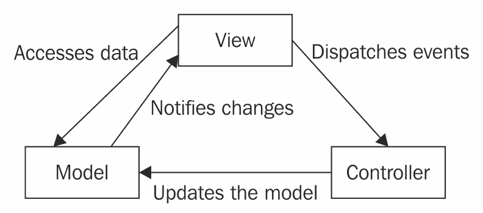
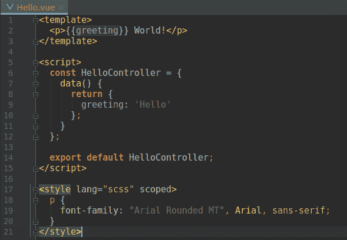
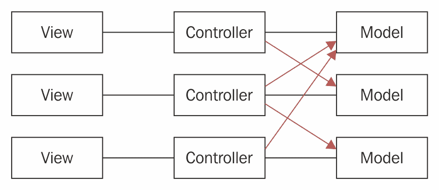
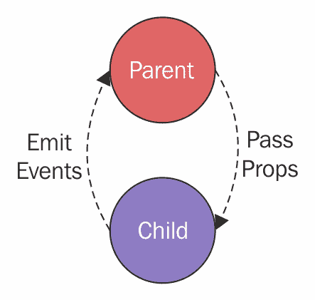
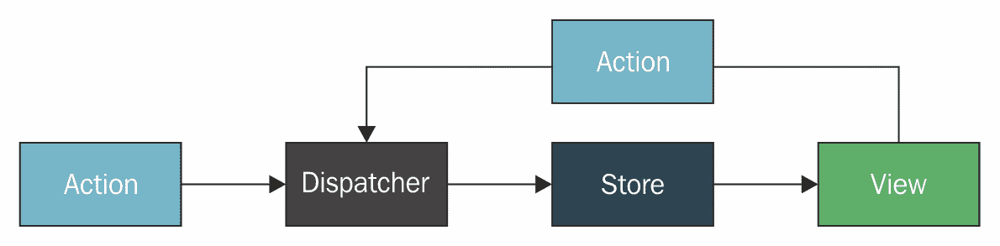
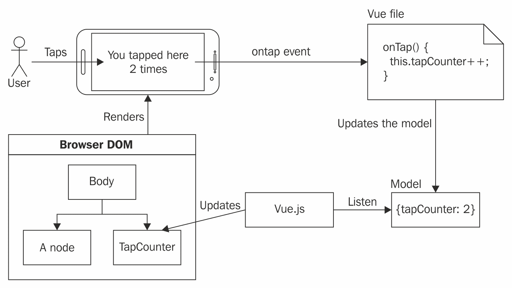
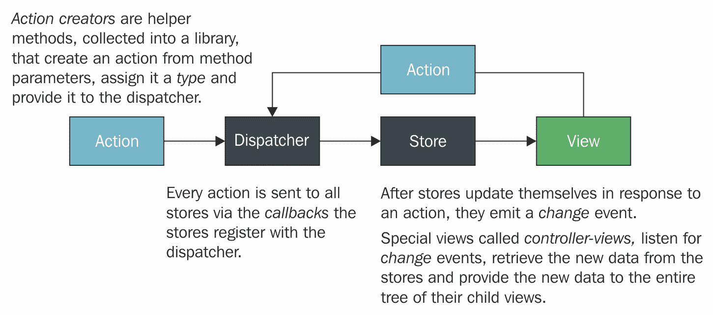

# 第一章：使用 Flux、Vue 和 Vuex 重新思考用户界面

我在 2007 年底开始了我的第一份工作，作为 Java EE 程序员。我仍然记得我的朋友 Giuseppe 说，“你不喜欢 JavaScript，对吧？”而我回答，“不，我不喜欢。每次我写 JavaScript 时，它都不在所有版本的 Internet Explorer 中工作...更不用说 Firefox 了！”他只是回答，“看看 jQuery。”今天，我喜欢称自己为 JavaScript 程序员。

从那时起，Web 开发已经发生了很大的变化。许多 JavaScript 框架变得流行，然后又因为新框架的出现而衰落。你可能认为学习新框架不值得，因为它们最终会失去人气。然而，在我看来，这并不正确。每个框架都为 Web 开发增添了有用的功能，这些功能我们仍在使用。例如，jQuery 利用了非常简单的 JavaScript，我们开始将客户端逻辑移动到浏览器，而不是在服务器端渲染一切。

今天，我们编写的是具有 Web 用户界面的复杂应用程序，即渐进式 Web 应用程序。这种复杂性需要纪律和最佳实践。幸运的是，像 Facebook、Google 和其他大公司这样的公司已经引入了框架和指南来帮助 Web 程序员。你可能听说过 Google 的*Material Design*或 Facebook 的*Flux*。

在本章中，我们将关注以下内容：

+   **模型-视图-控制器**（**MVC**）问题，以及使用 Facebook Flux 架构来解决这些问题

+   Flux 基础

+   什么是 Vuex

+   Flux 和 Vuex 之间的架构差异

要理解这本书，你需要对 Vue.js 和 JavaScript 有很好的了解，对 ECMAScript 6 有基本理解，以及对 webpack 有非常基本的了解。无论如何，这里使用的几乎所有概念，包括 Vuex，都得到了解释。

在解释 Flux 概念之后，这本书将帮助你理解 Vuex 如何实现这些概念，如何使用 Vue.js 和 Vuex 构建专业 Web 应用程序，以及最后如何扩展 Vuex 功能。

# MVC 问题和 Flux 解决方案

每当我们谈论具有用户界面的应用程序时，MVC 模式就会出现。但 MVC 模式是什么？它是一种将组件分为三部分的架构模式：一个**模型**、一个**视图**和一个**控制器**。你可以在以下图中看到描述 MVC 的经典图示：



图 1.0：经典 MVC 图示

大多数现代的渐进式 Web 应用程序框架都使用 MVC 模式。实际上，如果你看看以下图中显示的 Vue.js 单文件组件，你可以清楚地看到 MVC 模式的三个部分：



图 1.1：Vue.js 单文件组件

`template`和`style`部分代表视图部分，`script`部分提供控制器，控制器中的`data`部分是模型。

但是，当我们需要从另一个组件的模型中获取一些数据时会发生什么？此外，在一般情况下，我们如何将页面的所有组件相互连接？

显然，直接从其他组件访问组件的模型不是一个好主意。以下截图显示了暴露模型时的依赖关系：



图 1.2：MVC 地狱

Vue.js 提供了一种在父组件和子组件之间通信的好方法：你可以使用 P*rops* 从父组件传递值到子组件，你也可以从子组件 *emit* 数据到其父组件。以下图展示了这个概念的一个视觉表示：



图 1.3：Vue.js 父子通信

然而，当多个组件共享一个公共状态时，这种通信方式就不够了。以下是一些可能出现的问题：

+   多个视图可能共享同一块状态

+   来自不同视图的用户操作可能需要改变同一块状态

一些框架提供了一个名为 `EventBus` 的组件；实际上，Vue 实例本身就是一个 `EventBus`。它有两个方法：`Vue.$emit(event, [eventData])` 和 `Vue.$on(event, callback([eventData]))`。以下是如何创建一个全局事件总线的一个示例：

```js
// EventBus.js
import Vue from 'vue';
export const EventBus = new Vue();

// HelloWorldEmitter.js
import { EventBus } from './EventBus.js';
EventBus.$emit('an-event', 'Hello world');

// HelloWorldReceiver.js
import { EventBus } from './EventBus.js';
EventBus.$on('an-event', eventData => {
 console.log(eventData);
});
```

即使有全局事件总线，使组件通信也不是一件容易的事。如果一个注册了事件的组件在事件触发后加载，它将错过这个事件。如果这个组件在后来加载的模块中，这种情况很可能会发生在渐进式 Web 应用程序中，其中模块是按需加载的。

例如，假设用户想要将一个产品添加到购物车列表中。她点击了 *添加到购物车* 按钮，这个按钮很可能是位于 `CartList` 组件中，并且她期望屏幕上看到的那个产品被保存在购物车中。`CartList` 组件如何找出应该添加到其列表中的产品是什么？

嗯，看起来 Facebook 程序员也面临了类似的问题，为了解决这些问题，他们设计了他们称之为 *Flux* 的东西：用于构建用户界面的应用程序架构。

受到 Flux 和 Elm 架构的启发，Vue.js 的作者埃文·尤创建了 Vuex。你可能已经知道 Redux。在这种情况下，你会发现 Vuex 和 Redux 很相似，而且埃文·尤通过实现 Vuex 而不是强迫每个程序员在 Vue.js 应用程序中集成 Redux，为我们节省了时间。此外，Vuex 是围绕 Vue.js 设计的，以提供两个框架之间最佳集成。

但 Vuex 是什么？这就是下一节的主题。

# 什么是 Vuex？

埃文·尤定义 Vuex 为：

"*Vuex 是一个用于 Vue.js 应用程序的状态管理模式 + 库。它作为应用程序中所有组件的集中存储，并确保状态只能以可预测的方式被突变。"

在不了解 Flux 的情况下，这个定义听起来有点模糊。实际上，Vuex 是利用 Vue 的响应式系统实现的 Flux，使用单个集中式 store，并确保*状态只能以可预测的方式被修改*。

在专注于 Vuex 本身之前，我们将了解 Flux 的基本原理以及 Vuex 是如何从这些概念中汲取灵感的。

# 理解 Flux 的基本原理

Flux 是管理应用程序中数据流的一种模式，它是 Facebook 用于构建其 Web 应用程序的应用程序架构。以下图表显示了 Flux 的结构和数据流：



图 1.4：Flux 的结构和数据流

如前图所示，Flux 分为四个部分，并且*数据流仅有一个方向*。在接下来的章节中，我们将看到数据是如何通过以下部分流动的：

+   Actions

+   Dispatchers

+   Stores

+   视图

虽然了解 Flux 的工作原理很重要，但 Vuex 有自己的 Flux 架构实现，这与 Flux 不同，将在以下章节中详细解释。

# Actions

Actions 定义了应用程序的内部 API。它们代表可以做什么，但不是如何做。状态变更的逻辑包含在 stores 中。一个 action 只是一个具有类型和一些数据的简单对象。

Actions 应该对读者有意义，并且应该避免实现细节。例如，`remove-product-from-cart`比将其拆分为`update-server-cart`、`refresh-cart-list`和`update-money-total`更好。

一个 action 被分发到所有 store，并且可以导致多个 store 更新。因此，分发一个 action 将导致一个或多个 store 执行相应的 action 处理器。

例如，当用户点击*从购物车中移除*按钮时，会分发一个`remove-product-from-cart` action：

```js
{type: 'remove-product-from-cart', productID: '21'}
```

在 Vuex 中，动作系统略有不同，它将 Flux actions 分为两个概念：

+   Actions

+   Mutations

Actions 代表应用程序的行为，即应用程序必须做的事情。一个 action 的结果通常包括一个或多个被提交的 mutations。提交一个 mutation 意味着执行其关联的处理器。在 action 内部直接更改 Vuex 状态是不可能的；相反，actions 提交 mutations。

在 actions 内部，你必须处理异步代码，因为 mutations 必须是同步的。

另一方面，mutations 可以并且确实会修改应用程序状态。它们代表直接连接到应用程序状态的直接应用程序逻辑。mutations 应该是简单的，因为复杂的行为应该由 actions 处理。

由于 Vuex 中只有一个 store，因此 actions 是通过 store 分发的，action 与其处理器之间存在直接连接。另一方面，在 Flux 中，每个 store 都知道在响应 action 时应该做什么。

你将在接下来的章节中了解到 Vuex 动作/变异系统。现在，你只需要理解动作背后的概念，以及 Vuex 以略不同于 Flux 的方式实现动作。

# 分发器

每个应用程序只有一个分发器，它接收动作并将它们分发给商店。每个商店都接收每个动作。这是一个简单的动作分发机制，它可以通过以特定顺序向商店分发动作来处理商店之间的依赖关系。

例如：

1.  用户点击了*添加到购物车*按钮

1.  视图捕获这个事件并分发一个`添加到购物车`动作

1.  每个商店都接收这个动作

由于 Vuex 与 Flux 不同，因为分发器位于商店内部，所以你应该记住的是，应用程序中的每个变化都是从分发一个动作开始的。

# 商店

商店包含应用程序状态和逻辑。商店只能通过动作进行修改，不暴露任何设置方法。在 Flux 中可以有多个商店，每个商店代表应用程序中的一个领域。在 Vuex 中，只有一个商店，其状态被称为单一状态树。Vuex 不是唯一强制使用单个商店的框架：Redux 明确指出每个 Redux 应用程序都有一个商店。你可能认为单个商店可能会破坏模块化。我们将在稍后看到 Vuex 中模块化是如何工作的。

在切换到 Flux 架构之前，Facebook 聊天一直经历一个错误，即未读消息的数量不正确。他们不是有两个列表——一个是已读消息，另一个是未读消息——而是从其他组件的事件中推导出未读消息的数量。确实，有一个显式的状态，其中存储了所有信息会更好。将状态视为应用程序快照：你可以在应用程序页面关闭之前保存它，当应用程序再次打开时恢复它，这样用户会发现应用程序处于离开时的相同状态。

关于商店有三个重要概念：

+   商店只能通过动作进行修改

+   一旦商店被修改，它会通知视图它已经发生了变化

+   商店表示显式数据，而不是从事件中推导数据

这里是一个商店对之前示例中分发的`添加到购物车`动作做出反应的例子：

1.  商店接收了`添加到购物车`动作

1.  它决定这是相关的，并通过将当前产品添加到购物车产品列表来执行动作的逻辑

1.  它更新其数据，然后通知视图它已经发生了变化

# 视图

视图或视图控制器显示商店中的数据。这就是 Vue.js 等框架插入的地方。

# 在商店中渲染数据

在 Facebook 介绍 Flux 的视频中，软件工程师陈静谈到了他们在开发 Facebook Chat 时遇到的一些问题以及他们学到的经验教训。他们学到的其中一个有趣的教训是关于渲染的：他们不想重新渲染聊天中的所有消息，而是想通过仅更新聊天视图中的新消息来优化它。如果你是一个经验丰富的程序员，你可能认为这是“过早优化”。确实如此！将整个视图模型传递给视图，而不是只传递旧模型和新模型之间的差异，要简单得多。

假设一个程序员想要向一个视图添加一个新功能：如果视图模型每次修改时都由视图渲染，他们只需向模型添加一些属性，并在视图中添加一些代码来显示这些新属性。他们不需要担心更新/渲染逻辑。

但是，关于性能呢？仅仅因为未读消息的数量发生了变化，就重新渲染整个页面，这不是很糟糕吗？在这里，Vue.js 来帮助我们。程序员只需更新视图模型，Vue.js 就会理解发生了什么变化，并且只会重新渲染实际发生变化的**文档对象模型**（**DOM**）部分。以下图表概述了这一概念：



图 1.5：Vue.js 更新 DOM 节点

经验教训是这样的：花时间设计明确的、有意义的模型，让 Vue.js 负责性能和渲染逻辑。

**DOM**用于渲染网页。更多信息请见[`www.w3schools.com/js/js_htmldom.asp`](https://www.w3schools.com/js/js_htmldom.asp)。

# 存储和私有组件模型

由于视图显示来自存储的数据，你可能会认为视图模型只是存储的一部分。实际上，每个组件都可以有一个私有的模型，可以保存仅在该组件内部需要的值。没有必要将每个值都放入存储中。存储应只包含与应用程序相关的数据。

例如，假设你想要从列表中选择一些照片并分享它们。照片列表组件的视图模型将包含所选照片的列表，当用户点击分享按钮时，视图控制器只需分发一个名为`share-photos`的动作，并将所选照片列表作为`action`对象中的数据。不需要将所选照片列表放入存储中。

# 总结 Flux 架构

以下是将 Flux 架构总结在一张图中的内容：



图 1.6：Flux 数据流解释

# 使用 Flux 的好处

以下是一些 Facebook 在将 Flux 引入其 Web 应用程序后获得的一些好处：

+   比经典的 MVC 模式有更好的可扩展性

+   数据流易于理解

+   单元测试更简单、更有效

+   由于动作代表了应用程序的行为，因此以行为驱动的开发非常适合使用 Flux 架构编写应用程序。

通过将 Vuex 框架添加到您的`Vue.js`应用程序中，您将体验到同样的好处。此外，Vuex，就像 Redux 一样，以几种不同的方式简化了这种架构，例如每个应用程序使用一个存储库，并且为了使用存储库来分发动作，从过程中移除了分发器。

# 摘要

在本章中，我们探讨了为什么 Facebook 工程师设计了 Flux 架构。我们关注了 Flux 的基本原理，并了解到 Vuex 与 Flux 略有不同。现在我们可以用一句话来概括 Flux：Flux 是一个具有单向数据流的可预测状态管理系统。

在第二章《使用 Vuex 实现 Flux 架构》中，您将学习 Vuex 的核心概念，以及如何在您的应用程序中使用 Vuex。
