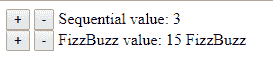

# 第二章：使用 Vuex 实现 Flux 架构

在我们心中明确了 Flux 概念之后，我们现在将探索 Vuex 框架，了解它是如何工作的，并通过一些示例，看看您如何在 Vue 应用程序中使用 Vuex。

本章将涵盖以下主题：

+   Vuex 快速浏览

+   将用于运行示例的样板代码

+   Vue.js 反应性系统解释

+   理解 Vuex 的核心概念

+   在开发时启用严格模式以防止意外直接修改状态

+   使用 Vuex 处理表单时的限制

+   简单计数器：一个非常简单的示例中包含的所有 Vuex 概念

第一部分向您介绍了 Vuex，重点介绍了框架背后的概念。

在第二部分，您将看到一个最小的 HTML 代码，用于运行本章的示例。

在第三部分，Vue 反应性系统被详细审查。这很有用，因为 Vuex 利用这个反应性系统无缝地将其本身插入到 Vue 应用程序的架构中。

在第四部分，所有 Vuex 核心概念都得到了彻底的审查，通过代码片段的帮助，您将看到 Vuex 既有强大的功能又易于使用。

第五和第六部分将解释在使用 Vuex 在您的应用程序中时需要记住的一些概念。

最后，在本章的最后部分，一个简单的示例将向您展示如何将 Vuex 的大多数概念组合在一个单独的 HTML 文件中，帮助您理解整体情况。

一旦您阅读了本章，您将对 Vuex 框架有一个清晰的理解，并且您将准备好开始使用它。

# 技术要求

您需要在系统上安装 Node.js。最后，为了使用本书的 Git 仓库，用户需要安装 Git。

本章的代码文件可以在 GitHub 上找到：

[`github.com/PacktPublishing/Vuex-Quick-Start-Guide/tree/master/chapter-2`](https://github.com/PacktPublishing/Vuex-Quick-Start-Guide/tree/master/chapter-2)

查看以下视频以查看代码的实际运行情况：

[`goo.gl/2zXEav`](https://goo.gl/2zXEav)

# Vuex 快速浏览

在第一章《用 Flux、Vue 和 Vuex 重新思考用户界面》中，我们将 Vuex 定义为 *一个用于 Vue.js 应用的状态管理模式 + 库。它作为应用程序中所有组件的集中式存储，有规则确保状态只能以可预测的方式变异*。

虽然我认为，在阅读了第一章《用 Flux、Vue 和 Vuex 重新思考用户界面》之后，*Rethinking User Interfaces with Flux, Vue and* 的定义应该对您来说已经足够清晰，但它仍然有点模糊。让我们列出前述句子中包含的三个概念：

+   集中式存储

+   状态只能以可预测的方式进行变异的事实

+   Vue 反应性系统

如果您回顾一下第一章中“Flux 架构总结”部分的*图 1.6*，在*用 Flux、Vue 和 Vuex 重新思考用户界面*，您会看到 Flux 架构有一个分发器，它会将动作分发到每个存储中。只有一个存储意味着分发器可以在存储内部，并且您可以使用集中式存储来分发动作。在 Vuex 中，我们有一个单一存储，其状态被称为**单一状态树**。

在 Flux 和 Vuex 中的一个基本规则是，状态只能因为动作而更改。没有任何组件、类或代码应该修改状态。只有与动作相关联的代码实际上可以更改状态值。Vuex 通过只能由动作执行的突变来实现这一点。在这方面，Vuex 与 Flux 不同。在 Flux 中，动作只是包含要执行的动作信息的简单数据对象。在 Vuex 中，动作可以执行最终提交一个或多个将更改状态的突变的代码。您将在本章后面阅读有关突变和动作的内容。

最后，在动作已分发并且状态已更新后，必须通知应用程序的视图哪些内容已更改。这是通过利用 Vue 响应性系统来完成的，这是下一节的主题。

# 示例的样板代码

在接下来的几页中，您将获得一些示例。为了执行这些示例，您需要创建一个如下所示的 HTML 文件：

```js
<!DOCTYPE html>
<html lang="en">
<head>
  <meta charset="UTF-8">
  <title>Vuex condensed example</title>
</head>
<body>
<div id="app"></div>
<script src="img/vuex.min.js"></script>
<script src="img/vue.min.js"></script>
<script>
  Vue.use(Vuex);

 // Add code from examples here

</script>
</body>
</html>
```

通过复制`<script>`标签内的示例代码，您可以运行它并查看结果。几乎每个示例代码都可以在本书的 Git 仓库中找到，位于`/chapter-2/`文件夹下。

# Vue.js 响应性系统解释

Vue 的一个强大功能是其响应性系统。它是一种不侵入的方式来检测组件模型的变化。组件模型只是一个普通的 JavaScript 对象。当它发生变化时，Vue 会检测这些变化并更新相应的视图。在 Vuex 中，单一的状态树是响应的，就像 Vue 组件的`data`部分一样。

理解响应性系统的工作原理对于避免一些常见的错误非常重要。

有两种方法可以检测 JavaScript 对象内部的一个值是否已更改：

+   通过使用在 ECMAScript 2015（第 6 版，ECMA-262）中定义的`Proxy`功能

+   通过使用在 ECMAScript 2011（第 5.1 版，ECMA-262）中定义的`Object.defineProperty`

由于兼容性原因，Vue 决定使用`Object.defineProperty`，这意味着存在一些限制。

当您创建一个组件时，Vue 会遍历`data`部分的所有属性，并使用`Object.defineProperty`将它们转换为`getter`/`setter`方法。因此，Vue 只能检测到在组件的`data`部分中定义的属性的变化。让我们看一个例子：

```js
// Bugged example of counter
Vue.use(Vuex);
const CounterComponent = {
  template: `
  <div>
   <p>I will count from 1 to {{end}}.</p>
   <button @click="beginCounting">Begin!</button>
   <p>{{counter}}</p>
  </div>
  `,
  created() {
    this.counter = 0;
  },
  data() {
    return {
      end: 3,
      // you should add counter property here
    };
  },
  methods: {
    beginCounting() {
      this.counter = 0;
      const increaseCounter = () => {
        this.counter++;
        if (this.counter < this.end) {
          setTimeout(increaseCounter, 1000);
        }
      };
      increaseCounter();
    },
  },
};

new Vue({
  el: '#app',
  template: '<counter></counter>',
  components: {
    counter: CounterComponent,
  },
});
```

在这个例子中，`counter`属性没有在组件的`data`部分中声明。这阻止 Vue 检测到`counter`已被更改，因此，当用户点击按钮“开始！”时，他们将看不到计数器的增加。

这可以通过在`data`部分添加`counter`并从`created()`方法中移除它来轻松修复。看看以下代码：

```js
data() {
  return {
      end: 3,
      counter: 0
  };
},
```

你可以在本书的 Git 仓库中找到前述示例的代码，位于`chapter-2/counterTo3/counter.html`文件中。

当使用`数组`时，Vue 无法检测以下更改：

+   直接使用索引设置值——例如，`this.items[indexOfItem] = newItem`

+   改变数组长度——例如，`this.items.length = newLength`

为了避免这些问题，你可以创建一个新的数组并将其分配给相应的数据属性，或者使用数组方法，例如`push()`或`splice()`。以下是一些更新 Vue 观察到的数组的不同方法：

```js
// Replacing the array
this.items[1] = updatedItem;
this.items = this.items.slice();

// Using splice to change element at index 1
this.items.splice(1,1,updatedItem);

// Adding a new item
this.items.push(newItem);
```

我们现在明白，每次我们正确地更改组件模型或单个状态树内部的某个东西时，Vue 都会检测到并相应地更新视图。但性能如何？每次修改都更新视图不是不好吗？实际上，Vue 利用 JavaScript 事件循环的工作原理来排队所有视图的更新。为了理解这个概念，让我们关注以下示例：

```js
console.log('start');
Promise.resolve().then(() => console.log('promise'));
setTimeout(() => console.log('timeout'), 0);
console.log('end')
```

预期输出（可能因不同浏览器而异）如下：

```js
start
end
promise
timeout
```

首先，JavaScript 虚拟机执行打印`start`和`end`的同步代码，然后执行执行期间排队的所有任务，打印`promise`和`timeout`。

如果用户浏览器上有`Promise`，Vue 将使用`Promise`；否则，它会尝试找到最佳调度函数，如果没有找到其他支持的调度函数，则回退到`setTimeout`。今天，`Promise`几乎在所有浏览器、移动设备和桌面设备上都得到了支持。

# 理解 Vuex 的核心概念

现在是时候介绍 Vuex 架构了，它由五个核心概念组成：

+   单一状态树

+   获取器

+   变更

+   动作

+   模块

每个概念都将进行详细讨论，并提供一些代码片段以帮助使其清晰。一旦你阅读了以下页面，你将对 Vuex 架构有一个清晰的理解。

# 理解 Vuex 存储

Vuex 使用单一状态树实现 Flux 存储。在这方面，它与 Flux 不同，因为在 Flux 中可能有多个存储。你可能认为单个存储/状态对模块化来说不是很好。稍后我们将看到如何将单一状态树拆分为模块。

只有一个存储有一些好处：

+   它在所有组件中可用

+   由于所有应用程序状态都在那里，因此更容易调试

+   你可以编写无干扰的插件来监视状态并执行操作，例如持久化状态以供以后检索

单一状态树包含所有应用级别的数据——它代表了应用领域模型。

# 在组件内部访问单一状态树

现在我们通过一个示例来看看如何在 `Vue` 组件中使用这个单一状态树。假设我们想在聊天会话中显示未读消息的数量。在应用的某个地方，这个数字会被更新，而 `NumUnreadMessages` 组件会显示这个数字。以下是一个组件可能被编码的示例：

```js
const NumUnreadMessages = {
  template: `<div>Unread: {{ unreadCounter }}</div>`,
  computed: {
    unreadCounter() {
      return this.$store.state.unreadCounter;
    },
  },
};
```

如你所见，这很简单——你只需要使用 `this.$store.state` 来访问应用状态。为了在 Vue `components` 中使用 `this.$store`，你需要将存储添加到 `Vue` 应用中：

```js
Vue.use(Vuex);
const store = new Vuex.Store({
 state: {
 unreadCounter: 1,
  },
});

const NumUnreadMessages = {
  template: `<div>Unread: {{ unreadCounter }}</div>`,
  computed: {
    unreadCounter() {
      return this.$store.state.unreadCounter;
    },
  },
};

const app = new Vue({
  el: '#app',
  store,
  components: {NumUnreadMessages},
  template: `
  <div class="app">
    <num-unread-messages></num-unread-messages>
  </div>
`,
});
```

你可以在本书的 Git 仓库中找到这个示例的代码，在文件 `chapter-2/unread-messages/unread.html` 中。

# `mapState` 辅助函数

每次想要访问状态时创建一个计算属性可能会很繁琐且冗长，尤其是如果组件需要多个状态属性。

幸运的是，Vuex 提供了一个方便的工具，称为 `mapState`：

```js
const NumUnreadMessages = {
  // ...
  computed: Vuex.mapState({
      unreadCounter: state => state.unreadCounter,
  })
}
```

在前面的代码中，计算属性 `unreadCounter` 被映射到 `this.$store.state.unreadCounter`。由于 `mapState` 没有很好地记录，我将解释你可以使用它的所有方法。

+   你可以使用函数，如下面的代码所示：

```js
   // Using functions with mapState
    const NumUnreadMessages = {
     data() {
       return {label:' unread messages'};
     },
     computed: mapState({
       unreadCounter: state => state.unreadCounter,
       unreadCounterPlusLabel(state) {
         // Here you can use *this* keyword to access
         // the local state of the component.
         return state.unreadCounter + this.label;
       }
     })
   }
```

`unreadCounter` 是一个箭头函数，而 `unreadCounterAlias` 是一个普通函数。如果你想访问组件的局部状态，你必须使用一个函数而不是箭头函数；否则，你无法在箭头函数内部使用 `this` 关键字。

+   你可以使用 `strings`，如下面的代码片段所示：

```js
   // Using strings
   computed: mapState({
     // Equivalent to unreadCounter: state => state.unreadCounter
     unreadCounter: 'unreadCounter'
   })
```

+   最后，如果 `state` 属性的名称和 `computed` 属性的名称相同，有一个更简洁的方法可以使用：

```js
   // Using string array
   computed: mapState([
     // map this.unreadCounter to store.state.unreadCounter
     'unreadCounter'
   ])
```

在这种情况下，你只需要将一个字符串数组传递给 `mapState`，其中每个字符串都是你想要映射的 `state` 属性的名称。

你可能会想知道如何将本地计算属性与来自 `mapState` 的属性混合。以下是一个使用 ECMAScript 6 对象扩展运算符的示例：

```js
  computed: {
   localComputed () {
     // returning localProperty declared into data section
     return this.localProperty;
    },
   ...mapState([
     'unreadCounter'
   ])
 }
```

ES6 对象扩展运算符 `...` 的使用在程序员中还不是特别普遍，尤其是在与对象一起使用时。如果你对这个运算符感到陌生，请看以下示例：

```js
  const obj = {b:'b', c:'c'};
  console.log({a:'a', ...obj , d:'d'});
  // prints {a: "a", b: "b", c: "c", d: "d"}
```

# 组件的局部状态

即使存在全局单一状态树，这并不意味着组件不能有局部状态。全局状态是应用级别的，不应该被组件的私有状态所污染。例如，组件的文本部分可能只会在组件内部使用，因此它们不应该被放入应用状态中。

# 使用 getters 计算派生状态

有时两个或多个组件需要基于状态内部的值派生状态。你可以在每个组件内部计算派生状态，但这意味着代码的重复，这是不可接受的。为了避免这种情况，你可以创建一个外部函数或实用类来计算派生状态，这比重复代码要好。然而，Vuex 提供了 getter 函数，这样我们就可以在应用程序存储中编写派生状态代码，避免所有这些不必要的步骤。

例如，假设应用状态包含一个消息列表，并且当新消息添加到该列表时，它会被标记为`未读`。然后我们可以编写一个`getter`函数，返回所有未读消息：

```js
const store = new Vuex.Store({
  state: {
    messages: [
      { id: 1, text: 'First message', read: true },
      { id: 2, text: 'Second message', read: false },
    ],
  },
  getters: {
    unreadMessages(state) {
      return state.messages.filter(message => !message.read);
    },
  },
});
```

`getter`函数也接收所有`getters`作为第二个参数：

```js
getters: {
  // ...
  unreadCounter(state, getters) => {
    return getters.unreadMessages.length;
  }
}
```

我们现在可以使用`getter`函数更新未读消息的示例：

```js
Vue.use(Vuex);
const store = new Vuex.Store({
  state: {
    messages: [
      { id: 1, text: 'First message', read: true },
      { id: 2, text: 'Second message', read: false },
    ],
  },
  getters: {
    unreadMessages(state) {
      return state.messages.filter(message => !message.read);
    },
    unreadCounter(state, getters) {
      return getters.unreadMessages.length;
    },
  },
});

const NumUnreadMessages = {
  template: `<div>Unread: {{ unreadCounter }}</div>`,
  computed: {
    unreadCounter() {
      return this.$store.getters.unreadCounter;
    },
  },
};

new Vue({
  el: '#app',
  store,
  components: { NumUnreadMessages },
  template: `
  <div class="app">
    <num-unread-messages></num-unread-messages>
  </div>
`,
});
```

你可以在本书的 Git 仓库中找到以下示例的代码，位于名为`chapter-2/unread-messages/unread-with-getters.html`的文件中。

`Getter`函数也可以接收参数，这使得它们在执行有关状态的查询时非常有用。为了接收参数，`getter`函数必须返回一个接收参数的函数。看看以下示例：

```js
getters: {
  // ...
  getMessageById(state) {
    return (id) => {
 return state.messages.find(msg => msg.id === id);
 }
  }
}
```

至于状态，有一个`mapState`辅助函数。对于`getters`，有一个`mapGetters`辅助函数。

# `mapGetters`辅助函数

`mapGetters`辅助函数简单地将存储`getters`映射到本地计算属性：

```js
const NumUnreadMessages = {
  template: `<div>Unread: {{ unreadCounter }}</div>`,
  computed: Vuex.mapGetters(['unreadCounter']),
};
```

关于`mapState`，我们可以使用一个数组来列出所有我们想要映射到相应计算属性的`getters`属性。

如果计算属性的名称与`getter`名称不同，你可以使用一个对象而不是一个数组：

```js
...mapGetters({
  // map `this.numUnread` to `store.getters.unreadCounter`
  numUnread: 'unreadCounter'
```

你可以在本书的 Git 仓库中找到这个更新示例的代码，位于名为`chapter-2/unread-messages/unread-with-getters-and-mapgetters.html`的文件中。

# 使用变更更改应用程序状态

到目前为止，我们只看到了如何检索应用状态。现在是时候介绍变更了。使用变更是你唯一可以更改状态的方法。如果你还记得，Flux 只允许动作变更状态。在 Vuex 中，动作被分为动作和变更。我们将在稍后介绍动作——在这里，我们将专注于变更以及我们如何使用 Vuex 来更改状态。

为了更改状态，你需要提交一个变更。变更类似于事件：你声明变更，这是一种事件类型，并将变更链接到一段代码，这就像事件处理器。从这个角度来看，Vuex 可以被视为`EventBus`模式的演变，该模式在第一章中讨论，*用 Flux、Vue 和 Vuex 重新思考用户界面*，作为 MVC 组件之间通信的可能解决方案。

变更（Mutations）是在提供给`Vuex.Store(...)`函数的`config`对象的`mutations`部分声明的：

```js
const store = new Vuex.Store({
  state: {
    messages: []
  },
  mutations: {
    addNewMessage (state, msgText) {
      // mutating the state
      state.messages.push({text: msgText, read: false});
    }
  }
})
```

# 提交一个变更

你不能直接调用突变处理函数。相反，你可以使用`store.commit(mutationName, payload)`提交突变。例如：

```js
store.commit('addNewMessage', 'A message');
```

这将在应用程序状态中的`messages`数组中添加一条消息。

`payload`参数可以是原始类型或具有突变所需所有属性的对象。

你也可以使用对象风格的提交，如下例所示：

```js
store.commit({
  type: 'addNewMessage',
  content: 'A message'
});
```

由于突变会改变响应式状态，因此建议遵循以下最佳实践：

+   初始化状态的所有属性，以便它们代表应用程序的初始状态

+   确保当你修改或添加新属性到状态时，`Vue`将检测到修改，如本章反应性部分所述。

以下是一个完整的示例，其中用户可以添加消息并查看消息列表：

```js
Vue.use(Vuex);
const store = new Vuex.Store({
  state: {
    messages: [],
  },
  mutations: {
    addNewMessage(state, msgText) {
      state.messages.push({ text: msgText, read: false });
    },
  },
});

const MessageList = {
  template: `<ul>
      <li v-for="message in messages">{{message.text}}</li>
    </ul>
  `,
  computed: Vuex.mapState(['messages']),
};

const MessageEditor = {
  template: `<div>
    <input type="text" v-model="message">
    <button @click="addMessage">Add message</button>
  </div>
  `,
  data() {
    return {
      message: '',
    };
  },
  methods: {
    addMessage() {
      this.$store.commit('addNewMessage', this.message);
    },
  },
};

new Vue({
  el: '#app',
  store,
  components: { MessageList, MessageEditor },
  template: `
  <div class="app">
    <message-editor></message-editor>
    <message-list></message-list>
  </div>
`,
});
```

# 使用常量字符串枚举突变类型

每次你想提交突变时，都需要编写你想要执行突变类型的类型。在代码中分散字符串被认为是不良实践，并具有以下缺点：

+   这是有风险的：在输入突变类型时可能会出现拼写错误或错误的字母大小写。

+   重命名类型很困难，因为你必须搜索代码中该字符串的所有出现

+   不清楚突变来自哪个模块

由于这些原因，最好使用常量字符串来定义所有突变类型。使用大写字母可以防止错误的字母大小写，而使用常量变量可以让大多数编辑器突出显示出现。此外，编辑器通常提供一种重命名变量的方式，例如字符串常量，这使得重命名突变变得容易。

突变类型应该在包含应用程序所有可能突变（或如果应用程序分为模块，则为模块的所有可能突变）的文件中定义。这样，更容易理解应用程序状态可能受到的所有变化。实际上，如果你记得，Vuex 承诺状态将以可预测的方式改变。假设一个新程序员参与你的项目。你可以坐在他们旁边，开始解释应用程序的功能。你很快会发现，他们可以在没有你的帮助下理解用户执行操作时发生的事情。实际上，他们只需要跟随从在`Vue`组件内部触发的动作到相应的状态突变的流程。

以下是一个说明如何使用常量突变类型的示例：

```js
// mutation-types.js
export const ADD_NEW_MESSAGE = 'addNewMessage';

// store.js
import Vuex from 'vuex';
import { ADD_NEW_MESSAGE } from './mutation-types';

const store = new Vuex.Store({
  state: { ... },
  mutations: {
    [ADD_NEW_MESSAGE] (state, msgText) {
      state.messages.push({text: msgText, read: false});
    }
  }
});
```

# 突变必须是同步的

使用 Vuex 时的重要规则是*突变处理函数必须是同步的*。不幸的是，这不能通过 JavaScript 语言强制执行，因此 Vuex 不能确保你遵循此规则。这意味着这是一项最佳实践，在编写应用程序代码时必须遵循。

以下是一个违反此规则的示例：

```js
// Violation of rule "mutations handlers must be synchronous"
mutations: {
  updateBookDetailsById(state, partialBookData) {
    state.currentBook = partialBookData;
    const {bookId} = partialBookData;
    api.getBookDetailsById(bookId, (bookDetails) => {
      state.currentBook = bookDetails;
    });
  }
}
```

在这个例子中，首先使用书籍的一些部分数据设置`state.currentBook`，然后，当服务器提供请求的书籍详细信息时，`state.currentBook`状态会使用所有书籍的详细信息进行更新。

尽快显示书籍数据是一个好主意。我们不希望用户在服务器提供所有请求的信息之前看到空白页面。但是异步性必须在其他地方处理——更确切地说，在`action`内部。

但在前面的例子中可能会发生什么？在最佳情况下，书籍的部分数据会被显示，然后几秒钟后，所有书籍的详细信息都会显示出来。但是`api.getBookDetailsById(...)`可能需要比预期更长的时间，甚至可能失败。在这些最后的情况下，结果将是一个不一致的应用程序状态。如果`state.currentBook`在服务器提供书籍详细信息之前被用户修改了怎么办？

为了避免这些问题，当提交突变时，应用程序状态必须以同步方式从一个定义良好的状态移动到另一个定义良好的状态。

# mapMutations 辅助函数

对于状态和获取器，有一个辅助函数可以节省我们一些按键。

可以使用`mapMutations`辅助函数重构用户可以添加消息的示例，如下所示：

```js
const MessageEditor = {
  template: `<div>
    <input type="text" v-model="message">
    <button @click="addNewMessage(message)">Add message</button>
  </div>
  `,
  data() {
    return {
      message: '',
    };
  },
  methods: Vuex.mapMutations([
    // Payload is also supported
    'addNewMessage'
  ]),
};
```

在这种情况下，`mapMutations(...)`创建了一个`addNewMessage`方法，当执行时，它会调用`this.$store.commit(ADD_NEW_MESSAGE, payload)`。

你可以在`chapter-2/add-message`文件夹中找到前面例子的代码，包括和不包括`mapMutations`。

# 在动作中提交突变

如前所述，Vuex 将 Flux 动作分为突变和动作。突变必须是同步的，因此动作是编写异步代码的地方。想法是突变是定义良好的状态修改，动作提交突变以更改应用程序状态。例如，一个动作可以请求从服务器获取一些数据，当服务器响应时，使用它刚刚获得的数据提交一个突变。

简而言之，动作可以通过提交突变来改变状态，并且可以执行异步操作。

# 动作声明

让我们看看如何在`Vuex`存储中声明动作：

```js
const store = new Vuex.Store({
  state: {
    messages: [],
  },
  mutations: {
    addNewMessage(state, msgText) {
      state.messages.push({ text: msgText, read: false });
    },
  },
  actions: {
    addMessage(context, msgText) {
      API.addMessage(msgText).then(() => {
        context.commit('addNewMessage', msgText);
      });
    },
  },
});
```

与用于突变的类似方式，要声明一个动作，你需要在提供给`Vuex`存储的`config`对象的`actions`部分中编写动作方法。

动作接收一个`context`对象和动作有效负载。`context`对象包含一个`commit(...)`方法和`state`属性，它是应用程序状态。

在前面的例子中，`addMessage(...)`动作将消息文本发送到一个假设的服务器，并在服务器响应后，提交相应的突变。

# 分发一个动作

如果你记得，Flux 有一个单一的分发器，将动作分发到每个存储。Vuex 也是这样，只是有一个单一的存储，它也是一个分发器。这意味着可以使用存储来分发动作，如下面的代码所示：

```js
store.dispatch('addNewMessage', 'A message');
```

在以下代码中，我将 `添加消息` 示例更新为使用 `addMessage` 动作而不是直接使用 `addNewMessage` 变异：

```js
Vue.use(Vuex);

// Server API mock
const API = {
  addMessage: () => Promise.resolve()
};

const store = new Vuex.Store({
  state: {
    messages: [],
  },
  mutations: {
    addNewMessage(state, msgText) {
      state.messages.push({ text: msgText, read: false });
    },
  },
  actions: {
    addMessage(context, msgText) {
      API.addMessage(msgText).then(() => {
        context.commit('addNewMessage', msgText);
      });
    },
  },
});

const MessageList = {
 // ...
};

const MessageEditor = {
  template: `<div>
    <input type="text" v-model="message">
    <button @click="addMessage">Add message</button>
  </div>
  `,
  data() {
    return {
      message: '',
    };
  },
  methods: {
    addMessage() {
 this.$store.dispatch('addMessage', this.message);
 },
  },
};

new Vue({
 // ...
});
```

您现在可能正在想，肯定有一些辅助函数可以派发动作...事实上，确实有！

# mapActions 辅助函数

与其他辅助函数类似，`mapActions` 辅助函数可以在 `Vue` 组件的 `methods` 部分中使用。语法与其他辅助函数相同：

```js
const MessageEditor = {
  template: `<div>
    <input type="text" v-model="message">
    <button @click="addMessage(message)">
      Add message
    </button>
  </div>
  `,
  data() {
    return {
      message: '',
    };
  },
  methods: Vuex.mapActions(['addMessage']),
  // Or you can use the Object syntax
  // methods: Vuex.mapActions({ addMessage: 'addMessage' }),
};
```

# 使用模块实现更好的可扩展性

Vuex 的单一状态树可以被分割成模块。当应用程序变得更大，并且您想要将应用程序分割成功能组时，这很有用。这样做还可以让您在页面加载时只加载核心功能，并允许您稍后加载其他功能。这样，您可以大大减少加载时间，尤其是在连接速度慢或应用程序在低端手机上运行时。JavaScript 虚拟机解析所有 JavaScript 代码需要时间，因此提供一个包含所有应用程序代码的单个大型文件将需要几秒钟来解析，给移动用户留下应用程序运行缓慢且沉重的印象。

在 Vue/Vuex 中结合使用的一个好工具是 webpack，它允许您将应用程序分割成包。一个 webpack 包可以包含一个或多个 Vuex 模块，一个模块可以在另一个模块之后加载。您可以在 [`webpack.js.org/`](https://webpack.js.org/) 找到更多关于 webpack 的信息。

应用程序状态树可以被分割成模块，每个模块又可以分割成子模块。让我们看看如何编码实现这一点：

```js
const subModule = {
  state: { ... },
  mutations: { ... },
  actions: { ... }
};

const moduleA = {
  state: { ... },
  mutations: { ... },
  actions: { ... },
  getters: { ... },
  modules: {
    sub: subModule
  }
};

const moduleB = {
  state: { ... },
  mutations: { ... },
  actions: { ... }
};

const store = new Vuex.Store({
  modules: {
    a: moduleA,
    b: moduleB
  }
});

store.state.a // -> `moduleA`'s state
store.state.a.sub // -> `subModule`'s state
store.state.b // -> `moduleB`'s state
```

如您所见，传递给 `new Vuex.store({})` 的对象只是您应用的根模块，在根模块或任何其他模块内部，您可以声明其他模块。

# 模块本地状态

传递给 `mutations`、`actions` 和 `getters` 的状态对象是本地模块状态。这样，子模块不需要知道它位于另一个模块内部。

但如果一个子模块想要访问父模块呢？`rootState` 是在 `actions` 和 `getters` 中提供的，这样你就可以从 `rootState` 导航到所需的模块。让我们看看怎么做：

```js
const moduleA = {
  // ...
  actions: {
    incrementIfOddOnRootSum ({ state, commit, rootState }) {
      if ((state.count + rootState.count) % 2 === 1) {
        commit('increment');
      }
    }
  },
  getters: {
    sumWithRootCount (state, getters, rootState) {
      return state.count + rootState.count;
    }
  }
}
```

重要的是要注意，在动作内部，`rootState` 是传递给动作的参数 `context` 的一个属性，而在获取器内部，`rootState` 作为第三个参数传递。

# 带有命名空间的模块

不同模块之间可能存在名称冲突。为了避免这种情况，并创建可重用的模块，你可以将模块的 `namespaced` 属性设置为 `true`。以下是一个 `namespaced` 模块的示例：

```js
modules: {
 auth: {
  namespaced: true,
  state: { ... }, // Already nested, not affected by namespace
  mutations: {
    setLogged() {...} // -> commit('auth.setLogged')
  },
  actions: {
    login(){...} // -> dispatch('auth/login')
  },
  getters: {
    logged() {...} // -> getters['auth/logged']
  }
};
```

当 `namespaced` 属性设置为 `true` 时，模块内部的代码不会改变。改变的是想要使用另一个 `namespace` 模块的代码。看看以下示例：

```js
modules: {
  foo: {
    namespaced: true,
    getters: {
      someGetter (state, getters, rootState, rootGetters) {
        getters.someOtherGetter // -> 'foo/someOtherGetter'
        rootGetters.someOtherGetter // -> 'someOtherGetter'
      },
      someOtherGetter: state => { ... }
    },
    actions: {
      someAction ({dispatch, commit, getters, rootGetters}) {
        getters.someGetter // -> 'foo/someGetter'
        rootGetters.someGetter // -> 'someGetter'

        dispatch('someOtherAction'); //->'foo/someOtherAction'

        // -> 'someOtherAction'
        dispatch('someOtherAction', null, { root: true });

        commit('someMutation') // -> 'foo/someMutation'

        // -> 'someMutation'
        commit('someMutation', null, { root: true }) 
      },
      someOtherAction (ctx, payload) { ... }
    }
  }
}
```

要提交另一个模块的突变或分发动作，你需要将 `{ root: true }` 作为第三个参数添加。还有一个 `rootGetters` 参数，它被提供给 `actions` 处理器或 `getters` 函数。

最后，当使用 Vuex 辅助函数时，你需要按照以下方式指定命名空间：

```js
computed: {
  ...mapState('some/nested/module', {
    a: state => state.a,
    b: state => state.b
  })
},
methods: {
  ...mapActions('some/nested/module', [
    'foo',
    'bar'
  ])
}
```

或者，你可以使用 `createNamespacedHelpers(nameSpace)` 函数创建命名空间辅助函数，该函数返回一个对象中的所有辅助函数。这些辅助函数绑定为你提供的第一个参数的命名空间。以下是如何使用 `createNamespacedHelpers` 的示例：

```js
const { mapState, mapActions } = 
    Vuex.createNamespacedHelpers('some/nested/module');

export default {
  computed: {
    // look up in `some/nested/module`
    ...mapState({
      a: state => state.a,
      b: state => state.b
    })
  },
  methods: {
    // look up in `some/nested/module`
    ...mapActions([
      'foo',
      'bar'
    ])
  }
};
```

在本章末尾，你将找到一个将 `namespace` 参数设置为 `true` 的两个模块的示例。

# 动态模块注册

使用 `store.registerModule(...)` 方法在 Vuex store 创建后注册模块是可能的。以下是如何注册模块的示例：

```js
// register a module `myModule`
store.registerModule('myModule', {
  // ...
})

// register a nested module `nested/myModule`
store.registerModule(['nested', 'myModule'], {
  // ...
})
```

这在模块异步加载时特别有用。

```js
// Loading module asynchronously
// index.js
Vue.use(Vuex);

const store = new Vuex.Store({
  state: {
    currentView: 'initial'
  },
});

Vue.component('initial', {
  template: '<div>initial</div>',
});

import ('./loaded-later-moudle.js').then((module) => {
  module.default(store);
});

new Vue({
  el: '#app',
  template: '<component :is="$store.state.currentView"/>',
  store,
});
```

以下为 `loaded-later-moudle.js` 文件代码，该文件在 `index.js` 中加载：

```js
// loaded-later-moudle.js
export default function moduleFactory(store) {
  Vue.component('later', {
    template: '<div>later</div>',
  });

  store.registerModule('loadedLater', {});

  setTimeout(() => {
    store.state.currentView = 'later';
  }, 500);
}
```

在前面的示例中，根模块定义了一个 `currentView` 属性，该属性指向 `initial` 组件。使用动态导入语法，我们导入 `loaded-later-moudle.js` 文件，并在它加载后执行替换 `currentView` 值的模块代码，导致显示 `later` 组件。

以下示例在支持动态导入语法的浏览器中有效，或者你可以使用 webpack 来构建它。

你也可以使用 `store.unregisterModule(moduleName)` 方法注销动态加载的模块。静态加载的模块不能被注销。

# 模块重用

与 Vue `组件` 类似，为了重用模块，状态声明需要是一个返回状态的函数，而不是一个普通对象。否则，状态对象将在所有模块用户之间共享。这种情况可能发生在以下两种情况中：

+   在多个 store 使用同一模块的情况下

+   在同一 store 中同一模块被注册超过一次

第一种情况不太可能发生，因为 Vuex 使用单个 store。此外，尽管每个 Vue 实例只能注册一个 store，但你总是可以创建多个 store。

如果模块是通用模块并且依赖于某些参数，第二种情况很可能会发生。与类可以有构造函数参数一样，可以使用带有参数的工厂方法创建模块。例如，假设你有两个相似的 RESTful API，并且创建了一个通用 API 模块，以便该模块可以用于这两个 API。在这种情况下，你将使用该模块的两个实例，每个 API 一个实例。

以下是如何创建一个 `可重用` 模块的示例：

```js
const ReusableModule = {
  state () {
    return {
      foo: 'bar'
    }
  },
  // mutations, actions, getters...
};
```

# 在开发时启用严格模式

当 `Vuex` 处于严格模式时，如果单状态树在变异处理器外部被变异，它将抛出错误。这在开发时很有用，可以防止意外修改状态。要启用严格模式，只需将 `strict: true` 添加到存储配置对象中：

```js
const store = new Vuex.Store({
  // ...
  strict: true
});
```

*在生产环境中不应使用严格模式*。严格模式在状态树上运行同步的深度观察者以检测不适当的变异，这可能会减慢应用程序的速度。为了避免每次创建生产包时都更改严格模式为 `false`，您应该使用在创建生产包时将严格值设置为 `false` 的构建工具。例如，您可以使用以下片段与 webpack 一起使用：

```js
const store = new Vuex.Store({
  // ...
  strict: process.env.NODE_ENV !== 'production'
})
```

在 第三章，*使用 Vuex 状态管理实现笔记应用*中，您将了解到如何使用 webpack 启用/禁用严格模式。

# 使用 Vuex 时的表单处理限制

使用 Vue 的 `v-model` 功能与 Vuex 状态直接修改状态，这是被禁止的。

看看以下示例：

```js
<input v-model="$store.state.message">
```

在这个例子中，`$store.state` 通过 `v-model` 直接变异，如果启用了严格模式，将导致抛出错误。

解决这个问题不止一种方法，我将向您展示我认为更好的方法：您可以使用一个可变的计算属性，当读取时访问 `state` 属性，并在设置时提交一个变异：

```js
<input v-model="message">
// ...
computed: {
  message: {
    get () {
      return this.$store.state.obj.message;
    },
    set (value) {
      this.$store.commit('updateMessage', value);
    }
  }
}
```

使用可变的计算属性还允许您在提交相应的变异之前添加一些验证。

以下是一个提交变异的可能代码：

```js
// ...
mutations: {
  updateMessage (state, message) {
    state.obj.message = message;
  }
}
```

# 简单计数器示例

以下是一个非常简单的计数器示例，它在一个自包含的 HTML 文件中总结了 Vuex 的核心概念：

```js
<!DOCTYPE html>
<html lang="en">
<head>
  <meta charset="UTF-8">
  <title>Simple counter example</title>
</head>
<body>
<div id="app"></div>
<script src="img/vuex.min.js"></script>
<script src="img/vue.min.js"></script>
<script>
  Vue.use(Vuex);

  // Sequential module
  const sequential = {
    namespaced: true,
    state() {
      return {
        count: 1,
      };
    },
    mutations: {
      increment: state => state.count++,
      decrement: state => state.count--
    },
    actions: {
      increment: ({ commit }) => commit('increment'),
      decrement: ({ commit }) => commit('decrement'),
    },
    getters: {
      name: () => 'Sequential',
      currentCount: state => state.count,
    },
  };

  // FizzBuzz module that extends sequential module
  // and redefine some functions.
  const fizzBuzz = Object.assign({}, sequential, {
    getters: {
      name: () => 'FizzBuzz',
      currentCount: state => {
        const { count } = state;
        let msg = '';
        if (count % 3 === 0) msg += "Fizz";
        if (count % 5 === 0) msg += "Buzz";
        return `${count} ${msg}`;
      },
    },
  });

  // Application store with the two modules
  const store = new Vuex.Store({
    modules: {
      sequential,
      fizzBuzz,
    },
  });

  // HTML template to show the result
  const template = `
  <div>
    <button @click="increment">+</button>
    <button @click="decrement">-</button>
    <span>{{name}} value: {{currentCount}}</span>
  </div>
`;

  // counter component
  const counter = {
    template,
    computed: Vuex.mapGetters('sequential', [
      'name',
      'currentCount',
    ]),
    methods: Vuex.mapActions('sequential', [
      'increment',
      'decrement',
    ]),
  };

  // fizzBuzzCounter component
  const fizzBuzzCounter = {
    template,
    computed: Vuex.mapGetters('fizzBuzz', [
      'name',
      'currentCount',
    ]),
    methods: Vuex.mapActions('fizzBuzz', [
      'increment',
      'decrement',
    ]),
  };

  // Vue instance with the store and the components
  new Vue({
    el: '#app',
    store,
    template: '<div><counter></counter>' +
    '<fizzBuzzCounter></fizzBuzzCounter></div>',
    components: {
      counter,
      fizzBuzzCounter,
    },
  });
</script>
</body>
</html>
```

上述示例显示了两个计数器。第一个只是增加或减少当前值。第二个，FizzBuzz，当计数器能被 `3` 整除时显示 *Fizz*，当能被 `5` 整除时显示 *Buzz*，当能同时被 `3` 和 `5` 整除时显示 FizzBuzz，如下面的截图所示：



图 2.2：FizzBuzz 计数器

在这个例子中，我创建了两个模块和两个组件，这些组件使用这些模块：一个用于 `sequential` 计数器，另一个用于 `fizzBuzz` 计数器。

之后，我创建了一个新的 `Vue` 实例，并将两个模块和组件添加到其中。这个示例的目的是向您展示如何使用 `namespaced` 模块，同时也作为一个完整但简单的 Vue 和 Vuex 结合的示例。

您可以在本书的 GitHub 仓库中的 `chapter-2/fizzbuzz-counter` 文件夹内找到示例源代码。

# 概述

在本章中，我们学习了 Vuex 框架。我们了解了其核心概念，并看到了 Vuex 如何集成到 Vue 应用程序中。最后，一个简单的计数器示例帮助我们全面了解。

现在是时候从简单的示例过渡到使用 Vuex 进行实际的应用程序开发。这就是第三章的主题，*使用 Vuex 状态管理实现笔记应用*，开发一个类似于 Google Keep 或 Evernote 的记笔记应用程序。
