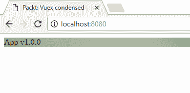

# 设置开发和测试环境

当我开始使用 Vue 时，我发现将 Vue 与 webpack 集成很困难。我还遇到了配置 Karma 以使用 webpack 进行测试的麻烦，更不用说弄清楚如何测试单个文件组件了！

由于这个原因，在接下来的几页中，您将指导配置一个既适合 Vue/Vuex 开发也适合测试的环境。我想您会发现下一页非常有用。

在本章中，您将：

+   使用 npm 设置开发环境。

+   安装、配置和使用 webpack。

+   安装、配置和使用 vue-loader。

+   使用 Karma + Jasmine 设置测试环境。

# 技术要求

您需要在系统上安装 Node.js。最后，为了使用本书的 Git 仓库，用户需要安装 Git。

本章的代码文件可以在 GitHub 上找到：

[`github.com/PacktPublishing/Vuex-Quick-Start-Guide/tree/master/chapter-3`](https://github.com/PacktPublishing/Vuex-Quick-Start-Guide/tree/master/chapter-3)

查看以下视频，看看代码的实际效果：

[`goo.gl/oacFdP`](https://goo.gl/oacFdP)

# 设置开发环境

Vue 提供了一个名为 `vue-cli` 的工具，用于构建 Vue.js 项目。它还支持我们将要使用的 Web 打包工具 webpack。要安装 `vue-cli`，您只需在控制台中输入 `npm install -g vue-cli` 即可。

虽然使用 `vue-cli` 是启动新项目的最快方式，但在接下来的段落中，我将解释如何从头开始设置 Vue 项目。

我们将使用 **npm**（**Node 包管理器**）设置 Vue/Vuex 项目，解释每个步骤，并仅安装最小依赖项集，而不是 `vue-cli`，它会安装大量的 npm 包以提供通用项目配置。

通过使用本书的 GitHub 仓库并检查第一次提交，您可以观察我是如何设置 *EveryNote* 应用开发环境的。

# 使用 npm 为 Vue/Vuex 准备项目

要使用 npm，您需要安装 Node.js。您可以在 [`nodejs.org/`](https://nodejs.org/) 上找到有关如何安装 Node.js 的信息。

创建 Vue/Vuex 项目的第一步是创建一个目录，并使用 npm 初始化它。打开控制台，输入以下命令：

```js
mkdir notes-app
cd notes-app
npm init
```

`npm init` 命令会向您提出一些问题。每个问题都有一个默认值，通常是一个不错的选择。您可以为每个问题直接按 *Enter*。之后，它将创建一个包含您提供的值的 `package.json` 文件。我们将使用此文件来保存项目依赖项并创建一些对应用开发有用的命令。

让我们先安装 webpack 及其相关工具。Webpack 是一个模块打包器，它将帮助我们创建生产捆绑包，以及处理 Vue 单文件组件。如果您从未使用过 webpack，您应该谷歌搜索它以熟悉其核心原则。从现在开始，我将假设您已经具备 webpack 的基本知识。在控制台中输入以下命令：

```js
npm install --save-dev webpack
npm install --save-dev webpack-cli
npm install --save-dev webpack-dev-server
npm install --save-dev html-webpack-plugin
npm install --save-dev clean-webpack-plugin
```

已创建一个名为`node_modules`的目录，您可以在该目录中找到我们刚刚安装的包的源代码。如果您使用`Git`，则应将`node_modules`放入`.gitignore`文件中。`--save-dev`选项将我们刚刚安装的五个包名写入`package.json`文件。这样，每次您输入`npm install`时，如果需要，所有保存的包都将被下载。

让我们看看这些包的作用：

+   `webpack`：将所有源文件打包到一个文件夹中，这个文件夹将包含相应的生产文件

+   `webpack-dev-server`：启动一个开发 HTTP 服务器，并帮助我们使用浏览器编写代码和调试

+   `html-webpack-plugin`：将帮助我们创建一个`index.html`文件，该文件将加载 webpack 捆绑包文件

+   `clean-webpack-plugin`：在捆绑项目时，webpack 会创建一个分发文件夹，该插件会删除这个文件夹

通过输入`npm install`，所有保存的包都将重新安装到`node_modules`文件夹中。这样，要初始化一个项目，您只需获取代码（例如使用`git clone`）并输入`npm install`，项目就准备好使用了。

让我们现在创建一个名为`webpack.config.js`的文件来配置 webpack。初始文件将如下所示：

```js
// webpack.config.js
const path = require('path');
const HtmlWebpackPlugin = require('html-webpack-plugin');
const CleanWebpackPlugin = require('clean-webpack-plugin');
const webpack = require('webpack');

const config = {
  entry: {
    app: './src/main.js',
  },
  output: {
    filename: '[name].bundle.js',
    path: path.resolve(__dirname, 'dist/'),
  },
  plugins: [
    new HtmlWebpackPlugin({ template: 'src/index.html' }),
    new CleanWebpackPlugin(['dist']),
    new webpack.DefinePlugin({
      'process.env.NODE_ENV': JSON.stringify(process.env.NODE_ENV || 'development'),
    }),
  ]
};

module.exports = config;
```

在前面的配置中，我们假设我们有一个名为`src`的文件夹，里面有一个`index.html`和一个`main.js`。

您可能也注意到了我使用了`webpack.DefinePlugin`：此插件允许您定义可以在项目中使用的常量。在这种情况下，我们定义`process.env.NODE_ENV`以区分开发环境和生产环境。

现在我们可以创建`src`文件夹：

```js
mkdir src
```

完成此操作后，在`src`文件夹中创建`index.html`文件：

```js
<!-- src/index.html -->
<!DOCTYPE html>
<html lang="en">
<head>
  <meta charset="UTF-8">
  <title>Packt: Vuex condensed</title>
</head>
<body>
Hello world
</body>
</html>
```

现在编写`main.js`文件，如下所示：

```js
// src/main.js
console.log('Hello world');
```

我们现在可以使用 webpack 来构建项目。我们可以使用`npx`节点命令，该命令执行 npm 包的二进制文件，这样我们就不需要写出 webpack 可执行文件的完整路径：

```js
npx webpack --config webpack.config.js
```

将创建一个名为`dist`的文件夹，您将在其中找到`app.bundle.js`和`index.html`文件。如果您打开 HTML 文件，您可能会注意到在`body`标签的末尾添加了以下行：

```js
<script type="text/javascript" src="img/app.bundle.js"></script>
```

那是加载 webpack 捆绑包的`html`标签。我们将在稍后看到如何告诉 webpack 使用 Vue 单文件组件。

由于在开发过程中，逐个构建每个捆绑文件并在 HTTP 服务器中加载它们以查看更改并不方便，我们将使用`webpack-dev-server`：

```js
npx webpack-dev-server --config webpack.config.js
```

如果你打开浏览器访问 `http://localhost:8080/`，你将看到一个包含“Hello world”字样的白色页面。如果你打开浏览器开发工具，你将看到相同的句子在浏览器控制台中打印出来。

让我们在 `package.json` 文件中添加一些运行 webpack 和 `webpack-dev-server` 的命令，这样我们就可以通过输入 `npm run build` 和 `npm start` 来运行它们：

```js
{
  "name": "notes-app",
  "version": "1.0.0",
  ...
  "scripts": {
    "start": "webpack-dev-server --mode development",
    "build": "cross-env NODE_ENV=production webpack --mode production"
  },
  ...
  "devDependencies": {
    "clean-webpack-plugin": "⁰.1.17",
    "html-webpack-plugin": "².30.1",
    "webpack": "³.10.0",
    "webpack-dev-server": "².11.0"
  }
}
```

自从 webpack 4.0 以来，你需要指定你是在运行用于生产环境还是开发环境的 webpack。`--mode` 参数让你指定你正在构建哪个环境。最后，`--config webpack.config.js` 可以省略。

你可能已经注意到，我在 `build` 部分添加了 `cross-env NODE_ENV=production`。这是因为，当构建用于生产的应用程序时，我们需要将 `NODE_ENV` 环境变量设置为生产值。这样，我们可以使用以下代码来确定我们是否正在构建生产代码：

```js
const debug = process.env.NODE_ENV !== 'production';
```

要使用 `cross-env`，你需要通过输入以下命令来安装它：

```js
npm install --save-dev cross-env
```

最后，让我们安装 Vue 和 Vuex，并使用它们来检查一切是否配置正确。

在控制台中执行以下命令：

```js
npm install --save vue vuex
```

按照以下方式编辑 `main.js` 文件：

```js
import Vue from 'vue';
import Vuex from 'vuex';

Vue.use(Vuex);
const store = new Vuex.Store({});
new Vue({
  el: '#app',
  store,
  template:'<div>Hello Vue(x) World!</div>'
});
```

按照以下方式更新 `index.html`：

```js
<!DOCTYPE html>
<html lang="en">
<head>
  <meta charset="UTF-8">
  <title>Packt: Vuex condensed</title>
</head>
<body>
<div id="app"></div>
</body>
</html>
```

现在输入 `npm start`，浏览器就会显示我们非常第一个 Vuex 应用程序：`Hello Vue(x) World!`

# 使用 vue-loader 为单文件组件

Vue.js 提供了一个 webpack 加载器，`vue-loader`，用于将单文件组件转换为 JavaScript 模块。要安装 `vue-loader` 和相关工具，请在控制台中输入以下命令：

```js
npm install --save-dev vue-loader
npm install --save-dev vue-template-compiler
npm install --save-dev vue-style-loader
npm install --save-dev css-loader
npm install --save-dev file-loader
```

`file-loader` 用于导入外部文件，例如图片。其他包用于告诉 webpack 如何构建 `.vue` 文件内的所有部分。

让我们更新 `webpack.config.js` 以使用具有 `.vue` 文件扩展名的单文件组件：

```js
// ...
const config = {
  // ...
  module: {
    rules: [
      {
        test: /\.vue$/,
        loader: 'vue-loader'
      },
      {
        test: /\.css$/,
        use: [
          'vue-style-loader',
          'css-loader'
        ]
      },
      {
        test: /\.(png|jpg|jpeg|gif|svg)$/,
        loader: 'file-loader',
        options: {
          name: '[name].[ext]?[hash]'
        }
      }
    ]
  },
  resolve: {
    alias: {
      vue$: 'vue/dist/vue.esm.js',
    },
  },
  // ...
};
// ...
```

在配置文件中的 `rules` 部分内，我们告诉 webpack 当源文件中导入文件时使用哪个加载器。在上面的代码中，我们配置了 webpack 为每个 `.vue` 文件使用 `vue-loader`，为 `.css` 文件使用 `css-loader` 和 `vue-style-loader`，以及为图片使用 `file-loader`。

为了测试一切是否已正确配置，我们将创建一个 `app.vue` 文件：

```js
// src/app.vue
<template>
  <div class="app">App <span class="version">v{{version}}</span></div>
</template>
<script>
  export default {
    computed: {
      version() {
        return this.$store.state.version;
      }
    }
  };
</script>
<style>
  .app {
    font-family: "Times New Roman", Times, serif;
    background-image: url("./background.jpg");
  }
</style>
```

你需要一个 `background.jpg` 文件来构建前面的文件。只需将任何图片放入 `src` 文件夹中，并将其重命名为 `background.jpg` 即可。

此文件使用 `Vuex.Store`，Vue 单文件组件的三个部分——`<template>`、`<script>` 和 `<style>`——以及一个作为背景的图片。这样，我们将测试 `vue-loader` 及其相关包 `Vuex.Store` 和 `file-loader` 对背景图片的支持。

让我们现在更新 `main.js` 以使用 `app.vue`：

```js
// src/main.js
import Vue from 'vue';
import Vuex from 'vuex';
import app from './app.vue';

Vue.use(Vuex);

const store = new Vuex.Store({
  state: {
    version: '1.0.0'
  }
});

new Vue({
  el: '#app',
  store,
  template:'<app></app>',
  components: {app}
});
```

重新启动 `webpack-dev-server` (`npm start`) 并打开 URL `http://localhost:8080/`，你将看到以下截图类似的内容：



图 3.1：使用 app.vue

# 配置测试环境

如果你正在为单文件组件配置 webpack，你可能会觉得有点棘手；第一次配置测试环境肯定是有难度的。

我们将使用 Karma 作为测试运行器，Jasmine 作为测试/断言框架，以及 Chrome 作为将运行所有测试的浏览器。

首先，让我们安装所有需要的工具：

```js
npm install --save-dev karma karma-webpack
npm install --save-dev karma-chrome-launcher
npm install --save-dev jasmine-core karma-jasmine
```

然后，我们需要创建一个`karma.conf.js`文件，如下所示：

```js
// Using webpack configuration
var webpackConfig = require('./webpack.config.js');
delete webpackConfig.entry; // No entry for tests

module.exports = function(config) {
  config.set({
    basePath: '',
    frameworks: ['jasmine'],
    files: [
      'test/**/*.spec.js'
    ],
    exclude: [
    ],
    preprocessors: {
      'test/**/*.spec.js': ['webpack']
    },
    reporters: ['progress'],
    port: 9876,
    colors: true,
    logLevel: config.LOG_INFO,
    autoWatch: true,
    browsers: ['Chrome'],
    singleRun: false,
    concurrency: Infinity,
    webpack: webpackConfig,

    // avoid walls of useless text
    webpackMiddleware: {
      noInfo: true
    }
  })
};
```

上述配置将在`test`文件夹内运行所有以`.spec.js`结尾的文件。此外，我们还告诉 Karma 使用 webpack 预处理文件。

让我们在`notes-app`内部创建一个测试文件夹：

```js
mkdir test
```

最后，我们将创建一个简单的测试，用于加载`.vue`文件并进行测试。

在`test`文件夹内部创建一个名为`test-setup`的文件夹，并将其放入一个`dummy.vue`文件中：

```js
// test/test-setup/dummy.vue
<template>
  <div class="app">{{msg}}</div>
</template>
<script>
  export default {
    data() {
      return {msg: 'A message'};
    }
  };
</script>
```

创建一个名为`dummy.vue.spec.js`的测试文件：

```js
// test/test-setup/dummy.vue.spec.js
import Vue from 'vue';
import Test from './dummy.vue';

describe('dummy.vue', function () {
  it('should have correct message', function () {
    expect(Test.data().msg).toBe('A message');
  });

  it('should render correct message', function () {
    const vm = new Vue({
      template: '<div><test></test></div>',
      components: {
        'test': Test
      }
    }).$mount();
    expect(vm.$el.querySelector('.app').textContent)
        .toBe('A message');
  })
});
```

按照以下方式更新`package.json`：

```js
"scripts": {
    "test": "karma start",
    "start": "webpack-dev-server --config webpack.config.js",
    "build": "webpack --config webpack.config.js"
},
```

接下来，执行`npm test`来运行我们刚刚创建的测试。你应该在控制台看到以下类似的内容：

```js
Chrome ... : Executed 2 of 2 SUCCESS (0.006 secs / 0 secs) 
```

现在，我们已经准备好开始开发 EveryNote 网络应用程序了，这是下一章的主题。

# 摘要

在本章中，我们介绍了设置测试和开发环境所需的所有步骤，准备好使用 Vuex 和 Vue 单文件组件开始编码。此外，我们还添加了一些测试文件以确保一切配置正确。
