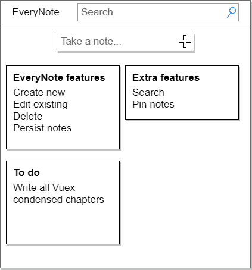
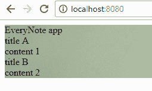
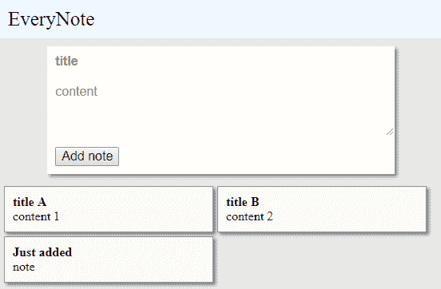
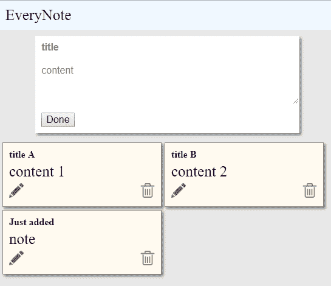
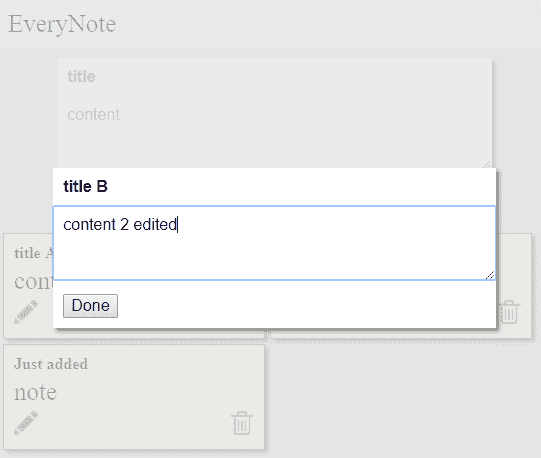

# 使用 Vuex 状态管理编写 EveryNote 应用程序代码

在本章中，我们将从头开始开发一个名为 *EveryNote* 的记事应用程序。在章节的第一部分，我们将分析和设计应用程序，并为项目准备文件夹结构。

之后，我们将通过测试和代码逐步构建应用程序。这个应用程序将在编写本章的同时开发，提供一个现实世界的 Vuex 开发示例。

您可以通过克隆 `https://github.com/PacktPublishing/-Vuex-Condensed` Git 仓库来下载应用程序。本章的每个部分都有一个相应的 Git 标签，可以用来下载为该部分编写的代码。

在阅读本章时，您将学习以下内容：

+   利用 Vuex 功能设计和开发应用程序

+   在 Vue 组件中使用 Vuex

+   有效测试 Vue/Vuex 组件

+   使用操作来处理异步操作

# 技术要求

您需要在系统上安装 Node.js。最后，为了使用本书的 Git 仓库，用户需要安装 Git。

本章的代码文件可以在 GitHub 上找到：

[`github.com/PacktPublishing/Vuex-Quick-Start-Guide/tree/master/chapter-4`](https://github.com/PacktPublishing/Vuex-Quick-Start-Guide/tree/master/chapter-4)

查看以下视频以查看代码的实际运行情况：

[`goo.gl/QaPP1Q`](https://goo.gl/QaPP1Q)

# 设计 EveryNote 网络应用程序

设计应用程序的一种方法是通过创建用户界面的原型。这样，您可以向利益相关者展示您的原型，讨论它们，相应地更新您的原型，并将它们重新提交给利益相关者。这可以在您开始开发之前完成。

EveryNote 应用程序将看起来像以下原型：



图 3.2：EveryNote 原型界面

应用程序将具有以下功能：

+   创建新笔记

+   显示所有笔记

+   更新现有笔记

+   删除笔记

+   将笔记保存到 `LocalStorage`

在基本功能实现后，我们还将添加两个更多功能：

+   在笔记中搜索

+   锁定笔记

在现实世界的应用程序中，您可能需要用户故事来更好地定义预期的行为，从而确定程序员应该编写的代码。这些故事可以接受测试，这种类型的测试称为验收测试。

在这种情况下，EveryNote 的功能简单且定义良好，因此我们可以先选择一个功能并开始开发。

# 应用程序结构

Vuex 提出了一种通用的应用程序结构，我们将采用。以下是其文件夹结构：

```js
test # test folder
├── test_file.spec.js # a test file
└── ...
src # app main folder
├── index.html
├── main.js
├── api
│ └── ... # abstractions for making API requests
├── components
│ ├── App.vue
│ └── ...
└── store
    ├──index.js #here we assemble modules and export the store
    ├── actions.js # root actions
    ├── mutations.js # root mutations
    └── modules
        ├── module_a.js # a module
        └── module_b.js # another module
```

我们现在将通过向本章开头创建的 `notes-app` 文件夹中添加一些文件来创建项目框架。

首个要创建的文件是 `index.html`。对于任何 Vue.js 应用程序，我们需要将 Vue/Vuex 应用的根容器放在 body 中，如下所示：

```js
<!-- src/index.html -->
<!DOCTYPE html>
<html lang="en">
<head>
  <meta charset="UTF-8">
  <title>Packt: Vuex condensed EveryNote</title>
</head>
<body>
<div id="app"></div>
</body>
</html>
```

第二个文件是`main.js`。它包含启动应用 Vue.js 部分的代码：

```js
// src/main.js
import Vue from 'vue';
import App from './components/App.vue';
import store from './store';

new Vue({
 el: '#app',
 store,
 render: h => h(App),
});

```

现在 Vue 应用已经准备好了，我们可以通过在`store`文件夹内创建`index.js`来向其中添加 Vuex：

```js
// src/store/index.js
import Vuex from 'vuex';
import Vue from 'vue';

Vue.use(Vuex); 
const debug = process.env.NODE_ENV !== 'production';
const store = new Vuex.Store({
 state: {},
 strict: debug,
});

export default store;

```

最后，我们按照以下方式创建*EveryNote*应用的根 Vue 组件：

```js
// src/components/App.vue
<template>
 <div class="app">EveryNote app</div>
</template>
<script>
 export default {};
</script>
<style>
 .app {
 font-family: "Times New Roman", Times, serif;
 background-image: url("background.jpeg");
 }
</style>
```

克隆`book`仓库，并使用`git checkout step-0_project-scaffold`来查看此步骤的所有项目文件。

现在项目骨架已经准备好了，我们可以开始编写第一个功能了。

# 开发 EveryNote 应用

在接下来的段落中，我将使用测试驱动开发来开发应用。你不需要了解 TDD 就能理解我将要做什么。你首先会看到一个断言代码应该做什么的测试，然后，紧接着，你会看到实现。

但为什么这本书要使用 TDD（测试驱动开发）呢？

一个原因是，我认为通过阅读测试代码中对代码行为的断言来理解代码的意图比从实现代码中推断其行为要容易。

另一个原因是，在编写组件的同时测试组件比有一个（无聊的）关于测试组件的章节要容易理解。

# 使用待办事项列表来帮助开发过程

我发现将待办事项列表写入文件对于提醒我需要做什么很有用。我还发现记录需要处理的事情的疑问和简单笔记很有帮助。

这个待办事项列表是一个简单的`.txt`文件，随着时间的推移会发生变化，并希望当应用完成时它是空的。我还把这个文件放在`Git 修订版`下。

初始的`To-do`列表看起来像这样：

```js
To-do:
Show all notes*
Create new notes
Update an existing note
Delete a note
Save notes to LocalStorage

Extra:
Search among notes
Pin a note

Done:
```

我使用`*`符号来标记当前正在开发的功能。

# 显示笔记列表

我将首先显示笔记列表，因为其他功能依赖于它。另一个可能的起始功能是创建新笔记的能力。

为了显示笔记列表，我们需要将该列表添加到应用的`Vuex.Store`中。然后我们需要一个使用该存储来显示笔记的 Vue 组件。

第一个测试是关于在应用的主存储中定义笔记列表：

```js
// test/store/store.spec.js
import store from '../../src/store';

describe('EveryNote main store', () => {
  it('should have a list of notes', () => {
    expect(Array.isArray(store.state.noteList)).toBe(true);
  });
});

```

接下来，定义实现：

```js
// src/store/index.js

import ...
// ...
const store = new Vuex.Store({
  state: {
    noteList: [],
  },
  strict: debug,
});
...
```

从现在开始，你将首先看到一个详细说明组件测试的框架，紧接着是一个带有代码实现的框架。你将在本章后面提供关于测试驱动开发的描述。现在，重要的是你要理解 TDD 有一个节奏：一个测试，一段生产代码，一个测试，一段生产代码，等等。

这也被称为红、绿、重构：

+   **红**：你编写一个小测试，执行它的结果是测试失败——你会在测试控制台中看到红色。

+   **绿色**：你以最简单的方式使测试通过——你会在测试控制台中看到绿色。在这个步骤中允许复制代码。

+   **重构**：如果你觉得有必要，你会移除代码重复并提高代码质量。

下一步是创建一个 Vue 组件`noteList`来显示笔记列表。

测试代码：

```js
// test/components/NoteList.spec.js
import Vue from 'vue';
import Vuex from 'vuex';
import NoteList from '../../src/components/NoteList.vue';

describe('NoteList.vue', () => {
  let store;
  let noteList;

  function newNoteListCmp() {
    const Constructor = Vue.extend(NoteList);
    return new Constructor({
      store,
    }).$mount();
  }

  beforeEach(() => {
    Vue.use(Vuex);

    noteList = [];
    store = new Vuex.Store({
      state: { noteList },
    });
  });

  it('should expose store.noteList', () => {
    const noteListCmp = newNoteListCmp();

    expect(noteListCmp.notes).toBe(noteList);
  });

  it('should cycle through noteList', () => {
    noteList.push({});
    noteList.push({});

    const noteListCmp = newNoteListCmp();

    const contents =
      noteListCmp.$el.querySelectorAll('.content');
    expect(contents.length).toBe(2);
  });

  it('should render notes inside noteList', () => {
    const title = 'Note title';
    const content = 'Note content';
    noteList.push({ title, content });

    const noteListCmp = newNoteListCmp();

    const { $el } = noteListCmp;
    const titleEl = $el.querySelector('.title');
    const contentEl = $el.querySelector('.content');
    expect(titleEl.textContent).toBe(title);
    expect(contentEl.textContent).toBe(content);
  });
});
```

应用代码：

```js
// src/components/NoteList.vue
<template>
  <div class="container">
    <div v-for="note in notes">
      <div class="title">{{note.title}}</div>
      <div class="content">{{note.content}}</div>
    </div>
  </div>
</template>
<script>
  import { mapState } from 'vuex';

  export default {
    computed: mapState({
      notes: 'noteList',
    }),
  };
</script>
<style>
</style>
```

尽管我把所有的这些测试放在一起以提高可读性，但我并不是先写三个测试，然后写代码。我是先写第一个测试，然后写代码，然后写下一个测试，以此类推。记住红绿重构模式！

为了编写`NoteList`代码，我需要三个测试：

+   第一个测试检查是否存在一个名为`notes`的计算属性，它暴露`state.store.NoteList`

+   第二个测试确保`notes`中的每个笔记都在模板部分被渲染

+   最后，最后一个测试确保笔记的标题和内容被渲染

此外，还有一些代码用于设置测试环境，以便模拟商店并创建组件。每个要测试的项目都应该被隔离。这意味着我们不能使用真实的商店，我们需要为每个要测试的组件提供一个模拟的。

有一个框架，`vue-test-utils`，可以用来测试 Vue 组件。我决定不使用它，以便保持本书中的示例简单。你可能想在编写你的应用程序时使用它。

我们现在可以继续到下一个功能，但在继续之前，我首先想看到一些笔记实际上在浏览器中显示。为了实现这一点，我们可以暂时在商店中添加两个笔记，并将`NoteList`组件添加到`App.vue`中。

测试代码：

```js
// src/store/index.js
import Vuex from 'vuex';
import Vue from 'vue';

Vue.use(Vuex);

const debug = process.env.NODE_ENV !== 'production';
const store = new Vuex.Store({
  state: {
    noteList: [
 { title: 'title A', content: 'content 1' },
 { title: 'title B', content: 'content 2' },
    ],
  },
  strict: debug,
});

export default store;
```

应用代码：

```js
// src/components/App.vue
<template>
  <div class="app">
    <div>EveryNote app</div>
    <note-list></note-list>
  </div>
</template>
<script>
  import NoteList from './NoteList.vue';

  export default {
    components: {
      NoteList,
    },
  };
</script>
<style>
  .app {
    font-family: "Times New Roman", Times, serif;
    background-image: url("background.jpeg");
  }
</style>
```

下面的截图是结果：



图 3.3：笔记列表

目前，结果看起来很丑；在所有主要功能实现后，我将添加一些 CSS 使其看起来更好。

你可以通过输入以下命令来下载此阶段的代码：

```js
git checkout step-1_note-list
```

# 创建新笔记

到目前为止，`待办事项`列表看起来是这样的：

```js
To-do:
Create new notes*
- NoteEditor component
- Update current note mutation
- Add note to noteList mutation
- Add note action

Update an existing note
Delete a note
Save notes to LocalStorage

Extra:
Search among notes
Pin a note

Done:
Show all notes
  - Add note list to the store
  - Note list vue component
  -- Add a temporary note list to the store
```

接下来我将实现的新功能是创建新笔记的能力。为此功能，我们需要一个`NoteEditor`组件，一个名为`currentNote`的商店属性，一个名为`addNote`的操作，以及两个突变：`UPDATE_CURRENT_NOTE`和`ADD_NOTE`。

理念是，当用户在笔记编辑器中编写时，`currentNote`商店属性会更新。当他点击添加笔记按钮时，会触发`addNote`操作，导致新笔记被添加到笔记列表中。让我们将`currentNote`属性添加到应用商店中。

测试代码：

```js
// test/store/store.spec.js
import store from '../../src/store';

describe('EveryNote main store', () => {
  it('should have a list of notes', () => {
    expect(Array.isArray(store.state.noteList)).toBe(true);
  });

  it('should have currentNote property', () => {
    const { state } = store;
    expect(state.currentNote.title).not.toBe(undefined);
    expect(state.currentNote.content).not.toBe(undefined);
  });
});
```

应用代码：

```js
// src/store/index.js

//...

const store = new Vuex.Store({
  state: {
    noteList: [
      { title: 'title A', content: 'content 1' },
      { title: 'title B', content: 'content 2' },
    ],
    currentNote: { title: '', content: '' },
  },
  mutations,
  strict: debug,
});

```

你可能会想知道为什么我添加了一个测试只是为了验证`currentNote`字段是否在应用商店中。这里的想法是，我并不是在编写测试来测试应用程序是否正常工作——我是在编写测试来编写生产代码。为了修改应用代码的任何一行，我需要一个测试来证明我正在编写生产代码。

这是罗伯特·C·马丁（Robert C. Martin，又称 Uncle Bob）提出的三个 TDD 规则中的第一个：

+   除非它能让失败的单元测试通过，否则不允许编写任何生产代码

另外两个如下：

+   你不允许再编写任何足以失败的单元测试，编译失败也是失败

+   你不允许再编写任何更多足以通过一个失败的单元测试的生产代码

所以为什么我在向存储中添加两个假笔记并修改 `App.vue` 以使用 `NoteList` 组件时没有编写任何测试？因为那是临时代码，不是生产代码。在应用程序完成之前，我将删除这些修改。

现在 `currentNote` 已经定义，我可以编写一个 `UPDATE_CURRENT_NOTE` 突变。

测试代码：

```js
// test/store/mutations.spec.js
import { mutations, types } from '../../src/store/mutations';

describe('EveryNote root mutations', () => {
  it('should update current note', () => {
    const updateCurrentNote
      = mutations[types.UPDATE_CURRENT_NOTE];
    const state = { currentNote: { title: '', content: '' } };
    const newNote = { title: 'title', content: 'some text' };

    updateCurrentNote(state, newNote);

    expect(state.currentNote).toEqual(newNote);
  });
});
```

应用代码：

```js
// src/store/mutations.js
export const types = {
  UPDATE_CURRENT_NOTE: 'UPDATE_CURRENT_NOTE',
};

export const mutations = {
  types.UPDATE_CURRENT_NOTE {
 state.currentNote = { title, content };
 },
};

```

接下来，创建 `NoteEditor` 组件。

测试代码：

```js
// test/components/NoteEditor.spec.js
import Vue from 'vue';
import Vuex from 'vuex';
import NoteEditor from '../../src/components/NoteEditor.vue';
import { types, mutations } from '../../src/store/mutations';
import actions from '../../src/store/actions';

const { UPDATE_CURRENT_NOTE } = types;
describe('NoteEditor component', () => {
  let store;
  let currentNote;

  function newNoteEditorCmp() {
    const Constructor = Vue.extend(NoteEditor);
    store = new Vuex.Store({
            state: { currentNote, noteList: [] },
      mutations,
      actions,
    });
    return new Constructor({
      store,
    }).$mount();
  }

  beforeEach(() => {
    Vue.use(Vuex);
    currentNote = { title: 'title', content: 'content' };
  });

  it('should expose currentNote.content as content', () => {
    const editorCmp = newNoteEditorCmp();

    expect(editorCmp.content).toBe(currentNote.content);
  });

  it('should expose currentNote.content setter', () => {
    const editorCmp = newNoteEditorCmp();
    store.commit = jasmine.createSpy('commit spy');
    const newContent = 'A new content';

    editorCmp.content = newContent;

    const expected = {
      title: currentNote.title,
      content: newContent,
    };
    expect(store.commit)
      .toHaveBeenCalledWith(UPDATE_CURRENT_NOTE, expected);
  });

  it('should expose currentNote.title as title', () => {
    const editorCmp = newNoteEditorCmp();

    expect(editorCmp.title).toBe(currentNote.title);
  });

  it('should expose currentNote.title setter', () => {
    const editorCmp = newNoteEditorCmp();
    store.commit = jasmine.createSpy('commit spy');
    const newTitle = 'A new title';

    editorCmp.title = newTitle;

    const expected = {
      title: newTitle,
      content: currentNote.content,
    };
    expect(store.commit)
      .toHaveBeenCalledWith(UPDATE_CURRENT_NOTE, expected);
  });

  it('should render current note inside the editor', () => {
    const editorCmp = newNoteEditorCmp();

    const { $el } = editorCmp;
    const contentEl = $el.querySelector('.content');
    const titleEl = $el.querySelector('.title');
    expect(contentEl.value).toBe(currentNote.content);
    expect(titleEl.value).toBe(currentNote.title);
  });
});
```

应用代码：

```js
// src/components/NoteEditor.vue
<template>
  <div>
    <input v-model="title" type="text" class="title"/>
    <input v-model="content" type="text" class="content"/>
  </div>
</template>
<script>
  import { types } from '../store/mutations';

  const { UPDATE_CURRENT_NOTE } = types;
  export default {
    computed: {
      content: {
        get() {
          return this.$store.state.currentNote.content;
        },
        set(value) {
          const newContent = {
            title: this.title,
            content: value,
          };
          this.$store.commit(UPDATE_CURRENT_NOTE, newContent);
        },
      },
      title: {
        get() {
          return this.$store.state.currentNote.title;
        },
        set(value) {
          const newContent = {
            title: value,
            content: this.content,
          };
          this.$store.commit(UPDATE_CURRENT_NOTE, newContent);
        },
      },
    },
  };
</script>
<style></style>
```

为了编写 `NoteEditor` 组件，我测试了计算属性 `content` 和 `title` 是否正确链接到 `$store.state.currentNote`，以及这些属性是否在 `template` 部分中使用。

与 `NoteList` 组件的测试一样，`test` 文件的第一部分只是创建 `test` 下的组件的一些代码。从现在起，我将避免重复这部分代码。

下一步是创建 `addNote` 动作和相应的突变，以便我可以在用户按下添加笔记按钮时更新 `NoteEditor` 来分发此动作。以下是 `ADD_NOTE` 突变。

测试代码：

```js
// test/store/mutations.spec.js
import { mutations, types } from '../../src/store/mutations';

describe('EveryNote root mutations', () => {
  it('should update current note', () => {
    // ...
  });

  it('should add a note to noteList', () => {
    const ADD_NOTE = mutations[types.ADD_NOTE];
    const state = { noteList: [] };
    const newNote = { title: 'title', content: 'some text' };

    ADD_NOTE(state, newNote);

    expect(state.noteList['0']).toBe(newNote);
  });
});
```

应用代码：

```js
// src/store/mutations.js
export const types = {
  UPDATE_CURRENT_NOTE: 'UPDATE_CURRENT_NOTE',
  ADD_NOTE: 'ADD_NOTE',
};

export const mutations = {
  types.UPDATE_CURRENT_NOTE {
    state.currentNote = { title, content };
  },
  types.ADD_NOTE {
 state.noteList.push(aNote);
 },
};
```

以下是 `addNote` 动作测试：

```js
// test/store/actions.spec.js

import actions from '../../src/store/actions';
import { types } from '../../src/store/mutations';

describe('EveryNote root actions', () => {
  it('should have addNote action', () => {
    const { addNote } = actions;
    const mockContext = {
      commit: jasmine.createSpy('commit'),
    };
    const aNote = {};

    addNote(mockContext, aNote);

    expect(mockContext.commit)
      .toHaveBeenCalledWith(types.ADD_NOTE, aNote);
  });
});
```

以下是应用程序代码：

```js
// src/store/actions
import { types } from './mutations';

export default {
  addNote({ commit }, aNote) {
 commit(types.ADD_NOTE, aNote);
  },
};

```

最后，我可以更新 `NoteEditor` 来分发 `addNote` 动作，并看到笔记列表已更新。首先，让我们更新 `NoteEditor`。

测试代码：

```js
// test/components/NoteEditor.spec.js
import // ...

const { UPDATE_CURRENT_NOTE } = types;
describe('NoteEditor component', () => {
  let store;
  let currentNote;

  function newNoteEditorCmp() {
    // ...
  }

  // ...

  it('should have addNote method', () => {
    const editorCmp = newNoteEditorCmp();
    spyOn(store, 'dispatch');

    editorCmp.addNote();

    expect(store.dispatch)
      .toHaveBeenCalledWith('addNote', currentNote);
  });

  it('should not add empty notes', () => {
    const editorCmp = newNoteEditorCmp();
    spyOn(store, 'dispatch');
    currentNote.title = '';
    currentNote.content = '';

    editorCmp.addNote();

    expect(store.dispatch).not.toHaveBeenCalled();
  });

  it('should reset title and content on addNote', () => {
    const editorCmp = newNoteEditorCmp();

    editorCmp.addNote();

    expect(editorCmp.title).toBe('');
    expect(editorCmp.content).toBe('');
  });
});
```

应用代码：

```js
// src/components/NoteEditor.vue
<template>
  <div>
    <input v-model="title" type="text" class="title"
           placeholder="title"/>
    <input v-model="content" type="text" class="content"
           placeholder="content"/>
    <button @click="addNote">Add note</button>
  </div>
</template>
<script>
  import { types } from '../store/mutations';

  const { UPDATE_CURRENT_NOTE } = types;
  export default {
    computed: {
      content: {
        // ...
      },
      title: {
        // ...
      },
    },
    methods: {
      addNote() {
        if (this.title !== '' || this.content !== '') {
          const newNote = {
            title: this.title,
            content: this.content,
          };

          this.$store.dispatch('addNote', newNote);
        }
        this.title = '';
        this.content = '';
      },
    },
  };
</script>
```

现在，让我们向存储中添加 `actions`：

```js
// src/store/index.js
import // ...
import actions from './actions';

// ...

const store = new Vuex.Store({
  state: { // ... },
  mutations,
  actions,
  strict: debug,
});
```

并将 `NoteEditor` 添加到 `App.vue`

```js
// src/components/App.vue
<template>
  <div class="app">
    <div>EveryNote app</div>
 <note-editor></note-editor>
    <note-list></note-list>
  </div>
</template>
<script>
  import NoteList from './NoteList.vue';
  import NoteEditor from './NoteEditor.vue';

  export default {
    components: {
      NoteList,
      NoteEditor,
    },
  };
</script>
<style>
    // ...
</style>
```

在为组件添加了一些 CSS 并稍微重新设计应用程序之后，它现在看起来像以下图示：



图 3.4：EveryNote 重新设计

你可以通过输入以下内容在此阶段下载代码：

```js
git checkout step-2_create-notes
```

# 删除现有笔记

我接下来要实现的功能是删除笔记的能力。以下是被更新的 `待办` 列表：

```js
To-do:
Delete a note*
- delete action
- delete mutation
- create Note component and use it in NoteList component

Update an existing note
Save notes to LocalStorage

Extra:
Search among notes
Pin a note

Done:
Show all notes
Create new notes
```

为了让用户能够删除笔记，我需要更新笔记框架以包含一个删除按钮，添加一个 `deleteNote` 动作，并添加一个 `DELETE_NOTE` 突变。最后，我将从 `NoteList` 中提取笔记框架代码并创建一个 `Note` 组件。让我们创建 `DELETE_NOTE` 突变。

测试代码：

```js
// test/store/mutations.spec.js
import { mutations, types } from '../../src/store/mutations';

describe('EveryNote root mutations', () => {
   // ...

  it('should delete a note', () => {
    const DELETE_NOTE = mutations[types.DELETE_NOTE];
    const aNote = {};
    const state = { noteList: [aNote] };

    DELETE_NOTE(state, aNote);

    expect(state.noteList.length).toBe(0);
  });

  it('should NOT delete a note if not inside noteList', ()=>{
    const DELETE_NOTE = mutations[types.DELETE_NOTE];
    const aNote = {};
    const state = { noteList: [aNote] };
    const anotherNote = {};

    DELETE_NOTE(state, anotherNote);

    expect(state.noteList.length).toBe(1);
  });
});
```

应用代码：

```js
// src/store/mutations.js
export const types = {
  UPDATE_CURRENT_NOTE: 'UPDATE_CURRENT_NOTE',
  ADD_NOTE: 'ADD_NOTE',
  DELETE_NOTE: 'DELETE_NOTE',
};

export const mutations = {
  // ...
 types.DELETE_NOTE {
    const index = state.noteList.indexOf(aNote);
    if (index >= 0) {
      state.noteList.splice(index, 1);
    }
  },
};

```

然后，让我们将 `deleteNote` 添加到动作中。

测试代码：

```js
// test/store/actions.spec.js
import actions from '../../src/store/actions';
import { types } from '../../src/store/mutations';

describe('EveryNote root actions', () => {
  // ..
  it('should have deleteNote action', () => {
    const { deleteNote } = actions;
    const mockContext = {
      commit: jasmine.createSpy('commit'),
    };
    const aNote = {};

    deleteNote(mockContext, aNote);

    expect(mockContext.commit)
      .toHaveBeenCalledWith(types.DELETE_NOTE, aNote);
  });
});
```

应用代码：

```js
// src/store/actions
import { types } from './mutations';

export default {
  // ...
  deleteNote({ commit }, aNote) {
    commit(types.DELETE_NOTE, aNote);
  },
};

```

现在让我们重构 `NoteList` 组件以使用一个名为 `Note` 的新组件：

```js
// src/components/NoteList.vue
<template>
  <div class="container">
    <note v-for="(note, i) in notes" :note="note" :key="i">
 </note>
  </div>
</template>
<script>
  // ...
</script>
<style scoped>
  // ...
```

然后，我们将笔记渲染的测试从 `NoteList` 移动到 `Note` 组件：

```js
// test/components/Note.spec.js
import Vue from 'vue';
import Vuex from 'vuex';
import Note from '../../src/components/Note.vue';

describe('Note.vue', () => {
  let note;
  let store;
  beforeEach(() => {
    Vue.use(Vuex);
    note = { title: 'title', content: 'content' };
  });

  function newNoteCmp() {
    const Constructor = Vue.extend(Note);
    store = new Vuex.Store({
      state: {},
    });
    return new Constructor({
      propsData: { note },
      store,
    }).$mount();
  }

  it('should render a note', () => {
    const { title, content } = note;

    const noteCmp = newNoteCmp();

    const { $el } = noteCmp;
    const titleEl = $el.querySelector('.title');
    const contentEl = $el.querySelector('.content');
    expect(titleEl.textContent.trim()).toBe(title);
    expect(contentEl.textContent.trim()).toBe(content);
  });
});
```

接下来，让我们编写新的 `Note` 组件：

```js
// src/components/Note.vue
<template>
<div class="note">
    <div class="title">{{note.title}}</div>
    <div class="content" v-text="note.content"></div>
  </div>
</template>
<script>
  export default {
    props: ['note'],
  };
</script>
<style scoped>
  /* ... */
</style>
```

最后，我们可以在 `Note` 组件中添加一个删除按钮，当点击时将分发 `deleteNote` 动作：

```js
// test/components/Note.spec.js
import Vue from 'vue';
import Vuex from 'vuex';
import Note from '../../src/components/Note.vue';

describe('Note.vue', () => {
  let note;
  let store;
  beforeEach(() => {
    Vue.use(Vuex);
    note = { title: 'title', content: 'content' };
  });

  function newNoteCmp() {
   // ...
  }

  it('should render a note', () => {
    // ...
  });

  it('should emit deleteNote on delete tap', () => {
    const noteCmp = newNoteCmp();
    spyOn(store, 'dispatch');

    noteCmp.onDelete();

    expect(store.dispatch)
      .toHaveBeenCalledWith('deleteNote', note);
  });
});
```

以下是更新后的 `Note.vue` 代码，这将使测试通过：

```js
// src/components/Note.vue
<template>
  <div class="note">
    <div class="title">{{note.title}}</div>
    <div class="content" v-text="note.content">
    </div>
    <div class="icons">
 
    </div>
  </div>
</template>
<script>
  export default {
    props: ['note'],
    methods: {
      onDelete() {
 this.$store.dispatch('deleteNote', this.note);
      },
    },
  };
</script>
<style scoped>
  // ...
</style>
```

为了运行前面的代码，你需要一个 `delete.svg` 文件。你可以在本书的 Git 仓库中找到它，或者你可以使用另一张图片。

你可以通过输入以下内容在此阶段下载代码：

```js
git checkout step-3_delete-notes
```

# 更新现有笔记

为了编辑现有的笔记，我们可以重用 `NoteEditor` 组件。目前，这个组件与主存储的 `currentNote` 属性相关联，但我们可以使用一个属性来传递要编辑的笔记，从而消除其对主存储的依赖。这种泛化在开发 Vuex 应用程序时很常见，通常会导致两种类型的组件：

+   **“哑”组件**：这些不改变或处理应用程序状态；它们只是通过属性接收输入并派发事件

+   **智能组件**：这些作为“哑”组件的容器；它们处理子组件之间的交互，并依赖于 Vuex 元素，如应用程序状态和动作

“哑”组件应该设计成可重用的，而“智能”组件应该设计成与应用程序依赖。

`NoteEditor` 可以重构为一个“哑”组件，让它的父组件将其链接到应用程序的状态。

我将这些考虑记录在“待办”列表上：

```js
To-do:
Update an existing note*
- re-use NoteEditor with an existing note

Considerations:
- NoteList could be refactored into a dumb component

Save notes to LocalStorage

Extra:
Search among notes
Pin a note

Done:
Show all notes
Create new notes
Delete a note
```

如你所见，我还在考虑将 `NoteList` 转换为“哑”组件，以便它可以用来显示不同的笔记列表，例如已固定笔记或匹配特定搜索关键字的笔记。

让我们从重构 `NoteEditor` 为一个“哑”组件开始：

```js
// test/components/NoteEditor.spec.js
import Vue from 'vue';
import NoteEditor from '../../src/components/NoteEditor.vue';

describe('NoteEditor component', () => {
  let note;

  function newNoteEditorCmp() {
    const Constructor = Vue.extend(NoteEditor);
    return new Constructor({
      propsData: { note },
    }).$mount();
  }

  beforeEach(() => {
    note = { title: 'title', content: 'content' };
  });

  it('should init title and content to note prop', () => {
    const editorCmp = newNoteEditorCmp();

    expect(editorCmp.title).not.toBe(undefined);
    expect(editorCmp.title).toBe(note.title);
    expect(editorCmp.content).not.toBe(undefined);
    expect(editorCmp.content).toBe(note.content);
  });

  it('should have onEditDone method ' +
    'that emits the edited note', () => {
    const editorCmp = newNoteEditorCmp();
    spyOn(editorCmp, '$emit');
    const newNote = { title: 'a', content: 'b' };

    editorCmp.title = newNote.title;
    editorCmp.content = newNote.content;
    editorCmp.onEditDone();

    expect(editorCmp.$emit)
      .toHaveBeenCalledWith('editDone', newNote);
  });

  it('should not emit empty notes', () => {
    note.title = '';
    note.content = '';
    const editorCmp = newNoteEditorCmp();
    spyOn(editorCmp, '$emit');

    editorCmp.onEditDone();

    expect(editorCmp.$emit).not.toHaveBeenCalled();
  });

  it('should reset title, content after onEditDone', () => {
    const editorCmp = newNoteEditorCmp();

    editorCmp.onEditDone();

    expect(editorCmp.title).toBe('');
    expect(editorCmp.content).toBe('');
  });
});

```

如你所见，测试不再需要使用 Vuex，关于 `currentNote` 状态属性的测试将移至其容器，该容器将在本组件开发之后进行。

此外，我决定不对 `NoteEditor.vue` 中的 `<template>` 部分进行测试，因为视图经常变化，我不想在更改 UI 的某个部分时让测试拖慢我的进度。在我看来，最好将关于 UI 的单元测试数量减少到非常少或没有。记住，TDD 是关于编写代码，而不是测试现有代码。当某个 UI 部分稳定下来且不太可能很快发生变化时，你可以在该部分上编写自动化测试。如果你同意我不测试视图的观点，请记住避免在 Vue 组件的 `<template>` 部分放置太多逻辑。

新的 `NoteEditor` 实现如下所示：

```js
// src/components/NoteEditor.vue
<template>
  <div class="container">
    <div class="centered">
      <input v-model="title" type="text" class="title"
             placeholder="title"/><br>
      <textarea v-model="content" class="content"
                rows="3" placeholder="content"></textarea><br>
      <div class="buttons">
        <button @click="onEditDone" class="done">Done</button>
      </div>
    </div>
  </div>
</template>
<script>
  export default {
    props: ['note'],
    data() {
 return {
 title: this.note.title,
 content: this.note.content,
 };
    },
    methods: {
      onEditDone() {
        if (this.title !== '' || this.content !== '') {
          this.$emit('editDone', {
            title: this.title,
            content: this.content,
          });
        }
        this.title = '';
        this.content = '';
      },
    },
  };
</script>
<style scoped>
  // ...
</style>
```

我们现在需要一个容器来容纳此组件，即 `App.vue` 组件，以及将 `NoteEditor` 连接到 `currentNote` 状态属性的代码：

```js
// test/components/App.spec.js
import Vue from 'vue';
import Vuex from 'vuex';
import App from '../../src/components/App.vue';

describe('App.vue', () => {
  let store;
  let noteList;
  let currentNote;

  function newAppCmp() {
    const Constructor = Vue.extend(App);
    store = new Vuex.Store({
      state: { currentNote, noteList },
    });

    return new Constructor({
      store,
    }).$mount();
  }

  beforeEach(() => {
    Vue.use(Vuex);
    noteList = [];
    currentNote = { title: '', content: '' };
  });

  it('should update store.currentNote ' +
    'on onAddDone event', () => {
    const app = newAppCmp();
    spyOn(app.$store, 'dispatch');
    const aNote = {};

    app.onAddDone(aNote);

    expect(app.$store.dispatch)
      .toHaveBeenCalledWith('addNote', aNote);
  });
});

```

以下是将测试通过的代码：

```js
// src/components/App.vue
<template>
  <div class="app">
    <div class="header">EveryNote</div>
    <div class="body">
 <note-editor :note="$store.state.currentNote"
                   @editDone="onAddDone"/>
      <note-list/>
    </div>
  </div>
</template>
<script>
  import NoteList from './NoteList.vue';
  import NoteEditor from './NoteEditor.vue';

  export default {
    components: {
      NoteList,
      NoteEditor,
    },
    methods: {
      onAddDone(note) {
 this.$store.dispatch('addNote', note);
      },
    },
  };
</script>
<style scoped>
  // ...
</style>
```

最后，我们需要 `editNote` 和 `updateNote` 动作以及相应的突变。第一个将设置当前正在编辑的笔记，最后一个将持久化我们刚刚编辑的笔记的更改。

测试代码：

```js
// src/store/actions
import { types } from './mutations';

export default {
  addNote({ commit }, aNote) {
    commit(types.ADD_NOTE, aNote);
  },
  deleteNote({ commit }, aNote) {
    commit(types.DELETE_NOTE, aNote);
  },
  editNote({ commit }, aNote) {
 commit(types.EDIT_NOTE, aNote);
 },
 updateNote({ commit }, aNote) {
 commit(types.UPDATE_NOTE, aNote);
 },
};
```

应用代码：

```js
// src/store/mutations.js
export const types = {
  UPDATE_CURRENT_NOTE: 'UPDATE_CURRENT_NOTE',
  ADD_NOTE: 'ADD_NOTE',
  DELETE_NOTE: 'DELETE_NOTE',
  EDIT_NOTE: 'EDIT_NOTE',
 UPDATE_NOTE: 'UPDATE_NOTE',
};

export const mutations = {
  // ...
  types.EDIT_NOTE {
    const index = state.noteList.indexOf(aNote);
    if (index >= 0) {
      state.editIndex = index;
      state.editNote = state.noteList[index];
    }
  },
  types.UPDATE_NOTE {
    const index = state.editIndex;
    if (index >= 0) {
      state.editNote = null;
      state.noteList.splice(index, 1, aNote);
      state.editIndex = -1;
    }
  },
};
```

测试与其他我们已完成的行为测试类似，所以我不重复它们。

最后一步是将 `Note` 组件更新为当用户点击笔记的编辑图标时触发 `editNote` 动作：

```js
// src/components/Note.ue
<template>
  <div class="note">
    <div class="title">{{note.title}}</div>
    <div class="content"
         style="white-space: pre-line;" v-text="note.content">
    </div>
    <div class="icons">
      
      
    </div>
  </div>
</template>
<script>
  export default {
    props: ['note'],
    methods: {
      onDelete() {
        this.$store.dispatch('deleteNote', this.note);
      },
      onEdit() {
 this.$store.dispatch('editNote', this.note);
 },
    },
  };
</script>
<style scoped>
  // ...
</style>
```

之后，我们修改 `App` 组件，以便在 `editNote` 被分发时显示要编辑的笔记：

```js
// src/components/App.vue
<template>
  <div class="app">
    <div class="header">EveryNote</div>
    <div class="body">
      <note-editor :note="$store.state.currentNote"
                   @editDone="onAddDone"/>
      <note-list/>
    </div>
    <div class="overlay" v-if="$store.state.editNote">
 <note-editor class="note-editor" @editDone="onEditDone"
 :note="$store.state.editNote"/>
 </div>
  </div>
</template>
<script>
  import NoteList from './NoteList.vue';
  import NoteEditor from './NoteEditor.vue';

  export default {
    components: {
      NoteList,
      NoteEditor,
    },
    methods: {
      onAddDone(note) {
        this.$store.dispatch('addNote', note);
      },
      onEditDone(note) {
 this.$store.dispatch('updateNote', note);
 },
    },
  };
</script>
<style scoped>
  // ...
</style>
```

你可以通过输入以下内容来下载此阶段的代码：

```js
git checkout step-4_edit-notes
```

# 其他功能

以下是更新的 `待办` 列表，显示了我们已经完成的工作和剩余的工作：

```js
To-do:
Save notes to LocalStorage

Considerations:
- NoteList could be refactored into a dumb component

Extra:
Search among notes
Pin a note

Done:
Show all notes
Create new notes
Delete a note
Update an existing note
```

我不会在本书中讨论其他功能，因为我认为现在已经很清楚 Vuex 的开发工作以及如何测试 Vuex 应用程序。你可以在本书的代码仓库中找到完整的应用程序代码，仓库地址为 `https://github.com/PacktPublishing/-Vuex-Condensed`。

当将笔记持久化到 `localStorage` 时，我们不仅会保存笔记列表，还会使用 Vuex 插件来保存所有应用程序状态。你将在本书的最后一章中了解到这一点，该章节将介绍 `vuex-persistedstate` 插件，这是一个用于使用 `localStorage` 持久化 Vuex 应用程序状态的插件。

# 概述和注意事项

我们实现了所谓的 CRUD 功能，即创建、读取、更新和删除。

在这个阶段，EveryNote 应用看起来如下：



图 3.5：带有 CRUD 操作的 EveryNote 应用

当轻触铅笔图标时，笔记编辑器会打开。以下是在编辑模式下的应用程序截图：



图 3.6：EveryNote 编辑对话框

为了达到这个阶段的 *EveryNote* 开发，我们使用了 TDD 方法以及增量设计和开发过程。正如我在引言中承诺的，我是在编写这一章的同时开发这个应用的。这意味着我没有遵循最优的开发路径——实际上，我不得不更改一些代码，甚至删除一些测试。这在开发过程中是正常的。无论如何，在设计阶段花更多的时间，以避免架构错误并在开发阶段节省时间。事实上，良好的设计是基础，但在这个阶段也不要过于详细。有时，人们认为 TDD 跳过了设计。这完全错误——事实上，你会为错误付出双倍代价：一次在生产代码中，一次在测试代码中。

# 与远程服务器同步

在开发 *EveryNote* 应用时，我决定为每个突变编写一个操作。如果一个操作只提交一个突变，你可能避免编写这个操作，并在组件内部提交相应的突变。像 Google Keep 一样，*EveryNote* 应用可以通过将笔记持久化到远程服务器来增强功能，这样用户就可以从任何电脑或移动设备上读取他的或她的笔记。在这种情况下，操作就派上用场，因为它们可以执行异步操作以保持应用程序状态与服务器同步。

我不会实现将应用程序状态持久化到远程服务器的代码，但我将向您展示当应用加载时如何从远程服务器获取笔记列表的示例。

策略是当`App.vue`加载时，我们可以触发一个`loadNotesFromServer`动作，该动作将保存的状态更新到`localStorage`中，并包含从服务器获取的笔记列表。

让我们从`loadNotesFromServer`动作测试开始：

```js
// test/store/actions.spec.js
import actions from '../../src/store/actions';
import { types } from '../../src/store/mutations';
import api from '../../src/api/api-mock';

describe('EveryNote root actions', () => {
  // ...

  it('should have loadNotesFromServer action', (done) => {
    const { loadNotesFromServer } = actions;
    const mockContext = {
      commit: jasmine.createSpy('commit'),
    };
    const aNote = {};
    spyOn(api, 'fetchAllNotes').and.returnValue(Promise.resolve([aNote]));

    loadNotesFromServer(mockContext).then(() => {
      expect(mockContext.commit)
        .toHaveBeenCalledWith(types.ADD_NOTE, aNote);
      done();
    });
  });
});
```

动作代码如下：

```js
// src/store/actions.js
import { types } from './mutations';
import api from '../api/api-mock';

export default {
  // ...
  loadNotesFromServer({ commit }) {
    return api.fetchAllNotes().then((notes) => {
      notes.forEach(note => commit(types.ADD_NOTE, note));
    });
  },
};

```

这是一个简单的实现——在实际情况下，你可能需要将服务器获取的笔记列表与保存在`localStorage`中的笔记合并。

然后，我们修改`App.vue`以分发动作：

```js
// src/components/App.vue
<template>
  // ..
</template>
<script>
  import NoteList from './NoteList.vue';
  import NoteEditor from './NoteEditor.vue';

  export default {
    created() {
 this.$store.dispatch('loadNotesFromServer');
    },
    components: {
      NoteList,
      NoteEditor,
    },
    methods: {
     // ...
    },
  };
</script>
<style scoped>
 // ...
</style>
```

最后，我们创建了一个 API 的模拟实现，将两个笔记从存储移动到模拟 API：

```js
// src/api/api-mock.js
export default {
  fetchAllNotes() {
    return Promise.resolve([
      { title: 'title A', content: 'content 1' },
      { title: 'title B', content: 'content 2' },
    ]);
  },
};

```

你可以在这一阶段通过输入以下内容下载代码：

```js
git checkout step-5_remote-mock-server
```

# 摘要

在本章中，我们开发了*EveryNote*应用程序，了解了 Vuex 的概念，并探讨了如何在真实应用程序的开发中使用 Vuex。我们还学习了 TDD 的基础知识，并看到了 Vue/Vuex 元素如何进行测试。

但关于调试呢？即使有测试，有时也需要调试。下一章将解释如何使用浏览器开发者工具调试 Web 应用程序，以及如何使用`vue-devtools`轻松调试 Vue/Vuex 应用程序。
