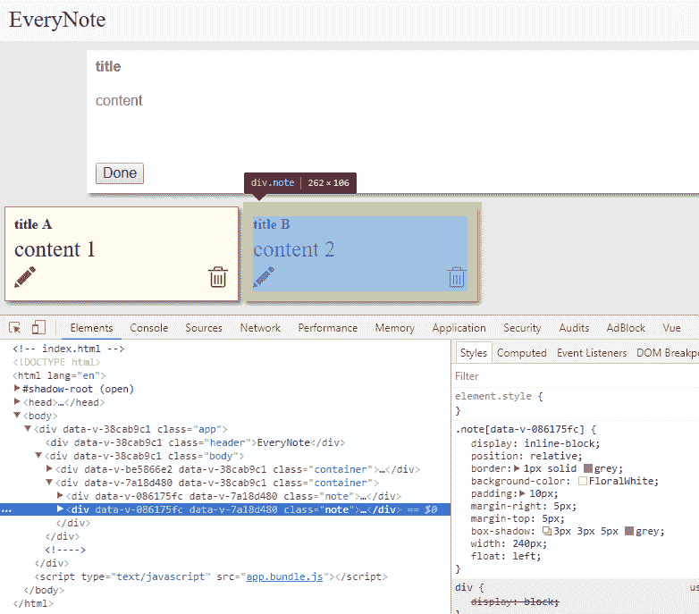
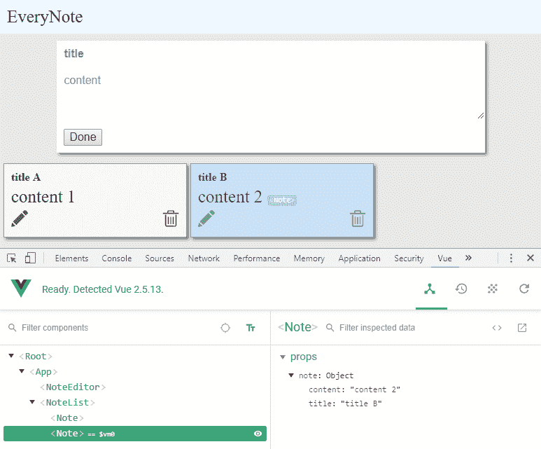
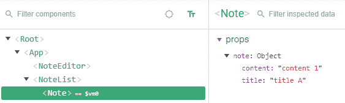
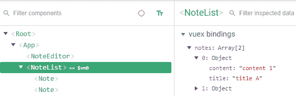
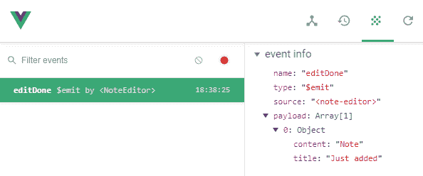
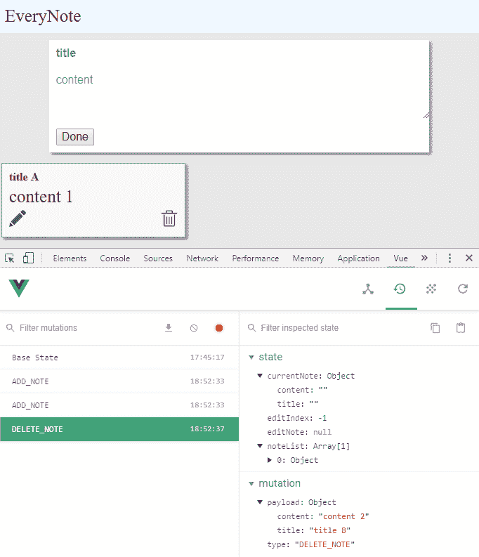
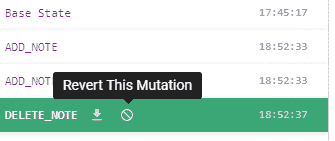
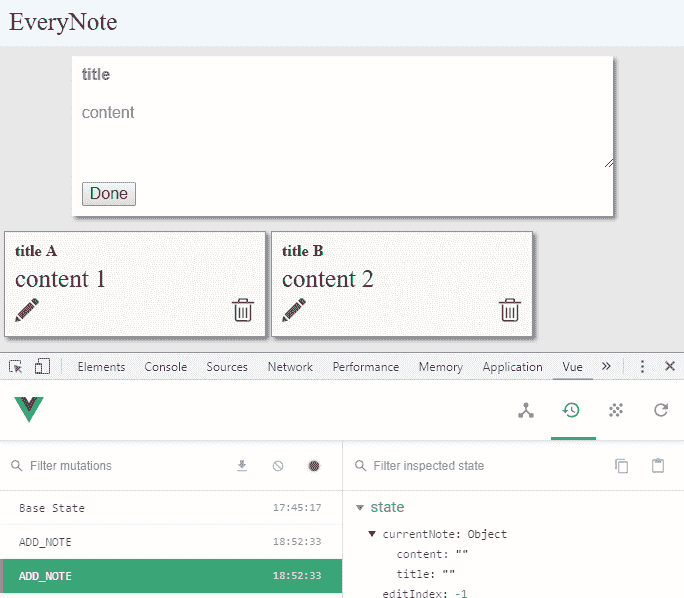
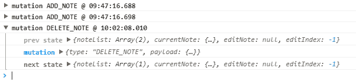

# Vuex 应用程序调试

通过使用测试驱动开发来开发你的应用程序，你可以显著减少调试时间。尽管如此，仍然会有一些代码无法按预期工作或微小的错误隐藏在你的代码中。

幸运的是，浏览器提供了开发者工具来帮助前端开发者调试他们的应用程序，Vue 提供了 vue-devtools。

在下一章中，我们将学习以下内容：

+   使用 vue-devtools

+   使用内置的日志插件

为了理解这一章，你需要具备基本的 Chrome 开发者工具知识。

# 使用 vue-devtools

Vue.js 提供了 vue-devtools 工具，帮助程序员调试 Vue 应用程序。Vuex 通过增强此工具来跟踪每个提交的突变。

你可以将此实用程序作为 Chrome 或 FireFox 的扩展程序安装，或者你可以导航到 [`github.com/vuejs/vue-devtools`](https://github.com/vuejs/vue-devtools) 以获取安装说明。

通过输入 `npm start` 启动 *EveryNote* 应用程序，使用已安装 vue-devtools 的 Google Chrome 打开 `http://localhost:8080/`，然后按 *F12*。

# 组件检查器

如果你选择 Chrome 开发者工具中的元素标签页，你会看到如下截图所示的内容：



图 4.1：Chrome 开发者工具，元素标签页

在元素标签页下方，你可以看到 *EveryNote* 应用程序当前的 DOM 树。选中的 `div` 是包含第二个笔记的元素。

通过将 DOM 结构映射回我们刚刚编写的 Vue 组件，你可以理解选中的元素是组件 `Note` 的根元素。难道不是看到 `<Note>` 而不是详细的 `Note` DOM 元素结构更好吗？

现在选择 Vue 标签页，你会看到如下截图所示的内容：



图 4.2：Chrome 开发者工具中的 Vue 标签页。

一眼就能看到应用程序的结构，而不是组件的 DOM 元素。通过将鼠标移到组件上，相应的元素将在 HTML 页面中突出显示。如果你按下选择按钮 ()，你可以在 HTML 页面中选择一个元素，并在组件树中突出显示。

通过在“过滤组件”框下方的树中选择一个元素，你也会在`props`框架中看到它的属性，如下截图所示：



图 4.3：道具框架

如果选中的组件与 Vuex 有绑定，它将出现在同一个框中。接下来的截图是一个示例：



图 4.4：Vuex 组件绑定

这样，就可以轻松地在页面内的 Vue 组件之间移动，并查看它们的状态。

我们将要看到的下一个功能是事件检查器。

# 事件检查器

观察组件状态很有用，但如果我们还能记录组件之间的交互会更好。实际上，vue-devtools 提供了另外两个功能：事件和 Vuex 变更记录。

在下面的截图中，您可以看到 vue-devtools 的过滤事件部分：



图 4.5：过滤事件部分

例如，我添加了一个笔记，因为这个动作，过滤事件标签页记录了在`NoteEditor`内部触发了`editDone`事件。它还显示了事件有效载荷。

最后，我们将探索一个 Vuex 专用标签页。

# Vuex 时间旅行

通过按 Vue 按钮进入 Vuex 部分 ，您将能够记录所有提交的 Vuex 变更。以下截图显示了此功能：



图 4.6：Vuex 时间旅行标签页

如您所见，应用程序加载后，已添加了两个笔记。这些笔记是由于由`loadNotesFromServer`动作触发的对假设服务器的虚假调用而添加的。

之后，我点击了第二个笔记的删除按钮。实际上，记录的第三个变更是`DELETE_NOTE`。您可以看到每个变更的状态和变更有效载荷，甚至可以撤销提交，如下面的截图所示，我正准备撤销`DELETE_NOTE`变更：



图 4.7：撤销 DELETE_NOTE 变更

由于撤销操作，应用程序状态恢复到之前的变更，应用程序再次显示第二个笔记，如下面的截图所示：



图 4.8：撤销 DELETE_NOTE 变更后的应用程序状态。

当您想要调试一个动作及其对应的变更时，撤销变更的能力非常有用：您可以使用 Chrome 开发者工具中的源代码标签页在动作代码中设置断点，然后执行和回滚变更，直到满足需求。请注意，如果您在提交变更后使用 Chrome 调试器重新启动动作代码，则应用程序状态已经更改，第二次执行会受到新状态的影响。相反，如果您撤销提交，则可以安全地重新执行一段代码，而无需重新加载整个页面。

最后，状态框架上方的两个按钮让您可以从剪贴板导出和导入应用程序状态。

# 启用 Vuex 内置的日志插件

Vuex 提供了一个内置插件来记录每个变更。它可以按如下方式添加到应用程序存储中：

```js
// src/store/index.js
import createLogger from 'vuex/dist/logger';
// ...

const debug = process.env.NODE_ENV !== 'production';
const plugins = debug ? [createLogger({})] : [];
const store = new Vuex.Store({
  state: {
   // ...
  },
  mutations,
  actions,
  strict: debug,
  plugins,
});
```

对于*EveryNote*应用程序的结果输出如下：



图 4.8：Vuex 内置日志插件

如您在先前的截图中所见，它不仅记录了变更名称，还记录了前一个和下一个状态。

你可以在这一阶段通过输入以下命令来下载代码：

```js
git checkout step-6_vuex-built-in-logger
```

# 摘要

在本章中，我们介绍了 vue-devtools 的功能，并引入了 Vuex 内置的日志插件。但 Vuex 插件究竟是什么呢？

嗯，这就是第五章的主题，*使用 Vuex 插件系统*；在接下来的几页中，我们将学习 Vuex 插件是什么，以及我们如何编写一个自定义插件。
