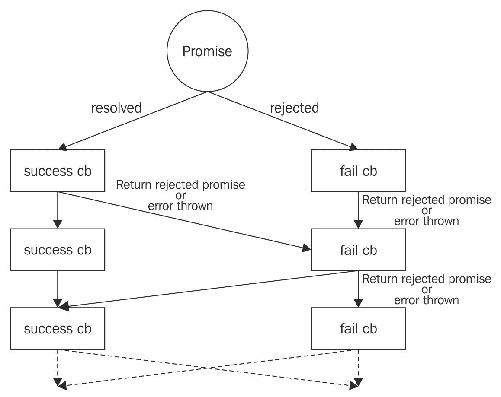

# 使用 Vuex 插件系统

在前面的章节中，我写到了使用 Vuex 插件系统持久化 *EveryNote* 应用程序状态的可能性。我们还了解了一个内置的记录器插件，用于记录每个突变。但是，Vuex 插件究竟是什么？我们如何编写一个自定义插件？

在以下页面中，您将：

+   了解 Vuex 插件系统

+   向 *EveryNote* 应用程序添加两个有用的插件

+   编写一个用于跟踪用户与您的应用程序交互的 Google Analytics 插件

+   开发一个撤销/重做插件

# 技术要求

您需要在系统上安装 Node.js。最后，为了使用本书的 Git 仓库，用户需要安装 Git。

本章的代码文件可以在 GitHub 上找到：

[Vuex 快速入门指南第六章](https://github.com/PacktPublishing/Vuex-Quick-Start-Guide/tree/master/chapter-6)

[Vuex 快速入门指南第六章承诺](https://github.com/PacktPublishing/Vuex-Quick-Start-Guide/tree/master/chapter-6-promises)

查看以下视频以查看代码的实际效果：

[Vuex 快速入门指南第六章链接](https://goo.gl/aZjE63)

# 理解 Vuex 插件系统

Vuex 插件是一个函数，它接受应用程序存储作为唯一参数，并可以订阅突变。

下面是一个插件示例：

```js
const consolePlugin = (store) => {
store.subscribe((mutation, state) => {
    // called after every mutation.
    // The mutation comes in the format of { type, payload }.
    console.log(mutation, state);
  });
};
```

您可以将插件添加到存储中，如下所示：

```js
const store = new Vuex.Store({
  // ...
  plugins: [consolePlugin]
});
```

与组件一样，插件不能直接更改状态；它们必须提交一个突变。

例如，假设我们想显示最后一次提交突变的时间。我们可以编写一个插件如下：

```js
// src/store/plugins.js
// ...
const lastEditDate = (store) => {
  store.subscribe((mutation) => {
    if (mutation.type !== types.UPDATE_LAST_EDIT_DATE) {
      store.commit(types.UPDATE_LAST_EDIT_DATE);
    }
  });
};
```

由于我们可以订阅每个突变并接收新状态，我们可以使用 `localStorage` 持久化应用程序状态。实际上，有一个名为 `vuex-persistedstate` 的插件正是这样做的。您可以在以下页面了解更多关于此插件的信息。

# 使用两个插件增强 EveryNote

如果您在 Google 上搜索 *Vuex 插件*，您可能会找到各种不同目的的插件。我选择了您可能在下一个 Vuex 项目中想要使用的两个插件。这些插件是：

+   vuex-persistedstate

+   vuex-router-sync

我们将使用第一个插件来使用 `localStorage` 保存 EveryNote 状态，这样每次浏览器页面重新加载时就不会丢失所有笔记。

如果您正在创建一个单页 Web 应用程序，强烈建议您使用第二个插件，即 vuex-router-sync。在这种情况下，您已经使用了 vue-router，vuex-router-sync 将同步当前路由，作为 Vuex 存储状态的一部分。

# 使用 vuex-persistedstate 保存应用程序状态

当前 *EveryNote* 应用程序显示两个假笔记，并且每次您重新加载页面时都会丢失新创建的笔记。通过添加 `vuex-persistedstate` 插件，笔记将使用 `localStorage` 保存。

要添加 `vuex-persistedstate` 类型，请输入以下内容：*

```js
npm install --save vuex-persistedstate
```

之后，我们需要将其添加到插件列表中：

```js
// src/store/index.js
// ...
import createPersistedState from 'vuex-persistedstate';
// ...

plugins.push(createPersistedState());
const store = new Vuex.Store({
  state: {
   // ...
  },
  mutations,
  actions,
  strict: debug,
  plugins,
});
```

最后，我们需要从模拟 API 中删除两个假笔记：

```js
// src/api/api-mock.js
export default {
  fetchAllNotes() {
    return Promise.resolve([]);
  },
};
```

从现在开始，如果您添加一个笔记然后重新加载页面，那个笔记仍然会存在。

`vuex-persistedstate` 具有高度的可配置性，可以将应用程序状态持久化到每个同步存储。例如，如果您想当应用程序页面关闭时重置状态，您可以将其配置为使用 `sessionStorage`，而不是 `localStorage`。

您可以在以下位置找到更多信息：[`github.com/robinvdvleuten/vuex-persistedstate`](https://github.com/robinvdvleuten/vuex-persistedstate)。

# 使用 vuex-router-sync 同步路由数据

如果您在应用程序中使用 vue-router，您可能还希望使用 vuex-router-sync，因为它在插件网站上说明，*它* *同步 vue-router 的当前 $route 作为 vuex 存储状态的一部分*。

要安装此插件，请输入：

```js
npm install vuex-router-sync --save
```

要将其添加到 *EveryNote* 应用程序中，您需要将 vue-router 添加到项目中：

```js
npm install vue-router --save
```

并按如下方式修改 `src/store/index.js`：

```js
// src/store/index.js
import { sync } from 'vuex-router-sync';
// ...

const store = new Vuex.Store({
  state: {
   // ...
  },
  mutations,
  actions,
  strict: debug,
  plugins,
});

sync(store, router);
// ...
```

但它是如何工作的？每次路由变化时，此插件都会更新 `store.state.route` 属性。此属性由以下内容组成：

```js
store.state.route.path // current path (string)
store.state.route.params // current params (object)
store.state.route.query // current query (object)
```

要更新存储属性，它提交一个 `route.ROUTE_CHANGED` 突变，其中 `route` 是 vuex-router-sync 插件模块的默认名称。

您可以更改它使用的模块名称如下：

```js
sync(store, router, { moduleName: 'CustomRouteSyncModule' } );
```

为了以编程方式更改路由，请使用 vue-router；不要修改 `store.state.route`。

您可以在以下位置找到更多信息：[`github.com/vuejs/vuex-router-sync`](https://github.com/vuejs/vuex-router-sync)。

在以下页面中，我们将开发一个使用 vuex-router-sync 将页面浏览量发送到 Google 服务器的 Google Analytics 插件。

# 开发一个 Google Analytics 插件

在以下页面中，我将假设您熟悉 Google Analytics，并且已经正确配置了应用程序中的 Google Analytics 跟踪。如果不是这样，您可以 Google 它，了解它是如何工作的，然后回来这里。对基本概念的了解就足够您继续阅读以下页面。

第一步是将此 Google Analytics 跟踪代码片段添加到 `index.html` 文件中：

```js
<!-- index.html -->

<!-- Global site tag (gtag.js) - Google Analytics -->
<script async src="img/js?id=GA_TRACKING_ID"></script>
<script>
  window.dataLayer = window.dataLayer || [];
  function gtag(){dataLayer.push(arguments);}
  gtag('js', new Date());

  gtag('config', 'GA_TRACKING_ID');
</script>
```

之后，将有一个全局的 `gtag(...)` 函数可用于向 Google Analytics 服务器发送事件。

通常，应用程序会跟踪页面浏览量和一些事件。要向 Google Analytics 服务器发送事件，只需编写以下内容：

```js
gtag('event', 'MUTATION_NAME');
```

使用前面的代码，我们可以编写一个插件，为每个突变发送一个 Analytics 事件，如下所示：

```js
// src/store/plugins.js
// ...
export const googleAnalytics = (store) => {
  store.subscribe((mutation) => {
    gtag('event', mutation.type);
  });
};
```

为了发送页面浏览量，我们可以利用每次位置变化时提交的 vuex-router-sync`route.ROUTE_CHANGED` 突变。

我们可以相应地更新 Analytics 插件，如下所示：

```js
// src/store/plugins.js
import analytics from '../gtag';
// ...
export const googleAnalytics = (store) => {
  store.subscribe((mutation, state) => {
    if (mutation.type === 'route/ROUTE_CHANGED') {
      analytics.sendPageView(state.route.path);
    } else {
      analytics.sendEvent(mutation.type);
    }
  });
};
```

其中 `analytics` 对象类似于：

```js
// src/gtag/index.js
const GA_TRACKING_ID = 'GA_TRACKING_ID';

class GtagAnalytics {
  static sendEvent(action) {
    gtag('event', action);
  }

  static sendPageView(pagePath) {
    gtag('config', GA_TRACKING_ID, { page_path: pagePath });
  }
}

export default GtagAnalytics;
```

您可能不想发送所有突变作为分析事件；在这种情况下，您可以创建一个包含您想要发送的突变类型的映射，或者一个包含您不希望发送的突变类型的列表。

您可以通过输入以下内容下载带有 Google Analytics 插件的 EveryNote 代码：

```js
git checkout chapter-5/step-7_google-analytics-plugin
```

# 开发一个撤销/重做插件

我们刚刚编写的 Google Analytics 插件是 Vuex 插件系统如何被利用来向您的应用程序添加功能的一个好例子，而不需要触及应用程序核心代码。但是，对于更复杂的插件呢？Vuex 插件也适合更复杂的操作吗？嗯，当然，它是！在接下来的几页中，我们将开发一个撤销/重做插件，这仍然是一个简单但非平凡的例子。

我们可以利用这样一个事实：在使用 Vuex 系统时，我们有一个单一集中的状态，并且这个状态只能通过突变来修改。想法是每次状态被修改时都拍摄一个快照。然后，要回到突变历史，只需将当前状态设置为快照即可，这代表了一个突变发生之前的较旧状态。

让我们先创建一个插件，该插件注册了一个名为`undoRedo`的模块：

```js
store.registerModule(moduleName, {
  namespaced: true,
  getters: {
    canUndo() {}, // Tells if undo can be performed
    canRedo() {}, // Tells if redo can be performed
  },
  state: {
    currentPosition: 0, // Position in the history
    snapshots: [], // Snapshots taken
  },
  mutations: {
    [UNDO]() {}, // Mutation to undo last mutation
    REDO {}, // Mutation to redo last mutation
    [UPDATE_CURRENT_POSITION](){},//update currentPosition
    [UPDATE_SNAPSHOTS](){}, //update snapshots 
  },
});
```

在前面的代码中，我们定义了两个状态属性：

+   **currentPosition**：这代表当前快照的索引。当提交撤销突变时，我们减少索引；当提交重做突变或其他突变时，索引增加。

+   **snapshots**：这是一个包含状态快照的数组。

之后，我们需要两个相应的突变来更新这些属性，以及一个`UNDO`和一个`REDO`突变，以便让插件客户端撤销或重做修改。

最后，我们提供了两个获取器，`canUndo()`和`canRedo()`，以公开插件的撤销/重做状态。

我们现在可以订阅突变，以便每次应用程序状态发生变化时都拍摄一个快照：

```js
const undoRedoPlugin = (store) => {
  function takeStateSnapshot(state) {
    // ...
  }

  function restoreStateSnapshot(state, toRestore) {
    // ...
  }

  store.subscribe(({ type }, state) => {
    if (mutationsToExclude[type] === undefined) {
      const index = state[moduleName].currentPosition + 1;
      const snapshots = state[moduleName].snapshots.slice();
      snapshots.length = index + 1;
      snapshots[index] = takeStateSnapshot(state);
      store.commit(currentPositionType, index);
      store.commit(updateSnapshotType, snapshots);
    }
  });

  store.registerModule(moduleName, {
    // ...
  });
};
```

当然，有一些突变必须排除，例如`snapshots`或`currentPosition`属性的突变，以及插件用户可能想要排除的突变，例如如果应用程序中使用了`vuex-router-sync`，则`route/ROUTE_CHANGED`。

我们现在可以按照以下方式实现撤销/重做突变：

```js
store.registerModule(moduleName, {
  namespaced: true,
  getters: {
    canUndo({ currentPosition }) {
      return currentPosition >= 1;
    },
    canRedo({ currentPosition, snapshots }) {
      return currentPosition < snapshots.length - 1;
    },
  },
  state: {
    currentPosition: 0,
    snapshots: [takeStateSnapshot(store.state)],
  },
  mutations: {
    UNDO {
      if (store.getters[canUndoGetter]) {
        state.currentPosition--;
        const { snapshots } = state;
        const snapShot = snapshots[state.currentPosition];
        restoreStateSnapshot(store.state, snapShot);
      }
    },
    REDO {
      if (store.getters[canRedoGetter]) {
        state.currentPosition++;
        const { snapshots } = state;
        const snapShot = snapshots[state.currentPosition];
        restoreStateSnapshot(store.state, snapShot);
      }
    },
    UPDATE_CURRENT_POSITION {
      state.currentPosition = value;
    },
    UPDATE_SNAPSHOTS {
      state.snapshots = value;
    },
  },
});
```

如您所见，前面的代码只是关于恢复正确快照的。

在拍摄快照时，不应考虑每个状态属性，并且每个快照必须是状态的副本。以下代码显示了这些概念：

```js
function takeStateSnapshot(state) {
  const toClone = {};
  Object.keys(state).forEach((key) => {
    if (statePropsToExclude[key] === undefined) {
      toClone[key] = state[key];
    }
  });

  return JSON.stringify(toClone);
}

function restoreStateSnapshot(state, toRestore) {
  const clone = JSON.parse(toRestore);
  Object.keys(clone).forEach((key) => {
    state[key] = clone[key];
  });
}
```

最后，我们可以提供一个工厂方法来创建和配置撤销/重做插件。以下是完全的插件代码：

```js
// src/store/undo-redo-plugin.js
export default (options) => {
  const moduleName = 'undoRedo' || options.moduleName;
  const UNDO = 'undo';
  const REDO = 'redo';
  const UPDATE_CURRENT_POSITION = 'UPDATE_CURRENT_POSITION';
  const UPDATE_SNAPSHOTS = 'UPDATE_SNAPSHOTS';
  const undoType = `${moduleName}/${UNDO}`;
  const redoType = `${moduleName}/${REDO}`;
  const currentPositionType =
    `${moduleName}/${UPDATE_CURRENT_POSITION}`;
  const updateSnapshotType =
    `${moduleName}/${UPDATE_SNAPSHOTS}`;
  const canUndoGetter = `${moduleName}/canUndo`;
  const canRedoGetter = `${moduleName}/canRedo`;

  const statePropsToExclude = {
    [moduleName]: '',
  };
  if (options.statePropsToExclude) {
    options.statePropsToExclude.forEach((toExclude) => {
      statePropsToExclude[toExclude] = '';
    });
  }

  const mutationsToExclude = {
    [undoType]: '',
    [redoType]: '',
    [currentPositionType]: '',
    [updateSnapshotType]: '',
  };
  if (options.mutationsToExclude) {
    options.mutationsToExclude.forEach((toExclude) => {
      mutationsToExclude[toExclude] = '';
    });
  }

  const undoRedoPlugin = (store) => {
    function takeStateSnapshot(state) {
      const toClone = {};
      Object.keys(state).forEach((key) => {
        if (statePropsToExclude[key] === undefined) {
          toClone[key] = state[key];
        }
      });

      return JSON.stringify(toClone);
    }

    function restoreStateSnapshot(state, toRestore) {
      const clone = JSON.parse(toRestore);
      Object.keys(clone).forEach((key) => {
        state[key] = clone[key];
      });
    }

    store.subscribe(({ type }, state) => {
      if (mutationsToExclude[type] === undefined) {
        const index = state[moduleName].currentPosition + 1;
        const snapshots = state[moduleName].snapshots.slice();
        snapshots.length = index + 1;
        snapshots[index] = takeStateSnapshot(state);
        store.commit(currentPositionType, index);
        store.commit(updateSnapshotType, snapshots);
      }
    });

    store.registerModule(moduleName, {
      namespaced: true,
      getters: {
        canUndo({ currentPosition }) {
          return currentPosition >= 1;
        },
        canRedo({ currentPosition, snapshots }) {
          return currentPosition < snapshots.length - 1;
        },
      },
      state: {
        currentPosition: 0,
        snapshots: [takeStateSnapshot(store.state)],
      },
      mutations: {
        UNDO {
          if (store.getters[canUndoGetter]) {
            state.currentPosition--;
            const { snapshots } = state;
            const snapShot = snapshots[state.currentPosition];
            restoreStateSnapshot(store.state, snapShot);
          }
        },
        REDO {
          if (store.getters[canRedoGetter]) {
            state.currentPosition++;
            const { snapshots } = state;
            const snapShot = snapshots[state.currentPosition];
            restoreStateSnapshot(store.state, snapShot);
          }
        },
        UPDATE_CURRENT_POSITION {
          state.currentPosition = value;
        },
        UPDATE_SNAPSHOTS {
          state.snapshots = value;
        },
      },
    });
  };

  return undoRedoPlugin;
};
```

您可以通过输入以下内容下载带有撤销/重做插件的 EveryNote 代码：

```js
git checkout chapter-5/step-8_undo-redo-plugin
```

以这种方式实现的撤销/重做与不与其状态与服务器同步的应用程序配合得很好。通常，仅恢复先前状态是不够的，您还需要执行一个操作来更新服务器数据。例如，如果您撤销了一个删除的笔记，您需要将未删除的笔记数据发送到远程服务器。这意味着真正的撤销/重做功能是与应用程序相关的，并且我们编写的插件需要扩展以处理与远程服务器的同步。

# 使用承诺处理异步性

在一个真实的撤销/重做插件中，你可能会向服务器发送数据，这是一个异步操作。我们了解到必须在 Vuex 动作内部处理异步性。当你分发一个动作时，`store.dispatch('anAction')`，`dispatch`方法返回一个`Promise`。在接下来的页面中，我将解释如何使用`Promise`（一个相对较新的 JavaScript 特性）来处理异步操作。

在 JavaScript 中处理异步操作可能会很棘手。我见过一些因为程序员不知道如何处理异步代码而变得极其混乱的代码片段。

等待稍后可用的数据最糟糕的方式是轮询。*永远不要这样做*：

```js
// Just don't use this way!
let dataFromServer;

// ...

const waitForData = () => {
    if(dataFromServer !== undefined) {
        doSomethingWith(dataFromServer);
    } else {
        setTimeout(waitForData, 100);
    }
};
setTimeout(waitForData, 100);
```

上述例子可以使用回调函数重构：

```js
api.getDataFromServer((dataFromServer) => {
    // do something with dataFromServer
});
```

回调函数适用于简单的操作，但当你需要组合多个回调函数时，它们会很快变得难以管理。你有没有听说过“回调地狱”这个短语？

幸运的是，JavaScript 现在提供了`Promise`，这是一种处理异步操作简单的方法。使用`Promise`，前面的代码可以重写如下：

```js
api.getDataFromServer().then(function success(dataFromServer){
    // do something with dataFromServer
}, function fail(error) {
    // Handle the error
});
```

如果你不太熟悉 promise，请在谷歌上搜索并学习它们。接下来的章节将解释 promise 如何连接或并行执行，在我看来，这仍然不是程序员们很好地理解的。

# 连接 promise

`store.dispatch('action')`函数返回一个 promise。这允许程序员在执行另一个操作之前等待一个动作完成。

让我们看看一个在另一个动作完成后分发动作的例子：

```js
store.dispatch('action 1').then(() => {
    return store.dispatch('action 2');
}).then(() => {
    store.commit('mutation depending on action 1 and 2');
});
```

`Promise`的`then(callback)`方法返回另一个`Promise`，这个`Promise`将被回调函数返回的值解决。如果回调函数返回的值本身是一个`Promise`，它将等待这个第二个`Promise`完成。好吧，我知道——第一次听到这个概念时，这个概念听起来有点扭曲。我将在下面的例子中解释 promise 的连接：

```js
// Creates a resolved promise with a return value 'A'
const p1 = Promise.resolve('A'); 

console.log('start');
// Chaining promises
p1
  .then(result => result + 'B')
  .then(result => asyncEcho(result + 'C')) // wait 1000 ms
  .then(result => console.log(result))
console.log('end');

function asyncEcho(echoMsg) {
    return new Promise(resolve => {
        setTimeout(() => resolve(echoMsg), 1000);
    });
}
```

结果输出如下：

```js
start end
// after 1000 ms
ABC
```

首先，同步代码被执行，打印出`start`和`end`，然后执行 promise 链。在链的中间步骤，一个在 1000 毫秒后解决的 promise 从回调函数中返回。这使得链的最后一个`then(...)`在执行最后一个回调之前必须等待`asyncEcho(...)`promise 解决。

直到链式 promise 解决，代码执行会从一个`then()`移动到另一个。但是当一个 promise 被拒绝时会发生什么呢？让我们看看另一个例子：

```js
// Creates a resolved promise
const p1 = Promise.resolve(); 

// Chaining promises
p1
  .then(() => {console.log(1); return asyncFail();})
  .then(() => console.log(2), // success
        () => console.log('Fail 2')) // fail
  .then(() => {console.log(3); throw 'An error';}, // success
        () => console.log('Fail 3')) // fail
  .then(() => console.log(4), // success
        () =>{console.log('Fail 4');return Promise.reject()}) 
  .catch(()=> console.log('Catch called'));

function asyncFail() {
    return new Promise((resolve, reject) => {
        setTimeout(reject, 1000);
    });
}
```

结果输出如下：

```js
1
Fail 2
3
Fail 4
Catch called
```

你得到了正确的输出吗？或者你期望在`Fail 2`行后看到`Fail 3`？这是一个常见的错误。只有当回调函数内部发生错误或返回一个被拒绝的 promise 时，链的下一步的失败回调才会执行。在其他所有情况下，执行的是下一个成功回调，即使前一步的失败回调正在执行。

以下图解释了这个概念：



图 2.1：链式调用 promises

# promises 的并行执行

现在我们知道了如何链式调用 promises，我们也知道了如何链式调用 Vuex actions，因为`store.dispatch(...)`方法返回一个 promise。但如果我们想并行执行两个或更多操作并等待所有操作完成呢？`Promise`对象提供了一个`Promise.all([p1, p2, ..., pn])`方法，它返回一个 promise，在所有提供的 promises 都解决后解决，或者在提供的任何一个 promise 被拒绝时立即拒绝。让我们看一个例子：

```js
const p1 = asyncEcho('A', 500);
const p2 = asyncEcho('B', 1000);
const e = asyncFail('E1', 100);

Promise.all([p1, p2]).then((values) => 
    console.log('OK', values));

Promise.all([p1, p2, e]).then(() => {
  console.log('this gets not executed');
}, (error) => {
  console.log('Err', error);
});

function asyncEcho(echoMsg, delay) {
    return new Promise(resolve => {
        setTimeout(() => resolve(echoMsg), delay);
    });
}

function asyncFail(error, delay) {
     return new Promise((resolve, reject) => {
        setTimeout(() => reject(error), delay);
    });
}
```

输出如下：

```js
Err E1 // After 100 ms
OK A, B // After 1000 ms
```

# 使用 promises 时的常见错误

最后，让我们看看使用`Promise`时犯的两个常见错误。

以下代码展示了当**`Promise`**构造函数回调被误解时会发生什么：**

```js
console.log(1);
buggyExecuteLater(() => console.log(3));
console.log(2);

function buggyExecuteLater(callback) {
  new Promise(() => callback());
}

// Output
// 1
// 3
// 2
```

传递给`new Promise(callback)`的回调函数是同步执行的。如果你想在当前 JavaScript 执行完成后立即安排某些事情，请使用`Promise.resolve().then(callback)`或`setTimeout(callback, 0)`。

以下代码展示了当程序员忘记返回一个被拒绝的 promise 时会发生什么：

```js
function iMayFail() {
  const rand = Math.random();
  const successP = Promise.resolve();
  const failP = Promise.reject();

  return rand < 0.5 ? successP : failP;
}

function buggyToss() {
  return iMayFail().then(
    () => 'Success', // Success callback
    () => 'Fail' // Fail callback
  );
}

buggyToss().then(
  result => console.log('Resolved ' + result),
  result => console.log('Rejected ' + result)
);

// Output is always 'Resolved Fail' or 'Resolved Success'
```

无论`Math.random()`返回什么，输出总是 Resolved Fail 或 Resolved Success，因为`buggyToss()`的`fail`回调没有抛出任何错误或返回一个被拒绝的 promise。以下是`buggyToss()`的正确版本：

```js
function correctToss() {
  return iMayFail().then(
    () => 'Success', // Success callback
    () => Promise.reject('Fail') // Fail callback
);
```

# 摘要

在本章中，我们探讨了 Vuex 插件系统的工作原理，我们扩展了*EveryNote*应用，添加了两个有用的插件，并从头开发了两款插件：一款 Google Analytics 插件和一款撤销/重做插件。此外，一般而言，我们看到了 Vuex 插件系统如何被利用来向我们的应用添加通用功能，而无需触及应用的核心代码。

最后我们理解了如何使用 JavaScript `Promise`特性处理异步操作。
